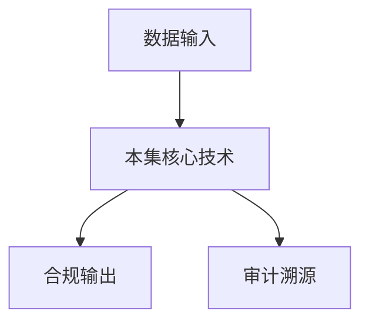

# P08 可信数据空间整体能力

← [[BV1ser5BDESU-总览]] | ← [[P07-可信数据空间标准体系]] | 下一篇 → [[P09-密态计算概念介绍]]

## 视频信息

| 项目 | 内容 |
|------|------|
| 分集 | 可信数据空间整体能力 |
| 模块 | 可信数据空间标准 |
| 时长 | 35 分 15 秒 |
| 链接 | [B 站 P8](https://www.bilibili.com/video/BV1ser5BDESU?p=8) |
| 官方文档 | [SecretFlow 文档](https://www.secretflow.org.cn/zh-CN/docs) |
| 内容来源 | 知识点增强（数据要素流通技术体系，非逐字转写） |

## 核心要点

1. **本 P 主题**：可信数据空间整体能力
2. **模块定位**：可信数据空间标准
3. **考试/实践侧重**：身份认证、使用控制、审计溯源、互联互通
4. **笔记层级**：教程级（约 2772 字），含速览、图解、场景 Walkthrough、自测题
5. **学习建议**：先通读「3 分钟速览」与「图解」，再读「详细讲解」；动手项见 Checklist

> 以下内容基于数据要素流通与隐私计算技术体系撰写，对应 B 站分 P「可信数据空间整体能力」。**非 UP 逐字转写**；不看视频也可建立框架，看视频可对照「与视频对照表」深化。

## 本节在系列中的位置

**模块**：可信数据空间标准 · 系列第 **P08/47** 集。

**建议前置**：[[可信数据空间标准体系]]——建立本集所需背景。

**建议后续**：[[密态计算概念介绍]]——在本集能力之上继续深入。

依赖关系：政策(P01–P06) → 可信空间(P07–P08,P18) → 密态/隐私技术(P09–P24) → SecretFlow 工程(P25–P32) → 基础设施与案例(P33–P47)。

## 3 分钟速览

**可信数据空间整体能力** 是数据要素流通体系中的关键一课。读完本节你应能回答：① 核心概念定义；② 在「供得出—流得动—用得好—保安全」链条中的位置；③ 与隐私计算技术栈的衔接。考试/面试侧重：**身份认证、使用控制、审计溯源、互联互通**。

## 零基础导读

本节「可信数据空间整体能力」属于 **可信数据空间标准**。即便未看视频，也应先建立**制度—技术—场景**三层视角：政策类章节回答「为什么允许流」；技术类章节回答「如何安全地算」；案例类章节回答「真实行业怎么落地」。

第一遍阅读请盯住三个问题：本集**解决什么痛点**？**关键参与方**是谁？**交付物或能力边界**是什么？第二遍阅读时，把术语表抄到 Obsidian 双链笔记，与前后分 P 交叉引用。

## 详细讲解

### 1. 整体能力框架

可信数据空间整体能力覆盖「进得来、看得见、管得住、流得动、算得准、可追溯」。本 P 从运营视角介绍空间应具备的平台级能力，是 P07 标准体系的具体化落地。

### 2. 六大核心能力

| 能力 | 说明 | 关键技术 |
|------|------|----------|
| 可信接入 | 多方身份认证、设备信任 | PKI、远程证明、连接器 |
| 资源管理 | 目录、登记、版本、质量 | 元数据标准、数据资产台账 |
| 使用控制 | 用途/期限/次数/环境约束 | 数字合约、策略引擎、ODRL |
| 安全计算 | 空间内协作分析 | 联邦学习、MPC、TEE |
| 价值计量 | 贡献度、定价、结算 | 区块链存证、计量模型 |
| 审计溯源 | 全链路留痕 | 不可篡改日志、证据链 |

### 3. 数字合约与策略执行

**数字合约**将法律条款转化为机器可执行策略：
- 允许的操作：统计、建模、查询
- 禁止的操作：下载原始数据、二次分发
- 约束条件：时间窗、结果粒度、输出格式
- 违约处理：自动熔断、告警、追责

### 4. 互联互通能力

- **域内互通**：同一运营方下多连接器互认
- **跨域漫游**：不同空间间联邦目录、合约转译
- **与隐私计算平台对接**：Kuscia/SecretFlow 作为计算后端

### 5. 运营指标

| 指标 | 目标 |
|------|------|
| 接入时延 | 新参与方 onboarding < N 工作日 |
| 合约执行率 | 策略违规自动拦截 100% |
| 审计覆盖率 | 关键操作 100% 留痕 |
| 可用性 | 平台 SLA ≥ 99.9% |

### 6. 考试/实践要点

- 列举六大能力并各举一个技术实现
- 解释「使用控制」与「访问控制」区别
- 设计一个跨行企业营销场景的空间能力需求表

### 7. SLA 与运营

空间运营方应公布 SLA、投诉渠道、争议仲裁。参与方数据质量纠纷需**质量标签**与第三方认证支撑。

### 8. 商业模式

空间可收取接入费、交易佣金、算力费、增值服务费。公共数据空间可能政府补贴+市场化增值服务结合。

### 深化理解（可信数据空间整体能力）

将本节概念放入「数据二十条」四原则框架：它主要支撑哪一条原则？若去掉该能力，哪类数据流通场景会受阻？用一句话向非技术经理解释本节价值。

## 图解

## 类比与直觉

可信数据空间像**带门禁的联合办公室**：各方自带文件（数据）进共享会议室，按合约使用、出门留痕，原始文件不随便复印带走。

## 例题与场景 Walkthrough

**场景：两家机构联合建模（不共享明文）**

1. **样本对齐**：若双方仅有交集用户有价值，先用 PSI（P21/P28）对齐 ID。
2. **特征拼接**：纵向联邦（P24）下 A 方持标签、B 方持特征，梯度通过安全聚合更新。
3. **训练执行**：在 SecretFlow SPU（P27）上完成密态前向/反向，或 TEE 内明文训练（P11–P17）。
4. **模型发布**：输出评分服务；模型参数经评估后按需出域，训练数据永不出域。
5. **本集关联**：可信数据空间整体能力 提供其中 **身份认证** 能力。

## 常见误区

1. **「学完本集就会用隐语」**：SecretFlow 生态需多集串联（P19–P32），单集只是拼图一块。
2. **「隐私计算等于不上传数据」**：数据仍以密文、份额或授权方式参与计算，网络与算力开销客观存在。
3. **「TEE 绝对安全」**：TEE 依赖硬件与侧信道防护，需远程证明（P17）与补丁策略。
4. **「区块链解决一切确权」**：链适合存证与交易撮合，大规模计算仍在链下隐私计算引擎。

## 与视频对照表

| 视频段落（约） | 预期演示内容 | 笔记对应章节 |
|-------------|------------|------------|
| 开篇 0%–15% | 本集目标、背景、与前后集关系 | 本节位置、3 分钟速览 |
| 前段 15%–40% | 核心概念定义与架构图 | 零基础导读、详细讲解 |
| 中段 40%–70% | 原理展开、对比、政策/代码示例 | 图解、类比、Walkthrough |
| 后段 70%–90% | 案例、问答、易错点 | 常见误区、Checklist |
| 收尾 90%–100% | 总结、延伸资源 | 延伸阅读、自测题 |

> 本集总时长约 **35分15秒**。无官方外挂字幕时，以分 P 标题「可信数据空间整体能力」与上表主题对齐视频画面。

## 动手实践 Checklist

- [ ] 复述本集 3 个定义（不看笔记）
- [ ] 根据 Walkthrough 写 200 字场景短文
- [ ] 对照视频确认 1 个架构图/演示
- [ ] 在总览思维导图中标注本集节点
- [ ] 完成自测 Q1/Q5

## 延伸阅读

- [SecretFlow 文档中心](https://www.secretflow.org.cn/zh-CN/docs)
- TC609 可信数据空间相关标准
- 本系列相邻 2 个分 P 笔记

## 自测题

1. **本集核心考点？**  
   **答**：身份认证、使用控制、审计溯源、互联互通。

2. **本集在四原则中的位置？**  
   **答**：偏流得动基础设施。

3. **与 SecretFlow 的关系？**  
   **答**：提供合规与架构前提，后续技术集在其上落地。

4. **一项落地检查？**  
   **答**：是否有授权、是否最小必要、是否可审计——三者缺一不可。

5. **30 秒口述本集？**  
   **答**：用「输入→处理→输出」各一句话概括（见 Walkthrough）。

## 关键术语

| 术语 | 说明 |
|------|------|
| 数据要素 | 可参与社会化配置、创造价值的数字化资源 |
| 隐私计算 | 数据可用不可见前提下实现协作计算的技术体系 |
| 使用控制 | 约定用途、次数、期限 |
| 连接器 | 参与方接入节点 |

## 与前后分 P 的衔接

- ← **可信数据空间标准体系**（[[P07-可信数据空间标准体系]]）
- → **密态计算概念介绍**（[[P09-密态计算概念介绍]]）

## 逐字转写
> 引擎: whisper | 状态: 已转写 | 格式: 段落化

### [00:00 - 00:40] 大家好,我是肝臟華,花明蜜樂,
大家好,我是肝臟華,花明蜜樂,蚂蜜蜜蒜蜜天產品負責人,今天由我來給大家介紹數據要素可行流動基督莫可可成的蜜態可行數據空間整理產品能力介紹。本課程將分為上個部分,第一部分數據要素流通和蜜態計算。我們將為大家來介紹數據要素流通的發展趨勢,它明天的問題。來作為蜜態計算,我們這個產品的背景介紹。第二部分,蜜態可行數據空間發案,我們將從整理上為大家來介紹蜜態可行數據空間發案的功能構成,我們的實驗特色。

### [00:40 - 01:30] 第三部分,典型時間案例,我們將
第三部分,典型時間案例,我們將用醫療和金融兩個行業的案例來為大家介紹蜜態可行數據空間在行業裏面的落地以及為行業帶來的價值。一部分,數據要素流通和蜜態計算。數據要素的發展經歷了多個階段,從早期的以企業和機構自身的數據以單點和數據孤島形式為主的自身的數據應用的階段,，到了第二階段,隨著影子基段技術的蓬勃發展,通過影子基段提供的安全能力保證,，足力和阻力之間開始出現了臉對點式的數據要素流通。發展到今天,數據要素的區域化流通利用已經成為了一個很強的發展趨勢。

### [01:30 - 02:21] 在這個時候,我們需要類似於城市
在這個時候,我們需要類似於城市的資產水網一樣來建設數據化的行業地或者區域的數據化基礎設施。當區域化的可依數據產業未來,當區域化的數據流通已經充分發展以後,數據要素一定會走到跨行業、跨地域、跨技術平台的廣域的可依數據流通。與數據要素發展趨勢相對應,國家數據要素的戰略也在持續升級。國家宏觀認證支持數據要素和數據安全的發展,通過部署可依建設可依數據空間,推動實現數據要素安全和發展的平衡。數據安全的風險是導致目前各行業普遍對數據要素流通的相關數據供給不敢不願的最主要原因。

### [02:21 - 03:12] 在我們看來,影響數據要素流通的
在我們看來,影響數據要素流通的主要數據安全風險包括兩個不方便。一方面,要素流通從內循環到外循環。在外循環中,如果處理不當,導致高價屬數據的洩漏,將直接導致數據使用方的經濟利益受損。第二方面,國家個人信息保護法、時間安全法對個人數據的匯聚處理都有明確的法律規定。如果一旦處理不當,企業和機構的法律責任大,安全核規風險高,，數據流通在外循環中面臨的安全威脅是客觀存在的。數據要素20條通過三權分立,雖然從法規省面上解決了影響數據要素流通利用的相關障礙,，但是法規省面和記錄省面,自屬在巨大的gap的。

### [03:13 - 04:16] 在記錄省面,隨著數據加工使用權
在記錄省面,隨著數據加工使用權和數據經營權的轉移,，往往同時意味著數據持有權的浪度。在相關的報導中,我們可以經常看到,由於數據濫用、數據的主動洩漏、數據的被動洩漏,，導致的相關的主體和機構受到的經濟損失,或者一些社會負面的餘情的影響。IBM 2024年發布了數據洩漏成本的報告。在這個報告中,我們可以看到,全球每年數據安全造成的損失達到了百億到千億級別,，而且出現逐年地震的趨勢。從行業劃分來看,醫療行業和金融行業是數據安全洩漏導致的成本最高的兩個行業,，這也與當前我們的認知是一致的。

### [04:16 - 05:14] 這個兩個行業的數據是目前我們認
這個兩個行業的數據是目前我們認為價值相類較高的兩個行業。從導致數據洩漏的原因角度,樂意的內部人員作惡導致的數據洩漏,，以及數據的相關憑證的盜用和洩漏導致的安全問題,是兩個典型的原因。這也是我們在防止相關數據安全風險的時候要著力解決的兩個問題。數據匯聚的合規風險是導致目前行業公訴出現不敢約案不會困境的另外一個主要原因。不過相關的法律法規對於涉及到個人信息的違法行為處理是相當嚴重的。比如說非法獲取出售或者提供涉及到個人行為軌跡、通信內容等等高安全敏感級別的數據是超過50條以上的,，就會被認定為情節嚴重。

### [05:14 - 06:09] 同時,對相關機構對海量個人數據
同時,對相關機構對海量個人數據的匯集,比如說市集超過百萬條,省集超過一千萬條,，它的法律與責任都相當重大。如果涉及到相關的合規風險,對企業、對機構來說都是非常嚴重的事件。如果不能徹底解決上述兩類問題,那麼目前一向數據提供方不敢不願公訴的問題就不能得到解決。目前業界對這兩類問題的解決方案思路是什麼呢?，比如說對第一類數據安全泄漏風險,業界目前普遍的思路還是希望通過提供相關的數據使用控制技術,，來保證數據在一定的在相對可控的條件下進行流通。

### [06:09 - 06:23] 比如說可因數據空間的方案,通過
比如說可因數據空間的方案,通過數據合約和使用控制技術使用控制環境,來約定供需雙方在指定的環境按照合約規定的方式進行數據使用。

### [06:26 - 07:22] 另外一個問題,數據安全合約風險
另外一個問題,數據安全合約風險,業界常規和普遍的解決思路是對流通中涉及到個人信息進行數據去標識和匿名化。當然我們知道,對個人信息標識數據以及相關信息進行完全去標識化和完全匿名化,它往往意味著個人信息相關數據的價值撤離喪失。所以目前數標委在推動的,比如說面向數據流通的匿名化處理時指南和相關的評估辦法中,，解決方案思路是在相對有安全保障的受控環境中,讓數據在進行一定程度的去標識和匿名化,比如假名化的技術方式處理以後,，在受控環境中,讓供需雙方和多元數據進行融合、加工、進行價值的分析挖掘。

### [07:22 - 08:14] 那受控環境能保證這種一定程度的
那受控環境能保證這種一定程度的去標識和匿名化的數據,只能在受控環境中使用,，以及在受控環境中能夠把對這些數據的標識、規復以及個人信息洩漏的安全風險能降到最低。我們螞蟻密算在這兩類問題和行業的典型解決方案基礎上也發展出了我們的解決方案,，那就是密探可因數據空間的解決方案。那在第一個可因數據空間的方案裡面,我們通過在可因數據空間的記錄架構裡面籤入密探計算,，來保證數據安全的流通是全電路密探的和全電路聲可行管控的,那在下個上節我們將給大家做詳細的介紹。

### [08:14 - 09:12] 那在第二個數據安全合規的這個受
那在第二個數據安全合規的這個受控環境中,受控環境的這個數據安全合規這個面向數以流通匿名化處理這種實施的指南的相關的這個思路路徑下,，我們通過密探計算提供的安全環境來作為面向數以流通的這個受控環境,保證數據在密探計算環境中的進行融合加工,，保證數據在融合環境中是完全密探的,密探計算裡面的相關的計算是完全是由數據持有方來控制的。保證在密探計算環境中的數據與開放空間的數據是隔離是阻斷的,能夠保障這個數據在這個環境下不能進行標識恢復。

### [09:12 - 10:05] 第二個章節,密探可營數據空間,
第二個章節,密探可營數據空間,我們將介紹結合密探計算的密探可營數據空間的功能構成和業務特色。密探可營數據空間的核心是密探計算,那什麼是密探計算的?，密探是指數據進入流通進行共享計算直到銷毀了全過程中,原始數據經過加密處理特殊的技術處理。在沒有經過原始數據密探也就是說密探的持有方授權的情況下,任何方都沒法獲得原始數據狀態,這類技術。在下面圖裡面,數據在數據原也就是密探持有方的密探安全控制域範圍內控制熟。

### [10:05 - 11:13] 即使數據已經通過傳輸煉路,已經
即使數據已經通過傳輸煉路,已經進入到數據加工方的物理運位環境裡面,這個數據仍然全流程保持的是一個密探的狀態。數據加工方在包括數據加工方的高權限的數據運位人員管理人員,在沒有得到數據原密藥持有方的授權的前提的前提下,任何人都無法訪問到密探數據的原始數據。這樣就可以保證數據仍然在數據原的持有控制範圍內進行流通融合利用。這是數據不出獄,我們的數據要求流通要求的數據不出獄流通利用的一種具體的實踐路徑,就是數據通過密探安全控制獄來保證數據不出獄。

### [11:13 - 12:08] 這個也是我們為客戶提供的大規模
這個也是我們為客戶提供的大規模個人數據,海量高價值高敏感數據提供的一種最佳的安全和規的產品方案。那這張圖大家很熟悉,可因數據空間的記錄架構,在可因數據空間記錄架構裡面,我們密探計算通過提供密探的數據拖廣環境,密探的開發環境,密探的可行管控以及相關的密探聯繫器,，來保證數據按照數據空間的標準,進行互聯互通,進行交付使用的時候的全列入的密探和全流程的可行管控。那在密探機我們要講解密探計算的時候,往往要回答一下幾個問題,第一個是密探計算和傳統的隱私計算。

### [12:09 - 12:51] 在我們密探可行數據空間裡面,我
在我們密探可行數據空間裡面,我們同時兼容了第一代隱私保護計算和第二代隱私保護計算,也就是我們說的密探計算。第一代隱私保護計算,我們以營運的相關的多發營運計算等產品為我們的核心,大家知道營運的隱私保護,隱私計算技術是基於螞蟻金融在螞蟻內部的業務多年打磨,，目前已經是全球最大的隱私計算開源社區,我們已經有了三千多個決定的部署,在多個行業,多個機構主體,多個機構已經在很多的行業,很多機構生產環境下進行落地實踐。

### [12:52 - 13:42] 我們提出我們的第一代隱私保護計
我們提出我們的第一代隱私保護計算的主要記錄特徵就是輕量快速,我們通過開源社區通過這麼多的落地實驗案例來打磨我們的第一代隱私保護計算記錄產品。我們推出的第二代隱私保護計數的主要記錄特徵前面我們也講了多遍,全電路的密探保障,全流震的可行管控。相對於傳統的隱私計算,密探計算保證了密探的計算過程以及計算結果都是完全密探的。然後我們的數據,前面張傑我們也講了,我們數據在全流震密探的情況下,除了密藥持有方以外,任何人都看不到數據的揚文。

### [13:43 - 14:26] 我們通過密碼學來保證我們數據的
我們通過密碼學來保證我們數據的安全防空機的水位,同時我們通過密碼學來實現了系統安全邊界從複雜的一個跨主體跨節點系統收斂到了對密藥的管控上,讓系統的安全場狗做到最小化。我們另外一個經常需要回答的問題是密探計算和T1的區別。首先從定義上來說,密探計算是一種基於T1的隱私保護計算路線,也就是說,密探計算是一種T1技術。

### [14:28 - 15:28] 密探計算基於T1,但絕對不僅僅
密探計算基於T1,但絕對不僅僅是T1,我們一般理解上,T1是一種基於CPU,能夠提供對計算環境隔離性和機密性保護的一種技術。密探計算基於T1上面構建了一整套完整的記錄站,來保證我們前面說的數據要素流通過程中的全鏈路的密探保證和全流程對所有方和擁有方來說的全流程的可行保障能力。那首先,密探計算的基礎來自於可高度量,傳統的基於T1的度量是基於CPU的度量。基於CPU的度量,因為所有的度量的實現都在CPU內部,那對CPU的外部用戶來說這是個黑核實現,黑核的也意味著不透明。

### [15:29 - 16:21] 另外,基於CPU的度量,所以它
另外,基於CPU的度量,所以它常依賴於CPU實現。在目前國產化的趨勢下,也就是說我們把我們對整個可因計算對密探可因數以流通的所有的安寧基礎的保證邏輯都寄希望於CPU上,這個對目前我們國家形狀的要求肯定是不可接受的。所以密探計算,我們的所有核心的基礎都是基於TPM硬件、TPM芯片硬件的可高度量。基於TPM芯片,我們能完成從固件到超值系統內核,到超值系統,到應用的足承度量,能保證整個可信和機密計算環境中的應用它本身的代碼邏輯的安全。

### [16:21 - 17:16] 結合代碼拖管,以及我們代碼在開
結合代碼拖管,以及我們代碼在開源社區的廣泛推廣,以及國家相關權威機構對我們代碼的拖管我們的審核,結合可高度量,我們就能保證以及我們系統用的遠程對化解點的遠程應用的遠程度量和遠程證明報告,，我們就能保證對整個術語流通體系統裡面的相關應用和應用的身份驗證能形成一種邏輯閉環。另外,我們密探計算在傳統的機密容器、機密需求上我們做了多方面增強,比如說我們在超值系統上面上經營了相關的安全的加固,，能夠防止特權帳戶,能夠防止對一些分區的相關的攻擊。

### [17:17 - 17:56] 另外,我們能夠提供兼容過分類似
另外,我們能夠提供兼容過分類似標準接口的相關的容器管控能力,能夠天然的支持上層的基於容器的應用,能夠遷移到我們的密探計算這套記錄體系上來。另外,我們基於TM可靠度量來支持的可信密號服務,我們基於可信根能夠對整個系統內部和系統和系統之間的應用證書進行一套可信的高可靠的密號證書管理。

### [17:59 - 18:58] 另外,我們基於我們創新的密探膠
另外,我們基於我們創新的密探膠囊技術,通過對密探數據以及密探數據的使用策略,它的策略教驗進行封裝來提供完整的密探膠囊服務,然後實現跨節點和跨平台之間基於密探膠囊的可靠的全密探的流通。密探計算有哪些記錄特徵呢?通過提煉和總結,我們認為密探計算有六大記錄特徵。首先,全電路數據密探,我們在採存算用全電路讓數據保持密探,所有人員包括高權性的運用為人員、管理人員都接觸不到明文。我通過加密算法,使整個系統的安全負面場口收領到對密探的保護,可以有效地降低整個系統的安全管控成本。

### [18:59 - 19:26] 通過全電路的數據密探來杜絕了數
通過全電路的數據密探來杜絕了數據洩露的風險。第二點,全流程的可行管控。我們通過基於TEE構建的這套密探基段體系,為客戶交付一套可信的機密底座,提供了更高的安全水位,可以提供相對於等保四級的攻擊水位。

### [19:29 - 20:45] 另外一方面,我們通過TPM獨立
另外一方面,我們通過TPM獨立的硬件可行更新片,通過硬件杜糧、可行杜糧,以及對基於開安社區的代碼開源國家相關的安全機構對代碼的安全性評審,，以及委託國家傳媒機構進行的代碼託管,來實現從代碼到應用度量到應用身份的安全邏輯比環,，保證客戶基於一套應用身份可信驗證的所有的應用身份可信驗證的這套系統來進行數據的交付。另外,基於上面的機密底座和可信應用身份,我們對應用平台的主體的身份實名認證和跨越的全新管控,以及事前事中事後它所有的操作記錄的完整不可撞開的實際日的保存,來保證所有的實名主體在一套可靠的反應下,。

### [20:45 - 21:00] 在全流程的記錄存證的審查條件下
在全流程的記錄存證的審查條件下來進行數據的流通,從而保證全流程的可信管控防止數據的濫用。

### [21:04 - 22:06] 第三方面,高兼容性。通過TE提
第三方面,高兼容性。通過TE提供的這套計算框架,相對於傳統的隱私計算,比如多方安全學習,基於密碼學構建計算算子這種方式,它有更強的計算兼容性。可以版本版兼容明文生態下的數據倉庫、傳統數據庫、OIP、OITP的分析數據庫、事務性數據庫以及流式的計算、基於學習以及大模型的訓練推底等等多種計算模式。我們這套記錄站可以基於通用的國產化硬件和國產化硬件,我們同時兼容了X86、AM等多種的CPU記錄架構。通過我們的實際案例上的測算,目前我們的密碼計算可以以一種低成本長效運營的方式來為客戶提供。

### [22:07 - 22:48] 通過測算,我們可以保證密碼計算
通過測算,我們可以保證密碼計算的總體運行成本在明文計算的1.5倍之內。另外,嚴格按照國家數據記錄設施和可音數據空間的記錄架構,我們來構建了密碼可音數據空間,然後支持國家目前記錄設施要求的三統一和互聯互通。在國家要求的互聯互通記錄上,我們通過英語社區,通過我們的TE的互聯互通等等記錄標準來擴展這個互聯互通。因為我們認為,未來的數據要求流通一定是一個網絡,而對於網絡來說,互聯互通才是基礎才是關鍵。

### [22:49 - 23:23] 最後一個特徵,功能豐富,我們是
最後一個特徵,功能豐富,我們是業內少有的同時支持隱私保護計算,數據匿名化,數據殺箱,包括TE等等多種使用控制技術的廠家。我們同時支持多方案件計算,TE,密碼計算等多種的隱私保護計算路線,以及我們同時支持多種軟體功能規格和應驗配置的密碼計算解裂,數據連接器。

### [23:27 - 24:16] 下面我們從平台的各類角色的角度
下面我們從平台的各類角色的角度為大家更詳細的採取,什麼是全流程可行管控。平台的用戶角色主要包括數據提供方、數據使用方,以及為數據開發利用、提供數據開發、數據治理等等服務的數據服務提供方。平台運為方,以及對平台進行技術運為的平台運為方。這五類角色是平台的合法用戶,當然還包括對平台進行攻擊的惡意攻擊方。從數據提供方視角,平台提供的可行管控能力,能夠為數據提供方提供應用的可行度量,，讓數據提供方對自身數據的交付煉路的相關應用的身份進行可行驗證。

### [24:17 - 25:12] 平台提供的密碼數據膠囊技術,能
平台提供的密碼數據膠囊技術,能夠保證數據提供方對數據使用有完全的控制權限。保證數據提供方可以按照自己身的意願控制自己的數據在何時何地有什麼人用何種方式來使用。平台提供的跨越認證授權,能保證數據提供方對平台相關的主體的身份、主體的權限、主體的操作能進行完整的認證授權。可行者的審計功能能保證平台的所有用戶的所有操作流衡,而且不可撞開,為事後的相關審計工作提供關鍵的數據支撐。數據使用方的任何數據的吸出,都必須經過數據提供方的管控,包括數據立民化和數據加密。

### [25:15 - 26:05] 為平台提供相關數據開發和治理服
為平台提供相關數據開發和治理服務的數據服務方完全基於密文,基於核成數據進行開發,全流程接觸不到密文。數據開發方和數據治理服務方的相關加工邏輯、相關加工成果必須經過提供方的嚴格審核,才能完成最終的數據產品上架和出獄操作。包括平台運位方和平台運運運方在內的相關爵士,都僅僅只有治理業務權業範圍內的相關權限。比如說平台運位方,僅僅能夠對環境經營管理,以及做一些業務的供需撮合等等相關工作。平台運位方只能對平台的相關系統經營起庭、擴收容等等相關運位操作。

### [26:06 - 26:17] 運營方和運位方都不能超過自己的
運營方和運位方都不能超過自己的業務範圍,越權對數據進行訪問,接觸不到數據,也不能對數據進行一些違法的利用。

### [26:20 - 27:16] 對一些平台的非法用戶,也就是我
對一些平台的非法用戶,也就是我們稱為的惡意攻擊方來說,我們通過幾成的保護機制來保障惡意攻擊方,接觸不到核心的數據。首先,從我們提供的GTE的機密計算環境,從硬件層面上就隔離了這些惡意攻擊方,它不能通過正常途徑或通過一般常規的基礎手段,不能進入到密台計算環境面,也就是不能進入到機密虛擬環境面來。第二個,我們在我們的整個密台計算紀錄站裡面,對整個系統的操作系統進行的安全加固,對常規的一些漏洞進行的即時的漏洞屏蔽,惡意攻擊方利用不了常規的漏洞來對平台進行攻擊。

### [27:17 - 28:13] 此外,我們通過內層加密,通過對
此外,我們通過內層加密,通過對物理硬盤數據的加密,讓惡意攻擊方對數據讀不到也搬走了,也用不了。通過等等對所有相關方的這些能力構成了我們平台對數據提供的全流程可行管控能力。從業務架構上來說,我們通過密台可行數據空間提供的密台計算疏扭和隱私計算疏扭,以及我們完全按照數標為的數據空間紀錄架構來構建的這條密台可行數據空間。我們核心為供需雙方提供的兩個能力分別是對元端來說我們來解決數據元端的放心供給。

### [28:13 - 28:59] 我們為數據元端按照元端的數據不
我們為數據元端按照元端的數據不同的種類不同的安全等級提供了包括隱私計算,密台計算結錄也就是密台托管,以及在本地部署相關的密台計算節點,也就是本地計算的方式。對數據的需求方來說,我們強調是高效用數,我們提供的密台數據融合以及以多方安全計算等技術為代表的隱私計算技術,以及昂貴的數據產品的交付方式,比如API的數據級的方式,來滿足各種各樣的數據的使用場景和使用需求。

### [28:59 - 29:43] 下面兩圖是密台可依數據空間的功
下面兩圖是密台可依數據空間的功能架構圖,從整個架構上來說,我們完全符合國家數據基礎設施以及可依數據空間的紀錄架構要求,我們提供了完整的產品功能。數據空間服務平台和數據連接器是完全按照可依數據空間紀錄架構來進行開發設計的,支持按照國家紀錄設施要求的三統一方式與行業區域功能節點,與第三方數據空間和流動利用平台進行互聯互通。

### [29:43 - 30:12] 我們在可依數據空間紀錄架構裡面
我們在可依數據空間紀錄架構裡面,嵌入了我們的核心的密台計算書紐和隱私計算平台,通過我們密台計算提供的全電路數據密台,全電路的可依管控,也就是我們的密台可依管控的相關能力,來保證數據在跨節點,以及在連接器和連接器之間的數據交付連路的安全可控。

### [30:20 - 31:14] 用醫療和金融兩個行業的兩個案例
用醫療和金融兩個行業的兩個案例來介紹密台可依數據空間的典型落立時間。另一個案例,醫保行業可依數據空間負能商保,醫保數據是一類典型的高敏感高價值數據。一方面,各保法非常明確地把醫保數據定義為敏感數據,所有涉及到醫保數據的開發利用都必須滿足各保法的安全合規要求。另外一方面,商業化保險巨大的市場以及國家對建設多層次醫療保障體系的客觀需求都讓醫保數據負能成為行業的新方向。如何在保障數據安全合規的利用的前提下,讓醫保數據得到充分的流動利用,是當下必須解決的問題。

### [31:15 - 32:05] 螞蟻密算提供的密台可依數據空間
螞蟻密算提供的密台可依數據空間方案,是解決這類問題的理想解決方案。通過密台可依數據空間提供的端道端安全能力和全鏈路的全流程的可依管控能力,使得醫保數據在相對充分的匿名化處理之後進入到密台可依數據空間,，與社會數據充分的融合利用,使得醫保數據精準負能商保成為可能。通過接合醫保數據,商業化保險公司可以顯著降低自己的運營成本,進一步降低商業化保險產品的購置成本,對推動商業化保險市場的發展起到了很好的促進作用。

### [32:05 - 32:52] 快賠和直賠是商保裡面兩個比較典
快賠和直賠是商保裡面兩個比較典型的場景,快賠和直賠的區別是,直賠是在醫保報銷之後可以馬上進行賠付,快賠可能會有一定的延時。兩者的主要區別是在賠付流程上有些區別。他們兩者的核心的這個計算邏輯和醫保數據的結合計算邏輯是一次的,也就是說利用醫保的報銷數據。因為醫保報銷數據本身會去核查患者的就診數據的真實性,就診的住院數據、門診數據等等這些數據來做醫保的報銷。

### [32:53 - 33:41] 那基於這個數據,商保公司可以把
那基於這個數據,商保公司可以把自己的商保合保規則直接放到密打可行數據工裡面,利用實質發生的醫保報銷,醫保的就診和報銷相關數據進行理商規則的核查和驗,最終計算出商保的這個報銷額度數據。基於這個數據來進行快賠和直賠的相關流程。從數據鏈中上來說,可以保證醫保數據在密打可行數據空間這個環境裡面去使用,原則數據不出獄。整個計算過程的這個煉路是可追溯的,計算結果也需要通過嚴格授權才能流轉到這個商保公司來,最終的這個商保報銷流程裡面來使用。

### [33:42 - 33:58] 整個這個數據的加密流轉過程中可
整個這個數據的加密流轉過程中可以保證醫保數據,可以在未授權的情況下,不會提供給未授權的第三方角色能夠訪問到。從而保證這個數據的安全合規使用。

### [34:02 - 34:25] 第二案例是進入行業的,市長監管
第二案例是進入行業的,市長監管總局一馬龍通密打計算空間。這個案例在上個月九月份國家數據局作為數據基礎設施建設典型案例做了發布,通過構建信用數據的密算基座激活融資增新生態。這裡面用的核心數據是全國組織機構統一社會信用代碼這個數據。

### [34:27 - 35:03] 主代中心通過打造一馬龍通的密打
主代中心通過打造一馬龍通的密打計算空間,以統一社會信用代碼數據為基石。通過這個數據裡面的2011家的組織機構全生命周期的數據,，以金融機構來開發數據真信帶來的一個產品,實現的信用的分時,信用分時時轉化,成為信用額度和利率優惠幅度。這類數據對金融行業、負能金融行業的效率非常關鍵。

### [35:09 - 35:12] 我們的課程就到此結束,謝謝大家
我們的課程就到此結束,謝謝大家。

## 来源说明

- ✅ B 站官方元数据（`Tools/BV1ser5BDESU-full.json`）
- ✅ 分 P 首帧封面（`Tools/bili-fetch/fetch-bilibili.js`）
- ✅ **教程级增强**：含图解/Mermaid、场景 Walkthrough、自测题（约 2772 字，2026-06-06）
- ⏳ 逐字转写：B 站 API 无外挂字幕轨；可选 Whisper/BiliNote 后续补充

## 关键截图

![[../../06-资源附件/video-notes-images/BV1ser5BDESU-P08-cover.jpg|B站首帧 P08]]
