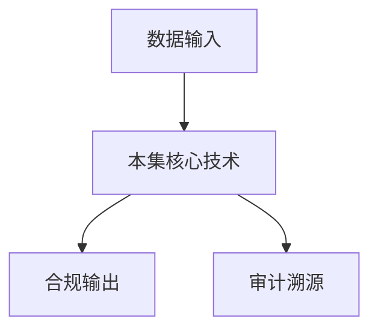

# P09 密态计算概念介绍

← [[BV1ser5BDESU-总览]] | ← [[P08-可信数据空间整体能力]] | 下一篇 → [[P10-密态底座-密态胶囊]]

## 视频信息

| 项目 | 内容 |
|------|------|
| 分集 | 密态计算概念介绍 |
| 模块 | 密态计算与TEE |
| 时长 | 42 分 50 秒 |
| 链接 | [B 站 P9](https://www.bilibili.com/video/BV1ser5BDESU?p=9) |
| 官方文档 | [SecretFlow 文档](https://www.secretflow.org.cn/zh-CN/docs) |
| 内容来源 | 知识点增强（数据要素流通技术体系，非逐字转写） |

## 核心要点

1. **本 P 主题**：密态计算概念介绍
2. **模块定位**：密态计算与TEE
3. **考试/实践侧重**：密态计算定义、与隐私计算关系、密文计算场景
4. **笔记层级**：教程级（约 3072 字），含速览、图解、场景 Walkthrough、自测题
5. **学习建议**：先通读「3 分钟速览」与「图解」，再读「详细讲解」；动手项见 Checklist

> 以下内容基于数据要素流通与隐私计算技术体系撰写，对应 B 站分 P「密态计算概念介绍」。**非 UP 逐字转写**；不看视频也可建立框架，看视频可对照「与视频对照表」深化。

## 本节在系列中的位置

**模块**：密态计算与 TEE · 系列第 **P09/47** 集。

**建议前置**：[[可信数据空间整体能力]]——建立本集所需背景。

**建议后续**：[[密态底座-密态胶囊]]——在本集能力之上继续深入。

依赖关系：政策(P01–P06) → 可信空间(P07–P08,P18) → 密态/隐私技术(P09–P24) → SecretFlow 工程(P25–P32) → 基础设施与案例(P33–P47)。

## 3 分钟速览

**密态计算概念介绍** 是数据要素流通体系中的关键一课。读完本节你应能回答：① 核心概念定义；② 在「供得出—流得动—用得好—保安全」链条中的位置；③ 与隐私计算技术栈的衔接。考试/面试侧重：**密态计算定义、与隐私计算关系、密文计算场景**。

## 零基础导读

本节「密态计算概念介绍」属于 **密态计算与 TEE**。即便未看视频，也应先建立**制度—技术—场景**三层视角：政策类章节回答「为什么允许流」；技术类章节回答「如何安全地算」；案例类章节回答「真实行业怎么落地」。

第一遍阅读请盯住三个问题：本集**解决什么痛点**？**关键参与方**是谁？**交付物或能力边界**是什么？第二遍阅读时，把术语表抄到 Obsidian 双链笔记，与前后分 P 交叉引用。

## 详细讲解

### 1. 密态计算定义

**密态计算**（Confidential Computing）指数据在**加密或硬件隔离保护状态**下完成计算，明文仅在受保护的执行环境内短暂出现。与「传输加密」「存储加密」组成数据全生命周期保护的第三支柱。

### 2. 技术路线对比

| 路线 | 代表技术 | 信任假设 | 性能 |
|------|----------|----------|------|
| 硬件信任 | TEE（SGX/TrustZone） | CPU 厂商 | 高 |
| 密码学 | MPC、FHE | 密码学困难问题 | MPC 中、FHE 低 |
| 混合 | SPU（MPC+FHE+TEE） | 组合 | 场景化 |

### 3. 与隐私计算的关系

隐私计算是**目标**（数据可用不可见），密态计算是**实现手段之一**。广义的隐私计算还包括联邦学习、差分隐私、TEE、MPC、FHE、ZK 等。

### 4. 典型应用场景

- **政务数据融合**：多部门统计不交换原始表
- **金融联合风控**：银行间共享黑名单不泄露客户明细
- **医疗科研**：多院病例联合训练重病预测模型
- **大模型推理**：模型权重与用户提示在 TEE 内计算

### 5. 密态计算价值链

数据封装 → 策略绑定 → 密态传输 → 受控解密/计算 → 结果输出 → 审计存证

### 6. 考试/实践要点

- 区分传输加密、存储加密、密态计算三者
- 说明 TEE 与 MPC 的选型权衡
- 查阅 SecretFlow 文档中 Device（SPU/HEU/TEEU）抽象

### 7. 机密计算联盟

CCC（Confidential Computing Consortium）推动 TEE 生态。国内隐语、星绽等与国标、行业场景深度结合。

### 8. 学习实验

在支持 SGX 的机器上运行 Hello Enclave；无硬件可用仿真模式理解 API 流程。

### 9. 产业趋势

Gartner 将隐私增强技术（PETs）列为战略趋势；密态计算与 PETs 并列，企业 CISO 应将密态纳入三年技术路线图。

### 10. 学习与实践检查单

- [ ] 对照本 P 标题回顾 B 站视频章节要点
- [ ] 在 [SecretFlow 文档](https://www.secretflow.org.cn/zh-CN/docs) 找到对应模块
- [ ] 能用一句话向同事解释本 P 核心概念
- [ ] 识别一个本行业可落地的应用场景
- [ ] 记录与前后分 P 的技术依赖关系

### 11. 模块知识串联
本讲属于「数据要素流通技术」体系中的重要一环。建议在学习日志中标注：输入依赖（前序知识）、输出能力（学完能做什么）、与隐语组件映射（SecretFlow/Kuscia/SecretPad/TEE）。完成 47 讲后应能独立设计一个「政策合规+连接器+隐私计算+审计存证」的端到端方案，并评估 MPC、TEE、联邦学习的选型依据。

### 深化理解（密态计算概念介绍）

将本节概念放入「数据二十条」四原则框架：它主要支撑哪一条原则？若去掉该能力，哪类数据流通场景会受阻？用一句话向非技术经理解释本节价值。

## 图解

## 类比与直觉

把本节技术想象成**流水线的一环**：看清输入是什么、经过哪些处理、输出给谁用，比死记名词更有效。

## 例题与场景 Walkthrough

**场景：两家机构联合建模（不共享明文）**

1. **样本对齐**：若双方仅有交集用户有价值，先用 PSI（P21/P28）对齐 ID。
2. **特征拼接**：纵向联邦（P24）下 A 方持标签、B 方持特征，梯度通过安全聚合更新。
3. **训练执行**：在 SecretFlow SPU（P27）上完成密态前向/反向，或 TEE 内明文训练（P11–P17）。
4. **模型发布**：输出评分服务；模型参数经评估后按需出域，训练数据永不出域。
5. **本集关联**：密态计算概念介绍 提供其中 **密态计算定义** 能力。

## 常见误区

1. **「学完本集就会用隐语」**：SecretFlow 生态需多集串联（P19–P32），单集只是拼图一块。
2. **「隐私计算等于不上传数据」**：数据仍以密文、份额或授权方式参与计算，网络与算力开销客观存在。
3. **「TEE 绝对安全」**：TEE 依赖硬件与侧信道防护，需远程证明（P17）与补丁策略。
4. **「区块链解决一切确权」**：链适合存证与交易撮合，大规模计算仍在链下隐私计算引擎。

## 与视频对照表

| 视频段落（约） | 预期演示内容 | 笔记对应章节 |
|-------------|------------|------------|
| 开篇 0%–15% | 本集目标、背景、与前后集关系 | 本节位置、3 分钟速览 |
| 前段 15%–40% | 核心概念定义与架构图 | 零基础导读、详细讲解 |
| 中段 40%–70% | 原理展开、对比、政策/代码示例 | 图解、类比、Walkthrough |
| 后段 70%–90% | 案例、问答、易错点 | 常见误区、Checklist |
| 收尾 90%–100% | 总结、延伸资源 | 延伸阅读、自测题 |

> 本集总时长约 **42分50秒**。无官方外挂字幕时，以分 P 标题「密态计算概念介绍」与上表主题对齐视频画面。

## 动手实践 Checklist

- [ ] 复述本集 3 个定义（不看笔记）
- [ ] 根据 Walkthrough 写 200 字场景短文
- [ ] 对照视频确认 1 个架构图/演示
- [ ] 在总览思维导图中标注本集节点
- [ ] 完成自测 Q1/Q5

## 延伸阅读

- [SecretFlow 文档中心](https://www.secretflow.org.cn/zh-CN/docs)
- TC609 可信数据空间相关标准
- 本系列相邻 2 个分 P 笔记

## 自测题

1. **本集核心考点？**  
   **答**：密态计算定义、与隐私计算关系、密文计算场景。

2. **本集在四原则中的位置？**  
   **答**：偏流得动基础设施。

3. **与 SecretFlow 的关系？**  
   **答**：提供合规与架构前提，后续技术集在其上落地。

4. **一项落地检查？**  
   **答**：是否有授权、是否最小必要、是否可审计——三者缺一不可。

5. **30 秒口述本集？**  
   **答**：用「输入→处理→输出」各一句话概括（见 Walkthrough）。

## 关键术语

| 术语 | 说明 |
|------|------|
| 数据要素 | 可参与社会化配置、创造价值的数字化资源 |
| 隐私计算 | 数据可用不可见前提下实现协作计算的技术体系 |
| 密态计算 | 密文状态下完成计算 |
| 密态胶囊 | 数据+策略+密钥封装单元 |

## 与前后分 P 的衔接

- ← **可信数据空间整体能力**（[[P08-可信数据空间整体能力]]）
- → **密态底座-密态胶囊**（[[P10-密态底座-密态胶囊]]）

## 逐字转写
> 引擎: whisper | 状态: 已转写 | 格式: 段落化

### [00:01 - 00:50] 大家好,我是蚂蚁蜜算的潘无穷
大家好,我是蚂蚁蜜算的潘无穷，今天非常高兴有机会跟大家深入探讨一下秘材计算技术体系，经过我们这两年的观察和分析，我们发现安全已经成为数据要素流通领域的一个关键性因素，只有解决安全问题，数据提供方才能放心的把数据给出来，然后整个数据要素流通的整体风险才会被控制住，然后那些高价值高敏感高利润的场景才能真正的这个有限出来，这也是我们为什么认为数据要素流通最终一定会走向密调流通，今天除了把这些关键的思考跟大家分享一下之外，还会重点把密调计算技术体系进行一个展开的介绍，从介绍当中大家可以看出密调计算体系。

### [00:50 - 01:50] 它不是一个面向数据要素流通
它不是一个面向数据要素流通，有一个环节的单点技术，而是一个字体向上的，然后贯穿数据流通所有环节的一个综合的一个技术，这个是本次介绍的一个目录，首先会介绍一下外宣环的事情，整个数据要素流通，它的最主要的形式其实是数据外宣环，然后此时安全威胁发生了本质的变化，在安全威胁发生本质变化的情况下，密调计算就是一个必然的选择，然后介绍一下密调计算跟椰子保护计算的一个区别，椰子保护计算它其实是相当于一个技术内核的一个作用，它主要提供核心的安全能力，但是密调计算把它升级成一个面向产业应用的综合的技术体系，然后介绍一下密调计算的整个的体系结构。

### [01:50 - 02:45] 分层次分模块对密调计算进行一个
分层次分模块对密调计算进行一个展开介绍，第五部分对未来进行一个展望，下面介绍第一部分，首先介绍一下什么是数据要素，数据大家经常说，这个原有的信息系统也有数据，为什么就数据原来不叫数据要素，后来升为数据要素呢，主要还是整个对价值的一个认知的一个变化，原来的信息系统我们其实认为是以业无目标为导向，每个组件其实是一个流程，或者是完成业无目标的一个功能，在数据要素领域是以数据的价值释放为导向，每个组件是数据生命周期的一个环节，这样一个形式，我们可以看到整个信息系统的结构形式其实发生了巨大的变化，我们认为与之匹配的情况下。

### [02:45 - 03:40] 我们整个信息系统的设计的思维
我们整个信息系统的设计的思维，整个信息系统的结构其实都应该发生分之性的变化，这里边写了一个问号，希望听完之后可以在自己心目中能够想象一下，在数据要素流通领域信息系统的核心支撑技术应该都有哪些，然后数据要素流通它的主要形式是数据外区换，这句话什么意思呢，左边那个图我展示的是数据内区换，在数据内区换中，数据主要是在一个机构主体内的一些区换，那可能也有数据中团，然后给每个业务系统提供数据，在数据外区换的情况下，数据其实是不同的机构进行合作的，那可能有的机构提供数据，有的机构加购数据，有的机构使用数据，为什么数据一定会走向数据外区换的。

### [03:40 - 04:33] 是因为数据生态要素
是因为数据生态要素，可其他生态要素其实有显著的不同，数据它在使用过程中不被消耗，即使是多个主体多轮子反复使用数据，数据也不会被消耗掉，那这种情况下，就导致数据可以被各个常点，各个地方去使用，然后数据本身它在不同的场景下，同一份数据在不同的场景下，它也会产生不同的作用价值，即便是同一个场景，只要数据越多也能产生更多的价值，所以这些特性也决定的数据要素，出现会走向外区换，那走向外区换之后，有一个非常非常显著的变化就发生了，数据外区换的情况下，这个安全威胁跟原来的数据内区换，其实是有本质不同的，因为外区换中的数据。

### [04:33 - 05:30] 它可能脱离原来持有方的管控边界
它可能脱离原来持有方的管控边界，进到一个新的系统里，这个新的系统系统的运萎方，也就是管理员员，它可能跟原来持有方，就完全不是同一方，在系统建设当中，运萎方通常是一个权力中枢的位置，如果新的运萎方它主动作恶的话，带来的影响是颠覆性的，什么叫颠覆性的呢，就是说我们对安全措施进行一些增强，这种增强或者是，我们常见的原有的安全措施，基本都没法比地狱的，这种情况下，其实给我们带来一个咱们性的后果，数据提供方它具怕这种安全危险，它不愿意对外提供数据，然后从这个数据要素行业上来说，也会有这样的问题，就是因为没有加工者，数据加工者碰不到数据，所以大部分数据。

### [05:30 - 06:27] 可能是在处于缺乏加工的远矿的状
可能是在处于缺乏加工的远矿的状态，然后多个参议方谁都不愿意把数据发给其他方，那么多方的数据其实没有办法进行融合计算，还有就是在数据没有办法对外提供的情况下，应用场景方其实也没有办法，对数据的价值进行验证，他也不知道我到底该不该启动这次数据要素流通，前面我们介绍了安全威胁，其实发生了本质变化，为了应对安全威胁，我们其实不是说直接入手一些方案，首先我们要在技术理念上进行一个变化，然后通过技术理念来指导，和延连我们后续的方案的设计，技术理念上我们主要是要进行以下的一些变化，一个就是我们要从主体信任走向技术信任，这个说的什么意思呢。

### [06:27 - 07:23] 就是我们不再依赖数据介入方
就是我们不再依赖数据介入方，它人的城市可好，不再依赖数据方这个主体，它不会作恶，不会主动去窃取数据，而是说数据提供的话，能够通过技术保证自己的数据，不会被任何人窃取，为什么这么说呢，是因为主体信任能够连接的参与方是有限的，基于主体信任最后就会形成一个数据局域，在局域网之间相互不同，这个其实跟我们要数据进行管换流通的整体目的，其实是相配的，第二个就是管理特权要走向管理平权，这个说的什么意思，就是说整个数据流通的服务听方，服务听方它其实跟其他的参与方的权力应该是对等的，它不应该有能力，通过这个攻击或者是本身拥有权力这样的手段。

### [07:23 - 08:18] 去查看其他参与方的数据
去查看其他参与方的数据，只有这种平等的权力关系，才能让各个参与方愿意提供数据，那最后一个是从外国安全走向内生安全，这个说的是安全服务，它不应该是跟现有的系统这样独立建设的，然后以被调用的方式提成在现有的系统，这种方式它其实防不了运萎管理员，因为运萎管理员可以篡改这个调用关系，或者直接攻击这个原有的业务系统本身，那最后一定要走向内生安全，所谓的内生安全就是安全机制，它内置在每一个系统组件当中，并且对系统组件进行一个贴市的防护，在外区运环情况下，为了抵御来自这种具有特权能力的运萎管理员的威胁，最终数据一定是走向密谈。

### [08:18 - 09:15] 只有密谈才能防止任何人窃取或者
只有密谈才能防止任何人窃取或者滥用数据，这也是一个密谈的定义，国家数据局也给了密谈计算的官方的定义，简单来理解，其实密谈就是数据会出于任何人都没办法窃取或者滥用的状态，无论是通过密码学的方式保证的，还是通过可信信件的方式保证的，只要你能够达到任何人都没办法窃取或滥用，都叫做个密谈，下面把密谈做一些更加形象化的一个描述，一个就是数据的所有权力，其实仍然还在数据提供方这里，将来谁能使用数据，数据授权的发出都是数据提供方发出的，然后数据在整个流通中保证全连录密谈，数据不会被泄漏，然后全流程可信管控，保障数据不会被滥用。

### [09:15 - 10:10] 它这两个保障的强度要达到能够抵
它这两个保障的强度要达到能够抵于越远方空击，为什么讲这个意思，就是说我们常见的这种加密，防温控制系统其实都达不到这个强度，我们必须通过新技术提升级，才能达到这个强度，然后下面我还写了一点讲提结构的事情，它最后这个结构肯定是多个组建协作完成，这样主要是满足现在大型系统里边的多个组建协作，我就可以让整个功能更为的复杂，然后并且具备这种弹性扩展的能力，这样通过弹性困难，将来我可以在性能上也可以支持大规模的计算能力，谈到密材计算的时候，很多人都关心密材计算，你现在到底成本是怎么样的，现在整个成本其实低于1.5倍，这个也要讲一下。

### [10:10 - 11:06] 过去行业其实存在一个误解的
过去行业其实存在一个误解的，当时因为硬件技术不常数，所以隐子保护计算主要是用一些纯密码学方案，这些方案其实是一般性能比较低的，百倍或者千倍的性能开销，大家长期以来就认为隐子保护计算，其实是一个比较开销比较大的一个计算，但实际上随着这个硬件的常数，现在这个计算成为降到名位分布式的1.5倍，对于一些计算密集性的任务，整个的成本可以降到1.1倍一倍，这个实际上已经远远低于数据流通带来的价值，它不会成为数据流通的阻碍，也就是说按照现在密台计算的成本，它其实已经可以让整个数据流通，都进行普遍性的覆盖，让人人都享受到高安全的好处。

### [11:06 - 11:58] 下面我们通过各个技术点的区别
下面我们通过各个技术点的区别，从这个角度来说，让大家更详细的理解一下什么是密台计算，一个就是这种纯密码学的方案，这里展示了一下纯密码学的方案，大家可以看到，它其实有很多计算和网络交付，最终其实整个性能是受限的，实际使用过程中为了加速计算过程，它可能还会采用一些优化的方式，然后最终导致它有一部分结果，其实是以明文形式进行交付的，所以有的时候也会有一些安全问题，下面讲一下跟杀箱的区别，杀箱其实也输掉住流通里边常用的术语，但是大家觉得把程序放在杀箱里，然后这个程序就受到了保护，这其实是一个旺文生意的一个误解。

### [11:58 - 12:51] 杀箱它最初其实是为了防止恶意程
杀箱它最初其实是为了防止恶意程序逃逸，什么叫做逃逸呢，就是防止恶意程序攻击宿主军，这个是用在什么地方呢，比如说沙漏软件，看到了一个疑似的程序，它把它放在杀箱里运行，万一这个程序是恶意的呢，它不会影响到宿主军里边，它在杀箱里边就可以对它进行一个运行，进行一个检测，这样一个安全能力，那么可以看到这个安全能力跟密台算，跟我们数据要素领域要的安全防御目标是接待相反的，对吧，这个数据要素领域要的安全目标是防止，这个管理员溃碳的一个科学业用，但是这个杀箱呢，它只是防止的应用程序，这个攻击宿主机管理员，依然是可以看到这个杀箱里面的程序的。

### [12:51 - 13:40] 然后与区块链的区别
然后与区块链的区别，区块链呀，数据要素领流通领域长提到的技术，那数据要区块链它是干什么，它其实是一个区中新化的共识机制，通过区中新化的共识机制，实现这个列上的数据不可篡改，但是它共识的过程中啊，其实是需要把这个名文进行广播，然后每个参与方进行相同的计算，结果相同的我就放到链上，结果不同的我就被作为一场就拒绝掉了，在这个广播的过程中，实际上这个各个参与方，它就已经拿到了数据的名文，这个其实是也没有达到我们说，这个外循环当中啊，我让这个数据不被其他人看见这个目标，这个区块链它也不是做这个事情，对下面我重点介绍一下。

### [13:40 - 14:28] 密探计算和隐私保护计算的区别
密探计算和隐私保护计算的区别，这个也是历次讨论当中，被问到最多的一点啊，从T1到密探计算，其实是从技术内核走向，符向符合产业应用的，综合技术体系的一个过程，这怎么看的呢，T1它其实只是CPU的一个原子能力，你可以认为它这CPU的一些指定级，它仅提供了最基础的隔离认证能力，那从CPU指定级到整个产业化应用，其实还需要很多很多，其他的体系化能力的构建，这就好比说我们有了金库和运烧车，它可以提供最基础的隔离能力，但是我想构建银行系统，那我还需要很多体系化能力，我有了汽车和火车，对吧 我有了最基础的运输能力，那我想构建运输系统。

### [14:28 - 15:20] 我还有很多这个体系化能力要构建
我还有很多这个体系化能力要构建，如果有懂这个计算机编程啊，那其实还有个更贴切的例子，就说这个西语啊，它理论上能够实现所有的逻辑，但是让用它来实现大规模复杂任务的时候，因为西语员提供的能力过于远走，导致基于西语员，就构建大规模复杂任务的时候，它整个任务经常会出现这个安全性问题啊，或者是过于复杂无法维护啊，或者是问题问题啊等等各种各样的问题，最后我们提出了面向对象员，把这些接种能力封装成类，封装成方法，最后才解决到这个问题，从提议到密台计算也是一样的道理，提议提供的能力过于的原子化，那你当解决中小规模的问题其实是没有问题的。

### [15:20 - 16:12] 当你解决像书教书流通这种大规模
当你解决像书教书流通这种大规模的问题的时候，提议就会出现这个安全性啊，或者是系统复杂性啊，支撑不了啊，或者规模支撑不了等等一系列问题，那大家可能会想啊，就是说你密台计算是一个世界，明文计算是一个世界，我是把明文计算的那些信息和体系，拿过来，然后把每个组件都放到提议里边，把它变成密台组件，是不是整个信息系统就变成了密台信息系统呢，这个是不是这样的，也就是说这为什么呢，就是在安全威胁发生险重变化的时候，不是这个单组件变化能够解决的，你必须进行整个体系性的一个变化，这里举个例子，就是在明文世界里边对吧，我们可以认为就是说，传统信息系统对吧。

### [16:12 - 16:58] 他认为这个运文人员是可信的
他认为这个运文人员是可信的，主要是防控制外部攻击，这就好比战争的时候对吧，我在我方区域构建这个防游公式，防止敌人从外部打下来，这样的一个体系，那在数据外区换内的情况下呢，我们认为运文人员有可能做恶的，完全可能是恶意的，这就好比是你是在敌人占领的区域，开展地下工作，而此时你的这个工作的这个系统的这个，组织形式啊，或者信息传统的形式啊，其实都跟你原来在自己方开展工作的时候，其实都是有这个显出变化的，前这个是从哲学层面去说啊，那你从这个具体层面来说，到底有哪些变化呢，这里举几个例子，比如说你这个运文人员不可信的时候。

### [16:58 - 17:50] 那原来有些事情是运文人员决定的
那原来有些事情是运文人员决定的，运文人员掌握这件事情的权利，那他不可信的时候这个是谁来做呢，比如说啊，这个应用之间的相互访问控制，对吧，这访问策略最初啊是运文人员去配置的，那运文人员不可信的时候谁来配这个事呢，那还有就是很多信息系统啊，是很多服务啊，他最初设计的时候都是有一个这个管理员，这个管理员其实是有这个高的权限，可以看到其他的这个这个人啊，或者是里边的一些关键数据的，比如说这个kms的管理员，其实可以导出命啊看到命啊，那你这个在这个密台计算体系下，这些事情怎么做，这些服务大概率是要重新构置的，重新重新构建的。

### [17:50 - 18:41] 不是说把它放到旗翼就可以的
不是说把它放到旗翼就可以的，应该要把它重新构建，对吧，让那个管理员没有这个超级权限，还有一点很容易被忽略啊，就传统信息系统中，很多逻辑关系我们在写程序的时候，其实默认他正确的，没有对他进行验证，你比如说你按照文件名是加载这个文件，我们默认就加载的是正确的，那你在密台计算体系下呢，这个就有可能被运用员员篡改，所以在密台计算体系下，所有的对应关系，所有的关系都要被找出来，然后都要进行严格的防护，并且这个防护程度要能够达到，抵于恶意管理员工具的程度，最后就是密台计算呢，他其实也是需要软件生态的，那这个软件生态不能另起炉灶。

### [18:41 - 19:36] 那这个整个成本和代价太大
那这个整个成本和代价太大，必须兼容遗忧的生态，至少有两点，一个就是Linux生态，那你遗忧的Linux程序，要能在密台计算体系下运行下来，然后还有就是现有的一些这个，软件上面的生态，计算软件上的生态，比如说这些主流计算软件里面，那些脚本代码啊，这些代码要在密台计算体系下，也能够运行起来，下面我的整个密台计算体系，进行一个展示介绍，而左下角是密台计算体系，这个结构图，它主要分为五个部分，最下面的一个部分是可行机制，这个呢是让参议方，尤其是数据提供方，能够对密台计算体系进行一个度量，从而知道密台计算体系是什么样的，比如说原版是什么样的。

### [19:36 - 20:25] 为什么要知道这个事呢
为什么要知道这个事呢，这里边有个逻辑啊，就是你只有知道一个新系统是什么样的，你才能进一步判断，这个新系统的安全情况是什么样，可行机制就承担着这样一个作用，右边这个是密台底座，这个主要是提供密台的运行环境，以及数据密台的一个功能，再往上是数据互通层，这个呢主要是提供数据的全生命周期，互通流动的这个全生命周期的这个能力，包括这个管控能力，其中那个计算这个环节被单独提出来了，这是因为计算软件啊，它其实是非常丰富的，计算这个层面上，它其实有非常非常丰富的功能，所以这个地方单独作为一个层次，再往上呢那个是数据服务层，那这个呢就是以用户的视角啊。

### [20:25 - 21:20] 把这些功能啊组织起来
把这些功能啊组织起来，然后这个最终对用户提供服务，下面分层次去介绍一下，可行机制层他到底是怎么工作的呢，这里边有个核心是可行根，可行根呢他去度量这个所有的应用，然后以他为调量，权为机构就知道这些应用是好是坏了，然后对这些应用进行这个，颁发这个身份证书，然后继续身份证书参与方完成了，对整个这个可行应用体系的这个，这种度量和这个安全性的判断，那这里边前面说的这些安全目标啊，技术体理念怎么体现的呢，就是说这个，整个这个度量啊，它是依赖这个可行根完成的，然后这个参与方啊和可行根之间对吧，直接建立这种通信送到这个通道，这个中途任何人都没法串改。

### [21:20 - 22:12] 刚才说这个这个这个
刚才说这个这个这个，这个度量验证的结果，这个就实现了这种技术信任，还有这个防护，这个可行根对这个可行应用的保护，是深入到每一个组建的，如果是我们大前信系统，我们叫微服，深入到每一个微服服的，所以才达到了内生安全的目标，可行根这个概念，为我们反复提起，为什么这个概念这么重要呢，就是因为正常情况下，一个主体啊，只信任在他自己本地运行的新系统，可行根啊，它是有一个自我防护能力的芯片，即使在远程啊，用户也可以对他进行信任，那那这样的话，就实现了用户，对远程信系统信任的一个零的突破，基于可行根为毛点，有可行根去度量整个这个主机系统，从而用户啊。

### [22:12 - 23:06] 能够知道远端主机系统的这个情况
能够知道远端主机系统的这个情况，然后再对这个这个这个情况，进行那个人工审核，那么他就会知道这个远端信息系统，是否安全，从而对远程系统进行信任，对，可行根在这个过程中，承担了一个关键的调量作用，下面我介绍一下这个可行应用身份，首先介绍一下可行应用，什么是可行应用呢，就是具备密探能力的应用，比如说T里边的应用，可行应用整个密探计算系统的一个基本组成单元，大型的密探计算系统，其实需要大量的可行应用相互协作，协作过程中可行应用相互之间，其实也有鉴别的诉求，但是这个鉴别诉求，不能单单依靠前面的这个远程度量来解决，因为可行应用它是一段长续。

### [23:06 - 23:59] 你即便通过度量获得了
你即便通过度量获得了，另一个可行应用的原码，它其实没有办法进行人工审核，去判断原码是否安全的，这个时候我们就引入可行应用身份，我给每个可行应用颁发一个身份，可行应用通过身份就进行鉴别，完成前面的动作，这个看上去跟传统的身份颁发是一样的，但其实是不一样，传统的身份颁发当中，管理员在其中承担了中间人的工作，当然也可以通过这个亏探私药，或者提完工药进行操纵身份，可行应用身份颁发当中是全位机构，直接通过这个安全信道，直接把这个身份下滑到可行应用里，这样身份其实是任何人都不能操纵的，包括这个管理员 运用人员都是不能操纵的。

### [23:59 - 24:53] 它也是首个完全属于客观时期的身
它也是首个完全属于客观时期的身份，有了可行应用身份之后，就可以通过可行应用，就可以通过相互鉴别，连成一个更大的可行执行网络，用户只要验证一个可行应用，它就会知道这个可行应用，会继续去验证其他的可行应用，保证整个机序其实都是被验证的，在Metai体系下，很多服务其实都需要从构的，其中一个关键的服务就是MEAL服务，传统的KMS当中管理员是有特权的，它其实是可以导出MEAL，这样威胁到MEAL的安全，这在Metai体系下肯定是不允许的，在Metai体系下如果我们选择，让可行应用自己保存MEAL，因为可行应用它自己有硬件的隔离环境。

### [24:53 - 25:49] 它也可以保护MEAL的安全
它也可以保护MEAL的安全，但是一旦这个硬件损坏，这个MEAL可能就会永远丢失了，这在实际系统中肯定是不被允许的，因此我们需要构建一个新式的可行MEAL服务，这里可行MEAL服务里边，首先管理员是没有任何特权的，然后说的账号体系，就是用咱们前面说的可行应用账号体系，然后整体在可行体系下其实就是避缓的，然后通过可行MEAL服务，自身在通过硬件备份等等方式，来解决MEAL丢失的问题，然后减化可行应用用的负担，大家经常说区块链可以做日制的保护，但实际上区块链它没有办法保护，应用程序到上列过程中的安全，它只是说数据一旦上列之后。

### [25:49 - 26:55] 它可以进行保护
它可以进行保护，其实可行应用可以对日制进行更严谨的保护，它从日制产生之初就可以在可行应用之内，进行签名的保护，签名的MEAL是可行应用自己专属的，所以不会被外部的任何人员进行创改，整个的防范范围其实更大，安全运为，这个讲的是什么事情呢，就是说如果可行应用TGB里边，它里边有OS的话，整个的OS是需要进行改造的，那越远人员的很多权限是要被限制，以避免越远人员利用运为这个事情，来攻击整个系统，下面介绍一下密探底座层，密探底座层主要是为应用程序提供一个密探运行环境，以及实现数据的密探的能力，它从硬件隔离环境到应用的运行环境。

### [26:55 - 27:52] 主要还有哪些层次呢
主要还有哪些层次呢，一个是机密虚机层，这个主要是提供类似于虚运机的运行环境，在G上我们就可以跑OS，在OS这个层我们做的主要工作，就是对OS的安全性进行升级，然后在T上可以运行机密容器，在容器层主要是提供运员生的部署能力，再往上就可以运行可行应用了，在可行应用内部，我们要提供数据交囊的这种能力，然后让数据的权利路都符合数字合约的设定，有些同学可能并不理解可行执行环境的基本原理，这里对可行执行环境的基本原理进行一个补充介绍，可行执行环境的基本原理是CPU的一个功能，它在CPU上首先是加了一个加解密引擎。

### [27:52 - 28:50] 然后让所有进出CPU的数据都进
然后让所有进出CPU的数据都进行加密和解密，这样的话就可以保证CPU以外的任何硬件，比如说恶意的内存恶意的外设，其实都只能看到密文，它没有办法攻击数据，而且是硬件层面的，软件层面上就是前面讲的可行执行环境，同样也是基于可行根，然后让参与方能够远程对象进行度量，度量之后参与方就可以判断，可行执行环境里边的程序是不是好的，从而保证远间层面上没有任何的恶意程序，这里要补充一下，CPU的加解密引擎它其实是对外界的数据的完整性，也是有保护的，一旦远程度量了之后，这个度量之后被认为是好的数据和程序，是不能被更改的，安全性大概就这样了。

### [28:50 - 29:43] 无论是恶意的硬件或者是恶意的软
无论是恶意的硬件或者是恶意的软件，都不能进行一个攻击，性能是什么个原因呢，就是说这个数据加解密的时候，它其实是跟内存访问同步完成，加解密并不耗费额外的CPU运转周期，所以它其实加解密引擎不会影响这个额外的性能，这个跟大家日常的认知可能是有些不太一样，这个主要是因为加解密引擎是做在一个CPU上的，就是我们俗话说的是做在ASIC上，就ASIC的加解密速度其实是非常非常快的，前面也介绍了主要是可静支音环境的基本原理，实际上可静支音环境的实践方式有很多种方式，左边展示的是信任根集成的CPU里面的。

### [29:43 - 30:40] 右边展示的是信任根和CPU用独
右边展示的是信任根和CPU用独立芯片去实现的，右边这个方式的好处就是说，这个信任根跟CPU厂商结偶，它不受这个CPU厂商的这个影响，并且可以由这个权威机构进行直接的一个管控，另外这种方式的时候的话，整个的这个可静支音环境可以适配任何主流的CPU平台，屏蔽这种硬件的差异，并且也可以屏蔽这个远程认证报告格式的这种差异性，T内的系统软件其实也经历过很多次迭代，然后不断的追寻性能和安全的最佳平衡点，最初T内里边其实主要是提供SDK，然后应用程序在使用这个T功能的时候，需要显示调用这个SDK的接口，之后是LiberOS这种形态。

### [30:40 - 31:35] 这种形态已经可以运行原生的Li
这种形态已经可以运行原生的Linux程序，然后LiberOS通过翻译和模拟，对上面提供Linux原生的这个环境，再往后就是说整个硬件层面，整个区域支音环境层面，就会提供区域的这种硬件接口，上面就可以运行原生的Linux，这样的话其实整个的兼容线和性能会最佳，但是需要对TOS的安全性进行一个改造和加强，下面给大家分享一下我们在TOS上的一个工作，如果属于编程语言的话，应该会知道C客机价价不是内存安全语言，因此基于C和C价价编写的大型程序，通常都会有安全漏洞，所以美国政府提议在2026年前将关键软件逐步。

### [31:36 - 32:26] 逐步摒弃这种C和C价价替换成这
逐步摒弃这种C和C价价替换成这种安全的编程语言，但是这个作为最关键的这个软件Linux，其实是并没有启动这个事情，我们的清卵OS走在了美国的同行前面，我们首创了框内核架构，然后整体都是采用安全编程语言Rust的实现，在性能上可以披灭这种红内核架构，大家安全机器上可以披灭这个微内核架构，下面介绍一下密台交囊，密台交囊是怎么做到数据和使用策略进行绑定的呢，这个核心的原理其实是比较简单的，就是我们把数据和策略绑在一起，然后使用指定核心应用的公要进行加密，这样确保只有指定的核心应用，才能够获得这个数据和策略。

### [32:27 - 33:20] 然后数据提供方法在通过远程认证
然后数据提供方法在通过远程认证，检查这个核心应用的代码，然后看看核心应用是否会严格检查这个密台交囊，并且遵守密台交囊里的策略，密台交囊的逻辑看似这个非常的简单，但实际上这背后需要做非常多的检查，可信应用的拿到密台交囊之后，他必须做一个完善的检查，以避免可信应用被诱导做了一些非预期的运算，那一个完善的检查，他要能够构成一个完整的逻辑链，能够验证说最终进入计算的数据，算法什么都是符合预期的，在这个过程中至少要包含以下四个方面的验证，一个是提供者的真实性，就是说你数据是否是生命的参与方提供的，这句话什么意思呢。

### [33:20 - 34:14] 在这个图里面就是说这个数据二
在这个图里面就是说这个数据二，它是不是就是A提供的，那这件事情不是默认成立的，必须要检查的，还有就是授权的合法性，就这个策略的签发的那个人，是不是这个真正的数据提供者，那会不会是别人对不对，造了一个这样的一个策略，还有就是请求的符合性，就是请求的内容跟数据上的策略是不是一致的，那最后还有一个这个加载的一致性，就是你最终加载今天的数据和算法，跟策略容标明的这个ID是不是一致的，这样说一下策略容一般只标明这个ID，比如说图中的数据二和算法二，这看似验证内容非常的多呀，好多内容大家觉得都很陌生，就因为传统的新系统一般只会验证第三点。

### [34:14 - 35:04] 从这里我们也看出密探计算体系
从这里我们也看出密探计算体系，为了达到达成更高的安全目标，它实际上要验证的这个逻辑环节，比传统的这个新系统要多的多，并不简单是说我把全种的新系统，放到这个T里面就完成了，它其实整个的验证逻辑要改造很多，那这里我只是展示了一个最基础的势力，实际的系统可能比上图要复杂的多，里边的对应关系也要多的多，那这些对应关系其实都是要验证的，下面介绍一下数据互通层，数据互通层主要提供数据的全生的周期功能，前面讲的一个密探交档的时候，其实已经把这个数据的这种授权，法文控制这块已经介绍了，除了这外这个之外，还有很多其他的这个特色功能。

### [35:04 - 35:54] 我们在这里这个给大家重点介绍一
我们在这里这个给大家重点介绍一下，首先是参与方身份，那这里要强调的就是说，那个有的信息系统啊，这参与方身份是这个数据服务方，的一个这个子系统颁发的，这种情况下其实是，不符合我们整个密探计算的这个安全要求的，因为如果是这边颁发的话，那它其实同时也可以在颁发的过程中进行作恶，在密探计算体系下，那个所有的用户的身份都是由权威方颁发的，那这样的话整个身份颁发的过程中，这个密探计算体系的这种，运萎人员管理人是没有办法作恶的，匿名化是个人信息保护的重要技术，在各宝法等很多法律中明确提出，对匿名化的一个要求，但是现有匿名化技术啊。

### [35:54 - 36:49] 主要是通过家造或者家有的方式来
主要是通过家造或者家有的方式来实现的，数据的主体信息还在，此时啊这个匿名化处理之后的数据，如果与开放空间的其他数据员进行比对，还是能够回复出来这个个人身份信息的，那缩空匿名化的思路呢是将数据，通过技术手段限制在特定空间里，然后切断这个数据呢，和这个开放空间其他数据员的关联的可能性，通过这种方式打向匿名化的，整个缩空匿名化技术我们可以看成，在这个缩空空间内，数据是可算不可迟的，所有的数据都是去标时之后才进入这个缩空空间的，在这个缩空空间外呢，数据又都是密吻的，根本不会进行那个加工运算，我们前面讲的这个密台计算的这个体系啊。

### [36:49 - 37:44] 和理论都是这个啊
和理论都是这个啊，按照这个核心原理去讲的，对吧，实际上背后的这个技术分支啊，非常的多，每个技术分支也有很多种实现方案，这个安全性啊不完全一致，而让用户能够去理解这个安全性啊，其实是非常复杂的，所以我们提出了个通用安全分级，这个在国际上也是首创，首次把不同的技术路线放在一起，进行同一分级，而我们是怎么实现的呢，这个大的原理其实很简单，就是我们通过这个，攻击防御的效果去分，这样就能够试验各种这个技术路线，那么把整个安全性其实分为五级啊，这个内容呢，其实也是国内的很多重量级的单位，都进行了参与，然后进行了很广泛的讨论，目前那个有白皮书发布。

### [37:44 - 38:38] 然后也在金可联盟呢
然后也在金可联盟呢，有送神的标准，第四层就是密探计算层，整个密探计算层啊，主要是将我们前面讲的，密探计算的这些能力，和以后的计算框架进行融合，融合之后能达到什么效果呢，就是说对下啊，我可以利用多个机构的数据，对上呢，我给这个使用方提供的接口呢，跟原有的这个计算框架，其实是一样的，这主要有两种这个实践方式啊，一种是类似于这种spark的这种实践方式，这个时候呢，是通过spark的拓展接口，然后在拓展接口里边引入这个，健全的能力啊，引入加密的能力啊，最后把这个能力呢，導向我们前面讲的这个，密探的这个互通层可信层和底座层，这样来实现的。

### [38:38 - 39:35] 那还有一种方式呢
那还有一种方式呢，是这种网关的模式，那这种呢，主要是在原有的这个密探数据固前面啊，加一个额外的网关，在网关层，完成对整个的这个健全啊，这样的一个工作，那这里要稍微补充一点啊，就说这个攻击者是不能绕过这个网关，直接调用这个密探数据固的，那这个呢，是通过前面我们讲的，这个可信层相互之间的健全来实现的，那再往后讲这个密探边缘框架，那这个指的是什么意思呢，就说如果我们把一个明文的逻辑，转成npc或者是这个he，那这个时候其实是有很多种选择的，然后需要逐个原子算子进行一个翻译，那这个时候我们可以给用户一个自动的，这个翻译的这个工具。

### [39:35 - 40:26] 他可以直接把这个啊
他可以直接把这个啊，比如说这个基于ai原始框架的这个代码，然后自动翻译成这种密码学执行的这个代码，最后我们介绍一下这个密探数据服务场，就是说密探数据服务层主要包括以下几个服务，对首先是数据治理，在没有密探计算的时候啊，数据远方他可能有很多原始数据，他没有治理能力，他又不敢引入专业的这个数据治理人才，怕他们窃取数据，这个时候数据质量一直都是这个提升不上来，然后是整个产业的一个阻碍，那有了密探计算之后呢，他就不要这样担心了，他就可以引入专业的这个治理人员，完成这个数据的这个质量的一个提升，那加上探查指的是什么意思呢。

### [40:26 - 41:15] 就是我们有了密探计算
就是我们有了密探计算，那么我可以在密探情况下进行数据价值探查，那这样的话，其实就不需要进行很复杂的这个前许审批，这样的话我们就可以以最快的速度，挖掘出越来越多的这个数据应用场景，数据产品研发除了前面我们说的功能之外，那么还会通过合成数据啊，或者是密探笔记本的方式啊，完阻止这个研发人员在研发的过程中切取数据，那最后我们对未来进行一个，我认为目前密探计算已经具备产业化落地的能力，并且在一些实际案例中初步展现了产业化实践的这个威力，但是背后深层次理论和体系啊，仍然需要大家共同的研究和探索。

### [41:17 - 42:06] 历史上很多伟大的产业都是理论和
历史上很多伟大的产业都是理论和实践交替发展的，比如说1765年已经出现了改良的争计机，但是热力学其实到1824年才进行这个，提出理论的这个电机，然后飞机呢是在1903年这个就开始是非成功了，但是它其中它背后的理论要到1904年才会才提出，那我们认为现在密探计算就跟这些伟大的产业一样，以后其实也是这个实践和理论交替的一个发展，交替的一个促进，最后做一个总结，那数据要素它是一个新的产业，信任系统组织形式已经发生了这个巨大的变化，尤其是外循环安全威胁发生了本质的变化，导致遗忧的安全措施其实都失效了。

### [42:08 - 42:47] 那数据外循环这个技术体系的构建
那数据外循环这个技术体系的构建需要技术理念的一个变革，要走向技术新人管理平权和内生安全，那我从这个我们最初的这个隐私宝计算到密探计算，其实是从技术内核走向这个产业应用的综合技术体系的过程，整个密探计算体系是一个自己向上贯穿应用服务的全新的技术体系，在身份命药隔离硬件系统软件生态兼容等等方面进行了全面的技术创新，后面是我个人的一个联系方式，谢谢大家。

## 来源说明

- ✅ B 站官方元数据（`Tools/BV1ser5BDESU-full.json`）
- ✅ 分 P 首帧封面（`Tools/bili-fetch/fetch-bilibili.js`）
- ✅ **教程级增强**：含图解/Mermaid、场景 Walkthrough、自测题（约 3072 字，2026-06-06）
- ⏳ 逐字转写：B 站 API 无外挂字幕轨；可选 Whisper/BiliNote 后续补充

## 关键截图

![[../../06-资源附件/video-notes-images/BV1ser5BDESU-P09-cover.jpg|B站首帧 P09]]
