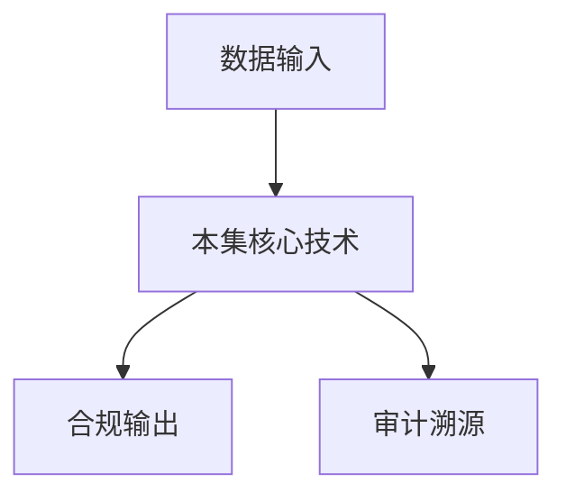

# P10 密态底座-密态胶囊

← [[BV1ser5BDESU-总览]] | ← [[P09-密态计算概念介绍]] | 下一篇 → [[P11-深入理解TEEOSes]]

## 视频信息

| 项目 | 内容 |
|------|------|
| 分集 | 密态底座-密态胶囊 |
| 模块 | 密态计算与TEE |
| 时长 | 11 分 03 秒 |
| 链接 | [B 站 P10](https://www.bilibili.com/video/BV1ser5BDESU?p=10) |
| 官方文档 | [SecretFlow 文档](https://www.secretflow.org.cn/zh-CN/docs) |
| 内容来源 | 知识点增强（数据要素流通技术体系，非逐字转写） |

## 核心要点

1. **本 P 主题**：密态底座-密态胶囊
2. **模块定位**：密态计算与TEE
3. **考试/实践侧重**：密态胶囊、数据封装、策略绑定、密钥管理
4. **笔记层级**：教程级（约 3015 字），含速览、图解、场景 Walkthrough、自测题
5. **学习建议**：先通读「3 分钟速览」与「图解」，再读「详细讲解」；动手项见 Checklist

> 以下内容基于数据要素流通与隐私计算技术体系撰写，对应 B 站分 P「密态底座-密态胶囊」。**非 UP 逐字转写**；不看视频也可建立框架，看视频可对照「与视频对照表」深化。

## 本节在系列中的位置

**模块**：密态计算与 TEE · 系列第 **P10/47** 集。

**建议前置**：[[密态计算概念介绍]]——建立本集所需背景。

**建议后续**：[[深入理解TEE OSes]]——在本集能力之上继续深入。

依赖关系：政策(P01–P06) → 可信空间(P07–P08,P18) → 密态/隐私技术(P09–P24) → SecretFlow 工程(P25–P32) → 基础设施与案例(P33–P47)。

## 3 分钟速览

**密态底座-密态胶囊** 是数据要素流通体系中的关键一课。读完本节你应能回答：① 核心概念定义；② 在「供得出—流得动—用得好—保安全」链条中的位置；③ 与隐私计算技术栈的衔接。考试/面试侧重：**密态胶囊、数据封装、策略绑定、密钥管理**。

## 零基础导读

本节「密态底座-密态胶囊」属于 **密态计算与 TEE**。即便未看视频，也应先建立**制度—技术—场景**三层视角：政策类章节回答「为什么允许流」；技术类章节回答「如何安全地算」；案例类章节回答「真实行业怎么落地」。

第一遍阅读请盯住三个问题：本集**解决什么痛点**？**关键参与方**是谁？**交付物或能力边界**是什么？第二遍阅读时，把术语表抄到 Obsidian 双链笔记，与前后分 P 交叉引用。

## 详细讲解

### 1. 密态胶囊概念

**密态胶囊**是隐语提出的密态底座核心抽象：将数据、访问策略、加密密钥封装为**可流通、可计算、可审计**的一体化单元。类似「数字集装箱」，在流通全程保持密态。

### 2. 胶囊组成

| 组件 | 作用 |
|------|------|
| 密文载荷 | AES/SM4 加密的数据本体 |
| 策略描述 | 允许的操作、期限、输出约束 |
| 密钥信封 | 由 KMS/TEE 管理的密钥封装 |
| 元数据 | 类型、来源、分级、血缘 |
| 签名 | 提供方签名保证完整性 |

### 3. 生命周期

1. **封装**：数据提供方加密并绑定策略
2. **登记**：在可信空间目录上架
3. **授权**：使用方签约获得解密/计算授权
4. **投递**：胶囊进入 TEE/MPC 环境
5. **计算**：策略引擎校验后执行
6. **销毁**：到期或违约后密钥吊销

### 4. 与 DRM 的类比

密态胶囊类似数字版权管理（DRM）：控制的不是「谁能复制文件」，而是「谁能以何种方式使用数据」。区别在于胶囊面向**多方协作计算**而非消费内容。

### 5. 实践要点

- 密钥与数据分离存储，密钥由硬件或 KMS 托管
- 策略语言应机器可执行（参考 ODRL、ABAC）
- 胶囊版本化支持数据更新与血缘追踪

### 6. 考试/实践要点

- 画出密态胶囊生命周期状态机
- 说明胶囊如何支撑「原始数据不出域」
- 对比密态胶囊与传统数据库加密列的差异

### 7. 互操作

密态胶囊应与 ODRL、DID、数据登记标准对齐，便于跨平台流通。API 设计遵循 RESTful + 签名验证。

### 8. 密钥轮换

支持胶囊级密钥轮换而不重新加密全量数据（信封加密：DEK 加密数据，KEK 加密 DEK）。

### 9. 合规映射

密态胶囊可承载「目的限制」「存储期限」等个保法义务的机器可执行表示，审计时直接导出策略执行记录。

### 10. 学习与实践检查单

- [ ] 对照本 P 标题回顾 B 站视频章节要点
- [ ] 在 [SecretFlow 文档](https://www.secretflow.org.cn/zh-CN/docs) 找到对应模块
- [ ] 能用一句话向同事解释本 P 核心概念
- [ ] 识别一个本行业可落地的应用场景
- [ ] 记录与前后分 P 的技术依赖关系

### 11. 模块知识串联
本讲属于「数据要素流通技术」体系中的重要一环。建议在学习日志中标注：输入依赖（前序知识）、输出能力（学完能做什么）、与隐语组件映射（SecretFlow/Kuscia/SecretPad/TEE）。完成 47 讲后应能独立设计一个「政策合规+连接器+隐私计算+审计存证」的端到端方案，并评估 MPC、TEE、联邦学习的选型依据。

### 深化理解（密态底座-密态胶囊）

将本节概念放入「数据二十条」四原则框架：它主要支撑哪一条原则？若去掉该能力，哪类数据流通场景会受阻？用一句话向非技术经理解释本节价值。

## 图解

## 类比与直觉

把本节技术想象成**流水线的一环**：看清输入是什么、经过哪些处理、输出给谁用，比死记名词更有效。

## 例题与场景 Walkthrough

**场景：两家机构联合建模（不共享明文）**

1. **样本对齐**：若双方仅有交集用户有价值，先用 PSI（P21/P28）对齐 ID。
2. **特征拼接**：纵向联邦（P24）下 A 方持标签、B 方持特征，梯度通过安全聚合更新。
3. **训练执行**：在 SecretFlow SPU（P27）上完成密态前向/反向，或 TEE 内明文训练（P11–P17）。
4. **模型发布**：输出评分服务；模型参数经评估后按需出域，训练数据永不出域。
5. **本集关联**：密态底座-密态胶囊 提供其中 **密态胶囊** 能力。

## 常见误区

1. **「学完本集就会用隐语」**：SecretFlow 生态需多集串联（P19–P32），单集只是拼图一块。
2. **「隐私计算等于不上传数据」**：数据仍以密文、份额或授权方式参与计算，网络与算力开销客观存在。
3. **「TEE 绝对安全」**：TEE 依赖硬件与侧信道防护，需远程证明（P17）与补丁策略。
4. **「区块链解决一切确权」**：链适合存证与交易撮合，大规模计算仍在链下隐私计算引擎。

## 与视频对照表

| 视频段落（约） | 预期演示内容 | 笔记对应章节 |
|-------------|------------|------------|
| 开篇 0%–15% | 本集目标、背景、与前后集关系 | 本节位置、3 分钟速览 |
| 前段 15%–40% | 核心概念定义与架构图 | 零基础导读、详细讲解 |
| 中段 40%–70% | 原理展开、对比、政策/代码示例 | 图解、类比、Walkthrough |
| 后段 70%–90% | 案例、问答、易错点 | 常见误区、Checklist |
| 收尾 90%–100% | 总结、延伸资源 | 延伸阅读、自测题 |

> 本集总时长约 **11分03秒**。无官方外挂字幕时，以分 P 标题「密态底座-密态胶囊」与上表主题对齐视频画面。

## 动手实践 Checklist

- [ ] 复述本集 3 个定义（不看笔记）
- [ ] 根据 Walkthrough 写 200 字场景短文
- [ ] 对照视频确认 1 个架构图/演示
- [ ] 在总览思维导图中标注本集节点
- [ ] 完成自测 Q1/Q5

## 延伸阅读

- [SecretFlow 文档中心](https://www.secretflow.org.cn/zh-CN/docs)
- TC609 可信数据空间相关标准
- 本系列相邻 2 个分 P 笔记

## 自测题

1. **本集核心考点？**  
   **答**：密态胶囊、数据封装、策略绑定、密钥管理。

2. **本集在四原则中的位置？**  
   **答**：偏流得动基础设施。

3. **与 SecretFlow 的关系？**  
   **答**：提供合规与架构前提，后续技术集在其上落地。

4. **一项落地检查？**  
   **答**：是否有授权、是否最小必要、是否可审计——三者缺一不可。

5. **30 秒口述本集？**  
   **答**：用「输入→处理→输出」各一句话概括（见 Walkthrough）。

## 关键术语

| 术语 | 说明 |
|------|------|
| 数据要素 | 可参与社会化配置、创造价值的数字化资源 |
| 隐私计算 | 数据可用不可见前提下实现协作计算的技术体系 |
| 密态计算 | 密文状态下完成计算 |
| 密态胶囊 | 数据+策略+密钥封装单元 |

## 与前后分 P 的衔接

- ← **密态计算概念介绍**（[[P09-密态计算概念介绍]]）
- → **深入理解TEE OSes**（[[P11-深入理解TEEOSes]]）

## 来源说明

- ✅ B 站官方元数据（`Tools/BV1ser5BDESU-full.json`）
- ✅ 分 P 首帧封面（`Tools/bili-fetch/fetch-bilibili.js`）
- ✅ **教程级增强**：含图解/Mermaid、场景 Walkthrough、自测题（约 3015 字，2026-06-06）
- ⏳ 逐字转写：B 站 API 无外挂字幕轨；可选 Whisper/BiliNote 后续补充

## 关键截图

![[../../06-资源附件/video-notes-images/BV1ser5BDESU-P10-cover.jpg|B站首帧 P10]]
