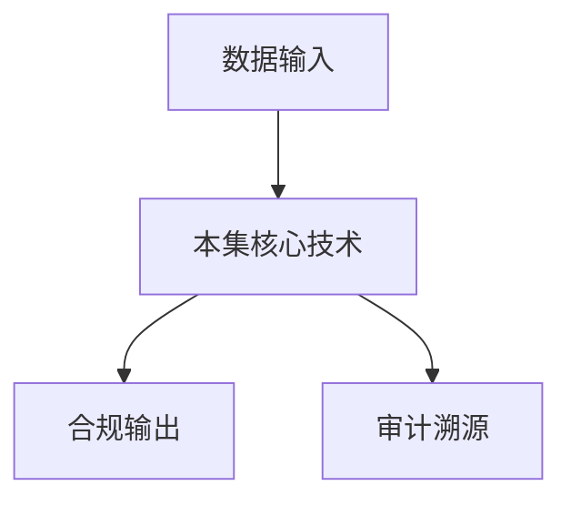

# P11 深入理解TEE OSes

← [[BV1ser5BDESU-总览]] | ← [[P10-密态底座-密态胶囊]] | 下一篇 → [[P12-基于可信硬件的隐私计算框架TrustFlow]]

## 视频信息

| 项目 | 内容 |
|------|------|
| 分集 | 深入理解TEE OSes |
| 模块 | 密态计算与TEE |
| 时长 | 72 分 11 秒 |
| 链接 | [B 站 P11](https://www.bilibili.com/video/BV1ser5BDESU?p=11) |
| 官方文档 | [SecretFlow 文档](https://www.secretflow.org.cn/zh-CN/docs) |
| 内容来源 | 知识点增强（数据要素流通技术体系，非逐字转写） |

## 核心要点

1. **本 P 主题**：深入理解TEE OSes
2. **模块定位**：密态计算与TEE
3. **考试/实践侧重**：TEE 原理、Intel SGX/ARM TrustZone、Enclave
4. **笔记层级**：教程级（约 2869 字），含速览、图解、场景 Walkthrough、自测题
5. **学习建议**：先通读「3 分钟速览」与「图解」，再读「详细讲解」；动手项见 Checklist

> 以下内容基于数据要素流通与隐私计算技术体系撰写，对应 B 站分 P「深入理解TEE OSes」。**非 UP 逐字转写**；不看视频也可建立框架，看视频可对照「与视频对照表」深化。

## 本节在系列中的位置

**模块**：密态计算与 TEE · 系列第 **P11/47** 集。

**建议前置**：[[密态底座-密态胶囊]]——建立本集所需背景。

**建议后续**：[[基于可信硬件的隐私计算框架TrustFlow]]——在本集能力之上继续深入。

依赖关系：政策(P01–P06) → 可信空间(P07–P08,P18) → 密态/隐私技术(P09–P24) → SecretFlow 工程(P25–P32) → 基础设施与案例(P33–P47)。

## 3 分钟速览

**深入理解TEE OSes** 是数据要素流通体系中的关键一课。读完本节你应能回答：① 核心概念定义；② 在「供得出—流得动—用得好—保安全」链条中的位置；③ 与隐私计算技术栈的衔接。考试/面试侧重：**TEE 原理、Intel SGX/ARM TrustZone、Enclave**。

## 零基础导读

本节「深入理解TEE OSes」属于 **密态计算与 TEE**。即便未看视频，也应先建立**制度—技术—场景**三层视角：政策类章节回答「为什么允许流」；技术类章节回答「如何安全地算」；案例类章节回答「真实行业怎么落地」。

第一遍阅读请盯住三个问题：本集**解决什么痛点**？**关键参与方**是谁？**交付物或能力边界**是什么？第二遍阅读时，把术语表抄到 Obsidian 双链笔记，与前后分 P 交叉引用。

## 详细讲解

### 1. TEE 基本原理

**可信执行环境**（Trusted Execution Environment）是 CPU 或 SoC 提供的硬件隔离区域，代码与数据对外界（操作系统、Hypervisor、其他进程）不可见。即使主机被攻破，Enclave 内数据仍受保护。

### 2. 主流 TEE 技术

| 技术 | 厂商/架构 | 隔离单元 | 典型应用 |
|------|-----------|----------|----------|
| Intel SGX | x86 | Enclave | 云计算密态计算 |
| AMD SEV | x86 | 加密虚拟机 | 云主机内存加密 |
| ARM TrustZone | ARM | Secure World | 移动端、IoT |
| RISC-V Keystone | 开源 | Enclave | 学术与定制芯片 |

### 3. TEE 软件栈（OSes）

TEE OS 运行在 Secure World，提供：
- Enclave 创建/销毁/切换
- 安全随机数、密封存储（Sealing）
- 远程证明接口
- 与 Normal World 的有限通信（OCALL/ECALL）

常见实现：Intel SGX SDK、OP-TEE（开源 TrustZone OS）、Gramine-SGX 库 OS

### 4. 安全边界与威胁

**防护**：OS 漏洞、恶意管理员、冷启动攻击（部分）

**不防护**：侧信道（缓存计时）、物理攻击、Enclave 代码漏洞

缓解：恒定时间算法、远程证明+策略、定期补丁

### 5. 开发模式

1. 划分敏感逻辑到 Enclave
2. 数据经加密通道进入 Enclave
3. 结果加密输出或签名断言
4. 配合远程证明建立信任

### 6. 考试/实践要点

- 解释 Enclave 与虚拟机的隔离差异
- 说明 ECALL/OCALL 调用模型
- 列举 TEE 在数据要素流通中的三个角色：计算、密钥托管、远程证明

### 7. SGX 2.0 改进

更大 EPC、动态内存调整缓解内存限制。TDX（Trust Domain Extensions）提供 VM 级 TEE 替代方案。

### 8. 调试注意

Enclave 内 printf 需 OCALL；生产关闭调试接口；侧信道审计纳入发布流程。

### 深化理解（深入理解TEE OSes）

将本节概念放入「数据二十条」四原则框架：它主要支撑哪一条原则？若去掉该能力，哪类数据流通场景会受阻？用一句话向非技术经理解释本节价值。

## 图解

## 类比与直觉

把本节技术想象成**流水线的一环**：看清输入是什么、经过哪些处理、输出给谁用，比死记名词更有效。

## 例题与场景 Walkthrough

**场景：两家机构联合建模（不共享明文）**

1. **样本对齐**：若双方仅有交集用户有价值，先用 PSI（P21/P28）对齐 ID。
2. **特征拼接**：纵向联邦（P24）下 A 方持标签、B 方持特征，梯度通过安全聚合更新。
3. **训练执行**：在 SecretFlow SPU（P27）上完成密态前向/反向，或 TEE 内明文训练（P11–P17）。
4. **模型发布**：输出评分服务；模型参数经评估后按需出域，训练数据永不出域。
5. **本集关联**：深入理解TEE OSes 提供其中 **TEE 原理** 能力。

## 常见误区

1. **「学完本集就会用隐语」**：SecretFlow 生态需多集串联（P19–P32），单集只是拼图一块。
2. **「隐私计算等于不上传数据」**：数据仍以密文、份额或授权方式参与计算，网络与算力开销客观存在。
3. **「TEE 绝对安全」**：TEE 依赖硬件与侧信道防护，需远程证明（P17）与补丁策略。
4. **「区块链解决一切确权」**：链适合存证与交易撮合，大规模计算仍在链下隐私计算引擎。

## 与视频对照表

| 视频段落（约） | 预期演示内容 | 笔记对应章节 |
|-------------|------------|------------|
| 开篇 0%–15% | 本集目标、背景、与前后集关系 | 本节位置、3 分钟速览 |
| 前段 15%–40% | 核心概念定义与架构图 | 零基础导读、详细讲解 |
| 中段 40%–70% | 原理展开、对比、政策/代码示例 | 图解、类比、Walkthrough |
| 后段 70%–90% | 案例、问答、易错点 | 常见误区、Checklist |
| 收尾 90%–100% | 总结、延伸资源 | 延伸阅读、自测题 |

> 本集总时长约 **72分11秒**。无官方外挂字幕时，以分 P 标题「深入理解TEE OSes」与上表主题对齐视频画面。

## 动手实践 Checklist

- [ ] 复述本集 3 个定义（不看笔记）
- [ ] 根据 Walkthrough 写 200 字场景短文
- [ ] 对照视频确认 1 个架构图/演示
- [ ] 在总览思维导图中标注本集节点
- [ ] 完成自测 Q1/Q5

## 延伸阅读

- [SecretFlow 文档中心](https://www.secretflow.org.cn/zh-CN/docs)
- TC609 可信数据空间相关标准
- 本系列相邻 2 个分 P 笔记

## 自测题

1. **本集核心考点？**  
   **答**：TEE 原理、Intel SGX/ARM TrustZone、Enclave。

2. **本集在四原则中的位置？**  
   **答**：偏流得动基础设施。

3. **与 SecretFlow 的关系？**  
   **答**：提供合规与架构前提，后续技术集在其上落地。

4. **一项落地检查？**  
   **答**：是否有授权、是否最小必要、是否可审计——三者缺一不可。

5. **30 秒口述本集？**  
   **答**：用「输入→处理→输出」各一句话概括（见 Walkthrough）。

## 关键术语

| 术语 | 说明 |
|------|------|
| 数据要素 | 可参与社会化配置、创造价值的数字化资源 |
| 隐私计算 | 数据可用不可见前提下实现协作计算的技术体系 |
| 可信执行环境 | 硬件隔离的安全计算区域 |
| 远程证明 | 验证 Enclave 完整性与身份 |

## 与前后分 P 的衔接

- ← **密态底座-密态胶囊**（[[P10-密态底座-密态胶囊]]）
- → **基于可信硬件的隐私计算框架TrustFlow**（[[P12-基于可信硬件的隐私计算框架TrustFlow]]）

## 来源说明

- ✅ B 站官方元数据（`Tools/BV1ser5BDESU-full.json`）
- ✅ 分 P 首帧封面（`Tools/bili-fetch/fetch-bilibili.js`）
- ✅ **教程级增强**：含图解/Mermaid、场景 Walkthrough、自测题（约 2869 字，2026-06-06）
- ⏳ 逐字转写：B 站 API 无外挂字幕轨；可选 Whisper/BiliNote 后续补充

## 关键截图

![[../../06-资源附件/video-notes-images/BV1ser5BDESU-P11-cover.jpg|B站首帧 P11]]
