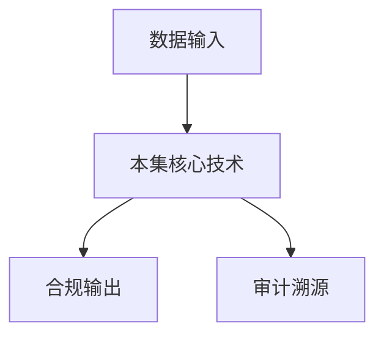

# P12 基于可信硬件的隐私计算框架TrustFlow

← [[BV1ser5BDESU-总览]] | ← [[P11-深入理解TEEOSes]] | 下一篇 → [[P13-密态大模型]]

## 视频信息

| 项目 | 内容 |
|------|------|
| 分集 | 基于可信硬件的隐私计算框架TrustFlow |
| 模块 | 密态计算与TEE |
| 时长 | 18 分 48 秒 |
| 链接 | [B 站 P12](https://www.bilibili.com/video/BV1ser5BDESU?p=12) |
| 官方文档 | [SecretFlow 文档](https://www.secretflow.org.cn/zh-CN/docs) |
| 内容来源 | 知识点增强（数据要素流通技术体系，非逐字转写） |

## 核心要点

1. **本 P 主题**：基于可信硬件的隐私计算框架TrustFlow
2. **模块定位**：密态计算与TEE
3. **考试/实践侧重**：TrustFlow 架构、硬件信任根、密态流水线
4. **笔记层级**：教程级（约 2843 字），含速览、图解、场景 Walkthrough、自测题
5. **学习建议**：先通读「3 分钟速览」与「图解」，再读「详细讲解」；动手项见 Checklist

> 以下内容基于数据要素流通与隐私计算技术体系撰写，对应 B 站分 P「基于可信硬件的隐私计算框架TrustFlow」。**非 UP 逐字转写**；不看视频也可建立框架，看视频可对照「与视频对照表」深化。

## 本节在系列中的位置

**模块**：密态计算与 TEE · 系列第 **P12/47** 集。

**建议前置**：[[深入理解TEE OSes]]——建立本集所需背景。

**建议后续**：[[密态大模型]]——在本集能力之上继续深入。

依赖关系：政策(P01–P06) → 可信空间(P07–P08,P18) → 密态/隐私技术(P09–P24) → SecretFlow 工程(P25–P32) → 基础设施与案例(P33–P47)。

## 3 分钟速览

**基于可信硬件的隐私计算框架TrustFlow** 是数据要素流通体系中的关键一课。读完本节你应能回答：① 核心概念定义；② 在「供得出—流得动—用得好—保安全」链条中的位置；③ 与隐私计算技术栈的衔接。考试/面试侧重：**TrustFlow 架构、硬件信任根、密态流水线**。

## 零基础导读

本节「基于可信硬件的隐私计算框架TrustFlow」属于 **密态计算与 TEE**。即便未看视频，也应先建立**制度—技术—场景**三层视角：政策类章节回答「为什么允许流」；技术类章节回答「如何安全地算」；案例类章节回答「真实行业怎么落地」。

第一遍阅读请盯住三个问题：本集**解决什么痛点**？**关键参与方**是谁？**交付物或能力边界**是什么？第二遍阅读时，把术语表抄到 Obsidian 双链笔记，与前后分 P 交叉引用。

## 详细讲解

### 1. TrustFlow 定位

**TrustFlow** 是蚂蚁集团开源的基于可信硬件的隐私计算框架，与隐语 SecretFlow 互补：TrustFlow 侧重 **TEE 路线**，SecretFlow 侧重 **MPC/联邦** 路线。二者可组合构建混合信任。

### 2. 架构组件

| 组件 | 功能 |
|------|------|
| TEE Runtime | SGX/TrustZone Enclave 管理 |
| 密态流水线 | 数据进 Enclave → 计算 → 密态出 |
| 策略引擎 | 校验使用权限 |
| 密码模块 | 国密/国际算法、密钥协商 |
| 证明客户端 | 对接远程证明服务 |

### 3. 典型工作流

1. 数据提供方将数据加密上传
2. 使用方提交计算任务（SQL/Python/模型推理）
3. TrustFlow 验证双方身份与策略
4. 在 TEE 内解密计算，明文不离开 Enclave
5. 结果加密返回，写审计日志

### 4. 与 SecretFlow 集成思路

- 联邦学习的**安全聚合**可在 TEE 中执行
- 高敏感特征预处理用 TrustFlow，模型训练用联邦
- 统一身份与审计层，底层计算引擎可插拔

### 5. 选型建议

| 场景 | 推荐 |
|------|------|
| 单方持有数据、多方查询 | TEE |
| 多方各持数据、联合统计 | MPC/联邦 |
| 超高敏感+性能要求 | TEE + 硬件加速 |

### 6. 考试/实践要点

- 画出 TrustFlow 信任边界图
- 说明 TEE 路线对「诚实但好奇」对手的假设
- 对比 TrustFlow 与纯 MPC 在延迟上的差异

### 7. 部署拓扑

TrustFlow 可部署为边车（Sidecar）模式，与业务微服务共存。K8s 编排与机密容器 P16 结合。

### 8. 性能基准

TEE 内 AES-GCM 可达 GB/s 级；复杂 SQL 需向量化与索引优化，避免全表扫描进 Enclave。

### 9. 代码迁移

将现有 Python 数据处理脚本迁入 TrustFlow 需识别敏感算子边界；非敏感 ETL 仍可在明文环境完成，仅核心聚合进 TEE。

### 深化理解（基于可信硬件的隐私计算框架TrustFlow）

将本节概念放入「数据二十条」四原则框架：它主要支撑哪一条原则？若去掉该能力，哪类数据流通场景会受阻？用一句话向非技术经理解释本节价值。

## 图解

## 类比与直觉

把本节技术想象成**流水线的一环**：看清输入是什么、经过哪些处理、输出给谁用，比死记名词更有效。

## 例题与场景 Walkthrough

**场景：两家机构联合建模（不共享明文）**

1. **样本对齐**：若双方仅有交集用户有价值，先用 PSI（P21/P28）对齐 ID。
2. **特征拼接**：纵向联邦（P24）下 A 方持标签、B 方持特征，梯度通过安全聚合更新。
3. **训练执行**：在 SecretFlow SPU（P27）上完成密态前向/反向，或 TEE 内明文训练（P11–P17）。
4. **模型发布**：输出评分服务；模型参数经评估后按需出域，训练数据永不出域。
5. **本集关联**：基于可信硬件的隐私计算框架TrustFlow 提供其中 **TrustFlow 架构** 能力。

## 常见误区

1. **「学完本集就会用隐语」**：SecretFlow 生态需多集串联（P19–P32），单集只是拼图一块。
2. **「隐私计算等于不上传数据」**：数据仍以密文、份额或授权方式参与计算，网络与算力开销客观存在。
3. **「TEE 绝对安全」**：TEE 依赖硬件与侧信道防护，需远程证明（P17）与补丁策略。
4. **「区块链解决一切确权」**：链适合存证与交易撮合，大规模计算仍在链下隐私计算引擎。

## 与视频对照表

| 视频段落（约） | 预期演示内容 | 笔记对应章节 |
|-------------|------------|------------|
| 开篇 0%–15% | 本集目标、背景、与前后集关系 | 本节位置、3 分钟速览 |
| 前段 15%–40% | 核心概念定义与架构图 | 零基础导读、详细讲解 |
| 中段 40%–70% | 原理展开、对比、政策/代码示例 | 图解、类比、Walkthrough |
| 后段 70%–90% | 案例、问答、易错点 | 常见误区、Checklist |
| 收尾 90%–100% | 总结、延伸资源 | 延伸阅读、自测题 |

> 本集总时长约 **18分48秒**。无官方外挂字幕时，以分 P 标题「基于可信硬件的隐私计算框架TrustFlow」与上表主题对齐视频画面。

## 动手实践 Checklist

- [ ] 复述本集 3 个定义（不看笔记）
- [ ] 根据 Walkthrough 写 200 字场景短文
- [ ] 对照视频确认 1 个架构图/演示
- [ ] 在总览思维导图中标注本集节点
- [ ] 完成自测 Q1/Q5

## 延伸阅读

- [SecretFlow 文档中心](https://www.secretflow.org.cn/zh-CN/docs)
- TC609 可信数据空间相关标准
- 本系列相邻 2 个分 P 笔记

## 自测题

1. **本集核心考点？**  
   **答**：TrustFlow 架构、硬件信任根、密态流水线。

2. **本集在四原则中的位置？**  
   **答**：偏流得动基础设施。

3. **与 SecretFlow 的关系？**  
   **答**：提供合规与架构前提，后续技术集在其上落地。

4. **一项落地检查？**  
   **答**：是否有授权、是否最小必要、是否可审计——三者缺一不可。

5. **30 秒口述本集？**  
   **答**：用「输入→处理→输出」各一句话概括（见 Walkthrough）。

## 关键术语

| 术语 | 说明 |
|------|------|
| 数据要素 | 可参与社会化配置、创造价值的数字化资源 |
| 隐私计算 | 数据可用不可见前提下实现协作计算的技术体系 |
| 模块 | 密态计算与TEE |

## 与前后分 P 的衔接

- ← **深入理解TEE OSes**（[[P11-深入理解TEEOSes]]）
- → **密态大模型**（[[P13-密态大模型]]）

## 逐字转写
> 引擎: whisper | 状态: 已转写 | 格式: 段落化

### [00:03 - 00:56] 大家好,欢迎来到数据要素可信流
大家好,欢迎来到数据要素可信流通技术的木颗课程，今天分享的主题是基于可信硬件的隐私计算框架TrustFlow，我来自蚂蚁密算,也是TrustFlow的开源项目主要负责人，今天分享的内容主要分为以下部分，分别回答Why, What, How这三个问题，并且介绍我们的眼睛路线图，首先来回答第一个问题，为什么需要TrustFlow，在回答这个问题之前，让我们回顾一下什么是可信执行环境，可信执行环境英文缩写T1E，是一种基于硬件的隐私保护技术，它具备安全启动,内存加密，远程认证这三个主要特性，硬件保护了软件的启动过程。

### [00:56 - 01:52] 防止恶于程序运行
防止恶于程序运行，在程序的运行过程中，内存又是被硬件加密的，并且第三方可以随时通过，认证远程认证报告的方式，验证T1E的运行环境，以及其中运行代码的安全，不同于安全独方计算，T1E它是一种中心化计算的模式，我们通常把它称为输扭模式，而MPC我们称为管道模式，更多关于T1E本身的介绍，可以参见一期的目客课程，机密计算与可信执行环境这一阶课，那么为什么需要TrustFlow呢，首先我们需要明白，并不是把应用在T1E运行起来，它就是一个安全的T1E运用了，举个最直观的例子，假如一个T1E中运行的程序，直接将它独到的敏感信息，在日子中输出。

### [01:52 - 02:47] 甚至上传到公网
甚至上传到公网，那么T1E本身在安全也无忌于事，数据安全的保护是多方面的，任意环节的设计不当，都可能产生数据滥用，只是数据泄漏，在存储安全方面，数据加密以及数据密要的管控，是需要被关心的问题，在传输安全方面，传输通道的数据也是被加密的，并且为了建立从T1E硬件，到传输层的这一个可信链，我们要求传输密要，也受到T1E硬件的保护，在计算安全方面，被硬件保护的程序运行时，还需要向外自证清白，也就是对外提供远程证明服务，第三方可以通过，验证T1E硬认的远程认证报告，来确保执行环境的安全，以及计算代码的安全，Trust Flow就是为了解决上述问题。

### [02:47 - 03:43] 提出的一套计算框架
提出的一套计算框架，接下来，我们来了解一下，Trust Flow为了解决上面的安全问题，做了什么，Trust Flow是一套，基于可信硬件的隐私计算框架，它提供受保护和隔离的执行环境，提供数据安全存储和安全计算的能力，它的整体架构可以参考一下这张大图，Trust Flow底层，对接了多种不同的T1硬件，相应开发了远程认证模块，利用这个远程认证模块，Trust Flow各组件之间，可以互相交连身份，并建立安全的通信连接，在Trust Flow中留转的数据，都是以密谈形式存在的，加密数据所用的数据密钥，与一个授权策略，绑定形成一个数据交囊。

### [03:43 - 04:41] 并且由KMS统一管理
并且由KMS统一管理，Trust Flow上层提供了，丰富的可信应用，涵盖AI BI，以及大模型等领域，当这些可信应用想要访问数据时，需要向KMS请求获取数据密钥，KMS会根据可信应用的，远程认证报告进行教验，并且教验它的防温权限，教验的依据就是，前面所说到的授权策略，这就保证了数据仅在授权范围内，被妥善的被提议应用所使用，对于前面提到的数据，将当中的授权策略，Trust Flow设计了一套，灵活的策略协议，它大致包含以下内容，每份数据包含一个数据ID，以及一个数据拥有者的ID，数据的拥有者，或者具备相应权限的机构。

### [04:41 - 05:37] 可以对该份数据进行多维度的授权
可以对该份数据进行多维度的授权，比如它可以指定被授权的机构列表，可以进行算法上的约束，指定算法的类型，参数以及反问的列的范围之类，还可以进行通用约束，比如指定硬件运输平台，是英特尔的还是海光的，比如指定有效的应用执行时间等等，这些策略的配置都可以通过，我们提供的扣断工具中的配置文件来进行实现，那么一个应用介入到Trust Flow框架中，需要做什么改造呢，在介绍之前我们需要再次强调一下，安全的T1应用，并不等于直接把应用在T1内运行起来，为了让T1应用具备前面，所提到的这些安全能力，我们需要对它进行一些改造，在远程认证方面。

### [05:37 - 06:30] 我们需要对接各种T1硬件
我们需要对接各种T1硬件，比如英特尔的SGX，TDX，AMD的SEV，海光的CSV，或者是蚂蚁字眼的Hyperinclave等等，数据读写方面，我们需要对接多种存储介质，比如数据库，OSS，加密字盘等，需要做好数据加密，和数据庙的管控，在通信上面，我们也需要保证通信信道的安全，在SGX时代，关键于它本身是LabelS的架构，我们必须对应用进行侵入式的修改，但是一个系统中通常存在多个应用，并且他们大概率是不同语言开发的，这就使得T1应用的改造成本会比较高，并且这项改造工作，对开发人员有一定的学习成本和门槛，但是好在现在T1业界的趋势。

### [06:30 - 07:22] 是使用SEVM
是使用SEVM，也就是机密虚拟机，比如TDX,SEV,海光,CSV等，这些都是基于SEVM架构来构造的一个提议的底层硬件，SEVM的一些灵活性给我们提供了一种，别的改造思路，SEVM下面，或者说机密虚拟机，一或是机密容器，它的里面允许运行多个container，基于这个前提，我们提出了CCTF框架，执意过来就是机密计算透明框架，我们的目标是让应用可以无痛的提议化，让天下没有难用的提议，我们将一个可信应用看成一个POD，它包含了一个原始应用的container，和一些可选的set card，这些set card分别是，RA Proxy。

### [07:22 - 08:10] 它兼容各类提议硬件
它兼容各类提议硬件，并且对外提供RA报告查询服务，RA就是Remote Testation，远程证明的这个意思，Data Capsule Proxy，它提供数据庙存取，数据加减密，数据上传下载等透明接口，它仅服务于POD内部，也就是服务于原始应用的container，TrustFlow Invoid，它是基于开源Invoid开发的流量代理，它负责对应用的出入流量进行统一处理，它也支持流量的明文转发，但它最重要的目的是，为了给密闻流量进行透明加减密，它还提供一种功能，它可以让我们的提供应用之间，进行安全的TRS建联，当然我们后续可以。

### [08:10 - 09:03] 根据其他的实际需求
根据其他的实际需求，继续扩展这套Sidecar的体系，使用这套CCTV的框架，应用的开发者，几乎不需要改变自身的应用代码，就可以将应用安全的提议化了，接下来我们介绍，如何快速上手TrustFlow，观望文档里面，我们已经提供了，详细的操作步骤和命令，这里我们就对整体流程，做一个疏离，第一步是部署Capsule Manager，它就是前面我们架构图里面，提到的可信KMS，它本身也是一个，运行在T1里面的应用，对数据必要，和授权策略，进行统一的安全管理，我们打好了一个Dock镜像，我们可以根据不同的T1硬检，来选择对应的镜像来进行部署。

### [09:03 - 09:42] 接下来的步骤是数据加密
接下来的步骤是数据加密，和数据授权，这个是数据应用者来做的，他们可以使用我们，提供的COI工具来操作，这张图里面，Alice和Bob，分别将自己的数据加密，发送给了可信APP进行计算，并且将数据密要和数据授权策略，上传到了Capsule Manager里面管理，为了保证自己的数据安全，在上传数据密要和数据策略之前，Alice和Bob首先需要，确认Capsule Manager的安全，也就是保证Capsule Manager是可信的，运行在T1里面的，因此Alice和Bob，会对Capsule Manager进行远程认证。

### [09:42 - 10:21] 并且在远程认证的过程中
并且在远程认证的过程中，同时获取了Capsule Manager的公要，这个公要是被远程认证报告来，进行保护保证的，接下来Alice和Bob，可以使用Capsule Manager的公要，用数字信封的方式，与Capsule Manager进行安全的通信连接，此外Alice和Bob，还会对他们自己的授权策略，进行签名，防止这个策略被钻改，前面这些都是数据准备阶段，在完成这些步骤之后，可信APP就可以启动进行计算了，他会请求Capsule Manager获取，数据密要，用于解密Alice和Bob的数据。

### [10:21 - 11:09] 而CapsuleManager
而Capsule Manager会对，T1APP进行远程认证，然后教验他的访问权限，只有符合授权策略的可信APP，可以互取到数据密要，从而进行数据的解密和计算，可信APP完成计算后的结果，也会以数据交档的方式进行安全存储，它对应的数据密要和访问策略，也会被Capsule Manager统一管理起来，接下来我们快速浏览一下，相关的命令，有一个更直观的感受吧，在第一步驻Capsule Manager的步骤中，我们只需要运行老可进行，并且进入到镜像中运行服务进程就可以了，这里列了一个仿真模式的镜像，我们可以根据实际的镜像进行镜像的替换。

### [11:09 - 12:05] 相关的命令也在文档中有详细的介
相关的命令也在文档中有详细的介绍，第二步我们使用CRL工具，去进行数据加密和授权，这里我们提供的CRL工具，是一个Python的安装包，但是为了解决我们实际上，遇到的一些依赖的一些问题，避免环境上面出现不同的冲突，我们还是建议在我们的，TrustFlow Release镜像里面去安装CRL工具的安装包，安装完之后，我们可以用里面的CMS Utah命令，去生成数据庙，也可以用Encrypt的命令，去加密我们的数据明文文件，当然这个数据庙，不一定是需要用工具生成的，你也可以自行准备，这个都可以，在完成前面的数据加密之后。

### [12:05 - 12:52] 我们可以把我们的数据庙
我们可以把我们的数据庙，上传到Capture Manager来进行托管，大概可以看一下这边的一个配置文件，就是配置了数据的ID，就是对应的Resource URI，Data Key Base64，就是数据庙Base64之后的结果，这些都是可以写在配置文件里面的，这个配置文件就是一个YAML文件，它包含在前面说的这些数据的URI，数据的Data Key的内容，也包含这个数据的授权策略，比如这个右图这个结的一个粒子，它限制了访问机构，限制了算法参数，限制了计算平台等等，用户还可以另外自己，扩充它的自定义规则，把这个配置文件。

### [12:52 - 13:40] 用一个剛剛configfile
用一个剛剛config file的方式，把它配置到我们的命令行的工具里面来，就可以把这个授权策略，一起注册到capital manager里面了，当然这个上传策略的过程中，已经被客户端自己的公司，要进行一个加密和签名的保护，在完成前面的数据准备的步骤之后，我们就可以运行，提EAPP来实际的进行计算了，可信EAPP，我们可以使用cctf的框架来运行，一个最简单的理线应用，只需要集成dataCapsuleProxy，来带为获取数据必要和解密数据就可以了，在EAPP这个container，是这个主进程的容器看来。

### [13:40 - 14:21] 它只需要关注自己的业务逻辑
它只需要关注自己的业务逻辑，并且读取dataCapsuleProxy，解密后的数据就可以了，解密后的数据，会放在POD对应的加密磁盘上面，加密磁盘就提供了一个透明加解密的能力，这个也是对应用层无感的，我们在TrustFlow仓库的一个sample下面，提供了这样子的一个简单例子，进入到example的offlinesample这个目录，我们已经配置好了相关参数，你只需要把公司要放到deploy目录下，并且将Alice和Bob的这个加密数据，放到data目录下面，然后运行dataCompose就可以了，它运行的这个例子。

### [14:21 - 15:10] 实际是一个求教任务
实际是一个求教任务，我们也可以看到一下，它的求教结果的名文，以及命文的一个内容，对于一个在线的一个服务，它我们可以集成CCTF的TrustFlowInvoy，和Raproxy来完成，Raproxy可以对外提供远程证明服务，供用户来进行第三方的教验，TrustFlowInvoy提供了透明加解密的能力，对于来自客户端的加密数据，能够透明解密后转发给APPContainer，APPContainer返回的数据，也会进过它的透明加密，返回给客户端，我们在Example目录下面，也提供了这样子的一个简单例子。

### [15:10 - 15:52] 进入到这个Example的On
进入到这个Example的Online Sample里面，我们已经配置好了相关的东西，同样你需要把Deploy下面的，公司要进行一个配置，然后运行dataComposeUp就可以了，这是一个在线的一个简单的HTTP服务，它只会返回你的请求的内容，这次于一个你跟它对话Hello World，它也会返回一个Hello World的一个，返回的那个结果，可以看一下我们有一个简单的客户端，来访问这个服务，我们客户端发送的Request，是一个JWE加密的数字新风的格式，可以看到都是一个密文的一个格式。

### [15:52 - 16:35] 我们的实际的APP主Conta
我们的实际的APP主Container，它其实没有什么解密的能力，所有的解密的结果都是，通过Invoy解密完之后，转发给这个APPContainer，然后我们看到收到的这个Response，也是一个加密的一个Response，它同样是被TrustFlowInvoy进行一个加密的，通过客户端的一个解密，我们可以看到我们发送的一个，Hello的这个东西已经被服务端收到了，并且整条链路，这个主应用是无感的，除了前面提到的，黑屏体验TrustFlow的方式，我们还有一个SecurePad的产品。

### [16:35 - 17:26] 在SecurePadall-i
在SecurePad all-in-one的安装包里面，已经集成好了这个输流模式，它底层就是使用的TrustFlow，这套整条的数据密要的管控体系，以及它的APP的一个运转的流程，我们可以在白屏的界面上面，进行拖拉拽一些它的预知的这个组件，比如说拿取两个样本表，把样本表读出来之后，把它连线连到隐私求交这个组件里面，这样的话就是可以做到非常快速的，把整个认为跑起来，不需要关心底层的细节逻辑，另外我们的大模型密算平台，本身也是继续TrustFlow的这套框架来完成的，我们有模型训练，评测优化以及在线的推理，这些的能力。

### [17:26 - 18:17] 后续我们还会继续去
后续我们还会继续去，深挖大模型平台的需求，比如说IG agent，等等等等能力，最后来介绍一下我们的眼睛路线图吧，TrustFlow的前身是T1EU，是一个在StickFlow下面的一个密台设备，然后在2023年的4月份，TrustFlow单独出来进行了一个手机开源，它支持了跨越管控，可新的机器学习，然后也有设计了这套，可扩展的授权策略，在2024年的3月份，我们扩充了更多的底层硬件，支持了Intel TDX，还光了CSV，在2024年的4月，大模型密串平台手次推出，然后在2024年的12月，我们推出了CCTF这套框架。

### [18:17 - 18:46] 支持了T1EU的无通改造
支持了T1EU的无通改造，未来我们会去，专注于更好用的TCTF这套框架，并且提供一些Code transparency的，一些能力，关于TrustFlow的分享，大概就是这些内容，如果大家有想更深入了解的话题，可以前往源于官网，这就是我们的开源社区，TrustFlow的下面的仓库，下面提一宿提问，欢迎大家来积极交流。

## 来源说明

- ✅ B 站官方元数据（`Tools/BV1ser5BDESU-full.json`）
- ✅ 分 P 首帧封面（`Tools/bili-fetch/fetch-bilibili.js`）
- ✅ **教程级增强**：含图解/Mermaid、场景 Walkthrough、自测题（约 2843 字，2026-06-06）
- ⏳ 逐字转写：B 站 API 无外挂字幕轨；可选 Whisper/BiliNote 后续补充

## 关键截图

![[../../06-资源附件/video-notes-images/BV1ser5BDESU-P12-cover.jpg|B站首帧 P12]]
