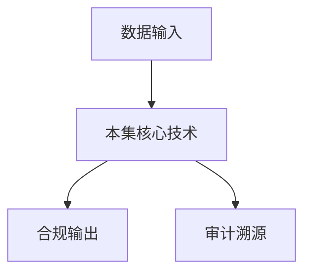

# P13 密态大模型

← [[BV1ser5BDESU-总览]] | ← [[P12-基于可信硬件的隐私计算框架TrustFlow]] | 下一篇 → [[P14-密态大数据安全方案与实践]]

## 视频信息

| 项目 | 内容 |
|------|------|
| 分集 | 密态大模型 |
| 模块 | 密态计算与TEE |
| 时长 | 29 分 43 秒 |
| 链接 | [B 站 P13](https://www.bilibili.com/video/BV1ser5BDESU?p=13) |
| 官方文档 | [SecretFlow 文档](https://www.secretflow.org.cn/zh-CN/docs) |
| 内容来源 | 知识点增强（数据要素流通技术体系，非逐字转写） |

## 核心要点

1. **本 P 主题**：密态大模型
2. **模块定位**：密态计算与TEE
3. **考试/实践侧重**：密态大模型推理、模型权重保护、TEE+加密
4. **笔记层级**：教程级（约 2967 字），含速览、图解、场景 Walkthrough、自测题
5. **学习建议**：先通读「3 分钟速览」与「图解」，再读「详细讲解」；动手项见 Checklist

> 以下内容基于数据要素流通与隐私计算技术体系撰写，对应 B 站分 P「密态大模型」。**非 UP 逐字转写**；不看视频也可建立框架，看视频可对照「与视频对照表」深化。

## 本节在系列中的位置

**模块**：密态计算与 TEE · 系列第 **P13/47** 集。

**建议前置**：[[基于可信硬件的隐私计算框架TrustFlow]]——建立本集所需背景。

**建议后续**：[[密态大数据安全方案与实践]]——在本集能力之上继续深入。

依赖关系：政策(P01–P06) → 可信空间(P07–P08,P18) → 密态/隐私技术(P09–P24) → SecretFlow 工程(P25–P32) → 基础设施与案例(P33–P47)。

## 3 分钟速览

**密态大模型** 是数据要素流通体系中的关键一课。读完本节你应能回答：① 核心概念定义；② 在「供得出—流得动—用得好—保安全」链条中的位置；③ 与隐私计算技术栈的衔接。考试/面试侧重：**密态大模型推理、模型权重保护、TEE+加密**。

## 零基础导读

本节「密态大模型」属于 **密态计算与 TEE**。即便未看视频，也应先建立**制度—技术—场景**三层视角：政策类章节回答「为什么允许流」；技术类章节回答「如何安全地算」；案例类章节回答「真实行业怎么落地」。

第一遍阅读请盯住三个问题：本集**解决什么痛点**？**关键参与方**是谁？**交付物或能力边界**是什么？第二遍阅读时，把术语表抄到 Obsidian 双链笔记，与前后分 P 交叉引用。

## 详细讲解

### 1. 密态大模型背景

大模型训练与推理涉及**海量数据**和**高价值模型权重**。密态大模型目标：保护用户 Prompt、保护模型 IP、防止推理过程泄露中间激活。

### 2. 威胁模型

| 资产 | 威胁 | 防护 |
|------|------|------|
| 用户输入 | 云运营商窥探 | TEE 内推理 |
| 模型权重 | 窃取复制 | 权重加密加载到 Enclave |
| 输出结果 | 成员推断 | 差分隐私输出 |
| 训练数据 | 梯度泄露 | 安全聚合/TEE 训练 |

### 3. 技术路线

**推理侧**
- 模型分片加密，TEE 内逐层解密计算
- GPU-TEE（HyperGPU）加速 Attention/FFN
- 机密容器部署推理服务

**训练侧**
- 联邦微调：各方本地 LoRA，中心 TEE 聚合
- 分割学习：激活值加密传输

### 4. 性能优化

- 量化（INT8/INT4）减少 Enclave 内存压力
- 批处理提高 GPU 利用率
- 模型蒸馏缩小 TEE 内模型体积
- 密钥轮换与 Attestation 缓存降低证明开销

### 5. 应用场景

- 医疗问诊 AI：病历不出院，模型在 TEE 推理
- 金融客服：客户对话不落地明文
- 政务大模型：敏感公文辅助写作

### 6. 考试/实践要点

- 说明大模型推理中哪些环节可用 TEE 保护
- 解释 GPU-TEE 解决的核心瓶颈
- 讨论密态大模型与「私有化部署」的取舍

### 7. 法规

生成式 AI 服务管理暂行办法要求训练数据合法来源；密态微调可证明「未直接接触对方明文训练集」。

### 8. 模型水印

输出侧嵌入水印追踪泄露，与 TEE 保护互补。

### 9. Token 经济

大模型按 Token 计费时，TEE 内计数可防止服务商少计或多扣；计费结果可签名上链供双方对账。

### 10. 学习与实践检查单

- [ ] 对照本 P 标题回顾 B 站视频章节要点
- [ ] 在 [SecretFlow 文档](https://www.secretflow.org.cn/zh-CN/docs) 找到对应模块
- [ ] 能用一句话向同事解释本 P 核心概念
- [ ] 识别一个本行业可落地的应用场景
- [ ] 记录与前后分 P 的技术依赖关系

### 11. 模块知识串联
本讲属于「数据要素流通技术」体系中的重要一环。建议在学习日志中标注：输入依赖（前序知识）、输出能力（学完能做什么）、与隐语组件映射（SecretFlow/Kuscia/SecretPad/TEE）。完成 47 讲后应能独立设计一个「政策合规+连接器+隐私计算+审计存证」的端到端方案，并评估 MPC、TEE、联邦学习的选型依据。

### 深化理解（密态大模型）

将本节概念放入「数据二十条」四原则框架：它主要支撑哪一条原则？若去掉该能力，哪类数据流通场景会受阻？用一句话向非技术经理解释本节价值。

## 图解

## 类比与直觉

把本节技术想象成**流水线的一环**：看清输入是什么、经过哪些处理、输出给谁用，比死记名词更有效。

## 例题与场景 Walkthrough

**场景：两家机构联合建模（不共享明文）**

1. **样本对齐**：若双方仅有交集用户有价值，先用 PSI（P21/P28）对齐 ID。
2. **特征拼接**：纵向联邦（P24）下 A 方持标签、B 方持特征，梯度通过安全聚合更新。
3. **训练执行**：在 SecretFlow SPU（P27）上完成密态前向/反向，或 TEE 内明文训练（P11–P17）。
4. **模型发布**：输出评分服务；模型参数经评估后按需出域，训练数据永不出域。
5. **本集关联**：密态大模型 提供其中 **密态大模型推理** 能力。

## 常见误区

1. **「学完本集就会用隐语」**：SecretFlow 生态需多集串联（P19–P32），单集只是拼图一块。
2. **「隐私计算等于不上传数据」**：数据仍以密文、份额或授权方式参与计算，网络与算力开销客观存在。
3. **「TEE 绝对安全」**：TEE 依赖硬件与侧信道防护，需远程证明（P17）与补丁策略。
4. **「区块链解决一切确权」**：链适合存证与交易撮合，大规模计算仍在链下隐私计算引擎。

## 与视频对照表

| 视频段落（约） | 预期演示内容 | 笔记对应章节 |
|-------------|------------|------------|
| 开篇 0%–15% | 本集目标、背景、与前后集关系 | 本节位置、3 分钟速览 |
| 前段 15%–40% | 核心概念定义与架构图 | 零基础导读、详细讲解 |
| 中段 40%–70% | 原理展开、对比、政策/代码示例 | 图解、类比、Walkthrough |
| 后段 70%–90% | 案例、问答、易错点 | 常见误区、Checklist |
| 收尾 90%–100% | 总结、延伸资源 | 延伸阅读、自测题 |

> 本集总时长约 **29分43秒**。无官方外挂字幕时，以分 P 标题「密态大模型」与上表主题对齐视频画面。

## 动手实践 Checklist

- [ ] 复述本集 3 个定义（不看笔记）
- [ ] 根据 Walkthrough 写 200 字场景短文
- [ ] 对照视频确认 1 个架构图/演示
- [ ] 在总览思维导图中标注本集节点
- [ ] 完成自测 Q1/Q5

## 延伸阅读

- [SecretFlow 文档中心](https://www.secretflow.org.cn/zh-CN/docs)
- TC609 可信数据空间相关标准
- 本系列相邻 2 个分 P 笔记

## 自测题

1. **本集核心考点？**  
   **答**：密态大模型推理、模型权重保护、TEE+加密。

2. **本集在四原则中的位置？**  
   **答**：偏流得动基础设施。

3. **与 SecretFlow 的关系？**  
   **答**：提供合规与架构前提，后续技术集在其上落地。

4. **一项落地检查？**  
   **答**：是否有授权、是否最小必要、是否可审计——三者缺一不可。

5. **30 秒口述本集？**  
   **答**：用「输入→处理→输出」各一句话概括（见 Walkthrough）。

## 关键术语

| 术语 | 说明 |
|------|------|
| 数据要素 | 可参与社会化配置、创造价值的数字化资源 |
| 隐私计算 | 数据可用不可见前提下实现协作计算的技术体系 |
| 密态计算 | 密文状态下完成计算 |
| 密态胶囊 | 数据+策略+密钥封装单元 |

## 与前后分 P 的衔接

- ← **基于可信硬件的隐私计算框架TrustFlow**（[[P12-基于可信硬件的隐私计算框架TrustFlow]]）
- → **密态大数据安全方案与实践**（[[P14-密态大数据安全方案与实践]]）

## 逐字转写
> 引擎: whisper | 状态: 已转写 | 格式: 段落化

### [00:01 - 00:55] 大家好我是来自蚂蚁蜜蚕的周艾辉
大家好我是来自蚂蚁蜜蚕的周艾辉，今天由我给大家来介绍密台道目型，今天我们的课程将分为四部分，第一部分是我们的问题定义，第二部分将介绍密台道目型，第三部分是教大家从零开始上手，搭建一个密台道目型退离服务，第四部分是对我们的课程做一个总结，首先是我们课程的第一部分，就问题定义了，随着AI时代的到零，道目型正在走向产业深度应用，那么需要更多高质量的数据，专业性的数据，那么对于行业道目型，构建者而言，其实数据短缺是一大难题，但一直同时对于数据和模型提供方而言，可能他们是有高质量的数据，但是又没有能力构建的一大模型，同时他们又会担心数据安全问题。

### [00:55 - 01:47] 不敢新的外部机构
不敢新的外部机构，使用他们的专业数据，那么如何确保数据和模型难安全，又是他们担忧的问题，那与此同时，对于模型使用方而言，query可能是涉及到，个人隐私和商业机密，那么query的安全，也是大家比较关心的问题，那么这些数据安全的问题，是极耐解决的，主要的大模型往后下一步的发展，那么我们怎么解决这个问题呢，通过密台道目型，其实我们可以解决这个数据和模型难安全问题，同时也可以保护query的安全，我们最终来实现高价值的数据教数应用，那么对问题的定义进行了产数呢，那我们接下来介绍密台大模型，那么在介绍密台大模型之前呢，我们先介绍一下机密计算。

### [01:47 - 02:35] 机密计算呢
机密计算呢，它的英文叫做confidential computing，那么机密计算讲的一个主要的概念是，数据使用者安全，就引寓子的一个安全，那么数据呢，其实在它的生命周期里面呢，其实我们可以概括为三大部分，第一部分是叫at rest，就可以理解为是纯处，然后第二部分是inch and z 传输，第三部分就是说使用中，那么数据的这三个环节呢，其实都比较说纯处安全，其实大家可能结束了也比较多，传输安全，比如说trs加密的传输安全，这个也是非常经典的一个安全，那么数据使用中的安全呢，就是机密计算抢掉的一个概念，那么通过保护内传中的数据。

### [02:35 - 03:27] 比如说对内传期间加密了
比如说对内传期间加密了，然后来保护数据使用中的安全，那么机密计算呢，通常会记以Ti来实现，Ti呢，它的中文一般会叫可信执行环境，那么我们可以这么理解Ti，它是一个隔离的环境，然后这个环境呢，可以保护呢，只有被授权的代码才可以去执行，那么在Ti里面的数据呢，其实是就是从Ti的外面呢，是没法去读或者去篡改的，那这是它的一个核心概念，那么Ti里面经常会有一个名词叫做应用非地，那么非地呢，你可以理解为是Ti的一个具体的一个实力，然后在这个非地里面呢，它就提供了一个隔离的环境，可以保护特定的代码数据，那么这个机密计算呢，它的威胁模型讲的是说。

### [03:27 - 04:18] 对于营厂商或者说其他的角色而言
对于营厂商或者说其他的角色而言呢，当你在云上去部署你的代码数据的时候，你这些代码数据在执行过程中，云厂商和其他方都是没法去获取你的数据和代码的，那么Ti呢，其实有三大特性，大家这三个特性是相对于R1E来讲，R1E呢，是其实中文会叫做副执行环境，那就是我们经常日常中所见到的，就是操作系统或者应用，其实他们都跑在一个明文的环境里面，明文的机器上面，那么通常我们把它叫做R1E的应用和R1E的OS，那么Ti呢，它突然会跑在Ti的硬件上面，在这个Ti硬件上面之上呢，它会运行所谓的，比如说Ti的一个操作系统或者运行室。

### [04:18 - 05:05] 在上面是跑的所谓的Ti的应用
在上面是跑的所谓的Ti的应用，那么Ti拥有三个非常重要的特性，那么第一个呢叫做隔离，就说首先R1E的负责蓝阶呢，它是被排除在Ti之外的，所以Ti它的攻击面是比较小的，然后它的Ti的安全性呢，主要依赖它致解，它不依赖R1E，那么第二个特性呢是说加密，那么通常来说Ti的硬件呢，它会保证Ti以R1E是强隔离的，而且Ti的硬件通常呢，会提供那层加密的能力，然后这样它可以防止Ti外面，或者R1E的环境去堵Ti的内存，或者去修改Ti的内存，那么Ti的第三个重要的特性是叫远程证明，那么就是说Ti硬件呢，可以作为一个性能根，它提供了一套远程证明的机制。

### [05:05 - 05:50] 就是可以让用户去对Ti的环境做
就是可以让用户去对Ti的环境做一个验证，确保这个是一个真实的Ti的硬件，构成了一个Ti的环境，而非一个虚假的Ti环境，那么通过这三个重要的特性呢，Ti其实就可以实现可用而不可见，也就是所谓的那个机密器材强调的，DataInU字的安全，那么接下来我们介绍密台大模型，然后中间这个大图呢，这个其实是讲述了整个大模型，全都是密台流转的一个过程，那么可以可以这么看这个图，就是我们首先讲大模型推理的部分，然后可以看上面这一块，大模型推理呢，首先它是说要有一个模型持有者提供大模型，那么我们可以看上面这个联络，那么模型持有者呢。

### [05:50 - 06:33] 我们会先对它的模型做一个加密
我们会先对它的模型做一个加密，之后上传放到云端，云端呢会把这个大模型，放加载到Ti里面，然后在Ti里面就是拉起一个大模型推理服务，最后形成一个对外的推理的一个API，那么用户呢，真正的用户呢，可以通过这个API，或者它可以通过一个外部轮曲，或者通过SDK，那么可以这个大模型的推理服务，进行一个加密的聊天，那这就是这就是所谓的，我们前面讲的那个问题，定义里面的query的安全，然后这个这个列录是可以保护query安全的，同时也可以保护这个大模型部署的时候，的大模型本身的一个安全，那么大模型，这个权力对面第二块列录的主要是下半部分。

### [06:33 - 07:23] 这里讲的是说
这里讲的是说，那大模型的可能通常的会涉及到一个，比如我们构建一个人一个大模型，可能会对大模型做一个后训练，比如说SFT或者说强化学习，那做完之后呢，你可能会带它做一个评测，那么首先这个后训练和评测的所有过程，是在T里面进行的，那么在这个后训练和评测的过程中，其实会涉及到主要是有两方，一方是模型持有的，一方是数据持有的，那么他们的分别贡献的模型和数据，当然也有可能这个模型，可能是一个开源的模型，这个都有可能，然后他们分别会把自己的数据和模型，就是加密，然后也是放到云上，之后呢他们会对这个，就是我们会有一个模块叫做，密台数据交代管理器这个模块。

### [07:23 - 08:09] 然后这个模块呢
然后这个模块呢，它做了两个功能，一个是就密奥管理，一个是做授权策略的教育，那么密奥管理是什么意思呢，就是说模型和数据都是被加密放到云上的，那么他们的密奥是被托管在，这个所谓的密台交代管理器里面，那同时呢，这个密台交代管理器，是也是跑在T里面的，所以它本身也是安全的，那另外一块呢，还有一个所谓的授权策略是什么意思呢，就是说模型持有者，或者说数据的持有者，他们可以对自己的数据或者模型去，先领它的授权的那个使用的策略，比如说数据持有者可以在策略里面写说，我的数据只能够用于做训练，但你不能拿来做其他的，那么这就是一个授权的策略。

### [08:09 - 08:52] 那么这些所谓的策略呢
那么这些所谓的策略呢，其实也会由这个密台数据交代管理器管理起来，并且由它进行教验，这个教验是怎么做的呢，就是说，这个后训练和评测，这个在T里面跑的时候呢，比方他们去访问，去获取这个对应的加密的数据，或者加密的模型的密要的时候呢，那么这个密台交代管理器的手间，会对这个它的那个数据，或者模型的那个数据策略进行一个教验，那么它会检查，比如说你，比如说数据持有者，它会要求你是一个后训练，那么它就会签检查，你是不是一个后训练的代码，如果不是的话，它就会拒绝把密要给你，如果是的话，它会把密要给到这个，所谓的后训练的这个代码，然后这个。

### [08:52 - 09:40] 这就是一个整体的一个当模型的
这就是一个整体的一个当模型的，权力诺密台流转的一个过程，那么接下来我们对这个流程做一个拆解吧，就是，就是我们详细，先介绍一下，所谓的这个当模型的一个推理的，这个Q率保护是怎么实现的呢，那么首先我们看这个图，这个图分为左右两大部分，左边是我们的一个推理客户端，可以理解为是用户端，用户可能是通过网页，或者说是直接调用一个API，或者说通过USDK的这种方式，会去对右边的这个，所谓的推理服务进行一个调用，那么右边的推理服务呢，是跑在T里面的，那么这里的过程大概是这样的，就说首先这个推理客户端呢，会对这个所谓的推理服务呢，做一个免成认证的请求。

### [09:40 - 10:22] 然后在那么推理服务呢
然后在那么推理服务呢，会在它的内部，在这个内部呢，会生成一个所谓的，免成认证的一个报告，然后这个报告呢，其实是会有那个，表的T呢，这个硬件的芯片里面，内置的私要进行一个签名，然后这个免成认证报告呢，通常会包含，比如说它的硬件的信息，固件的信息，软件的信息，配置信息等等等等，那么之后呢，这个免成认证报告，就我们第三步，会不会发挥，会给推理客户端，那么推理客户端，拿到这个免成认证报告的同时呢，它会拿到这个推理服务的这个功耀，就是功耀和免成认证的报告，会一起被带回给这个推理客户端，那么推理客户端，其实就可以去找这个可信根机构，就说所谓的这个T的这个硬件。

### [10:22 - 11:08] 肯定这些环境硬件的
肯定这些环境硬件的，这个背书的这个厂商，比如说国内的话，可能比如说是蚂蚁蜜蒜的T，就是蚂蚁蜜蒜，或者说其他的可信的这三方，那么找这个可信根机构呢，去验了这个免成认证报告，那么它主要是说，为了确认这个环境的确认，是一个真实的一个T的环境，那么这个演成的报告，教验通过之后呢，那么用户呢，其实就可以相信的，这是一个推理服务，确实跑在T里面，而且它的功耀是可以信任的，那么就回到了，就开始进入到第五步，第五步呢，就是说会对推理型要做一个加密，它大概的原理是说，首先它会用功耀，对这个数据的密要做一个加密，我们可以看到这一个，这是一个钥匙的形状，它是一个数据密要。

### [11:08 - 11:49] 就是在推理科物丹自己产生的
就是在推理科物丹自己产生的，那么用功耀加密这个数据密要，同时用这个数据密要，去加密这个推理型球的内容，那么我们会得到一个加密后的数据密要，还有一个加密后的推理型球，那么之后呢，推理科物丹会把这个加密的推理型，那个推理型球和密要呢，都会发送给推理服务，那么推理服务就来到第七步了，推理服务呢，它会用自己的，因为它有私要，它会用这个私要，解密这个数据密，加密后的数据密要，那么它就会得到一个，明文的数据密要，那么它再用这个数据密要，去解密这个推理型球，那就可以得到，最终的一个明文的推理型球，那它之后再把这个推理型球，发送给它自己，内部的大模型服务。

### [11:49 - 12:32] 那么就是
那么就是，碟八博大模型做它，那大模型呢，会对你的问题，做一个回答，得到一个做答的内容，那么同时呢，这个推理服务呢，并不会直接把这个做答内容，直接就返回给推理科物丹，它会先对这个做答内容，做一个加密，它的密要呢，也是这个科物丹自己发过来，这个数据密要，那么加密后的做答内容呢，会被返回给推理科物丹，那么最终推理科物丹再用自己的，这个数据密要呢，对这个做答内容做一个解密，最后得到一个明文的做答内容，这就是一个完整的，一个碟八博大模型推理的，一个球里保护的一个链路，那么接下来我们讲一下，那个碟八博大模型的，后训练数据和模型保护的链路，然后这个链路呢。

### [12:32 - 13:21] 会比球里保护呢
会比球里保护呢，要更复杂一点，但其实基本原理是差不多的，然后在这里呢，其实有三大块的模块，你最左边是机构，你可以理解，为是后训练，因为它可能设计到的是数据，或者模型的，那么这个机构指的，就是说数据或者模型的机构方，那么中间呢，是一个密态数据交代管理服务，就前面也讲过这个服务的，这个服务的主要作用，是为了拖拐这个数据的密要，同时呢，对它这个密要的使用呢，做一个健全，这个服务呢，其实本身也是要泡在T里面的，这样的话才能保证，它是安全和可信的，那么最右边呢，是我们的后训练应用，它也是泡在T里面的，这个比如说，像SFT啊，或者RL啊，或者评测量化等等啊，这个都。

### [13:21 - 14:04] 我们就把它统充为叫做后训练应用
我们就把它统充为叫做后训练应用，那么这里的具体的流程，那么从第一步开始是这样的，首先呢，是说这个机构，会对这个密态数据交代管理服务，做一个演成能证，那么原理呢，其实跟前面是类似的，就是说这个交代管理服务呢，它还会继续升到一个演成能报告，就是第二步，之后把这个演成能报告呢，返回给这个机构机构呢，再去找可信的，跟机构呢，作为一个认证，最后呢，确定这个演成能报告是可信的，从而证明这个，交代管理服务呢，是泡在一个T里面，这个步骤就是第二步的，为了方便呢，我们就把这一些过程给省略掉了，那么第二步完了之后呢，就是机构就可以确信这个管理，交代管理服务是可信的。

### [14:04 - 14:54] 那么它就可以把自己的
那么它就可以把自己的，用这个，交代管理服务的功耀呢，去对它自己的数据呢，的密要呢，做一个加密，当然它自己的数据本人是用，机构自己的数据密要做加密了，那么这样的话就得到了，几个几块一种，一块是说加密后的数据，对吧，还有一块是，用这个管理服务的功耀加密，过后的这个数据密要，那么同时呢，还有一块就是说，那个数据的授权，使用策略，前面也提过啊，就是说，这个数据或者模型的提供方呢，可以指定一个使用的策略，就是说，允许这个数据或者模型，被怎么使用，那么接下来呢，就是第四步和第五步了，第五步的话，就是说，我们有了数据密号的，有数据策略呢，那么它会，会被发送给，交代管理服务。

### [14:54 - 15:39] 然后交代管理服务
然后交代管理服务，会把它管起来，那么同时呢，这个机构呢，就是第六步了，它会把这个，加密之后的数据呢，或者模型呢，会上到云端，就是我们放在云存储，当然这个有可能，这个开环境啊，定位就反而是放在，一个存储的地方，那么做完这些，准备的工作之后呢，其实我们就要开始进行，一个后训练嘛，那么这个就开始，进入到那个第七步了，那假如说我们开始，执行一个后训练的应用，比如说我们执行一个强化学习，那么它就需要访问，这个数据和模型嘛，那么就是第七步开始，那个后训练应用呢，它会先去找这个数据，加拿大管理服务呢，去请求数据庙，那么数据加拿大管理服务呢，会先对这个，做一个健全。

### [15:39 - 16:26] 这个健全的逻辑呢
这个健全的逻辑呢，是说，大概的逻辑是说，首先会去，它会看见这个数据，或者模型的，一个使用的数据的策略，那么你这个应用时候，满足这个策略，那么只有在这个策略，被满足之后呢，才会去用，解开这个数据的庙，把这个庙，通过，加密的方式呢，给到这个后训练应用，这里注意，这个密钥本身也是被加密的，也就是说第九步，它发生数据密钥，这个数据密钥呢，其实是用，这个所谓的应用的功耀加密，所以这个过程也是安全的，那么拿到密钥之后呢，后训练应用呢，就要去下载真正的，这个数据或者模型了，那它这个下载，就就是一个整合的过程，那么第十一步呢，就讲的是说，现在，后训练应用呢，它现在又有数据了，对吧。

### [16:26 - 17:11] 有加密或者数据或者模型
有加密或者数据或者模型，同时它也有对应的密钥，那么它就可以，通过这个密钥去解密这个数据，或者模型，得到这个明文的数据，或者模型，那么之后呢，它就可以开始进行真正的后训练了，那么它拿到这个，预料的数据啊，然后记忆当模型，它就可以做微调，做墙外学习等等等等，那么接下来，我们介绍一些应用案例吧，然后，就是这个应用案例讲的是说，国内的模TOP7IM，这个其实就是大家应该都知道，就是国内非常有没有，这顶尖的计价了，然后其实他们就用了，我们的密钥当模型技术，来保护这个当模型的curie安全，那么他遇到的问题，其实，我们就开始介绍的，那个问题是类似的，就是说。

### [17:11 - 17:57] 对于这个IMB端客户而言
对于这个IMB端客户而言，他们在IMB内呢，其实有大量使用当模型的需求的，但是这个当模型的需求，使用过程中呢，其实它会涉及到，B端客户的核心数据资产，那么B端客户呢，他又很担心自己的数据被泄漏，所以他也不敢说，直接去使用一个，他不敢信任的外部的，一个第三方的一个模型，那么我们是怎么解决，他这个问题的呢，其实就是说，我们通过前面讲的，这个所谓的密钥当模型，这个方案，因为他提供了一个，curie安全的保护嘛，那么这个，这个，那么这个IMB上面提供的这个，AI应用的，他就可以机忧我们的密钥当模型，去保护用户的，那个敏感数据，比如他的私料的消息啊，权消息啊。

### [17:57 - 18:42] 文档库瓦的程标
文档库瓦的程标，权文件等等等等，这些东西都可以通过，前面讲的那个加密的链路保护起来，那么最后呢，模型的输入呢，他是通过一个密用的形式，被发送给一个云旦当模型密钥退离服务，那么同时呢，这个密钥当模型的退离服，他返回给自个爱养模的，他返回的也是一个密闻，那么这样的话，这个，从这个输入到输出，整体都是一个密钥保护的过程，那么最终呢，保护了这个企业的，商业机密和隐私安全，那么另外一个应用案例是说，大模型的密钥知识库，那这个这个案例想啊，是说，就是现在其实很多企业，会还有一些个人用户，其实他是希望有自己的一些，知识库的，然后他们希望用自己的一些。

### [18:42 - 19:26] 专业知识去构建自己的一些
专业知识去构建自己的一些，知识库的能力呢，然后通过这个都，这通过这些知识能力呢，然后让自己的，业务呢，就是受益，但是呢，通常这个过程，那么他也需要使用到外部的大模型，就是，因为有很多企业或者个人，其实他也无法负担得起，自己部署一整套，大模型的服务，那么所以他们就会导致，他们有很多私有的文章，其实他不敢，就给大模型去用，那么如果有了我们这个密钥大模型，他们这个，这个场景就可以得到一个解决，那么，那么这个解决方案呢，大概是这样的，就是说，首先这会有一个端侧的知识库，这个端可能是说用户端，就是比方说是，一个企业的内部的一个域，或者是个人用户的自己的一个。

### [19:26 - 20:08] 本地的一个服务器
本地的一个服务器，或者电脑啊，然后在这个端上呢，其实是有一个，可以认为是有一个本地的知识库的，可能里面涉及到一些，企业的机密数据啊，或者是各地隐私一些文档，那么在这个端上呢，其实会有一个知识库，然后这个知识库呢，是一个可以对这个知识做一个，检索，之后呢，这个检索出来的知识呢，在家常用户想要，就是问答的一个问题呢，就是Q类的内容，组合到一起呢，它会进行一个加密，然后这个用户的问题和这个，检索在知识片呢，被加密之后呢，就送入到这个云丹大模型，云丹大模型提供，其实就提供了，我们会提供通用的大模型，吹着大模型的一些服务，然后同时呢，因为它的Q类是一个加密的。

### [20:08 - 20:54] 它返回的也是一个
它返回的也是一个，模型的数据也是加密的，都是密闻的，那么之后呢，这个对于这个用户而言，或者说对于这个企业而言，它就不用担心，它的商业的机密，或者个人的隐私呢，被泄漏，那么这个案例呢，其实就可以保护企业，和个人的商业机密和隐私安全，同时呢，因为有了这套发案呢，就是用户，或者说企业呢，它敢去使用它的知识库的，就是它敢去用，就是它也不需要说，一定要在本地，自己部署一套大模型的推理服务，然后这样的话可以，基于这个知识呢，它就可以获得一个，更好的一个业务场景的使用，它的答案的可靠性呢，还有它的商业品，都会得到提升呢，同时呢，在云丹的话，因为我们可以，做一些更多的使用。

### [20:54 - 21:47] 就是我们可以
就是我们可以，跟针对客户的场景，做一些，这个垂裂的大模型，然后提供更丰富的领域，因为我们可以，通过密带的方式，去保护这个领域的知识，那么就预约着，我们有机会去训练出一个，更加高效，垂直专业的一个大模型，那么，接下来是，我们这个课程的第三块，就是我们会，教大家从零，开始搭建一个，密带大模型推理服务，那么，首先我们先介绍一下，CharsFlow，就是马尼米算，其实之前，开源过一套，记忆可静执行环境的一个，计算框架，叫CharsFlow，那么这个开源的地质，就贴在这里，大家心里可以去访问，那么CharsFlow呢，就是，左边是CharsFlow的，一个介绍的图，就是它。

### [21:47 - 22:33] 是在提议的
是在提议的，可静执行环境，这个，至上的购建了，一整套的，可静的应用，同时呢，它也提供了，一整套完整的密带，数据交量的一个管理服，包括它的数据的，宽语管控，安全加固等等，那么它支持，经济学习算法，还有深度学习，还有大模型数据分析等等，那么这里为什么说，我们要先介绍CharsFlow，是因为CharsFlow，提供了一套，就是，所谓的，机密计算的透明框架，那么简称叫CCTF，那么这套机制呢，可以帮助应用的，无缝迁移到机密的，迅速下面，去做一个安全的进行，那么这个框架的，原理是说，就是说，它会在一个机密信息机里面，去部署很多个set card，然后这个set card。

### [22:33 - 23:22] 可以提供远程认证的一个代理
可以提供远程认证的一个代理，或者说数据读写的代理，或者通信代理的功能，然后这些功能，可能对应用本体来讲，可能是无感的，那么这样的话，我们就可以通过，直接把应用放在，这个框架里面去运行，从而实现，一个密带的应用，那么接下来，我们对这个，问题的步骤做一个拆解，那么第一步呢，是环境准备，那么首先硬件呢，我们要建议，有一台X86的服务器，然后配备了GPU，最好是因为达了GPU，然后这里，如果你不是X86的机器的话，或者是ARM，或者其他的架构，这个建议可以参考，那个VARM的官网，有专门的说明，教你怎么去运行，那么这里，我来说一下，就是我，这里我没有去强调。

### [23:22 - 24:06] 说大家一定要准备一个
说大家一定要准备一个，肯定资金环境的一个服务器，主要是考虑到大家，准备有这个，就是准备这个环境呢，可能是有一定的难度的，就是毕竟现在，有肯定资金环境的，这个机器，特别是配备GPU的机器，这个普及度并不高，所以我们这里，没有强制要求，但是它也不反而去，我们构建一个，密带当兵推理服务，只是说这个推理服务，它并不是真的跑在一个，真实的T的GPU的环境里面，如果大家真的有T的，真实的环境，其实也可以，用我们后续介绍的，一样的方式去部署，这个都是，就是原理是一样的，网络上的其实，大家要求比较简单，就是大家可以去，防护公网就可以的，因为下载模型是需要的，软件上就是。

### [24:06 - 24:50] Python建议是大于等于
Python建议是大于等于，3.10版本，那么多可能建议是，19.03以上，或者更高一点也可以，那么接下来我们去部署，这个，第二步就是部署推理服务了，那么这个命令行，其实我们贴在这里的，那么这一整段的，这个代码的其实，我们都放在我们，开源的仓库里面的，所以呢大家可以按，这个命令上去执行，就是首先你要，get a column，我们的trust flow，这个代码仓库，之后进行到，我们的那个，实力的代码的，那个目录下面，之后我们只需要，执行dock-compose-up，这个命令就行了，如果一些顺利的话，你应该会看到，这个输出就是，这个WM会打出这样的。

### [24:50 - 25:39] 这个表明就是
这个表明就是，它的服务已经启动了，OK的，那么最后，第三步呢，其实就是说，我们要去验证一下，这个代码仓库，对吧，我们要去访问它，那么我们可以，执行这个命令，就是说，首先我们就按照，我们必要的依赖，pip install，之后呢，我们就执行，我们的JW client，这个拍摄的脚本，那这个脚本，其实会做一些事情，就是它会去，访问这个，刚刚我们拉起来的，那个WM，这个代码仓服务，然后这个脚本里，就是它们，就问了，这个代码仓，一个人就你好，就是如果你这个，正常的话，你可以看到这些反尾，一个是说，这个模型的思考，它思考了一大段，把这个我们就忽略不堵了，之后呢，它给你回答，就说你好。

### [25:39 - 26:19] 有什么可以帮助你的吗
有什么可以帮助你的吗，然后这个，在这个势力里面，其实我们，部署的，默论部署的是，一个千万三零点六B的模型，就大家如果有，有想法的话，可以换成，其他的模型，这个都没有关系的，那么这里呢，就是说，我们要介绍一下，这个里面就是，就是我们虽然是演示，但是我们要了解，就是说，这里到底是怎么做到，一个明太推理的对吧，前面我们介绍了，一个明太推理的内容，那么我们可以，自己有兴趣的其实，你可以打开这个脚本，看一下，就看看它到底做了啥，这里我做一个简单的介绍，就说这个脚本的，第一步其实就是，会对这个，弹幕性服务，本地做一个演册认证，然后或其他的功耀，那当然前面强调了，因为我们没有。

### [26:19 - 27:01] 说你一定要在一个
说你一定要在一个，可信之心，环境的这个GPU的下面，去做一个，明太弹幕性的部署，就是你可以拿不同的，机器部署，我们可以理解为，是一个反正模式，它并不是一个真正的，一个T的原成认证，但是这个原理，其实是一样的意思，那么第一步，拿到这个功耀之后，其实就是这个脚本，会让这个功耀，对这个QD的内容，进行一个加密，那么之后这个脚本，其实就会把，这个加密合的请求，还有它的对话弥昂，发给这个弹幕性的推理服务，那么弹幕性的推理服务，其实会解密这个请求，然后对弹幕性，做一个回答，然后之后这个，回答的内容，也是加密的，加密的回答内容，会不会返回，给这个脚本，那么脚本之后。

### [27:01 - 27:46] 会用它的这个对话弥昂
会用它的这个对话弥昂，去解密这个回答的内容，从而得到一个，明文的回答，其实就是大家可以，去看一下代码，其实它代码的逻辑，其实就是这样的一个逻辑，然后在这个过程中，其实我们可以，有兴趣还可以看见，就是在那个室内代码，下面有一个，Dock Compose的一个压模，就是大家可以看到，有一个，有一个压模的一个文件里面，其实是说，里面可以看到就是，这个整个大面推理服务，是怎么被部署起来的，就是我右边也解了些图，其实这个里面非常简单，一共就是有三个容器，那么前面两个容器，第一个是，我们的远程轮证的，这个塞德卡，就是说在第一个容器，第二个是我们的，Evoi的这个容器。

### [27:46 - 28:27] 第三个就是我们的
第三个就是我们的，VM的这个景象的容器，那么其实这就是我们，就是前面我们强调过的，就是我们，Trustful能够提供了一整套的，这个所谓的透明化，变成空假cctf，那么这个所谓的这个，演出证证的，还有这里的Evoi，其实都是，就是Trustful能够提供的，就是你只要把它组装一起，然后放到你这个，推理的服务的前面，提前拉起，然后之后你就可以，正常拉起你的推理服务了，我们可以看到，这里的VM是完全和你，正常启动一个VM，是没有任何差别，就是你不用做任何改造，然后之后你就可以拉起，一个VM推理服务，然后之后你对外提供，这个推理的时候，你获得的是一个。

### [28:27 - 29:13] Metai推理的能力
Metai推理的能力，那么这就是我们的，Trustful带来的一个优势，那么最后一部分，第四部分其实就是，我们对课程，做一个快速简单的总结吧，其实我们这个课，其实主要讲了两块内容，第一块是说，我们介绍了一下，整体的这个Metai大帽型的，全能动Metai的一个原理，那么从，训练到推理，其实我们都介绍了，那么通过这个，Metai大帽型的，前练录的一个Metain，其实我们可以发现，它可以保护你的训练数据，保护Q率，也可以保护大帽型本身，那么这是我们整个课程的，第一块的主要的那种，第二块呢，其实说我们，也教了大家，怎么去从零开始，上手搭建一个。

### [29:13 - 29:40] Metai大帽型推理服务
Metai大帽型推理服务，那么这个呢，是我们是基于Trustful的，CCTF，就是GimG算透明化框架，来实现的，然后通过这个框架，其实我们可以发现，非常可以，真的是可以零基础的，快速实现一个，Metai大帽型推理服务，就体现了，这个这套框架的优势，那么我们的课程呢，就到此就结束了，非常感谢大家的观看。

## 来源说明

- ✅ B 站官方元数据（`Tools/BV1ser5BDESU-full.json`）
- ✅ 分 P 首帧封面（`Tools/bili-fetch/fetch-bilibili.js`）
- ✅ **教程级增强**：含图解/Mermaid、场景 Walkthrough、自测题（约 2967 字，2026-06-06）
- ⏳ 逐字转写：B 站 API 无外挂字幕轨；可选 Whisper/BiliNote 后续补充

## 关键截图

![[../../06-资源附件/video-notes-images/BV1ser5BDESU-P13-cover.jpg|B站首帧 P13]]
