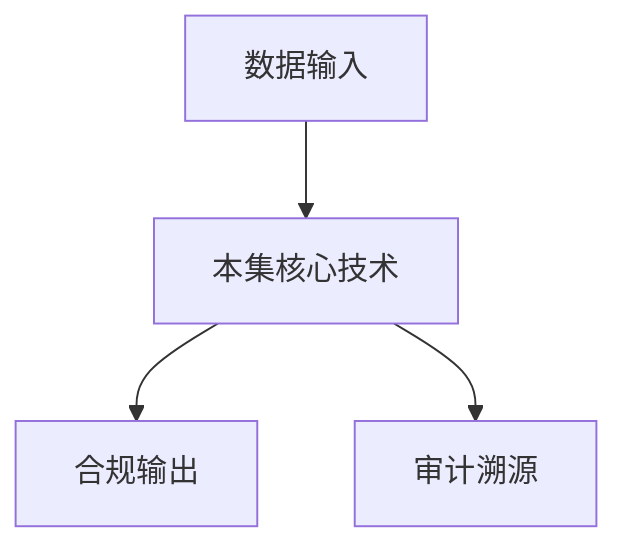

# P14 密态大数据安全方案与实践

← [[BV1ser5BDESU-总览]] | ← [[P13-密态大模型]] | 下一篇 → [[P15-HyperGPU-基于通用硬件构建GPU-TEE底座]]

## 视频信息

| 项目 | 内容 |
|------|------|
| 分集 | 密态大数据安全方案与实践 |
| 模块 | 密态计算与TEE |
| 时长 | 21 分 59 秒 |
| 链接 | [B 站 P14](https://www.bilibili.com/video/BV1ser5BDESU?p=14) |
| 官方文档 | [SecretFlow 文档](https://www.secretflow.org.cn/zh-CN/docs) |
| 内容来源 | 知识点增强（数据要素流通技术体系，非逐字转写） |

## 核心要点

1. **本 P 主题**：密态大数据安全方案与实践
2. **模块定位**：密态计算与TEE
3. **考试/实践侧重**：密态大数据平台、存储计算分离、全链路加密
4. **笔记层级**：教程级（约 3014 字），含速览、图解、场景 Walkthrough、自测题
5. **学习建议**：先通读「3 分钟速览」与「图解」，再读「详细讲解」；动手项见 Checklist

> 以下内容基于数据要素流通与隐私计算技术体系撰写，对应 B 站分 P「密态大数据安全方案与实践」。**非 UP 逐字转写**；不看视频也可建立框架，看视频可对照「与视频对照表」深化。

## 本节在系列中的位置

**模块**：密态计算与 TEE · 系列第 **P14/47** 集。

**建议前置**：[[密态大模型]]——建立本集所需背景。

**建议后续**：[[HyperGPU：基于通用硬件构建GPU-TEE底座]]——在本集能力之上继续深入。

依赖关系：政策(P01–P06) → 可信空间(P07–P08,P18) → 密态/隐私技术(P09–P24) → SecretFlow 工程(P25–P32) → 基础设施与案例(P33–P47)。

## 3 分钟速览

**密态大数据安全方案与实践** 是数据要素流通体系中的关键一课。读完本节你应能回答：① 核心概念定义；② 在「供得出—流得动—用得好—保安全」链条中的位置；③ 与隐私计算技术栈的衔接。考试/面试侧重：**密态大数据平台、存储计算分离、全链路加密**。

## 零基础导读

本节「密态大数据安全方案与实践」属于 **密态计算与 TEE**。即便未看视频，也应先建立**制度—技术—场景**三层视角：政策类章节回答「为什么允许流」；技术类章节回答「如何安全地算」；案例类章节回答「真实行业怎么落地」。

第一遍阅读请盯住三个问题：本集**解决什么痛点**？**关键参与方**是谁？**交付物或能力边界**是什么？第二遍阅读时，把术语表抄到 Obsidian 双链笔记，与前后分 P 交叉引用。

## 详细讲解

### 1. 密态大数据挑战

传统大数据平台（Hadoop/Spark）假设数据明文存储、明文计算。数据要素流通要求**存储密态、计算密态、结果受控**，需在分布式架构上叠加安全层。

### 2. 参考架构

| 层 | 密态改造 |
|------|----------|
| 存储 | 透明加密（TDE）、对象存储 SSE-KMS |
| 计算 | Spark on TEE、MPC 聚合算子 |
| 调度 | 策略感知的任务编排（Kuscia） |
| 元数据 | 加密目录、细粒度 ACL |
| 审计 | 全链路操作日志上链/存证 |

### 3. 关键技术

- **列级加密**：敏感列单独密钥，查询时 TEE 内解密
- **安全 UDF**：用户定义函数仅在 Enclave 执行
- **联邦 SQL**：SCQL 跨域 JOIN 不暴露非交集
- **数据水印**：导出结果嵌入溯源标识

### 4. 落地实践路径

1. 存量系统：先存储加密 + 传输 TLS
2. 增量场景：新分析任务迁入 TEE/MPC 集群
3. 目录登记：元数据与策略入可信空间
4. 渐进式：从离线批处理到近线查询

### 5. 性能与成本

密态大数据通常有 **2–10×** 性能开销。优化手段：硬件加速、本地化计算（数据不动）、预聚合、采样。

### 6. 考试/实践要点

- 画密态大数据分层架构图
- 说明 Spark 任务如何与 TEE 结合
- 列举一个政务数据融合的技术选型表

### 7. 湖仓一体

Data Lakehouse 上叠加密态层：Iceberg/Delta 表元数据明文，敏感列密文，查询下推 TEE。

### 8. 成本模型

评估 TEE 集群 CAPEX/OPEX vs 数据泄露期望损失，支撑立项。

### 9. 数据血缘

密态流水线每步输出带血缘标签：输入胶囊 ID、算子版本、参与方，满足监管溯源与事故追责。

### 10. 学习与实践检查单

- [ ] 对照本 P 标题回顾 B 站视频章节要点
- [ ] 在 [SecretFlow 文档](https://www.secretflow.org.cn/zh-CN/docs) 找到对应模块
- [ ] 能用一句话向同事解释本 P 核心概念
- [ ] 识别一个本行业可落地的应用场景
- [ ] 记录与前后分 P 的技术依赖关系

### 11. 模块知识串联
本讲属于「数据要素流通技术」体系中的重要一环。建议在学习日志中标注：输入依赖（前序知识）、输出能力（学完能做什么）、与隐语组件映射（SecretFlow/Kuscia/SecretPad/TEE）。完成 47 讲后应能独立设计一个「政策合规+连接器+隐私计算+审计存证」的端到端方案，并评估 MPC、TEE、联邦学习的选型依据。

### 深化理解（密态大数据安全方案与实践）

将本节概念放入「数据二十条」四原则框架：它主要支撑哪一条原则？若去掉该能力，哪类数据流通场景会受阻？用一句话向非技术经理解释本节价值。

## 图解

## 类比与直觉

把本节技术想象成**流水线的一环**：看清输入是什么、经过哪些处理、输出给谁用，比死记名词更有效。

## 例题与场景 Walkthrough

**场景：两家机构联合建模（不共享明文）**

1. **样本对齐**：若双方仅有交集用户有价值，先用 PSI（P21/P28）对齐 ID。
2. **特征拼接**：纵向联邦（P24）下 A 方持标签、B 方持特征，梯度通过安全聚合更新。
3. **训练执行**：在 SecretFlow SPU（P27）上完成密态前向/反向，或 TEE 内明文训练（P11–P17）。
4. **模型发布**：输出评分服务；模型参数经评估后按需出域，训练数据永不出域。
5. **本集关联**：密态大数据安全方案与实践 提供其中 **密态大数据平台** 能力。

## 常见误区

1. **「学完本集就会用隐语」**：SecretFlow 生态需多集串联（P19–P32），单集只是拼图一块。
2. **「隐私计算等于不上传数据」**：数据仍以密文、份额或授权方式参与计算，网络与算力开销客观存在。
3. **「TEE 绝对安全」**：TEE 依赖硬件与侧信道防护，需远程证明（P17）与补丁策略。
4. **「区块链解决一切确权」**：链适合存证与交易撮合，大规模计算仍在链下隐私计算引擎。

## 与视频对照表

| 视频段落（约） | 预期演示内容 | 笔记对应章节 |
|-------------|------------|------------|
| 开篇 0%–15% | 本集目标、背景、与前后集关系 | 本节位置、3 分钟速览 |
| 前段 15%–40% | 核心概念定义与架构图 | 零基础导读、详细讲解 |
| 中段 40%–70% | 原理展开、对比、政策/代码示例 | 图解、类比、Walkthrough |
| 后段 70%–90% | 案例、问答、易错点 | 常见误区、Checklist |
| 收尾 90%–100% | 总结、延伸资源 | 延伸阅读、自测题 |

> 本集总时长约 **21分59秒**。无官方外挂字幕时，以分 P 标题「密态大数据安全方案与实践」与上表主题对齐视频画面。

## 动手实践 Checklist

- [ ] 复述本集 3 个定义（不看笔记）
- [ ] 根据 Walkthrough 写 200 字场景短文
- [ ] 对照视频确认 1 个架构图/演示
- [ ] 在总览思维导图中标注本集节点
- [ ] 完成自测 Q1/Q5

## 延伸阅读

- [SecretFlow 文档中心](https://www.secretflow.org.cn/zh-CN/docs)
- TC609 可信数据空间相关标准
- 本系列相邻 2 个分 P 笔记

## 自测题

1. **本集核心考点？**  
   **答**：密态大数据平台、存储计算分离、全链路加密。

2. **本集在四原则中的位置？**  
   **答**：偏流得动基础设施。

3. **与 SecretFlow 的关系？**  
   **答**：提供合规与架构前提，后续技术集在其上落地。

4. **一项落地检查？**  
   **答**：是否有授权、是否最小必要、是否可审计——三者缺一不可。

5. **30 秒口述本集？**  
   **答**：用「输入→处理→输出」各一句话概括（见 Walkthrough）。

## 关键术语

| 术语 | 说明 |
|------|------|
| 数据要素 | 可参与社会化配置、创造价值的数字化资源 |
| 隐私计算 | 数据可用不可见前提下实现协作计算的技术体系 |
| 密态计算 | 密文状态下完成计算 |
| 密态胶囊 | 数据+策略+密钥封装单元 |

## 与前后分 P 的衔接

- ← **密态大模型**（[[P13-密态大模型]]）
- → **HyperGPU：基于通用硬件构建GPU-TEE底座**（[[P15-HyperGPU-基于通用硬件构建GPU-TEE底座]]）

## 逐字转写
> 引擎: whisper | 状态: 已转写 | 格式: 段落化

### [00:00 - 00:55] 大家好我是來自蠻隱密算的吳俞朵
大家好 我是來自蠻隱密算的吳俞朵，今天帶來數據要素流通木刻系列，主題是 密胎大數據安全方案與實踐，主要內容分為四部分，從背景與挑戰 系統架構設計，和核心安全能力和典型應用場景，來解析密胎大數據引擎的方案，首先介紹密胎大數據的背景與挑戰，數據20條在2022年發布以來，對於數據要素流通的需求及待解決，如何讓數據安全的流通，最大化數據的價值成為了數據要素市場化的關鍵，與此同時 在向政務 金融 醫療等領域的數據，呈現了大規模的續盟發展，在進行大數據的處理時間過程中，也暴露出了很多風險，向數據在存儲 流通 計算過程中的泄漏問題。

### [00:55 - 01:51] 數據出獄後的有效管控
數據出獄後的有效管控，對於數據的使用目的 使用方式，使用次數 使用時間等吸力度的控制，也是數據提供方所需要的重要能力，此外 像NPC 同胎加密等方案，沒有達到對大規模數據計算性能的需求，那麼如何兼顧數據規模 安全保障，計算性能三個方面是重中之重，在其中面臨著三個主要的安全問題，第一是在保證性能的前提下，保護數據在存儲 傳輸，計算過程中的機密性，防止越權數據訪問，運為管理人員盜取數據，第二是在數據離開，數據持有方的控制欲後，如何保證仍然能夠得到，持有方的有效全線控制，在數據計算 流出等關鍵的流程上，都需要遵從提供方的全線約束。

### [01:51 - 02:48] 防止全線越過偽造或篡改
防止全線越過 偽造或篡改，第三是如何對數據實施，細力度的動態策略配置，在數據內容使用場景 執行的算法，執行計算的環境 數據使用的次數，數據訪問的時間等方面，支持可擴展的動態的，全線配置與管理，那麼基於上述的背景與挑戰，接下來介紹，密泰大數據引擎的架構設計方案，以及如何解決了，大規模數據計算場景的安全問題，密泰大數據引擎是，基於可信執行環境構建，里程通過硬件可信跟作為可信基礎，通過遠程證明服務，對可信應用身份進行註冊 認證和管理，可信廟管理服務通過雙線遠程認證，給可信應用提供了廟管理的能力，在此基礎上構建了，密泰大數據的核心計算引擎。

### [02:48 - 03:48] 計算引擎分為兩類
計算引擎分為兩類，分別是支持大規模數據的，理線計算引擎，是通過SPAC實現的，另一類是支持，實施計算的在線計算引擎，是通過密泰數據庫實現的，除了計算引擎之外，還有管控相關的服務，任務管理服務，負責理線計算任務的調度，和狀態管理等，遠數據管理服務對不同類型，不同來源的各類遠數據，進行統一管理，其中還包括策略管理，血源管理等能力，服務在如計算任務的執行，數據查看，數據導出等，數據的這種訪問節點，會進行訪問控制，建築的流程中還會包括，對請求方的身份認證，捲線判定，以及與數據訪問請求相關的，附加操作，比如數據密要的獲取，存出訪問憑證的獲取等等，身份認證服務。

### [03:48 - 04:48] 是負責用戶身份註冊
是負責用戶身份註冊，認證的能力，基於上述的能力提供了，統一的對外接口支持，數據的管理全線的管理，任務的管理等功能，接下來，我們從控制計算，數據三個平面展開，從數據的流通角度來看，各個功能組件之間的關係，首先在控制平面，研發管理平台作為，整體的入口，給用戶提供了數據管理，任務管理等一個圖形界面，可以支持用戶編寫，計算邏輯發起計算任務等等，在數據流入的過程中，數據加密後，通過數據流入的組件，流入到數據存儲中，數據在流入之前，在數據提供方域內，會完成數據的封裝，封裝後的形式我們稱之為，密碳數據膠囊，其中包括遠數據密緣數據，加密的數據密要，使用策略的。

### [04:48 - 05:40] 數據膠囊的細節
數據膠囊的細節，會在後面展開描述，數據在完成流入之後，會通過平台發起，理線或在線任務，首先來看理線任務，理線任務通過，任務管理服務解析之後，通過基於KBIAS的，任務調度機制，將任務按需下發到，civilus spark集群，或者拉起經典模式的 spark集群，這裡我們對於，理線任務支持了兩種不同的模式，那麼其中civilus spark，是使用默認的，資源配置和常駐化的集群，可以執行快速的計算，這種模式能夠，避免由於資源競爭，或者等待帶來的任務耗時問題，經典模式能夠，支持自定義的資源配置，並單獨拉起 spark集群，滿足用戶的一些定制化需求。

### [05:40 - 06:42] 那麼
那麼，在線任務是，不通過任務管理的模塊的，而是直接請求到，mita數據庫的引擎裡面，spark引擎和mita數據庫，在執行任務的過程中，在執行數據iO操作之前，會被內置的，健全模塊或組件攔截，對目標訪問的數據對象，進行解析，發起健全請求到，健全引擎當中，健全引擎會印證，請求的數據，以及一些上下文信息，向環境信息 任務信息等等，來判斷是否滿足，預定義的策略，如果滿足的話，就會返回數據訪問的憑證，數據加密的密要，用來支持後續的計算，那麼如果健全失敗，計算引擎就無法，讀取加密的數據，也獲取不到數據的密要，實現了對衛壽權數據訪問的，有效攔截，其中數據密要。

### [06:42 - 07:44] 也是以密文的形式存儲的
也是以密文的形式存儲的，數據密要的加密密要，我們稱之為K1K，是由健全引擎管理，而且是只有健全引擎，這個可行應用，才能夠獲取可行密要，管理服務中對應的密要，其他任何的應用，是沒有辦法，偽造他的身份去獲取這個密要的，實現了對數據密要的安全管控，在健全的過程中，還會依賴數據管理中的，遠數據，數據血源，數據策略等，為健全的流程，提供了輔助信息，此外，在離線引擎和在線引擎之間，還支持這個數據存儲，格式的統計，用來支持同一份數據，在不同場景中的，不同計算需求，下面來看，密泰離線計算引擎的具體實現邏輯，Spark集群的啟動，是依賴基於KBIAS的，任務調度能力。

### [07:44 - 08:36] 實現了資源的動態感知和分配
實現了資源的動態感知和分配，Spark集群中的，Driver和Executor節點，都會被分別拉起，Spark的各個節點啟動之後，都會通過遠程認證服務，完成可信節點的啟動認證，各個節點，通過一個共享的SASAID，向可信密藥管理服務，通過雙向的身份認證，能夠獲取，當前所屬Spark集群共享的密藥，那麼這個密藥，是用於這個Spark節點之間的，可信RPC通道的構建，像密藥等，這種敏感的信息，在同步的時候，就會受到加密的保護，那麼由於計算節點本身，是屬於可信環境的，節點之間有基於可信身份的，密密認證，數據在計算節點外部的時候，是密門存儲的。

### [08:36 - 09:35] 那麼就有效的保證了
那麼就有效的保證了，數據在計算過程中，不會被院委人員和管理人員，獲取到數據名吻，密胎再現計算，依賴於密胎數據庫，能夠為用戶提供交互時的查詢，也就是即時響應和，獲取結果的能力，為了實現有效的，吸力度的全線管控，用了一個密胎數據庫的網關，通過網關實現了幾類能力，其中包括身份認證，SEQ解析和重寫，全線某塊，數據的加緊密密某塊，其中用戶身份認證，保證數據發起的操作，和任務的信息是可信的，SEQ的解析，是用於獲取訪問的數據對象，進行全線教驗，數據的加緊密密某塊，或在完成健全之後，對SEQ與據中的列值，查詢結果中的值，進行加緊密的操作，SEQ請求中的列值。

### [09:35 - 10:36] 會以加密的形式傳入
會以加密的形式傳入，在列值完成解密之後，需要通過SEQ重寫，再將請求發送到密胎數據庫當中，密胎數據庫，網關與密胎數據庫都是可信應用，在通過GDBC訪問，密胎數據庫的時候，可信廟管理服務，會為這兩個應用，用於SSL的私藥和證書，雙方之間，能夠實現基於可信身份認證的，加密通信，基於上述的架構和流程介紹，下面對密胎數據引擎的，核心安全能力進行解析，核心安全能力主要分為，三部分，分別為原始數據不出譽，數據可用不可見，數據可控可計量，原始數據不出譽的，具體實現是，數據會以密穩的方式進行流通，沒有被授權的用戶，是無法獲得數據明文的，能夠有效的阻止數據的洩漏。

### [10:36 - 11:38] 數據可用不可見
數據可用不可見，指的是數據在存儲，計算，傳輸的過程當中，都以加密的形式出現，是不可見的狀態，即使是院員管理人員，也無法獲取到數據的明文，加密文上可以執行的，算字和明文上是等效的，支持了對於數據的，端案化分析和處理，可以最大化的發揮數據的價值，數據可控可計量，包括數據快遇後的，有效全線管控，動態的細力度的策略配置，以及過程的存證與審計，用於支持事後的問題溯源，那麼我們首先介紹，原始數據不出譽，數據可用不可見的，實現要點，數據在提供方策，基於本地產生的數據密藥，加密原始數據，然後使用平台公藥，加密本地產生的數據密藥，並生成對應的原數據策略，並使用用戶的私藥。

### [11:38 - 12:37] 對上述內容進行簽名
對上述內容進行簽名，保證數據，與提供方之間的持有關係，可嚴重，最終封裝得到的，加密數據密藥，加密數據，帶簽名的策略和原數據，共同組成了，密探數據膠囊，並以膠囊的形式，進行數據快語傳輸操作，在密探大數據引擎中，執行計算任務時，會對上述簽名，等可交易的內容進行驗證，而後基於全線策略的決策，獲取解密的數據密藥，在引擎中使用數據密藥，解密數據後，在實施具體的計算邏輯，計算後產生的結果，仍然是加密形式的，由引擎，生成新的數據密藥來加密結果，數據使用方在請求，獲取結果時，通過全線教驗後，結果到數據密藥，會通過使用方的公藥，加密後返回，數據使用方在本地，獲取結果密文。

### [12:37 - 12:53] 並執行解密
並執行解密，整個流程中，數據在流入，流出計算的環節，都是密探的形式，計算時在可信空間中，以明文的形式出現，並執行計算，所以能夠支持，與明文等效的算子能力。

### [12:56 - 13:53] 上述流程中
上述流程中，密探數據交能，是數據要素流通中的，統一封裝形式，其中包括了元數據，裡面有數據標識，數據提供方等等，以及提供方的見面信息，用來保證元數據的，完整性和真實性，此外還包括，數據提供方創建的密藥，是通過平臺的密藥加密的，以及加密的數據，數據的學員關係，數據關聯的權限，控制策略等，策略中也帶有，持有方的簽名，用來保證策略，是合法有效的，另外還有數據的，持有權證明，這個證明是為了，對這個數據標識，數據內容，與持有方主體之間的，對應關係的，正確性的印證，那麼我們通過，這樣的密探數據，交能的形式化結構，能夠有效保證，數據是被提供方，合法持有的，受到提供方，創建的策略約束。

### [13:53 - 14:57] 而且數據
而且數據，只有在引擎中，經過健全之後，才能夠進行解密，有效的保證了，數據離開，數據持有者的，控制域之後，仍然能夠有效的，控制數據的使用情況，不被竊取，和非預期的使用，那麼對於，理線在線引擎，計算過程中的，密探化，我們在架構介紹的時候，也提到過了，就是基於，可信能力，運行在可信的，隔離環境當中，而且節挺之間，也是通過基於，可信應用身份的，密藥或者證書等等，進行認證，和通道加密，對於可控可計量的保證，主要是圍繞著，快與全線管控展開，首先，要保證提供方的，全線策略，在引擎內部，能夠有效的實施，沒有月權，或非預期的操作出現，其次，要支持細力度的，策略配置，在使用內容，使用場景，使用方式。

### [14:57 - 16:00] 使用時間
使用時間，使用次數等等，進行多維度的管控，另外，在出現，非預期的使用，或者其他問題的時候，也可以通過，使用過程的日治存證，再事後進行，審計和溯源，在數據20條中提出，數據要溯流通中，圍繞數據，有三位權限，分別是數據持有權，數據加工使用權，數據經營權，數據持有權指的是，主體持有合法，獲取的數據的權利，是為了防範他人，違規獲取，篡改，洩漏，或者破壞，持有權人數據的，數據加工使用權，是指，能夠支持，通過加工，聚合，分析等方式，對數據進行處理，生成有價值的，衍生數據，數據經營權，為數據的數據經營，提供了，權限基礎，是指可以通過，轉讓，許可等方式，對外提供數據的權利，持有數據的一方。

### [16:00 - 16:55] 天然具有持有權
天然具有持有權，持有權意味著，具有最大的權限，可以直接行使，進營權和加工使用權，數據加工使用方，能夠按照，權限規則，受控的訪問數據，而持有數據，經營權的參與方，是只能進行授權的，沒有辦法，直接訪問數據，這三類權限的，管控範圍，包括數據資源，數據產品，相關的實體，比如原始數據，衍生數據，數據服務等等，都包括在內，數據要素流通中的，快遇管控能力，也是圍繞這三權展開的，快遇權限管控的核心，是要保證權限策略，能夠真實有效的實施，需要通過各種技術，手段共同來實現，那麼基於這樣的目標，提出了對應的，技術要求，其中包括數據傳輸，存儲計算過程中的，機密性完整性保證。

### [16:55 - 17:52] 各類標識和主體之間的關係
各類標識和主體之間的關係，不能被篡改，授權規則不能被偽造，只有權力人才能夠，進行創建變更能操作，健全的過程，要保證正確實施，且無法被繞過，另外還需要對，關鍵的數據訪問節點，進行日治存證，方便事後審計，在密胎數據交往的設計當中，保證了數據以交囊形式，在各個流程中的，機密性和完整性，保證了交囊中的，數據內容，數據持有方，密胃之間的對應關係中，策略的簽名，能夠保證，其無法被偽造或篡改，在前面介紹的，理線在線引擎的，計算流程中，健全流程，也基於可信底座，和數據的加密機制，實現了不可繞過的能力，再結合使用過程中的，日治存證，整體完成了，跨域管控的技術要求，圖裡展示的是。

### [17:52 - 18:51] 理線在線計算的
理線在線計算的，健全過程，理線引擎中，通過健全的模塊或組件，實現了對數據，訪問操作的有效攔截，其中的核心能力包括，通過對計算任務，請求的解析，或許到請求的，數據對象和具體內容，附加當前的，任務相關信息等的，形成健全請求，而後與健全引擎之間，通過雙線的引程認證，實現全線的教驗，和數據密要存出，訪問憑證的獲取，健全引擎對計算引擎的，可信身份憑證認證之後，會通過這個可信，應用的公要，將密要憑證等的，名單信息，通過這個公要加密返回，同樣也會形成，一個可信的加密通道，健全過程中，會通過策略規則，運行時的上下文，數據的屬性，數據學員等等，作為輔助的信息。

### [18:51 - 19:47] 最終作出策略判斷的結果
最終作出策略判斷的結果，密要和憑證，都是通過，引擎的平台公要加密的，是由健全引擎創建，且只有健全引擎，才能夠獲取，這樣保證數據密要，也是全流成密態的，只有健全成功之後，才能夠在，計算引擎的，可信執行環境中，用於數據的解密，下面通過一個，典型的應用場景舉例，密態大數據引擎的，具體使用方式，在醫保特別是，商業保險的，理賠環節中，通常要結合，醫保信息平台，和保險公司的數據，並基於一定的，理算規則，判斷是否進行，培復和培復的，結合計算，但是醫保信息平台，中有大量的，敏感數據，無法直接，向支付平台，或保險公司透出，而且其中的歷史數據，新增數據規模比較大，在這種場景下。

### [19:47 - 20:47] 就可以使用密態
就可以使用密態，大數據計算引擎，達到數據可容不可見，且受控反問的效果，這個場景中的煉路，包括就醫患者，到醫藥的，這個機構進行就診，形成了新的，就診記錄，那麼這個記錄，會匯總到，醫保信息平台，醫保信息平台中，有大量的，歷史的，和新增的，醫保相關的信息，那麼這些信息，會定期以，州計劃的形式，統佈到，密態計算引擎當中，數據流入到引擎中，也是以，我們前面介紹過的，密態數據交囊的形式，而且會配置，有相應的訪問策略，數據流入之後，可以在SPAC中，進行一些，數據融合，數據分析的計算，那麼為了支持，在線的，實施理算，需要定期，將以，理線數據，形式存儲的，以保相關的數據，統佈到，密態數據庫當中。

### [20:47 - 21:49] 那麼在
那麼在，就醫之後的，支付環節，結合保險公司的，保單信息，在密態計算引擎當中，可以通過，一個具有，預定義，理算邏輯的，在線服務，調用，密態在線計算引擎，就能夠，拿到理賠結果，那麼在這個場景中，即包含了，醫保信息的，周期理線同步，又包括了，在線查詢，能夠支持，交由廣泛的，醫療相關的場景，這次課程的，主要內容介紹完畢，下面進行，檢要的總結，本次的課程，總結來說，就是，密態大數據引擎，為了保證，大規模數據，安全流通，且高效計算的，能力，通過可信執行，環境，全流成密態計算，與動態全線管控的技術，加上，密態數據交囊，這樣的安全載體，實現了，原始數據不出獄，數據可用不可見，數據可控可計量，三重防護避環。

### [21:49 - 21:57] 為數據要速安全流通
為數據要速安全流通，提供了有效的路徑，那麼本次的介紹，就到這裡了，謝謝大家。

## 来源说明

- ✅ B 站官方元数据（`Tools/BV1ser5BDESU-full.json`）
- ✅ 分 P 首帧封面（`Tools/bili-fetch/fetch-bilibili.js`）
- ✅ **教程级增强**：含图解/Mermaid、场景 Walkthrough、自测题（约 3014 字，2026-06-06）
- ⏳ 逐字转写：B 站 API 无外挂字幕轨；可选 Whisper/BiliNote 后续补充

## 关键截图

![[../../06-资源附件/video-notes-images/BV1ser5BDESU-P14-cover.jpg|B站首帧 P14]]
