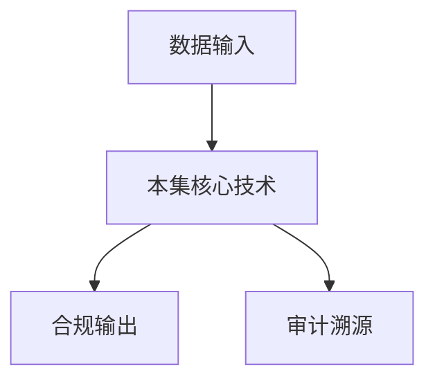

# P15 HyperGPU：基于通用硬件构建GPU-TEE底座

← [[BV1ser5BDESU-总览]] | ← [[P14-密态大数据安全方案与实践]] | 下一篇 → [[P16-机密容器的安全设计及落地实践]]

## 视频信息

| 项目 | 内容 |
|------|------|
| 分集 | HyperGPU：基于通用硬件构建GPU-TEE底座 |
| 模块 | 密态计算与TEE |
| 时长 | 42 分 10 秒 |
| 链接 | [B 站 P15](https://www.bilibili.com/video/BV1ser5BDESU?p=15) |
| 官方文档 | [SecretFlow 文档](https://www.secretflow.org.cn/zh-CN/docs) |
| 内容来源 | 知识点增强（数据要素流通技术体系，非逐字转写） |

## 核心要点

1. **本 P 主题**：HyperGPU：基于通用硬件构建GPU-TEE底座
2. **模块定位**：密态计算与TEE
3. **考试/实践侧重**：GPU-TEE、HyperGPU、AI 密态训练推理
4. **笔记层级**：教程级（约 3079 字），含速览、图解、场景 Walkthrough、自测题
5. **学习建议**：先通读「3 分钟速览」与「图解」，再读「详细讲解」；动手项见 Checklist

> 以下内容基于数据要素流通与隐私计算技术体系撰写，对应 B 站分 P「HyperGPU：基于通用硬件构建GPU-TEE底座」。**非 UP 逐字转写**；不看视频也可建立框架，看视频可对照「与视频对照表」深化。

## 本节在系列中的位置

**模块**：密态计算与 TEE · 系列第 **P15/47** 集。

**建议前置**：[[密态大数据安全方案与实践]]——建立本集所需背景。

**建议后续**：[[机密容器的安全设计及落地实践]]——在本集能力之上继续深入。

依赖关系：政策(P01–P06) → 可信空间(P07–P08,P18) → 密态/隐私技术(P09–P24) → SecretFlow 工程(P25–P32) → 基础设施与案例(P33–P47)。

## 3 分钟速览

**HyperGPU：基于通用硬件构建GPU-TEE底座** 是数据要素流通体系中的关键一课。读完本节你应能回答：① 核心概念定义；② 在「供得出—流得动—用得好—保安全」链条中的位置；③ 与隐私计算技术栈的衔接。考试/面试侧重：**GPU-TEE、HyperGPU、AI 密态训练推理**。

## 零基础导读

本节「HyperGPU：基于通用硬件构建GPU-TEE底座」属于 **密态计算与 TEE**。即便未看视频，也应先建立**制度—技术—场景**三层视角：政策类章节回答「为什么允许流」；技术类章节回答「如何安全地算」；案例类章节回答「真实行业怎么落地」。

第一遍阅读请盯住三个问题：本集**解决什么痛点**？**关键参与方**是谁？**交付物或能力边界**是什么？第二遍阅读时，把术语表抄到 Obsidian 双链笔记，与前后分 P 交叉引用。

## 详细讲解

### 1. GPU-TEE 需求

AI 工作负载依赖 GPU，传统 CPU TEE（SGX）内存受限（~256MB Enclave），无法承载大模型。**HyperGPU** 等方案在通用 GPU 上构建 TEE 底座，扩展密态计算到 AI 场景。

### 2. 技术思路

| 方案 | 原理 |
|------|------|
| GPU 内存加密 | 驱动层加密显存，TEE 内外隔离 |
| 可信 VM + GPU 直通 | SEV-SNP VM 独占 GPU |
| 分割信任 | 敏感算子在 TEE CPU，非敏感在 GPU |
| 自定义固件 | GPU 微码级隔离（研究前沿） |

### 3. HyperGPU 能力（课程主题）

- 在通用 NVIDIA GPU 上建立**可信执行上下文**
- 支持 CUDA 算子在保护域内执行
- 与远程证明服务联动，证明 GPU 环境未被篡改
- 对接机密容器/K8s 编排

### 4. 应用场景

- 多方联合训练：梯度在 GPU-TEE 聚合
- 模型即服务（MaaS）：推理 API 密态执行
- 科学计算：敏感仿真数据 GPU 加速

### 5. 挑战

- GPU 驱动栈复杂，攻击面大
- 侧信道（功耗、时序）风险
- 云厂商 GPU 多租户隔离需硬件支持

### 6. 考试/实践要点

- 解释为何 SGX 不适合直接跑大模型
- 说明 GPU-TEE 与 CPU TEE 的分工
- 评估一个联邦学习场景是否需要 GPU-TEE

### 7. CUDA 兼容性

HyperGPU 需平衡驱动补丁与 NVIDIA 官方支持关系；生产前确认硬件型号白名单。

### 8. 联邦+GPU

本地 GPU 训练，仅上传梯度到 GPU-TEE 聚合，兼顾性能与安全。

### 9. 评测基准

建立 GPU-TEE 标准 benchmark：ResNet50 推理延迟、BERT batch 吞吐，便于采购对比不同厂商方案。

### 10. 学习与实践检查单

- [ ] 对照本 P 标题回顾 B 站视频章节要点
- [ ] 在 [SecretFlow 文档](https://www.secretflow.org.cn/zh-CN/docs) 找到对应模块
- [ ] 能用一句话向同事解释本 P 核心概念
- [ ] 识别一个本行业可落地的应用场景
- [ ] 记录与前后分 P 的技术依赖关系

### 11. 模块知识串联
本讲属于「数据要素流通技术」体系中的重要一环。建议在学习日志中标注：输入依赖（前序知识）、输出能力（学完能做什么）、与隐语组件映射（SecretFlow/Kuscia/SecretPad/TEE）。完成 47 讲后应能独立设计一个「政策合规+连接器+隐私计算+审计存证」的端到端方案，并评估 MPC、TEE、联邦学习的选型依据。

### 深化理解（HyperGPU：基于通用硬件构建GPU-TEE底座）

将本节概念放入「数据二十条」四原则框架：它主要支撑哪一条原则？若去掉该能力，哪类数据流通场景会受阻？用一句话向非技术经理解释本节价值。

## 图解

## 类比与直觉

把本节技术想象成**流水线的一环**：看清输入是什么、经过哪些处理、输出给谁用，比死记名词更有效。

## 例题与场景 Walkthrough

**场景：两家机构联合建模（不共享明文）**

1. **样本对齐**：若双方仅有交集用户有价值，先用 PSI（P21/P28）对齐 ID。
2. **特征拼接**：纵向联邦（P24）下 A 方持标签、B 方持特征，梯度通过安全聚合更新。
3. **训练执行**：在 SecretFlow SPU（P27）上完成密态前向/反向，或 TEE 内明文训练（P11–P17）。
4. **模型发布**：输出评分服务；模型参数经评估后按需出域，训练数据永不出域。
5. **本集关联**：HyperGPU：基于通用硬件构建GPU-TEE底座 提供其中 **GPU-TEE** 能力。

## 常见误区

1. **「学完本集就会用隐语」**：SecretFlow 生态需多集串联（P19–P32），单集只是拼图一块。
2. **「隐私计算等于不上传数据」**：数据仍以密文、份额或授权方式参与计算，网络与算力开销客观存在。
3. **「TEE 绝对安全」**：TEE 依赖硬件与侧信道防护，需远程证明（P17）与补丁策略。
4. **「区块链解决一切确权」**：链适合存证与交易撮合，大规模计算仍在链下隐私计算引擎。

## 与视频对照表

| 视频段落（约） | 预期演示内容 | 笔记对应章节 |
|-------------|------------|------------|
| 开篇 0%–15% | 本集目标、背景、与前后集关系 | 本节位置、3 分钟速览 |
| 前段 15%–40% | 核心概念定义与架构图 | 零基础导读、详细讲解 |
| 中段 40%–70% | 原理展开、对比、政策/代码示例 | 图解、类比、Walkthrough |
| 后段 70%–90% | 案例、问答、易错点 | 常见误区、Checklist |
| 收尾 90%–100% | 总结、延伸资源 | 延伸阅读、自测题 |

> 本集总时长约 **42分10秒**。无官方外挂字幕时，以分 P 标题「HyperGPU：基于通用硬件构建GPU-TEE底座」与上表主题对齐视频画面。

## 动手实践 Checklist

- [ ] 复述本集 3 个定义（不看笔记）
- [ ] 根据 Walkthrough 写 200 字场景短文
- [ ] 对照视频确认 1 个架构图/演示
- [ ] 在总览思维导图中标注本集节点
- [ ] 完成自测 Q1/Q5

## 延伸阅读

- [SecretFlow 文档中心](https://www.secretflow.org.cn/zh-CN/docs)
- TC609 可信数据空间相关标准
- 本系列相邻 2 个分 P 笔记

## 自测题

1. **本集核心考点？**  
   **答**：GPU-TEE、HyperGPU、AI 密态训练推理。

2. **本集在四原则中的位置？**  
   **答**：偏流得动基础设施。

3. **与 SecretFlow 的关系？**  
   **答**：提供合规与架构前提，后续技术集在其上落地。

4. **一项落地检查？**  
   **答**：是否有授权、是否最小必要、是否可审计——三者缺一不可。

5. **30 秒口述本集？**  
   **答**：用「输入→处理→输出」各一句话概括（见 Walkthrough）。

## 关键术语

| 术语 | 说明 |
|------|------|
| 数据要素 | 可参与社会化配置、创造价值的数字化资源 |
| 隐私计算 | 数据可用不可见前提下实现协作计算的技术体系 |
| 可信执行环境 | 硬件隔离的安全计算区域 |
| 远程证明 | 验证 Enclave 完整性与身份 |

## 与前后分 P 的衔接

- ← **密态大数据安全方案与实践**（[[P14-密态大数据安全方案与实践]]）
- → **机密容器的安全设计及落地实践**（[[P16-机密容器的安全设计及落地实践]]）

## 逐字转写
> 状态：待转写。运行 `Tools/transcribe/transcribe.ps1 -Bvid BV1ser5BDESU -Part 15` 补充。

## 来源说明

- ✅ B 站官方元数据（`Tools/BV1ser5BDESU-full.json`）
- ✅ 分 P 首帧封面（`Tools/bili-fetch/fetch-bilibili.js`）
- ✅ **教程级增强**：含图解/Mermaid、场景 Walkthrough、自测题（约 3079 字，2026-06-06）
- ⏳ 逐字转写：B 站 API 无外挂字幕轨；可选 Whisper/BiliNote 后续补充

## 关键截图

![[../../06-资源附件/video-notes-images/BV1ser5BDESU-P15-cover.jpg|B站首帧 P15]]
