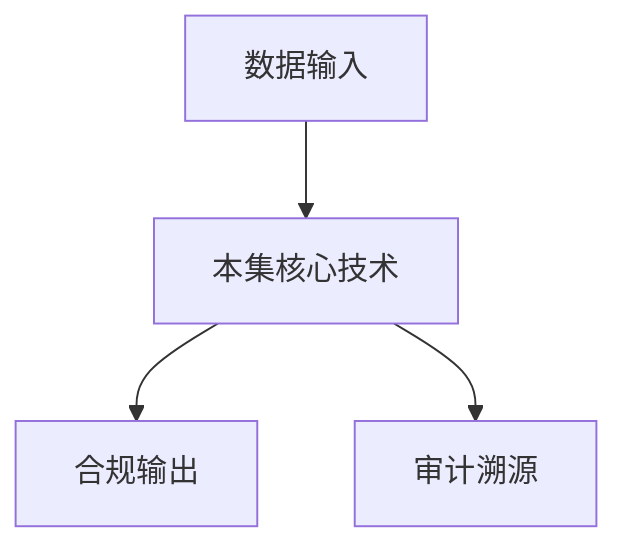

# P15 HyperGPU：基于通用硬件构建GPU-TEE底座

← [[BV1ser5BDESU-总览]] | ← [[P14-密态大数据安全方案与实践]] | 下一篇 → [[P16-机密容器的安全设计及落地实践]]

## 视频信息

| 项目 | 内容 |
|------|------|
| 分集 | HyperGPU：基于通用硬件构建GPU-TEE底座 |
| 模块 | 密态计算与TEE |
| 时长 | 42 分 10 秒 |
| 链接 | [B 站 P15](https://www.bilibili.com/video/BV1ser5BDESU?p=15) |
| 官方文档 | [SecretFlow 文档](https://www.secretflow.org.cn/zh-CN/docs) |
| 内容来源 | 知识点增强（数据要素流通技术体系，非逐字转写） |

## 核心要点

1. **本 P 主题**：HyperGPU：基于通用硬件构建GPU-TEE底座
2. **模块定位**：密态计算与TEE
3. **考试/实践侧重**：GPU-TEE、HyperGPU、AI 密态训练推理
4. **笔记层级**：教程级（约 3079 字），含速览、图解、场景 Walkthrough、自测题
5. **学习建议**：先通读「3 分钟速览」与「图解」，再读「详细讲解」；动手项见 Checklist

> 以下内容基于数据要素流通与隐私计算技术体系撰写，对应 B 站分 P「HyperGPU：基于通用硬件构建GPU-TEE底座」。**非 UP 逐字转写**；不看视频也可建立框架，看视频可对照「与视频对照表」深化。

## 本节在系列中的位置

**模块**：密态计算与 TEE · 系列第 **P15/47** 集。

**建议前置**：[[密态大数据安全方案与实践]]——建立本集所需背景。

**建议后续**：[[机密容器的安全设计及落地实践]]——在本集能力之上继续深入。

依赖关系：政策(P01–P06) → 可信空间(P07–P08,P18) → 密态/隐私技术(P09–P24) → SecretFlow 工程(P25–P32) → 基础设施与案例(P33–P47)。

## 3 分钟速览

**HyperGPU：基于通用硬件构建GPU-TEE底座** 是数据要素流通体系中的关键一课。读完本节你应能回答：① 核心概念定义；② 在「供得出—流得动—用得好—保安全」链条中的位置；③ 与隐私计算技术栈的衔接。考试/面试侧重：**GPU-TEE、HyperGPU、AI 密态训练推理**。

## 零基础导读

本节「HyperGPU：基于通用硬件构建GPU-TEE底座」属于 **密态计算与 TEE**。即便未看视频，也应先建立**制度—技术—场景**三层视角：政策类章节回答「为什么允许流」；技术类章节回答「如何安全地算」；案例类章节回答「真实行业怎么落地」。

第一遍阅读请盯住三个问题：本集**解决什么痛点**？**关键参与方**是谁？**交付物或能力边界**是什么？第二遍阅读时，把术语表抄到 Obsidian 双链笔记，与前后分 P 交叉引用。

## 详细讲解

### 1. GPU-TEE 需求

AI 工作负载依赖 GPU，传统 CPU TEE（SGX）内存受限（~256MB Enclave），无法承载大模型。**HyperGPU** 等方案在通用 GPU 上构建 TEE 底座，扩展密态计算到 AI 场景。

### 2. 技术思路

| 方案 | 原理 |
|------|------|
| GPU 内存加密 | 驱动层加密显存，TEE 内外隔离 |
| 可信 VM + GPU 直通 | SEV-SNP VM 独占 GPU |
| 分割信任 | 敏感算子在 TEE CPU，非敏感在 GPU |
| 自定义固件 | GPU 微码级隔离（研究前沿） |

### 3. HyperGPU 能力（课程主题）

- 在通用 NVIDIA GPU 上建立**可信执行上下文**
- 支持 CUDA 算子在保护域内执行
- 与远程证明服务联动，证明 GPU 环境未被篡改
- 对接机密容器/K8s 编排

### 4. 应用场景

- 多方联合训练：梯度在 GPU-TEE 聚合
- 模型即服务（MaaS）：推理 API 密态执行
- 科学计算：敏感仿真数据 GPU 加速

### 5. 挑战

- GPU 驱动栈复杂，攻击面大
- 侧信道（功耗、时序）风险
- 云厂商 GPU 多租户隔离需硬件支持

### 6. 考试/实践要点

- 解释为何 SGX 不适合直接跑大模型
- 说明 GPU-TEE 与 CPU TEE 的分工
- 评估一个联邦学习场景是否需要 GPU-TEE

### 7. CUDA 兼容性

HyperGPU 需平衡驱动补丁与 NVIDIA 官方支持关系；生产前确认硬件型号白名单。

### 8. 联邦+GPU

本地 GPU 训练，仅上传梯度到 GPU-TEE 聚合，兼顾性能与安全。

### 9. 评测基准

建立 GPU-TEE 标准 benchmark：ResNet50 推理延迟、BERT batch 吞吐，便于采购对比不同厂商方案。

### 10. 学习与实践检查单

- [ ] 对照本 P 标题回顾 B 站视频章节要点
- [ ] 在 [SecretFlow 文档](https://www.secretflow.org.cn/zh-CN/docs) 找到对应模块
- [ ] 能用一句话向同事解释本 P 核心概念
- [ ] 识别一个本行业可落地的应用场景
- [ ] 记录与前后分 P 的技术依赖关系

### 11. 模块知识串联
本讲属于「数据要素流通技术」体系中的重要一环。建议在学习日志中标注：输入依赖（前序知识）、输出能力（学完能做什么）、与隐语组件映射（SecretFlow/Kuscia/SecretPad/TEE）。完成 47 讲后应能独立设计一个「政策合规+连接器+隐私计算+审计存证」的端到端方案，并评估 MPC、TEE、联邦学习的选型依据。

### 深化理解（HyperGPU：基于通用硬件构建GPU-TEE底座）

将本节概念放入「数据二十条」四原则框架：它主要支撑哪一条原则？若去掉该能力，哪类数据流通场景会受阻？用一句话向非技术经理解释本节价值。

## 图解

## 类比与直觉

把本节技术想象成**流水线的一环**：看清输入是什么、经过哪些处理、输出给谁用，比死记名词更有效。

## 例题与场景 Walkthrough

**场景：两家机构联合建模（不共享明文）**

1. **样本对齐**：若双方仅有交集用户有价值，先用 PSI（P21/P28）对齐 ID。
2. **特征拼接**：纵向联邦（P24）下 A 方持标签、B 方持特征，梯度通过安全聚合更新。
3. **训练执行**：在 SecretFlow SPU（P27）上完成密态前向/反向，或 TEE 内明文训练（P11–P17）。
4. **模型发布**：输出评分服务；模型参数经评估后按需出域，训练数据永不出域。
5. **本集关联**：HyperGPU：基于通用硬件构建GPU-TEE底座 提供其中 **GPU-TEE** 能力。

## 常见误区

1. **「学完本集就会用隐语」**：SecretFlow 生态需多集串联（P19–P32），单集只是拼图一块。
2. **「隐私计算等于不上传数据」**：数据仍以密文、份额或授权方式参与计算，网络与算力开销客观存在。
3. **「TEE 绝对安全」**：TEE 依赖硬件与侧信道防护，需远程证明（P17）与补丁策略。
4. **「区块链解决一切确权」**：链适合存证与交易撮合，大规模计算仍在链下隐私计算引擎。

## 与视频对照表

| 视频段落（约） | 预期演示内容 | 笔记对应章节 |
|-------------|------------|------------|
| 开篇 0%–15% | 本集目标、背景、与前后集关系 | 本节位置、3 分钟速览 |
| 前段 15%–40% | 核心概念定义与架构图 | 零基础导读、详细讲解 |
| 中段 40%–70% | 原理展开、对比、政策/代码示例 | 图解、类比、Walkthrough |
| 后段 70%–90% | 案例、问答、易错点 | 常见误区、Checklist |
| 收尾 90%–100% | 总结、延伸资源 | 延伸阅读、自测题 |

> 本集总时长约 **42分10秒**。无官方外挂字幕时，以分 P 标题「HyperGPU：基于通用硬件构建GPU-TEE底座」与上表主题对齐视频画面。

## 动手实践 Checklist

- [ ] 复述本集 3 个定义（不看笔记）
- [ ] 根据 Walkthrough 写 200 字场景短文
- [ ] 对照视频确认 1 个架构图/演示
- [ ] 在总览思维导图中标注本集节点
- [ ] 完成自测 Q1/Q5

## 延伸阅读

- [SecretFlow 文档中心](https://www.secretflow.org.cn/zh-CN/docs)
- TC609 可信数据空间相关标准
- 本系列相邻 2 个分 P 笔记

## 自测题

1. **本集核心考点？**  
   **答**：GPU-TEE、HyperGPU、AI 密态训练推理。

2. **本集在四原则中的位置？**  
   **答**：偏流得动基础设施。

3. **与 SecretFlow 的关系？**  
   **答**：提供合规与架构前提，后续技术集在其上落地。

4. **一项落地检查？**  
   **答**：是否有授权、是否最小必要、是否可审计——三者缺一不可。

5. **30 秒口述本集？**  
   **答**：用「输入→处理→输出」各一句话概括（见 Walkthrough）。

## 关键术语

| 术语 | 说明 |
|------|------|
| 数据要素 | 可参与社会化配置、创造价值的数字化资源 |
| 隐私计算 | 数据可用不可见前提下实现协作计算的技术体系 |
| 可信执行环境 | 硬件隔离的安全计算区域 |
| 远程证明 | 验证 Enclave 完整性与身份 |

## 与前后分 P 的衔接

- ← **密态大数据安全方案与实践**（[[P14-密态大数据安全方案与实践]]）
- → **机密容器的安全设计及落地实践**（[[P16-机密容器的安全设计及落地实践]]）

## 逐字转写
> 引擎: whisper | 状态: 已转写 | 格式: 段落化

### [00:03 - 01:06] 各位同学大家好,欢迎大家来参加
各位同学大家好,欢迎大家来参加数据要素流通技术的穆克，我是来自蚂蚁密算的祝伯君，今天给大家带来的课程叫做关于这个HyperGPU，HyperGPU是基于通用硬件构建的GPUTE底座，这是我们今天的目录,今天将从这四个方面来介绍一下HyperGPU，首先能展示一下为什么我们需要基于基算这个技术，左边这个PUT展示的是说最近这个数据逐渐成为一个重要的生产要素，各方都希望他们的数据可以和对方一起融合,计算,去产生一定的价值，比如说金融方面的融合计算,医疗方面的融合计算，都有助于提升整个社会的效率。

### [01:07 - 01:17] 另外方面就是数据,它的使用它是
另外方面就是数据,它的使用它是存在安全挑战的，比如说传统的数据中心。

### [01:21 - 01:54] 数据中心的运为人员,它可能就会
数据中心的运为人员,它可能就会通过某些方式去把数据偷出来，那我作为数据的拥有者,我对于这个数据离开我自己的管控欲,这些事情我是有顾虑的，另外方面是在全球范围内,这些数据的泄露事件层出不穷，更加加深了人们对把数据送出去的这样一个担忧。

### [01:56 - 02:38] 那紧密计算作为隐私计算重要的技
那紧密计算作为隐私计算重要的技术路线之一，它的主要的一个目的就是去保护计算过程中的数据，左边这张图呢,就是展示了数据的三种形态,一种是存储过程中的数据，那保护这种状态的数据呢,有这种磁盘加密的一些技术去保护，然后第二种是传输过程中的数据,那保护这样的数据呢,可以通过类似于htts等，安全的数据传输协议。

### [02:40 - 02:49] 还有第三种就是使用过程中的数据
还有第三种就是使用过程中的数据,那紧密计算就是致力于保证，使用过程中数据的安全。

### [02:52 - 03:47] 然后紧密计算主要就是把整个的系
然后紧密计算主要就是把整个的系统软件站分成了re複执行操作环境以及te可信执行操作环境，那系统上大部分的这些软件,就比如说os呀，比如说一些支援管理的软件都放在re这一侧，T1里面放置的软件只和数据访问,相关,同时T1底下会跑一个极小的一些运行室。通过去减少整个软件的TCB,叫Trusted Computing Base,去大幅减少T1里面的代码。那代码量少了,它的安全等级就可以被提升得非常高。

### [03:47 - 04:38] 然后我们在对这里面的代码去做一
然后我们在对这里面的代码去做一些安全的一些分析以及加固,比如说Fast,比如说形式化验证,这样的一些技术手段去提升它的安全性。然后能够保证说,数据它使用的过程中,它不会被其他复杂的软件或者是其他易受攻击的这些软件所偷走。那GIMI计算在右边这个TUT展示了GIMI计算所具备的诸多优势。第一个是数据加密,主要表现在以下级点。一个是RE中的复杂软件它被排除在外了,然后它代码量会变得更少,它漏洞会变得更少。

### [04:41 - 05:44] 第二点是说在GIMI算是一个软
第二点是说在GIMI算是一个软硬件结合的技术,在软硬件加持下RE这一侧的软件它是很难就是几乎无法去偷到T1应用的敏感数据的。第三个是说T1技术常常会搭配一些硬件加固的能力去使用,，就比如说内存加密,然后这个技术可以抵御来自硬件的攻击。而第二点是说GIMI现在提供了这样一个可验证的能力,，大致的意思是说我提供这样一个技术能力我能够让用户确保我运行在T1里面的软件,，是我想要软件而不是一个被中间人篡改的软件。然后第三点是GIMI计算一个非常显著的优势,就是它的性能好,。

### [05:46 - 06:07] 那在T1里面内部的计算都是以明
那在T1里面内部的计算都是以明文的方式去进行的,，那它这个性能是接近于数据为保护场景下的这个计算的,，等于说T1的性能上面存在一个非常大的一个性能无损失的优势,。

### [06:12 - 07:17] 现在就这个大模型也非常火,然后
现在就这个大模型也非常火,然后的话就展示一下就是大模型场景下为什么需要进行计算,，然后它保护的数据是有哪些,在大模型场景下需要保护的隐私数据主要分成两类,，第一类是来自于模型提供商提供的这个大模型文件,，虽然说现在就是很多大模型都开源了,，但是就是各个公司依然会利用这些开源大模型,，使用他们自身的这样一些数据去做,对大模型进行一些微调,这样一些拓展。第二方面是在大模型推理的时候,他们也会提供一些类似与遥控的这样一些关键的数据,，那这些数据都反映了他们自身的一些知识产权,，所以说这些数据都是被需要保护的。

### [07:18 - 08:13] 另外一个需要保护的数据就是来自
另外一个需要保护的数据就是来自从来用户的一些提示词,，那这些提示词可能包含了他个人的一些金融,健康的这些信息,，这些数据是非常敏感的,然后的话还有一些推理结果,也需要保护。左边这样的图就展示了目前大模型这些服务,，就常常是需要接触一些强大的一些云端的算力的,，那使用场景就是这个大模型提供商他会把他自己的所需要的一些重要的文件去传到这个云端上面,，然后云端这边就会有一个GPUTE的这样一个环境来去做这样一个大模型推理,。

### [08:16 - 09:15] 然后左边这个云端的管理员就是因
然后左边这个云端的管理员就是因为这个GPUTE存在他是没有办法去托到大模型推理过程中的数据的,，然后中端用户他就是在中端这边数据提示词之后,，通过加密上层到这个GPUTE内,然后这边再解密去做一个明文的推理,，然后会把这个推理结果再加密去返回到这个中端,然后中端再解密去获取对应的推理结果。刚刚介绍了就是GPUTE对于大模型推理过程中数据的保护是非常重要的,，然后我们目前想使用好这个GPUTE,那存在于以下两点的局限性,，一个是目前的GPUTE缺乏通用性也缺乏普会性,。

### [09:16 - 10:24] 目前唯一成熟的商用GPUTE的
目前唯一成熟的商用GPUTE的商用方案是Avidia Hopper以及Blackwell,，然后大家众所周知的原因就是目前中美关系比较复杂,，就存在使用Avidia的GPU存在供应业的风险,，同时就是使用好这个GPUTE也得依赖于CPUTE这一侧的硬件升级,，必须升级到Intel TDS或者MDSEV的这个硬件,，那这个对GPUTE的开发者会带来不少的成本,，那最后点就是国内的炒商的GPUTE仍然处于一个起步的阶段,，然后他们的生态支持也非常有限,，Hyper GPU就是要去解决刚刚提到这些问题,。

### [10:25 - 11:24] 所以我们有以下的这几个设计目标
所以我们有以下的这几个设计目标,，第一个是通用性,，不依赖于叫星的硬件特性,，让众多的这些蠢量的GPUTE设备,，加上我们这个Hyper GPU底层的软件,，他们就可以具备GPUTE的能力,，然后第二个是应用性,，我们是想用通过系统软件的这样一个方式,，去让众多的GPUTE设备都具备TE的能力,，那使用我们GPUTE这个Hyper GPU的这个用户,，它就不需要进行一些复杂的用户态势修改,，就可以无缝地将他们的这些通用计算去升级成立态计算,，然后第三个是说Hyper GPU它是比较普会的,。

### [11:25 - 12:09] 这个其实也是跟通用性一脉相承的
这个其实也是跟通用性一脉相承的,，我们Hyper GPU可以以支持以降低的成本,，去让这个普通算力去升级成立态的算力,，然后最后一个是可结奥,，就是我们不与任何的GPU厂商码定,，我们只依赖于通用的这些硬件的特性,，比如说虚拟化的特性,，比如说PCE或是IOM U的这些通用的一些特性,，然后的话最后一个是说我们的信任跟可结奥,，我们用户就不需要去特殊的去信任某一个硬件厂商,。

### [12:12 - 12:57] 左边上的图去展示了整个Hype
左边上的图去展示了整个Hyper GPU的框架,，这个L01和L2它是清套虚拟化的概念,，在硬件这边我们是利用了CPU提供的通用的虚拟化以及内存加密的能力,，目前就是可以去支持AMD Intel和国产X86,，也就是海光和照星的平台,，目前我们也致力于将这整套软件占据以直到AMD的平台上面,，在GPU这边同样的Hyper KF也利用了通用GPU提供的能力,，去构住GPU T1E的可信执行环境,，目前也是支持英伟达海光DCO的平台,。

### [12:58 - 13:22] 我们的做法就是让这个Hyper
我们的做法就是让这个Hyper Unplayful L0也就是Hypervisor,，它去运行在硬件虚拟化提供的最高特权级上面,，它仅仅负责安全资源的管理,，然后会将HOST VM也就是原生的Linux OS,，它去降权到GaST模式下,。

### [13:26 - 14:22] 在功能上面,HOSTVM依然去
在功能上面,HOST VM依然去提供原生的服务,，比如说CTO调度资源的管理,，比如说内层资源的管理,，以及各种Linux设备的管理,，都有它去完成和之前的一样,，但是它需要去管理T1E的时候,，它是没有办法去操作跟T1E相关的硬件资源的,，它必须得请求Hypervisor去操作安全资源,，Hypervisor就是L0的Hypervisor,，它就有机会去做一些安全的检查,，已经安全的加固,去防止HOST VM,，它可能去做一些安全性上的破坏,，去保证了T1E运行过程中的机密性,，完整性,已经可验证刑,。

### [14:23 - 15:18] 上面这一块就展示了,
上面这一块就展示了,，通用的T1E Hypervisor,，它同时可以去提供Umpath Confidential VM,，以及GPU TE的抽象,，然后这里的TPM的这个芯片,，就可以在一个时代启动,，还有在运行的时候,，可以为Hypervisor平台,，或者是T1E去提供可信的能力,，那这个TPM,，它的这个新人根,，它是构住在权威的机构上面的,，那这里的主要特点,，第一个就是普惠通用,，就是可以看到Hypervisor去支持，众多的CPU芯片以及GPU平台,，然后第二个是自主可控,，就是这个新人根,。

### [15:18 - 16:11] 新人根可以看到是完全与这个CP
新人根可以看到是完全与这个CPU以及GPU解奥的,，然后的话这个TPM的这个新人根,，它是托管于国家的权威机构的,，那简单应用,，第三个是简单应用,，就是这个Hyper,，Umpath它同时可以支持Umpath,，以及Links等诸多的生态,，那应用呢就是无需通过特殊的改造,，就可以跑在了这个T1E,，在这里面,，接下来就讲一下这个HyperGPU的设计,，首先呢我们是就是搞T1E了嘛,，那就是得去展示一下危险模型,，危险模型这边就是得展示一下,，HyperGPU它防哪些攻击,，它不防哪些攻击,，那简单来概括的话,。

### [16:12 - 17:15] HyperGPU可以抵御所有的
HyperGPU可以抵御所有的高特殊以及软件的攻击,，其后攻击方式就包括,，比如说系统管理员去跃拳,，去尝试的去访问CVM的数据,，然后第二个就是,，可能就是这攻击者,，所恶意的这个CVM,，去合谋,，去攻击一些受害者CVM,，最后的就是可以防止来自于恶意设备,，发起的恶意的DMA请求,，去把CVM的数据给偷出来,，那攻击的内容呢,，主要就是从讯语化三个方面,，去归纳了一下,，就是你现在讯语化技术,，主要分成CPU讯语化内容讯语化,，以及IO讯语化,，那我们防在CPU,，这一方面呢,，我们防的是这个LE,，它去读写CVM的计存器,。

### [17:17 - 18:12] 内存这边呢,
内存这边呢,，我可以防这个LE,，它去访问CVM的安全内存,，然后在设备这边呢,，就是我们可以防LE,，它去通过操控这些设备的控制面,，去影响可行设备的使用,，然后也可以防就是LE,，它去通过去操作这个恶意设备,，然后的话,，发送DMA的这些包去读写CVM的内存,，然后右边这一块的话,，就是展示了是我们不考虑的一些攻击,，一个是硬件的攻击,，那就是比如说codeboots,，这种内存的攻击,，那其实是让我们软件这一侧,，我们是不考虑的,，但是在一些提供内存加密的平台上面,，我们可以通过使用内存加密的特性,。

### [18:12 - 19:01] 去抵于codeboots的攻击
去抵于codeboots的攻击,，提供不同层级的安全保护,，然后第二方面是PCE的列入攻击,，在就是我们出版的还有一个GPU的设计上面,，其实我们也是不考虑的,，但是我们现在也是在去通过，这些端道端加密的这样一些技术,，去加护PCE列入上的安全,，去提供多等级的安全防护能力,，然后侧性道攻击以及拒绝服务攻击,，这些都是主流的TEE的系统它不考虑的这些方面,，然后的话我们也对这两个攻击我们也不考虑。

### [19:05 - 20:04] 接下来主要想还有一个GPU的设
接下来主要想还有一个GPU的设计,，然后在设计之前,，首先先展示一下我们要做这个系统之前,，我们会面临了哪些问题和挑战,，一个是说,，第一个是我们基于哪种的抽象去构建我们的安全边界,，第二个是说在解决第一个问题之后,，我们是选择了机密蓄影机的这一个抽象,，那我们如何去高效的去虚拟化KVM,，第三个就是从CPU保护的视角出发,，展示一下HIPGPU它是怎么样去保护CPU运行过程中,，CPU计存器的状态,，然后接下来展示一下HIPGPU它如何保护CPU运行过程中,，内存它的不被恶业攻击者读写,。

### [20:05 - 21:00] 然后最后一个展示一下HIPGP
然后最后一个展示一下HIPGPU如何将普通的设备升起成可信的设备,，首先展示一下我们如何选择Trust Boundary,，当时我们就是其实面临了两种选择,，一种是我们继续基于之前的Protest Face Enclave,，去构建GPU TE的抽象,，另外一种选择是去拥抱一个未来的主流就是特别点手BM,，去构建GPU TE的抽象,，那就是我们对整一套的GPU软件站去进行一些分析,，我们选择的是英伟达的这一套软件站,，因为这一套软件站非常成熟,，然后用户也非常多,，然后当我们对这个软件站去做一个分析后发现,。

### [21:01 - 21:55] 其实很多的这些软件都不开源的,
其实很多的这些软件都不开源的,，GPU软件站主要分成几个部分,，一个是用户它所写的GPU的APP,，然后的话在用户它有一个骷髅Round Time,，同样的在用户它有一个Your Space Driver,，然后这两部分它其实是不开源的,，它在内核态是有一个GPU内核态的这样一个Driver,，那如果说我们想要去选择这个SGX的抽象去做GPU TE的话,，那我们势力会将这个GPU Color Space Driver，它去放到TCB去外,，因为Uncraft里面是没有OS这一特选级的,。

### [21:57 - 22:55] 这样一来就是一个是说整一套软件
这样一来就是一个是说整一套软件它的安全交互会变得很多,，安全接口多的话它Attack Surface会变大,，另外一方面是说我们很难对这些不开源的软件站去做一些改造,，所以说我们就是放弃了这样一个想法,，那我们选择是去使用这个CVM的抽象去提供GPU TE的这个环境,，然后我们其实是会把整一套软件站去放到CVM里面的,，然后分成CVM的用户态和CVM的内核态,，然后会把这个GPU设备安全的指控给CVM,，接下来展示了一个挑战就是如何去高效的虚拟化KVM,。

### [22:56 - 23:32] 这个问题啊由来是因为Hyper
这个问题啊由来是因为HyperCave这个L0它去占用了虚拟化的VM Roots特选级,，那这个host的VM它就需要运行在这个VM Nam Roots模式下,，那它之前对CVM它之前对VM管理的这些指令,，比如说VM Launch,VM Resume,VM Read和VM Write它都不能去运行,，那它的运行的时候就是会产生一次硬件的Track,。

### [23:34 - 24:17] 然后针对这个问题其实我们当时是
然后针对这个问题其实我们当时是有考虑到其他一些可远方案的,，一个是说HyperCave它去完全去模拟KVM的特选指令,，那这个方式它会使得整个HyperCave的软件会变得复杂,，然后右边这张图去展示了说如果我们选择这个方案的话,，它的性能开销会非常大,，这里是一个例子就是比如说KVM它想去通过VM Rise这条指令去管理CVM的这些，一些计算器的一些状态,那它去VM Rise的时候会产生一次VM Exit,。

### [24:18 - 25:07] 然后的话这个L0它会有一个De
然后的话这个L0它会有一个Decode,然后的话再去帮助L1它去真正的去执行这一条VM Rise指令,，然后的话它再去调整这个L1它的支撑的这个IP的计算器的话在VM Resume,，所以说如果你要完全模拟KVM这个的VM Rise这一条指令会引入两次的特选期切换,，然后这个VM Rise指令在整个的这个VM的生命中期里面是比较会被比较频繁的调用的,，那这么多的VM Exits实际会对这个性能会产生非常大的开销,。

### [25:08 - 25:34] 然后第二个是想去利用了这个Sh
然后第二个是想去利用了这个Shadow VNCS的这个特性的,那这个特性的其实它其实是依赖于这个特殊的硬件的,，然后的话去它并不适用于AMD的平台,然后HyperCraft的选择呢是去使用了这个叫Initon的VNCS的这样一个方案,。

### [25:37 - 26:39] 然后这个方案它其实是微软的Hy
然后这个方案它其实是微软的HyperV它依赖的一个实现,，然后的话它的核心思想是使用共产内存在L0和L1之间同步CPU的状态,，然后右边这样图所展示的就是我们这个HyperGPU的做法,，然后当这个HouseKVM它需要去对这个VM的JT-17去读写的时候,，它不是直接的调用这个VN-rate或者是VN-rise,，而是直接去做一个内存的读写的这个样一个访问,，然后当这个VM要被launch执行的时候,L0的HyperCraft它再去把这个KVM所读写的这些内容去统布到真正硬件所使用的VNCS里面,。

### [26:41 - 26:58] 然后就可以看出就是这个KVM它
然后就可以看出就是这个KVM它原本的这些VN-rate和VN-rise的指令它都被转成一次内存读写,，然后这个内存读写它其实是不会带来VN-axis的,，所以说它的开销也是非常小的,。

### [27:01 - 27:47] 然后这里的话就展示了就是这一套
然后这里的话就展示了就是这一套方案的优势,，一个是它的试用比较广,，另外一个它少改动,，第三个就是它性能非常好,，而这里展示了就是HyperGPU对于CPU状态隔离的处理,，我们的安全目标就是得保证RE和TE之间CPU状态隔离,，我们思路呢就是刚才提到了就是HOST虚拟机它依然负责CPU资源的调度,，因为这个CPU上所有的这个基层器它其实分是附用的,，那这个位于高特源级的这个HyperGPU它可以去管理这个所有虚拟机的这样一个基层器,，比如说在英特平台上面叫VN-CS,在AMD平台上面叫VN-CB,。

### [27:48 - 28:36] 那在整个context切换的时
那在整个context切换的时候,，这个由这个HyperGPU它去保存有恢复,，这些LE和L2的这些基层器,，而以上是一个例子,，就是说在某个盒上面,，就是时刻α的时候,，这个是CVM在运行吗?，然后这时候可能这个HOST-CVM它想进行一个抢战,，而它在抢战的时候,，首先就是得由这个HyperGPU来介入,，然后HyperGPU会把这个CVM1的这个基层器,，它去保存到这个安全内存里面,，而这个安全内存它其实是不给任何人所访问的,，然后它再把这个当前的CPU上面的这个基层器全都擦除掉,。

### [28:37 - 29:29] 然后再恢复这个HOST-VM的
然后再恢复这个HOST-VM的这些基层器的状态,，然后让这个HOST-VM去执行,，那在整个过程中呢,，其实这个HOST-VM它是没有办法去接触到这个CVM1的基层器的数据的,，通过这样的方式去保证CPU状态的隔离,，那在内存隔离这方面呢,，就是我们安全目标就是要保证CVM和IE之间的内存隔离嘛,，然后同样我们也要去保证CVM之间内存的隔离,，然后我们的思路呢是这个HOST-CVM的策读系统,，它就是依然去负责内存资源的分配,，然后我们的这个HIFON KF,，它是运行在最高特权级上面的,。

### [29:29 - 30:28] 那运行在这个Guess模式上的
那运行在这个Guess模式上的所有软件,，它必须都要去走这样一个页表,，在Intel平台上面叫EPT,，在AMD平台上面叫MPT在AMD平台上面叫Stage2 Translation,，它去管控这个页表,，然后呢让这个HOST-CVM里面它只能去访问普通内存,，让各个CVM它只能去访问它刺激的内存,，不能去访问其他内存,，然后同时呢我们也会对这个设备的页表去进行管控,，让这些不可信的设备它只能去访问普通的内存。接下来介绍一下怎么样,，让这个普通的GPU设备去升级成GPUTE,，然后这一归到了一下就是GPU设备,。

### [30:28 - 31:17] 它其实其实是和CPU设备也非常
它其实其实是和CPU设备也非常像的,，这是几点,，就是一个是说GPU上面也有类似于CPU的逻辑制定单元,，然后在程序执行的时候,，这些程序也会去访问GPU上面的内存,，比如说显存。然后第二个是GPU测的软件,，它可以通过这种POS IO MMM CONFIG,，以及MMM BAR空间的访问,，去操控GPU的这些设备。然后最后一个是GPU上的DNA Engine,，它可以去通过DNA的方式去访问,，然后GPUTE这边的威胁和CPUTE那边也是差不多的,，第一个就是可能是来自于恶意管理员的威胁,。

### [31:17 - 32:18] 恶意管理员他可以去通过配置PO
恶意管理员他可以去通过配置POS IO,，通过内存访问MMM CONFIG,，以及MMM BAR区域去,，可能会去恶意的去影响GPU设备的行为,，去让它执行恶意的代码,，然后来自恶意的设备这边的话,，一个是恶意的设备它可能会通过DNA去访问其他CVM内存,，然后恶意的设备它可能会通过P3EP2P攻击去攻击可信的设备,，然后这里的话就主要展示了GPUTE的整一个设计,，然后主要是分成控制面保护以及数据面保护,，那控制面保护就是我们会通过这个页表访问以及POS IO管控的方式,，去保证说这个GPU这个可信设备,。

### [32:18 - 33:21] 它只能够被它的ONER的这个C
它只能够被它的ONER的这个CVM所控制,，并且这个ONER它只能去,，它必须要能够去正确地去控制这个GPU设备,，这个的话就是左边帐篷就是,，可以看到就是我们会通过页表管控的这样一个技术,，去控制HOST此区里面,，通过MMIO去访问,，然后我们也去对POS IO的访问去进行了一个安全加固与检查,，去防止这个HOST此区里其它通过PIO的方式去配置这个可信的GPU设备,，然后我们同样的也会对这个CVM,，去做CVM的这个页表去做一个配置,，然后的话让它能够正确地去访问这个GPU的这个控制的空间,。

### [33:21 - 34:18] 那就是在这个ROOTSCOMP
那就是在这个ROOTS COMPLESS,，在这个ROOTS COMPLESS这边呢,，我们其实是会去管控这些设备的页表,，然后我们主要就是去管控这些设备的这个页表,，然后的话让它只能够去访问CVM的安全内存,，它不能够去访问其它CVM的安全内存,，以及普通的内存,，然后我们同样的也会去管控这个ROOTS COMPLESS,，会对它去进行一个配置,，然后的话去在这种设备P2P攻击的这样一个场景下,，会有一些安全的加固,，然后接下来去展示了一下这个HIP-GPU的型,。

### [34:18 - 35:12] 这样同时去展示了一下就是HIP
这样同时去展示了一下就是HIP-GPU实现的一些工作量,，然后在L0这边呢,，其实我们之前是有一套,，基于Porsche Space Unplayable的这一套软件的,，然后我们在这基础上去支持了EVM CS,，CPU以及内存隔离,，还有一些设备保护,，然后这工作量大概是13000行带嘛,，然后在L1这边呢,，我们会去修改这个KVM,，去支持这个千当去女化,，以及在CPU保护内存隔离保护的这些特性中,，会有一些拓展,，另外一方面呢,，是我们会对这个ILMMU,，会有半群女化的这样的拓展,，那在CVM这边呢,。

### [35:12 - 36:12] 我们主要是修改了这个Linux
我们主要是修改了这个Linux,，就基于社区的这些CVM支持,，然后加入我们的一些修改,，然后代码量大概是1300行带嘛,，这一展示了一个是HIPAA GPU的性能,，然后左边呢,，这个主要是针对CPU TE的场景的,，然后这个CPU ID,，它其实是MicroDanceMark,，它主要展示了就是说,，在这个虚拟化场景下的WattSwitch的开销,，而且在HIPAA GPU上面,，其实是会引入一些开销的,，然后这些开销,，就是其实在这个实际的这个Benchmark上面,，这些开销都不太明显,。

### [36:12 - 36:52] 分别我们分别在这个NestPe
分别我们分别在这个NestPerf，和这个SparkTB-CDS的这个场景下,，去做一个测试,，然后右边呢,，主要是展示了一下这个大模型的推理性能,，因为我们的这个GPU,，它是直通给CVM的,，并且只会在这个直通时候,，初始化的时候,，会有一些安全检查,，然后在实际使用的时候,，其实我们这一套玩具站,，介入的频率是非常少的,，所以说在推理这边的话,，其实可以看到几乎没有性能开销,。

### [36:55 - 37:46] 然后最后展示一下HIPAAGP
然后最后展示一下HIPAA GPU,，未来一些规划,，第一个是提升HIPAA GPU的通用性,，我们想的是说,，在系统之前就是没有,，不需要对这个静态区划分普通内存,，以及T1所使用的安全内存,，而是可以通过这个,，根据机密应用这些负载按讯的,，像Nest的Buddy Season,，去分配身体安全内存,，然后实现了这个能力之后,，其实我们是可以去,，对标到TDS里面的那个,，坐在D-Ray里面的那个TD owner bits,，去对齐那个能力的,，当然了我们这整一套实现,，是会是基于一个通用硬件的实现,，不需要依赖于特殊的硬件,。

### [37:47 - 38:42] 然后第二呢是,
然后第二呢是,，支持CBM和普通VM的混合部署,，场景就是在机密训练机负载D的时候,，它可以去调度普通的训练机,，去整体提升了这个硬件资源的利用率,，那在这一个场景下呢,，这个我们为这个普通VM,，提供的这个安全模型,，其实是对标于,，之前普通训练画了这样个安全模型的,，这个KBM,，就是可以去,，完全的去管控这个普通VM,，但是同样的这个普通VM,，它是没有办法去攻击到这个CBM的,，执行的这样一个状态的,，而是这所展示的,，就是HyperGPU,，它在数据链路加密上,，会有一些拓展,，目前的现状是大部分的GPU,。

### [38:42 - 39:40] 没有提供链路加密的能力,
没有提供链路加密的能力,，那这就意味着,，攻击者他可以,，通过去接触物理设备,，然后用一个汉真的方式,，去把PCIe或是NVlink上面的数据,，去拖出来,，那我们HyperGPU的,，这样一个想法是说,，在数据离开GPU的时候,，去做一些安全保护,，然后在数据进入GPU,，或者是数据使用之前,，进行同样的一些安全检查,，去保证整个数据在,，链路上面的,，机密性和完整性,，那在机密性上面呢,，就是会用一个Meal对数据进行加解密的,，这样一些防护,，那在完整性上面呢,，会对这个数据,，去做一个摘要的计算,，然后最后一点,，最后两点就是,。

### [39:40 - 40:36] 一个是,
一个是,，在多平台对这个HyperGPU,，会做一个支持,，比如说在这个on平台,，就是会把HyperGPU,，移植到这个on平台上面,，然后的话,，我们也会对这个代码,，会有一个图件化的整理,，会支持这个用户,，按需的去编译,，不同的平台,，同时按需的去,，根据他们自己的,，业务上的需要,，去选取unclef,，confidential VM,，或者是GPUTE的抽象,，然后我们也会去,，在这个多云支持上面,，会有一些推进,，会去支持多个公用云,，另外一点呢,，就是说,，我们也会跟这些OS的厂商去合作,，去把我们的这些HyperGPU,。

### [40:36 - 41:37] 对hostnix的修改,
对hostnix的修改,，去集成到目前主流的这些OS厂商,，然后可以让这些用户,，可以去无缝的,，或者是低成本的去使用,，HyperGPU这一套软件站,，总结一下HyperGPU的几个特点吧,，就是通用性,，是具备很大的优势的,，可以将众多的扯量设备,，去升级成CPUTE,，或者是GPUTE,，异用性这边呢,，就是干A展示,，只对系统软件进行一些少量的改动,，然后这些改动对应用程序,，以及必然的这些驱动,，它是完全透明的,，那高性能就是通过对这种硬件的,，这些操作它会有一些暗层加固,，然后的话采用设备直通的方式,，去直通给CBM,。

### [41:37 - 42:07] 使得整个性能损失在1%左右,
使得整个性能损失在1%左右,，HyperGPU会在这个2025的下半年会开源,，大家敬请期待,，然后这个是整个星站的这样一个公众号,，我们也会定期的去分享,，我们在整个集名计算上面的一些最新的消息,，以及最新的一些探索,，欢迎大家来关注,，谢谢大家!。

## 来源说明

- ✅ B 站官方元数据（`Tools/BV1ser5BDESU-full.json`）
- ✅ 分 P 首帧封面（`Tools/bili-fetch/fetch-bilibili.js`）
- ✅ **教程级增强**：含图解/Mermaid、场景 Walkthrough、自测题（约 3079 字，2026-06-06）
- ⏳ 逐字转写：B 站 API 无外挂字幕轨；可选 Whisper/BiliNote 后续补充

## 关键截图

![[../../06-资源附件/video-notes-images/BV1ser5BDESU-P15-cover.jpg|B站首帧 P15]]
