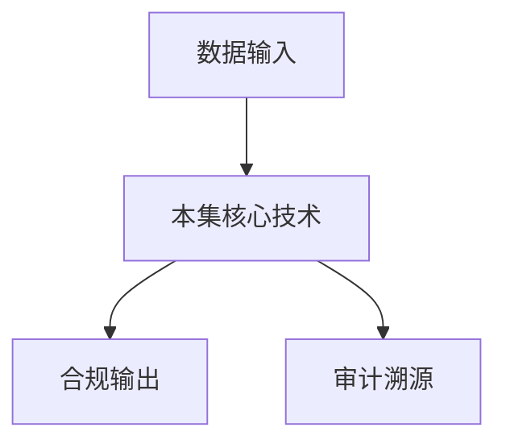

# P16 机密容器的安全设计及落地实践

← [[BV1ser5BDESU-总览]] | ← [[P15-HyperGPU-基于通用硬件构建GPU-TEE底座]] | 下一篇 → [[P17-星绽机密计算远程证明服务-构建数据要素流通的信任基座]]

## 视频信息

| 项目 | 内容 |
|------|------|
| 分集 | 机密容器的安全设计及落地实践 |
| 模块 | 密态计算与TEE |
| 时长 | 28 分 41 秒 |
| 链接 | [B 站 P16](https://www.bilibili.com/video/BV1ser5BDESU?p=16) |
| 官方文档 | [SecretFlow 文档](https://www.secretflow.org.cn/zh-CN/docs) |
| 内容来源 | 知识点增强（数据要素流通技术体系，非逐字转写） |

## 核心要点

1. **本 P 主题**：机密容器的安全设计及落地实践
2. **模块定位**：密态计算与TEE
3. **考试/实践侧重**：机密容器、Kata/TEE 容器、Kubernetes 集成
4. **笔记层级**：教程级（约 3106 字），含速览、图解、场景 Walkthrough、自测题
5. **学习建议**：先通读「3 分钟速览」与「图解」，再读「详细讲解」；动手项见 Checklist

> 以下内容基于数据要素流通与隐私计算技术体系撰写，对应 B 站分 P「机密容器的安全设计及落地实践」。**非 UP 逐字转写**；不看视频也可建立框架，看视频可对照「与视频对照表」深化。

## 本节在系列中的位置

**模块**：密态计算与 TEE · 系列第 **P16/47** 集。

**建议前置**：[[HyperGPU：基于通用硬件构建GPU-TEE底座]]——建立本集所需背景。

**建议后续**：[[星绽机密计算远程证明服务：构建数据要素流通的信任基座]]——在本集能力之上继续深入。

依赖关系：政策(P01–P06) → 可信空间(P07–P08,P18) → 密态/隐私技术(P09–P24) → SecretFlow 工程(P25–P32) → 基础设施与案例(P33–P47)。

## 3 分钟速览

**机密容器的安全设计及落地实践** 是数据要素流通体系中的关键一课。读完本节你应能回答：① 核心概念定义；② 在「供得出—流得动—用得好—保安全」链条中的位置；③ 与隐私计算技术栈的衔接。考试/面试侧重：**机密容器、Kata/TEE 容器、Kubernetes 集成**。

## 零基础导读

本节「机密容器的安全设计及落地实践」属于 **密态计算与 TEE**。即便未看视频，也应先建立**制度—技术—场景**三层视角：政策类章节回答「为什么允许流」；技术类章节回答「如何安全地算」；案例类章节回答「真实行业怎么落地」。

第一遍阅读请盯住三个问题：本集**解决什么痛点**？**关键参与方**是谁？**交付物或能力边界**是什么？第二遍阅读时，把术语表抄到 Obsidian 双链笔记，与前后分 P 交叉引用。

## 详细讲解

### 1. 机密容器概念

**机密容器**（Confidential Container）将 TEE 与容器技术结合：容器镜像运行在加密内存的虚拟机或 Enclave 中，Kubernetes 可统一编排，兼顾**云原生弹性**与**硬件级安全**。

### 2. 技术栈

| 组件 | 作用 |
|------|------|
| Kata Containers | 轻量 VM 作 Pod 沙箱 |
| AMD SEV / Intel TDX | 虚拟机内存加密 |
| Gramine / Occlum | LibOS 跑 SGX Enclave |
| Confidential GKE/AKS | 云厂商托管机密节点 |

### 3. 安全设计要点

- **镜像签名与证明**：仅运行经验证的镜像
- **密钥注入**：启动时通过 KMS 注入，不落磁盘
- **网络隔离**：密态 Pod 专用网络策略
- **存储加密**：临时卷加密，持久卷用 KMS
- **远程证明**：调度前验证节点 TEE 状态

### 4. 落地实践

1. 集群启用机密节点池（SEV/TDX）
2. 部署 Kata + 证明控制器
3. 敏感微服务迁移至机密 Pod
4. 对接星绽等远程证明服务
5. 监控侧信道与补丁周期

### 5. 与数据要素流通

连接器、隐私计算 Worker 可打包为机密容器，确保**计算环境可证明、数据明文仅在密态 Pod 内**。

### 6. 考试/实践要点

- 对比普通容器、Kata、机密容器的信任边界
- 说明 K8s 调度机密工作负载的流程
- 列举机密容器部署检查清单 5 项

### 7. 多集群

联邦 K8s 集群间用 Kuscia InterConn；机密 Pod 仅在证明通过的节点调度。

### 8. 监控

机密节点仍需 metrics/logs，但避免敏感数据进日志，用聚合指标替代。

### 9. 混合部署

敏感微服务机密 Pod，通用 Web 普通 Pod；服务网格 mTLS 统一东西向流量，北向 API 网关统一鉴权。

### 10. 学习与实践检查单

- [ ] 对照本 P 标题回顾 B 站视频章节要点
- [ ] 在 [SecretFlow 文档](https://www.secretflow.org.cn/zh-CN/docs) 找到对应模块
- [ ] 能用一句话向同事解释本 P 核心概念
- [ ] 识别一个本行业可落地的应用场景
- [ ] 记录与前后分 P 的技术依赖关系

### 11. 模块知识串联
本讲属于「数据要素流通技术」体系中的重要一环。建议在学习日志中标注：输入依赖（前序知识）、输出能力（学完能做什么）、与隐语组件映射（SecretFlow/Kuscia/SecretPad/TEE）。完成 47 讲后应能独立设计一个「政策合规+连接器+隐私计算+审计存证」的端到端方案，并评估 MPC、TEE、联邦学习的选型依据。

### 深化理解（机密容器的安全设计及落地实践）

将本节概念放入「数据二十条」四原则框架：它主要支撑哪一条原则？若去掉该能力，哪类数据流通场景会受阻？用一句话向非技术经理解释本节价值。

## 图解

## 类比与直觉

把本节技术想象成**流水线的一环**：看清输入是什么、经过哪些处理、输出给谁用，比死记名词更有效。

## 例题与场景 Walkthrough

**场景：两家机构联合建模（不共享明文）**

1. **样本对齐**：若双方仅有交集用户有价值，先用 PSI（P21/P28）对齐 ID。
2. **特征拼接**：纵向联邦（P24）下 A 方持标签、B 方持特征，梯度通过安全聚合更新。
3. **训练执行**：在 SecretFlow SPU（P27）上完成密态前向/反向，或 TEE 内明文训练（P11–P17）。
4. **模型发布**：输出评分服务；模型参数经评估后按需出域，训练数据永不出域。
5. **本集关联**：机密容器的安全设计及落地实践 提供其中 **机密容器** 能力。

## 常见误区

1. **「学完本集就会用隐语」**：SecretFlow 生态需多集串联（P19–P32），单集只是拼图一块。
2. **「隐私计算等于不上传数据」**：数据仍以密文、份额或授权方式参与计算，网络与算力开销客观存在。
3. **「TEE 绝对安全」**：TEE 依赖硬件与侧信道防护，需远程证明（P17）与补丁策略。
4. **「区块链解决一切确权」**：链适合存证与交易撮合，大规模计算仍在链下隐私计算引擎。

## 与视频对照表

| 视频段落（约） | 预期演示内容 | 笔记对应章节 |
|-------------|------------|------------|
| 开篇 0%–15% | 本集目标、背景、与前后集关系 | 本节位置、3 分钟速览 |
| 前段 15%–40% | 核心概念定义与架构图 | 零基础导读、详细讲解 |
| 中段 40%–70% | 原理展开、对比、政策/代码示例 | 图解、类比、Walkthrough |
| 后段 70%–90% | 案例、问答、易错点 | 常见误区、Checklist |
| 收尾 90%–100% | 总结、延伸资源 | 延伸阅读、自测题 |

> 本集总时长约 **28分41秒**。无官方外挂字幕时，以分 P 标题「机密容器的安全设计及落地实践」与上表主题对齐视频画面。

## 动手实践 Checklist

- [ ] 复述本集 3 个定义（不看笔记）
- [ ] 根据 Walkthrough 写 200 字场景短文
- [ ] 对照视频确认 1 个架构图/演示
- [ ] 在总览思维导图中标注本集节点
- [ ] 完成自测 Q1/Q5

## 延伸阅读

- [SecretFlow 文档中心](https://www.secretflow.org.cn/zh-CN/docs)
- TC609 可信数据空间相关标准
- 本系列相邻 2 个分 P 笔记

## 自测题

1. **本集核心考点？**  
   **答**：机密容器、Kata/TEE 容器、Kubernetes 集成。

2. **本集在四原则中的位置？**  
   **答**：偏流得动基础设施。

3. **与 SecretFlow 的关系？**  
   **答**：提供合规与架构前提，后续技术集在其上落地。

4. **一项落地检查？**  
   **答**：是否有授权、是否最小必要、是否可审计——三者缺一不可。

5. **30 秒口述本集？**  
   **答**：用「输入→处理→输出」各一句话概括（见 Walkthrough）。

## 关键术语

| 术语 | 说明 |
|------|------|
| 数据要素 | 可参与社会化配置、创造价值的数字化资源 |
| 隐私计算 | 数据可用不可见前提下实现协作计算的技术体系 |
| 模块 | 密态计算与TEE |

## 与前后分 P 的衔接

- ← **HyperGPU：基于通用硬件构建GPU-TEE底座**（[[P15-HyperGPU-基于通用硬件构建GPU-TEE底座]]）
- → **星绽机密计算远程证明服务：构建数据要素流通的信任基座**（[[P17-星绽机密计算远程证明服务-构建数据要素流通的信任基座]]）

## 逐字转写
> 引擎: whisper | 状态: 已转写 | 格式: 段落化

### [00:00 - 00:56] 各位老师同学好,我是蚂蚁蜜蒜的
各位老师同学好,我是蚂蚁蜜蒜的张续峰，今天给大家分享的课题是，机密容器的安全设计及落地实践，本次课程将分为四个部分进行讲解，首先介绍机密容器产生的背景，机密容器主要解决了什么问题，以及基于Hyper Anglia的机密容器整体架构，其实讲解机密容器的安全体系设计，主要从安全格里，全链路密谈，运行通道管控三个方面，介绍机密容器提供的安全能力，第三,讲述机密容器的信任体系设计，作为可执行环境TE技术的重要一部分，机密容器是如何实现信任内容传递的，最后,以多方数据联合计算为场景，介绍机密容器在可信数据空间领域的落地实践。

### [00:57 - 02:03] 首先看第一个部分
首先看第一个部分，在数字经济时代,数据作为第五大生产要素，以成为驱动经济质量发展的关键要素，近年来,国家高度重视数据要素市场的培育，与发展工作，陆续出台了一系列的政策法规，比如数据20条，数据要素X,12年行动计划，明确数据处理活动的要求，为数据要素市场驻劳政策根基，推动数据安全有序流通，为救助创新指明方向，在此背景下，我国数据要素市场迎来高手发展期，2005年1月，国家数据局局长在全国公众会议上表示，2024年，全国数据交易规模超一千六百亿元，同比增长本30亿上，然而,蓬勃发展的市场背后，数据流通与融合，面临著多严峻挑战。

### [02:03 - 03:15] 一方面,数据具有排大性
一方面,数据具有排大性，异与复制性等特点，一旦泄漏或被滥用，价值将极具萎缩，会给企业带来重大损失，另一方面，大数据相关法规的实施，使企业和机构，在数据共享与使用过程中，面临更苛刻的合规要求，违规风险显著叛生，此外,明文数据的流通，无法实现有效的管控，数据泄漏的成本和频率，居高不下，一旦发生数据泄漏，不仅会给企业带来直接的经济损失，还会损害用户的信任，那么为了破解数据要受流通难的问题，一般是采用密台计算的解决方案，所谓密台计算，是指的数据在计算过程中，始终属于加密状态，密台计算通过综合利用密码学，可信硬件和系统安全等相关技术。

### [03:15 - 04:28] 确保数据在跨阻底流通的
确保数据在跨阻底流通的，传输存储计算，全量流通始终保持密台，密台计算代表性的技术，包括精明计算，MPC多方安全计算，同台加密等技术，从性能方面考虑，精明计算是目前，作为现实的一种密台计算技术，精明计算通过基于硬件，提议保护使用中的数据，它也硬件隔离技术，数据加密技术，远程证明机制作为一图，实现数据的可用不可见，可算不可实，精明计算支持海量数据，和大规模和大模型训练推理，并将成本控制在，明文流通的2-10倍之间，和规模方面具备优势，能够满足大规模数据融合场景中，安全的诉求，让数据可信流通，实现从能用到好用易用的跨越，有效解决数据明文流通。

### [04:28 - 05:32] 风险不收敛的严峻产严挑战
风险不收敛的严峻产严挑战，从精明计算历史来看，在数据中心场景，并且出现了不同的形态，最早期是英特尔SGS，它是一种进程机T1技术，可以在CPU隔离的可承应环境内，执行进程的代码，因而它的优点是T2B很小，安全性高，但是它的缺点也很明显，一个是需要对应用进行改造，缺分成可信部分和不可信部分，可信部分运行在T1内部，不可信部分运行在R1议册，T1和R1需要通过依靠，侮靠机制进行通信，这个上向文切换的成本比较高，导致SGS程序的运行能比较差，所以后面是没有赏伤，为了解决监控性导致的开发成本高的问题，推出了精明训绩的解放。

### [05:32 - 06:29] 比较有代表性的是英特尔TDS
比较有代表性的是英特尔TDS，AMDSEV SMP，AMDSEV HIFER ANGLE，由于精明训绩内运行的是原生的Lanning的操作系统，所以应用程序无意改造，就可以运行在精明训绩内部，提供了最好的兼容性，而且可信的设备，比如带新的GPU设备，可以折通到精明训绩内部，非常适合高性能计算的场景，但是精明训绩也有它自身的缺点，一个是训绩内部运行的是整个Lanning的操作系统，导致它的TCB比较大，安全风险高，另外就是精明训绩部署管理比较困难，需要依赖20层提供的能力，后来TDSU继续眼镜，把精明训绩和CataCondins的。

### [06:29 - 07:28] 原生继续相接合
原生继续相接合，出现了精明容计新的形态，带来的优势是显而易见的，一个是可以附用现有的原生技术设施，有利精明训绩的大规模部署管理，另外一个优点是更小的TCB，可以基于CataCondins的对训绩操作系统，进行深度拆建，直暴流必须的逐渐，大大减小了安全场口，前面也提到精明容计是基于Cata的，那么怎么来看一下Cata相关的安全设计，最初Cata是为原生多组互强格雷场景设计的，传统的软系容器，虽然基于Lim Space和Seguru的设计，具有一定的格雷能力，但是由于底层还是共享零能内核，一旦容器讨议后，就会影响其他的组互。

### [07:28 - 08:28] Cata的出现正为了解决这个问
Cata的出现正为了解决这个问题，CataCondins基于QM硬件训续化的技术，把轻量化的训绩，构建为一种容器运行形态，所以Cata最初的目标是，防止容器的逃逸，保护云技术设施免受攻击，它的安全模型是不信任，容器内运行的World，是安全容器的一种实现形态，精明容器也是基于CataCondins的，容器运行时，除了QM训续化技术外，还通过集成T1硬件格雷，全量路加密远程证明等，影视保护方案，对使用中的数据进行保护，所以它的安全模型和，安全容器完全反过来，云技术设施或数据不再可信，需要保护的是容器内，数据的精明性和完整性。

### [08:29 - 09:25] 所以安全容器和精明容器
所以安全容器和精明容器，虽然有一些共性，但由于它们应用场景的差异，在安全方面的设计完全不同，下面重点介绍，基于HyperAngle-5精明容器相关的设计，先看一下它的主要特点，首先来说，相比于其他基于CPU硬件的T1设计，HyperAngle-5的目标，是让所有CPU都具备T1的能力，当前已经支持了国内外主流的CPU平台，比如Intel、AMD、AM等，所以普会通用是HyperAngle-5的一大优势，其次HyperAngle-5由于，不是利用CPU自身的提议，底层的性能设计，基于通用的TBM硬件，而TBM证书是通过。

### [09:25 - 10:14] 国家权威的CPU经济签发
国家权威的CPU经济签发，因而可以说，HyperAngle-5的性能根与CPU厂商结合，性能根拖拐在国家的权威，自主可控是HyperAngle-5的一大亮点，另外HyperAngle-5最核心的，Hyper外的组建，是基于安全变成语言RAS开发，而且通过了权威机构的行动化认证，安全可证是HyperAngle-5的基石，最后HyperAngle-5自身的，核应带马银开源，而且兼容Occlum,Coco,Linux等开源生态，应用无需特殊改造，即可升级为机密应用，简单应用是HyperAngle-5一直，秉承的理念。

### [10:14 - 11:10] 下面讲一下机密容器的
下面讲一下机密容器的，安全体系设计，也就是机密性的保护机制，从安全隔离上来说，HyperAngle-5启动后，会作为最高特缘软件，直接运行在硬件之上，后摄物还是会被降权，所以后摄物还是所有特缘操作，都会被HyperAngle-5安全审计，如果不符合安全层面的设计，操作会被阻断，HyperAngle-5实现了，三个层面的隔离，首先HyperAngle-5管理，所有的安全内存，这些安全内存，会分辨给机密容器，HyperAngle-5通过内存业表机制，控制软件对安全内存的防卫，实现RE和TE之间，以及机密容器之间的内存隔离。

### [11:10 - 12:11] 其实HyperAngle-5在
其实HyperAngle-5在，进行上下文切换的时候，会清理CPU技能器，可以保证RE看不到TE的状态数据，机密容器A，也看不到机密容器B的状态数据，实现CPU状态的隔离，还有就是可信的设备，可以通过VFRO的机制，直通到机密容器，比如GPU设备，为了防止RE世界，修叹到设备内存的数据，我们还需要对设备进行隔离，设备隔离的实现，是通过HyperAngle-5，控制泡打RO，和管理ROMU，地址翻译界表，保护设备的控制面和数据面，安全隔离仅仅能在权限层面，限制特选软件和管理员，它不能完全解决数据的机密性，还需要实现全链路的密台，而这里的密台计算。

### [12:11 - 13:15] 并不是指对密台数据直接进行计算
并不是指对密台数据直接进行计算，而是指对于RE来说，看到的都是密台数据，数据加密后流入机密容器，只在硬件隔离的被认证的，提议环境进行解密计算，另外通过CPU内置的内存加密引擎，可以对内存中的数据，进行自动加密，以抵于潜在的物理攻击，比如库德布特内存攻击，对于机密容器来说，容器镜像在盖车OS里面拉取，容器镜像也是被保护的对象，为了防止RE独取这些数据，我们需要对落盘的容器镜像，以及运营时临时落盘数据进行加密，这里面的挑战是机密容器重启后，如果附用之前的容器镜像数据，具体的解决方案这里就不展开，同样的机密容器，也有持有化落盘数据的需求。

### [13:15 - 14:23] 比如密台数据部的场景
比如密台数据部的场景，针对这些数据也需要使能，赤盘透明加密的能力，T1环境中传输的数据，也是被保护的重点对象，一部分是CPU和可信设备之前，总线传输的数据，或者是可信设备与可信设备，之间也总线传输的数据，为了防止对总线的秀碳，窃取数据，需要对总线上传输的数据，另外一部分也是，通过网络传输的数据，可以把医药容器发送的网络数据包，透明截至到加密网关，保证流出T1环境的网络数据，是自动加密的，目标端T1环境，收到网络数据包后，进行自动解密并转发到医药容器，不同于传统的原生容器，我们需要保护机密容器数据隐私，因而常规的运营通道，需要进行限制和管控。

### [14:23 - 15:20] 比如锅盖上ERGC
比如锅盖上ERGC，刀扣ERGC等通道，而另外一个方面，为了保证线上业务的可运性，我们不能把运营通道一刀切完全堵死，所以安全管控机制上，需要对安全和运营之间进行权衡，可以从以下几个方面，对运营通道进行重心防御，第一个是API程的防护，T1和RE之间最重要的交互通道，就是CATASIM和CATASIM之间的RPC通路，锅盖上ERGC之类的运营通道，就是走的这种方式，我们可以通过Initial Data Policy的方式，限制该通道的运营之间的操作，该方案主要是利用了OPA Policy的能力，这种策略配置的方式偏静态。

### [15:20 - 16:30] 第二种是系统层面的防护
第二种是系统层面的防护，可以通过可运运营服务，动态下发安全策略，该策略可以基于EVPF实现，EVPF是一种可以动态注入字节码，到任何的技术，支持大量的护火点，可以对高威操作经审计或者阻断，第三点就是运营输出加密，秉承着T1流出的数据，全程密带的原则，我们可以对运营通道，执行命令的IDL输出，进行自动加密，只有被特殊授权的运营人员，才可以看到运营数据，最后一点就是运营操作的审计存证，T1内所有运营操作，都透明的都是可以被审计的，而且审计纪录不可篡改，接下来介绍，精密容器的信任体系设计，也就是完整性保护机制，T1最重要的一个技术点。

### [16:30 - 17:21] 就是远程证明机制
就是远程证明机制，如果证明程序执行的环境是可信的，首先说一下，据Hyper Angle的精密容器，启动信任内建立的过程，TPM作为整个系统的信任根，继续上年后，会把启动的组件，包括固件，UEF,Bootload,Kner，Ninth Run Models，可能可能满满，这些组件的度量值，扩展到TPM PTR精神器，Ninth Run Models加在Drawer Module，Drawer Module会加在Hyper Angle，并把启动度量值，扩展到TPM PTR精神器，Hyper Angle启动后，会把后手OS降级为非特选模式。

### [17:21 - 18:24] HyperAngle作为精密容
Hyper Angle作为精密容器的信任根，建立精密容器的启动信任内，包括启动度量,TTCM，改成Kner，可能可满满，这些，改成OS系统，入单发射分区，为内核的DM2T机子，完成性保护，该驯动分区的入单发射，配置在Kner，可能可满满，从而把精密容器的启动信任量，扩展到系统服务，保证精密容器，系统车的启动组件，都是符合预期的，通过增强，概设内核中的IME模块，应用容器在被，驯动服务组件，拉起过程中，执行二进日的度量启动，和安全启动，安全救援失败的容器，会被阻担运行，从而把启动信任内，传递到应用式，保障精密容器，启动链条上的任何组件，都是经过完整性认证的。

### [18:24 - 19:21] 经过了精密容器的
经过了精密容器的，可信启动过程，要容器就可以发起，远程证明，以获取应用的可信身份，要容器必要用，Alt-TazenAgent提供的借口，Alt-TazenAgent，调用设备驱动，获取远程证明报告，设备驱动，会通过HyperCore借口，调用HyperAngle，获取最终的报告，Alt-TazenAgent，把报告发送给远程证明服务，远程证明服务，对报告的完美性，进行交易，并比对极限，远程证明后，给应用办法可信身份，同时把自信的报告，返回给Alt-TazenAgent，Alt-TazenAgent，教验远程证明服务的报告，进行双向远程证明。

### [19:21 - 20:26] 远程证明后
远程证明后，返回可信身份，给要容器，而右边这幅图，是远程证明报告的，新令代码关系，从下到上，除TPMM硬件中的AK迷恙，担保了TPMM擴大中的，PCR值的完整性，其中PCR0-9，担保平台完整性，PCR12，担保HyperAngle的完整性，TPMMPCR13，担保HyperAngleAK的完整性，HyperAngleAK，是从TPMM硬件排身，它用来担保，CVM Quota的完整性，CVM Quota中，MRTD担保TTCM，固件的完整性，RTMR0和1，担保概冊OS的完整性，RTMR2担保容器，累计度量值的完整性，容器累计度量值，担保容器二金字。

### [20:26 - 21:33] 度量事件的完整性
度量事件的完整性，这样就形成一个，完备的新令代码关系，然后，医药容器会到可信身份后，就可以基于可信身份，从密药管理服务，尝试会有密药，密药管理服务，验证完应用的身份，基于体验配置好的，密药数源策略，进行健全，健全成功后，返回加密后的密药数据，最后讲一下机密容器，在多方数据联合计算场景，方便的时间，对于一个典型的数据流传场景，数据提供方将自由数据，上传到数据中心，由数据加工应用进行处理，主要设计到设立角色，一个是TES，也就是数据提供方，自由数据处理，被第三方应用处理，担心数据处理的安全，第二个是可信应用，也就是第三方数据处理服务，需要保障数据安全。

### [21:33 - 22:41] 运行在机密容器中
运行在机密容器中，需要自证清买，第三个是密药管理服务，它管理数据密药，和相应的密药数据策略，同样运行在机密容器中，需要自证清买，第四个是远程证明服务，它作为整个数据中心的，心灵根存在，它自身的心灵根，是在TBM硬件，远程证明服务，验证应用的远程证明报告，同样运行在机密容器中，需要自证清买，数据流转的主要流程留下，可信应用注册应用机线，到远程证明服务，可信应用不受启动后，通过远程证明，获取可信身份，通过可信身份，在密药管理服务，创建KK密药，数据提供方TESA，配置KK密药授权策略，然后TESA从远程证明服务，获取报告，TESA通过全域机构。

### [22:41 - 23:46] 或者第三方中立机构
或者第三方中立机构，验证远程证明报告的，验证远程证明服务的报告，验证成功后，就证明了数据中心，远程证明服务的可信性，后面就可以信任远程证明服务，颁发的可信身份，或者叫认证偷轨，然后TESA从密药管理服务，获取KK工药，KK工药的完成性，有密药管理服务的偷轨弹幕，TESA教验密药管理服务的偷轨，和KK工药的完成性，然后使用KK工药，加密数据加密密药，DK，DK加密数据，密文数据，组成数字新分后，发送给可信应用，可信应用为了解密数据，需要获取KK私药，KK私药通过应用可信身份，从密药管理服务获取，可信应用获取到KK私药后，对DK进行解密。

### [23:46 - 24:50] DK对数据进行解密
DK对数据进行解密，然后对数据进行处理，整个过程，对硬件可信跟的远程证明机制，实现了对可信应用授权，与密药安全流转，数据提供方TESA，根据公开的信息，发布密药验证策略，可以安全地把加密数据，只传出给授权的TESA应用，最后，密药的名为，只出现在TESA内部，而且只能被特定的，可信应用获取，管理员和其他恶意程序，不能通过任何手段，获取到密药的名为，从而保证的数据密药，在生存 存储 传输 使用，各环境的安全，接着保证数据适用权的可信流转，下面看一个更真实的，可信数据空间，多方数据联合计算的场景，从下面图可以看到，里面包含了多个数据提供方。

### [24:50 - 25:59] 统一的数据加工方
统一的数据加工方，和潜在的多个数据消费方，密调数据接入，由数据提供方，在接入端对原始数据进行加密，加密或者数据，以密文的形态，流入加工平台，加解密密药，是由密药管理服务，掌握的一对公司药，接入端从密药管理服务，获取加密工药，对数据进加密封装后，流入数据加工方平台，密调数据封装后，归在数据加工方平台，分类后进行密调的存储，然后对密调数据进行治理，通过自动化的清洗，去从 检验 比对，合成 脱米等流程，确保数据的准确性，完成性 一致性 还有实际性，密调数据研发，对治理或者数据，通过找数 设数 严数，完成代码逻辑见证，该阶段输出数据计算逻辑，密调数据服务环节。

### [25:59 - 27:11] 是数据加工方
是数据加工方，使用研发态产生的计算逻辑，或者模型进行密调计算，生成密调计算的结果，并发布为数据产品，对外提供服务，密调数据交互阶段，在获得数据提供方，授权的前提下，被授权捣出的数据，可以以密纹形态留足平台，且留足的密纹数据，只能被以获取授权的数据消费方，获得，而以上数据加工每个环节，都涉及到，基于机密容器 提议相关技术，包括生品验证 授权健全，环境度量 服务度量，密调计算 可信審计等，只有验证和授权通过后，才能进行相关的数据解密，数据计算 数据流出等操作，可信数据空间，基于权链路密带保障，实现原始数据不可见，计算过程密带化，操作全程可審计等多重防护。

### [27:11 - 28:18] 可防范内部人员恶意操作的风险
可防范内部人员恶意操作的风险，有效破解高价值高敏感，数据流通难论，另外 基于可信应用生费，和密带交道技术，购物件数据使用权跨越管控能力，打破数据持有防，与运用方的信任秘累，确保数据的流通，利用符合停工方的预期，即使运用等内部人员，也无法滥用数据，利用密带计算，购物件密耀管控的，虚拟数据空间边界，形成具有明确级别，安全保障的密耀管控域，替代原有的运用管控域，物理管控域边界，基于密耀管控域，可以对多方数据融合的价值，进行验证，有效促进多方主体，协同推进数据要素，全流通的安全流通，形成良性循环的数据要素，市场生态，本次课程主要介绍的内容，就是这些。

### [28:18 - 28:38] 如果想对机密容器
如果想对机密容器，经营不了解的同学，可以参考下面的拓展资料，包括卡达·康廷的社区，康贝丹萨·康廷的社区，和星达社区，里面有很多关于机密容器，实现的详细微浪资料，和代码细节，感谢大家的联听。

## 来源说明

- ✅ B 站官方元数据（`Tools/BV1ser5BDESU-full.json`）
- ✅ 分 P 首帧封面（`Tools/bili-fetch/fetch-bilibili.js`）
- ✅ **教程级增强**：含图解/Mermaid、场景 Walkthrough、自测题（约 3106 字，2026-06-06）
- ⏳ 逐字转写：B 站 API 无外挂字幕轨；可选 Whisper/BiliNote 后续补充

## 关键截图

![[../../06-资源附件/video-notes-images/BV1ser5BDESU-P16-cover.jpg|B站首帧 P16]]
