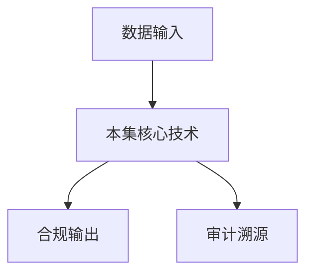

# P18 可信数据空间-连接器

← [[BV1ser5BDESU-总览]] | ← [[P17-星绽机密计算远程证明服务-构建数据要素流通的信任基座]] | 下一篇 → [[P19-多方安全计算MPC]]

## 视频信息

| 项目 | 内容 |
|------|------|
| 分集 | 可信数据空间-连接器 |
| 模块 | 可信数据空间连接器 |
| 时长 | 41 分 40 秒 |
| 链接 | [B 站 P18](https://www.bilibili.com/video/BV1ser5BDESU?p=18) |
| 官方文档 | [SecretFlow 文档](https://www.secretflow.org.cn/zh-CN/docs) |
| 内容来源 | 知识点增强（数据要素流通技术体系，非逐字转写） |

## 核心要点

1. **本 P 主题**：可信数据空间-连接器
2. **模块定位**：可信数据空间连接器
3. **考试/实践侧重**：连接器功能、数据产品登记、策略执行、合约
4. **笔记层级**：教程级（约 3024 字），含速览、图解、场景 Walkthrough、自测题
5. **学习建议**：先通读「3 分钟速览」与「图解」，再读「详细讲解」；动手项见 Checklist

> 以下内容基于数据要素流通与隐私计算技术体系撰写，对应 B 站分 P「可信数据空间-连接器」。**非 UP 逐字转写**；不看视频也可建立框架，看视频可对照「与视频对照表」深化。

## 本节在系列中的位置

**模块**：可信数据空间连接器 · 系列第 **P18/47** 集。

**建议前置**：[[星绽机密计算远程证明服务：构建数据要素流通的信任基座]]——建立本集所需背景。

**建议后续**：[[多方安全计算MPC]]——在本集能力之上继续深入。

依赖关系：政策(P01–P06) → 可信空间(P07–P08,P18) → 密态/隐私技术(P09–P24) → SecretFlow 工程(P25–P32) → 基础设施与案例(P33–P47)。

## 3 分钟速览

**可信数据空间-连接器** 是数据要素流通体系中的关键一课。读完本节你应能回答：① 核心概念定义；② 在「供得出—流得动—用得好—保安全」链条中的位置；③ 与隐私计算技术栈的衔接。考试/面试侧重：**连接器功能、数据产品登记、策略执行、合约**。

## 零基础导读

本节「可信数据空间-连接器」属于 **可信数据空间连接器**。即便未看视频，也应先建立**制度—技术—场景**三层视角：政策类章节回答「为什么允许流」；技术类章节回答「如何安全地算」；案例类章节回答「真实行业怎么落地」。

第一遍阅读请盯住三个问题：本集**解决什么痛点**？**关键参与方**是谁？**交付物或能力边界**是什么？第二遍阅读时，把术语表抄到 Obsidian 双链笔记，与前后分 P 交叉引用。

## 详细讲解

### 1. 连接器定位

**可信数据空间连接器**是参与方接入空间的**标准节点**，承担身份认证、目录同步、合约协商、数据投递、策略执行、日志上报等职能，是「数据要素高速公路」的出入口。

### 2. 核心功能模块

| 模块 | 功能 |
|------|------|
| 身份管理 | 证书、DID、与空间 CA 对接 |
| 目录客户端 | 登记/发现数据产品 |
| 合约引擎 | 解析数字合约、策略执行 |
| 数据管道 | 加密传输、格式转换 |
| 计算适配 | 对接 SecretFlow/Kuscia/TEE |
| 审计代理 | 本地日志 + 上报空间 |

### 3. 连接器交互流程

1. 提供方连接器登记数据产品（元数据+策略）
2. 使用方连接器浏览目录、发起使用申请
3. 双方协商数字合约，空间运营方见证
4. 提供方经连接器投递密态数据/胶囊
5. 计算在约定环境（TEE/MPC）执行
6. 结果经连接器返回，双方审计日志对账

### 4. 互联互通

国标/团标推动**连接器互认**：统一 API（REST/gRPC）、统一身份联邦、统一合约语义。避免「空间孤岛」。

### 5. 部署模式

- **本地部署**：大型机构自有数据中心
- **云端托管**：中小企业 SaaS 连接器
- **边缘部署**：IoT 场景轻量连接器

### 6. 考试/实践要点

- 列出连接器六大模块
- 说明连接器如何实现「使用控制」而非「数据拷贝」
- 设计金融场景连接器与 Kuscia Domain 的对接架构

### 7. 测试认证

连接器应通过互联互通 conformance test；国标发布后需版本升级适配。

### 8. 开源参考

关注隐语、国际数据空间连接器开源实现，缩短自研周期。

### 9. 数据格式

连接器应支持 CSV、Parquet、API、数据库 CDC；入空间前自动扫描 PII 并提示分级标签，减少合规疏漏。

### 10. 学习与实践检查单

- [ ] 对照本 P 标题回顾 B 站视频章节要点
- [ ] 在 [SecretFlow 文档](https://www.secretflow.org.cn/zh-CN/docs) 找到对应模块
- [ ] 能用一句话向同事解释本 P 核心概念
- [ ] 识别一个本行业可落地的应用场景
- [ ] 记录与前后分 P 的技术依赖关系

### 11. 模块知识串联
本讲属于「数据要素流通技术」体系中的重要一环。建议在学习日志中标注：输入依赖（前序知识）、输出能力（学完能做什么）、与隐语组件映射（SecretFlow/Kuscia/SecretPad/TEE）。完成 47 讲后应能独立设计一个「政策合规+连接器+隐私计算+审计存证」的端到端方案，并评估 MPC、TEE、联邦学习的选型依据。

### 深化理解（可信数据空间-连接器）

将本节概念放入「数据二十条」四原则框架：它主要支撑哪一条原则？若去掉该能力，哪类数据流通场景会受阻？用一句话向非技术经理解释本节价值。

## 图解

## 类比与直觉

连接器像**海关申报终端**：数据产品要登记、验货、绑策略，出关入关都有审计记录。

## 例题与场景 Walkthrough

**场景：两家机构联合建模（不共享明文）**

1. **样本对齐**：若双方仅有交集用户有价值，先用 PSI（P21/P28）对齐 ID。
2. **特征拼接**：纵向联邦（P24）下 A 方持标签、B 方持特征，梯度通过安全聚合更新。
3. **训练执行**：在 SecretFlow SPU（P27）上完成密态前向/反向，或 TEE 内明文训练（P11–P17）。
4. **模型发布**：输出评分服务；模型参数经评估后按需出域，训练数据永不出域。
5. **本集关联**：可信数据空间-连接器 提供其中 **连接器功能** 能力。

## 常见误区

1. **「学完本集就会用隐语」**：SecretFlow 生态需多集串联（P19–P32），单集只是拼图一块。
2. **「隐私计算等于不上传数据」**：数据仍以密文、份额或授权方式参与计算，网络与算力开销客观存在。
3. **「TEE 绝对安全」**：TEE 依赖硬件与侧信道防护，需远程证明（P17）与补丁策略。
4. **「区块链解决一切确权」**：链适合存证与交易撮合，大规模计算仍在链下隐私计算引擎。

## 与视频对照表

| 视频段落（约） | 预期演示内容 | 笔记对应章节 |
|-------------|------------|------------|
| 开篇 0%–15% | 本集目标、背景、与前后集关系 | 本节位置、3 分钟速览 |
| 前段 15%–40% | 核心概念定义与架构图 | 零基础导读、详细讲解 |
| 中段 40%–70% | 原理展开、对比、政策/代码示例 | 图解、类比、Walkthrough |
| 后段 70%–90% | 案例、问答、易错点 | 常见误区、Checklist |
| 收尾 90%–100% | 总结、延伸资源 | 延伸阅读、自测题 |

> 本集总时长约 **41分40秒**。无官方外挂字幕时，以分 P 标题「可信数据空间-连接器」与上表主题对齐视频画面。

## 动手实践 Checklist

- [ ] 复述本集 3 个定义（不看笔记）
- [ ] 根据 Walkthrough 写 200 字场景短文
- [ ] 对照视频确认 1 个架构图/演示
- [ ] 在总览思维导图中标注本集节点
- [ ] 完成自测 Q1/Q5

## 延伸阅读

- [SecretFlow 文档中心](https://www.secretflow.org.cn/zh-CN/docs)
- TC609 可信数据空间相关标准
- 本系列相邻 2 个分 P 笔记

## 自测题

1. **本集核心考点？**  
   **答**：连接器功能、数据产品登记、策略执行、合约。

2. **本集在四原则中的位置？**  
   **答**：偏流得动基础设施。

3. **与 SecretFlow 的关系？**  
   **答**：提供合规与架构前提，后续技术集在其上落地。

4. **一项落地检查？**  
   **答**：是否有授权、是否最小必要、是否可审计——三者缺一不可。

5. **30 秒口述本集？**  
   **答**：用「输入→处理→输出」各一句话概括（见 Walkthrough）。

## 关键术语

| 术语 | 说明 |
|------|------|
| 数据要素 | 可参与社会化配置、创造价值的数字化资源 |
| 隐私计算 | 数据可用不可见前提下实现协作计算的技术体系 |
| 使用控制 | 约定用途、次数、期限 |
| 连接器 | 参与方接入节点 |

## 与前后分 P 的衔接

- ← **星绽机密计算远程证明服务：构建数据要素流通的信任基座**（[[P17-星绽机密计算远程证明服务-构建数据要素流通的信任基座]]）
- → **多方安全计算MPC**（[[P19-多方安全计算MPC]]）

## 逐字转写
> 状态：待转写。运行 `Tools/transcribe/transcribe.ps1 -Bvid BV1ser5BDESU -Part 18` 补充。

## 来源说明

- ✅ B 站官方元数据（`Tools/BV1ser5BDESU-full.json`）
- ✅ 分 P 首帧封面（`Tools/bili-fetch/fetch-bilibili.js`）
- ✅ **教程级增强**：含图解/Mermaid、场景 Walkthrough、自测题（约 3024 字，2026-06-06）
- ⏳ 逐字转写：B 站 API 无外挂字幕轨；可选 Whisper/BiliNote 后续补充

## 关键截图

![[../../06-资源附件/video-notes-images/BV1ser5BDESU-P18-cover.jpg|B站首帧 P18]]
