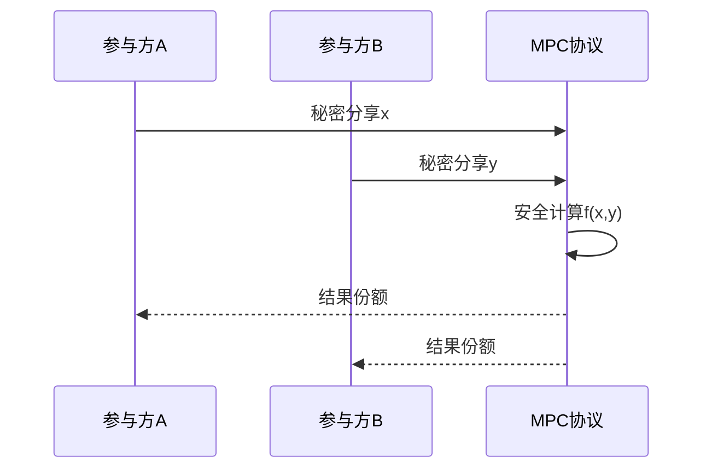

# P19 多方安全计算MPC

← [[BV1ser5BDESU-总览]] | ← [[P18-可信数据空间-连接器]] | 下一篇 → [[P20-全同态加密基本原理和应用]]

## 视频信息

| 项目 | 内容 |
|------|------|
| 分集 | 多方安全计算MPC |
| 模块 | 隐私计算核心技术 |
| 时长 | 52 分 04 秒 |
| 链接 | [B 站 P19](https://www.bilibili.com/video/BV1ser5BDESU?p=19) |
| 官方文档 | [SecretFlow 文档](https://www.secretflow.org.cn/zh-CN/docs) |
| 内容来源 | 知识点增强（数据要素流通技术体系，非逐字转写） |

## 核心要点

1. **本 P 主题**：多方安全计算MPC
2. **模块定位**：隐私计算核心技术
3. **考试/实践侧重**：MPC 定义、秘密分享、混淆电路、半诚实/恶意模型
4. **笔记层级**：教程级（约 3074 字），含速览、图解、场景 Walkthrough、自测题
5. **学习建议**：先通读「3 分钟速览」与「图解」，再读「详细讲解」；动手项见 Checklist

> 以下内容基于数据要素流通与隐私计算技术体系撰写，对应 B 站分 P「多方安全计算MPC」。**非 UP 逐字转写**；不看视频也可建立框架，看视频可对照「与视频对照表」深化。

## 本节在系列中的位置

**模块**：隐私计算核心技术 · 系列第 **P19/47** 集。

**建议前置**：[[可信数据空间-连接器]]——建立本集所需背景。

**建议后续**：[[全同态加密基本原理和应用]]——在本集能力之上继续深入。

依赖关系：政策(P01–P06) → 可信空间(P07–P08,P18) → 密态/隐私技术(P09–P24) → SecretFlow 工程(P25–P32) → 基础设施与案例(P33–P47)。

## 3 分钟速览

**多方安全计算MPC** 是数据要素流通体系中的关键一课。读完本节你应能回答：① 核心概念定义；② 在「供得出—流得动—用得好—保安全」链条中的位置；③ 与隐私计算技术栈的衔接。考试/面试侧重：**MPC 定义、秘密分享、混淆电路、半诚实/恶意模型**。

## 零基础导读

本节「多方安全计算MPC」属于 **隐私计算核心技术**。即便未看视频，也应先建立**制度—技术—场景**三层视角：政策类章节回答「为什么允许流」；技术类章节回答「如何安全地算」；案例类章节回答「真实行业怎么落地」。

第一遍阅读请盯住三个问题：本集**解决什么痛点**？**关键参与方**是谁？**交付物或能力边界**是什么？第二遍阅读时，把术语表抄到 Obsidian 双链笔记，与前后分 P 交叉引用。

## 详细讲解

### 1. MPC 定义

**多方安全计算**（Secure Multi-Party Computation, MPC）允许多个参与方在不泄露各自私有输入的前提下，联合计算一个函数。1982 年姚期智提出百万富翁问题；现已支持统计、机器学习、SQL 等复杂算子。

### 2. 安全模型

| 模型 | 假设 | 协议复杂度 |
|------|------|-----------|
| 半诚实 | 遵守协议但好奇 | 较低 |
| 恶意 | 任意偏离协议 | 较高 |
| 诚实多数 | 少于半数作恶 | 可容错 |

### 3. 主要协议范式

**秘密分享（Shamir）**
- 将秘密 s 拆为 n 份，任意 t 份可恢复，少于 t 份无信息
- 加法同态：本地加分享即可

**混淆电路（Yao / GMW）**
- 将函数编译为布尔电路，双方用 OT 求值
- 适合低深度电路

**不经意传输（OT）**
- 发送方有 n 条消息，接收方选一条获取，发送方不知选了哪条
- MPC 的基础原语

### 4. 应用算子

| 算子 | 用途 |
|------|------|
| 安全乘加 | 线性回归、神经网络 |
| 比较 | 决策树、风控规则 |
| PSI | 求交集不求差集 |
| 安全聚合 | 联邦学习梯度求和 |

### 5. 性能考量

通信轮次与数据量决定延迟。工业实践常用**专用协议**（如 3PC 诚实多数）换取性能，或 GPU 加速 OT。

### 6. 考试/实践要点

- 解释百万富翁问题的 MPC 思路
- 对比秘密分享与混淆电路优劣
- 说明 MPC 在 SecretFlow SPU 中的角色

### 7. 三方计算 3PC

诚实多数三方协议通信量低于两方；阿里云、蚂蚁等生产环境常用 3PC 折中性能与安全。

### 8. 法律证据

MPC 日志可作为履约证据；协议设计需防抵赖（签名、时间戳）。

### 9. 算力外包

MPC 可将计算外包给第三方云而不泄露输入，但需恶意安全协议；合同明确计算方法律责任与保险。

### 10. 学习与实践检查单

- [ ] 对照本 P 标题回顾 B 站视频章节要点
- [ ] 在 [SecretFlow 文档](https://www.secretflow.org.cn/zh-CN/docs) 找到对应模块
- [ ] 能用一句话向同事解释本 P 核心概念
- [ ] 识别一个本行业可落地的应用场景
- [ ] 记录与前后分 P 的技术依赖关系

### 11. 模块知识串联
本讲属于「数据要素流通技术」体系中的重要一环。建议在学习日志中标注：输入依赖（前序知识）、输出能力（学完能做什么）、与隐语组件映射（SecretFlow/Kuscia/SecretPad/TEE）。完成 47 讲后应能独立设计一个「政策合规+连接器+隐私计算+审计存证」的端到端方案，并评估 MPC、TEE、联邦学习的选型依据。

### 深化理解（多方安全计算MPC）

将本节概念放入「数据二十条」四原则框架：它主要支撑哪一条原则？若去掉该能力，哪类数据流通场景会受阻？用一句话向非技术经理解释本节价值。

## 图解

## 类比与直觉

隐私计算像**蒙眼协作拼图**：每人只看到自己那块，通过协议拼出完整图案，但彼此不知道对方拼图内容。

## 例题与场景 Walkthrough

**场景：两家机构联合建模（不共享明文）**

1. **样本对齐**：若双方仅有交集用户有价值，先用 PSI（P21/P28）对齐 ID。
2. **特征拼接**：纵向联邦（P24）下 A 方持标签、B 方持特征，梯度通过安全聚合更新。
3. **训练执行**：在 SecretFlow SPU（P27）上完成密态前向/反向，或 TEE 内明文训练（P11–P17）。
4. **模型发布**：输出评分服务；模型参数经评估后按需出域，训练数据永不出域。
5. **本集关联**：多方安全计算MPC 提供其中 **MPC 定义** 能力。

## 常见误区

1. **「学完本集就会用隐语」**：SecretFlow 生态需多集串联（P19–P32），单集只是拼图一块。
2. **「隐私计算等于不上传数据」**：数据仍以密文、份额或授权方式参与计算，网络与算力开销客观存在。
3. **「TEE 绝对安全」**：TEE 依赖硬件与侧信道防护，需远程证明（P17）与补丁策略。
4. **「区块链解决一切确权」**：链适合存证与交易撮合，大规模计算仍在链下隐私计算引擎。

## 与视频对照表

| 视频段落（约） | 预期演示内容 | 笔记对应章节 |
|-------------|------------|------------|
| 开篇 0%–15% | 本集目标、背景、与前后集关系 | 本节位置、3 分钟速览 |
| 前段 15%–40% | 核心概念定义与架构图 | 零基础导读、详细讲解 |
| 中段 40%–70% | 原理展开、对比、政策/代码示例 | 图解、类比、Walkthrough |
| 后段 70%–90% | 案例、问答、易错点 | 常见误区、Checklist |
| 收尾 90%–100% | 总结、延伸资源 | 延伸阅读、自测题 |

> 本集总时长约 **52分04秒**。无官方外挂字幕时，以分 P 标题「多方安全计算MPC」与上表主题对齐视频画面。

## 动手实践 Checklist

- [ ] 复述本集 3 个定义（不看笔记）
- [ ] 根据 Walkthrough 写 200 字场景短文
- [ ] 对照视频确认 1 个架构图/演示
- [ ] 在总览思维导图中标注本集节点
- [ ] 完成自测 Q1/Q5

## 延伸阅读

- 《隐私计算白皮书》对应章节
- SecretFlow 文档「组件」- 密码学基础
- 学术论文：FedAvg、CKKS、ECDH-PSI 原始论文摘要

## 自测题

1. **本集核心考点？**  
   **答**：MPC 定义、秘密分享、混淆电路、半诚实/恶意模型。

2. **本集在四原则中的位置？**  
   **答**：保安全的技术实现。

3. **与 SecretFlow 的关系？**  
   **答**：为 SecretFlow 提供密码学/算法基础。

4. **一项落地检查？**  
   **答**：是否有授权、是否最小必要、是否可审计——三者缺一不可。

5. **30 秒口述本集？**  
   **答**：用「输入→处理→输出」各一句话概括（见 Walkthrough）。

## 关键术语

| 术语 | 说明 |
|------|------|
| 数据要素 | 可参与社会化配置、创造价值的数字化资源 |
| 隐私计算 | 数据可用不可见前提下实现协作计算的技术体系 |
| 秘密分享 | Shamir (t,n) 门限方案 |
| 混淆电路 | Yao 协议基础 |

## 与前后分 P 的衔接

- ← **可信数据空间-连接器**（[[P18-可信数据空间-连接器]]）
- → **全同态加密基本原理和应用**（[[P20-全同态加密基本原理和应用]]）

## 逐字转写
> 引擎: whisper | 状态: 已转写 | 格式: 段落化

### [00:00 - 00:57] 各位大家好,很高兴继续介绍多方
各位大家好,很高兴继续介绍多方安全计算技术基础，这是这一讲的目录提纲，首先我们总体介绍一下多方安全计算的背景，多方安全计算它最早源于尤其是先生1982年提出的百万封问题，这里有两个参与方A和B，在没有可信第三方的条件下，想比较谁的资产比较多，又不泄露各自资产的具体素质，只得到比较的结果，这个可以抽象为，双方各自拥有自己的隐私数据，想共同计算一个公共的函数，在这里就是比较函数，更一般的我们可以推广到其他的函数，也可以推广到多个参与方，因此被统称为多方安全计算，也有翻译做安全多方计算，英文把它简称为NPC。

### [00:57 - 01:47] NPC已经在人工智能、医疗、金
NPC已经在人工智能、医疗、金融等诸多领域，找到了实际的应用，例如机器学习、训练模型，基因诊断、联合分控等等，姚先生在1982年提出了安全多方计算的概念以后，在1986年又给出了基于混淆电路的二方安全计算的协议，那么1987年，格德瑞·米克雷等人，给出了基于加法秘密分享的多方安全计算的协议，那么上个世纪八九十年代的，提出了NPC协议的，各种可行性的结果和基本框架，那么之后NPC的各类公开的理论问题被陆续解决，可以说在2004年之前NPC的研究主要停留在理论阶段，在2004年，那么第一个基于谣的。

### [01:47 - 02:43] 混淆电路的二方安全计算的协议被
混淆电路的二方安全计算的协议被实现，这就是当时的那个Fairplay，在大数据时代应用驱动下，那么多方安全计算，进入了高效NPC协议的设计应用和落地阶段，NPC的实现效率被不断的提升，接下来谈一下多方安全计算的分类，它可以从多个角度进行分类，比如说不诚实参与方的数量，那么敌手的恶意行为，敌手的计算能力，输入可达性，计算模型，通信模型，以及腐化策略等等，这些都是从不同的维度进行划分，首先我们可以按照不诚实参与方，也就是我们俗称的坏人，数量占所有参与方的占比进行分类，这里T就是坏人的数量，那么N就是所有参与方的数量，如果T小于2分之1。

### [02:43 - 03:35] 也就是坏人没有超过一半
也就是坏人没有超过一半，我们成为诚实大多数，那么坏人过半的情况，就会成为不诚实大多数，在这个情况下，学书界我们通常考虑最极端的情况，也就是坏人的数量是N-1，T-1，也就是诚实参与方只有一个的情况，另外一种分类方法是按照敌手，它行为的恶意程度，可以分为半诚实和恶意敌手两种，那么半诚实的敌人，可以理解为它的行为是诚实的，但是它比较好奇，属于被动攻击，它会诚实的执行，应该遵循的协议，但是它会记录协议中，所看到的所有的信息，那么事后进行分析，试图破坏协议的数据隐私性，那么恶意敌手，它采取的是主动攻击，它可以背离协议的要求，进行任意的操作。

### [03:35 - 04:27] 包括发送任意错误的消息
包括发送任意错误的消息，那么从敌手的计算能力分，我们又可以分为，敌手的计算能力，它是概率多像式的，以及敌手的计算能力，它是不受限的，那么前者实际上可以进一步，分为不诚实大多数和诚实大多数，前面我们已经介绍过了，那么后者实际上必须是诚实大多数的，否则这样的无限计算能力的敌手，我们不诚实大多数的话，是没有办法实现的，MPC的协议可以按照输出可达性，进一步分为所谓的终止安全，Security with a vault，公平的协议，还有就是保障输出传送，Guaranteed out of the delivery的协议，那么所谓的终止安全。

### [04:27 - 05:29] 是至恶意时期获得输出后
是至恶意时期获得输出后，可以终止协议，使得诚实实体不能获得输出，那么公平性更容易理解一点，就是说要么大家都获得输出，要么大家都没有得到输出，这样才是公平，那么保障输出传送是指所有的实体，公平私义就是所有的实体一定会得到输出，那么在不诚实大多数的情况下，我们只能达到终止安全，后面那些其他的就得不到了，那么在诚实大多数的情况下，理论上我们可以实现公平性，甚至可以保证输出传送，但是实际上设计NPC协议也是为了效率考虑，目前大多数的协议，只需要考虑做到终止安全，安全中方计算实际上是一种安全的计算，所以它也有计算是通过怎样的模型来实现。

### [05:29 - 06:21] 那么我们知道有图灵机模型
那么我们知道有图灵机模型，以及与它等价的一些其他的模型，那么在NPC里面实际上常用的一个计算的模型，还是布尔电路，或者和算数电路以及RAM成讯，所谓的随机存储机RAMDXS MACHINE，那么前两者是比较常见的，是大多数NPC协议采用的计算模型，那么第三种是相对来说教授，可能可以出现在一些数据库的安全计算的应用场景当中，那么实际上我们会发现，布尔电路算数电路，这些电路实际上它的计算跟图灵机或者说，我们现在电脑里的程序还是不一样的，比如说电脑里的程序它有一些条件的转票，那么实际上布尔电路算数电路这些电路，它是Oblivist。

### [06:21 - 07:14] 它的运算过程它是安不就班的
它的运算过程它是安不就班的，所以这个时候我们只需要把它的电路的计算的内容进行保护，而不需要保护它的电路的执行的它的一个顺序，因为每个电路它的执行的顺序都是一样的，多方安全计算还有一种分类方法是按照它的腐化的策略，腐化就是Corruption，那么攻击者确定攻破并控制差距方的这样的一个策略，那么前面说了实际上NPC里面它的敌手可以有一半是坏的，甚至超过一半对吧，那实际上在一个Game里面在这个安全游戏里面，这个安全定义里面攻击者只有一个，所以实际上大家可以理解为攻击者可以决定哪些是坏人。

### [07:14 - 08:15] 并且把这些坏人看到的东西可以都
并且把这些坏人看到的东西可以都拼接起来给到这个攻击者，所以攻击者决定哪些参与方式坏的，那么实际上这个就可以在视线来决定，那么在协议运行之前就决定，所以这种腐化的策略就叫做静态腐化，Static Corruption，还有跟它相对的就是Adaptive Corruption，自适应腐化，敌手在协议的运行过程中可以根据它的需要，根据它的倾向来决定哪些腐化，哪些坏人应该，哪些实体应该参与到这个坏人里面，所以这个是随着协议的运行，它是可以在不断变换的，那么还有一种是分类的方法，就是通信协议的网络，可以是同步的网络，也可以是异步的网络。

### [08:15 - 09:15] 那么同一个交互人的消息在固定延
那么同一个交互人的消息在固定延时，某个延时内一定达到的叫为同步网络，那么安全对方计算的，按照腐化的异步网络的要求，实际上实要求，7是小于，三分之一，也就是说，异步网络实际上提出了更高的要求，它的坏人的数量不能超过总数的三分之一，那么实际上很多高效的NPC协议，它主要是考虑静态腐化于同步网络，这是我们现在经常看到的这些协议，它的假设，所以我们把它用红的框了起来，那么多方安全计算协议的方法呢，也有两大类，一类是刚才说的姚先生提出的，基于混淆电路的方法，他债用的带宽通常比较高，但他只需要通讯长数轮，就是说你发给我我发给你这个发的次数。

### [09:15 - 10:03] 就是长数长数次
就是长数长数次，所以他可以用在比较高延时的网络当中，那么另外一类是基于秘密分享的协议，他债用的带宽通讯比较少，债用的带宽比较低，但是他的协议的轮数，是跟电路的深度是正比的，所以他的轮複杂度相对来说较高，所以一般的我们是用在低延时的网络当中，才能更好地展示他的优势，当然这两个方法实际上他不是绝对割裂的，我们已经看到有一部分的NPC的协议，他的设计融合了这两种设计的方法，并且取长补短，达到了更好的各方面的综合的效率。

### [10:06 - 10:49] 密码学的算法和协议一般都有安全
密码学的算法和协议一般都有安全的证明，这也就是说是密码学像这种NPC的协议，区别于其他联邦学习等等，其他安全计算协议的一个主要的一个特色，那么我们实际上在密码学里面，会假设有一些困难问题，那么基于这些困难问题，我们设计出来的协议，我们就证明了只要这个困难问题是困难的，那么这个协议就是安全的，也就意味着说我们如果这个协议的安全性被打破，那么他抵达安全，抵达困难问题的困难性也就被打破了，那么实际上当然还有种就是说，我们实际上证明这个协议是无条件安全的，也就是说我们的公计者他的计算能力，不管是多少他都没有办法破解这个协议。

### [10:49 - 11:47] 这是另外一类安全的协议
这是另外一类安全的协议，那么NPC怎样来实现安全协议的这个证明呢，我们就引入了两个世界，所谓的真实世界和理想世界，那么真实世界实际上就是我们所设计的NPC协议，他们就是左边这个，大家，各个参与方之间他互相都有通信，最后呢，他执行获得了协议的输出，这是现实中运行的协议，那么在理想世界实际上我们想象一下，他有一个可信的第三方，大家把输入都发给他，然后他再把最后的输出发送给大家，那么这个时候实际上我们证明如果，如果我们可以从这个理想世界，模拟出来一个view，模拟出来的一个view可以跟真实世界的，大家看到的view是不可区分的。

### [11:47 - 12:38] 那么这也就意味着什么呢
那么这也就意味着什么呢，除了协议输出之外，不洩漏其他秘密信息，不洩漏其他不该洩漏的东西，这个只是我给了大概的一个思路，那么作为境界阅读，实际上大家可以去了解一下，有兴趣的特别有兴趣的，可以去了解一下所谓的游戏模型，也就是通用可组合模型，那么这里就用到了模块化的思想来设计，更为复杂的安全协议，他可以把协议拆分成若干的，若干个紫部分，如果我们每个紫部分都具有，所谓的游戏安全的一个性质，那么这些协议组合起来，他也是安全的，关于NPC的分类和国内外最新的研究进展，大家可以去参考下面几篇论文，相对来说是比较新的中数的论文。

### [12:40 - 13:24] 第一篇就是领调的一个在2021
第一篇就是领调的一个在2021年发表的一个中数，那么还有，还有就是最后一个的，是我们国家核能国院士和阳抗研究员，最新的一个关于NPC的一个中数，另外要从头到尾开始学习NPC的话，有一些推荐的书籍，第一个比较推荐的就是说，实用安全多方计算导论，它属于NPC它的入门的书籍，那么还有就是，Applications of Secure Multi-Party Computation，这么说它介绍了NPC的基本构造和应用，那么最后一个相对来说更老一点，就是Efficient Secure 2-Party Protocols。

### [13:24 - 14:12] 它主要介绍安全二方计算的安全模
它主要介绍安全二方计算的安全模型协议，以及它底层的一些密码组件，大家有兴趣可以去看一下了解一下，那么另外还有更多的一些教材，就包括Odder the Godric，在它的经典的密码学基础这个教材的第二卷里面，第七章介绍了NPC的模型和部分的技术基础，但它这个首先它的这个书是比较老了，另外它的描述是比较绘色，它的讲的东西不是那么友好，那么此外还有Secure Multi-Party Computation，这本书是从secure sharing的，是从秘密分享的角度来介绍NPC的，那么另外我们Eprint上面也有一个关于。

### [14:12 - 15:06] 秘密分享NPC的入门的教材
秘密分享NPC的入门的教材，最右边的这个是经典出版，接下来我们就介绍一下基于混淆电路的NPC，因为我们前面说了NPC大概有两大技术路线，第一个就是姚先生提出的，基于混淆电路的这个方法，那混淆电路是设计长素人NPC协议的一个基础的组件，有姚先生在1986年提出，但实际上他当时并没有把这个写在他的发表的论文集里面，他只是在一个会议上口头上做了个介绍，那么后人对他的这个方法进行了一些细化，进行了一些安全性的分析，比如2012年比较等人为混淆电路，给出了形式化的安全定义，以及具体的安全性的分析，并且对协议的具体的实力化等技术细节。

### [15:06 - 15:55] 也做了进一步的产数
也做了进一步的产数，那么实际上混淆电路的这个混淆方案，可以理解为有四个算法，首先它是有一个GABO算法，GABO算法的话就是说，它把我们要计算的电路，而计算的这个函数它对应的电路C作为输入，那么作为输出它可以输出三样东西，第一个是GC，就是被混淆的电路，它是GABO的涉及的缩写，那么还有就是编码信息和编码信息，那么这个时候我们如果把我们的输入的，输入的X放到这个另外一个算法，InCode里面，那么再根据刚才说的那个编码信息，我们就可以把这个输入这个小X，可以理解为加密或者老乱成一个大X，就是加密后的输入。

### [15:55 - 16:45] 那么这时候我们还有一个Eval
那么这时候我们还有一个Evaluation算法，Evaluation算法就是说把刚才那个混淆，或者电路GC，以及编码或者加密后的这个输入大X，这两个作为输入，然后输出一个，可以理解为是加密后的输出Y，或者说加密后的计算结果Y，那么这个时候我们要把大Y解密出来，就需要用到一个Decode的算法，Decode的算法它的输入有两个，一个是我们的加密的输出Y，另外一个就是刚才我们说的解码信息D，这样的话呢，Decode的输出就是一个最终的计算结果的明文，小Y等于CX，这就是一个混淆电路它的一个大致上的一个概念。

### [16:45 - 17:33] 接下来我们来介绍一下混淆电路的
接下来我们来介绍一下混淆电路的现有的方案，和它对应的这些性能，那么我们可以理解为混淆电路是一个加密，电路的加密的一个方法，所以实际上它就是对应了密文的大小，因为实际上我们在NPC的协议里面需要把混淆以后的电路发来发去，所以每一个门 每一个逻辑门 羽门和异祸门，它密文的大小就对应了这个协议的通讯的效率，这里面我们有个安全参数，就是这里的K Kappa实际上读为Kappa，那么可以理解为这个就是密要的长度，那么在没有优化的，没有优化的就是姚先生当年提出的那个协议里面，他的羽门和异祸门的通讯可能都要达到8个Kappa。

### [17:33 - 18:27] 那么通过PointandPer
那么通过Point and Permit这个点资换的方法，实际上我们可以把这个压缩到4个Kappa，每个门都是4个Kappa，那么之后出现了很多重要的优化改进的混淆电路的构造方法，我们看到实际上当我们出现Free XOR的时候，这个异祸门它的通讯变为了0，这就是为什么叫Free XOR，那么最新的一个工作实际上是去年的，我们把这个通讯门不仅可以用到Free XOR的门的通讯降为0，同时我们的羽门的通讯也大概降到了1.5Kappa左右，这就是刚才我们说的已知的混淆电路构造中。

### [18:27 - 19:23] 最重要的也就是目前最先进的混淆
最重要的也就是目前最先进的混淆电路的技术主要是这三个，那么对异祸门进行混淆的话就是Free XOR，它可以实现异祸门的混淆是免费的，是不占用密闻或者不占用通讯，那么同时与它可以兼容的一个人就是叫Halfgate-Bam，Bam就是说将羽门或者说一些其他的一个非线性门，它可以降低到两倍安全参数的长度的密闻，那么当然最新的当然就是刚才我说的去年的叫3Half，它可以将羽门的加密或者密闻降低到1.5Kappa，1.5倍的安全长度，NPC里面还经常用到一个纸协议叫不经意传输，英文叫Oblivis Transfer 简称叫OT。

### [19:23 - 20:16] 那么实际上就是最左边这个OT
那么实际上就是最左边这个OT，它实际上说有个发送方有个接收方，左边是发送方右边是接收方，发送方有两个消息M0和M1，那么接收方它有个选择，它的输入就是选择B，它可以是零和或者E，它从发送方的两个消息里面，选一个最终得到了MB，那么这里的安全要求是说，发送方它不能知道接收方它最后选择了哪一个，也就是说发送方它不能知道对方拿了哪个B，那么接收方它只能从在发送方的两个消息里面，挑一个而不能两个都得到，那么这就是OT，那么OT实际上还有一些变形，比如说是ROT，就随Random的OT，那么它与OT的功能是基本上是相同的，但是呢。

### [20:16 - 21:10] 就是说这里看到大家看到
就是说这里看到大家看到，只是说做了一些随机化，就是说消息是随机的，这个选择也是随机的，选择不是，不是这个接收方选的，是它是随机选的，那么还有一个就是非常相关的，就叫COT相关性的OT，那么相关性的OT实际上也是另外一种变形，除了跟ROT是相同，但是你看大家看到这个两个消息，R0和R1它是满足一个相关性的，就是R0和R1它之间的异货或者它的offset是delta，那这里的delta，你可以就会是一个，是一个global的一个东西，你不光这里的R0和R1是一个delta，在其他地方很多，其他OT协议里面发的消息，它的差异也是delta。

### [21:10 - 22:02] 所以它是一个相关性的一个
所以它是一个相关性的一个，满足相关性的一个消息，所以最终接收方，它会得到R0异货上B乘以delta，就是B是它自己的输入，是接收方的输入，那么我们其实已经知道，这些方案实际上是相对来说，是我们可以把COT转换成ROT，最终转换成我们需要使用的OT，所以它们这些协议在功能上都等价于OT，很多的NPC协议实际上需要大量的OT，而不是说也几个或者说几十个，那么基于公要密码的OT，它的协议的开销是非常大的，我们知道公要密码实际上，它的一个劣势相对于delta密码，就是它的计算效率比较差，所以我们要生成大量的OT的话。

### [22:02 - 22:48] 如果都用公要密码去生成的话
如果都用公要密码去生成的话，是非常慢的，那么为了解决这个问题，实际上提出了一个概念叫OT extension，OT扩展，那么通过一些快速的操作，将少量基于公要密码得到的OT，扩展得到大量，就是大量就是说多像是个数量的OT，那么最早的一个OT的扩展协议叫，IKMP类的一个协议，那么最近几年的实际上，这个OT的扩展这些方法，实际上得到了进一步的发展，不经意传输它的另外一类扩展，实际上可以叫做PCG和PCF，所谓的Piece of the random correlation generator，尾随机的相关性的生成器。

### [22:48 - 23:38] 和尾随机相关性的生成函数
和尾随机相关性的生成函数，尾随机性相关的生成函数，那么前者的话，它实际上这里的话，PCF类的协议，实际上它比PCG的协议相对来说，是较效率更低一点，PCG它通讯量小，可以达到一些信息负达度，PCF可能比较差一点，那PCG协议它也有它的缺点，就说它的计算量比较大，而且它需要一次性计算所有的输出，这就是说这跟PRG是一样的，尾随机生成器它也需要一支输出，输出所有的输出，那么作为PCF它是个函数，所以它可以按P次的计算，所需要的按我们的需求计算输出，目前来说实际上，当我们需要几百几千个OT的时候，还是用前面所说的。

### [23:38 - 24:26] IKNP类的OTextensi
IKNP类的OT extension效率比较高，但是当我们需要上万个，甚至更多的OT的时候，我们使用PCG这一类的协议，效率会更高一点，不经意传输还可以推广到一个更大的预算，我们称为是不经意线性函数计算，Orbalific Linear Evaluation，那么实际上，就是右边我们把它简称OLE，这个时候可以发送方，它可以定义一个访设函数，Fine Function，那么实际上是定义这个访设函数的两个参数，那么接收方给一个输入，然后接收方就得到访设函数的输出，那么这里的元素都是在某个大域上面的，那么当然OLE这里面。

### [24:26 - 25:31] 可以套到一个用途
可以套到一个用途，是可以用来生成，惩罚的原主，比如说双方都输入一个XY，他们最后在这里，我们右边这个图上表示的，实际上最后双方就得到了X乘完的，X乘完的它的一个加分分享，那么另外一个协议是，相量不经意线性函数，叫所谓的ViewLE，我们在OLE前面加了一个V，表示Vector，这里面Delta是一个预算的元素，但是V,EU,W都是一个相量，那么这里的它的主要的用途，是用来认证预算,认证预算元素，下面的话我们给出了各个协议的比较，用不同方法来构造的协议，它的构造的方法，它的通讯的复杂度，以及它的安全假设是怎样的，这里面比特分解它比同态加密。

### [25:31 - 26:26] 通讯量更大
通讯量更大，但它计算得更快，所以它们两个是各有优劣，所以到其实这里同态加密的方法，我们用到的假设是LWE，那么PCG和PCF，它们用到的安全假设都是LPN，那么这里实际上LPN和LWE，我们可以认为它是一个，耗量值安全的一个假设，是可以对抗量值计算机的攻击者，在我们了解完那个混淆电路算法，以及OT不经意传输以后，我们现在可以来描述一下，谣的二方安全计算的协议的框架，假设这双方都是一个，三面honest半成式的一个差距方，这个时候呢，差距方假左边的这个人，我们把它称为gabra，它就把他们要计算的这个，函数所对应的电路，通过gabra算法。

### [26:26 - 27:21] 把它混淆成一个
把它混淆成一个，混淆的电路GC以及它的编码信息，E和解码信息D，那么在理解阶段，也就是说在双方都不知道，要计算什么输入的时候，它就可以把这个混淆电路发过去，同时呢，后面可以gabra可以把它的输入的编码，因为它的输入是小X，它通过这个E，小E进行编码就变成大X，并且它就可以把它的，加密以后的输入，大X以及解码信息D发过去，那这是个evaluate，它有自己的输入，小Y，它需要通过执行这个OT协议，因为它不知道，它这个小Y，它每一个比特，它对应了哪一个输入，哪一个加密的输出，所以它执行这个OT协议，就得到它的输入，它加密以后的只Y，大Y，那么这个时候。

### [27:21 - 28:11] 它可以运行这个evaluati
它可以运行这个evaluation算法，evaluation算法，把混淆电路，以及加密以后的输入输出，加密以后双方的输入，大X和大Y，然后作为输出，它得到了一个加密以后的计算结果，大Z，这个时候我们再调用Decode的算法，再把解码信息作为输入，以及把大Z作为输入，得到最后的计算结果，小Z，它就等于C XY，那当然它这个时候，它得到了这样一个输出，它可以把输出也告诉左边，这里假设大家都是一个三秒Honest，那么当然这个，当然只是说给出了一个大字的过程，那么大家其实有兴趣的话，可以去看一下，现有的一些谎销电路的方案，以及怎样基于这些方案。

### [28:12 - 29:07] 我们如何来给出
我们如何来给出，谣的这个二方，二方安全计算协议，在半成是模型销的安全性的证明，这个就留作大家课后的一个练习，前面介绍的这个谣的，二方安全计算的这个协议，是在半成是模型下面的，提升模型下面，也就是说这工记者他不会，他必须老老实实的遵循协议，那么如何证明，如何实现，如何实现这些在恶意地手下，二方计算的协议的安全性，那么这个时候呢，需要加入一些额外的手段，比如说我们如何检测，左边这位Gabler的恶意行为，因为他可以准备一个恶意的，不是不正确的一个红桥电路，来实现他的某种破坏隐私的目的，那么这里呢，就是一种比较传统经典的方法。

### [29:08 - 29:54] 比较cutandchooseC
比较cut and choose CNC，那么实际上这里有两种，有两种类型一种是电路级别的，就是他可以Gabler，他可以准备多个GC，多个GC发送给发送给，右边的这个，evaluate，对吧，右边这位参与方，那么参与方他拿到GC以后，他可以，他可以随机选择，从这个发送的这个GC里面，那么多GC里面，要求他打开，要求发送方打开其中的一半的GC，进行检查，进行证确性的检查，如果这个GC是错误的，这个是恶意，恶意，他没有正确的进行Gabler，那么这个协议执行就结束了，并且这个发送Gabler的，他的恶意的行为就被发现了，如果没有被发现。

### [29:55 - 30:34] 如果发现这些打开的一半都是正确
如果发现这些打开的一半都是正确的，那么我们把剩下来的，用于计算，用于计算，并且我们把这种，所计算的值取一个，投票，取一个最终的一个值，那么还有一种就是CNC，也就是蒙级的，蒙级的Katantius，这个时候呢我们需要，计算N个混淆的与门，随机一半打开检查，将剩下的一半，混淆门，混淆的按的电路，贴合，粘合成一个，粘合成一个GC，所以这个是两种，两种不同的实现方法。

### [30:36 - 31:20] 实际上前面说的Katantiu
实际上前面说的Katantius，已经不是实现2ED手模型下的，2PC协议的最优的方法，当前技术的我们可以，采用认证混淆电路的方法，Occentricated Gablering的方法，那么实际上他的，思想就是说我们可以通过，信息论，消息认证，IT Mac，就是这个是，这个是密码宣传里面的一个组件，它是可以来做一个消息认证，它可以实现，信息论意义上的安全性，但是它只能，它只能一个key只能用一次，那么实现，电路的认证，保证，计算的结果的证券性，那么同时呢我们又可以通过，混淆电路的分布式生成，来抵抗，选择性失败攻击。

### [31:20 - 32:07] SelectiveFailur
Selective Failure Attack，因为实际上第一手它可以，它可以释出来猜测，里面的部分比特，那么如果他发现这个，猜测的比特是对的，那么可能这个协议就不会终止了，如果他猜测错误了，可能就是协议是终止了，这样的话呢，我们，这个协议可以分为三个阶段，第一个阶段是，电路无关，预处理，就是说这个，当我们的电路都不知道的时候，实际上我们可以生成这些，随机的，认证，认证的三元组，和IT Mac，那么在电路，但我们要计算什么电路，知道的时候，实际上我们可以进行，极其的分布式的生成，最后在在线阶段，当大家的输入都是已知的时候，我们可以来。

### [32:08 - 32:19] 大家共同来计算混淆电路
大家共同来计算混淆电路，以获得，电路的输出，最后的结果的输出，在这方面，其实有一些相关的，相关的论文大家有兴趣，可以关注一下。

### [32:22 - 33:22] 目前主要有两种
目前主要有两种，分布式混淆电路的构造，分别是BNR和WRK，那么BNR它是属于对称的，对称型的，就所有参与方都能参与计算极其，那么WRK它是非对称的，只有指定的，指定的一方可以计算混淆电路，他们的通讯带宽和在线的轮速，略有不同，这里给出了，他们这两个的比较，以及相关的一些，paper，大家可以看一下，比如混淆电路方法，像并行的另外一类，NPC的协议，实现方法，是基于秘密分享的方法，什么是秘密分享，那么实际上最常见的一大类秘密分享，叫做线性秘密分享，它通过一个，首先通过一个分享算法，share，把我们要分享的一个秘密，X，它，拆分成，很多个share。

### [33:22 - 34:18] Xexr.xn
Xe xr.xn，给到各个参与方，那么一定数量的参与方，它又可以通过所谓的从购算法，reconstruct，恢复出秘密，那么秘密分享的一个特点是，线性秘密分享它的一个特点是具有加法同态性，因此在对应的NPC协议里面，计算加法操作的时候，只需要进行本地的加法用算，而不需要通信，那么同时，它满足正确性，比如说，任意，t加一个实体，可以恢复出秘密，当然这个t就是它的门限制，那么，同时还有一个安全性或者做隐私性，小于等于t一个实体，任意小于等于t一个实体，它是没有办法，从这个，他们对应的share里面恢复出，他们想要知道的秘密，X，目前NPC常用的。

### [34:19 - 35:15] 线性秘密分享主要有
线性秘密分享主要有，主要有四类，现在就是加法秘密分享，这里就是说这个比较简单，就是大家把所有的share，加起来，可这个加可能是一个在一个预算的加法，说也可以是一个退广到一个相量上面，把这些所有的xi的相量加起来，得到了，就得到了原来这个要分享的秘密，那这个是一个比较，简单的一个秘密分享，他通常用于，不诚实大多数的NPC，那么还有那就是，下面下面的秘密分享也是非常常见的，他通常用于诚实大多数的秘密分享，那么实际上下面的秘密分享属于是属于，门线的秘密分享，他，多个，达到门线值的参与方，他可以，通过拉格兰二X值的方法重够秘密，那此外的话。

### [35:16 - 36:08] 此外的还有那个
此外的还有那个，复制秘密分享，我们把它叫做replicated secret sharing，他可以把，加法秘密分享，转换成，一般的门线秘密分享，但是呢他的方法比较简单暴力，其实效率不太高，在，在参与方和门线值相对来说是比较小的时候，是比较是可以使用，那最后一个呢是打包秘密分享，他实际上是把多个秘密打包到一个，一个多项势力，那用来平摊，如果在这个多个秘密上，进行同一操作的计算代价，基于秘密分享的方案如何来设计NPC的协议，他的思想其实非常简单，最开始我们通过大家都有输入，我们把自己的输入，通过那个share算法，把这个，各自的这个输入的。

### [36:08 - 37:02] 分享秘密分享
分享秘密分享，他对你的份额，分享给其他参与方，接下来就开始进行计算，因为我们在这道电路里面，他可以分为，现性的与门，现性的加法门和非现性的惩罚门，那么这个时候加法门，我们每一个，每一个中间变量他肯定也是，他对你的输出也是需要，分享到，也要也要卸下到各个，他的分享也需要给到各个参与方，那么这个时候因为加法，因为他的同态性，实际上我们计算，x加y，实际上只要只需要各个参与方，把自己对你的share做一个加法就可以了，因为他这个，他的加，他的他这个秘密分享具有加法的同态性，那么做惩罚的话呢，比较复杂一点，他需要通讯，他需要去调用，惩罚的指协议。

### [37:02 - 37:04] 实现交互的多方计算
实现交互的多方计算。

### [37:07 - 37:23] 那么最后
那么最后，当我们把这些计算都，完成以后，我们就得到了，其实各个参与方那里，就得到了最后输出的，一个分享，那么大家需要去调用，那个重构算法，reconstruct，来得到最后的结果。

### [37:25 - 38:18] 那么基于秘密分享的npc协议
那么基于秘密分享的npc协议，他的惩罚的指协议怎么来做，我们这里给出一个简单的例子，假设我们是这是gmw协议里面，假设采用了加法的秘密分享，那么这里的电路是布尔电路，最简单的情况，那么，实际上我们要，用oq来实现，与门的，因为是个，非线性门与门的一个计算，那么这个时候呢，x有两个分享，就是x的两个分享是x0和x1，x0给到了p0 xe给到了p1，那么y的两个分享，是y0和y1，实际上我们要把这个，x0 x1的异货，与上y0和y1的异货，他的值，他的秘密分享给到p0和p1，是吧，那实际上呢，这个可以通过一个，4选1的，oq来实现，刚才我们说了，oq是这样。

### [38:18 - 39:10] 其实我们前面介绍简单介绍了一个
其实我们前面介绍简单介绍了一个最简单的情况，就有两个消息，发送方有两个消息，接受方从中选一个，那么实际上呢，我们可以用更，更更，更复杂一点的那个，协议，就说他有，这个是一个4选1的oq，4选1的oq的话呢，实际上，右边的这个接收者呢，他可以来做选择，他可以决定自己要选哪一个消息，因为这里面每一个消息，也就对应了，也就对应了，他可以得到的这个，他可以得到的那个share是怎样的，因为我们要，我们可以知道，他最后得到的这个，他最后得到的这个消息呢，re是满足什么呢，r0 异货上re，是等于，x0 异货上re，他的值羽上，y0 异货上y的值，对吧，同时他。

### [39:10 - 40:07] x1和y1是他知道的
x1和y1是他知道的，虽然他不知道，x0和y0，但他，x0和y0不同的值，也就对应了他不同，应该接受到的消息，所以他这个是，他，所以他就可以执行这样一个，oq协议，来得到，4选1的oq协议，来得到，他的，惩罚的，惩罚的止协议，那么这里的话呢，其上我们可以有一些，客户的思考，这里用到了一个，4选1的oq协议，那么，那么如果我们，怎样来实现，用二选1的oq协议，来实现这样的一个比特惩罚，并且我们是否可以扩展，gmw的协议，从布尔电路，到环上的一个算数电路，同时呢，我们如何将gmw的协议，扩展到多个参与方，这些都是可以思考的一些问题，那么还有实现承发。

### [40:07 - 40:58] 止协议的一个长远方法呢
止协议的一个长远方法呢，是比特三元组，我们可以计算，这个abc，他这个是这样，他是相关水技术，他在一个预处理阶段，也就是说在我们不知道要计算什么的时候，我们就可以，通过某种协议生成这样的一个三元组，他使得这个，三个水技术，ab他们是相关的，就是c等于ab，我们把这个abc，他们这个share发送到两方，或者说多个参与方，这个时候呢，在在线计算，在在线计算，与，andr运算的时候，实际上我们可以把这个，x1或a和y1或b，这个，这个这个数进行打开发发送在，信号上发送，他不会影响，最后最后的隐私，最最终计算结果的隐私，同时他实现了加法的，加法的计算。

### [40:58 - 41:14] 计算作为计算的结果实际上
计算作为计算的结果实际上，双方就得到了，关于这个他要计算的，x y的，这个，这个惩罚值的一个，秘密分享，这个，这个其实这个方法比较简单，大家可以去看一下。

### [41:17 - 42:08] 呃另外再基于
呃另外再基于，小米的秘密分享的这个方案里面，怎么来做惩罚，实际上这里面也非常简单，就是说我们知道，呃秘密值相乘，他实际上就对应了，多相似的相乘，但这里的一个问题是，当我们做惩罚的时候，两个，两个点过力都是t的，多相似相乘，他最后出来的时候，呃，最后成出来，这个多相似他点过力有两，两倍的t，那么这里关键问题是要进行，次数的约解，那么这里就用到可以用到了，ggr，啊，gr的方法，gr的方法是将每个参与方，呃将27的下，27的下，27的一个分享通过t次，多相似，t次的多相似，重新进行分享，然后，通过拉格朗尔细数组合，组合得到最后的，这样一个线，这里的通讯开销是每方。

### [42:09 - 43:06] n点一个元素啊
n点一个元素啊，这里的n就是参与方的参与方的个数，那么实际上多个参与方pi，可以计算，由来的现行秘密分享，那么发送给其他参与方，然后通过，范德门的举证，将，由来的分享计算得到，所有参与方对，秘密，秘密职位值的随机分享，i，这里的t次的，现行秘密分享和2t次的，现行秘密分享的这个深层方式是完全，类似的，那么除了多相似的次数有所不同，这里列举了几个工作啊，几个基于下面要惩罚的工作，他们不同的开销啊，每个每次惩罚，每个参与方的通讯开销，继续问意一下，他的开销，当然是大于，计算意义下的安全性，安全性，开销的，这里大家也可以考虑一下如何，使用pr级减少通讯开销。

### [43:06 - 43:50] 那么实际上他也就
那么实际上他也就，那在使用pr级的同时我们也，得到了，只是计算，计算意义上的安全性，当我们设计出一个，啊半成是安全的npc协议以后，我们可以用通用的方法，编一期的方法，将它转换成，二一级手模型下安全的npc协议，啊那么通用的方法有，gmw编译器，他采用零知识证明协议，用来证明每一步发送消息的合法性，那么还有一种ips编译器，他通过npc in the head的技术，将和两层的npc协议证明我们每一步，实际上实际上就说我证明每一步协议，都是正确执行的，没有偏理，没有恶意的行为在在这里，那么实际上啊，那么通用的编译器的方法，当然他是证明了这个。

### [43:50 - 44:08] 这个技术的可行性
这个技术的可行性，当我设计出了，半成是的协议，我就可以设计，恶意模型的协议，但实际上他的效率，比较低下，所以在现实中的实际上，对于对于具体的协议，我们可以，具体设计效率更高的，恶意安全的，恶意安全的npc协议。

### [44:11 - 45:02] 在不诚实大多数的假设下面
在不诚实大多数的假设下面，比通用编译器更高的方法，更高的当然是实现，恶意安全npc协议的方法，是采用信息，信息论消息认证码的方法，方法来认证他的秘密值，这里我们以spdj协议为例，这里的kai，这个就是希腊字母像一个x一样的，kai表示，kai的加法的秘密分享，在批量打开的过程中，kai i，kai下标i是随机的系数，他通常通过那个call in tossing，就是随机大家共同之音b的协议来生成，那么我们可以验证，求和是否等于0，然后通过对每个值进行承诺，然后打开承诺值，来实现抵抗，抵抗和谋攻击，那批量打开的这里说的是。

### [45:02 - 46:03] 可以说的是批量打开值的验证
可以说的是批量打开值的验证，和通讯的开销，实际上是可以忽略的，这使得spdj的协议，在在线通讯效率于gmw协议，基本上是相同的，所以spdj协议，他的效率瓶颈是如何产生认证，和三元组，那么，这个这一类呢，通常他的it就是那个认证的it mic，对吧，那个信息论意义的消息认证，他通常是，通过cot，刚才我们前面就说cot，或者volle协议得到的，那么三元组的计算，通常是通过，运行ot或者olle，这样的一些协议来获得的，那么这里给出了这里几个方法，他的通讯和计算的开销的比较，那么spdj协议他通常是定义在域上的，那么现在呢，也有也有向他扩展到环。

### [46:03 - 46:13] 就尤其是那个摩奥的K字方这样一
就尤其是那个摩奥的K字方这样一个大小的环上的，那么大家可以思考一下，认证三元组协议的构造于域的大小，他们之间有什么关系。

### [46:16 - 47:06] 前面呢说的是二一大多数
前面呢说的是二一大多数，那么实际上在诚实大多数的假设下面，我们可以检测二一行为呢，当前最主要的技术是分布式零知识证明的技术，那么分布式零知识证明呢，实际上是将一个命题x，他通过秘密分享，分享到多个验证者，xcxr到xi，证明者需要将这些验证者证明，命题的合法性，那么同时呢，这里的秘密分享是可以採用下面的秘密分享，那么同时呢，我们可以採用Fiat下面的这样一个起发式的假设，实现常数人的惩罚验证，这里当我们引入Fiat下面的这样一个起发式假设以后，我们可以大大降低他们交互的，轮幅达度。

### [47:10 - 47:56] 我们知道MP的协议他的效率
我们知道MP的协议他的效率，实际上是随着参与方数的增加增长，尤其是通讯效率等等，那么实际上有些协议他可能有很多很多的参与方，这个时候呢，我们可以有一种方法，比如说他有成百上千的参与方，我们可以通过一种委员会的方法，community的方法，就是说我们随，首先我们这么多人里面，我们现在随即选择，出一部分人，来运行这个，这个协议，但这些人必须要有代表性，所以我们必须这个选择，我们的选择必须随即，不能说我们选出来都是坏人，那么这随即选的时候呢，我们可以有代表性的选出来，一部分好人一部分坏人，那么实际上，这个时候再去，我们把所有的参与方，把自己的数据。

### [47:57 - 48:51] 分享给
分享给，这里面选出来的这个，计算的执行方，那么这个时候呢，我们可以去执行这样的，让这些选出来的，这个委员会的人，来跑一个人数比较少的NPC的协议，最后将，计算结果进行分享，那实际上通过打包秘密分享，打包秘密分享的技术呢，我们可以支持成千上万个，参与方的NPC的，这样一个大型的NPC的协议，最后我们总结一下，多方安全计算技术，并进行一个展望，最后安全多方计算，实际上它有很多的应用，前面已经说了一类重要的应用，就是隐私保护的机器学习，包括机器学习的模型训练，模型预测以及模型外包服，我们用它来保护模型参数的隐私，保护客户数据的隐私，实际上这里面。

### [48:52 - 49:42] 安全多方计算它可以做任意的计算
安全多方计算它可以做任意的计算，所以这些计算当然也包括了，机器学习的这一类应用，此外还有一些分布式的密要管理，我们将一个私要可以，区块链里面，比如说一个签名的私要，一个账户的私要可以分享到，多个人，一个委员会里的多个人，这样的话就可以保护密要的安全性，因为有些人如果丢了私要，其实整体上是不影响私要的安全性，同时我们可以用它来抵抗，针对私要的其他的一些攻击，比如说侧性道攻击等等，安全多方计算它可以有不同的方法，来实现，比如混淆电路和秘密分享，它们各自有利弊，比如说混淆电路需要占用交道的贷款，但是它通讯轮数是常数轮，所以它是用在延时较高的一些。

### [49:42 - 50:34] 它可以在延时较高的一些网络中
它可以在延时较高的一些网络中，展现它的优势，那么秘密分享的方法，它占用贷款比较少，但是它的交互比较频繁，轮数比较多，它与电路的深度成正比，所以它比较适用于在低延时的网络当中，那么同时我们可以将多方计算，它的抵手分为城市大多数和非城市大多数，并且抵手的恶意行为也可以，分为半城市的提手和恶意的抵手，这个时候我们可以用到了不同的混淆电路的构造，也可能用到了不同的电路的认证方法，那么我们可以采用，根据它城市大多数，还是不城市大多数，我们可以采用不同的秘密分享的方法，同时为了对抗恶意抵手，根据它的恶意抵手的占比，我们可以采用不同的。

### [50:34 - 51:22] 比如说是认证的混淆电路的方法
比如说是认证的混淆电路的方法，还是分布临时式证明的方法等等，来实现最优的一些安全东方计算的设计，那么接下来做一些展望，实际上我们知道安全东方计算，它与同态加密不一样，全国加密不一样的地方是安全东方计算的，主要的效率平顶它是通讯而不是计算，那么我们也看到，现实中很多安全东方计算的协议，它的性能是在不断提高的，并且它与明文计算的性能，已经开始，之前的差距已经开始不断缩小，甚至部分的协议，它的恶意抵手模型下的通讯协议效率，已经达到后的接近，半成是模型下的协议的效率，当然这是个别情况，那么同时我们也看到，实际上在游戏赛业混淆电路里面，每一个雨门。

### [51:23 - 52:02] 它加密以后的通讯
它加密以后的通讯，11.5个安全参数，我们就目前来说能做到最好的，那么如何突破这个下界，目前来说是负面的，基本上很难突破，并且我们已经看到了一些负面的结果，同时我们也见到了，不少的恶意的安全模型的下面的，安全通方计算的协议，它并半成是模型下，它要慢很多，那么这个性能的问题如何去突破，同时在这个协议实际上，NPC它的发展仍然是非常快的，有不断，有不断不断有新的协议出来，那么如何来做标准化，这个也是我们需要思考的一个，一个课题，非常感谢大家的宝贵时间，谢谢大家。

## 来源说明

- ✅ B 站官方元数据（`Tools/BV1ser5BDESU-full.json`）
- ✅ 分 P 首帧封面（`Tools/bili-fetch/fetch-bilibili.js`）
- ✅ **教程级增强**：含图解/Mermaid、场景 Walkthrough、自测题（约 3074 字，2026-06-06）
- ⏳ 逐字转写：B 站 API 无外挂字幕轨；可选 Whisper/BiliNote 后续补充

## 关键截图

![[../../06-资源附件/video-notes-images/BV1ser5BDESU-P19-cover.jpg|B站首帧 P19]]
