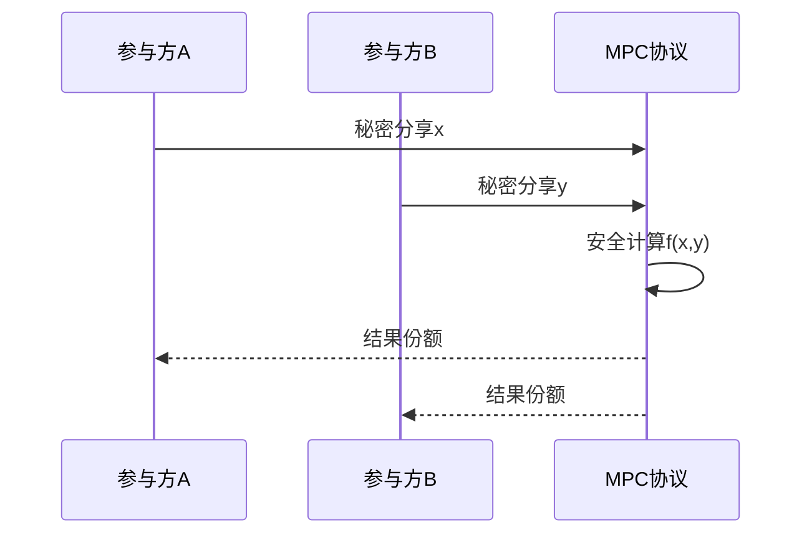

# P19 多方安全计算MPC

← [[BV1ser5BDESU-总览]] | ← [[P18-可信数据空间-连接器]] | 下一篇 → [[P20-全同态加密基本原理和应用]]

## 视频信息

| 项目 | 内容 |
|------|------|
| 分集 | 多方安全计算MPC |
| 模块 | 隐私计算核心技术 |
| 时长 | 52 分 04 秒 |
| 链接 | [B 站 P19](https://www.bilibili.com/video/BV1ser5BDESU?p=19) |
| 官方文档 | [SecretFlow 文档](https://www.secretflow.org.cn/zh-CN/docs) |
| 内容来源 | 知识点增强（数据要素流通技术体系，非逐字转写） |

## 核心要点

1. **本 P 主题**：多方安全计算MPC
2. **模块定位**：隐私计算核心技术
3. **考试/实践侧重**：MPC 定义、秘密分享、混淆电路、半诚实/恶意模型
4. **笔记层级**：教程级（约 3074 字），含速览、图解、场景 Walkthrough、自测题
5. **学习建议**：先通读「3 分钟速览」与「图解」，再读「详细讲解」；动手项见 Checklist

> 以下内容基于数据要素流通与隐私计算技术体系撰写，对应 B 站分 P「多方安全计算MPC」。**非 UP 逐字转写**；不看视频也可建立框架，看视频可对照「与视频对照表」深化。

## 本节在系列中的位置

**模块**：隐私计算核心技术 · 系列第 **P19/47** 集。

**建议前置**：[[可信数据空间-连接器]]——建立本集所需背景。

**建议后续**：[[全同态加密基本原理和应用]]——在本集能力之上继续深入。

依赖关系：政策(P01–P06) → 可信空间(P07–P08,P18) → 密态/隐私技术(P09–P24) → SecretFlow 工程(P25–P32) → 基础设施与案例(P33–P47)。

## 3 分钟速览

**多方安全计算MPC** 是数据要素流通体系中的关键一课。读完本节你应能回答：① 核心概念定义；② 在「供得出—流得动—用得好—保安全」链条中的位置；③ 与隐私计算技术栈的衔接。考试/面试侧重：**MPC 定义、秘密分享、混淆电路、半诚实/恶意模型**。

## 零基础导读

本节「多方安全计算MPC」属于 **隐私计算核心技术**。即便未看视频，也应先建立**制度—技术—场景**三层视角：政策类章节回答「为什么允许流」；技术类章节回答「如何安全地算」；案例类章节回答「真实行业怎么落地」。

第一遍阅读请盯住三个问题：本集**解决什么痛点**？**关键参与方**是谁？**交付物或能力边界**是什么？第二遍阅读时，把术语表抄到 Obsidian 双链笔记，与前后分 P 交叉引用。

## 详细讲解

### 1. MPC 定义

**多方安全计算**（Secure Multi-Party Computation, MPC）允许多个参与方在不泄露各自私有输入的前提下，联合计算一个函数。1982 年姚期智提出百万富翁问题；现已支持统计、机器学习、SQL 等复杂算子。

### 2. 安全模型

| 模型 | 假设 | 协议复杂度 |
|------|------|-----------|
| 半诚实 | 遵守协议但好奇 | 较低 |
| 恶意 | 任意偏离协议 | 较高 |
| 诚实多数 | 少于半数作恶 | 可容错 |

### 3. 主要协议范式

**秘密分享（Shamir）**
- 将秘密 s 拆为 n 份，任意 t 份可恢复，少于 t 份无信息
- 加法同态：本地加分享即可

**混淆电路（Yao / GMW）**
- 将函数编译为布尔电路，双方用 OT 求值
- 适合低深度电路

**不经意传输（OT）**
- 发送方有 n 条消息，接收方选一条获取，发送方不知选了哪条
- MPC 的基础原语

### 4. 应用算子

| 算子 | 用途 |
|------|------|
| 安全乘加 | 线性回归、神经网络 |
| 比较 | 决策树、风控规则 |
| PSI | 求交集不求差集 |
| 安全聚合 | 联邦学习梯度求和 |

### 5. 性能考量

通信轮次与数据量决定延迟。工业实践常用**专用协议**（如 3PC 诚实多数）换取性能，或 GPU 加速 OT。

### 6. 考试/实践要点

- 解释百万富翁问题的 MPC 思路
- 对比秘密分享与混淆电路优劣
- 说明 MPC 在 SecretFlow SPU 中的角色

### 7. 三方计算 3PC

诚实多数三方协议通信量低于两方；阿里云、蚂蚁等生产环境常用 3PC 折中性能与安全。

### 8. 法律证据

MPC 日志可作为履约证据；协议设计需防抵赖（签名、时间戳）。

### 9. 算力外包

MPC 可将计算外包给第三方云而不泄露输入，但需恶意安全协议；合同明确计算方法律责任与保险。

### 10. 学习与实践检查单

- [ ] 对照本 P 标题回顾 B 站视频章节要点
- [ ] 在 [SecretFlow 文档](https://www.secretflow.org.cn/zh-CN/docs) 找到对应模块
- [ ] 能用一句话向同事解释本 P 核心概念
- [ ] 识别一个本行业可落地的应用场景
- [ ] 记录与前后分 P 的技术依赖关系

### 11. 模块知识串联
本讲属于「数据要素流通技术」体系中的重要一环。建议在学习日志中标注：输入依赖（前序知识）、输出能力（学完能做什么）、与隐语组件映射（SecretFlow/Kuscia/SecretPad/TEE）。完成 47 讲后应能独立设计一个「政策合规+连接器+隐私计算+审计存证」的端到端方案，并评估 MPC、TEE、联邦学习的选型依据。

### 深化理解（多方安全计算MPC）

将本节概念放入「数据二十条」四原则框架：它主要支撑哪一条原则？若去掉该能力，哪类数据流通场景会受阻？用一句话向非技术经理解释本节价值。

## 图解

## 类比与直觉

隐私计算像**蒙眼协作拼图**：每人只看到自己那块，通过协议拼出完整图案，但彼此不知道对方拼图内容。

## 例题与场景 Walkthrough

**场景：两家机构联合建模（不共享明文）**

1. **样本对齐**：若双方仅有交集用户有价值，先用 PSI（P21/P28）对齐 ID。
2. **特征拼接**：纵向联邦（P24）下 A 方持标签、B 方持特征，梯度通过安全聚合更新。
3. **训练执行**：在 SecretFlow SPU（P27）上完成密态前向/反向，或 TEE 内明文训练（P11–P17）。
4. **模型发布**：输出评分服务；模型参数经评估后按需出域，训练数据永不出域。
5. **本集关联**：多方安全计算MPC 提供其中 **MPC 定义** 能力。

## 常见误区

1. **「学完本集就会用隐语」**：SecretFlow 生态需多集串联（P19–P32），单集只是拼图一块。
2. **「隐私计算等于不上传数据」**：数据仍以密文、份额或授权方式参与计算，网络与算力开销客观存在。
3. **「TEE 绝对安全」**：TEE 依赖硬件与侧信道防护，需远程证明（P17）与补丁策略。
4. **「区块链解决一切确权」**：链适合存证与交易撮合，大规模计算仍在链下隐私计算引擎。

## 与视频对照表

| 视频段落（约） | 预期演示内容 | 笔记对应章节 |
|-------------|------------|------------|
| 开篇 0%–15% | 本集目标、背景、与前后集关系 | 本节位置、3 分钟速览 |
| 前段 15%–40% | 核心概念定义与架构图 | 零基础导读、详细讲解 |
| 中段 40%–70% | 原理展开、对比、政策/代码示例 | 图解、类比、Walkthrough |
| 后段 70%–90% | 案例、问答、易错点 | 常见误区、Checklist |
| 收尾 90%–100% | 总结、延伸资源 | 延伸阅读、自测题 |

> 本集总时长约 **52分04秒**。无官方外挂字幕时，以分 P 标题「多方安全计算MPC」与上表主题对齐视频画面。

## 动手实践 Checklist

- [ ] 复述本集 3 个定义（不看笔记）
- [ ] 根据 Walkthrough 写 200 字场景短文
- [ ] 对照视频确认 1 个架构图/演示
- [ ] 在总览思维导图中标注本集节点
- [ ] 完成自测 Q1/Q5

## 延伸阅读

- 《隐私计算白皮书》对应章节
- SecretFlow 文档「组件」- 密码学基础
- 学术论文：FedAvg、CKKS、ECDH-PSI 原始论文摘要

## 自测题

1. **本集核心考点？**  
   **答**：MPC 定义、秘密分享、混淆电路、半诚实/恶意模型。

2. **本集在四原则中的位置？**  
   **答**：保安全的技术实现。

3. **与 SecretFlow 的关系？**  
   **答**：为 SecretFlow 提供密码学/算法基础。

4. **一项落地检查？**  
   **答**：是否有授权、是否最小必要、是否可审计——三者缺一不可。

5. **30 秒口述本集？**  
   **答**：用「输入→处理→输出」各一句话概括（见 Walkthrough）。

## 关键术语

| 术语 | 说明 |
|------|------|
| 数据要素 | 可参与社会化配置、创造价值的数字化资源 |
| 隐私计算 | 数据可用不可见前提下实现协作计算的技术体系 |
| 秘密分享 | Shamir (t,n) 门限方案 |
| 混淆电路 | Yao 协议基础 |

## 与前后分 P 的衔接

- ← **可信数据空间-连接器**（[[P18-可信数据空间-连接器]]）
- → **全同态加密基本原理和应用**（[[P20-全同态加密基本原理和应用]]）

## 逐字转写
> 状态：待转写。运行 `Tools/transcribe/transcribe.ps1 -Bvid BV1ser5BDESU -Part 19` 补充。

## 来源说明

- ✅ B 站官方元数据（`Tools/BV1ser5BDESU-full.json`）
- ✅ 分 P 首帧封面（`Tools/bili-fetch/fetch-bilibili.js`）
- ✅ **教程级增强**：含图解/Mermaid、场景 Walkthrough、自测题（约 3074 字，2026-06-06）
- ⏳ 逐字转写：B 站 API 无外挂字幕轨；可选 Whisper/BiliNote 后续补充

## 关键截图

![[../../06-资源附件/video-notes-images/BV1ser5BDESU-P19-cover.jpg|B站首帧 P19]]
