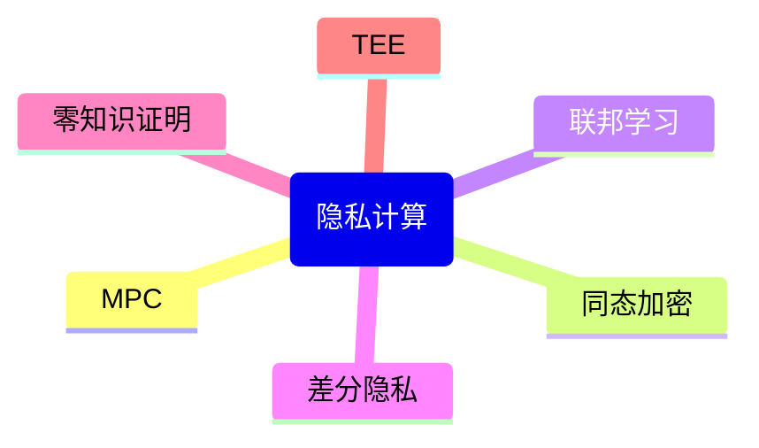

# P20 全同态加密基本原理和应用

← [[BV1ser5BDESU-总览]] | ← [[P19-多方安全计算MPC]] | 下一篇 → [[P21-安全求交和匿踪查询]]

## 视频信息

| 项目 | 内容 |
|------|------|
| 分集 | 全同态加密基本原理和应用 |
| 模块 | 隐私计算核心技术 |
| 时长 | 71 分 39 秒 |
| 链接 | [B 站 P20](https://www.bilibili.com/video/BV1ser5BDESU?p=20) |
| 官方文档 | [SecretFlow 文档](https://www.secretflow.org.cn/zh-CN/docs) |
| 内容来源 | 知识点增强（数据要素流通技术体系，非逐字转写） |

## 核心要点

1. **本 P 主题**：全同态加密基本原理和应用
2. **模块定位**：隐私计算核心技术
3. **考试/实践侧重**：FHE 原理、部分/全同态、Bootstrapping、性能瓶颈
4. **笔记层级**：教程级（约 2997 字），含速览、图解、场景 Walkthrough、自测题
5. **学习建议**：先通读「3 分钟速览」与「图解」，再读「详细讲解」；动手项见 Checklist

> 以下内容基于数据要素流通与隐私计算技术体系撰写，对应 B 站分 P「全同态加密基本原理和应用」。**非 UP 逐字转写**；不看视频也可建立框架，看视频可对照「与视频对照表」深化。

## 本节在系列中的位置

**模块**：隐私计算核心技术 · 系列第 **P20/47** 集。

**建议前置**：[[多方安全计算MPC]]——建立本集所需背景。

**建议后续**：[[安全求交和匿踪查询]]——在本集能力之上继续深入。

依赖关系：政策(P01–P06) → 可信空间(P07–P08,P18) → 密态/隐私技术(P09–P24) → SecretFlow 工程(P25–P32) → 基础设施与案例(P33–P47)。

## 3 分钟速览

**全同态加密基本原理和应用** 是数据要素流通体系中的关键一课。读完本节你应能回答：① 核心概念定义；② 在「供得出—流得动—用得好—保安全」链条中的位置；③ 与隐私计算技术栈的衔接。考试/面试侧重：**FHE 原理、部分/全同态、Bootstrapping、性能瓶颈**。

## 零基础导读

本节「全同态加密基本原理和应用」属于 **隐私计算核心技术**。即便未看视频，也应先建立**制度—技术—场景**三层视角：政策类章节回答「为什么允许流」；技术类章节回答「如何安全地算」；案例类章节回答「真实行业怎么落地」。

第一遍阅读请盯住三个问题：本集**解决什么痛点**？**关键参与方**是谁？**交付物或能力边界**是什么？第二遍阅读时，把术语表抄到 Obsidian 双链笔记，与前后分 P 交叉引用。

## 详细讲解

### 1. 同态加密层次

| 类型 | 支持运算 | 代表方案 |
|------|----------|----------|
| 部分同态 | 仅加或仅乘（有限次） | Paillier、ElGamal |
|  somewhat HE | 加+有限次乘 | BGV 早期 |
| 全同态 FHE | 任意次加乘 | CKKS、BFV、TFHE |

### 2. FHE 核心思想

允许对密文直接做加法和乘法，解密结果等于明文运算结果。关键突破是**Bootstrapping**（自举）：噪声累积后同态解密降噪，使运算深度理论上无限。

### 3. 主流方案

**CKKS**：近似算术，适合机器学习（浮点向量）
**BFV/BGV**：精确整数，适合统计计数
**TFHE**：布尔门，适合比较、逻辑

### 4. 工作流程

1. 各方用公钥加密输入
2. 计算方同态执行电路（多项式求值、矩阵乘）
3. 结果密文返回，持有私钥方解密
4. 无私钥方始终只见密文

### 5. 应用与瓶颈

**应用**：隐私集合求交辅助、密态推理、外包计算

**瓶颈**：计算慢（比明文慢 4–6 个数量级）、密文膨胀、密钥管理

**工程优化**：SIMD 打包、硬件加速、混合 MPC+FHE（SPU）

### 6. 考试/实践要点

- 解释 Bootstrap 解决什么问题
- 说明 CKKS 为何适合机器学习
- 对比 FHE 与 TEE 的信任模型差异

### 7. 开源库

Microsoft SEAL（BFV/CKKS）、HElib、OpenFHE。SecretFlow HEU 封装常用后端。

### 8. 参数选择

多项式模数度、安全级别 128/192/256 bit 影响性能与安全性，遵循 NIST 建议。

### 9. 混合方案

实践中常用「FHE 做关键小电路 + MPC 做大规模线性代数」；SecretFlow SPU 自动选择最优协议组合。

### 10. 学习与实践检查单

- [ ] 对照本 P 标题回顾 B 站视频章节要点
- [ ] 在 [SecretFlow 文档](https://www.secretflow.org.cn/zh-CN/docs) 找到对应模块
- [ ] 能用一句话向同事解释本 P 核心概念
- [ ] 识别一个本行业可落地的应用场景
- [ ] 记录与前后分 P 的技术依赖关系

### 11. 模块知识串联
本讲属于「数据要素流通技术」体系中的重要一环。建议在学习日志中标注：输入依赖（前序知识）、输出能力（学完能做什么）、与隐语组件映射（SecretFlow/Kuscia/SecretPad/TEE）。完成 47 讲后应能独立设计一个「政策合规+连接器+隐私计算+审计存证」的端到端方案，并评估 MPC、TEE、联邦学习的选型依据。

### 深化理解（全同态加密基本原理和应用）

将本节概念放入「数据二十条」四原则框架：它主要支撑哪一条原则？若去掉该能力，哪类数据流通场景会受阻？用一句话向非技术经理解释本节价值。

## 图解

## 类比与直觉

隐私计算像**蒙眼协作拼图**：每人只看到自己那块，通过协议拼出完整图案，但彼此不知道对方拼图内容。

## 例题与场景 Walkthrough

**场景：两家机构联合建模（不共享明文）**

1. **样本对齐**：若双方仅有交集用户有价值，先用 PSI（P21/P28）对齐 ID。
2. **特征拼接**：纵向联邦（P24）下 A 方持标签、B 方持特征，梯度通过安全聚合更新。
3. **训练执行**：在 SecretFlow SPU（P27）上完成密态前向/反向，或 TEE 内明文训练（P11–P17）。
4. **模型发布**：输出评分服务；模型参数经评估后按需出域，训练数据永不出域。
5. **本集关联**：全同态加密基本原理和应用 提供其中 **FHE 原理** 能力。

## 常见误区

1. **「学完本集就会用隐语」**：SecretFlow 生态需多集串联（P19–P32），单集只是拼图一块。
2. **「隐私计算等于不上传数据」**：数据仍以密文、份额或授权方式参与计算，网络与算力开销客观存在。
3. **「TEE 绝对安全」**：TEE 依赖硬件与侧信道防护，需远程证明（P17）与补丁策略。
4. **「区块链解决一切确权」**：链适合存证与交易撮合，大规模计算仍在链下隐私计算引擎。

## 与视频对照表

| 视频段落（约） | 预期演示内容 | 笔记对应章节 |
|-------------|------------|------------|
| 开篇 0%–15% | 本集目标、背景、与前后集关系 | 本节位置、3 分钟速览 |
| 前段 15%–40% | 核心概念定义与架构图 | 零基础导读、详细讲解 |
| 中段 40%–70% | 原理展开、对比、政策/代码示例 | 图解、类比、Walkthrough |
| 后段 70%–90% | 案例、问答、易错点 | 常见误区、Checklist |
| 收尾 90%–100% | 总结、延伸资源 | 延伸阅读、自测题 |

> 本集总时长约 **71分39秒**。无官方外挂字幕时，以分 P 标题「全同态加密基本原理和应用」与上表主题对齐视频画面。

## 动手实践 Checklist

- [ ] 复述本集 3 个定义（不看笔记）
- [ ] 根据 Walkthrough 写 200 字场景短文
- [ ] 对照视频确认 1 个架构图/演示
- [ ] 在总览思维导图中标注本集节点
- [ ] 完成自测 Q1/Q5

## 延伸阅读

- 《隐私计算白皮书》对应章节
- SecretFlow 文档「组件」- 密码学基础
- 学术论文：FedAvg、CKKS、ECDH-PSI 原始论文摘要

## 自测题

1. **本集核心考点？**  
   **答**：FHE 原理、部分/全同态、Bootstrapping、性能瓶颈。

2. **本集在四原则中的位置？**  
   **答**：保安全的技术实现。

3. **与 SecretFlow 的关系？**  
   **答**：为 SecretFlow 提供密码学/算法基础。

4. **一项落地检查？**  
   **答**：是否有授权、是否最小必要、是否可审计——三者缺一不可。

5. **30 秒口述本集？**  
   **答**：用「输入→处理→输出」各一句话概括（见 Walkthrough）。

## 关键术语

| 术语 | 说明 |
|------|------|
| 数据要素 | 可参与社会化配置、创造价值的数字化资源 |
| 隐私计算 | 数据可用不可见前提下实现协作计算的技术体系 |
| FHE | 支持任意次数加乘的密文计算 |
| RLWE | 格密码基础 |

## 与前后分 P 的衔接

- ← **多方安全计算MPC**（[[P19-多方安全计算MPC]]）
- → **安全求交和匿踪查询**（[[P21-安全求交和匿踪查询]]）

## 逐字转写
> 引擎: whisper | 状态: 已转写 | 格式: 段落化

### [00:00 - 00:50] 同学们好非常感谢野羽的邀请
同学们好 非常感谢野羽的邀请，能够在这里给大家做一次talk 我是陆航，今天我们talk的主题是群统态加密基本原理和应用，那我今天在给大家分享的过程当中，会分享一些群统态加密的主流算法，比方说CKS它的一些基本原理，以及有关群统态加密在落地上会存在的一些问题，那么有助于大家在日后从事这个领域更深的研究，那么打下一个良好的基础，那我用这一页来做一个开场，我们国家成立了国家数据局，国家数据局提出一个概念叫做数据基础设施，那么数据基础设施包含四个类型，分别是网络设施 算力设施 流通设施，那么最后一个是我想跟大家着重强调的。

### [00:50 - 01:35] 叫做安全设施
叫做安全设施，这个可能是我们很少能够听到的，那么我们往往说数据它的这个主要要去做的事情，对数据做的事情，就是如何让它高兴冷的计算，那如何让它流通起来，那么但是安全，就是我们往往比较忽略的一个方面，那么国家数据局那也明确提出安全基础设施，也是数据基础设施非常重要的一个组成代源，那么安全基础设施它的一个主要职责是什么，就是用一些能够互诱数据安全的一些技术，比方说我们今天想要给大家分享的，全东太加密技术，还有比方说可信执行环境，还有比方说联邦学习，还有独方安全计算等等，这样的技术能够保证数据在流通的过程当中，绝对的安全。

### [01:35 - 02:24] 实现数据的流通的可用不可见
实现数据的流通的可用不可见，可算不可得这样一个目标，所以呢，这是数据的安全已经上升为我们的国家战略，包括国家数据局也专门去成立了一些这个机构，来去制定数据安全的一些标准，这都是对我们数据安全的一个重大的利好，好 那这一页是我从这个2022年，中国芯片大会，一位这个这个PNote的这一位专家，他的一个PPT上去解决下来的，那么从这一页上，那他是来自工业界的一位专家，那从这一页上我们可以看到，那么工业界已经普遍认为安全和隐私问题，已经成为了制约云计算发展的一个最大的障碍，那么也普遍一致认同云计算只有进入密态。

### [02:24 - 03:14] 才有可能最终解决用户的安全顾虑
才有可能最终解决用户的安全顾虑，那这里面我想跟大家提一点，这所谓进入密态，这个密态指的是什么，那我们今天给大家分享全通态加密，对不对，那么全通态加密，他主要的这个思想是把数据进入密态，是把数据通过加密的方式，让他看不见里面的明文，那么计算的时候，也是完全在密文下计算的，所以这里面的密态，我刚才所说的这种全通态加密，他的一个密态指的是数据加密以后，那么在密态下来进行计算，是这种密态的一个含义，那么同时，这个密态在这一页PVT里面，在这一页截图里面，他的这个意思可能略有不同，他指的这个密态是也可能是明文，但是我只要触碰不到这个明文。

### [03:14 - 03:59] 或许不到这个明文
或许不到这个明文，他就是处在一种保密的，或者说机密的状态之下，所以这里面我想跟大家说这样一个概念，那么现在我们说数据，所谓密态计算可能有两种，一种是以可信执行环境为代表的机密计算，那它也算是密态，一种是以全通态加密为代表的密态计算，那它俩有本质的不同，那么核心执行环境是在明文的情况之下，通过我们计算系统的软硬件协同起来，保护明文在计算系统里面安全的执行，比如说我可以通过隔离的方式，把他的计算环境和其他，我不可信的应用隔离开，那这是所谓的一种密态，而我们今天所要分享的是另一种密头，通过一些密码学的一些算法，比如说全通态加密算法。

### [03:59 - 04:46] 把数据实现加密
把数据实现加密，我可以在加密以后，让任何人接触不到里面的明文，也破解不出里面的明文，这是另一种密态，它的一种表现形式，也是我们今天主要的分享的一个方面，好那么刚才已经提到了，我们这种密态是基于现代密码学的，一种数据保护，它可以工作在不可信的硬件上，也就是说你计算机上有很多，恶意的程序想要去获取你的，这个想要保护的信息，但是我们一旦通过全通态加密的方式，把它加密起来，那就是绝对安全，我也可以运行在这些不可信的硬件上，也可以和一些不可信的应用，一起运行在计算系统上，那么忽悠这种数据绝对安全状态之下的，加密算法，加密还能够计算的算法。

### [04:46 - 05:40] 就叫做全通态加密
就叫做全通态加密，它最核心的一个特色，就是在密文域上可以进行任意的计算，那么这个任意的计算，可能让你觉得有一点奇怪，可以进行什么样任意的计算，那么实际上我们情况下加密，它是只支持密文状态下的惩法和加法，但是我们学过泰勒吉术对不对，那么惩法和加法这种现行计算，可以擬和一切非现行的计算，所以这里面就是所谓的通过惩法和，在密文下进行惩法和加法的计算，来去实现任意的非现行的计算，好 那我看这页图，明文域它指的是有两个明文，一个是A 一个是B，通过全通态加密的方式，把它加密为密文A和密文B，在密文域上我们可以做密文的计算。

### [05:40 - 06:35] 那么这个F就是我们在密文下
那么这个F就是我们在密文下，所做的任何计算，比如说我可以做一个神经网络的，ReLU这个函数对不对，那么通过多样式的，通过密文的乘客家，这里面有多次提到多样式，是因为我们加密以后，它就会变成一个多样式，这一会我们再详细的去讲解，那么通过密文下的计算，去实现任何F它的一个计算，那么计算完了以后，得到了一个密文的结果C，在对C进行解密以后，得到实际的明文计算的，在F下计算的结果是一模一样的，这样一个效果，所以我们可以看到，如果我们的明文是我们的隐私数据，那么我把它发送到云端，在云端上做一些保护隐私前提之下的，一些计算，然后再把计算完了结果。

### [06:35 - 07:27] 以密文的形式返回
以密文的形式返回，那么在我们的本地把明文再解密出来，所以在整个传递的过程当中，明文是没有任何泄露的，只有在本地才能够解密出，它实际的明文结果，所以这就是它最大的一个好处，那么成功态加密它的一个发展，经历了这么几个阶段，实际隐私同态的概念，是早在1978年就提出来的，北极升阶陆这个发展，就是提出极升阶陆这样一个，北极升阶陆的创始发明，它的时间上还是差不太多的，都是在70年代，那么都是一个非常年轻的学科，对不对，那么在90年代的时候，出现了半同态的算法，半同态就是说我们在F的计算的时候，只能是加法，在密文状态下做加法。

### [07:27 - 08:11] 那么结果是返回以后结果是解密以
那么结果是返回以后结果是解密以后，和明文结果是一致的，只能做加法，在密文状态下做加法，那么结果是保持一致的，那么不能做其他的运算，那么全同态指的是，刚才我也提到过，在密文状态下做加法和乘法，而且是任意次数的加法和乘法，那么都可以结果保持一致，所以如果能够做惩罚和加法，那么它理论上就可以支持任何计算，对不对，因为任何的这个非信心的计算，都可以通过乘和加来进行理合，比如我刚才提到的胎乐技术，就是做这样一件事情，那么全同态，刚才已经说了，可以在密文状做任意次数的加法和乘法，那么它的算法发展，也经历了这么几个阶段，比如说在2012年。

### [08:11 - 09:01] 首先全同态的概念是根锤
首先全同态的概念是根锤，是我们这个算法，它的一个发明人，或者是太斗级的人物，我还记得之前，有人评论说能够看懂，干脆的毕业设计论文，全世界的没有几个，所以是非常有意思的一个事情，那么2012年的时候，出现了基于整数加密的，驱动态加密的算法，也就是说我想，把这些刚才我提到的这个，明文给它加密，那么明文只能是整数，好，那么2015 2016年，出现了FHE，W和TFHE这样的算法，那么它是加密一个比特，比整数的这个力度要更细，加密一个比特，那么一个比特，一个比特的这种加密，那么它是可以理解为，是布尔形对不对，比个比特，它是布尔形的全同态加密算法。

### [09:01 - 10:11] 2017年出现了CKS
2017年出现了CKS，那么CKS是可以加密，相比BFHE的BGV，它更先进一些，它可以加密这个实数，实数就有小数对不对，比如说一个实数，一个小数，比如说加密个2.4，也可以加密-5，那么-5就比如说1加2i，一会我们看一个例子，那我也可以通过，全台加密的CKS的算法，来进行加密，那么BFHE BGV，以及CKS，我们可以统称为这个，数值型的，或者算数型的，算数型的全台加密，所以我们全台加密算法，往往分为两类，一种是算数型的，一种是布尔型的，那么全台加密它的作用，非常的大，那么它也在工业界，也起到了非常重要的，隐私保护的作用，那么这里面就简单说一下。

### [10:11 - 11:01] 那么如果一个云服务的提供商
那么如果一个云服务的提供商，可以确保，比如说对你来承诺，我可以保证你的数据，绝对安全，那我可以去完全信任它，对不对，所以可以降低信任成本，而且处在全部的，密闻计算的前提之下，我也不用去额外的，去做什么安全的设施，安全的技术，去再进一步的保证，因为它所有的计算都在密闻，看不见明闻，所以我可以降低，我的安全保护的成本，对吧，所以它的好处是很多的，那么它的使用场景，简单提一下，比如说我做一个，人脸的识别，那比如说现在我们蚂蚁，也就是银语所在的这个蚂蚁集团，它就有这样的需求，那我想对用户的一个，一个使用习惯，做一下推荐，那我就可以把用户的，这些使用习惯。

### [11:01 - 11:44] 做一下这个加密
做一下这个加密，因为这是属于你的隐私，那么把这个加密以后的数据，发送到云端，我们做一个密泰下的一个推荐系统，做密闻下的一个推理，那么给出你可能会，喜欢的一些商品的信息等等，那再比方说，我们在这个刷脸支付的时候，那么人脸属于你的敏感息息，对不对，那么把人脸息息，用群能态加密的方式做一个加密，那么也就是说，我传递到云端，我是看不到你的人脸，然后呢，在他的数据户里边，人脸对应你的账户，对不对，那我可以在密泰下，进行一个对应账户的一个查询，那么从而实现扣费，在密闻下，直接密泰下，直接进行那个支付的一种扣费，这过程当中，被任何人结合，都看不到你的人脸的明文的信息。

### [11:44 - 12:34] 对不对
对不对，所以这也是非常有用的一种，这个场景的应用，好，那么我们在具体讲，他的算法之前，我们先看一个例子，那么这里面我要提一句，就是我在接下来讲，这个方面算法的时候，我避免采用这种，比较八股的方式，来给你一味的去，讲解每一个公式，它到底是什么意思，避免采用这样的方式，那么我们会通过一个例子，来让你直观的看到，这个群能态加密算法，它到底是怎样来进行工作的，那么我所举的这个例子，就是PIR，这个PIR它的意思是，也逆查询，或者也叫密探查询，或者也叫逆中查询都行，它的一个主要思想，是在把你的检索的，要查询的相量，比方说是你的人脸信息，或者你的身份信息。

### [12:34 - 13:21] 把这个信息加密
把这个信息加密，然后到云服提供商的数据库里边，在密探下，去把你要的信息，有关于你的信息，给它检索出来，所以是查询的过程当中，看不到查询的人是谁，对不对，那么查询的，被查询的方也看，被查询的方，看不到查询的人是谁，那么查询的方，也看不到，除了你要查询的东西以外，其他被查询的方，有的其他数据，那也看不到，所以对双方来说，都是数据安全的，也说你只能得到，你要的结果，对吧，那么被查询的方，也看不到，你要查的东西到底是啥，所以双方，都是一个保密状态下的，一个查询，那么查询这种状态之下，还能够查询到，你想要的结果，所以这叫密态查询，好吧，这里面密密麻麻的文字，留给大家做参考。

### [13:21 - 14:11] 好那我们看一下
好 那我们看一下，基于情侣态加密的密态查询，如何形式化，如何进行构造，那么假设，被查询方的数据库里面，有2048条数据，2048条数据，而你要查询的，所以它是一个敏感数据，也就是需要，对它进行全同态加密，那么，目前你所看到的这个，所以它是一个名文，是为了让大家能够清楚的看到，这里面有什么内容，如果变成密文的话，你就不知道里面是什么了，这就是它加密以后，就把数据给隐藏了，所以这里面，我通过这个，所以把它变成，明文的形式，来让大家更好的理解，到底是怎么查询出来的，比方说，你这个数据在没加密，所以在没加密之前，它的一个值，是一个one halt的。

### [14:11 - 14:59] 所谓onehalt
所谓one halt，就是说，我要只有一个数据是一，那么这个一代表的是，第二个，我要查询的这个条目，简单的一个sample，那么其它是零，就代表，我是不需要知道，其他人的信息的，我只需要知道，在你的数据户里边，第二条，也就是说我们这里面，第一，这样的一个数据，把它想要查出来，那么，这个如果把index加密，那么在被查询方，它不知道要查的是，第一这一列，对不对，就是它比较好的地方，能够保护这个，查询方，它自己的index，保护这个，所以，在明文状态下，我现在知道了，我要查询的是，第一这一列，因为第一，在index里面，它代表的是一，是one halt的，我怎么去查询出。

### [14:59 - 15:56] 第一这一列呢
第一这一列呢，这里面，首先要把index，进行编码和加密，我先说一下，它的大概的一个流程，之后，我们再详细的去看，怎么编码怎么加密，那么，首先我肯定要把，index进行编码和加密，那么加密，它变成密文，对不对，编码给它编码，成一个多相式的形式，而不是原始的这样，明文的香料，对不对，把它编码成一个，多相式的形式，然后对多相式，进行加密，之后，我们再详细的去，举个例子，再去讲这个问题，好，那么，第二个，就是，这个，被查询方，它要把它的自己的，这样一个数据库，要进行一下重新的变形，那么方便，通过，密探查询的方式，把第一这一列查询出来，因为我在被查询方，所要变形目的，就是为了让，查询方。

### [15:56 - 16:45] 能够在密探的情况之下
能够在密探的情况之下，能够方便你做一个查询，能够构造出，你能够在密探下，查询出来的，这样一种，数据库的，数据的形式，那比方说我们把，所有的数据，有2048，这样的条目，那么每一个条目，可能也是一个2048行，或者说我把这个矩阵，定这个矩阵，变成一个，2048行，2048列的一个矩阵的形式，这样可能说起来，更方便一些，那么我们首先，对它进行对角化，那么所谓对角化，就是按照对角线，把数据取出来，那么比如说，我们这个正好，是一个2048行，2048列的，那是这样一个方证，对吧，那么正好每一条数据，每一个条目，也是有2048个数据，我们通过对角化的方式，把每一个列，它的数据，都。

### [16:45 - 17:36] 把每一个对角线上的数据
把每一个对角线上的数据，都变形为，每一个列的数据，举证的每一列，所以你看，如果是绿色的，代表的是，这个举证的，主对角线，对不对，再一个弄，那么，蓝色的，就代表的是，它的临近的，第二个对角化，对第二个对角，是，不和它比0的，这条对角线上的，它的一个数据，那这里边可能会，以后可能会有疑问，这里边不是少了一个吗，少一个，把这个D0，这一列的，比如说D2047，对不对，D0，2047，这一列，作为这个，蓝色的它最后的，这一个数，这里边没有写出来，也说如果不够的话，我从这左边，这边去取，比如说D2，这一列，少两个数，那就是它和它，对不对，这个准确的说，这个位置和这个位置，不是D03，这个位置。

### [17:36 - 18:26] 这到处第二个数
这到处第二个数，和D1这一列的，到处第一个数，对不对，对角化了以后，相当于我，我举证做了一下变形，那么变形完以后，又要怎么办呢，比方说，这个时候我要把，D1这一列的，所有数据查寻出来，如果是明稳的话，那我不用做什么变形，对不对，我直接把D1拿出来就行，因为我知道，你要查的是D1列，那现在我们D1，这个索引，这个，都是加密的，比如说index，我用这一列来表示，每一个数都是B0，都用B来表示，比如说D1的数B0，它就等于0，对不对，B1等于1，B2等于0，B3等于0，所以现在的问题就是，我，这里面所有的B，我是看不到，所以我必须通过，一定的构造，能够方便让查寻方法。

### [18:26 - 19:30] 这个D1这一列
这个D1这一列，给它查寻出来，好，现在我要做的一件事情是，把索引和我变形以后的，每一个列，进行同态惩罚的运算，同态惩罚的运算，指的是，每一个点，它的，每一个索引的，每一个位置，每一个对应位置相乘，那我们还是，假装我们知道明稳，比如说B1等于0，B0等于0，B1等于1，那么它俩相乘完以后，得到结果，那大家一看就知道是什么，那么，这一项就是0，对不对，因为B1等于1，那么这一项，它就把它检索出来了，对不对，这一项保留，那么后边，这些都是0，对不对，所以你发现，通过对角化以后，我和索引，来进行相乘，是密台下的，所以我不知道，我要查的是哪一个，但是，反映到明稳上，假装，我知道。

### [19:30 - 20:20] B1是我要查的
B1是我要查的，那么这样的计算，你会发现，我把我要感兴趣的那一列，就是第一这一列，我就可以给它查讯出来了，对不对，好 接下来要做的一件事情，第三个步骤，旋转，那个旋转指的是，对于索引来进行旋转，原来我们B0，是在这个index的，第0个位置上，现在我要把B1，放到第0个位置上，那么B0去哪，旋转之后，到下边了，对不对，一个循环到下边了，到第2048个位置上，对吧，所以旋转以后，再一次和第2列，来进行相乘，这时候你发现，第2列正好是，第10所在的位置，和B1，抽完等于1的，对不对，把第10给它取出来了，刚才是把第1，这一个给它取出来了，现在是把第10给它取出来了。

### [20:20 - 21:03] 然后取出来之后
然后取出来之后，那么其他的自然都是0了，对不对，因为B2 B3 B4，都是0，对不对，然后你看，我把我感兴趣的那一个元素，在它的被查詢上的数据库里边，把这个条目就给它查询出来了，那么同样再旋转，那这时候发现，你发现B1看不见了，对不对，那B1到哪里去了，旋转到最下边的位置上，对不对，那么如果你仔细的去，再思考一下，你会发现，我们旋转到，最下边那个位置，实际就是我们，第1的什么，2048那个位置，对不对，第1 2047，那个那个纸，也是第2048个，第1的纸，那个位置，所以呢，他们在做相乘，正好把最后一个数也取出来了，好，这里面你看，我取出来的是，通过这样的一个运算。

### [21:03 - 21:57] 我取出来的是
我取出来的是，第10 第11和第1 2047，其他的所有的数都是0，对不对，是不是，好了，那，这个是怎么得出来的呢，我把每一个，我感兴趣的D，取出来以后，把他们再做，同态的加法，对不对，你想同态的加法，我们虽然看不到，密台下，他是怎么样去做的，但是明文的状态之下，那我把第1取出来了，剩下都是0，对不对，这个我把第10取出来了，剩下的都是0，这个我把第1，2047取出来了，剩下的也都是0，那么他们相加，自然就是，我画，红框的，这样一个相量结果，对不对，好了，那这只是其中，我举的例子的第1组，好，那么，我们把所有的，经过举证，对角化以后的，都按照这种方式，去和，所有，以及旋转以后的。

### [21:57 - 22:47] 所有进行相乘
所有进行相乘，把得到的结果，所有的都加起来，那我就会得到，所有的，和第相关的数据，对不对，希望这个过程，我给大家讲清楚了，那这里面，你会发现，我们做这样的一个例子，特别麻烦，对不对，本来是一个很简单的，一个查询，但在密台下，我就要做这样一个，复杂的一个过程，它需要经过这么几个步骤，总结一下，上一页的，编码加写完之后，和这个，被查询方的数据相乘，成完之后，旋转，对不对，称一次，称一次，旋转之后再同态加，加完的结果，比如说，是一个密文，对不对，这个密文就是我要查询的结果，我再返回给查询方，查询方要做，解密和解码，对吧，最后得到，第的实际的名文纸，这是他要查询的纸，在这个过程当中。

### [22:47 - 23:39] 你会发现
你会发现，被查询方是不知道，是这个查询方的索引的，因为所有的这里面，B0,B1,B2,B3，都是加密的，只不过是为了，方便大家理解，所以我把它这里面，放到假装里知道名文，对吧，然后查询方，除了查到第1，这一列，也就是他感情的纸以外，其他所有的，第2,第3,第4，他都查不到，对不对，所以这是一个，非常简单的，两方进行，密态查询的这样一个例子，这里面涉及到的，所有的同态，下载运算，我们接下来，会逐一的来讲解一下，那么我们用的算法，就是CKS，这样的算法，好,我们看一下，CKS的基本语言理，那么这里面，涉及到很多公式，那么我会用，非常让大家，亦理解的语言，去讲解，那么大家。

### [23:39 - 24:37] 如果对这里面的符号
如果对这里面的符号，有些不是很清楚的，那么可以自行，去查阅相关的文献，那么我们首先看一个，编码和加密的，这样的一个步骤，首先，算法，不管是什么样的算法，都是有它的参数配置的，比如说这里面，我要配置的是一个，这么几个参数，举个例子data，它代表的是缩放的大小，再比方说n等于4，这里面表示的是，我们加密以后，密文的多项式，包括编码以后，明文的多项式，它的最高次数，就是3次方，也就是说，不超过4，对不对，多项式的最高次数，是3次方，好，多项式，次数是3次方，那么它一共有多少个系数，有4个系数，对不对，比方说我这里面写一下，比如说a0加a1x，加a2x平方，加a3x的3次方。

### [24:37 - 25:36] 这里面一共有4个系数
这里面一共有4个系数，对不对，所以这n等于4，叫多项式的degre，degre，好，那么这里面，我们看一下，首先我们要做的一件事情，是，比如说我们要，编码和加密，两个项量，这也简单一个三谱，是3加4i和2-1i，刚才我们说，cxs是可以针对，时数的，也可以针对复数的，对不对，好，那么3加4i和2-1i，好，我们对它进行，编码和加密，这是第一步，把它编码为一个，明文的多项式，在编码为多项式以后，再对它，这个明文的多项式，进行加密，这是我们，要做，这个cxs，进行，密探查询的第一步，对不对，不管是，做什么样的运用，这都是第一步，好，那么我们怎么样，对它来进行编码呢，首先取，84本源单位根。

### [25:36 - 26:40] 这里边有一个概念
这里边有一个概念，这里面还是那句话，对不对，为了避免，然后大家觉得很复杂，那我画一个图，你就知道，什么叫本源单位根，比如说，画一个图，所谓，单位根，它的意思，比如说这里面，我取84的单位根，先不管本源，那么84单位根，指的就是，把一个圆平均8等分，对不对，那8等分，已经是这个了，对吧，我画的这个每一个点，8等分，1 2 3 4 5 6，对不对，画错了，1，1 2 3 4，这个，1 2 3 4 5 6 7 8，没错，是吧，是8等分，好，这个，我们看一下这个，8等分，它比如说这里面是，这个，可 c 0，这是可 c 1，就在这个点上，这是可 c 2，然后一直到可 c 7，对不对，8等分，那么所谓。

### [26:40 - 27:35] 84本源
84本源，这8个值，都是它的单位根，对不对，我们学过这个，单位源上，级等分，那么，本源单位根指的是什么呢，这里边跟的这个编号，跟的这个编号，和8互置的那些，你就记住这一点就可以，互置的那些，比如说1，当然1和8互不互置，也算，对不对，因为它们之间，互置的意思是什么，只有公银子是1，对吧，所以互置，3互不互置，互置，5互不互置，7互不互置，对不对，所以和8不可约的，它们是互置的那些根，所以你就记住就行，所谓取它的8次本源单位根，那么对于两个数的时候，取它的8次本源单位根，那么，如果是，我们要编码加密，4个明文的数，需要几次呢，留给你做参考，留给你做思考，好吗，好，那么你只要记住。

### [27:35 - 28:35] 这里面取的是
这里面取的是，如果是，这个Degrease 4，只能，编码和加密，两个数，同时我们要用，8次本源单位根，这是我们需要的，那8次本源单位根，一共是几个，4个，对不对，分别是以8互置的，那4个数，好，那么接下来我们编码，编码是把一个幅数相量，把它编码到一个，整数多项式上，好，那么这里面，复杂的一个符号，比如说，这是什么意思，对不对，我先不讲，可以吧，然后我们，看看它的直观步骤，再来对它进行理解，先知道它步骤都是怎么做的，首先我们把一个，编码的，要编码的实数，就我们这里面的，3加4i，和2-1i，把它进行扩展，这个扩展，在我们CxS的论文，原文里面叫做，硬设，这个硬设是，PineZ。

### [28:35 - 29:28] 这个硬设
这个硬设，但是你不理解，这个概念没有关系，我们先知道，所谓的扩展，就是把两个数变成，怎么把它，有两个数变成四个数呢，就是把两个数，由幅数，扩展为它的，共恶幅数，比方说3加4i，后面就3-4i，2-1i就是2加1i，那如果是实数呢，比如说这是2，这是3，那我把它扩展怎么扩展，再写一遍，倒着写，这是3，这是2，懂了吧，所以这就是，第一步，把它进行扩展，第二步，进行这个，缩放，这里面用我们的，缩放因子data，来进行缩放，这里面对于，有些不了解CKL的同学，可能，或者不了解全国泰加密的同学，可能不知道，为什么要进行缩放，缩放的意思是，让它能够保持一定的精度，你先记住我这句话。

### [29:28 - 30:18] 之后我们在看到的时候
之后我们在看到的时候，我们再来，详细的去解答这个问题，那么缩放，比如说我们的data，取的是64，这是我们预先设定好了，缩放的因子，缩放的参数，这个值都乘以64，那就得到这个，缩放以后的，它的，我要编码的这四个数，其中主要的是前两个数，对不对，后两个数是它的功额，那接下来，这个编码的过程，它就是一个叫，叉值的过程，叉值过程具体是做什么，那么我们首先，把我要编码的这四个数，扩展以后的这四个数，把它变成多相式的，四个，得到的结果，四个值，那比如说，它将是按照如下的这种方式，来进行构造，对吧，那么这些可c，就是刚才我们所说的，所谓的它叫，本源单位根，对不对。

### [30:18 - 31:13] 一共是四个本源单位根
一共是四个本源单位根，分别是可c，可c的三字方，可c的五次方，可c的八次方，sorry 七次方，好了，所以我把它，带入到我们的，多相式里面，a0加a1x，加a2x的平方，加上a3x的三字方，我们把x，分别用这四个值来进行，带入，那我肯定会，得到四个结果对不对，那么也就是说，我们编码的过程，就是通过，这四个根，以及，我们要编码的这几个数，反过来，求这个多相式的，系数的过程，对不对，好了，那我把它用这种，矩阵的形式，来予以展示，那么你会发现，这就是两个矩，就是一个矩阵，乘以一个相量，得到另一个相量的过程，好了那接下来，我就可以根据，矩阵求逆的方式来求得，这些，这个a0。

### [31:13 - 32:02] 一直到a3这四个数
一直到a3这四个数，对不对，所以呢，我们利用，这个矩阵的性质，来进行求值，那么求值的过程就是，我们利用这个，这个矩阵，把它求逆的这样一个，预算的法则，把它求逆，因为我们知道，所有的sata，对不对，所以我们就可以求逆，求完逆以后，我们利用这个，翻得蒙矩阵，那么整个这个矩阵，翻得蒙矩阵，大家知道一下就可以，那么利用，翻得蒙矩阵的性质，那么求逆的过程，它就可以等一下，为这样一个过程对不对，好了，那么万事俱备，我们就可以求得，a0到a3的值，就是这四个数，你会发现，如果我们把它扩展，成共恶以后，那么，它本身就有一个，非常好的一个特性，就是最后你求得的，这个a0到a3。

### [32:02 - 32:54] 它就是一个整处
它就是一个整处，不再是复数了，这是为什么，我们要之前把它，通过共恶的方式，来进行扩展，这个道理，好，那么再进行取整，得到的整数系数，是这四个系数，好，这个就非常简单了，对不对，所以最后得到，编码多样式，就是它，好，那么如果你把，这个c，这些根，四个根，分别带入进去，你发现，就是这四个值，我们同学们，可以自己去自行，验证一下，对还是不对，好了，那么接下来，编码完了之后，我要进行加密，加密是非常有讲究的，大家提一点，就是加密的，这个过程当中，是需要保证，一定的安全性，因为你加密的目的，就是不被人破解，对不对，那么同态加密，里面有非常重要的，一条，就是保证，它的安全等级，比方说，有128比特安全。

### [32:54 - 33:45] 好
好，192比特安全等等，这里面，我们只要保证，128比特安全，就相对来说，是比较安全的，所以一般，我们在论文里，或者是在，实际应用当中，就，大家都是保证，128比特的安全即可，那所谓128比特，它的安全指的是什么呢，就是你在2的128四方，这样的时间之内，你是破解不了，它的明稳的，所以这个时间，已经足够长了，所以你在这么长的时间之内，你是破解不到里面的明稳的，所以就足够能保证，它的安全性，好，那我们怎么能够达到，128比特的安全呢，这个图就给了你一个参考，这个图，它的意思就是，这个，Degre，也就是这个N，这个N，可以是，因为你要编码数很多，对不对，所以刚才我们举的例子。

### [33:45 - 34:36] 是两个数
是两个数，那如果要编码，大概，8000个数，对不对，或者编码什么，1万个数，那我这个N，应该取得多大呢，对不对，你就可以知道，至少要保证，它乘2的大小，对不对，比如说我要编码，16384个数，对吧，那我肯定，这个N，要取32768，这样一个横轴的位置，要保证它在，128比特的安全性，保证之内，那么我们，密文一下的，密文的魔术，要取多少呢，那一定是在这个，这条直线的，向下这个区间，比如这个CQ的区间，所以你发现，它密文的魔术，最大可以取到，800多个比特，对不对，这个图率，可以给你们一个，确的体现出来，好，所以你要保证，它128比特的安全性，前级之下，你来确定N和Q，那么这个N就是。

### [34:36 - 35:26] 多样式的Degre
多样式的Degre，刚才讲到了，那么这个Q是什么意思，就是密文的魔术，这个Q，所以LOGQ，就是多少个比特，二个多少次方，对不对，好，这里面我们举的一个例子，很简单，这个Q很小，就是65537，很小，那么Q一般是，取是一个质数，或者叫速数，对吧，大家都知道，也就是说我们在，每次进行多样式，运算的时候，密文，它的多样式，加密以后，这个密文的魔术，那也就意味着什么，你在每次运算完结果之后，都要，把每一个系数，对这个密文魔术的，进行取魔操作，好，那么，我们具体看这个例子，比如说我们，明文多样式，是这样一个，结果，刚才已经得到了，好，那么我们取私要，这是我们加密的密要，然后造声。

### [35:26 - 36:20] 然后造声是为了
然后造声是为了，怎么样，在这个，因为我们全台加密，是采用这种，隔极密码的方式，对不对，那么造声加到，我们的这个结果里面，它就会，增加这个破解的难度，这个我不详细展开讲了，那么这里面，这个造声多样式，实际多样式，那么是它的一个叫，研码，对吧，就是我们，在密码学里边，经常说的研码，好，那你发现我们的加密，实际上操作起来，非常简单，就是由负的，AS加M加E，那么M就是我们这里面的，明文多样式，那么S，就是我们的私要，对不对，A就是研码，加上一个造声，来增加它的安全性，好，那么得到一个结果，B，那么多样式你发现，这密文多样式，它都是成对出现的，那么我们加完密以后，原来的一个M，明文。

### [36:20 - 37:18] 现在变成了一对密文
现在变成了一对密文，或者说一个密文，里面有两个多样式，分别是B和A，主意要模Q，它的系数，必须小于6537，好，那么在编码加密以后，我们接下来要做的事情，是同态惩罚，同态惩罚，包含两种类型，一个是密文，明文成，皮帽子，一个是密文，密文成，好，那么密文，明文成，那么，它相对操作来说，比较简单，那么刚才我们说，C是一个密文，密文包含两个多样式，一个是B，一个是A，那么M，是另一个明文，那么他们之间，做惩罚，就直接两个多样式，分别相乘，就可以了，好，那么结果，MPMOT，它的结果，你在进行解密以后，发现它的结果，和两个明文成的结果，是一致的，所以这个相对来说，比较简单，接下来，密文密文成。

### [37:18 - 38:14] 密文密文成
密文密文成，是，假设用同样的CLS，所加密的，两个密文，一个是C1，一个是C2，首先，你一定要确保，注意一点，模术一定是一样的，在同一个模术之下，你才能做，密文密文成，记住了吗，好，那么密文密文成，它比密文密文成，就要复杂很多，那么密文密文成，它会得到，三个多样式，这是为什么呢，比方说我们C1，它是由B和A1组成的，C2是由，C1是由B1A1组成的，C2是由B2A2组成的，那么他们之间相乘以后，那么根据我们，多样是惩罚的预算法则，你会发现，他们惩罚以后，会多出来一下，所以我们分别用，D0,D1,D2来进行表示，对它进行解密，也会多出来密要的一个，另一个密要。

### [38:14 - 38:59] 那么就是s方这个密要
那么就是s方这个密要，那么你对它进行解密，分别用s和s方，按照这种方式来进行预算，你发现结果就是m和m，对吧，所以正确性是得以保证的，但是这里面有一个，问题，就是每一次相乘以后，密闻的维度，就会增加一个多样式，对不对，乘一次增加一个多样式，再乘一次，又增加一个多样式，所以就意味着，你要解密用的密要，也会增加，对吧，原来是只有一个s，现在你要用s，s方，s三四方等等等等，所以，那么也就是说，你密闻做惩罚，你要做多少次惩罚，你就要有很多个密要，来进行解密，所以这个过程非常的麻烦，对吧，密要的存储，等等，开销，所以这个怎么办呢，所以在CVPS的。

### [39:02 - 39:53] 它的一个论文里面
它的一个论文里面，或者它这个算法里面，就提出了一个，叫重现性化的一个概念，所以我觉得，这是我们CVPS的算法里面，非常精彩，非常巧妙的一个地方，那么我们怎么能够，把第二这一项，给它消除掉，把它揉到，第零和第一这两项里面，那么最终，我就可以用一个密要，s来进行解密就可以了，好 那么具体怎么做呢，我想实现重现性化，要有一个辅助密要，也有人管的叫，重现性化密要，叫EVK，EVK注意，这里面它的大小，是在PQ的范围之内，所谓PQ，那么它的魔术就不是Q了，而是在PQ的范围之内，它的魔术更大，这里面为什么多出了一个P，就专门是为，这种重现性化，所额外引入的，另一个大魔术。

### [39:54 - 40:38] 好那么我们看
好 那么我们看，整个这个BPR，APR，分别是怎么计算的，那么BPR APR，分别是在PQ范围之内的一个，特别大的一个数，你可以想象一下，非常非常大的一个数，好 那么，我们把s方，用s来进行加密，那么它的加密方式，就自然是这样，想一想，这个加密的方式，是不是和我们对明文加密，它的做法是非常的相似的，非常的similar，对不对，只过把这一下，原来我们是m嘛，这一下变成P乘以s方的，相当于对P乘以s方这一项，用我们的s来进行加密，好 加密完以后，得到一个BA，就是我们的重现性化密钥，辅助密钥，好 那么我们做，重现性化的过程是怎么样子呢，对于第二这一项。

### [40:38 - 41:30] 乘以重现性化密钥
乘以重现性化密钥，再乘以P的Ni，因为这里面，乘了一个P，这里面乘了一个P的Ni，是为了把它还原回来，好 那么我们再看，具体这样做的结果，它的正确性怎么样进行保证，好 那么比如说，我们对于这一项，把它放到这里来，那么PNi乘以D2乘以EVK，对不对，这是我们原始的密钥s，它们之间做内机，看看是不是能够得到，D2s方这一项，如果能够得到D2s方，那它的结果和之前的结果，就是一样的 对不对，好 那么我们PNi乘以D2B，把它展开 对不对，做内机，内机就是把它直接，做成绩球合，把它展开，然后呢，再具体把这个B皮，进行展开，得到是这一项 对吧，好，然后呢，加上。

### [41:30 - 42:29] 这一项不变直接过来
这一项不变直接过来，对吧，好了 那么把它再进行运算，这里不详细讲解了，得到结果就是s方D2，加上PNi乘以D2，再乘以一个E，好 你会发现，这里面PNi和D2相比，D2是在什么范围之内，D2它是属于，R Q，这样一个范围之内，它是摩Q的，对不对，那么P，往往取约等于Q，好 那么所以，D2这一项和P，基本上是在同一个大小，对不对 基本上是在同一个大小，所以D2和PNi，基本上就相互抵消掉了，只剩一个非常小的一个噪声，约等于s方D2，看到了吧，所以在重新进化的过程当中，会引入噪声，但是噪声引入的很小，所以约等于原来的这一项，就是保证了它的一个正确性。

### [42:29 - 43:20] 好了那这里面就是
好了 那这里面就是，重新进化它的概念，好 那在重新进化以后，同态成的最后一个步骤，就是重缩放，重缩放它的作用，就是减少密闻中存在的噪声，在操作层面上，它非常的简单，就是在相成以后的密闻的技术之上，除掉我们最开始那一页，所设置的一个缩放音子，起到减少噪声增长的一个目的，那么在操作层面下，就是C除以一个data就可以了，非常的简单，好 那么我们进入到第三个步骤，就是旋转，那么旋转在刚才那个PR的例子里面，是用于提取你所感兴趣的，那些背查学方它的数据，比如说提取第一那一列，我就要把我的加密以后的所有，进行相应的旋转来提取。

### [43:20 - 44:04] 来提取第一那一列里面的每一个元
来提取第一那一列里面的每一个元素，好 那这个旋转能不能直接，对密闻的系数来进行旋转呢，那肯定是不行的，因为密闻的系数旋转，会破坏里面的名文，所以在我们的CKS下，旋转是有它规范的步骤的，那么旋转最终达到一个效果，那么具体说来，就是还拿我们刚才PR那个例子，来举个例子，把我们的B0 那个B1，这个B2等等，这个它的这个縮影，变成B1 B2 B3等等，也像那把B1挪到原来B0的位置，那么具体说来呢，假设原来是0 1 0 0 0 0，现在变成1 0 0 0 0 0 0，对吧 先把1旋转到原来0那个位置上，然后用来提取我感兴趣的。

### [44:04 - 45:02] 第一那一列里面的某一个元素
第一那一列里面的某一个元素，那么旋转它非常的复杂，但是它可以分为两个步骤，我们只需要记住这两步骤也就可以了，第一个步骤叫做自同构，自同构，自同构的意思是把原来的密文，多样是里面的每一个x，变成x的5的k字方，摩托2nk代表的是旋转的不长，旋转不长，那么k等于2，k等于3 k等于4，表示分别左旋，两位三位四位，对不对，那一般就是k等于1，能相当于把b1移到原来的b0的位置上，左旋移位，对吧，好了 那么我们既然对原来的多样式，它的这个位定元，从x变成了x的假设，旋转移位就变成了x的5次方，好 那么我们要保证解密以后，能够正确的解密。

### [45:02 - 45:58] 我们还要引入一个旋转密要
我们还要引入一个旋转密要，和刚才我们重新进化密要，有一点类似，但也不同，旋转密要，它就是把原来的原始密要s，这个多样式，也变成对应的形式，把它的位定元，也变成x的5的k次方，摸完2n这种方式，好 那么从这里边，你就可以看到，我想旋转几次，那么也就需要几个密要了，对不对，因为我每次这个k不同，导致我密要就要增加，所以旋转它的一个，核心的思想，是一个圈奉问题，那么比如说我想旋转5次，那我就要旋转，我就需要5个旋转密要，对不对，那么也就会增加，我的密要的存储，那如果我要旋转40很多，每旋转一个步骤，每旋转一个步长，我都要存一个密要的话，那我的密要就会很多很多。

### [45:58 - 46:44] 对吧那么我们都知道
对吧 那么我们都知道，在密台下，这个密要它的长度，它的大小是非常非常大的，往往是几十兆，占了一个量级，所以我要存的越多，那占用我的存储空间，肯定就会越大，所以为了避免这个问题，我可以采用一种全红的方式，我只需要存2的密一次，不长的旋转密要，比如说我旋转2的零次方，那就是1次，我旋转密要为1，可以等于1下的旋转密要，可以等于2下，可以等于4下，这种旋转密要，那我要旋转3次怎么办，先旋转1次，再旋转2次，所以这样做的一个好处是，我的密要，可以比原来存储的大量的减少，对不对，我不用存储原来那么多的密要，我只需要存储2的密次不长的密要，但它问题是什么呢。

### [46:44 - 47:42] 旋转的次数又变多了
旋转的次数又变多了，对不对，原来我只需要一步到位，现在我要先旋转1次，再旋转2次，所以旋转，它本身就是一个，计算和存储的一个全衡，好 那么讲这么多，我们通过一个例子，来讲一下旋转的一个过程，假设现在有一个相量，是95816，好 那么，我取的这个密文的魔数，是6537，好 那么由于，这是四个明文的值，那么自然n应该取多少，取8，那在n等于8下，它的本源单位跟幼稚多少呢，好 留给大家做思考，好吗，好 那这里面，我们首先按照老办法，对这几个值进行编码，由于它都是实数，刚才我说的，已经收过了，把实数重新倒着再写一遍，就行了，对不对，然后呢 用跟，集齐功恶，对它进行编码，对吧。

### [47:42 - 48:24] 好这里面
好 这里面，刚才已经埋下了一个伏笔，它的本源单位跟到底是多少，所以这里面就有体现，这里面不展开讲了 好吧，那么我们把它编码，成一个多样式，分别就是这样一个多样式，好 那么别忘了，我们编码完之后，要进行缩放 对不对，缩放完以后，它就是这样一个多样式，缩放完以后，在缩放完以后得到的这个多样式，我们就可以对它进行加密 对吧，那么加密我们需要密要，需要噪声，这里为了简单起见，噪声等于零，就是为了简单起见，实际是不可以的，好 那么现在计算它的，B的值，直接进行加密的计算，从而得到了一个密文，它的一个结果 对不对，那么这里面你发现，这个密文的结果。

### [48:24 - 49:15] 每一个多样式的系数
每一个多样式的系数，都不会超过65537的 对不对，因为这是，在球的过程当中，如果超过就要对它进行取磨，好 那么现在，要对它进行左旋移位的操作，我们把它里面的位定源，从x变成x的5次方，对不对 这里面k等于1，对吧，然后用x5次方，替代多样式中的x，得到这样一个结果，好 那么目的是为了得到，宣传5次的旋转，旋转左旋移位以后的明文，所以这个mx5次方，实际上就是为了得到，左旋移位的明文，原来是零一零零零，现在变成一零零零零，得到这样一个效果，好 那么看具体，去怎么去操作它，我们把所有的x，变成x的5次方以后，那么对多样式，一定要记住进行取磨，取磨一是。

### [49:15 - 50:03] 因为你变成x5次方
因为你变成x5次方，有一些系数，它的这个位定源，它的x可能会超过8，对不对，就x次数会超过8，所以我要磨x的8次方加1，同时系数超过65537，要磨65537，就是这个意思，保证多样式的系数，以及多样式的次数都不超过，分别不超过65537和8，好了，那我要证明这解密，刚才我们说过，要有一个旋转的密钥，那么旋转密钥，实际上非常简单，构造起来很简单，就是把s，对吧，用s的5次方进行替代，同时呢，把这个s的，这个x的5次方切换为sx，目的是为了用s，能够直接对这个，旋转以后的多样式进行解密，和我们刚才重新一些话，那个构造的方式是非常类似，可以说是一样的，对不对。

### [50:03 - 50:53] 那么这里面
那么这里面，构造完之后，得到的密文多样式，就可以，旋转以后的密文，就可以通过这种方式来进行构造，好了，为了方便演示，这里面我们直接取a等于1，evk的造声等于0，然后用原始密钥，完成解密得到mpx，大家可以验证一下，这个mpx的结果，是不是我这里写的这样一个结果，那么这里面，这个mpx，它是原来的mx，你发现细数什么的都不一样，对不对，但是你把它结码以后，你发现，它结码以后，就是完成了一次，左旋的操作，变成了5,8,169，我们可以自行去看，这个解密以后，结码以后，是不是这样一个结果，那么，说这个旋转的一个过程，你发现是什么过程，我们总结一下，虽然它比较复杂。

### [50:53 - 51:47] 但大体上可以分为
但大体上可以分为，先做自同后，对不对，这里面自同后的意思就是，我把x变成x的5次方以后，那么有些细数，它的位置就变了，对不对，因为我们的位定远，它的次数升高了，对吧，然后变成x的5次方以后，我们需要再怎么办，有一个旋转密钥，这个旋转密钥，就是用s来加密s的5次方，就是sx，来加密sx的5次方，这样一个断绕式，对不对，好那么加密完以后，得到旋转密钥，旋转密钥再和原来的，我们的多样式的旋转，以后的多样式做运算，运算完之后，得到旋转以后的多样式，那么旋转以后的密钥，多样式在进行解密，再进行解码，得到的明文，就是相比原来的明文，旋转一位以后的一个结果，那么旋转。

### [51:47 - 52:37] 它是非常重要的一步操作
它是非常重要的一步操作，这里面要提醒大家，旋转它的作用，尤其是在AI里面，我们要做，有很多成绩求合这样的操作，那么成绩求合，就是通过大量的旋转，来进行操作，因为密文的多样式的系数，是不能够直接求合的，必须要通过这种旋转操作，再把多样式同态加起来，对不对，才能够得到，成绩求合的，实际的明文的结果，好那么这里面，正好下一个，最后一个步骤，就是同态的加法，在运算的最后一个步骤，同态的加法，我旋转完之后，密文加起来，再进行解密，那一定就是，相当于明文相加的结果了，那么同态加，相对来说非常简单，我们用S加密的，两个密文C1和C2，把他们进行同态加，就是把两个多样式。

### [52:37 - 53:30] 对应的位置相加
对应的位置相加，比如说两个B相加，B1加B2，两个A相加，A1加A2，解密以后的结果，就是M1加M2，外带一个比较小的噪声，好了，最后一个步骤，解密，解码，那么比如说，我们做完了一系列的，运算以后，那么想要对它进行解密，好，那么我们解密怎么去计算呢，非常简单，就是B加AS，再码Q，就可以了，那么用我们刚才的，编码加密那个例子，得到的密文多样式，对它进行解密，得到了合约来的这个，这个，合约来的这个明文，是一模一样的，对不对，然后解密完了以后，由于我们这个，明文是缩放以后的一个结果，把它再缩放回来，也就是除以这个dirt，对不对，缩放回来，变成实际的明文，那么得到实际的明文。

### [53:30 - 54:15] 多样式在对它进行解码
多样式在对它进行解码，那么解码就相对来说，非常简单的一个步骤，把所有的这个本源单位跟，带入到明文多样式里边，得到的就是结果，比如说，我们刚才编码的是，是四个附属，对不对，分别是3加4i，2-1i，好，那么我们把这几个，本源单位跟的值，带入以后，得到的正好，就是这四个明文的幅数值，当然我们后两个，就可以不需要了，然后呢，只取前两个，这是我要的结果，你可能会有疑问，这里面怎么和，原来的3加4i，和2-1i不太一样了，这就是我们CKS，它的算法，就是基于这种，近似计算的方式，这里面你可以理解，为什么我要成一个dirt，它最后再除这个dirt，回来，对不对。

### [54:15 - 55:04] 整个的这个过程当中
整个的这个过程当中，由于引入了造声，但是造声和dirt相比，非常小，那我们的造声，dirt以后，它所起的作用就微乎其微，但是不和原来一模一样，比如说这里边，2.98和原来的3，就差了0.02的这样一个造声，对不对，所以在过程当中，这个dirt可以起到，降噪的目的，就在这里面有体现，好了，那么最后，对它进行这个，这个提取的操作，就是把我们的这四个数，四个数变成，这个两个数，把前两个提取出来，在这一步，应设，投射到，这个二分之一，这样一个空间范围之内，但是大家不用去深究，为什么它叫投射，我们只需要知道，我们把它的前两个数，提取出来就可以了，好的，那么我们刚才讲完了。

### [55:04 - 55:56] CKS算法
CKS算法，它的核心的步骤，并且举了例子来，比如说CKS下的这个，密太查询，来讲解了，它的具体的计算过程，那么从这个过程里会发现，实际还是蛮复杂的，对不对，这就是同台加密，所存在的问题，它的问题就是计算开销大，所以现在我们国内有很多，学者，包括蚂蚁，也在做怎么样去通过，软硬件协同的手段，去降低它的开销，它的开销之所以大，是因为我们计算的过程当中，要给，明文在里面隐藏着，要给明文的增长，流出足够的空间，所以它的密文，魔术会取得非常非常大，那也就是说，我们原来，明文可能占一个很小的空间，由于这个密文魔术，为了掩盖明文，导致密文的多像式，它的占的空间，会大幅的膨胀，原来。

### [55:56 - 56:42] 以你的一个敏感信息
以你的一个敏感信息，它的一个体量，整个就是30.5KB，那么加密以后，它的密文，所有的密文，满足一个应用，完成一个应用，把所有的密文加密，变成密文，它的密文可能，达到一个电影的一个大小，一部高清电影的一个大小，对它密文的膨胀，是非常非常大，所以，它距离实际的应用，还是有着，比较大的这个差距的，它可以比，敏文的密文计算下，在CPU上，可以比敏文下降，4个数量级，它的性能，比如说，原来，我们，假设需要1秒，就把一个敏文计算完了，现在需要1万秒，对这个时间，会非常非常长，所以现在，所以现在也有很多学者，在从事清晒加密的，一个算法的优化，以及设计专用的硬件，来提升它的性能。

### [56:42 - 57:29] 那么这里面
那么这里面，我们看一下，要想支持清晒加密，它的一个高速的执行，那么在计算性能层面上，需要理论上，达到一个什么样的一个，计算的一个，性能的一个提升，以及存储待宽的一个提升，那我们对，清晒加密的这样一个，4个应用，做一下分析，好 那我们发现，原来在为加密的时候，那么敏文它的时间，可能是这样一个时间，那么密文的时间，就会变成这样一个时间，也就是说，它的计算性能要，理论上，能够比原来，计算敏文的性能，提升这么多倍，才能够在保证一定的，实时性，实时的完成，这个密文下的计算，那在待宽层面上，也是如此，因为总的存储器，的访问的待宽，这个为加密的情况下，我可能只需要，访问这么多。

### [57:29 - 58:13] 这个存储器的存储资源
这个存储器的存储资源，但是我现在，如果要是变成，加密状态下，就变成一部电影的场度了，对不对，那么理论上，我要想支持，实时的这个数据的传输，我理论上的待宽需求，需要达到这么大，这个大家不知道，有没有概念，要达到这样大的一个待宽，现在我们没有任何一个，这个存储器，可以达到这样一个待宽，比如说我们现在，在数据中心里面，放的一个一个的PCA加速卡，那待宽，都达不到这样一个待宽，所以现在，距离实际的商用，还有很大的差距，也体现在这里，就是我们对待宽，和计算资源，都要求非常高，那么所以必须要设计，一些专用的硬件架构，来完成，这个全台价密的，一个高性能的计算，好 那这里面。

### [58:13 - 59:00] 微极的它的这个
微极的它的这个，为什么会造成，这么大的一个计算的，这个要求，那么对它的算子进行一下拆解，那这里面有非常重要的一步操作，叫做快速数论变换，这个是把一个多样式，在做惩罚的时候，比如说我们刚才说的，Fu的A乘以S，加M再加E，对不对，再比如说我们刚才做，重新的话里面，有A1B1等等，像这样一系列的计算，我们直接，做多样式的计算，它的复杂度很高，所以往往要把它，做这种快速数论变换，就类似我们，以前所学过的，Fu连变换一样，降低它的复杂度，那么现在我们，通过NDT变换以后，变成了两个多样式，就变成了点值表示，它们之间可以直接做惩罚，复杂度可以大幅的降低。

### [59:00 - 59:49] 所以这是它的一个好处
所以这是它的一个好处，所以由于多样式的惩罚，运算在整个的这个，全台价密的算法里面，非常的多，所以NDT也会很多，那么因为每次做惩罚，你都要把它先变成，这个NDT的形式，才能方便的，以一种比较小的复杂度，来做惩罚运算，所以有一些论文里面，它的数据体现出，NDT能够占据，整个全台价密，计算的占比的50%以上，有一半以上都在做这种运算，那么NDT里边，占比最大的又是，取模的操作，那么我们做NDT，它的占比很高，取模它的开销，又占NDT的，一个非常大的一个比重，这里面我们的数据，是大概40%左右，所以我们是不是能够通过，对NDT这样核心的算子，来做一些优化。

### [59:49 - 01:00:41] 能够降低它的计算的开销呢
能够降低它的计算的开销呢，所以我们可以采用一种，这种多机的NDT的方式，这个不是什么新概念，在很早的，在复杂变换的时候，就有这种多机的变换，我们以前所学的，复杂变换都是以二为基，对不对，那么现在我们可以以八为基，如果是以多机的一个NDT，就可以减少里面，取模运算的次数，比如说现在我们，每一个这种小箭头，这是一个NDT，或者复杂变换，FFT，它的一个碟形运算的一个表示，那么这里面，每一个箭头都要取模，每做一次都要取模，那如果我们使用，这种多机的NDT的话，可以把它进行融合，只在最后一个次数，最后一个阶段取模，所以取模又原来在这里面，是12，对吧。

### [01:00:41 - 01:01:33] 12345678
12345678，24次取模运算，只减少到了8次取模运算，所以可以减少3次的取模，可以减少1¾的取模，所以减少1¾取模，也意味着我可以省掉什么，取模次数变为原来的1¾，那也意味着我可以省掉，1¾的取模时间，对不对，所以大大的提高了，NDT的一个计算性的，所以这是可以它优化的一个点，那么如果我们使用，这种多机的NDT，相比于以二维机这样的一个，NDT的话，它的时间明显的比原来减少，从这个数据里面，就可以明显的看出来，整个应用的运行时间，就可以明显减少，大概2到3倍左右，好那么，我们可以通过，这种算法优化的手段，来减少计算的开销，那么对于带宽，这怎么办呢。

### [01:01:33 - 01:02:28] 这个可能就没有什么办法了
这个可能就没有什么办法了，因为如果，我们想要提升带宽，那只能从硬件的角度去下手，对不对，当然我们可以从软件，去对它进行压缩，那是一个手段，但是我们从硬件上，我们也可以去进行，这个大带宽的存储器的一个使用，比方说，用高带宽内存，叫HBM，对不对，那么我们也，这个基于高带宽内存的，一个IPG的器件，做了一个圆形，就是成功态处理器的一个圆形，这个圆形它的作用，就是通过这样一个，硬件加速，来提供的大带宽，以及可以定制化的这样一个特点，来加速群众态的一个计算，那么我们在这个加速场上，做了一些测试，那么测试的效果，可以说还算可以，但是也没有达到，可以商用的这种水平。

### [01:02:28 - 01:03:19] 我们发现测试了以后
我们发现测试了以后，它的性能提升了大概，20多位左右吧，实际上要想，真正让全开加密，能够进行商用，还得继续的提升两个数量级，我觉得才可以，这是它的一些，实际的测试的效果，提升十几二十倍，大概是这样一个量级，那么在IPG上，因为它的资源比较有限，而且IPG它的频率也比较低，所以这个方面，是造成了，有一定的性能的限制，虽然它有大的存储器的带宽，比如说这个旗舰里面，就有HBM，但是这个旗舰资源，往往也比较少，所以它的性能提升的，也是比较有限的，所以现在有很多学者，在设计这种专用的集成链路，提出一些圆形的设计，来通过设计一些大芯片的，一些手段，来提升它的性能。

### [01:03:19 - 01:04:07] 好后面是一些数据
好 后面是一些数据，我就快速的去略过，那么同时，为了方便编程，还需要一些计算库，那么一些密文计算，加密 还有编码等等，如果你自己手动一个一个去写，那这个带码量太大了，对不对，所以需要一定的库，来进行这个，方便用户进行编程，现在群伦态的加密库，有很多，比方说微软的seal库，还有这个OpenFH1，这样的开源库等等，所有的群伦态加密库，大部分都是开源的，那我们也自己，开发了一个群伦态的，一个计算库，叫波塞东，这是波塞东的链接，大家感兴趣的话，可以去看一看这个库，它的一些特点，就是里面集成的硬件库，软件使用起来，是标准的世界家语言，提供的API，那么使用起来。

### [01:04:07 - 01:04:56] 让你感觉会非常的规整
让你感觉会非常的规整，就是你知道这个API，它的一些参数是做什么用的，你直接往里给它输入参数，也就可以了，所以它使用起来，相对于seal来说，是更为方便一些，但是它的速度，可能现在还没有达到，像OpenFH1或者是，这个TFH1，这些主流的库这么快，因为它底层内部，还是有一些多线长大等等，还没有充分的利用起来，这个硬件的资源，那么这个库，这是还有我们的底层硬件，可以用来支持，我们的银语的框架，那么银语它里面，也有一些基于FH1的，也就是基于全台加密的，这种多方安全计算的一些协议，那么可以通过这个，我们底层的这些算算子库，还有底层的硬件来。

### [01:04:56 - 01:05:40] 支持上层的野色计算的框架
支持上层的野色计算的框架，这里打个比方，因为我们可以用这个库达，和库DN来支持什么，TensorFlow、PyTorch等等这些，AI的库一样，那么如果我们有，全台加密的底层的计算卡，在配合上它的算子库，我们也可以支持像银语，这样的各种优秀的，隐私计算的框架，那这个呢，是我们波塞东库，所提供的一些API，这个我就不详细介绍了，我们快速的过一下，如果大家感兴趣，就去我们的这个在线文档上，去看它详细的使用方法，那这里面呢，是参数的配置，比如说我们配置，刚才所讲到的这个，多样式的Degre，比如说这里面配置成4096，它要配置成它的。

### [01:05:40 - 01:06:33] 要一次能够编码加密多少个数
要一次能够编码加密多少个数，比如说加密是2.14四方，这么多个数，还有这个一些密文的魔术，等等在这里面，都可以进行先用的配置，也就是直接把这些值，给它配置到，我们的这个数据结构里就可以，使用起来也非常的简单，这是编码的一些API的函数，像cxs encoder，还有decoder等等，就可以直接使用，还有这是加解密的一些API，可以通过这种，这个密文的这个密钥的多样式，然后把它复制给我们的，加解密函数，就可以实现，实现这种相应的加解密，那这个呢，是提供各种各样的，评估函数，也就是我们之前，前级PVT里面说的那个LF，那个F呢，它可以是各种各样的。

### [01:06:33 - 01:06:59] 这种形态
这种形态，可能是非线性的，那我们通过这里面，所提供的评估函数，可以去拟合，那些非线性的函数形态，那这个呢，就是我们评估函数，所提供的各种各样的这个API，在这里面，包含我们前面所讲解的，密文惩罚，还有这个重现性化，还有旋转等等，那么在实现一个，复杂的非线性函数的时候，那么我们大家可以去按区，去调用这里面的函数，来实现一个非线性的函数。

### [01:07:02 - 01:08:15] 那么这个呢
那么这个呢，是其他的一些，比如做这个NGT，还有做这个切换密钥等等，一些操作的API，我们的库里边也都有提供，我们也不仅支持CKS，这一种算法，还支持BFV BGV，这是都是非常主流的，基于算数议算的，全导弹加密算法，在我们的库里边，也都是支持的，这是BFV的，一些核心的API，好那，我们通过一个例子，看一下我们波塞东，在实际的业务场景里边，做一个前面有所讲的，两方的密探查询，它的一个场景，场景的一个演示，好首先，左边最蓝是，这个查询方，服务器和客户端，这是查询方，右边是背查询方，双方先进行握手，交换一些，这个公要，因为我们在查询过程中，有很多需要换密钥等等。

### [01:08:15 - 01:09:12] 需要我们的查询方
需要我们的查询方，来提供一些公要，首先发起PIR的任务，两方建立了连接，建立连接以后交换公要，还有一些查询矩认的，一些大小等等，这里面就是一些公要，比如说旋转密钥等等，都发送给服务器端，都发送给背查询方，公要交换完了以后，那么由于在云端，部署了我们的加速卡，我们在加速卡上，做一些出手化的工作，然后在卡上进行查询的运算，我们要查询的一个值，是这个值，你看就是在我们的服务器里边，有这个值，第12个所以，对不对，第12个所以，我发现值是基本上一样的，有一定的误差，可以进去到小数点，后第6第7位，对吧，所以这个过程是一个非常，非常简单的一个demo。

### [01:09:12 - 01:10:07] 它是就是通过这种
它是就是通过这种，我们之前所介绍的，整个我们今天这一次talk，所介绍的全部的算法，还有一些硬件，去搭建的一个掩饰系统，这里面成功的查询出来，我们要查询的数据，这个过程后我们，之前所讲的那个例子，是一模一样的，就是一个简单的demo，给大家看一下，最后在这一次talk，结束之前说一下，对于未来的一些畅想，实际圈奈加密，在世界范围之内，是一个非常火热的学科方向，美国早在2019年，就联合一些巨头，比方说英特尔和微软，去从事圈奈加密的，软件的设定研发，在韩国是有算法的发源地，一些非常主流的，圈奈加密算法，比方说CKS，都是韩国的学者，首先提出的，那么欧洲。

### [01:10:07 - 01:10:51] 以比利时卢文大学
以比利时卢文大学，还有扎马公司为代表，那么在我们国内，以蚂蚁集团为代表，蚂蚁集团在这个方面的研究，也是非常的领先的，所以我希望，有越来越多的同学们，能够从事这个方向的，软件设计，相关领域的研发工作，那为我们国家在这个领域，它的快速发展，那么贡献出自己的力量，此外呢，由于时间关系，在这一次talk上，没有提到的一些知识点，在这里也一并给大家提一下，比方说CKS，还有RNS的表示，现在的软件设计，基本上都是通过，RNS表示来展开的，所以这里给大家提供，一个参考文献，另外自举，是非常重要的一个步骤，那么自举的开销比较大，那么如何进行自举的插入。

### [01:10:51 - 01:11:36] 是非常重要的一个topic
是非常重要的一个topic，所以现在有很多，做这个编译器的学者，在提出一些自动，自举插入的一些方法，也给大家提供一个参考文献，那么总是FHE的性能提升，还有很长的路要走，那么我觉得必须要通过，软件协同设计的手段，才能够真正达到，它性能提升的一个目标，所以我团队，也在这个方面做了，相关的研究，也有一些相关的研究成果，放在了我的主页上，也欢迎大家前去学习，并批评指证，好 那我今天的talk，就到这里，再次感谢银语的邀请，谢谢同学们的观看，再见。

## 来源说明

- ✅ B 站官方元数据（`Tools/BV1ser5BDESU-full.json`）
- ✅ 分 P 首帧封面（`Tools/bili-fetch/fetch-bilibili.js`）
- ✅ **教程级增强**：含图解/Mermaid、场景 Walkthrough、自测题（约 2997 字，2026-06-06）
- ⏳ 逐字转写：B 站 API 无外挂字幕轨；可选 Whisper/BiliNote 后续补充

## 关键截图

![[../../06-资源附件/video-notes-images/BV1ser5BDESU-P20-cover.jpg|B站首帧 P20]]
