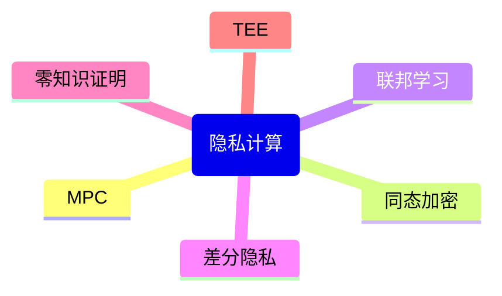

# P22 零知识证明ZK

← [[BV1ser5BDESU-总览]] | ← [[P21-安全求交和匿踪查询]] | 下一篇 → [[P23-差分隐私基础理论与核心概念]]

## 视频信息

| 项目 | 内容 |
|------|------|
| 分集 | 零知识证明ZK |
| 模块 | 隐私计算核心技术 |
| 时长 | 52 分 31 秒 |
| 链接 | [B 站 P22](https://www.bilibili.com/video/BV1ser5BDESU?p=22) |
| 官方文档 | [SecretFlow 文档](https://www.secretflow.org.cn/zh-CN/docs) |
| 内容来源 | 知识点增强（数据要素流通技术体系，非逐字转写） |

## 核心要点

1. **本 P 主题**：零知识证明ZK
2. **模块定位**：隐私计算核心技术
3. **考试/实践侧重**：ZK 完备性/可靠性/零知识性、SNARK/STARK
4. **笔记层级**：教程级（约 2969 字），含速览、图解、场景 Walkthrough、自测题
5. **学习建议**：先通读「3 分钟速览」与「图解」，再读「详细讲解」；动手项见 Checklist

> 以下内容基于数据要素流通与隐私计算技术体系撰写，对应 B 站分 P「零知识证明ZK」。**非 UP 逐字转写**；不看视频也可建立框架，看视频可对照「与视频对照表」深化。

## 本节在系列中的位置

**模块**：隐私计算核心技术 · 系列第 **P22/47** 集。

**建议前置**：[[安全求交和匿踪查询]]——建立本集所需背景。

**建议后续**：[[差分隐私基础理论与核心概念]]——在本集能力之上继续深入。

依赖关系：政策(P01–P06) → 可信空间(P07–P08,P18) → 密态/隐私技术(P09–P24) → SecretFlow 工程(P25–P32) → 基础设施与案例(P33–P47)。

## 3 分钟速览

**零知识证明ZK** 是数据要素流通体系中的关键一课。读完本节你应能回答：① 核心概念定义；② 在「供得出—流得动—用得好—保安全」链条中的位置；③ 与隐私计算技术栈的衔接。考试/面试侧重：**ZK 完备性/可靠性/零知识性、SNARK/STARK**。

## 零基础导读

本节「零知识证明ZK」属于 **隐私计算核心技术**。即便未看视频，也应先建立**制度—技术—场景**三层视角：政策类章节回答「为什么允许流」；技术类章节回答「如何安全地算」；案例类章节回答「真实行业怎么落地」。

第一遍阅读请盯住三个问题：本集**解决什么痛点**？**关键参与方**是谁？**交付物或能力边界**是什么？第二遍阅读时，把术语表抄到 Obsidian 双链笔记，与前后分 P 交叉引用。

## 详细讲解

### 1. 零知识证明定义

**零知识证明**（ZK）：证明者向验证者证明陈述为真，但不泄露任何超出「陈述为真」之外的信息。三性质：**完备性**（真陈述可证）、**可靠性**（假陈述难证）、**零知识性**（验证者学不到秘密）。

### 2. 证明系统分类

| 类型 | 交互 | 证明大小 | 验证时间 |
|------|------|----------|----------|
| SNARK | 非交互（NIZK） | 常数级 | 快 |
| STARK | 非交互 | 对数级 | 较快 |
| Bulletproofs | 可交互 | 对数级 | 中等 |

### 3. 技术 pipeline

1. 将计算编译为**算术电路**或约束系统（R1CS）
2. 证明者生成 witness（私密输入）
3. 证明者运行证明算法得 π
4. 验证者用公开输入 + π 验证，无需见 witness

### 4. 数据要素与区块链应用

- **可验证计算**：证明统计结果正确而不公开明细
- **隐私交易**：证明交易合法而不暴露金额地址（Zcash）
- **身份凭证**：证明年龄>18 而不暴露生日
- **数据流通审计**：证明按合约处理而不泄露数据

### 5. 挑战

可信设置（部分 SNARK）、电路开发门槛、证明生成耗时。zkVM（Risc0、SP1）降低开发难度。

### 6. 考试/实践要点

- 用「阿里巴巴山洞」类比解释 ZK
- 区分 ZK 与 MPC 的适用场景
- 说明 P36 区块链+ZK 的结合点

### 7. 电路编译

Circom、gnark 将业务逻辑编译为约束；复杂统计需控制电路规模。

### 8. 量子威胁

长期需关注 PQC 迁移；ZK 证明系统逐步引入抗量子假设。

### 9. 开发工具

snarkjs、circomlib 学习曲线陡；先用 zkVM 跑通业务逻辑再手工优化电路可缩短 PoC 周期。

### 10. 学习与实践检查单

- [ ] 对照本 P 标题回顾 B 站视频章节要点
- [ ] 在 [SecretFlow 文档](https://www.secretflow.org.cn/zh-CN/docs) 找到对应模块
- [ ] 能用一句话向同事解释本 P 核心概念
- [ ] 识别一个本行业可落地的应用场景
- [ ] 记录与前后分 P 的技术依赖关系

### 11. 模块知识串联
本讲属于「数据要素流通技术」体系中的重要一环。建议在学习日志中标注：输入依赖（前序知识）、输出能力（学完能做什么）、与隐语组件映射（SecretFlow/Kuscia/SecretPad/TEE）。完成 47 讲后应能独立设计一个「政策合规+连接器+隐私计算+审计存证」的端到端方案，并评估 MPC、TEE、联邦学习的选型依据。

### 深化理解（零知识证明ZK）

将本节概念放入「数据二十条」四原则框架：它主要支撑哪一条原则？若去掉该能力，哪类数据流通场景会受阻？用一句话向非技术经理解释本节价值。

## 图解

## 类比与直觉

隐私计算像**蒙眼协作拼图**：每人只看到自己那块，通过协议拼出完整图案，但彼此不知道对方拼图内容。

## 例题与场景 Walkthrough

**场景：两家机构联合建模（不共享明文）**

1. **样本对齐**：若双方仅有交集用户有价值，先用 PSI（P21/P28）对齐 ID。
2. **特征拼接**：纵向联邦（P24）下 A 方持标签、B 方持特征，梯度通过安全聚合更新。
3. **训练执行**：在 SecretFlow SPU（P27）上完成密态前向/反向，或 TEE 内明文训练（P11–P17）。
4. **模型发布**：输出评分服务；模型参数经评估后按需出域，训练数据永不出域。
5. **本集关联**：零知识证明ZK 提供其中 **ZK 完备性/可靠性/零知识性** 能力。

## 常见误区

1. **「学完本集就会用隐语」**：SecretFlow 生态需多集串联（P19–P32），单集只是拼图一块。
2. **「隐私计算等于不上传数据」**：数据仍以密文、份额或授权方式参与计算，网络与算力开销客观存在。
3. **「TEE 绝对安全」**：TEE 依赖硬件与侧信道防护，需远程证明（P17）与补丁策略。
4. **「区块链解决一切确权」**：链适合存证与交易撮合，大规模计算仍在链下隐私计算引擎。

## 与视频对照表

| 视频段落（约） | 预期演示内容 | 笔记对应章节 |
|-------------|------------|------------|
| 开篇 0%–15% | 本集目标、背景、与前后集关系 | 本节位置、3 分钟速览 |
| 前段 15%–40% | 核心概念定义与架构图 | 零基础导读、详细讲解 |
| 中段 40%–70% | 原理展开、对比、政策/代码示例 | 图解、类比、Walkthrough |
| 后段 70%–90% | 案例、问答、易错点 | 常见误区、Checklist |
| 收尾 90%–100% | 总结、延伸资源 | 延伸阅读、自测题 |

> 本集总时长约 **52分31秒**。无官方外挂字幕时，以分 P 标题「零知识证明ZK」与上表主题对齐视频画面。

## 动手实践 Checklist

- [ ] 复述本集 3 个定义（不看笔记）
- [ ] 根据 Walkthrough 写 200 字场景短文
- [ ] 对照视频确认 1 个架构图/演示
- [ ] 在总览思维导图中标注本集节点
- [ ] 完成自测 Q1/Q5

## 延伸阅读

- 《隐私计算白皮书》对应章节
- SecretFlow 文档「组件」- 密码学基础
- 学术论文：FedAvg、CKKS、ECDH-PSI 原始论文摘要

## 自测题

1. **本集核心考点？**  
   **答**：ZK 完备性/可靠性/零知识性、SNARK/STARK。

2. **本集在四原则中的位置？**  
   **答**：保安全的技术实现。

3. **与 SecretFlow 的关系？**  
   **答**：为 SecretFlow 提供密码学/算法基础。

4. **一项落地检查？**  
   **答**：是否有授权、是否最小必要、是否可审计——三者缺一不可。

5. **30 秒口述本集？**  
   **答**：用「输入→处理→输出」各一句话概括（见 Walkthrough）。

## 关键术语

| 术语 | 说明 |
|------|------|
| 数据要素 | 可参与社会化配置、创造价值的数字化资源 |
| 隐私计算 | 数据可用不可见前提下实现协作计算的技术体系 |
| SNARK | 简洁非交互零知识证明 |
| 电路 | 将计算编译为算术电路 |

## 与前后分 P 的衔接

- ← **安全求交和匿踪查询**（[[P21-安全求交和匿踪查询]]）
- → **差分隐私基础理论与核心概念**（[[P23-差分隐私基础理论与核心概念]]）

## 逐字转写
> 状态：待转写。运行 `Tools/transcribe/transcribe.ps1 -Bvid BV1ser5BDESU -Part 22` 补充。

## 来源说明

- ✅ B 站官方元数据（`Tools/BV1ser5BDESU-full.json`）
- ✅ 分 P 首帧封面（`Tools/bili-fetch/fetch-bilibili.js`）
- ✅ **教程级增强**：含图解/Mermaid、场景 Walkthrough、自测题（约 2969 字，2026-06-06）
- ⏳ 逐字转写：B 站 API 无外挂字幕轨；可选 Whisper/BiliNote 后续补充

## 关键截图

![[../../06-资源附件/video-notes-images/BV1ser5BDESU-P22-cover.jpg|B站首帧 P22]]
