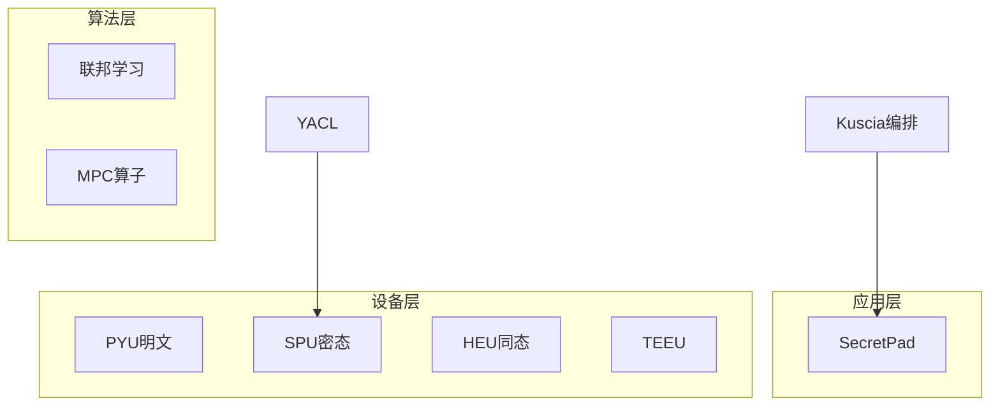

# P25 通用隐私计算框架 SecretFlow

← [[BV1ser5BDESU-总览]] | ← [[P24-联邦学习FL]] | 下一篇 → [[P26-隐私计算密码库YACL]]

## 视频信息

| 项目 | 内容 |
|------|------|
| 分集 | 通用隐私计算框架 SecretFlow |
| 模块 | SecretFlow 生态 |
| 时长 | 24 分 05 秒 |
| 链接 | [B 站 P25](https://www.bilibili.com/video/BV1ser5BDESU?p=25) |
| 官方文档 | [SecretFlow 文档](https://www.secretflow.org.cn/zh-CN/docs) |
| 内容来源 | 知识点增强（数据要素流通技术体系，非逐字转写） |

## 核心要点

1. **本 P 主题**：通用隐私计算框架 SecretFlow
2. **模块定位**：SecretFlow 生态
3. **考试/实践侧重**：SecretFlow 架构、Device 抽象、编程范式
4. **笔记层级**：教程级（约 4594 字），含速览、图解、场景 Walkthrough、自测题
5. **学习建议**：先通读「3 分钟速览」与「图解」，再读「详细讲解」；动手项见 Checklist

> 以下内容基于数据要素流通与隐私计算技术体系撰写，对应 B 站分 P「通用隐私计算框架 SecretFlow」。**非 UP 逐字转写**；不看视频也可建立框架，看视频可对照「与视频对照表」深化。

## 本节在系列中的位置

**模块**：SecretFlow 生态 · 系列第 **P25/47** 集。

**建议前置**：[[联邦学习FL]]——建立本集所需背景。

**建议后续**：[[隐私计算密码库 YACL]]——在本集能力之上继续深入。

依赖关系：政策(P01–P06) → 可信空间(P07–P08,P18) → 密态/隐私技术(P09–P24) → SecretFlow 工程(P25–P32) → 基础设施与案例(P33–P47)。

## 3 分钟速览

**通用隐私计算框架 SecretFlow** 是数据要素流通体系中的关键一课。读完本节你应能回答：① 核心概念定义；② 在「供得出—流得动—用得好—保安全」链条中的位置；③ 与隐私计算技术栈的衔接。考试/面试侧重：**SecretFlow 架构、Device 抽象、编程范式**。

## 零基础导读

本节「通用隐私计算框架 SecretFlow」属于 **SecretFlow 生态**。即便未看视频，也应先建立**制度—技术—场景**三层视角：政策类章节回答「为什么允许流」；技术类章节回答「如何安全地算」；案例类章节回答「真实行业怎么落地」。

第一遍阅读请盯住三个问题：本集**解决什么痛点**？**关键参与方**是谁？**交付物或能力边界**是什么？第二遍阅读时，把术语表抄到 Obsidian 双链笔记，与前后分 P 交叉引用。

## 详细讲解

### 1. SecretFlow 定位

**SecretFlow**（隐语）是蚂蚁集团开源的通用隐私计算框架，统一编程接口支持 MPC、联邦学习、同态加密、TEE 等多种 Device，是数据要素流通的**计算引擎**。

官方文档：https://www.secretflow.org.cn/zh-CN/docs

### 2. 架构分层

| 层 | 组件 |
|------|------|
| 应用层 | SecretPad、业务 SDK |
| 算法层 | 联邦、MPC 算子、预处理 |
| 设备层 | SPU、HEU、PYU、TEEU |
| 密码层 | YACL |
| 编排层 | Kuscia |

### 3. Device 抽象

- **PYU**：明文 Python 单元，本地计算
- **SPU**：Secure Processing Unit，MPC+FHE 混合密态计算
- **HEU**：同态加密单元
- **TEEU**：TEE 执行单元

开发者用 `@sf.device` 装饰器将函数调度到不同设备，框架自动插入密码协议。

### 4. 编程范式

```python
# 概念示例
sf.init(['alice', 'bob'], ...)
spu = sf.SPU(spu_config)
@sf.device(spu)
def secure_add(x, y):
    return x + y
```

### 5. 部署模式

- 单机仿真（开发调试）
- 多节点集群（生产）
- K8s + Kuscia 跨域

### 6. 考试/实践要点

- 列举四种 Device 及适用场景
- 说明 SecretFlow 与联邦学习框架（FATE）的差异点
- 完成官方 Quick Start 跑通两方加法

### 7. 版本与社区

跟踪 GitHub secretflow/secretflow 发布说明；参与 Discussions 与 Issue。

### 8. 与 Spark 集成

大数据预处理用 Spark，敏感算子下沉 SPU，构建混合流水线。

### 9. 商业支持

生产部署建议购买商业技术支持；开源版适合研发，注意版本兼容矩阵（SecretFlow×Kuscia×SecretPad）。

### 为什么需要 SecretFlow（而非裸 MPC 库）

裸 MPC 库（如 EMP-toolkit）提供密码协议原语，但**不解决**多方异构环境、设备抽象、任务编排、可视化运维等企业落地问题。SecretFlow 的价值在于：

1. **统一编程范式**：同一套 Python 代码可在 PYU/SPU/HEU/TEEU 间切换，降低算法工程师学习成本。
2. **与联邦学习融合**：不仅做两方加法，还覆盖纵向/横向联邦、安全聚合、预处理流水线。
3. **生产级编排**：Kuscia 支持 K8s 跨域调度，SecretPad 降低业务方门槛。
4. **国密与合规**：YACL 支持 SM 系列算法，便于国内金融、政务场景。

与 **FATE** 对比：FATE 侧重联邦学习流水线；SecretFlow 覆盖 MPC+FL+HE+TEE 更广谱，且 SPU 编译执行是差异化能力。

### PYU / SPU / HEU / TEEU 选型表

| Device | 适用场景 | 典型算子 | 性能 | 安全假设 |
|--------|----------|----------|------|----------|
| PYU | 单方明文预处理、非敏感特征 | pandas 清洗、编码 | 最快 | 无密码保护 |
| SPU | 多方联合统计、ML 训练推理 | 矩阵乘、比较、逻辑回归 | 中（通信密集） | 半诚实/诚实多数 |
| HEU | 单方加密外包计算、少量密态乘 | 密态求和、浅层乘 | 慢（密文膨胀） | 依赖 HE 方案强度 |
| TEEU | 低延迟推理、模型权重保护 | 大模型推理、规则引擎 | 快（硬件依赖） | 信任硬件厂商 |

### 最小联邦学习流程（伪代码）

```python
import secretflow as sf
sf.init(parties=['bank', 'ecom'], address='...')

# 各方本地 PYU 读数据
bank_data = sf.PYU('bank')(load_data)()
ecom_data = sf.PYU('ecom')(load_data)()

# 敏感梯度在 SPU 上安全聚合
spu = sf.SPU(spu_conf)
@sf.device(spu)
def secure_train_step(grad_a, grad_b):
    return (grad_a + grad_b) / 2

for epoch in range(E):
    ga = sf.PYU('bank')(local_train)(bank_data)
    gb = sf.PYU('ecom')(local_train)(ecom_data)
    g_avg = secure_train_step(ga, gb)
    sf.PYU('bank')(apply_grad)(g_avg)
    sf.PYU('ecom')(apply_grad)(g_avg)
```

### 金融/医疗场景映射

| 场景 | 数据形态 | 推荐组件 | 说明 |
|------|----------|----------|------|
| 银行+电商联合风控 | 纵向表 | SecretFlow FL + PSI 对齐 | 样本 ID 先 PSI，再纵向训练 |
| 多家医院重病预测 | 横向表 | FedAvg + 安全聚合 | 同特征不同患者 |
| 医保统计查询 | SQL 聚合 | SCQL | 最小权限列级控制 |
| 理赔模型推理 | 模型权重 | TEEU / 密态推理 | 权重不出域 |

### 安装入门

1. 访问 https://www.secretflow.org.cn/zh-CN/docs 选择「安装部署」
2. 开发机可用 Docker 单机仿真模式
3. 跑通 Quick Start 两方加法后，再试联邦逻辑回归示例
4. 生产环境规划 Kuscia Domain 与网络互通

## 图解



## 类比与直觉

SecretFlow 像**隐私计算的 Android 系统**：YACL/SPU 是芯片驱动，Kuscia 是任务调度，SecretPad 是桌面，开发者写应用即可。

## 例题与场景 Walkthrough

**场景：两家机构联合建模（不共享明文）**

1. **样本对齐**：若双方仅有交集用户有价值，先用 PSI（P21/P28）对齐 ID。
2. **特征拼接**：纵向联邦（P24）下 A 方持标签、B 方持特征，梯度通过安全聚合更新。
3. **训练执行**：在 SecretFlow SPU（P27）上完成密态前向/反向，或 TEE 内明文训练（P11–P17）。
4. **模型发布**：输出评分服务；模型参数经评估后按需出域，训练数据永不出域。
5. **本集关联**：通用隐私计算框架 SecretFlow 提供其中 **SecretFlow 架构** 能力。

## 常见误区

1. **「学完本集就会用隐语」**：SecretFlow 生态需多集串联（P19–P32），单集只是拼图一块。
2. **「隐私计算等于不上传数据」**：数据仍以密文、份额或授权方式参与计算，网络与算力开销客观存在。
3. **「TEE 绝对安全」**：TEE 依赖硬件与侧信道防护，需远程证明（P17）与补丁策略。
4. **「区块链解决一切确权」**：链适合存证与交易撮合，大规模计算仍在链下隐私计算引擎。

## 与视频对照表

| 视频段落（约） | 预期演示内容 | 笔记对应章节 |
|-------------|------------|------------|
| 开篇 0%–15% | 本集目标、背景、与前后集关系 | 本节位置、3 分钟速览 |
| 前段 15%–40% | 核心概念定义与架构图 | 零基础导读、详细讲解 |
| 中段 40%–70% | 原理展开、对比、政策/代码示例 | 图解、类比、Walkthrough |
| 后段 70%–90% | 案例、问答、易错点 | 常见误区、Checklist |
| 收尾 90%–100% | 总结、延伸资源 | 延伸阅读、自测题 |

> 本集总时长约 **24分05秒**。无官方外挂字幕时，以分 P 标题「通用隐私计算框架 SecretFlow」与上表主题对齐视频画面。

## 动手实践 Checklist

- [ ] 打开 https://www.secretflow.org.cn/zh-CN/docs 阅读「快速开始」
- [ ] Docker 拉起单机仿真，跑通两方加法
- [ ] 手绘 Device 四层架构图（PYU/SPU/HEU/TEEU）
- [ ] 列出金融/医疗场景各 1 条到组件的映射
- [ ] 阅读 Kuscia 与 SecretPad 简介页，理解分工

## 延伸阅读

- [SecretFlow 安装与快速开始](https://www.secretflow.org.cn/zh-CN/docs/secretflow/latest/zh-cn/getting_started)
- [SPU 开发指南](https://www.secretflow.org.cn/zh-CN/docs/spu/latest/zh-cn/)
- [Kuscia 部署](https://www.secretflow.org.cn/zh-CN/docs/kuscia/latest/zh-cn/)
- 对比阅读：FATE 官方文档「联邦学习组件」章节

## 自测题

1. **本集核心考点？**  
   **答**：SecretFlow 架构、Device 抽象、编程范式。

2. **本集在四原则中的位置？**  
   **答**：保安全的技术实现。

3. **与 SecretFlow 的关系？**  
   **答**：本集直接讲隐语组件。

4. **一项落地检查？**  
   **答**：是否有授权、是否最小必要、是否可审计——三者缺一不可。

5. **30 秒口述本集？**  
   **答**：用「输入→处理→输出」各一句话概括（见 Walkthrough）。

## 关键术语

| 术语 | 说明 |
|------|------|
| 数据要素 | 可参与社会化配置、创造价值的数字化资源 |
| 隐私计算 | 数据可用不可见前提下实现协作计算的技术体系 |
| SPU | Secure Processing Unit |
| SCQL | Secure Collaborative Query Language |

## 与前后分 P 的衔接

- ← **联邦学习FL**（[[P24-联邦学习FL]]）
- → **隐私计算密码库 YACL**（[[P26-隐私计算密码库YACL]]）

## 逐字转写
> 引擎: whisper | 状态: 已转写 | 格式: 段落化

### [00:00 - 00:51] 大家好,我是来自英语社区的周艾
大家好,我是来自英语社区的周艾辉，那么今天呢,我给大家带来英语架构盖览，本门课程主要分为两块点动，第一块是英语架构的一个盖览，第二块是英语架构的一个拆解，那么我们会详细介绍英语每一层和英语核心模块的定位，以及它的主要功能，那么首先呢,我们先介绍第一块点动,就是整个英语的架构，那么这张图呢,就是目前英语的架构，那么我们可以先从下往上看一下，那么最底层呢,是我们的硬件层，然后除了FPC GPU等正常的硬件之外呢，我们还支持可行之心环境的一些硬件，比如说Intel SJX，然后国产的海光CSV。

### [00:51 - 01:40] 然后BobMarley之言的海
然后Bob Marley之言的海边格雷尔等等，那么在硬件层之上呢,是我们的资源层，就英语的枯下这个平台，那包含了数据网络计算资源应用的管理，那么在资源层之上呢,是我们的计算层，那么大家可以看到,就是这里其实，英语包含了很多隐私保护计算的路线，那比如说多发年计算,统态,T1,T2,还有查分隐私,拖面啊等等，那么计算层之上呢,就支撑的是我们的算法了，那么比如说包含PSI,就隐私囚交,IPIR,逆动查询,然后数据分析，然后以及联邦学习等等，那么最上面呢,其实就是我们的产品层，然后其实主要包含白屏的产品。

### [01:40 - 02:29] 然后还有一些黑屏的一些API,
然后还有一些黑屏的一些API,SDK等等，那么右边呢,就是英语的一些通用的一些能力，比如说互联互通，那么核心其实就包含的是白核互联互通和黑核互联互通，然后另外一块内容是夸易观控，那么主要包含三全分质,密探传出,还有前站审计，那么云语的架构为什么长这个样子，就是为什么我们是这么分层的，那么我们有几个出发点吧，第一个出发点其实就是考虑到完备性的问题，就在目前我们看,就是整个隐私计算吧，它没有一个绝对优势的一个技术路线，所以你会看到云语支持很多技术，比如说统态啊,比如说多八年计算，比如提衣啊,差分隐私啊等等，那么第二个出发点是说。

### [02:29 - 03:20] 我们希望每一个分层呢,它都是一
我们希望每一个分层呢,它都是一个，就是每一个,下面一层的分层，对上一层它是一个透明的，就是说我们希望每一个分层内部呢，它是一个刚内具的状态，那么层一层之间呢，我们希望它是一个地有合的状态，这样呢,我们希望开圆圆活可以，从那一层入手,开出去进行集成，那么第三个出发点呢，其实我们希望的是说，云语有更好的开放性，那么通过良好的分层的设计呢，我们希望不同的专业人员，可以在他自己的那一层里面呢，充分发挥他的专业优势，因为以自己算码设计到很多学科，那么接下来呢，我们会对整个云语的架构，进行一个拆解，然后会对每一个某块呢，进行一个更细致的讲解。

### [03:22 - 04:12] 那么首先我们介绍云语的产品
那么首先我们介绍云语的产品，那么云语的产品呢，就是图中这个高亮的这一块了，然后其实归纳过来，其实就是包含的白屏，和黑屏的两大块那种，然后云语产品的定位呢，其实是通过可实化的产品呢，我们希望降低中单用户的体验，和掩饰的成本，就是说白就是，我们希望大家可以直接拿着云语产品，就可以进行做一个demo的掩饰，那么同时呢，我们会提供一些模块化的APN，然后希望可以让一些中间商去进行集成，那么云语产品的人情画像呢，其实我们这里列的非常多，就是包括集成商，包括需求，包括产品开发研发，其实我们那么就是，所有的关注云语的能，关注隐私保护计算，这个行业的人。

### [04:12 - 04:56] 其实他都可以关注一下云语的产品
其实他都可以关注一下云语的产品，因为这就是云语最直接的路口，第一个要介绍的是，云语的核心产品Secure Pad，然后这个是云语代表评划产品，Secure Pad提供了轻量化安装的体验，您通过Secure Pad可以快速体验云语的功能，同时云语提供了多种形态的部署，目前您看到的可能主要是中心模式，就是会有一个中心的平台，那么云语也会计划发布PUP模式，就是说每一个机构都会有一个独立的自己的平台，那么另外的云语的产品功能是很丰富的，会包含PC,包含TE,包含Circle，然后还有PSI等等，然后最后还要介绍一个云语的。

### [04:56 - 05:37] 特色的产品叫做SecureNo
特色的产品叫做Secure Note，就是您可以理解为它是一个具有Secure Flow特色的notebook，那么通过Secure Note，然后您可以直接进行一个交互式建模，然后可以在一个界面上管理多个机型的节点，那么接下来我们可以看一下，云语球交和逆动查询，就是PSI和PR，也就是图中这个高量的这一块，那我们先介绍一下PSI和PR的定义吧，PSI是Private Set Intersection的说息，那么其实PSI是一种特殊的安全多方计算协议了，那么它整个定义可以这么概括的理解吧。

### [05:37 - 06:29] 就是首先我们假设Alice持有
就是首先我们假设Alice持有X,即和X，那么Bob持有即和Y，那么Alice和Bob通过执行PSI协议，他们得到了X和Y的交集，那么除了X和Y的交集之外，不会泄露任何其他信息，这个就是PSI的定义，那么PR是Private Information Retriever的缩写，PR指的是用户查询，服务端数据的时候，服务端它不知道用户查的是哪些，那么在云语里面，PSI和PR的定位是说提供高性能，侵略化应用的专用协议模块，那么人群画像是PSI、PR的产品，需求和研发来研，那么云语PSI有这些特色吧，第一块是说这是非常丰富的协议吧。

### [06:29 - 07:17] 包括半程式模型和恶业模型
包括半程式模型和恶业模型，包括两方和多方，包括Unbalanced的PSI，那么另外云语的PSI在性能和协议上，都做了很多优化，其实目前在某些协议上其实是非常领先的，那么另外就是PSI提供了多层的路口，就是如果您是一个白屏用户，您可以直接使用PSI的产品，那如果您是一个开发人员，您可以通过seqflow接路，就是拍摄形式的方式接路，也可以直接用户的方式来继承，那么逆中查询PR的目前它的特色，其实有点类似，然后第一个它首先也支持很多种协议，目前只是sell的PR，就是label的PR，另外还计划支持一些更多的PR的功能。

### [07:17 - 07:57] 那么同时我们也对于有的PR
那么同时我们也对于有的PR，是做了一些协议和性能上的优化，另外就是PR我们也是计划提供多层路口的，就是如果您是开发人员，您可以通过seqflow或者库的形式去继承，如果您是白屏用户，我们这边也是计划，未来就是提供PR的产品，那么接下来我们介绍，三法层的数据分析这一块，那就屠龙高量的data analysis，那么目前予以的数据分析主要产品是seqflow，那么seqflow是secure collaborative，cure language的缩写，那么予以的seqflow是一种多方安全数据分析系统。

### [07:57 - 08:41] 那么可以让多个不限的参与方在保
那么可以让多个不限的参与方在保护，数据隐私的前提下，完成一个多方联合的数据分析了，那么seqflow的定位呢，其实就是说它我们希望的是说，屏蔽底层安全计算协议的复达性，同时提供很简单的seqflow语言，同样用户可以获得一个多方数据密带的分析能力，那么seqflow的类型画像，包含数据分析集成商，数据分析产品，数据分析需求还有研发能源，那我们看一下seqflow的一些核心特性吧，首先seqflow是，即一个半程式的安全模型假设，那么seqflow是只是多方的，同时提供了和买seqflow兼容的seqflow的方言语法。

### [08:41 - 09:26] 然后也支持常用的一些seqfl
然后也支持常用的一些seqflow的功能算子，性能其实在多方安全计算这个定义的数据分析的话，是比较好的，同时还有些具有自己独特的一个数据使用，受捡管控的一个机制，然后也支持很多种的密带协议，然后也支持很多种的数据源记录，那么接下来我们可以看一下算法层的最后一块，那种联邦学习，联邦学习的定义是说，在原始数据不出狱的前提下通过交换，中间数据完成积极学习建模，那么云云的联邦学习其实保含两块，一块是水冰联邦，另一块是我们假的垂直联邦吧，那其实比较标准的定义是叫做，拆尾学习吧，接下来是spread learning的感觉。

### [09:26 - 10:24] 那么云云的联邦学习的定位是说
那么云云的联邦学习的定位是说，具备安全攻防保障的，明密文和积极学习框架和算法，它的人群画像，保含深度学习的需求方和产品的眼，然后也保含安全AI的研究人员，联邦学习的特色，保含安全攻防性能和算法的三大块，安全攻防保含安全风险度量体系，保含攻防的框架和算法，另外我们在性能这一块也做了很多优化，比如说吸入化、量化、流水线等等，然后算法这一块还是比较丰富的，比如说常见的音效算法，云云都有支持，还提供了很多sortar安全聚合的侧脸，另外联邦学习也会计划支持大模型，那么云云的计算层，我们首先看一下混合编译调度这一块，我们重点介绍一下refad。

### [10:24 - 11:13] 那么瑞是一个非常有名的分布式计
那么瑞是一个非常有名的分布式计算调度框架，那么云云也使用瑞，为什么还会有refad呢，首先fad是来自于联邦学习，就fad rate的单词的前三个字母，其实原因是说，云云一开始使用了瑞，但是我们在使用过程中发现，其实不仅仅是瑞，包括很多分布式调度框架，它面向的场景是一个机构内部的场景，但是隐私计算它面临的天然是一个跨机构的场景，这里会有不同，就是说你一个机构，被另一个机构去调度去管理，这个可能是不太容易被接受的，那也是因为这些原因，我们研发了refad，refad的定位市场，就是说它面向跨机构的场景，它提供两块核心的能力。

### [11:13 - 11:57] 一块是单个机构内的计算论物的独
一块是单个机构内的计算论物的独立调度能力，然后这个其实就是记忆瑞实现的，然后另一块是跨机构计算论物的协作能力，那这个是refad自己完成的，refad目前已经被瑞社区接受了，然后成了瑞的副画项目，那么需要关注refad的人群画像，可能是包含云云的工程的算法开发人员，就当您深度了解Civaflow底层的时候，可能会接受到refad的概念，那么后续我们也有专门的refad的课程，来介绍refad，然后，计算程的下面，我们会发现还有一大块神秘态引进，那么首先是spu，spu是secure process unit的缩写，就是英语的。

### [11:57 - 12:46] 密谈设备的最核心的一个模块之一
密谈设备的最核心的一个模块之一，然后这个模块呢，我们已经发表了定会论文，然后并被usynix atr3给接受了，那么英语的spu的定位是说，乔接上层算法和底层安全协议，然后给大家提供原生的AI框架的体验，同时给用户提供透明的高性能的，密谈计算的能力，那么spu的能群画像呢，其实是说，机器学习开放研发能源，然后密码协议的研发能源，还有边缘器的研发能源，这里简单介绍一下spu的一个架构，那么spu的前端呢是，目前是以checks为主的，然后理论上也只是tentaflow和battlej，然后这两个还在进行中，那么中间层呢是spu的边缘器。

### [12:46 - 13:35] 然后首先呢会把前端边缘器
然后首先呢会把前端边缘器，变成xla，然后xla会变成，机器学习的中间语源，然后这下层呢是spu的longtail，然后其实就是主要就是mpc的各种协议了，比如说sem2k,vy3还有chita，那么spu呢一些核心特性，第一个就是说，可以原生的对接主流的AI前端呢，那另外一个就是说性能比较好，然后做的数据变形优化呀，指令变形优化，那另外呢就是spu支持，比较丰富的mpc协议，那同时呢我们提供了非常好的协议扩展的接口，那其实这里其他就是一个非常好的例子，其他就是当时就是在，英语的这个spu的这个协议扩展的基础上，直接支持进来的。

### [13:35 - 14:20] h1u呢是同态的加密设备
h1u呢是同态的加密设备，然后英语的h1u的定位是说，提供地门卡高性能的同态加密控，然后可以支持多内型扩展的设法协议，然后同时我们希望建立一个硬件加速的生态，那么h1u的人群好像呢，包含同态加密的用户，然后包括设法的研究人员啊，以及包括同态的硬件的研发人员，那么同态的一个原理呢，就是简单的介绍的话，就是说我们可以看左上边这张图了，就假如说s有两个数字，一个三一个五，那么他这三和五做了一个加密，得到一个密闻，他把密闻发给了Bob，那么Bob可以直接对这个密闻，做一个密台的加法，那么他得到一个介绍的c，那么之后把c返回给Alice。

### [14:20 - 15:07] Alice对这个c做一个解密
Alice对这个c做一个解密，然后他会得到一个正确的介绍是8，那么这就是一个同态加密的一个加法，那么同态加密的有些分类，就包含phe，就是说他支持密台的加法，或者获得的惩罚，那么lhe是说，支持有限制的密台加法和惩罚，注意是同时支持加法和惩罚，但是支持有限制，那么fhe就是说支持无限制，目前英语的h1u的核心的特性，包含，第一个是说，支持很多种的phe的算法，另外在性能这一块，我们是处于，越界领先的位置，另外h1u提供了，多种的接口，包括npilec的这种API，包括cij加python这两层的接口，同时还提供了，一部分的硬件加速的能力。

### [15:07 - 16:04] 接下来我们介绍
接下来我们介绍，下一个密台引擎teu，teu是肯定资金环境单元的缩写，英语teu的定位是说，支持多种可信制型环境，具备数据使用，跨意管控能力的密台计算数据，然后提供的数据分析，机器学习，包括npclefl加速的等购，那么这一块关注的人群画像，是包括数据和规研究的音乐，te的软件开发的研，然后提供的硬件制造厂商，那么teu的特色，包含快语管控，然后快语管控的包含，数据确权，使用授权等等，那么会在货文的快语管控里面，会介绍的更多，那么同时英语的te，会提供很多可信的应用能力，包含语触领，包含经典机器学习，比如说Tatibus的建模，然后逻辑回规等等。

### [16:04 - 16:55] 然后也会提供
然后也会提供，深度学习和大步行，这两个是计划快要发布的，然后同时呢，还会支持多种硬件，比如说SGX，iPhone 6，然后包括国产的海光CSV，和英特的TX，这些都是要支持的，然后下一个要介绍的是，计算层的密码源语，然后压口，那源语压口的定位呢，是说多种隐私计算路线，共同需要密码库，然后我们需要一个具备，安全实现保证，然后同时新人，高的一个库，那么它的轮群画像，是说安全密码的研究人员，那么这里重点提一下，为什么会有一个，云以自己的密码库，那么我们看一下现状，就写书界的密码库，存在的问题是说，第一个，它有些安全的实现并不标准，然后另外的性能，可能不是很好。

### [16:55 - 17:42] 还有一个就是
还有一个就是，因为缺乏长期的维护，它的应用性，做的也不是很好，那么工业界的密码库，比如OpenSSL，那么第一个就是，它的新功能的，引动的比较慢，就是策略比较保守，另外它的应用性就是，可能也做的不是很好，就被它缺乏良好的，密码工具的抽象，那么因为这些事实，然后我们决定，做一个自己的密码库，然后这个密码库，压扣的定位，会有几个特色，一个是性能，性能很高，然后我们要传出，详细的benchmark，然后第二个是安全，然后压扣提供的算法，一定是经过广泛的验证和认可的，然后最后一块是，我们西洋应用性，做的很好，然后对于开发者，我们会提供联合的介绍抽象，同时我们也会提供。

### [17:42 - 18:37] 非常好的注释
非常好的注释，那库下是云语的自愿管理层，那么包含数据管理，网络管理，计算自愿管理，和应用管理，那么库下定位是说，频率不同机构间，基础设施的差异，为跨机构写作，提供丰富前可靠的，自愿管理和任务调度能力，我们这里重点要强调一下，就是库下提供的是一个，通用的一个任务调度能力，也就是说，您不可以，您不只可以在库下，上面运行SeqFloor，您也可以在库下，上面运行其他的框架，比如说FIT，然后库下的关心的人群，可能是包含隐私保护，计算机成商，还有应为的开发论源，我们简单介绍一下，库下的架构，那么库下，它的新世纪Kabas，设计的，那么库下，会分为两大块钱。

### [18:37 - 19:19] 第一块是Must
第一块是Must，Must里面核心的是一个K3S，其实是Kabas的一个，轻量发行板，然后在此之上，其实我们会实现了，很多库下自己的一些Controller，然后通过这些Controller，可以实现，跨意的任务调度，服务发现，数据授权等等，然后同时里面，还会有一个互联互通的，一个控制器，库下的另一块的，主要的概念是Light，节点这个概念，那么这里面有，三大块核心的那种，第一块是ServiceMesh，然后这个主要是，为了给不同的，转发动机之间，提供同一的，网络层基础，然后另外一个是DataMesh，然后就是说是给，数据管理，提供的基础设施。

### [19:19 - 20:13] 然后解决数据发现
然后解决数据发现，多元适配，数据数据的问题，然后最后一个水减，现在主要是负责，节点实力的注册，核动机的管理，接下来我们介绍一下，云语的互联互通，云语的互联互通的，定位是说，我们希望是说，云语和其他厂商的平台，可以互联互通，然后共同完成一个，隐私计算的任务，然后它的认情画像，其实包含互联互通的，需求方算法的，研发认源，平台研发认源，同时也可以包含，隐私保护计算的基层商，互联互通的，主要包含两种模式，目前第一种叫做，黑色模式，然后又叫管理调度互联，它是什么意思呢，是说管理面，控制面其实是互联互通的，但是跑的算法容器是相同的，打个比方说，有两个机构。

### [20:13 - 21:03] 那他们的论务管理调度
那他们的论务管理调度，实现是不一样的，但他们跑的都是sigflo，那么第二种模式，又叫做白河模式，它指的是说，你的算法本身，也是互联互通的，也就是说，你的跑的两边的算法，容器可能是不一样的实现，然后最后一块力浓，是快语管控，核心的概念是，三权分制面台成熟的，那么我们对快语管控的定义，是说，数据离开持有者的预知后，那么数据方呢，仍然可以有效的，控制数据的流转，就是避免数据被非法窃取，或者说被非法的使用，那么关注快语管控的呢，首先应该是，隐私保护计算的需求方了，数据方应该知道，这样才能确保，它的数据不会被滥用，然后另外一方面呢，我们也希望监管方。

### [21:03 - 21:58] 也可以关注这一块
也可以关注这一块，因为你希望提供一个，快语管控的一个实践，然后希望给行业，做一个参考，那么之后呢，因为人员其实也可以关注这一块，快语管控的核心概念，是三权分制，那么三权是指数据资源持有权，那么它的对象呢，是数据资源了，那么数据加工使用权，它的对象是数据资源，以及数据资源，经过加工得到的数据产品，那么最后一个是数据产品经营权，那么它的对象呢，是数据产品，那么所谓的快语管控，这里核心要管的，其实就是数据加工使用，那么数据加工使用权的快语管控呢，一方面呢，我们需要通过合同，法律法规去约束，那另一方面呢，我们也需要通过技术去保障，那么云云呢，希望的是说。

### [21:58 - 22:49] 通过隐私计算作为核心呢
通过隐私计算作为核心呢，然后，构建一个密台的一个数连网，然后云云会提供，包括密台输牛，密台管道的能力，然后我们通过呢，对加工使用权的管控呢，然后充河支持，产品经营权的不失控，保证整个产品经营权的合理合法，最后呢，我们对云云的整个架构，做一个总结，那么前面呢，也介绍了云云的，很多层的一些，核心的定位呢，和它的特色，那么我们这里，我们再总结一遍，假如您是一个产品使用者，那么我们建议您关注云云的产品层，那么通过云云的白屏产品呢，您可以快速了解，和体验云云的能力，如果您是一个平台继承的，比如说您是一个中间渠道商，那么您可以继承云云的，开源框架比如说枯下。

### [22:49 - 23:41] 然后可以把云云的能力呢
然后可以把云云的能力呢，包装成解决方案提供给客户，如果您是一个算法使用者，比如说您已经有自己的，隐私继承平台，有自己的调度能力，那么您可以关注一下，云云的算法，比如说联盟学习，也可以关注一下云云的，密探设备，比如说spu,hu,tu等等，然后在这些设备上，可以开发自己的算法，如果您是一个密码协议使用者，那么您也可以关注，云云的密码库压口，那么整个云云呢，它是基于一个完整，透明和开放的原则，来进行设计的，那么我们希望每一层呢，它都是一个高内聚，层与层之间地有合，这样一个状态，然后每一层呢，都可以用户，可以轻易地去集成，然后可以单独使用，那么本门课程。

### [23:41 - 24:01] 其实目标也是这个
其实目标也是这个，就是希望大家通过本门课，了解云云每一层的作用，然后当你进到云云，这个非常大的框架的时候，可以快速知道，自己应该去了解哪一块，从哪一层进行入手，那么课程到此结束，感谢您的观看。

## 来源说明

- ✅ B 站官方元数据（`Tools/BV1ser5BDESU-full.json`）
- ✅ 分 P 首帧封面（`Tools/bili-fetch/fetch-bilibili.js`）
- ✅ **教程级增强**：含图解/Mermaid、场景 Walkthrough、自测题（约 4594 字，2026-06-06）
- ⏳ 逐字转写：B 站 API 无外挂字幕轨；可选 Whisper/BiliNote 后续补充

## 关键截图

![[../../06-资源附件/video-notes-images/BV1ser5BDESU-P25-cover.jpg|B站首帧 P25]]
