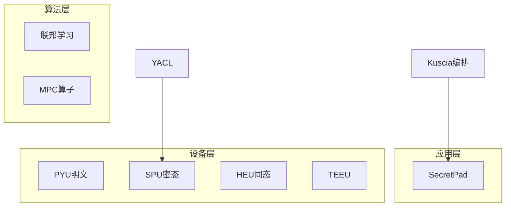

# P25 通用隐私计算框架 SecretFlow

← [[BV1ser5BDESU-总览]] | ← [[P24-联邦学习FL]] | 下一篇 → [[P26-隐私计算密码库YACL]]

## 视频信息

| 项目 | 内容 |
|------|------|
| 分集 | 通用隐私计算框架 SecretFlow |
| 模块 | SecretFlow 生态 |
| 时长 | 24 分 05 秒 |
| 链接 | [B 站 P25](https://www.bilibili.com/video/BV1ser5BDESU?p=25) |
| 官方文档 | [SecretFlow 文档](https://www.secretflow.org.cn/zh-CN/docs) |
| 内容来源 | 知识点增强（数据要素流通技术体系，非逐字转写） |

## 核心要点

1. **本 P 主题**：通用隐私计算框架 SecretFlow
2. **模块定位**：SecretFlow 生态
3. **考试/实践侧重**：SecretFlow 架构、Device 抽象、编程范式
4. **笔记层级**：教程级（约 4594 字），含速览、图解、场景 Walkthrough、自测题
5. **学习建议**：先通读「3 分钟速览」与「图解」，再读「详细讲解」；动手项见 Checklist

> 以下内容基于数据要素流通与隐私计算技术体系撰写，对应 B 站分 P「通用隐私计算框架 SecretFlow」。**非 UP 逐字转写**；不看视频也可建立框架，看视频可对照「与视频对照表」深化。

## 本节在系列中的位置

**模块**：SecretFlow 生态 · 系列第 **P25/47** 集。

**建议前置**：[[联邦学习FL]]——建立本集所需背景。

**建议后续**：[[隐私计算密码库 YACL]]——在本集能力之上继续深入。

依赖关系：政策(P01–P06) → 可信空间(P07–P08,P18) → 密态/隐私技术(P09–P24) → SecretFlow 工程(P25–P32) → 基础设施与案例(P33–P47)。

## 3 分钟速览

**通用隐私计算框架 SecretFlow** 是数据要素流通体系中的关键一课。读完本节你应能回答：① 核心概念定义；② 在「供得出—流得动—用得好—保安全」链条中的位置；③ 与隐私计算技术栈的衔接。考试/面试侧重：**SecretFlow 架构、Device 抽象、编程范式**。

## 零基础导读

本节「通用隐私计算框架 SecretFlow」属于 **SecretFlow 生态**。即便未看视频，也应先建立**制度—技术—场景**三层视角：政策类章节回答「为什么允许流」；技术类章节回答「如何安全地算」；案例类章节回答「真实行业怎么落地」。

第一遍阅读请盯住三个问题：本集**解决什么痛点**？**关键参与方**是谁？**交付物或能力边界**是什么？第二遍阅读时，把术语表抄到 Obsidian 双链笔记，与前后分 P 交叉引用。

## 详细讲解

### 1. SecretFlow 定位

**SecretFlow**（隐语）是蚂蚁集团开源的通用隐私计算框架，统一编程接口支持 MPC、联邦学习、同态加密、TEE 等多种 Device，是数据要素流通的**计算引擎**。

官方文档：https://www.secretflow.org.cn/zh-CN/docs

### 2. 架构分层

| 层 | 组件 |
|------|------|
| 应用层 | SecretPad、业务 SDK |
| 算法层 | 联邦、MPC 算子、预处理 |
| 设备层 | SPU、HEU、PYU、TEEU |
| 密码层 | YACL |
| 编排层 | Kuscia |

### 3. Device 抽象

- **PYU**：明文 Python 单元，本地计算
- **SPU**：Secure Processing Unit，MPC+FHE 混合密态计算
- **HEU**：同态加密单元
- **TEEU**：TEE 执行单元

开发者用 `@sf.device` 装饰器将函数调度到不同设备，框架自动插入密码协议。

### 4. 编程范式

```python
# 概念示例
sf.init(['alice', 'bob'], ...)
spu = sf.SPU(spu_config)
@sf.device(spu)
def secure_add(x, y):
    return x + y
```

### 5. 部署模式

- 单机仿真（开发调试）
- 多节点集群（生产）
- K8s + Kuscia 跨域

### 6. 考试/实践要点

- 列举四种 Device 及适用场景
- 说明 SecretFlow 与联邦学习框架（FATE）的差异点
- 完成官方 Quick Start 跑通两方加法

### 7. 版本与社区

跟踪 GitHub secretflow/secretflow 发布说明；参与 Discussions 与 Issue。

### 8. 与 Spark 集成

大数据预处理用 Spark，敏感算子下沉 SPU，构建混合流水线。

### 9. 商业支持

生产部署建议购买商业技术支持；开源版适合研发，注意版本兼容矩阵（SecretFlow×Kuscia×SecretPad）。

### 为什么需要 SecretFlow（而非裸 MPC 库）

裸 MPC 库（如 EMP-toolkit）提供密码协议原语，但**不解决**多方异构环境、设备抽象、任务编排、可视化运维等企业落地问题。SecretFlow 的价值在于：

1. **统一编程范式**：同一套 Python 代码可在 PYU/SPU/HEU/TEEU 间切换，降低算法工程师学习成本。
2. **与联邦学习融合**：不仅做两方加法，还覆盖纵向/横向联邦、安全聚合、预处理流水线。
3. **生产级编排**：Kuscia 支持 K8s 跨域调度，SecretPad 降低业务方门槛。
4. **国密与合规**：YACL 支持 SM 系列算法，便于国内金融、政务场景。

与 **FATE** 对比：FATE 侧重联邦学习流水线；SecretFlow 覆盖 MPC+FL+HE+TEE 更广谱，且 SPU 编译执行是差异化能力。

### PYU / SPU / HEU / TEEU 选型表

| Device | 适用场景 | 典型算子 | 性能 | 安全假设 |
|--------|----------|----------|------|----------|
| PYU | 单方明文预处理、非敏感特征 | pandas 清洗、编码 | 最快 | 无密码保护 |
| SPU | 多方联合统计、ML 训练推理 | 矩阵乘、比较、逻辑回归 | 中（通信密集） | 半诚实/诚实多数 |
| HEU | 单方加密外包计算、少量密态乘 | 密态求和、浅层乘 | 慢（密文膨胀） | 依赖 HE 方案强度 |
| TEEU | 低延迟推理、模型权重保护 | 大模型推理、规则引擎 | 快（硬件依赖） | 信任硬件厂商 |

### 最小联邦学习流程（伪代码）

```python
import secretflow as sf
sf.init(parties=['bank', 'ecom'], address='...')

# 各方本地 PYU 读数据
bank_data = sf.PYU('bank')(load_data)()
ecom_data = sf.PYU('ecom')(load_data)()

# 敏感梯度在 SPU 上安全聚合
spu = sf.SPU(spu_conf)
@sf.device(spu)
def secure_train_step(grad_a, grad_b):
    return (grad_a + grad_b) / 2

for epoch in range(E):
    ga = sf.PYU('bank')(local_train)(bank_data)
    gb = sf.PYU('ecom')(local_train)(ecom_data)
    g_avg = secure_train_step(ga, gb)
    sf.PYU('bank')(apply_grad)(g_avg)
    sf.PYU('ecom')(apply_grad)(g_avg)
```

### 金融/医疗场景映射

| 场景 | 数据形态 | 推荐组件 | 说明 |
|------|----------|----------|------|
| 银行+电商联合风控 | 纵向表 | SecretFlow FL + PSI 对齐 | 样本 ID 先 PSI，再纵向训练 |
| 多家医院重病预测 | 横向表 | FedAvg + 安全聚合 | 同特征不同患者 |
| 医保统计查询 | SQL 聚合 | SCQL | 最小权限列级控制 |
| 理赔模型推理 | 模型权重 | TEEU / 密态推理 | 权重不出域 |

### 安装入门

1. 访问 https://www.secretflow.org.cn/zh-CN/docs 选择「安装部署」
2. 开发机可用 Docker 单机仿真模式
3. 跑通 Quick Start 两方加法后，再试联邦逻辑回归示例
4. 生产环境规划 Kuscia Domain 与网络互通

## 图解



## 类比与直觉

SecretFlow 像**隐私计算的 Android 系统**：YACL/SPU 是芯片驱动，Kuscia 是任务调度，SecretPad 是桌面，开发者写应用即可。

## 例题与场景 Walkthrough

**场景：两家机构联合建模（不共享明文）**

1. **样本对齐**：若双方仅有交集用户有价值，先用 PSI（P21/P28）对齐 ID。
2. **特征拼接**：纵向联邦（P24）下 A 方持标签、B 方持特征，梯度通过安全聚合更新。
3. **训练执行**：在 SecretFlow SPU（P27）上完成密态前向/反向，或 TEE 内明文训练（P11–P17）。
4. **模型发布**：输出评分服务；模型参数经评估后按需出域，训练数据永不出域。
5. **本集关联**：通用隐私计算框架 SecretFlow 提供其中 **SecretFlow 架构** 能力。

## 常见误区

1. **「学完本集就会用隐语」**：SecretFlow 生态需多集串联（P19–P32），单集只是拼图一块。
2. **「隐私计算等于不上传数据」**：数据仍以密文、份额或授权方式参与计算，网络与算力开销客观存在。
3. **「TEE 绝对安全」**：TEE 依赖硬件与侧信道防护，需远程证明（P17）与补丁策略。
4. **「区块链解决一切确权」**：链适合存证与交易撮合，大规模计算仍在链下隐私计算引擎。

## 与视频对照表

| 视频段落（约） | 预期演示内容 | 笔记对应章节 |
|-------------|------------|------------|
| 开篇 0%–15% | 本集目标、背景、与前后集关系 | 本节位置、3 分钟速览 |
| 前段 15%–40% | 核心概念定义与架构图 | 零基础导读、详细讲解 |
| 中段 40%–70% | 原理展开、对比、政策/代码示例 | 图解、类比、Walkthrough |
| 后段 70%–90% | 案例、问答、易错点 | 常见误区、Checklist |
| 收尾 90%–100% | 总结、延伸资源 | 延伸阅读、自测题 |

> 本集总时长约 **24分05秒**。无官方外挂字幕时，以分 P 标题「通用隐私计算框架 SecretFlow」与上表主题对齐视频画面。

## 动手实践 Checklist

- [ ] 打开 https://www.secretflow.org.cn/zh-CN/docs 阅读「快速开始」
- [ ] Docker 拉起单机仿真，跑通两方加法
- [ ] 手绘 Device 四层架构图（PYU/SPU/HEU/TEEU）
- [ ] 列出金融/医疗场景各 1 条到组件的映射
- [ ] 阅读 Kuscia 与 SecretPad 简介页，理解分工

## 延伸阅读

- [SecretFlow 安装与快速开始](https://www.secretflow.org.cn/zh-CN/docs/secretflow/latest/zh-cn/getting_started)
- [SPU 开发指南](https://www.secretflow.org.cn/zh-CN/docs/spu/latest/zh-cn/)
- [Kuscia 部署](https://www.secretflow.org.cn/zh-CN/docs/kuscia/latest/zh-cn/)
- 对比阅读：FATE 官方文档「联邦学习组件」章节

## 自测题

1. **本集核心考点？**  
   **答**：SecretFlow 架构、Device 抽象、编程范式。

2. **本集在四原则中的位置？**  
   **答**：保安全的技术实现。

3. **与 SecretFlow 的关系？**  
   **答**：本集直接讲隐语组件。

4. **一项落地检查？**  
   **答**：是否有授权、是否最小必要、是否可审计——三者缺一不可。

5. **30 秒口述本集？**  
   **答**：用「输入→处理→输出」各一句话概括（见 Walkthrough）。

## 关键术语

| 术语 | 说明 |
|------|------|
| 数据要素 | 可参与社会化配置、创造价值的数字化资源 |
| 隐私计算 | 数据可用不可见前提下实现协作计算的技术体系 |
| SPU | Secure Processing Unit |
| SCQL | Secure Collaborative Query Language |

## 与前后分 P 的衔接

- ← **联邦学习FL**（[[P24-联邦学习FL]]）
- → **隐私计算密码库 YACL**（[[P26-隐私计算密码库YACL]]）

## 来源说明

- ✅ B 站官方元数据（`Tools/BV1ser5BDESU-full.json`）
- ✅ 分 P 首帧封面（`Tools/bili-fetch/fetch-bilibili.js`）
- ✅ **教程级增强**：含图解/Mermaid、场景 Walkthrough、自测题（约 4594 字，2026-06-06）
- ⏳ 逐字转写：B 站 API 无外挂字幕轨；可选 Whisper/BiliNote 后续补充

## 关键截图

![[../../06-资源附件/video-notes-images/BV1ser5BDESU-P25-cover.jpg|B站首帧 P25]]
