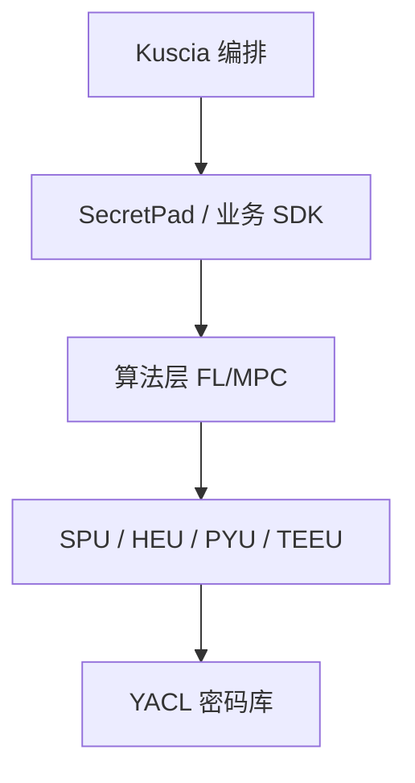

# P27 密态计算单元 SPU

← [[BV1ser5BDESU-总览]] | ← [[P26-隐私计算密码库YACL]] | 下一篇 → [[P28-隐私集合求交PSI]]

## 视频信息

| 项目 | 内容 |
|------|------|
| 分集 | 密态计算单元 SPU |
| 模块 | SecretFlow 生态 |
| 时长 | 20 分 31 秒 |
| 链接 | [B 站 P27](https://www.bilibili.com/video/BV1ser5BDESU?p=27) |
| 官方文档 | [SecretFlow 文档](https://www.secretflow.org.cn/zh-CN/docs) |
| 内容来源 | 知识点增强（数据要素流通技术体系，非逐字转写） |

## 核心要点

1. **本 P 主题**：密态计算单元 SPU
2. **模块定位**：SecretFlow 生态
3. **考试/实践侧重**：SPU 密态虚拟机、MPC+FHE 混合、编译执行
4. **笔记层级**：教程级（约 3033 字），含速览、图解、场景 Walkthrough、自测题
5. **学习建议**：先通读「3 分钟速览」与「图解」，再读「详细讲解」；动手项见 Checklist

> 以下内容基于数据要素流通与隐私计算技术体系撰写，对应 B 站分 P「密态计算单元 SPU」。**非 UP 逐字转写**；不看视频也可建立框架，看视频可对照「与视频对照表」深化。

## 本节在系列中的位置

**模块**：SecretFlow 生态 · 系列第 **P27/47** 集。

**建议前置**：[[隐私计算密码库 YACL]]——建立本集所需背景。

**建议后续**：[[隐私集合求交 PSI]]——在本集能力之上继续深入。

依赖关系：政策(P01–P06) → 可信空间(P07–P08,P18) → 密态/隐私技术(P09–P24) → SecretFlow 工程(P25–P32) → 基础设施与案例(P33–P47)。

## 3 分钟速览

**密态计算单元 SPU** 是数据要素流通体系中的关键一课。读完本节你应能回答：① 核心概念定义；② 在「供得出—流得动—用得好—保安全」链条中的位置；③ 与隐私计算技术栈的衔接。考试/面试侧重：**SPU 密态虚拟机、MPC+FHE 混合、编译执行**。

## 零基础导读

本节「密态计算单元 SPU」属于 **SecretFlow 生态**。即便未看视频，也应先建立**制度—技术—场景**三层视角：政策类章节回答「为什么允许流」；技术类章节回答「如何安全地算」；案例类章节回答「真实行业怎么落地」。

第一遍阅读请盯住三个问题：本集**解决什么痛点**？**关键参与方**是谁？**交付物或能力边界**是什么？第二遍阅读时，把术语表抄到 Obsidian 双链笔记，与前后分 P 交叉引用。

## 详细讲解

### 1. SPU 定义

**SPU**（Secure Processing Unit）是 SecretFlow 的密态计算虚拟机，将 Python/ JAX 风格计算编译为 MPC+FHE 混合协议，在多方间安全执行。

### 2. 执行流程

1. 前端捕获计算图（XLA/HLO）
2. 编译器将算子映射为 SPU 内核（秘密分享、HE 等）
3. 运行时协调多方通信执行协议
4. 输出秘密分享或加密结果，按需揭示

### 3. 支持的运算

- 算术：加、乘、矩阵乘
- 比较：小于、等于（电路或协议）
- 机器学习：逻辑回归、神经网络层
- 统计：均值、方差、相关系数

### 4. 性能优化

- 算子融合减少通信轮次
- 定点数模拟浮点
- 3PC 诚实多数协议降低开销
- 与 PYU 混合：非敏感部分明文执行

### 5. 典型用法

联合训练：各方特征/标签在 SPU 上完成前向反向；联邦推理：模型权重秘密分享后密态预测。

### 6. 考试/实践要点

- 解释 SPU 与 HEU 的分工
- 说明编译执行 vs 解释执行的优势
- 查阅文档中 SPU 支持的 ML 算子列表

### 7. 调试

SPU 仿真模式 log 协议轮次；生产关闭详细 log 防泄露中间值。

### 8. 算子扩展

自定义算子需实现 SPU kernel 注册；参考官方 logistic regression 示例。

### 9. 内存优化

SPU 多方通信与本地秘密分享占内存；大矩阵乘需分块（tile）执行，SecretFlow 部分算子已自动分块。

### 10. 学习与实践检查单

- [ ] 对照本 P 标题回顾 B 站视频章节要点
- [ ] 在 [SecretFlow 文档](https://www.secretflow.org.cn/zh-CN/docs) 找到对应模块
- [ ] 能用一句话向同事解释本 P 核心概念
- [ ] 识别一个本行业可落地的应用场景
- [ ] 记录与前后分 P 的技术依赖关系

### 11. 模块知识串联
本讲属于「数据要素流通技术」体系中的重要一环。建议在学习日志中标注：输入依赖（前序知识）、输出能力（学完能做什么）、与隐语组件映射（SecretFlow/Kuscia/SecretPad/TEE）。完成 47 讲后应能独立设计一个「政策合规+连接器+隐私计算+审计存证」的端到端方案，并评估 MPC、TEE、联邦学习的选型依据。

### 工程落地提示（密态计算单元 SPU）

学习本集时请在 SecretFlow 文档中打开对应组件页，边读边在架构图中**标注位置**。生产部署需同时考虑：网络互通（mTLS）、参与方 Domain 隔离、任务失败重试、审计日志留存。开发阶段优先用单机仿真验证逻辑，再迁移 Kuscia 集群。

## 图解

## 类比与直觉

SecretFlow 像**隐私计算的 Android 系统**：YACL/SPU 是芯片驱动，Kuscia 是任务调度，SecretPad 是桌面，开发者写应用即可。

## 例题与场景 Walkthrough

**场景：两家机构联合建模（不共享明文）**

1. **样本对齐**：若双方仅有交集用户有价值，先用 PSI（P21/P28）对齐 ID。
2. **特征拼接**：纵向联邦（P24）下 A 方持标签、B 方持特征，梯度通过安全聚合更新。
3. **训练执行**：在 SecretFlow SPU（P27）上完成密态前向/反向，或 TEE 内明文训练（P11–P17）。
4. **模型发布**：输出评分服务；模型参数经评估后按需出域，训练数据永不出域。
5. **本集关联**：密态计算单元 SPU 提供其中 **SPU 密态虚拟机** 能力。

## 常见误区

1. **「学完本集就会用隐语」**：SecretFlow 生态需多集串联（P19–P32），单集只是拼图一块。
2. **「隐私计算等于不上传数据」**：数据仍以密文、份额或授权方式参与计算，网络与算力开销客观存在。
3. **「TEE 绝对安全」**：TEE 依赖硬件与侧信道防护，需远程证明（P17）与补丁策略。
4. **「区块链解决一切确权」**：链适合存证与交易撮合，大规模计算仍在链下隐私计算引擎。

## 与视频对照表

| 视频段落（约） | 预期演示内容 | 笔记对应章节 |
|-------------|------------|------------|
| 开篇 0%–15% | 本集目标、背景、与前后集关系 | 本节位置、3 分钟速览 |
| 前段 15%–40% | 核心概念定义与架构图 | 零基础导读、详细讲解 |
| 中段 40%–70% | 原理展开、对比、政策/代码示例 | 图解、类比、Walkthrough |
| 后段 70%–90% | 案例、问答、易错点 | 常见误区、Checklist |
| 收尾 90%–100% | 总结、延伸资源 | 延伸阅读、自测题 |

> 本集总时长约 **20分31秒**。无官方外挂字幕时，以分 P 标题「密态计算单元 SPU」与上表主题对齐视频画面。

## 动手实践 Checklist

- [ ] 在 SecretFlow 文档搜索本集关键词（如 SPU 密态虚拟机）
- [ ] 找到对应 API/组件的配置示例
- [ ] 在 SecretPad 或脚本中定位该组件所处菜单/模块
- [ ] 复现文档最小示例或记录阻塞问题
- [ ] 与 P25 总架构图对照标注本集位置

## 延伸阅读

- [SecretFlow 文档中心](https://www.secretflow.org.cn/zh-CN/docs)
- TC609 可信数据空间相关标准
- 本系列相邻 2 个分 P 笔记

## 自测题

1. **本集核心考点？**  
   **答**：SPU 密态虚拟机、MPC+FHE 混合、编译执行。

2. **本集在四原则中的位置？**  
   **答**：保安全的技术实现。

3. **与 SecretFlow 的关系？**  
   **答**：本集直接讲隐语组件。

4. **一项落地检查？**  
   **答**：是否有授权、是否最小必要、是否可审计——三者缺一不可。

5. **30 秒口述本集？**  
   **答**：用「输入→处理→输出」各一句话概括（见 Walkthrough）。

## 关键术语

| 术语 | 说明 |
|------|------|
| 数据要素 | 可参与社会化配置、创造价值的数字化资源 |
| 隐私计算 | 数据可用不可见前提下实现协作计算的技术体系 |
| 密态计算 | 密文状态下完成计算 |
| 密态胶囊 | 数据+策略+密钥封装单元 |

## 与前后分 P 的衔接

- ← **隐私计算密码库 YACL**（[[P26-隐私计算密码库YACL]]）
- → **隐私集合求交 PSI**（[[P28-隐私集合求交PSI]]）

## 逐字转写
> 引擎: whisper | 状态: 已转写 | 格式: 段落化

### [00:00 - 00:35] 好今天的主题是SPU框架的整体
好 今天的主题是SPU框架的整体结构，我是主讲人 谭晋，今天我们将对SPU的背景和框架进行整体的介绍，但不会涉及太多的细节，我们希望通过这次介绍让大家对SPU有一个感性的认知，今天的内容会分为三个部分，首先我们介绍一下为什么有SPU以及它先要解决的问题，其次我们会介绍一些SPU的功能和用法，最后我们会探讨一下SPU的现状，以及展望一下未来的发展。

### [00:38 - 01:18] 首先为什么我们要做SPU
首先为什么我们要做SPU，在进入正题之前，我们首先考虑一个大模型预测的场景，在这个场景中用户给模型一个提示词，模型通过模型的推理，然后返回给用户结果，但是在现实的场景中模型是公司的资产，公司往往不希望模型被公开免费的得到，提示词是用户的隐私里面，包含了大量用户的隐私敏感信息，所以问题是我们可以同时保护模型和提示词吗。

### [01:20 - 01:59] 用隐私计算技术我们就可以做到这
用隐私计算技术我们就可以做到这一点，它的过程可以简单的表达在右图锁式，用户将它的提示词加密发送给模型提供方，模型提供方拿到是加密的提示词，得不到用户的任何信息，然后模型在一个加密的环境里进行推理，然后推理的结果实际也是密文，模型提供方还是得不到任何信息，最后将加密的结果返回给用户，用户通过它的私药解密得到一个结果。

### [02:02 - 02:40] 了解了场景之后我们再来看一下
了解了场景之后我们再来看一下，为什么需要隐私计算，需求实际上是想而易见的，首先数据是敏感的，比如说人年 声音 基因素等生物识别信息，他们都非常的敏感，再比如说收入消费贷款的个人金融信息，他们也很敏感，各国实际上都有法律法规，来保护用户的隐私，比如说欧盟 中国 巴西 美国等等国家，都在最近的十年内出台了各种政策，来保护用户隐私。

### [02:42 - 03:12] 而且用户数据是重要的
而且用户数据是重要的，数据可以说是互联网公司最重要的资产，并且在各种智能技术的价值下，产生了越来越大的价值，而且可以预期的是，数据联合在一块，将产生更大的数据价值，比如说两个公司把他们的数据融合在一起，进行模型的训练，那么这个模型将会更加的准确，而隐私计算恰好给促成这种联合。

### [03:16 - 04:05] 接下来我们来看一下隐私计算的技
接下来我们来看一下隐私计算的技术路线，其实隐私计算依然是一个在高速发展中的技术，它包括多方安全计算，统材加密，查问隐私，课定硬件等等等等，不过无论是哪种路线，我们都可以做一个简单的数据抽象，这个抽象里面，IS有数据X，BOB有数据Y，他们俩想联合计算一个函数FXY，计算的过程中，IS不想让BOB知道自己的X，BOB也不想让IS知道自己的Y，通过隐私计算，我们就可以在保护X和Y的同时，然后计算出F的结果，也就是Z。

### [04:07 - 04:38] 如果将这个抽象映射回刚才的大模
如果将这个抽象映射回刚才的大模型预测的问题，那么服务运用方运用模型的权重，用户运用提示词，他们都不想让对方知道自己的真实数据，但是他们俩想一起联合计算模型推理这个函数，并且保证权重或者提示词不透露给对方，通过隐私计算经济数，我们就可以实践这一点。

### [04:41 - 05:27] 在介绍完隐私计算的需求和重要性
在介绍完隐私计算的需求和重要性之后，我们再来看一下，它当前面临的一些问题和挑战，首先基于密码学的隐私计算，提供了非常有限的计算能力，就个例子，比如所有的数据都需要在定义在数学的预与或者环上，它是一个非常抽象的数学概念，而且往往也只提供加乘与获这种最基础的算字，类比一下就好比提供了一个最基本的电路模块，如果我们想基于一些门电路，然后直接写出复杂的计论期程序，是往往是非常困难的。

### [05:29 - 05:52] 然后我们想要什么呢
然后我们想要什么呢，实际上我们就想的是一些高级的编程语言，然后它支持丰富的数据类型，比如说Bulling Int Float，甚至Harray Dancer，然后以及支持简单的函数定义，可以构建自己的函数，并且我们可以把函数组合起来，这样我们就可以得到写出，另一幅杂的一个程序。

### [05:55 - 06:14] SPU实际上就是为了填补加密计
SPU实际上就是为了填补加密计算，和高级编程语言之间的空白，它利用加密计算作为底座，然后通过编辑器和预刑时的一些技术，然后把高级的语言翻译和优化到，底层的加密计算的协议上，然后并且高效的执行。

### [06:17 - 06:22] 接下来我们介绍一下SPU的整体
接下来我们介绍一下SPU的整体架构，其他的工作原理。

### [06:24 - 07:19] 右边是SPU的整体架构
右边是SPU的整体架构，它从上到下大概分成了三块，分别是前端 编辑和运行时，接下来我们针对这三部分进行一个简单的介绍，首先我们介绍一下前端，其实SPU并没有自己定义前端的编程语言，相反它选择了附用AI的前端，这意味着用户可以用原生的，TransFlowJax或者Pytorch来编写代码，这样做有几个好处，一方面它降级了用户的学习成本，因为它们可以用自己熟悉的编程语言和工具，另外一方面它也能够附用AI前端的一些能力，比如自动求岛，同过这样的设计，我们相信SPU在前端能力上，能够更好的满足用户的需求，不过在目前阶段。

### [07:19 - 07:26] 我们实际上支持的最好的是Jax
我们实际上支持的最好的是Jax，后续我们可能会对TransFlow和Pytorch加入更多的支持。

### [07:29 - 07:58] 接下来我们介绍要向编一系列录
接下来我们介绍要向编一系列录，SPU编一系的目的就是将机器学习前端，产生的中间表达，加上自定义的隐私保护语意，然后翻译到对加密计算友好的一个运行事实上，这里我们选用了IRVM-MIR框架进行IRS的编译和优化。

### [08:01 - 08:53] 我们将编一系部分放大来看的话
我们将编一系部分放大来看的话，一个比较有意思的特点，就是SPU自定义的带隐私保护语言的IAR，也就是途中的PPHRO和PPIRRO，其中PP是Private Seed Preserving的减息，HRO和PPIRRO是High-Level Ops和Low-Level Ops的减息，通过这种带隐私保护语言的IAR，我们可以让用户几乎写不出不安全的代码，从而增强安全性，这个带隐私保护语言的IAR，简单来说就是任何和密带变量进行的计算，结果都是一个密带变量，这样的话在一个复杂的明密文组成的一个计算图里面。

### [08:53 - 09:08] 通过这种方式我们形成了一个安全
通过这种方式我们形成了一个安全币包，就是任何经过加密变量的结果也都是一个加密的，这样来保护整体保护输入数据的安全。

### [09:10 - 10:15] 然后SPU也加入了一些加密计算
然后SPU也加入了一些加密计算，领域独占的一些优化策略，比如说右上图对于密文乘以明文乘以明文这种pattern，我们通过简单的调整可以变成，明文乘以明文乘以密文，这个调整非常简单，其实就是把明文放到前面来，这样我们可以让更多的计算发生在明文世界中，因为明文比密文计算要坏得多，这样我们就可以整体的提高性能，再比如说右下方，我们实际上是有两个选择器，如果两个选择器依赖于同一个条件辨量，那么可以把这个条件辨量进行一些前置处理，这样相当于将两个选择器的公共部分，公共计算部分提前出来，然后共享一部分的计算，这样来整体的提高性能。

### [10:15 - 10:20] 相众优化还有很多
相众优化还有很多，如果大家有兴趣的话，可以关注一下我们的代码和明文。

### [10:23 - 11:25] 接下来我们来介绍一下SPU的运
接下来我们来介绍一下SPU的运行时，SPU的运行时可以被视为，当做成一个SMD持年级的虚拟设备，然后这样的话我们也可以接受，针对于SMD持年级的各种，提及各方面的优化，包括持年变形、数据变形等等，在右边的图中，我们是这样想展示的，是一个基于谈令的流水先兵优化，它的原理大概是这样，NPC的运算可以被当成是交替出现的本地计算和网络通信，当本地计算发生的时候，网络通信一般是盲等的，而当网络交互的时候CPU是空闲的，这样相当于计算和贷款资源，没有充分的得到利用，在这个优化中我们通过将矩针拆快，并且通过多项乘每个线程计算器中的一部分。

### [11:25 - 11:39] 这样可以让CPU和网络通信交迟
这样可以让CPU和网络通信交迟在一起，让计算的同时也有另外一些线程在通信，从而整体的计算提高计算的吞吐量。

### [11:42 - 12:12] 同时SPU也支持安全协议的扩展
同时SPU也支持安全协议的扩展，我们内置的支持了CME 2K,ABS3和其他三个协议，他们是实际上是几个典型的,比较性能比较好的2PC,3PC协议，同时我们开放了协议扩展接口，通过这样的方式我们可以支持两方、三方、多方，半征时、恶意等各种安全的模型，从而在安全性跟性能之间做一些折衷和妥协。

### [12:14 - 13:13] 还有一个重要的特点是SPU支持
还有一个重要的特点是SPU支持多种的部属模式，并且物理部属模式对上层逻辑是完全透明的，这样我们就可以面向SPU的虚拟机进行编程，并且得到一次书写到处执行的效果，这个怎么理解呢?我们举一个例子，右边相分为左右两部分，左边展示的是物理的layout，右边展示的是虚拟layout，然后集中原型的节点代表数据提供方，方形的节点代表计算方，然后右上图实际上是三个数据节点，将数据完全的拖拐到三个计算节点上，然后计算节点和数据节点是完全分离的，也就是我们通常所说的out sourcing模式，左下方数据提供方就数据节点，同时也参与了计算。

### [13:13 - 14:07] 就说他们所是clockade在
就说他们所是clockade在一起的，就是所谓的clockade模式，这两种不同的物理部属，其中上面有6个节点，相关就是3个真正的物理节点，然后同时对应了右边的这个虚拟抽象，接着虚拟抽象中，我们有3个数据提供节点和1个虚拟的SPU，这样我们可以针对这个虚拟的抽象来携带码，然后这个分代码可以在所有的物理列表上进行执行，最后我们总结一下，SPU它的全称实际上是secure processing unit，从它的命名来看，就是想成为一个类似于CPU或者GPU的设备，从而支持上层的各种应用，类比来看，如果说CPU是一个物理的，同用的。

### [14:08 - 14:59] 还比较快的设备的话
还比较快的设备的话，那么GPU就是一个物理的，并且对并行计算友好的高性能的设备，那么SPU实际上是一个虚拟的，支持多方的带安全于的，相对较慢的一个设备，接下来我们来快速看一下SPU的编程界面，由于时间关系，我们会忽略一些细节，尽量给大家一个直观上的感受，右边实际上是一个百万富翁的程序，Alice和Bob各自随机一个数字，然后比较大小，当然在比较的过程中，除了比较结果，什么都不会知道对方具体的数字，可以看到我们所有的真正的逻辑，都是Python Jax NumPy直接书写的，比如说Random和Compile这两个函数。

### [14:59 - 15:46] 第二个用的都是NumberPy
第二个用的都是NumberPy，或者是GNP NumPy的原生算字，所以它是一个AI的原生应用，接着我们通过SPU的JaxingTime，编译将Compile这个函数，编译成SPU的字节码，然后交给SPU的虚拟机进行执行，整个过程中用户实际上只用做三个事情，第一使用AI的框架，写好代码逻辑，比如说Random和Compile这两个函数，接着标注数据是来自哪一方，比如说第一个Random来自Alice，接下来个Random来自Bob，接着标注需要保护的函数，让它在SPU上执行，比如说Compile这个函数，让它被SPU保护的执行。

### [15:47 - 16:40] 用户实际上不需要
用户实际上不需要，和外道隐私计算的领域知识，再举个例子，在右边这个代码里面，我们从Hug-in Face上，下载了一个GPTR的模型，然后放，然后将模型放置在Alice的设备上，将Propt放置在Bob的设备上，对应的就是Inputs ID，是将被放到了Alice，就是P1这个设备，然后Pretrained Model Parameters，是将被放到了P2这个设备，最后我们将推理，就是Text Generation这个函数，标注到SPU的设备上，执行这样我们就完成了，一个隐私保护的大模型的推理，可以看到通过这种模式，我们可以很容易的。

### [16:40 - 16:43] 迁移AI世界的代码
迁移AI世界的代码，到隐私保护的世界。

### [16:47 - 17:23] 如果我们想要更改安全设定
如果我们想要更改安全设定，只需要修改配置文件，然后无需要修改任何代码逻辑，右图展示了两种不同的安全配置，上方是由三个节点，Node0,Node1,Node2，然后运行API3协议，组成了一个SPU的虚拟设备，下方是由两个节点，Node0,Node1，运行其他组成的一个虚拟设备，对于算法的实践者，这些配置是无感的，它写的任何一个算法，都可以在两种不同的设备，不能协议上进行执行。

### [17:25 - 17:55] 最后SPU作为一个虚拟设备
最后SPU作为一个虚拟设备，也提供了配套的工具链的支持，比如说profiling, tracing和debugging工具，右图展示的实际上是，SPU Profiling 2的输出，可以看到这个profiler输出了，各层次的算子的一个执行次数，系它们消耗的时间，通过这些数据，我们就可以对上层的应用和，下层的协议进行一些针对性的优化。

### [17:58 - 18:37] 最后我们介绍现状和展望
最后我们介绍现状和展望，首先SPU已经在银与生态中开源，是银与生态的重要组成部分，而且SPU结合银与生态的其他的组件，可以做很多有趣的事情，第一就是我们刚才所说，SPU可以很方便的支持隐私保护机器学习，同时SPU可以用来支持年帽学习，然后使用把SPU当成一个设备，来保护secure aggregation的过程，并且SPU作为一个计算设备，被集成在银与secure数据固中，用来进行安全的数据分析。

### [18:39 - 19:34] 同时因为隐私计算本身是一门高速
同时因为隐私计算本身是一门高速发展的学科，所以SPU也可以被用来进行前约的学术研究，首先SPU自身中了系统类的会议，Euthanix AT323，然后它包含了SPU在系统方面做的一些工作，大家有兴趣的话可以读一下我们的论文，然后由SPU调节了原生AI和加密协议，所以SPU可以被方便的用来做隐私计算的各种研究，比如北大师生，基于SPU实现了针对MPC的Vision Transformer的算法和优化，然后结果被SACV23不用，然后还有个例子就是马云救援也据SPU，完成了一些首个Nama-CB大模型的隐私推理工作。

### [19:34 - 20:28] Trimpaper也是被Hug
Trimpaper也是被Hug-in-face Daily Papers推荐了，最后SPU作为AI和密码学之间的强调，我们也希望可以进一步加速构建隐私计算的生态，比如通过SPU提供的原生的NAMPA API，我们可以构建一个SQNLumLac的一个机器学习库，让仅仅的机器学习算法更容易的前移到隐私保护的世界里，我们也可以通过构造PandasLac的数据分析库，让人用户更方便，无感地做安全的数据分析，同时SPU自身也会支持更多的密码学后端，让隐私计算的性能更好使用场景更多，这就是今天的全部内容，谢谢大家收看。

## 来源说明

- ✅ B 站官方元数据（`Tools/BV1ser5BDESU-full.json`）
- ✅ 分 P 首帧封面（`Tools/bili-fetch/fetch-bilibili.js`）
- ✅ **教程级增强**：含图解/Mermaid、场景 Walkthrough、自测题（约 3033 字，2026-06-06）
- ⏳ 逐字转写：B 站 API 无外挂字幕轨；可选 Whisper/BiliNote 后续补充

## 关键截图

![[../../06-资源附件/video-notes-images/BV1ser5BDESU-P27-cover.jpg|B站首帧 P27]]
