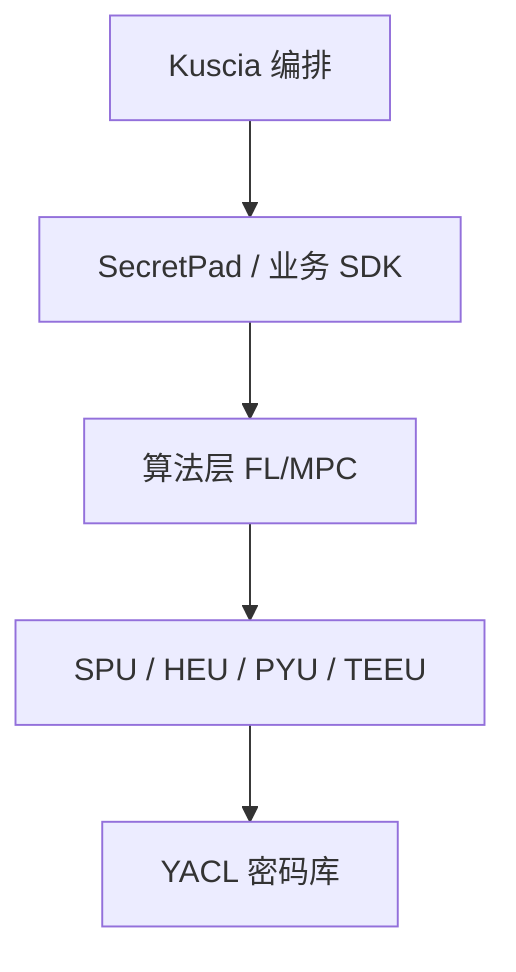

# P29 安全协作查询语言 SCQL

← [[BV1ser5BDESU-总览]] | ← [[P28-隐私集合求交PSI]] | 下一篇 → [[P30-基于K8S的跨域隐私计算应用编排框架Kuscia]]

## 视频信息

| 项目 | 内容 |
|------|------|
| 分集 | 安全协作查询语言 SCQL |
| 模块 | SecretFlow 生态 |
| 时长 | 27 分 51 秒 |
| 链接 | [B 站 P29](https://www.bilibili.com/video/BV1ser5BDESU?p=29) |
| 官方文档 | [SecretFlow 文档](https://www.secretflow.org.cn/zh-CN/docs) |
| 内容来源 | 知识点增强（数据要素流通技术体系，非逐字转写） |

## 核心要点

1. **本 P 主题**：安全协作查询语言 SCQL
2. **模块定位**：SecretFlow 生态
3. **考试/实践侧重**：SCQL 语法、安全多方 SQL、权限策略
4. **笔记层级**：教程级（约 3078 字），含速览、图解、场景 Walkthrough、自测题
5. **学习建议**：先通读「3 分钟速览」与「图解」，再读「详细讲解」；动手项见 Checklist

> 以下内容基于数据要素流通与隐私计算技术体系撰写，对应 B 站分 P「安全协作查询语言 SCQL」。**非 UP 逐字转写**；不看视频也可建立框架，看视频可对照「与视频对照表」深化。

## 本节在系列中的位置

**模块**：SecretFlow 生态 · 系列第 **P29/47** 集。

**建议前置**：[[隐私集合求交 PSI]]——建立本集所需背景。

**建议后续**：[[基于K8S的跨域隐私计算应用编排框架Kuscia]]——在本集能力之上继续深入。

依赖关系：政策(P01–P06) → 可信空间(P07–P08,P18) → 密态/隐私技术(P09–P24) → SecretFlow 工程(P25–P32) → 基础设施与案例(P33–P47)。

## 3 分钟速览

**安全协作查询语言 SCQL** 是数据要素流通体系中的关键一课。读完本节你应能回答：① 核心概念定义；② 在「供得出—流得动—用得好—保安全」链条中的位置；③ 与隐私计算技术栈的衔接。考试/面试侧重：**SCQL 语法、安全多方 SQL、权限策略**。

## 零基础导读

本节「安全协作查询语言 SCQL」属于 **SecretFlow 生态**。即便未看视频，也应先建立**制度—技术—场景**三层视角：政策类章节回答「为什么允许流」；技术类章节回答「如何安全地算」；案例类章节回答「真实行业怎么落地」。

第一遍阅读请盯住三个问题：本集**解决什么痛点**？**关键参与方**是谁？**交付物或能力边界**是什么？第二遍阅读时，把术语表抄到 Obsidian 双链笔记，与前后分 P 交叉引用。

## 详细讲解

### 1. SCQL 定义

**SCQL**（Secure Collaborative Query Language）是面向多方数据的安全协作 SQL，语法类似 SQL，语义保证各参与方仅获知查询结果中**自己有权限的部分**，不泄露其他方私有数据。

### 2. 支持的操作

| 操作 | 安全语义 |
|------|----------|
| SELECT | 投影列受策略限制 |
| JOIN | 等值连接不暴露非匹配行 |
| GROUP BY | 聚合结果满足最小计数阈值 |
| WHERE | 过滤条件密态或明文协作 |

### 3. 查询编译

SCQL 引擎将 SQL 解析为**执行计划**，算子映射到 PSI、MPC、明文算子组合，优化通信与轮次。

### 4. 权限模型

- **列级权限**：哪些列可被哪些方出现在结果中
- **行级策略**：最小群体大小（防重识别）
- **结果方**：指定谁接收输出

### 5. 典型场景

跨企业客户画像查询、联合统计分析、监管报送（多方数据汇总）。

### 6. 考试/实践要点

- 写一条两方 JOIN 的 SCQL 示例
- 说明 SCQL 与联邦学习的互补关系
- 解释最小计数阈值对隐私的保护

### 7. 与 BI 工具

SCQL 结果可接 Tableau/PowerBI（聚合后）；禁止明细导出需策略强制。

### 8. SQL 注入

SCQL 解析器需防注入；参数化查询与白名单表列。

### 9. 监管查询

监管机构可作为只读结果方参与 SCQL 项目，获取聚合统计而无法接触企业明细，实现「穿透式监管」隐私版。

### 10. 学习与实践检查单

- [ ] 对照本 P 标题回顾 B 站视频章节要点
- [ ] 在 [SecretFlow 文档](https://www.secretflow.org.cn/zh-CN/docs) 找到对应模块
- [ ] 能用一句话向同事解释本 P 核心概念
- [ ] 识别一个本行业可落地的应用场景
- [ ] 记录与前后分 P 的技术依赖关系

### 11. 模块知识串联
本讲属于「数据要素流通技术」体系中的重要一环。建议在学习日志中标注：输入依赖（前序知识）、输出能力（学完能做什么）、与隐语组件映射（SecretFlow/Kuscia/SecretPad/TEE）。完成 47 讲后应能独立设计一个「政策合规+连接器+隐私计算+审计存证」的端到端方案，并评估 MPC、TEE、联邦学习的选型依据。

### 工程落地提示（安全协作查询语言 SCQL）

学习本集时请在 SecretFlow 文档中打开对应组件页，边读边在架构图中**标注位置**。生产部署需同时考虑：网络互通（mTLS）、参与方 Domain 隔离、任务失败重试、审计日志留存。开发阶段优先用单机仿真验证逻辑，再迁移 Kuscia 集群。

## 图解

## 类比与直觉

SecretFlow 像**隐私计算的 Android 系统**：YACL/SPU 是芯片驱动，Kuscia 是任务调度，SecretPad 是桌面，开发者写应用即可。

## 例题与场景 Walkthrough

**场景：两家机构联合建模（不共享明文）**

1. **样本对齐**：若双方仅有交集用户有价值，先用 PSI（P21/P28）对齐 ID。
2. **特征拼接**：纵向联邦（P24）下 A 方持标签、B 方持特征，梯度通过安全聚合更新。
3. **训练执行**：在 SecretFlow SPU（P27）上完成密态前向/反向，或 TEE 内明文训练（P11–P17）。
4. **模型发布**：输出评分服务；模型参数经评估后按需出域，训练数据永不出域。
5. **本集关联**：安全协作查询语言 SCQL 提供其中 **SCQL 语法** 能力。

## 常见误区

1. **「学完本集就会用隐语」**：SecretFlow 生态需多集串联（P19–P32），单集只是拼图一块。
2. **「隐私计算等于不上传数据」**：数据仍以密文、份额或授权方式参与计算，网络与算力开销客观存在。
3. **「TEE 绝对安全」**：TEE 依赖硬件与侧信道防护，需远程证明（P17）与补丁策略。
4. **「区块链解决一切确权」**：链适合存证与交易撮合，大规模计算仍在链下隐私计算引擎。

## 与视频对照表

| 视频段落（约） | 预期演示内容 | 笔记对应章节 |
|-------------|------------|------------|
| 开篇 0%–15% | 本集目标、背景、与前后集关系 | 本节位置、3 分钟速览 |
| 前段 15%–40% | 核心概念定义与架构图 | 零基础导读、详细讲解 |
| 中段 40%–70% | 原理展开、对比、政策/代码示例 | 图解、类比、Walkthrough |
| 后段 70%–90% | 案例、问答、易错点 | 常见误区、Checklist |
| 收尾 90%–100% | 总结、延伸资源 | 延伸阅读、自测题 |

> 本集总时长约 **27分51秒**。无官方外挂字幕时，以分 P 标题「安全协作查询语言 SCQL」与上表主题对齐视频画面。

## 动手实践 Checklist

- [ ] 在 SecretFlow 文档搜索本集关键词（如 SCQL 语法）
- [ ] 找到对应 API/组件的配置示例
- [ ] 在 SecretPad 或脚本中定位该组件所处菜单/模块
- [ ] 复现文档最小示例或记录阻塞问题
- [ ] 与 P25 总架构图对照标注本集位置

## 延伸阅读

- [SecretFlow 文档中心](https://www.secretflow.org.cn/zh-CN/docs)
- TC609 可信数据空间相关标准
- 本系列相邻 2 个分 P 笔记

## 自测题

1. **本集核心考点？**  
   **答**：SCQL 语法、安全多方 SQL、权限策略。

2. **本集在四原则中的位置？**  
   **答**：保安全的技术实现。

3. **与 SecretFlow 的关系？**  
   **答**：本集直接讲隐语组件。

4. **一项落地检查？**  
   **答**：是否有授权、是否最小必要、是否可审计——三者缺一不可。

5. **30 秒口述本集？**  
   **答**：用「输入→处理→输出」各一句话概括（见 Walkthrough）。

## 关键术语

| 术语 | 说明 |
|------|------|
| 数据要素 | 可参与社会化配置、创造价值的数字化资源 |
| 隐私计算 | 数据可用不可见前提下实现协作计算的技术体系 |
| 模块 | SecretFlow 生态 |

## 与前后分 P 的衔接

- ← **隐私集合求交 PSI**（[[P28-隐私集合求交PSI]]）
- → **基于K8S的跨域隐私计算应用编排框架Kuscia**（[[P30-基于K8S的跨域隐私计算应用编排框架Kuscia]]）

## 逐字转写
> 引擎: whisper | 状态: 已转写 | 格式: 段落化

### [00:00 - 00:56] 大家好,欢迎观看数据要素流通技
大家好,欢迎观看数据要素流通技术穆克系列课程，本次课程我将向大家介绍安全协作查询研射口，我是来自马予米上科技的华国进，很高兴能以视频的形式和大家交流学习，在课程正式开始之前,有必要补充说明一下，之前我们已经在影视计算线上穆克第二期，向大家系统的介绍过了射口，本期课程则是在二期的内容基础之上，进行的更新录制，更新的点有两个，首先是部署模式的更新，二期以中心化部署模式进行了说明，本期则将基于P2P模式进行讲解，新支持的P2P模式因为不依赖可行第三方，它的部署更加灵活，其次则是实践Case的讲话，二期的实践包括中心化模式的讲解。

### [00:56 - 01:52] 和SecretNoteP2P模
和Secret Note P2P模式的演示，对应的模式不同意，不方便大家自行上手，因此这一期讲话的该流程，直接通过黑屏进行的P2P模式去进行Case的演示，学习过之前课程的同学建议重点关注变更部分，对中心化部署模式感兴趣的新同学，也建议回顾往期内容以进一步了解，ok，接下来我们进入到本期的课程内容，本次的课程内容主要有几下几个部分组成，第一部分将介绍联合数据分析场景，讨论该场景面临的问题和技术方案，从而引入射口，并对射口进行简单介绍，第二部分，则是深入射口的细节，介绍射口的CCL授权，射口的架构细节，以帮助大家进一步的理解和使用射口。

### [01:52 - 02:53] 第三部分
第三部分，这是一个简单上手，向大家演示，如何通过射口完成联合数据分析任务，接下来让我们开始第一部分的内容，联合数据分析和射口数据分析概念，想比大家都不陌生，通过数据分析，我们可以从海量的数据中挖掘出，我们感兴趣的信息，是一个典型的例子，比如你要统计公司的嫉妒盈利，那么你可以通过，买射口来完成这一项任务，这一类传统的数据分析场景的特点，是数据使用方拥有数据的所有权，因此有成熟的解决方案，而在联合数据分析场景中，事情往往会变得更加复杂，再举一个例子，比如一家药厂，想联合多家医院的数据，去研究药物的疗效，但它就会遇到如下问题。

### [02:53 - 03:48] 因为数据分散在多家机构里面
因为数据分散在多家机构里面，而且高度敏感，它没办法直接是有买射过十八克等，成熟方案去进行处理，针对这种需要在保障数据安全的前提下，联合多方数据进行分析的场景，目前有两种主流的技术路线，第一种是基于可信执行环境的方案，数据拥有方需要新疆自己的数据，加密上长到可信执行环境里面，然后在可信执行环境里进行计算，说新执行环境可以保证数据的安全，这种方式统称为T1E搜狗方案，第二种方式呢，这是数据不用出狱，但是每个数据拥有方需要部署一个计算节点，计算节点之间通过MPC协议完成计算，这种方案统称为MPC搜狗方案，这两种方案各有特点。

### [03:48 - 04:41] T1E搜狗的优点是效率更高
T1E搜狗的优点是效率更高，问题是数据要出狱，新鲜一个人在可信执行环境的硬件生产三分明，而且专有硬件也会带来额外的成本，MPC搜狗呢，则是用于不允许数据出狱的场景，是用通用硬件即可进行，确定是性能要低很多，可用但规模受限，搜狗采用的是MPC搜狗方案，搜狗的全程是secure collaborative query language，即核心能力就是支持多方联合数据分析，搜狗的设计初中，就是为了解决实际的业务场景，以降低联合数据分析业务的落地难度，而且也在迭代的过程当中，经历了各类业务的持续打磨，搜狗具有以下核心特征，首先在安全性上。

### [04:41 - 05:34] 它是基于办程序的安全模型
它是基于办程序的安全模型，搜狗提供了列级别的数据使用授权控制，这是搜狗有别于其他多方数据，珍惜系统的一点，在应用性上，搜狗支持了mansego版本的，搜狗语法，熟悉搜狗语法的人可以不同NPC协议，也写出多方数据分析的query，另外搜狗支持的语法和算质也很丰富，可以满足大部分的产力需求，搜狗内置的多种数据员，包括但不限于mansego Postgres CSV的，此外还支持多个产与方，包括典型的两方三方场景，在性能上，搜狗做了很多层次的性能优化，是的性能是可以使用的，包括可以支持一级别的PSI囚交，以及千万行的聚合等等。

### [05:34 - 06:24] 搜狗还可以支持多种密谈协议
搜狗还可以支持多种密谈协议，目前已经支持了三米两K，其他和ABYS3，用户可以根据产与方数量和性能自行选择，在了解了搜狗的基本特点后，接下来我们将对搜狗进行各深入的介绍，包括搜狗的CCL，搜狗的架构细节 关键优化等等，这些信息将对于后续安全 高效的使用搜狗进行帮助，首先我们来看CCL，CCL授权控制是搜狗的关键概率，在介绍什么是CCL之前，我们先来看看CCL是为了解决什么问题，因为搜狗很灵活，因此在多方灵活数据分析场景里面，可能存在着用户去位移勾到query来获取，原始数据的风险，比如直接select新据选出所有的数据明信。

### [06:24 - 07:16] 因此通常会结合4000
因此通常会结合4000，审核和适合审计联络手段来保证数据安全，其中4000审必需要在query资金前，获得所有参与方的审核确认，但是审核query对审核留言有较高的要求，需要具备分析query风险的能力，同时等所有参与方都审核通过的周期也比较长，影响效率，因此我们提出了基于CCL的安全保战模型，数据拥有方先设置数据的适用限制，如果select没有通过CCL检查就拒绝往下执行，审核人员只需要去检查通过CCL检测的query，从而来减轻审核的负担，此外CCL还提供了额外的好处，select可以根据用户的CCL授权对算法进行优化。

### [07:16 - 08:01] 在默认情况下
在默认情况下，计算都是在全密胎下进行的，整体的算法性能不佳，但如果用户进行了相关CCL授权，这可以使用遵循CCL限制的高效算法，以显著来提升系统性能，比如如果用户设置了PanTechSaf的胶案的CCL，允许去发挤方得到交集ID，那么系统就可以通过psi算法，来替换密胎胶案的算法，计算速度可以提升两到三个数量级，接下来是CCL的具体定义，CCL的全程是column control list，它是定义了一个三元组，sauce column,desk party, or constant。

### [08:01 - 08:43] 表示数据拥有方允许某些数据sa
表示数据拥有方允许某些数据sauce column，被某个差异方desk party，以某种约束条件进行数据访问，就比如右下角Alys拥有数据表TVA，它的serrary字段对Bob的使用约束，是PlanTechSaf's aggregate，什么意思呢?，表示Bob只能看到这个字段聚合后的结果，即通过some average max min等操作之后，才可对Bob可见，CCL是一种约束机制，使得数据拥有者可以使用CCL，描述美丽数据在使用过程中的约束，数据分析引擎则确保，所有执行过程都严格满足该约束条件。

### [08:43 - 09:24] 需要注意的是CCL和安全之间
需要注意的是CCL和安全之间，不是一个线人的关系，不满足CCL约束的一定版权，但满足CCL约束也不一定安全，CCL目前定义了8种约束，比如Zantax在允许以任何形式，包括名文去进行计算和披露，没有任何使用上的限制，通常用于非民感数据，建议谨慎使用，一般来说，表的每一列对数据O都是PlanTechS，但对其他差异方，不建议设设PlanTechS，在比如PlanTechS After join，允许作为Inner join key，经过join后，可以名文披露，在比如PlanTechS After aggregate。

### [09:24 - 10:04] 需要列经过Aggregatio
需要列经过Aggregation操作，比如Some Average的这样子的结果，才是可以名文披露的，其他的CCL在这里就不再追溯了，大家可以自行暂停查看，然后我们再看一个CCL授权的例子，假设iList拥有表TA，报告拥有表TB，借一点ID对iList的约数是PlanTechS，TB.ID对iList约数是PlanTechS After join，这TB.ID和TB.ID的join后的结果，对于iList是可见的，而TB.column1对iList约数是PlanTechS After aggregate。

### [10:04 - 10:42] TB.column1需要经过聚
TB.column1需要经过聚合操作，才可以对iList可见，因此当iList尝试执行，如下query selectTB.ID，TB.column1 fromTB，in the join TA onTB.ID等于TA.ID的时候，因为它尝试直接获取TB.column1，不符合CCL的约数就会教育不同过，然后如果iList把query改成，selectTB.column1的arrange结果，那么它就可以满足CCL的约数，获取最终的结果，接下来介绍seco的系统组成。

### [10:42 - 11:24] Gilvy模式下seco系统由
Gilvy模式下seco系统由seco block和seco engine组成，各个参与方都需要自己部署独立的seco block和seco engine，以右图为例，iList和BobG部署了自己的seco组件，然后通过网络一起构成联合数据分析平台，集中seco block作为P2P的核心模块，主要有三个功能，首先是需要和用户进行交互，其次是负责block之间的状态同步，最后是seco的珍惜和作业调度，需要将seco的查询，转换成明明纹混合的执行图，并调度到本地的seco engine去执行，而seco engine呢。

### [11:24 - 12:04] 则是一个明明纹混合执行引擎
则是一个明明纹混合执行引擎，不同参与方的seco engine可以协作完成多方分析任务，本地的seco engine会将结果汇报给seco block，seco engine是在NPC框架secret flow SPO的组织上实现的，那么当seco收到用户发起的query后进行了哪些处理呢，如图是seco的详细架构，用户发起的query会捅不到所有的seco block，block首先会创建session manager，session manager会教育用户的身份信息，检查通过后。

### [12:04 - 12:50] query会经过part的解析
query会经过part的解析成与发数ast，接着planner将ast构建成逻辑执行计划，chance later将逻辑执行计划翻译成密探执行图，在翻译之前会进行CCL教验，只有CCL检查通过了才会进入下一步，chance later是seco的核心，它会在多种约束条件下选择最佳的协议，结合协议的特点数据状态分布选择最佳的执行逻辑，比如针对Guru带操作，seco就实现了四种协议，然后graph optimizer会用图优化算法对自行图进行优化，比如节点合并和消除等等，这里得到的图还是一张传辑图。

### [12:50 - 13:42] graphsplitter会将
graph splitter会将图按照参与方进行切分，每个参与方只会看到自己参与的计算节点，构成的指图，各个block只会进行指图的教验，并砸给seco engine进行执行，在进一步了解了seco后，第三部分我们将通过一个简单的case，来实际上手一下seco，结合时间来加征一下理解，假设有这样一个业务场景，金融机构埃利斯想联合第三平台bob，做联合用户的画像分析，首先埃利斯拥有User credit的表，这张表记录了用户的信息等级年龄，收入信息，bob则拥有User status表，记录了用户在电厂平台的交易额，活跃状态的。

### [13:42 - 14:33] 埃利斯希望统计不同信用等级下
埃利斯希望统计不同信用等级下，年龄在二十到三岁之间，写为电厂平台，bob活跃用户的人数，以及其平均收入和平均交易额，通过query表达无忧图所示，那么，埃利斯bob像如何通过seco，来完成这一联合分析呢，seco的使用流程主要分为三个步骤，首先是完成系统部署，然后是进行项目设置，最后就可以进行联合数据分析了，其中项目设置还可以进一步，划分成创建项目，用户邀请数据授权等等操作，在完成这些操作之后，埃利斯和bob就可以去做数据分析任务了，接下来让我们进行实际的操作，我后续会在黑屏命令行进行操作说明，ok。

### [14:33 - 15:26] 接下来我将基于seco官方的快
接下来我将基于seco官方的快速开始文档，向大家展示一下，seco从部署到配置，然后再到进行联合分析的整体流程，seco支持两种部署架构，甚别是中性化和pdp，我们掩饰的是pdp架构，这里我们会给每个餐饮方都部署seco engine，和seco block，我的掩饰环境是macbook pro m1，当然在安装了linux系统的机器，或者虚拟机里面也都可以进行同样的操作，接下来我们参考文档开始一步一步的操作，首先是客龙仓库，如果大家之前没有用过github，可能需要去github上面注册一下账户，网上有很多相关教程。

### [15:26 - 16:34] 大家自行参考操作即可
大家自行参考操作即可，ok，接下来是构建block controller，block controller是我们提供的一个命令行工具，它可以减化于block的交互，另外强调一下，因为当前seco经向是纪约0.9.3B1Tag打的，这里我先切一下分支，避免编印出来的block controller，比经向更新，然后带来额外的问题，大家操作的时候，建议使用bith hub上面最新的，release tag对应的分支就可以了，然后我这里也提前安装好了，比较新的构，ok，接下来开始构建，大家如果遇到编印上的问题，可能需要自行更新一下构的版本。

### [16:34 - 17:46] 接下来就是
接下来就是，一些配置的触实化，我们这里会使用setup.sh的脚本来完成，setup.sh这个脚本，它会自动去生成公司药，然后方便我们后面通过dalk，去拉起服务，对于触实化的细节感兴趣的话，大家可以去自行参考文件细节，从这里可以看到，已经，脚本已经自动生成了公司药，以及对应的证书，接下来我们将通过dalk compose来，启动设购服务，为了掩饰方便，我们会拉起Alice，和Bob的，block和engine，在实际的生产环境里面，Alice Bob应该是独立拉起来的，交换公司药之类的配置也会更复杂，具体可以参考我们独立部署的文档说明。

### [17:46 - 19:01] ok
ok，这一步操作的话，它是依赖dalk的，然后如果你的环境里面没有dalk的话，也建议提前安装一下，然后再重视这个指令，我们看一下它的启动状态，ok，这里是已经启动了，接下来我们就在，Alice上面创建项目，然后去邀请Bob参加，加入我们的项目，上面这个窗口就是Alice，下面这个就当做Bob吧，然后在我们的dalk compose环境里面，Alice的block是坚定的8081窗口，Bob坚定是8082窗口，ok，那我们先在Alice这边创建项目吧，创建项目成功，接下来我们可以查看一下，项目的具体信息，可以看到项目里面，有它的项目的名称ID。

### [19:01 - 19:19] 以及项目的创建者
以及项目的创建者，项目的成员，还有配置的项目的一些康复信息，创建完项目之后，我们就可以去邀请其他成员了。

### [19:34 - 19:44] 这里我们使用的是
这里我们使用的是，broker controller的invite的这个指令，不负这个问题，然后这里我们可以看到Bob接收到了，邀请的信息。

### [19:50 - 21:18] Bob如果确认了邀请里面的项目
Bob如果确认了邀请里面的项目的这个信息，然后ok的话，他就可以来加入这个项目，Bob这里可以看到，也可以看到项目的一些信息，包括项目的名称，创建者，然后，名员以及项目的一些配置，ok，接下来Bob会通过process invitation来，加入这个项目，然后Bob加入项目之后，我们再在Alice这边再看一下，项目信息，这里可以看到成员信息，真新增了一个报告，这样子项目的成员邀请就完成了，邀请完成后，各个项目成员需要根据业务场景，去将数据表注册进项目，并完成授权，我们先完成数据表的创建，Alice会将接一表注册进项目，接一表的话，他有4列。

### [21:18 - 22:38] 包括ID信用等级
包括ID信用等级，收入 年龄等等，然后这里的reftable和db type，是指的表的实际位置，表示TA表实际对应mySQL数据库里面的，Alice.userCredit表，数据表的注册只是在项目里面建了一个逻辑表，实际的数据还是在实际的表的位置里面，接下来我们看一下表的员信息，ok，Alice这边就把表注册进去了，接下来我们在Bob这边，同样把tb表注册进项目，tb表的话，它也包含ID列，然后还有定当数量以及活跃状态，实际的物理表是Bob.userStatus，我们同样确认一下表的员信息，包括列，以及实际的表的位置。

### [22:38 - 23:52] 还有这里的owner信息等等
还有这里的owner信息等等，默认情况下，项目成员是没有权限使用数据表里面的数据的，只要表的owner被项目成员进行实际和授权，接下来我们，先完成TA表的授权，TA表的owner是Alice，Alice会先给自己授予所有数据的PlanetX权限，ok，Alice先给自己授予了ID列，ID的rank，这几列的，都给自己授权成了PlanetX权限，接下来他需要给Bob，授予对应列的权限，对于Bob的话，Alice只希望在联合分析的时候，尽量去保护自己的数据安全，因此只授予了必要的这些权限。

### [23:52 - 24:34] ID列的话是授予了Planet
ID列的话是授予了PlanetX AfterGruBad权限，这样ID列就可以用作journ key，然后Credit列的话，是授予了PlanetX AfterGruBad权限，这样子CreditRank就可以作为GruBad分组列了，然后是Income，是授予了PlanetX AfterGruBad权限，Bob就只能看到Income的聚合信息，包括Average、Mimx之类的，然后Age的话是授予了PlanetX AfterCompare权限，这样子Age列就可以用来做一些数据的过滤，ok。

### [24:34 - 25:50] 这样子Alice对TA表就完成
这样子Alice对TA表就完成了授权，接下来是Bob对TB表的授权，同样的Bob先给自己授予了，所有数据的PlanetX权限，然后给Alice授予的权限在这里，Bob给Alice授予了TA表里面，ID列的PlanetX AfterGruBad权限，然后一次Active的话，是授予了PlanetX AfterCompare权限，OrderMount是授予了PlanetX AfterGruBad权限，是授予了PlanetX AfterGruBad权限，两边都授权完成了之后，Alice可以查看自己的CCL授权情况，然后确认一下。

### [25:50 - 27:10] Alice拥有TA表的所有列的
Alice拥有TA表的所有列的PlanetX权限，然后拥有TB表的权限，是刚刚Bob授予的这个权限，这里确认一下没有问题，接下来我们再看一下Bob拥有的一些权限，同样Bob他会拥有TB表的所有列的PlanetX权限，然后对于TA表的话，就是Alice给他授予的这一些权限，完成所有配置之后，Alice和Bob就可以，进行联合数据分析任务了，我们从Alice这边作为发起方来发起这个任务，OK 这里我们就完成了数据分析，然后这下面这个打印出来的是分析的结果，要注意的是这里有一个互联信息，这里是为了避免用户通过。

### [27:10 - 27:49] minmaxaverage之类
min max average之类的操作来反对原始数据，默认情况下我们就会把这种，少于4条的这种Group分组给删除掉，然后如果大家对联合数据分析的具体流程，感兴趣的话也可以通过Block，安装的日制去做进一步的分析，时间关系我这里就不做展开了，OK 以上就是本次课证的全部内容了，最后也欢迎大家实际上手使用设购，参与到我们设购的开源建设中来，甚至在实际场景中应用设购去解决实际的问题，感谢大家的时间，再见。

## 来源说明

- ✅ B 站官方元数据（`Tools/BV1ser5BDESU-full.json`）
- ✅ 分 P 首帧封面（`Tools/bili-fetch/fetch-bilibili.js`）
- ✅ **教程级增强**：含图解/Mermaid、场景 Walkthrough、自测题（约 3078 字，2026-06-06）
- ⏳ 逐字转写：B 站 API 无外挂字幕轨；可选 Whisper/BiliNote 后续补充

## 关键截图

![[../../06-资源附件/video-notes-images/BV1ser5BDESU-P29-cover.jpg|B站首帧 P29]]
