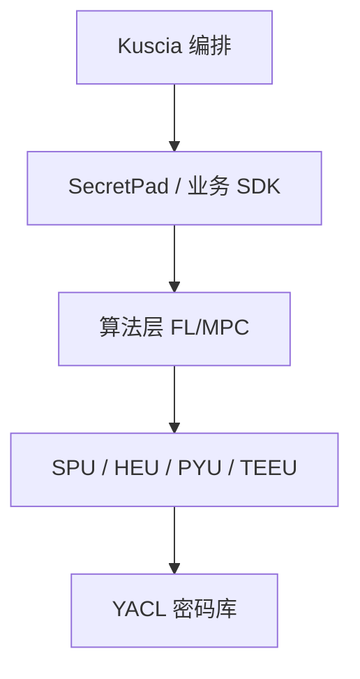

# P31 隐语开源版SecretPad导论

← [[BV1ser5BDESU-总览]] | ← [[P30-基于K8S的跨域隐私计算应用编排框架Kuscia]] | 下一篇 → [[P32-KusciaAPI的相关概念和场景实践-正式版]]

## 视频信息

| 项目 | 内容 |
|------|------|
| 分集 | 隐语开源版SecretPad导论 |
| 模块 | SecretFlow 生态 |
| 时长 | 24 分 48 秒 |
| 链接 | [B 站 P31](https://www.bilibili.com/video/BV1ser5BDESU?p=31) |
| 官方文档 | [SecretFlow 文档](https://www.secretflow.org.cn/zh-CN/docs) |
| 内容来源 | 知识点增强（数据要素流通技术体系，非逐字转写） |

## 核心要点

1. **本 P 主题**：隐语开源版SecretPad导论
2. **模块定位**：SecretFlow 生态
3. **考试/实践侧重**：SecretPad 可视化、项目/参与方/组件
4. **笔记层级**：教程级（约 3171 字），含速览、图解、场景 Walkthrough、自测题
5. **学习建议**：先通读「3 分钟速览」与「图解」，再读「详细讲解」；动手项见 Checklist

> 以下内容基于数据要素流通与隐私计算技术体系撰写，对应 B 站分 P「隐语开源版SecretPad导论」。**非 UP 逐字转写**；不看视频也可建立框架，看视频可对照「与视频对照表」深化。

## 本节在系列中的位置

**模块**：SecretFlow 生态 · 系列第 **P31/47** 集。

**建议前置**：[[基于K8S的跨域隐私计算应用编排框架Kuscia]]——建立本集所需背景。

**建议后续**：[[KusciaAPI的相关概念和场景实践-正式版]]——在本集能力之上继续深入。

依赖关系：政策(P01–P06) → 可信空间(P07–P08,P18) → 密态/隐私技术(P09–P24) → SecretFlow 工程(P25–P32) → 基础设施与案例(P33–P47)。

## 3 分钟速览

**隐语开源版SecretPad导论** 是数据要素流通体系中的关键一课。读完本节你应能回答：① 核心概念定义；② 在「供得出—流得动—用得好—保安全」链条中的位置；③ 与隐私计算技术栈的衔接。考试/面试侧重：**SecretPad 可视化、项目/参与方/组件**。

## 零基础导读

本节「隐语开源版SecretPad导论」属于 **SecretFlow 生态**。即便未看视频，也应先建立**制度—技术—场景**三层视角：政策类章节回答「为什么允许流」；技术类章节回答「如何安全地算」；案例类章节回答「真实行业怎么落地」。

第一遍阅读请盯住三个问题：本集**解决什么痛点**？**关键参与方**是谁？**交付物或能力边界**是什么？第二遍阅读时，把术语表抄到 Obsidian 双链笔记，与前后分 P 交叉引用。

## 详细讲解

### 1. SecretPad 定位

**SecretPad** 是隐语开源的**隐私计算 Web 平台**，提供可视化项目创建、参与方管理、组件拖拽编排、任务运行与结果查看，降低非开发人员使用门槛。

### 2. 核心功能

| 功能 | 说明 |
|------|------|
| 项目管理 | 创建协作项目、邀请参与方 |
| 组件库 | PSI、联邦、预测、预处理等 |
| 画布编排 | 拖拽连线定义 DAG |
| 任务运行 | 提交到 Kuscia/本地后端 |
| 结果下载 | 模型、报表、日志 |

### 3. 版本区分

- **开源版**：本地部署，适合学习与小规模 PoC
- **企业版**：多租户、权限、审计增强（若有）

### 4. 使用流程

1. 部署 SecretPad + Kuscia + SecretFlow
2. 注册节点与证书
3. 新建项目，添加数据源
4. 拖拽组件（如 PSI → 纵向联邦）
5. 配置参数，提交运行
6. 各方授权后任务执行

### 5. 适用人群

业务分析师、数据科学家、合规人员——无需手写 MPC 协议，但需理解组件语义与数据准备。

### 6. 考试/实践要点

- 完成 SecretPad 官方教程一个完整项目
- 说明画布 DAG 与 SecretFlow 脚本的关系
- 列举三类常用组件及输入输出

### 7. 权限 RBAC

SecretPad 项目管理员、数据科学家、审计员角色分离；操作留痕。

### 8. 多语言

界面中文；组件文档中英对照，算法参数有 tooltips。

### 9. 培训路径

业务人员 2 天 SecretPad 培训即可跑通 PSI+联邦；研发人员需 1–2 周掌握 SecretFlow Python API。

### 10. 学习与实践检查单

- [ ] 对照本 P 标题回顾 B 站视频章节要点
- [ ] 在 [SecretFlow 文档](https://www.secretflow.org.cn/zh-CN/docs) 找到对应模块
- [ ] 能用一句话向同事解释本 P 核心概念
- [ ] 识别一个本行业可落地的应用场景
- [ ] 记录与前后分 P 的技术依赖关系

### 11. 模块知识串联
本讲属于「数据要素流通技术」体系中的重要一环。建议在学习日志中标注：输入依赖（前序知识）、输出能力（学完能做什么）、与隐语组件映射（SecretFlow/Kuscia/SecretPad/TEE）。完成 47 讲后应能独立设计一个「政策合规+连接器+隐私计算+审计存证」的端到端方案，并评估 MPC、TEE、联邦学习的选型依据。

### 工程落地提示（隐语开源版SecretPad导论）

学习本集时请在 SecretFlow 文档中打开对应组件页，边读边在架构图中**标注位置**。生产部署需同时考虑：网络互通（mTLS）、参与方 Domain 隔离、任务失败重试、审计日志留存。开发阶段优先用单机仿真验证逻辑，再迁移 Kuscia 集群。

## 图解

## 类比与直觉

SecretFlow 像**隐私计算的 Android 系统**：YACL/SPU 是芯片驱动，Kuscia 是任务调度，SecretPad 是桌面，开发者写应用即可。

## 例题与场景 Walkthrough

**场景：两家机构联合建模（不共享明文）**

1. **样本对齐**：若双方仅有交集用户有价值，先用 PSI（P21/P28）对齐 ID。
2. **特征拼接**：纵向联邦（P24）下 A 方持标签、B 方持特征，梯度通过安全聚合更新。
3. **训练执行**：在 SecretFlow SPU（P27）上完成密态前向/反向，或 TEE 内明文训练（P11–P17）。
4. **模型发布**：输出评分服务；模型参数经评估后按需出域，训练数据永不出域。
5. **本集关联**：隐语开源版SecretPad导论 提供其中 **SecretPad 可视化** 能力。

## 常见误区

1. **「学完本集就会用隐语」**：SecretFlow 生态需多集串联（P19–P32），单集只是拼图一块。
2. **「隐私计算等于不上传数据」**：数据仍以密文、份额或授权方式参与计算，网络与算力开销客观存在。
3. **「TEE 绝对安全」**：TEE 依赖硬件与侧信道防护，需远程证明（P17）与补丁策略。
4. **「区块链解决一切确权」**：链适合存证与交易撮合，大规模计算仍在链下隐私计算引擎。

## 与视频对照表

| 视频段落（约） | 预期演示内容 | 笔记对应章节 |
|-------------|------------|------------|
| 开篇 0%–15% | 本集目标、背景、与前后集关系 | 本节位置、3 分钟速览 |
| 前段 15%–40% | 核心概念定义与架构图 | 零基础导读、详细讲解 |
| 中段 40%–70% | 原理展开、对比、政策/代码示例 | 图解、类比、Walkthrough |
| 后段 70%–90% | 案例、问答、易错点 | 常见误区、Checklist |
| 收尾 90%–100% | 总结、延伸资源 | 延伸阅读、自测题 |

> 本集总时长约 **24分48秒**。无官方外挂字幕时，以分 P 标题「隐语开源版SecretPad导论」与上表主题对齐视频画面。

## 动手实践 Checklist

- [ ] 在 SecretFlow 文档搜索本集关键词（如 SecretPad 可视化）
- [ ] 找到对应 API/组件的配置示例
- [ ] 在 SecretPad 或脚本中定位该组件所处菜单/模块
- [ ] 复现文档最小示例或记录阻塞问题
- [ ] 与 P25 总架构图对照标注本集位置

## 延伸阅读

- [SecretFlow 文档中心](https://www.secretflow.org.cn/zh-CN/docs)
- TC609 可信数据空间相关标准
- 本系列相邻 2 个分 P 笔记

## 自测题

1. **本集核心考点？**  
   **答**：SecretPad 可视化、项目/参与方/组件。

2. **本集在四原则中的位置？**  
   **答**：保安全的技术实现。

3. **与 SecretFlow 的关系？**  
   **答**：本集直接讲隐语组件。

4. **一项落地检查？**  
   **答**：是否有授权、是否最小必要、是否可审计——三者缺一不可。

5. **30 秒口述本集？**  
   **答**：用「输入→处理→输出」各一句话概括（见 Walkthrough）。

## 关键术语

| 术语 | 说明 |
|------|------|
| 数据要素 | 可参与社会化配置、创造价值的数字化资源 |
| 隐私计算 | 数据可用不可见前提下实现协作计算的技术体系 |
| 模块 | SecretFlow 生态 |

## 与前后分 P 的衔接

- ← **基于K8S的跨域隐私计算应用编排框架Kuscia**（[[P30-基于K8S的跨域隐私计算应用编排框架Kuscia]]）
- → **KusciaAPI的相关概念和场景实践-正式版**（[[P32-KusciaAPI的相关概念和场景实践-正式版]]）

## 逐字转写
> 引擎: whisper | 状态: 已转写 | 格式: 段落化

### [00:00 - 00:57] 大家好,欢迎参加本课程,我是蚂
大家好,欢迎参加本课程,我是蚂蚁蜜酸的开发,我叫文愿,非常荣幸能够向大家介绍,引语开元版pad。本次课程主要分成以下几个部分,第一部分简单介绍一下secretpad,主要包括产品的定位,产品的架构,后续我会把secretpad简称为pad。第二部分是快速上手,将给大家演示pad接电的安装部署以及如何创建、运行、训练流。第三部分是按理分析,会向大家介绍如何使用pad为联合穿人以及金融风控两个场景提供解决方案。第四部分深入剖析,向大家介绍pad与引语其他产品之间的关系,以及pad的架构。

### [00:57 - 01:54] 第五部分介绍一下开元版pad的
第五部分介绍一下开元版pad的规划,下面让我们进入第一部分pad的介绍。首先我们来讲一下pad的定位,pad的用户主要可以分成两大类,第一大类是直接使用者,第二大类是开发集成者。对于直接使用者来说又可以分成两小类,对第一小类用户来讲得益于拖拉拽的交互方式pad很容易上手,既适合用户自己体验,也适合向他人演示,比如现在的我。对第二小类用户来讲,pad提供的能力可以直接解决业务场景问题,这类用户可以直接使用pad进行研发,并用于实际生产,实际上pad在业界已经有了比较多的实际应用。

### [01:54 - 02:45] 而对于第二大类用户来讲,开发集
而对于第二大类用户来讲,开发集成者,pad已有了功能是无法直接满足他的业务需求的。这个时候pad则起到了最佳实践样本间的作用,开发者可以参照pad把益于底层的能力集成进自己的系统。而得益于益于的优秀设计,开发者仅需满足标准化接口,就可以集成,从而对不同行业进行商业化定制。介绍完pad的定位,我们再来看看pad的产品架构分层,以及不同的合作模式。pad的产品架构可以分成四层,第一,存数据接入业务运营层,这一块的话蚂蚁,以及银语基本上是不参与的。

### [02:45 - 03:36] 第二块产品方案层,这一层银语p
第二块产品方案层,这一层银语pad总结了一些常见的解决方案,其实主要就是联合券人还有金融风控。第三层隐私计算平台层及pad层,第四层隐私计算软子服务,主要包括了secret flow,枯下等能力。我们可以再看看右边的这三个举行框,就在这里,对。对于最左边的用户来讲,银语pad提供的解决方案,就可以满足它的业务需求,业务方直接使用就好了,比如说联合券人这个场景。而中间的用户pad提供的这两个解决方案并不能直接满足需求,它就需要基于pad进行开发。

### [03:36 - 04:32] 最右边的要求是最高的,pad的
最右边的要求是最高的,pad的现有能力并不能满足需求,它们只能直接集成底层的算子。其实我们可以看到,左边这两个模式其实就对于上叶PPT的第一大的用户,而右边的这个模式就对于上叶PPT的第二大的用户,集成开发者。OK,现在我们进入第二部分,快速上手。首先介绍下安装pad的软硬件要求。操作系统的话,Mac、Linux、Windows都支持,但实际使用中不可推荐使用Windows系统。然后硬件是需要8核16G、200G的硬盘。Docker是必须的推荐20.10.24或更高版本。

### [04:36 - 05:23] 好了,确认自己的系统符合要求后
好了,确认自己的系统符合要求后,大家就可以去引语官网下载对应的安装包并解压。进入了解压目录后就可以安装部署。我这里是以Linux下P2P模式的安装部署为例的。我会安装两个autonomy节点,分别叫做Alice和Bob。我的安装脚本也已经提前准备好了,只需要执行即可。好,现在给大家播放一下之前录制好的安装视频。这是我们的安装命令,具体每个参数的含义,大家可以通过Install脚本的GunHelp命令得到。这里我们简单介绍其中的几个,一个是autonomy,表示我们以P2P模式安装部署节点。

### [05:24 - 07:19] 第二个GunAlice,表示我
第二个GunAlice,表示我们节点名称是Alice。第三个GunS8081,以及第四个GunP8084,这两个的话我们后续会用到。好,我们现在执行脚本。整个过程大概需要一分多钟。如果需要的话,大家可以跳过。这里的话我们不需要保存,直接选择N。请大家耐心等待,或者快进。全新安装依然选择N。我们可以使用默认的机构名,也可以使用默认的用户名Admin。密码的话需要输一个符合规则的。我这里直接使用这个,需要输入两遍。大家可以看到,登录名Admin,然后密码也是刚才设置的。

### [07:19 - 08:24] 然后可以看到整个安装时间90秒
然后可以看到整个安装时间90秒1分半。然后这个告诉我们如何访问。8081,但因为我这个是用的服务器,，所以我需要拿到服务器的出口IP,8.130.66.88。这个因为我之前已经访问过了,所以我直接在这里访问就行了。然后我输入刚才设置的用户名和密码,然后登录成功。好了,这样的话,我们的Alice节点就安装成功了。Bob节点的话可以用相同的方式。同一个机器上的话,我们只需要把对应的各个端口修改成不一样的即可。好的,通过视频中的操作,我们已经安装好了Alice和Bob两个节点了。现在就可以添加合作节点。

### [08:24 - 09:24] 大家现在看到的就是添加合作节点
大家现在看到的就是添加合作节点的界面。这里面除了通讯地址需要修改,其他都不用。从这张图上,大家可以看到它的是支持多个通信协议的。图中显示的是MTRS,也支持NoTRS。对于MTRS协议,通讯地址的前坠需要为HTDBS。端口号就是刚才部署脚本中配置的杠P参数,，派的人还提供的一键添加合作节点的功能。在配置完通讯地址后,复制这里的节点认证码。在对方节点添加合作节点页面粘贴即可。对,就是在这个地方。此外,出于安全性的考虑,添加合作节点是需要双向收船的。

### [09:24 - 10:28] 操作上讲就是Alice需要把B
操作上讲就是Alice需要把Bob添加为自己的合作节点。Bob也是需要把Alice添加为自己的合作节点。这个在后续的实操视频中,大家也可以看。好了,添加完合作节点后,我们就可以创建合作项目。这里我们可以看到是可以灵活的选择多组节点的。就这里我可以本方节点,可以选择对方节点也是可以做选择的。创建完合作项目后,下一步就是准备数据。派的人支持多组数据员,比如说本地,还有OSS, ODPS, MyCircle等。在pad里面,数据的受损力度是细化到了项目的,本地数据。

### [10:28 - 11:32] 完成上述步骤后,就可以创建任务
完成上述步骤后,就可以创建任务并执行了。我们可以简单介绍一下任务相关的功能。第一的话,支持普通任务,也支持定时周期任务,，然后有丰富的组建选择,比如说很多的日出礼,训练以及预测组建。其他的就不一一介绍了,大家可以自行体验。下面介绍一下模型发布。当用户训练好一个模型后,就可以打包并发布,从而直接用于生产环境。这里的话也是有比较多的东西可以配置的,大家可以看到。CPU、自然都可以配置的。好的,我现在就给大家播放下从天家合作节点到自行训练流的视频。

### [11:33 - 12:45] 我们已经分别登录了Alice这
我们已经分别登录了Alice这个节点,以及Bob这个节点。第一步的话,我们要天家合作节点。天家合作节点的话,我们是要修改它的通顺地址。我们先看一下通顺地址通过if-fig的命令。然后gmp的端口号是8084,因为采用了http-m-tls协议,所以我们要加上https的前坠。我们把Alice的通顺地址修改正确,然后同样需要把Bob的通顺地址修改正确。这里除了gmp的参数不一样,其他都一样,8184。好,我们现在在天家合作节点,将Bob添加为Alice的合作节点,需要在Alice操作。

### [12:45 - 13:55] 可以看到计算节点这是Bob,然
可以看到计算节点这是Bob,然后本方节点我们选择Alice通顺地址,好,确定。OK,我们需要再次把Alice的添加为Bob的合作节点用相同的方式。对方节点本方节点就是要Bob了,好,确定。可以看到通顺状态已经从不可能变成可用了,也是可用了。合作节点添加好以后,我们就可以创建项目了。项目的话我们给个test名称,描述不需要,可以不填。本方节点我们填Alice,然后受到节点我们就填Bob,点击创建。创建一个项目的话是需要对方节点同意的。所以我们进入Bob的节点,然后点击同意,当然你可以。

### [13:55 - 15:32] 这个时候因为项目还没有任何授权
这个时候因为项目还没有任何授权的数据,，所以没法进行任何的工作,我们来添加数据,给Alice添加一个Alice的数据。然后可以看到它的特征,名称很少,因为是测试用的。我们需要把Alice这张表受传给test的这个项目,，同样在Bob这一测也要做相同的操作,添加数据,添加一个Bob的数据。名字同样时候受传,然后确认。OK,这样完成以后的话,我们就可以进入项目,然后创建一个训练楼了。这里我们以联合全人受传的Alice,关联键的话是I-D1,。

### [15:32 - 16:37] 项目表Bob,关联键的话是I-
项目表Bob,关联键的话是I-D2,然后特征的话我们就选择所有的特征,，结果接入方我们两边都选上,然后需要保存,保存完以后我们点击全部执行。绿色的勾表明组件的执行是成功的,然后这个穿穿表明组件正在执行中,已经执行成功了。好了,体验完派的基本安装操作流程后,我们就进入第三部分,，按理分析,进一步介绍如何使用派的完成联合全人金融风控的任务。首先,我们可以先宏观的了解一下派的的应用场景,从这张图中我们可以看到,，从产业角度来讲,派的是可以广泛应用于不同领域的丰富场景的,。

### [16:37 - 17:23] 比如说银行业的智能风控,保险业
比如说银行业的智能风控,保险业的荷包礼配,还可以用于政务,医疗,交通,媒体等各个行业。从社会角度讲,派的可以用于链接不同的行业实体间的数据孤岛,从而释放数据要素价值。好,刚刚讲完了那些高大唱的,我们再来看看联合圈人,也可以叫营销圈人这个场景。首先,向大家介绍一下这个概念,以保险公司和蚂蚁的合作为例,大家都知道保险公司肯定是有自己的客户数据的,，而蚂蚁集团也是有自己的客户数据,这两份数据的用户通常会有一部分重合,也有一些不重合的,。

### [17:23 - 18:24] 而保险公司会希望在不获取蚂蚁客
而保险公司会希望在不获取蚂蚁客户距离信息的情况下,找到和自己客户重合或者不重合的部分,，从而进行更精准的营销,这个我们就叫它营销圈人,要解决营销圈人场景的问题,，主要用到的就是隐私囚交组件,对大家可以看到就是这个组件。现在我们就稍微介绍一下隐私囚交组件,可以看到这个组件是有三部分的,，这一块就上面的这两个点点穿穿,叫它的输入装,，然后下面的这个叫它的输出装,然后右边的这块叫它的输信,输信也可以理解为配置,，实际上派的所有的组件都是由这三部分组成的,，隐私囚交顾名思义就是在不泄露各方隐私信息的情况下,。

### [18:24 - 19:29] 获得双方的交集还是以保险公司和
获得双方的交集还是以保险公司和蚂蚁的合作为例,，假设保险公司用户身份证号分别是零一二一直到十,，而蚂蚁用户的身份证号分别就是比如说八九十一直到一百一千,，那么隐私囚交的结果就是八九十,，然后我们介绍一下隐私囚交这个组件比较重要的属性,，比如说右边的KISS SE和KISS S2其实就对应了我们刚才讲到的那个身份证号,，然后不同的囚交协议的话是用于不同的场景可以看到了,，比如说有了协议它更适合于高贷款的场景,，所以我们还可以选择囚交类型,，InnerJoin等等还可以选择结果的接收方,，简单了解了隐私囚交组件后,。

### [19:29 - 20:27] 我们再来看一下金融封控这个场景
我们再来看一下金融封控这个场景,，也可以叫做二分类建模,，比如说一家银行它需要判断某个人是否有违约风险,，从而决定是否发放贷款信用卡给这个人,，而因为一家银行掌握的这个用户的信息是有限的,，或者说它根本就没有为了提高分类的准确性,，它就可以结合其他第三方比如说蚂蚁的信息来进行联合建模,，从而提高准确性,，当然前提是不泄漏蚂蚁的用户信息,，从这个图中我们可以看到联合金融封控场景下,，它的这个解决方案要比联合圈要复杂很多,，里面涉及到的组件有十几个,，主要包括预处理模型选择和模型评估三大块,，预处理的又可以包括像WE分享,。

### [20:27 - 21:27] 一场是填充,特征选择等等。
一场是填充,特征选择等等。因为在金融封控场景下,，正如刚才讲到的,它通常是要得到的是Yes or No这种结果,，所以常用的模型是Logistic Regression,，XGB这类的二分类模型,，这也是我们称之为二分类建模的原因。最后一块是模型评估,，PAD提供了像P4评估,，K4AOC等常见的评估手段。哦,相信经过刚才的学习,，大家对PAD已经有了比较深的感兴认知,，下面我们将有表极力深入一点,，了解PAD盈喻的架构。这个就是盈喻的架构图,，可以看到整体采用的是分层的架构,，PAD是位于整个架构的最上层,。

### [21:27 - 22:25] 是整个盈喻的对外窗口,
是整个盈喻的对外窗口,，PAD的下面是调度层,，我们称之为枯下。理论上PAD只需要关心与枯下的交互,，其他底层像AI BI算法层,，设备层,，安全协议层,硬件层都不需要关心。正是由于这种设计,，让前面,，第一部分所讲的开发集成者,，可以方便快捷了集成,，盈喻底层的各种能力。了解了盈喻的整体架构,，以及PAD在其中的位置后,，我们再来看一下PAD的内部结构,，PAD主要是可以分成前端和后端,，前端提供用户界面,，比如大家之前看到的拖拉拐等功能,，后端管理业务层的数据与领域实体,，它与调度层的枯下连接,，构造,以及下发联合任务,。

### [22:25 - 23:20] 并需要从中获取结果。
并需要从中获取结果。PAD的后端是通过枯下API,，来使用调度层的数据,任务流等管理接口,，来实现刚才讲的任务下发,，以及结果同步功能的。现在我们简单看一下PAD的工作流程吧。首先,当用户创建项目任务流并点击执行后,，前端就会发起一个Start Graph的请求,，PAD的后端会拿到前端的数据,，组装成符合要求的教补,，并调用枯下API的Create,，Create 教补,，接口创建教补,，而枯下创建教补后,，才会调用对应的,，比如说Secret Flow,，Circle等完成最终的任务。在这个过程中,，PAD是需要监控,。

### [23:20 - 24:16] 教补的执行情况以及结果的,
教补的执行情况以及结果的,，这就需要PAD调用枯下的,，握起教补接口来监控教补。当教补执行完成后,，枯下会发送相应的事件,，而PAD则会监听到这个事件,，从而调用Sync job,，Sync result 接口,，获得教补的执行结果,，并返回给前端,，最终展示给用户。这里也是一些代码,，大家有兴趣的话,，可以在倉庫里面看一下。好了,，现在我们进入最后一部分的展望。长远来看的话,，螞蚁密算是希望构建一个，跨人跨端的互联互通网络,，让各行各业的数据，能够安全自由的流动。为了实现这个目标,，并结合不同用户的需求,。

### [24:16 - 24:46] PAD在今年推出了标准版。
PAD在今年推出了标准版。相比开软版、标准版，提供了运为监控等企业提供,，两个版本将互为补充,，分别服务于不同用户,，共同作为密算端,，服务于数据要素流通的大产业当中。以上就是本次课程的全部内容。感谢大家的参与。谢谢。

## 来源说明

- ✅ B 站官方元数据（`Tools/BV1ser5BDESU-full.json`）
- ✅ 分 P 首帧封面（`Tools/bili-fetch/fetch-bilibili.js`）
- ✅ **教程级增强**：含图解/Mermaid、场景 Walkthrough、自测题（约 3171 字，2026-06-06）
- ⏳ 逐字转写：B 站 API 无外挂字幕轨；可选 Whisper/BiliNote 后续补充

## 关键截图

![[../../06-资源附件/video-notes-images/BV1ser5BDESU-P31-cover.jpg|B站首帧 P31]]
