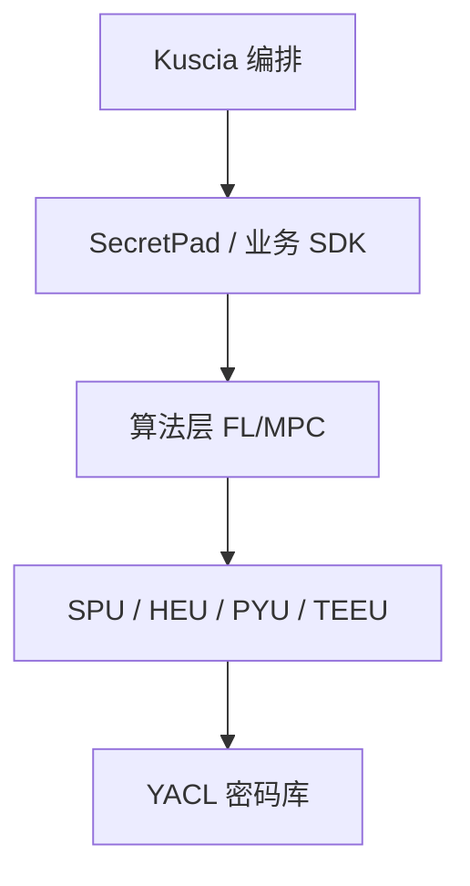

# P31 隐语开源版SecretPad导论

← [[BV1ser5BDESU-总览]] | ← [[P30-基于K8S的跨域隐私计算应用编排框架Kuscia]] | 下一篇 → [[P32-KusciaAPI的相关概念和场景实践-正式版]]

## 视频信息

| 项目 | 内容 |
|------|------|
| 分集 | 隐语开源版SecretPad导论 |
| 模块 | SecretFlow 生态 |
| 时长 | 24 分 48 秒 |
| 链接 | [B 站 P31](https://www.bilibili.com/video/BV1ser5BDESU?p=31) |
| 官方文档 | [SecretFlow 文档](https://www.secretflow.org.cn/zh-CN/docs) |
| 内容来源 | 知识点增强（数据要素流通技术体系，非逐字转写） |

## 核心要点

1. **本 P 主题**：隐语开源版SecretPad导论
2. **模块定位**：SecretFlow 生态
3. **考试/实践侧重**：SecretPad 可视化、项目/参与方/组件
4. **笔记层级**：教程级（约 3171 字），含速览、图解、场景 Walkthrough、自测题
5. **学习建议**：先通读「3 分钟速览」与「图解」，再读「详细讲解」；动手项见 Checklist

> 以下内容基于数据要素流通与隐私计算技术体系撰写，对应 B 站分 P「隐语开源版SecretPad导论」。**非 UP 逐字转写**；不看视频也可建立框架，看视频可对照「与视频对照表」深化。

## 本节在系列中的位置

**模块**：SecretFlow 生态 · 系列第 **P31/47** 集。

**建议前置**：[[基于K8S的跨域隐私计算应用编排框架Kuscia]]——建立本集所需背景。

**建议后续**：[[KusciaAPI的相关概念和场景实践-正式版]]——在本集能力之上继续深入。

依赖关系：政策(P01–P06) → 可信空间(P07–P08,P18) → 密态/隐私技术(P09–P24) → SecretFlow 工程(P25–P32) → 基础设施与案例(P33–P47)。

## 3 分钟速览

**隐语开源版SecretPad导论** 是数据要素流通体系中的关键一课。读完本节你应能回答：① 核心概念定义；② 在「供得出—流得动—用得好—保安全」链条中的位置；③ 与隐私计算技术栈的衔接。考试/面试侧重：**SecretPad 可视化、项目/参与方/组件**。

## 零基础导读

本节「隐语开源版SecretPad导论」属于 **SecretFlow 生态**。即便未看视频，也应先建立**制度—技术—场景**三层视角：政策类章节回答「为什么允许流」；技术类章节回答「如何安全地算」；案例类章节回答「真实行业怎么落地」。

第一遍阅读请盯住三个问题：本集**解决什么痛点**？**关键参与方**是谁？**交付物或能力边界**是什么？第二遍阅读时，把术语表抄到 Obsidian 双链笔记，与前后分 P 交叉引用。

## 详细讲解

### 1. SecretPad 定位

**SecretPad** 是隐语开源的**隐私计算 Web 平台**，提供可视化项目创建、参与方管理、组件拖拽编排、任务运行与结果查看，降低非开发人员使用门槛。

### 2. 核心功能

| 功能 | 说明 |
|------|------|
| 项目管理 | 创建协作项目、邀请参与方 |
| 组件库 | PSI、联邦、预测、预处理等 |
| 画布编排 | 拖拽连线定义 DAG |
| 任务运行 | 提交到 Kuscia/本地后端 |
| 结果下载 | 模型、报表、日志 |

### 3. 版本区分

- **开源版**：本地部署，适合学习与小规模 PoC
- **企业版**：多租户、权限、审计增强（若有）

### 4. 使用流程

1. 部署 SecretPad + Kuscia + SecretFlow
2. 注册节点与证书
3. 新建项目，添加数据源
4. 拖拽组件（如 PSI → 纵向联邦）
5. 配置参数，提交运行
6. 各方授权后任务执行

### 5. 适用人群

业务分析师、数据科学家、合规人员——无需手写 MPC 协议，但需理解组件语义与数据准备。

### 6. 考试/实践要点

- 完成 SecretPad 官方教程一个完整项目
- 说明画布 DAG 与 SecretFlow 脚本的关系
- 列举三类常用组件及输入输出

### 7. 权限 RBAC

SecretPad 项目管理员、数据科学家、审计员角色分离；操作留痕。

### 8. 多语言

界面中文；组件文档中英对照，算法参数有 tooltips。

### 9. 培训路径

业务人员 2 天 SecretPad 培训即可跑通 PSI+联邦；研发人员需 1–2 周掌握 SecretFlow Python API。

### 10. 学习与实践检查单

- [ ] 对照本 P 标题回顾 B 站视频章节要点
- [ ] 在 [SecretFlow 文档](https://www.secretflow.org.cn/zh-CN/docs) 找到对应模块
- [ ] 能用一句话向同事解释本 P 核心概念
- [ ] 识别一个本行业可落地的应用场景
- [ ] 记录与前后分 P 的技术依赖关系

### 11. 模块知识串联
本讲属于「数据要素流通技术」体系中的重要一环。建议在学习日志中标注：输入依赖（前序知识）、输出能力（学完能做什么）、与隐语组件映射（SecretFlow/Kuscia/SecretPad/TEE）。完成 47 讲后应能独立设计一个「政策合规+连接器+隐私计算+审计存证」的端到端方案，并评估 MPC、TEE、联邦学习的选型依据。

### 工程落地提示（隐语开源版SecretPad导论）

学习本集时请在 SecretFlow 文档中打开对应组件页，边读边在架构图中**标注位置**。生产部署需同时考虑：网络互通（mTLS）、参与方 Domain 隔离、任务失败重试、审计日志留存。开发阶段优先用单机仿真验证逻辑，再迁移 Kuscia 集群。

## 图解

## 类比与直觉

SecretFlow 像**隐私计算的 Android 系统**：YACL/SPU 是芯片驱动，Kuscia 是任务调度，SecretPad 是桌面，开发者写应用即可。

## 例题与场景 Walkthrough

**场景：两家机构联合建模（不共享明文）**

1. **样本对齐**：若双方仅有交集用户有价值，先用 PSI（P21/P28）对齐 ID。
2. **特征拼接**：纵向联邦（P24）下 A 方持标签、B 方持特征，梯度通过安全聚合更新。
3. **训练执行**：在 SecretFlow SPU（P27）上完成密态前向/反向，或 TEE 内明文训练（P11–P17）。
4. **模型发布**：输出评分服务；模型参数经评估后按需出域，训练数据永不出域。
5. **本集关联**：隐语开源版SecretPad导论 提供其中 **SecretPad 可视化** 能力。

## 常见误区

1. **「学完本集就会用隐语」**：SecretFlow 生态需多集串联（P19–P32），单集只是拼图一块。
2. **「隐私计算等于不上传数据」**：数据仍以密文、份额或授权方式参与计算，网络与算力开销客观存在。
3. **「TEE 绝对安全」**：TEE 依赖硬件与侧信道防护，需远程证明（P17）与补丁策略。
4. **「区块链解决一切确权」**：链适合存证与交易撮合，大规模计算仍在链下隐私计算引擎。

## 与视频对照表

| 视频段落（约） | 预期演示内容 | 笔记对应章节 |
|-------------|------------|------------|
| 开篇 0%–15% | 本集目标、背景、与前后集关系 | 本节位置、3 分钟速览 |
| 前段 15%–40% | 核心概念定义与架构图 | 零基础导读、详细讲解 |
| 中段 40%–70% | 原理展开、对比、政策/代码示例 | 图解、类比、Walkthrough |
| 后段 70%–90% | 案例、问答、易错点 | 常见误区、Checklist |
| 收尾 90%–100% | 总结、延伸资源 | 延伸阅读、自测题 |

> 本集总时长约 **24分48秒**。无官方外挂字幕时，以分 P 标题「隐语开源版SecretPad导论」与上表主题对齐视频画面。

## 动手实践 Checklist

- [ ] 在 SecretFlow 文档搜索本集关键词（如 SecretPad 可视化）
- [ ] 找到对应 API/组件的配置示例
- [ ] 在 SecretPad 或脚本中定位该组件所处菜单/模块
- [ ] 复现文档最小示例或记录阻塞问题
- [ ] 与 P25 总架构图对照标注本集位置

## 延伸阅读

- [SecretFlow 文档中心](https://www.secretflow.org.cn/zh-CN/docs)
- TC609 可信数据空间相关标准
- 本系列相邻 2 个分 P 笔记

## 自测题

1. **本集核心考点？**  
   **答**：SecretPad 可视化、项目/参与方/组件。

2. **本集在四原则中的位置？**  
   **答**：保安全的技术实现。

3. **与 SecretFlow 的关系？**  
   **答**：本集直接讲隐语组件。

4. **一项落地检查？**  
   **答**：是否有授权、是否最小必要、是否可审计——三者缺一不可。

5. **30 秒口述本集？**  
   **答**：用「输入→处理→输出」各一句话概括（见 Walkthrough）。

## 关键术语

| 术语 | 说明 |
|------|------|
| 数据要素 | 可参与社会化配置、创造价值的数字化资源 |
| 隐私计算 | 数据可用不可见前提下实现协作计算的技术体系 |
| 模块 | SecretFlow 生态 |

## 与前后分 P 的衔接

- ← **基于K8S的跨域隐私计算应用编排框架Kuscia**（[[P30-基于K8S的跨域隐私计算应用编排框架Kuscia]]）
- → **KusciaAPI的相关概念和场景实践-正式版**（[[P32-KusciaAPI的相关概念和场景实践-正式版]]）

## 逐字转写
> 状态：待转写。运行 `Tools/transcribe/transcribe.ps1 -Bvid BV1ser5BDESU -Part 31` 补充。

## 来源说明

- ✅ B 站官方元数据（`Tools/BV1ser5BDESU-full.json`）
- ✅ 分 P 首帧封面（`Tools/bili-fetch/fetch-bilibili.js`）
- ✅ **教程级增强**：含图解/Mermaid、场景 Walkthrough、自测题（约 3171 字，2026-06-06）
- ⏳ 逐字转写：B 站 API 无外挂字幕轨；可选 Whisper/BiliNote 后续补充

## 关键截图

![[../../06-资源附件/video-notes-images/BV1ser5BDESU-P31-cover.jpg|B站首帧 P31]]
