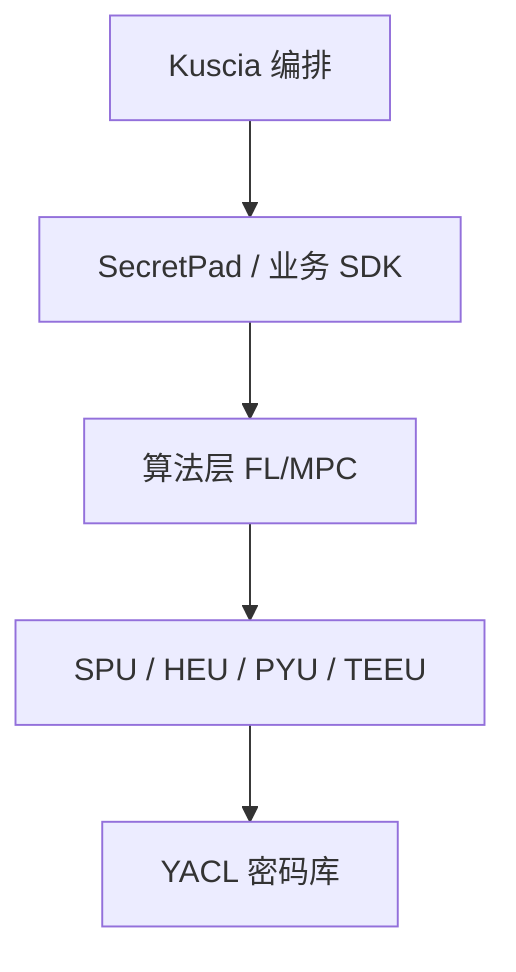

# P32 KusciaAPI的相关概念和场景实践-正式版

← [[BV1ser5BDESU-总览]] | ← [[P31-隐语开源版SecretPad导论]] | 下一篇 → [[P33-数据元件-安全可信流通的新模式]]

## 视频信息

| 项目 | 内容 |
|------|------|
| 分集 | KusciaAPI的相关概念和场景实践-正式版 |
| 模块 | SecretFlow 生态 |
| 时长 | 26 分 17 秒 |
| 链接 | [B 站 P32](https://www.bilibili.com/video/BV1ser5BDESU?p=32) |
| 官方文档 | [SecretFlow 文档](https://www.secretflow.org.cn/zh-CN/docs) |
| 内容来源 | 知识点增强（数据要素流通技术体系，非逐字转写） |

## 核心要点

1. **本 P 主题**：KusciaAPI的相关概念和场景实践-正式版
2. **模块定位**：SecretFlow 生态
3. **考试/实践侧重**：KusciaAPI、gRPC、任务提交与状态查询
4. **笔记层级**：教程级（约 3223 字），含速览、图解、场景 Walkthrough、自测题
5. **学习建议**：先通读「3 分钟速览」与「图解」，再读「详细讲解」；动手项见 Checklist

> 以下内容基于数据要素流通与隐私计算技术体系撰写，对应 B 站分 P「KusciaAPI的相关概念和场景实践-正式版」。**非 UP 逐字转写**；不看视频也可建立框架，看视频可对照「与视频对照表」深化。

## 本节在系列中的位置

**模块**：SecretFlow 生态 · 系列第 **P32/47** 集。

**建议前置**：[[隐语开源版SecretPad导论]]——建立本集所需背景。

**建议后续**：[[数据元件：安全可信流通的新模式]]——在本集能力之上继续深入。

依赖关系：政策(P01–P06) → 可信空间(P07–P08,P18) → 密态/隐私技术(P09–P24) → SecretFlow 工程(P25–P32) → 基础设施与案例(P33–P47)。

## 3 分钟速览

**KusciaAPI的相关概念和场景实践-正式版** 是数据要素流通体系中的关键一课。读完本节你应能回答：① 核心概念定义；② 在「供得出—流得动—用得好—保安全」链条中的位置；③ 与隐私计算技术栈的衔接。考试/面试侧重：**KusciaAPI、gRPC、任务提交与状态查询**。

## 零基础导读

本节「KusciaAPI的相关概念和场景实践-正式版」属于 **SecretFlow 生态**。即便未看视频，也应先建立**制度—技术—场景**三层视角：政策类章节回答「为什么允许流」；技术类章节回答「如何安全地算」；案例类章节回答「真实行业怎么落地」。

第一遍阅读请盯住三个问题：本集**解决什么痛点**？**关键参与方**是谁？**交付物或能力边界**是什么？第二遍阅读时，把术语表抄到 Obsidian 双链笔记，与前后分 P 交叉引用。

## 详细讲解

### 1. KusciaAPI 概述

**KusciaAPI** 提供 gRPC/HTTP 接口，供外部系统（SecretPad、业务中台、连接器）程序化提交跨域任务、查询状态、管理 Domain，实现**隐私计算即服务**。

### 2. 主要接口类别

| 类别 | 操作 |
|------|------|
| Job 管理 | CreateJob、QueryJob、StopJob |
| Domain 管理 | 注册、健康检查 |
| 数据管理 | 注册数据源、授权 |
| 证书 | 轮换、查询 |

### 3. 典型集成场景

- **可信数据空间连接器**调用 KusciaAPI 触发联合计算
- **调度系统**定时触发 PSI 对账 Job
- **CI/CD** 自动化测试隐私计算流水线

### 4. 调用流程示例

1. 客户端 mTLS 连接 Kuscia Master
2. CreateJob 传入 AppImage、参与方列表、输入输出 URI
3. 轮询 QueryJob 直至 Succeeded
4. 从约定 OSS/本地路径取结果

### 5. 错误处理

- 参与方未授权：Job 挂起，需人工审批
- 网络分区：重试与幂等 Job ID
- 资源不足：排队或扩容 Worker

### 6. 考试/实践要点

- 用伪代码描述 CreateJob 请求字段
- 说明 API 层与画布层的适用边界
- 设计连接器调用 KusciaAPI 的时序图

### 7. SDK

除 gRPC 外可提供 Java/Go SDK 封装；异步回调 Webhook 通知 Job 完成。

### 8. 限流

API 网关 QPS 限制防滥用；大 Job 排队公平调度。

### 9. 幂等设计

CreateJob 客户端生成 UUID 作 Job ID，重复提交不创建重复任务；Webhook 签名防伪造回调。

### 10. 学习与实践检查单

- [ ] 对照本 P 标题回顾 B 站视频章节要点
- [ ] 在 [SecretFlow 文档](https://www.secretflow.org.cn/zh-CN/docs) 找到对应模块
- [ ] 能用一句话向同事解释本 P 核心概念
- [ ] 识别一个本行业可落地的应用场景
- [ ] 记录与前后分 P 的技术依赖关系

### 11. 模块知识串联
本讲属于「数据要素流通技术」体系中的重要一环。建议在学习日志中标注：输入依赖（前序知识）、输出能力（学完能做什么）、与隐语组件映射（SecretFlow/Kuscia/SecretPad/TEE）。完成 47 讲后应能独立设计一个「政策合规+连接器+隐私计算+审计存证」的端到端方案，并评估 MPC、TEE、联邦学习的选型依据。

### 工程落地提示（KusciaAPI的相关概念和场景实践-正式版）

学习本集时请在 SecretFlow 文档中打开对应组件页，边读边在架构图中**标注位置**。生产部署需同时考虑：网络互通（mTLS）、参与方 Domain 隔离、任务失败重试、审计日志留存。开发阶段优先用单机仿真验证逻辑，再迁移 Kuscia 集群。

## 图解

## 类比与直觉

SecretFlow 像**隐私计算的 Android 系统**：YACL/SPU 是芯片驱动，Kuscia 是任务调度，SecretPad 是桌面，开发者写应用即可。

## 例题与场景 Walkthrough

**场景：两家机构联合建模（不共享明文）**

1. **样本对齐**：若双方仅有交集用户有价值，先用 PSI（P21/P28）对齐 ID。
2. **特征拼接**：纵向联邦（P24）下 A 方持标签、B 方持特征，梯度通过安全聚合更新。
3. **训练执行**：在 SecretFlow SPU（P27）上完成密态前向/反向，或 TEE 内明文训练（P11–P17）。
4. **模型发布**：输出评分服务；模型参数经评估后按需出域，训练数据永不出域。
5. **本集关联**：KusciaAPI的相关概念和场景实践-正式版 提供其中 **KusciaAPI** 能力。

## 常见误区

1. **「学完本集就会用隐语」**：SecretFlow 生态需多集串联（P19–P32），单集只是拼图一块。
2. **「隐私计算等于不上传数据」**：数据仍以密文、份额或授权方式参与计算，网络与算力开销客观存在。
3. **「TEE 绝对安全」**：TEE 依赖硬件与侧信道防护，需远程证明（P17）与补丁策略。
4. **「区块链解决一切确权」**：链适合存证与交易撮合，大规模计算仍在链下隐私计算引擎。

## 与视频对照表

| 视频段落（约） | 预期演示内容 | 笔记对应章节 |
|-------------|------------|------------|
| 开篇 0%–15% | 本集目标、背景、与前后集关系 | 本节位置、3 分钟速览 |
| 前段 15%–40% | 核心概念定义与架构图 | 零基础导读、详细讲解 |
| 中段 40%–70% | 原理展开、对比、政策/代码示例 | 图解、类比、Walkthrough |
| 后段 70%–90% | 案例、问答、易错点 | 常见误区、Checklist |
| 收尾 90%–100% | 总结、延伸资源 | 延伸阅读、自测题 |

> 本集总时长约 **26分17秒**。无官方外挂字幕时，以分 P 标题「KusciaAPI的相关概念和场景实践-正式版」与上表主题对齐视频画面。

## 动手实践 Checklist

- [ ] 在 SecretFlow 文档搜索本集关键词（如 KusciaAPI）
- [ ] 找到对应 API/组件的配置示例
- [ ] 在 SecretPad 或脚本中定位该组件所处菜单/模块
- [ ] 复现文档最小示例或记录阻塞问题
- [ ] 与 P25 总架构图对照标注本集位置

## 延伸阅读

- [SecretFlow 文档中心](https://www.secretflow.org.cn/zh-CN/docs)
- TC609 可信数据空间相关标准
- 本系列相邻 2 个分 P 笔记

## 自测题

1. **本集核心考点？**  
   **答**：KusciaAPI、gRPC、任务提交与状态查询。

2. **本集在四原则中的位置？**  
   **答**：保安全的技术实现。

3. **与 SecretFlow 的关系？**  
   **答**：本集直接讲隐语组件。

4. **一项落地检查？**  
   **答**：是否有授权、是否最小必要、是否可审计——三者缺一不可。

5. **30 秒口述本集？**  
   **答**：用「输入→处理→输出」各一句话概括（见 Walkthrough）。

## 关键术语

| 术语 | 说明 |
|------|------|
| 数据要素 | 可参与社会化配置、创造价值的数字化资源 |
| 隐私计算 | 数据可用不可见前提下实现协作计算的技术体系 |
| Domain | 隐私计算域/参与方隔离单元 |
| Job | 跨域计算任务 |

## 与前后分 P 的衔接

- ← **隐语开源版SecretPad导论**（[[P31-隐语开源版SecretPad导论]]）
- → **数据元件：安全可信流通的新模式**（[[P33-数据元件-安全可信流通的新模式]]）

## 逐字转写
> 状态：待转写。运行 `Tools/transcribe/transcribe.ps1 -Bvid BV1ser5BDESU -Part 32` 补充。

## 来源说明

- ✅ B 站官方元数据（`Tools/BV1ser5BDESU-full.json`）
- ✅ 分 P 首帧封面（`Tools/bili-fetch/fetch-bilibili.js`）
- ✅ **教程级增强**：含图解/Mermaid、场景 Walkthrough、自测题（约 3223 字，2026-06-06）
- ⏳ 逐字转写：B 站 API 无外挂字幕轨；可选 Whisper/BiliNote 后续补充

## 关键截图

![[../../06-资源附件/video-notes-images/BV1ser5BDESU-P32-cover.jpg|B站首帧 P32]]
