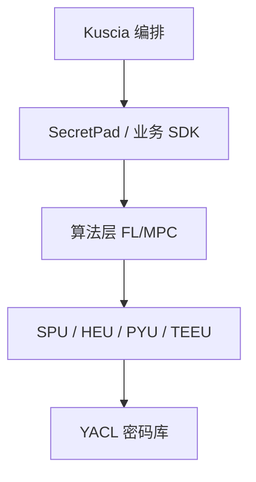

# P32 KusciaAPI的相关概念和场景实践-正式版

← [[BV1ser5BDESU-总览]] | ← [[P31-隐语开源版SecretPad导论]] | 下一篇 → [[P33-数据元件-安全可信流通的新模式]]

## 视频信息

| 项目 | 内容 |
|------|------|
| 分集 | KusciaAPI的相关概念和场景实践-正式版 |
| 模块 | SecretFlow 生态 |
| 时长 | 26 分 17 秒 |
| 链接 | [B 站 P32](https://www.bilibili.com/video/BV1ser5BDESU?p=32) |
| 官方文档 | [SecretFlow 文档](https://www.secretflow.org.cn/zh-CN/docs) |
| 内容来源 | 知识点增强（数据要素流通技术体系，非逐字转写） |

## 核心要点

1. **本 P 主题**：KusciaAPI的相关概念和场景实践-正式版
2. **模块定位**：SecretFlow 生态
3. **考试/实践侧重**：KusciaAPI、gRPC、任务提交与状态查询
4. **笔记层级**：教程级（约 3223 字），含速览、图解、场景 Walkthrough、自测题
5. **学习建议**：先通读「3 分钟速览」与「图解」，再读「详细讲解」；动手项见 Checklist

> 以下内容基于数据要素流通与隐私计算技术体系撰写，对应 B 站分 P「KusciaAPI的相关概念和场景实践-正式版」。**非 UP 逐字转写**；不看视频也可建立框架，看视频可对照「与视频对照表」深化。

## 本节在系列中的位置

**模块**：SecretFlow 生态 · 系列第 **P32/47** 集。

**建议前置**：[[隐语开源版SecretPad导论]]——建立本集所需背景。

**建议后续**：[[数据元件：安全可信流通的新模式]]——在本集能力之上继续深入。

依赖关系：政策(P01–P06) → 可信空间(P07–P08,P18) → 密态/隐私技术(P09–P24) → SecretFlow 工程(P25–P32) → 基础设施与案例(P33–P47)。

## 3 分钟速览

**KusciaAPI的相关概念和场景实践-正式版** 是数据要素流通体系中的关键一课。读完本节你应能回答：① 核心概念定义；② 在「供得出—流得动—用得好—保安全」链条中的位置；③ 与隐私计算技术栈的衔接。考试/面试侧重：**KusciaAPI、gRPC、任务提交与状态查询**。

## 零基础导读

本节「KusciaAPI的相关概念和场景实践-正式版」属于 **SecretFlow 生态**。即便未看视频，也应先建立**制度—技术—场景**三层视角：政策类章节回答「为什么允许流」；技术类章节回答「如何安全地算」；案例类章节回答「真实行业怎么落地」。

第一遍阅读请盯住三个问题：本集**解决什么痛点**？**关键参与方**是谁？**交付物或能力边界**是什么？第二遍阅读时，把术语表抄到 Obsidian 双链笔记，与前后分 P 交叉引用。

## 详细讲解

### 1. KusciaAPI 概述

**KusciaAPI** 提供 gRPC/HTTP 接口，供外部系统（SecretPad、业务中台、连接器）程序化提交跨域任务、查询状态、管理 Domain，实现**隐私计算即服务**。

### 2. 主要接口类别

| 类别 | 操作 |
|------|------|
| Job 管理 | CreateJob、QueryJob、StopJob |
| Domain 管理 | 注册、健康检查 |
| 数据管理 | 注册数据源、授权 |
| 证书 | 轮换、查询 |

### 3. 典型集成场景

- **可信数据空间连接器**调用 KusciaAPI 触发联合计算
- **调度系统**定时触发 PSI 对账 Job
- **CI/CD** 自动化测试隐私计算流水线

### 4. 调用流程示例

1. 客户端 mTLS 连接 Kuscia Master
2. CreateJob 传入 AppImage、参与方列表、输入输出 URI
3. 轮询 QueryJob 直至 Succeeded
4. 从约定 OSS/本地路径取结果

### 5. 错误处理

- 参与方未授权：Job 挂起，需人工审批
- 网络分区：重试与幂等 Job ID
- 资源不足：排队或扩容 Worker

### 6. 考试/实践要点

- 用伪代码描述 CreateJob 请求字段
- 说明 API 层与画布层的适用边界
- 设计连接器调用 KusciaAPI 的时序图

### 7. SDK

除 gRPC 外可提供 Java/Go SDK 封装；异步回调 Webhook 通知 Job 完成。

### 8. 限流

API 网关 QPS 限制防滥用；大 Job 排队公平调度。

### 9. 幂等设计

CreateJob 客户端生成 UUID 作 Job ID，重复提交不创建重复任务；Webhook 签名防伪造回调。

### 10. 学习与实践检查单

- [ ] 对照本 P 标题回顾 B 站视频章节要点
- [ ] 在 [SecretFlow 文档](https://www.secretflow.org.cn/zh-CN/docs) 找到对应模块
- [ ] 能用一句话向同事解释本 P 核心概念
- [ ] 识别一个本行业可落地的应用场景
- [ ] 记录与前后分 P 的技术依赖关系

### 11. 模块知识串联
本讲属于「数据要素流通技术」体系中的重要一环。建议在学习日志中标注：输入依赖（前序知识）、输出能力（学完能做什么）、与隐语组件映射（SecretFlow/Kuscia/SecretPad/TEE）。完成 47 讲后应能独立设计一个「政策合规+连接器+隐私计算+审计存证」的端到端方案，并评估 MPC、TEE、联邦学习的选型依据。

### 工程落地提示（KusciaAPI的相关概念和场景实践-正式版）

学习本集时请在 SecretFlow 文档中打开对应组件页，边读边在架构图中**标注位置**。生产部署需同时考虑：网络互通（mTLS）、参与方 Domain 隔离、任务失败重试、审计日志留存。开发阶段优先用单机仿真验证逻辑，再迁移 Kuscia 集群。

## 图解

## 类比与直觉

SecretFlow 像**隐私计算的 Android 系统**：YACL/SPU 是芯片驱动，Kuscia 是任务调度，SecretPad 是桌面，开发者写应用即可。

## 例题与场景 Walkthrough

**场景：两家机构联合建模（不共享明文）**

1. **样本对齐**：若双方仅有交集用户有价值，先用 PSI（P21/P28）对齐 ID。
2. **特征拼接**：纵向联邦（P24）下 A 方持标签、B 方持特征，梯度通过安全聚合更新。
3. **训练执行**：在 SecretFlow SPU（P27）上完成密态前向/反向，或 TEE 内明文训练（P11–P17）。
4. **模型发布**：输出评分服务；模型参数经评估后按需出域，训练数据永不出域。
5. **本集关联**：KusciaAPI的相关概念和场景实践-正式版 提供其中 **KusciaAPI** 能力。

## 常见误区

1. **「学完本集就会用隐语」**：SecretFlow 生态需多集串联（P19–P32），单集只是拼图一块。
2. **「隐私计算等于不上传数据」**：数据仍以密文、份额或授权方式参与计算，网络与算力开销客观存在。
3. **「TEE 绝对安全」**：TEE 依赖硬件与侧信道防护，需远程证明（P17）与补丁策略。
4. **「区块链解决一切确权」**：链适合存证与交易撮合，大规模计算仍在链下隐私计算引擎。

## 与视频对照表

| 视频段落（约） | 预期演示内容 | 笔记对应章节 |
|-------------|------------|------------|
| 开篇 0%–15% | 本集目标、背景、与前后集关系 | 本节位置、3 分钟速览 |
| 前段 15%–40% | 核心概念定义与架构图 | 零基础导读、详细讲解 |
| 中段 40%–70% | 原理展开、对比、政策/代码示例 | 图解、类比、Walkthrough |
| 后段 70%–90% | 案例、问答、易错点 | 常见误区、Checklist |
| 收尾 90%–100% | 总结、延伸资源 | 延伸阅读、自测题 |

> 本集总时长约 **26分17秒**。无官方外挂字幕时，以分 P 标题「KusciaAPI的相关概念和场景实践-正式版」与上表主题对齐视频画面。

## 动手实践 Checklist

- [ ] 在 SecretFlow 文档搜索本集关键词（如 KusciaAPI）
- [ ] 找到对应 API/组件的配置示例
- [ ] 在 SecretPad 或脚本中定位该组件所处菜单/模块
- [ ] 复现文档最小示例或记录阻塞问题
- [ ] 与 P25 总架构图对照标注本集位置

## 延伸阅读

- [SecretFlow 文档中心](https://www.secretflow.org.cn/zh-CN/docs)
- TC609 可信数据空间相关标准
- 本系列相邻 2 个分 P 笔记

## 自测题

1. **本集核心考点？**  
   **答**：KusciaAPI、gRPC、任务提交与状态查询。

2. **本集在四原则中的位置？**  
   **答**：保安全的技术实现。

3. **与 SecretFlow 的关系？**  
   **答**：本集直接讲隐语组件。

4. **一项落地检查？**  
   **答**：是否有授权、是否最小必要、是否可审计——三者缺一不可。

5. **30 秒口述本集？**  
   **答**：用「输入→处理→输出」各一句话概括（见 Walkthrough）。

## 关键术语

| 术语 | 说明 |
|------|------|
| 数据要素 | 可参与社会化配置、创造价值的数字化资源 |
| 隐私计算 | 数据可用不可见前提下实现协作计算的技术体系 |
| Domain | 隐私计算域/参与方隔离单元 |
| Job | 跨域计算任务 |

## 与前后分 P 的衔接

- ← **隐语开源版SecretPad导论**（[[P31-隐语开源版SecretPad导论]]）
- → **数据元件：安全可信流通的新模式**（[[P33-数据元件-安全可信流通的新模式]]）

## 逐字转写
> 引擎: whisper | 状态: 已转写 | 格式: 段落化

### [00:01 - 00:50] 各位同学大家好,欢迎来到隐私计
各位同学大家好,欢迎来到隐私计算线上穆克第三期，本节课是库塞API的相关概念和场景实践，我是本节课程的主讲人李异长，本节课程将在之前穆克课程的技术上，以视频制作时的最新库塞版本为准，为大家讲解,通过库塞API搭建隐私计算项目，并执行隐私计算任务的流程，本节课程将会有以下四个部分组成，库塞API是什么,库塞API领域实体，库塞API使用实践指南，以及最重要的演示环节，首先让我们来看什么是库塞API，库塞API是库塞对外，提供隐私计算任务编排能力的入口，在隐与开源技术站中，库塞是其中的框架层，负责提供对secret flow。

### [00:50 - 01:39] secco等隐情的集成
secco等隐情的集成，并提供了隐私计算的参与方，所需要执行的任务编排，网络打通的功能，极大地降低了产品使用者，平台集成者对隐与技术站的使用门槛，具体来看，库塞框架所在的调度层，由库塞和库塞隐外两部分组成，库塞隐外是在开源的隐外基础上，添加了库塞所需要的一些，网络概念的调整而来，库塞不仅包括了库塞隐外，也对刚才所提到的算法层的引擎，中的各种实体概念，做了进一步的封装，比如不同引擎所需要使用的数据，他们所需要开放的端口，所需要的配置信息等等，这些概念都将会通过库塞API，来进一步进行使用和管理，以提供给用户更好的使用体验。

### [01:39 - 02:28] 实际上产品层的库塞Secret
实际上产品层的库塞Secret Pied，就是在库塞API的基础上进一步开发得来，具体来说，库塞API所管理的领域实体，可以分为如下的级类，节点管理 节点路由管理，数据员管理 数据管理，数据授权管理 任务管理，模型部署和其他的一些功能，我们可以看到，大部分的功能都提供了，创建 删除 更新 查询和批量查询的功能，任务管理相对特殊，在后面将会详细的介绍，首先让我们来看，库塞API中的领域实体，节点是库塞对隐私计算节点的一种抽象，它可以是隐私计算合作中的一方，但并不一定只有一个节点，也可能是某一方向的多的副本节点。

### [02:28 - 03:12] 库塞中的大多数概念都需要依赖于
库塞中的大多数概念都需要依赖于节点，比如数据员 数据授权，节点的作模式主要有两种，一种是中心化的模式，也就是左下方的这张图，另一种是P2P的模式，是右下方的这张图片，在中心化的模式中，负责隐私计算任务的是Light节点，并且假定多个节点都信任一个，共同的控制面Master节点，P2P模式则是将所有的节点都视为，Master加Light的模式，也就是Autonomy节点，在这个模式下，Autonomy节点具备了Master和Light的全部功能，多个节点之间都是通过节点路由，完成网络的连接和身份的认证，在中心化组网的模式下。

### [03:12 - 03:55] 我们不仅需要创建Light之间
我们不仅需要创建Light之间的路由，也需要创建Light和Master之间的路由，而在P2P组网模式之下，只需要直接创建两个，Autonomy节点之间的路由即可，数据管理方面，库塞有三个重要的组成部分，数据 数据员和数据授权，数据 读面Data是指，隐私计算任务的输入或者是输出，可能是结构化的，也可能是非结构化的，如右图所示，他们可能是数据表 模型 预处理规则等等，库塞将会负责存储，读面Data的原信息，比如这些数据的数据员定义，对于结构化数据来说，还将会详细的记录各个列的信息，便于后续引擎去处理使用。

### [03:55 - 04:38] 而数据员读面DataSourc
而数据员 读面DataSource中，存储的则是读面Data，所代表的底层原始数据的存储方式，库塞目前已经支持了多种数据员，包括本地磁盘、OSS、ODPS等等，这些数据员的账号密码，连接地址都会存储在数据员中，在有了数据之后，为了进行多方隐私计算任务，我们还需要对这些数据进行授权，也就是将本方所属的数据的，原信息共享给相关的合作方，比如共享压门表的列信息，以便双方在配置具体的隐私计算任务时，明确使用其中的某些列作为ID，某些列作为特征，在节点网络数据都准备完毕的情况下，让我们来看看任务。

### [04:38 - 05:24] 库塞目前有Task,Job和D
库塞目前有Task,Job和Deployment的三种实体，其中库塞Task是库塞最小利度的调子单元，库塞Job则是若干个库塞Task，组成的一个有向无关图，如右头所示，库塞Task和库塞Job，主要是针对一次性运行的训练任务，定时任务，而库塞Deployment则是针对需要长时间存在的任务，比如一个联合预测服务，在配置了库塞Deployment之后，库塞将会按照其中的配置，在各个参与方下部署具体的服务，一同完成一个隐私计算相关的服务任务，库塞API相关的领域实体还有一些内容，包括应用镜像，应用配置，预置以及健康监测。

### [05:24 - 06:09] 前面我们讲了一下库塞API的基
前面我们讲了一下库塞API的基本介绍和领域实体，并且说明了领域实体之间的关系，我们再介绍一下库塞API使用中的主要流程，大致分为环境准备 数据准备和任务执行这三个部分，在环境准备阶段我们主要有三个步骤，分别是创建节点部署节点，以及创建节点路由，在数据准备阶段，我们需要创建数据员，创建具体的图面data，以及创建节点之间的一个数据授权，完成了这两步之后，我们就可以发现两个节点之间，他们可以看到对方的一个状态，并且能够看到对方授权过来的数据，然后我们就可以根据自己的需要，执行最后一步也就是任务执行，在这一步，你可以选择创建库塞罩。

### [06:09 - 06:56] 也可以选择库塞deployme
也可以选择库塞deployment，来执行一个长时间运行的服务，其中中心化模式下的一个环境准备，需要我们至少创建三个节点，一个master节点和两个light节点，在分别部署了各个节点之后，我们再去配置他们之间的节点路由，将light到master和light，之间的节点的网络打通，这里可以看到一个基本的环境准备的一个顺序，P2P模式则需要我们配置至少两个节点，并且配置他们之间的节点路由，在右侧我贴出了库塞API，在创建节点请求这方面的字段，可以看到在中心化模式，或者是P2P模式中，有部分的字段是有一定区别的，在准备好节点之后。

### [06:56 - 07:47] 我们就可以做数据的准备了
我们就可以做数据的准备了，数据准备一般分为三个步骤，也就是创建数据员，准备数据，以及创建数据授权这三步，其中创建数据员是可以选择的一个步骤，在默认的情况下，本地也会存在一个数据员，另外我们在库塞的部署包里，也提供了一些创建样历数据员，创建样历数据，以及创建样历授权的这样一些脚本，可以方便大家快速的上手，使用API执行任务，则有以下的一些主要流程，它们分别是配置任务提交任务，执行任务监听任务状态，查看任务结果，查看任务日制，在监听任务状态阶段，库塞API提供了服务端推送的能力，用户可以用相关的，API监听服务端推送的信息。

### [07:47 - 08:35] 在任务结束或者是失败的时候
在任务结束或者是失败的时候，用户也可以通过库塞API来查看结果，和任务日制，接下来是这次课程的演示环节，本次演示使用的是，库塞V0.15.0 B0，这个版本，全体所需的Linux docker等要求，可以在库塞的官网中进行查看，我将以官网中提供的，各种GDP请求样历为主，完成一次从搭建节点，配置路由 创建数据 配置授权，创建样历任务，监听任务状态，查看任务日制的一个完整流程，这里额外提到一句，我们所推出的库塞Diagnose整段工具，这个整段工具，可以用于检测双方节点的网络，是否符合通信条件，这些网络当前的一些问题的更因，它含在检查项目。

### [08:35 - 09:22] 包括但不限于带宽传输延迟
包括但不限于带宽 传输延迟，网关的最大请求包体大小的一个配置，包括网关缓冲配置和网关的超时配置，他们的使用场景也比较明确，就是在我们部署完成之后，可在实际执行算法作业前，对自己的网络状况进行个检查，以大概了解网络的一个带宽，和传输延迟情况，另外在执行算法作业失败时，或者是配置网络出现问题的时候，也可以用这个工具，对双方的网络环境进行一个诊断和定位，来排除或者是尽量解决网络环境的一些因素，这是我们本节课程的一个演示环节，在这个演示环境内，我将会使用准备到的这些脚本，去为大家演示一个任务，从节点的组件，到最后的一个查询日这样的一个过程。

### [09:22 - 10:10] 当然这个脚本主要就是
当然这个脚本主要就是，来自于官网的库赛API中的一些相关的描述，大家可以来官网查看，或者随时暂停查看我在视频中的相关脚本，首先是为大家隐藏了，在素质机上搭建两个刀柯人气的这样的一个过程，今天我们使用的是一个P2P的这样的一个模式，点对点搭建了ISC和BOB这样两个容器，第一步就是我们在ISC容器内去执行，添加BOB这样一个Domain的这样一个过程，在这个功能中我们要注意的是，如果使用API的方式，那么在SERT的这个自断里，我们需要使用的是BOB的一个，经过Base64编码的这样一个CRT文件，我们可以在这里面去做一个执行。

### [10:10 - 11:03] 那么同样可以在BOB内去执行这
那么同样可以在BOB内去执行这个过程，当然您在使用的这个请求的功能中，注意替换在SERT中的相关的一个过程，我们可以通过相关的这个，Domain的一些查询的API去查看，是否添加成功，之后我们就需要为两个容器去做一个，Domain Routes的一个创建，这里可以去参考官方文道中，关于Domain Routes的一些，自断的一些详细的一些描述，因为Domain Routes相对来说还是比较复杂的，也可以去阅读这个库杀概念中，关于Domain Routes的这一篇文章，除了基础的这样一个配置。

### [11:03 - 12:07] 其实DomainRoutes还
其实Domain Routes还有更多进阶的功能，包括节点之间的转发，以及包括使用这个反向隧道这些能力，在Domain Routes中都会有一定的支持，好 接下来让我们创建这个Domain Routes，同样的在BOB这一侧也需要创建Domain Routes，我们可以通过库不肯之后去快速的去查看CDR，当然了我们的库杀API本身也是提供这种支持的，比如这里是一个查询以BOB为起点，以Alice为终点的这样一个路由，在BOB上查询，我们会看到它的状态是成功，这表明我们这个方向的路由已经配置成功了。

### [12:07 - 13:10] 你也可以再去Alice上去查看
你也可以再去Alice上去查看另外的一个方向，当然这里我们可以用库不肯之后去快速的做一个查看，它的Reddy这一行已经是一个处的一个状态，然后我们需要去为整个任务去准备一些数据，这里我直接在素质机上用我们库杀，镜像内本身就带有的一些样率数据做一个测试，首先把这个数据用Docker的脚本，去把它拷贝到容器的内部，BOB这次也是需要的，接下来就可以在Alice内创建我们刚才所提到的库杀独立data，其实这里我们可以看到，在容器内你应该已经能看到一个Alice.csv了，这是一个样率数据。

### [13:10 - 14:05] 在所有的库杀的一个镜像包里都可
在所有的库杀的一个镜像包里都可以找到这样一个内容，根据它里面各种列的信息，我们可以创建这样一个独立data，同样的在BOB这一侧也可以创建一个，当然我们的样率数据Alice.csv和BOB.csv是有一些区别的，在使用功能中你可以注意一下，之后是我们在Alice内的授权，因为我们刚才创建的独立data，它只是在每一个域的内部独立data是可建的，接下来我们就要为这两个table去做一个交叉的授权，在Alice内我们需要将AliceTable授权给BOB，我们可以看到这个授权是成功的。

### [14:05 - 14:55] 并且创建了一个DomainDa
并且创建了一个DomainDataGround，另外可以在BOB内为Alice去做一个授权，也就是相反的把BOBtable授权给Alice，经过这两步之后我们已经可以在，任意一方查看到两个table了，这里我在BOB这边去查看一下，用的是DomainDataList这样一个接口，我们不仅可以看到BOBtable，也可以看到AliceTable，说明这个表已经被正确的授权了过来，当然BOB只能看到这个原信息，它的原始数据BOB是并不能看到的，当我们完成以上的所有准备工作之后，就可以开始创建任务。

### [14:55 - 16:17] 这个任务也是在官网中可以直接找
这个任务也是在官网中可以直接找到，这里我选择在Alice这边去做一个执行，提交任务之后，我们可以看到它会返回这个照片ID，这个时候我们就可以去监听这样一个照片，它是通过服务端推送的方式，不断的把后台更新的这样一个照片的情况，发送到享用里，因为我们现在的数据比较少，其实我们已经可以看到，它现在的party比如Alice这边，已经是一个suxade的一个状态，我们推出这个监听，可以直接来查看一下任务结果，可以看到里面的很多task都是一个成功的状态，目前来说如果您能在容器里，那其实也是可以通过GateKJ，也就是CudaJob和KT。

### [16:17 - 17:12] 也就是CudaTask的这样一
也就是CudaTask的这样一个方式，去获得一个运行的结果，当然我们还是更推荐去使用API的一个方式，另外我们现在也提供去查看任务日治的这样一个能力，在这里我们可以看到其实，CudaTask有Job PSI和Job Split这两个，我可以通过调用LogTask Core的一个形式，去查看它的一个日治，比如说这里我选择查看Job PSI的日治，它打印的就是Job PSI这个引擎，它在运行时的全部日治了，最后还在演示当中为大家展示一下，Cuda Diagonal Network，它需要两个参数，当然还有更多的。

### [17:12 - 18:15] 我们可以去看它的文档
我们可以去看它的文档，这个实用工具，其实它是用来帮助大家定位Cuda部署，和Cuda所遇到的一些网络问题，它比较经典的应用场合，就是当我们遇到一些算子执行的速度过慢，或者是中间出现一些丢包的情况的时候，我们可以用它来做一个排场，好的 今天的演示，主要的内容基本就到这里，我们所有的Cuda API，都可以在官方文档中找到，您在查语的时候，只需要注意一下自己所使用的这样一个版本，还有很多的内容，限于篇幅在这里就不再展开了，Cuda API，实际上现在还有包括创建Serving，创建App Image，还有为节点应用去做一些加密的配置。

### [18:16 - 19:02] 为了区分
为了区分，我们会有一个单独叫Datamash API，Datamash是为引擎所服务的一个，用来读取存储数据的这样一个 API，正常来说，我们如果直接使用Cuda的情况下，是不需要考虑这个部分的 API的，这个主要是给引擎这些应用来使用，接下来为大家演示的是，Cuda API中关于Dumain Root，的一些进阶的一些配置方式，首先Dumain Root，在进阶这方面的用法一共有两个，一个是节点转发，另一个是反向隧道，这个在Cuda概念的Dumain Root的，这一个页面中有一个详细的展示。

### [19:02 - 19:46] 在CudaAPI配置Dumai
在Cuda API配置Dumain Root的时候，其实主要的内容，依然是CreateDumain Root Request，只不过其中的一些自断，根据我们的需要去做一些添写，那么这里我为大家演示的是，Alice和Bob之间通过，开入转发进行一个通信，首先是需要我们去准备，一个Carol这样一个点对点的容器，但是并不一定需要是，点对点的一个模式，只不过是因为我沿用了，刚才Alice和Bob之间的，这种一个组网方式，需要我们提前的准备好，Alice和Carol，Bob和Carol之间的，一个正常的连接，这里可以看到，其实我已经提前。

### [19:46 - 20:24] 完成这个方面的准备
完成这个方面的准备，并且把刚刚的Alice和Bob之间的，连接去做了一个断开，也就是说现在Alice和Bob，无法像之前一样，正常的去执行一个，隐私计算任务了，他们两个之间的路由，已经断开了，接下来呢，就需要用我们，转发的这种，DomainRoute的一个方式，为Alice和Bob之间，去做一个通信，这里的配置，变工主要就是，在Transit的这个自断，这里我们需要添写，Transit的Method，为ThirdDomain，然后它的DomainID为Carol，也就是说，我们从Alice到Bob这样一条路由，是通过Carol去进行转发的。

### [20:24 - 21:13] 这个配置
这个配置，需要在Alice这边，去进行一个请求，那么同样的，相反的方向，从Bob到Alice的这样一个路由，也是要经过Carol，去做一个转发，在配置完成这个之后，我们可以再次去，查看DomainRoute的一个状态，可以发现，现在DomainRoute，又都恢复正常了，只不过，这个时候，Alice和Bob之间，其实是通过Carol，才能完成的通信，如果这个时候，我们重新运行，刚才的CousaJob，它的Alice和Bob之间，仍然是可以完成，隐私机的任务的，和不经过跳转，是表现是一样的，这就是，DomainRoute，进阶的一个省方式，那在我们已经完成。

### [21:13 - 21:54] Alice经Carol
Alice经Carol，转发到Bob通讯的，这样的一个记录上，来为大家继续，演示一下，在Cousa中，如何去使用Serbian，去管理一些，常驻的服务，比如说SecretFlowSerbian，Serbian的底层实现的，就是之前，我们所提到的，Cousa Deployment，它会在Cousa内部，会作为一个常驻的，一个后台服务的，一个形式，在指南这里，有一个比较详细的，如何使用CousaEPI，运行一个Serbian，这样一个教程，我们可以，按照这个去，做一个执行，首先，组网，这里就不需要再执行了，我们已经完成了，这样一个搭建，接下来需要，我们做的就是。

### [21:54 - 22:18] 从这个准备
从这个准备，开始，我们可以来，调转过来，参考一下，SecretFlowSerbian，所提供的APP，Image，注意使用最新的，这个版本，在这里，它是一个压谋形式的，这个配置中，主要是给出了，它的一些，服务中用到的，一些配置模板，以及它部署，时候的，一些具体的，参数。

### [22:21 - 23:25] 我们可以用
我们可以用，APPImage，这个压谋，直接的，当然，也可以使用，我们刚才所提到的，在这个PUSA API中，所提供的APPImage，接口，相关的一些，创建更新的能力，但是这个接口，是要求我们，把输入，准备为JSON，这样的一个格式，在这里，演示，我就使用更为，减半的方式，直接创建，这样一个压谋文件，可以看到，我这里，已经完成了，这样的一个准备，并且使用的是，国内的一个镜像，可以加快它的，一个创建速度，是在多台机器上，都要部署的，这样的一个联合预测，所以我们需要在，iList和Bob上，都准备这样的一个环境，好的，接下来，我们就可以准备，提交我们的，服务的一些。

### [23:26 - 24:17] 具体的一些参数了
具体的一些参数了，调用的接口，就是Serbincorate，因为我们使用的是，点的点模式，所以我们需要在，iList和Bob上这两边，都去提交这样的，一个请求，两份请求，只有这个initiator，这里，在这里，会稍微做一个修改，好，完成这样一部创建，我们可以在，任何一个机器上，去查看一下，Couple Control Guide，一下Corsa deployment，正如我刚才所说，这里有一个拼写错误，这我刚才所说，Serbincorate的底层，就是通过Corsa deployment的，实现，它会成为一个，常驻的服务，接下来，我们可以用。

### [24:18 - 24:48] Serbincorate提供的
Serbincorate提供的，具体的接口，去查看它服务，运行状态的一个想象，在任意的节点都可以，当我们在iList上，去调用这个请求的时候，可以发现，现在我们的整个服务，它的total parties，一共有两方，并且available parties，也是两方，这就说明，我们在iList和Bob，这两侧的Serbincorate，都已经部署成功了，在确认这一点之后，我们就可以，具体的去发动一个请求，让它去做一个预测。

### [24:50 - 24:53] 到底我也是
到底我也是，继续选择在iList这边，去调用。

### [24:57 - 25:41] 可以看到整个服务
可以看到整个服务，是能够执行一个，正常的返回，因为实际上，Serbincorate是需要，两个机器同时工作的，那么如果这个时候，我们用接口，比如说把Bob上面的Serbincorate，给它删除，这个时候，再去iList上，执行刚才的请求，会发现它已经，开始爆错了，那么我们把iList这边，也删除，然后可以再来看一下，Corsa deployment的，一个情况，会发现 deployment，也已经被Corsa，进行了回收，那么更多，详细的关于Serbincorate，部署的一些细节，还是可以在，Corsa API这个页面，去做一个查看。

### [25:41 - 26:15] 包括它的一些更新
包括它的一些更新，包括它的这个，批量的查询，好 关于Serbincorate，这边的演示就到这里，在演示环节之后，相信大家对，Corsa API的使用和，相关概念，已经有了基本的了解，Corsa社区，一直在活跃的开发中，欢迎大家，积极的体验使用，并参与，去发布的各类任务，更多详细信息，大家可以随时，访问Corsa的官网，不过要注意，您所使用的版本，和官网中，您所查看的版本，相对应，感谢大家的聆听，这节课程就到此结束了，我们下次再见。

## 来源说明

- ✅ B 站官方元数据（`Tools/BV1ser5BDESU-full.json`）
- ✅ 分 P 首帧封面（`Tools/bili-fetch/fetch-bilibili.js`）
- ✅ **教程级增强**：含图解/Mermaid、场景 Walkthrough、自测题（约 3223 字，2026-06-06）
- ⏳ 逐字转写：B 站 API 无外挂字幕轨；可选 Whisper/BiliNote 后续补充

## 关键截图

![[../../06-资源附件/video-notes-images/BV1ser5BDESU-P32-cover.jpg|B站首帧 P32]]
