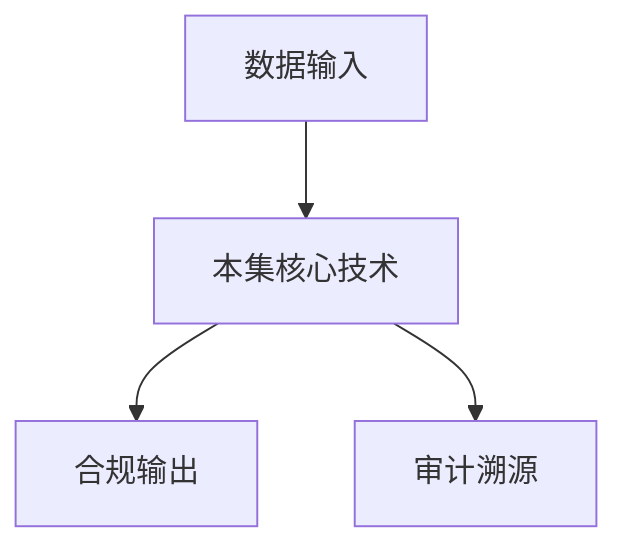

# P33 数据元件：安全可信流通的新模式

← [[BV1ser5BDESU-总览]] | ← [[P32-KusciaAPI的相关概念和场景实践-正式版]] | 下一篇 → [[P34-区块链与数据安全1]]

## 视频信息

| 项目 | 内容 |
|------|------|
| 分集 | 数据元件：安全可信流通的新模式 |
| 模块 | 数据元件·区块链·数联网 |
| 时长 | 31 分 36 秒 |
| 链接 | [B 站 P33](https://www.bilibili.com/video/BV1ser5BDESU?p=33) |
| 官方文档 | [SecretFlow 文档](https://www.secretflow.org.cn/zh-CN/docs) |
| 内容来源 | 知识点增强（数据要素流通技术体系，非逐字转写） |

## 核心要点

1. **本 P 主题**：数据元件：安全可信流通的新模式
2. **模块定位**：数据元件·区块链·数联网
3. **考试/实践侧重**：数据元件概念、标准化封装、流通交易
4. **笔记层级**：教程级（约 2952 字），含速览、图解、场景 Walkthrough、自测题
5. **学习建议**：先通读「3 分钟速览」与「图解」，再读「详细讲解」；动手项见 Checklist

> 以下内容基于数据要素流通与隐私计算技术体系撰写，对应 B 站分 P「数据元件：安全可信流通的新模式」。**非 UP 逐字转写**；不看视频也可建立框架，看视频可对照「与视频对照表」深化。

## 本节在系列中的位置

**模块**：数据元件·区块链·数联网 · 系列第 **P33/47** 集。

**建议前置**：[[KusciaAPI的相关概念和场景实践-正式版]]——建立本集所需背景。

**建议后续**：[[区块链与数据安全1]]——在本集能力之上继续深入。

依赖关系：政策(P01–P06) → 可信空间(P07–P08,P18) → 密态/隐私技术(P09–P24) → SecretFlow 工程(P25–P32) → 基础设施与案例(P33–P47)。

## 3 分钟速览

**数据元件：安全可信流通的新模式** 是数据要素流通体系中的关键一课。读完本节你应能回答：① 核心概念定义；② 在「供得出—流得动—用得好—保安全」链条中的位置；③ 与隐私计算技术栈的衔接。考试/面试侧重：**数据元件概念、标准化封装、流通交易**。

## 零基础导读

本节「数据元件：安全可信流通的新模式」属于 **数据元件·区块链·数联网**。即便未看视频，也应先建立**制度—技术—场景**三层视角：政策类章节回答「为什么允许流」；技术类章节回答「如何安全地算」；案例类章节回答「真实行业怎么落地」。

第一遍阅读请盯住三个问题：本集**解决什么痛点**？**关键参与方**是谁？**交付物或能力边界**是什么？第二遍阅读时，把术语表抄到 Obsidian 双链笔记，与前后分 P 交叉引用。

## 详细讲解

### 1. 数据元件概念

**数据元件**是将原始数据按标准规范封装为**可登记、可定价、可组合、可流通**的标准化数据单元，类似工业领域的「标准件」。降低流通摩擦，支撑规模化数据交易。

### 2. 元件构成

| 要素 | 内容 |
|------|------|
| 数据本体 | 脱敏/聚合后的数据集或 API |
| 元数据标准 | 字段定义、质量指标、更新频率 |
| 质量报告 | 完整性、准确性、时效性 |
| 合规标签 | 来源、授权、分级 |
| 定价模型 | 按次、订阅、分成 |
| 使用策略 | 机器可读合约 |

### 3. 流通模式

- **整元件交易**：购买使用权非所有权
- **元件组合**：多个元件拼装为数据产品
- **元件加工**：二次开发形成衍生元件（需血缘记录）

### 4. 与隐私计算关系

高敏感元件不以明文交付，以**密态胶囊 + 计算服务**形式提供：买方提交任务，卖方环境执行，结果交付。

### 5. 登记与溯源

国家数据基础设施建设推动**数据登记**：元件上架需唯一标识、权属声明、第三方质量认证。

### 6. 考试/实践要点

- 对比数据元件与传统数据 API 的差异
- 说明元件「标准化」带来的规模效应
- 设计一个征信数据元件的元数据模板

### 7. 定价

成本定价、市场定价、收益定价结合；公共数据元件可能政府指导价。

### 8. 质量争议

引入第三方质检机构；质量不达标触发合约赔付条款。

### 9. 资产入表

数据元件可对应资产负债表「数据资源」科目；流通收益计入损益，需与财政部会计准则衔接。

### 10. 学习与实践检查单

- [ ] 对照本 P 标题回顾 B 站视频章节要点
- [ ] 在 [SecretFlow 文档](https://www.secretflow.org.cn/zh-CN/docs) 找到对应模块
- [ ] 能用一句话向同事解释本 P 核心概念
- [ ] 识别一个本行业可落地的应用场景
- [ ] 记录与前后分 P 的技术依赖关系

### 11. 模块知识串联
本讲属于「数据要素流通技术」体系中的重要一环。建议在学习日志中标注：输入依赖（前序知识）、输出能力（学完能做什么）、与隐语组件映射（SecretFlow/Kuscia/SecretPad/TEE）。完成 47 讲后应能独立设计一个「政策合规+连接器+隐私计算+审计存证」的端到端方案，并评估 MPC、TEE、联邦学习的选型依据。

### 深化理解（数据元件：安全可信流通的新模式）

将本节概念放入「数据二十条」四原则框架：它主要支撑哪一条原则？若去掉该能力，哪类数据流通场景会受阻？用一句话向非技术经理解释本节价值。

## 图解

## 类比与直觉

数据元件像**标准化集装箱**，区块链像**不可篡改的货运单**，数联网像**港口铁路网**——让数据像货物一样可计量、可追踪、可交易。

## 例题与场景 Walkthrough

**场景：两家机构联合建模（不共享明文）**

1. **样本对齐**：若双方仅有交集用户有价值，先用 PSI（P21/P28）对齐 ID。
2. **特征拼接**：纵向联邦（P24）下 A 方持标签、B 方持特征，梯度通过安全聚合更新。
3. **训练执行**：在 SecretFlow SPU（P27）上完成密态前向/反向，或 TEE 内明文训练（P11–P17）。
4. **模型发布**：输出评分服务；模型参数经评估后按需出域，训练数据永不出域。
5. **本集关联**：数据元件：安全可信流通的新模式 提供其中 **数据元件概念** 能力。

## 常见误区

1. **「学完本集就会用隐语」**：SecretFlow 生态需多集串联（P19–P32），单集只是拼图一块。
2. **「隐私计算等于不上传数据」**：数据仍以密文、份额或授权方式参与计算，网络与算力开销客观存在。
3. **「TEE 绝对安全」**：TEE 依赖硬件与侧信道防护，需远程证明（P17）与补丁策略。
4. **「区块链解决一切确权」**：链适合存证与交易撮合，大规模计算仍在链下隐私计算引擎。

## 与视频对照表

| 视频段落（约） | 预期演示内容 | 笔记对应章节 |
|-------------|------------|------------|
| 开篇 0%–15% | 本集目标、背景、与前后集关系 | 本节位置、3 分钟速览 |
| 前段 15%–40% | 核心概念定义与架构图 | 零基础导读、详细讲解 |
| 中段 40%–70% | 原理展开、对比、政策/代码示例 | 图解、类比、Walkthrough |
| 后段 70%–90% | 案例、问答、易错点 | 常见误区、Checklist |
| 收尾 90%–100% | 总结、延伸资源 | 延伸阅读、自测题 |

> 本集总时长约 **31分36秒**。无官方外挂字幕时，以分 P 标题「数据元件：安全可信流通的新模式」与上表主题对齐视频画面。

## 动手实践 Checklist

- [ ] 复述本集 3 个定义（不看笔记）
- [ ] 根据 Walkthrough 写 200 字场景短文
- [ ] 对照视频确认 1 个架构图/演示
- [ ] 在总览思维导图中标注本集节点
- [ ] 完成自测 Q1/Q5

## 延伸阅读

- [SecretFlow 文档中心](https://www.secretflow.org.cn/zh-CN/docs)
- TC609 可信数据空间相关标准
- 本系列相邻 2 个分 P 笔记

## 自测题

1. **本集核心考点？**  
   **答**：数据元件概念、标准化封装、流通交易。

2. **本集在四原则中的位置？**  
   **答**：用得好+行业落地。

3. **与 SecretFlow 的关系？**  
   **答**：为 SecretFlow 提供密码学/算法基础。

4. **一项落地检查？**  
   **答**：是否有授权、是否最小必要、是否可审计——三者缺一不可。

5. **30 秒口述本集？**  
   **答**：用「输入→处理→输出」各一句话概括（见 Walkthrough）。

## 关键术语

| 术语 | 说明 |
|------|------|
| 数据要素 | 可参与社会化配置、创造价值的数字化资源 |
| 隐私计算 | 数据可用不可见前提下实现协作计算的技术体系 |
| 模块 | 数据元件·区块链·数联网 |

## 与前后分 P 的衔接

- ← **KusciaAPI的相关概念和场景实践-正式版**（[[P32-KusciaAPI的相关概念和场景实践-正式版]]）
- → **区块链与数据安全1**（[[P34-区块链与数据安全1]]）

## 逐字转写
> 引擎: whisper | 状态: 已转写 | 格式: 段落化

### [00:00 - 00:58] 大家好我是中电数据产业集团的胡
大家好 我是中电数据产业集团的胡承盛，很高兴参加银鱼组织的，数据要素可期流通技术的系列课程，我本次分享的课程是，数据元件安全可期流通的新模式，本次课堂主要是围绕一种标准化的数据出击产品形态，数据元件来展开讲解，主要内容包括形式与要求，数据元件的内含生成原理与突破线作用，数据元件设计生产与流通，数据元件的应用场景与时间安利以及展望，五个部分，那近年来数据与经济社会发展深度融合，各领域对于数据的应用需求持续增强，数据作为新型生产要素的价值预加突显，从宏观层面来看，我国高度重视数据基础设施建设，当的二十届三中全会做出明确指示。

### [00:58 - 02:08] 要求培育全国一体化数据市场
要求培育全国一体化数据市场，完善数据要素价格和收益的分配机制，要加强加快推进国家数据基础设施的建设运营，像国内数据产业人工智能等比喻，市值超过百亿美元的数据公司很少，扔在成绩培育，产业数字化发展不均衡的情况仍然存在，有在进一步发挥数据要素的协同优化作用，尤其是像DeepSake大模型，还有巨声智能机器人等的出现和发布，使得企业对于数据的工区的需求进一步扩大，包括权力数字化转型的要求提升，也是显得预加数，行至预加负担，数据开发利用继续加强个人隐私保护和数据安全治理，在行业层面上，其实像一些国家出台数据20条之后。

### [02:08 - 03:27] 数据产权、数据流通、收益分配
数据产权、数据流通、收益分配、安全治理等基础制度框架，是基本上已经形成有相应的解决框架，在地方像江西、陕西、湖北等全国各省市，都逐步在建立数据局和数据集团，来对数据产业包括数据设施做统筹规划，各地方各行业也在陆陆续续跟数据要素，进行深度的看讨和融合，发挥行业传统，发挥行业在与数据要素深度融合之后的作用，在数据跨境和基础设施方面，国家也在积极做相关的一些探索和布局，在此背景下我们提出了一种新的模式，我们将数据要素的中间态定为数据元件，提出数据元件是对数据资源进行清洗治理，加工生产形成的信息密度大，安全属性强，形态稳定产权清晰。

### [03:27 - 04:33] 价值释放效率高的数据表现结果
价值释放效率高的数据表现结果，我们看到数据品内有很多，但是它的来源分散在各地，当一个数据运用或者一个场景，在需要很多数据的时候，它获取数据的成本很高，同时数据在使用过程中，它的安全属性很难去保障，在这个基础上，我们通过给予一个安全的生产加工环境，通过规模化的去生产一种，标准化的数据出息产品，来去连接供需两单，从而解决数据供数栏的问题，或安全方面的一些解决，安全方面的一些难题，在这个基础上，我们将数据元件定义，或者是在组织上，是要将它定义成一个，净元信息的一个，净元数据的一个信息载体，或一个基本组织单元，主要的形态包括组态数据元件。

### [04:33 - 05:24] 模态数据元件和组态数据元件
模态数据元件和组态数据元件，组态数据元件主要是对数据资源，脱敏处理后，有弱干个相关资段形成的数据级，那模态数据元件主要是由数据资源的，关联资段通过见谋形成的数据特征，这主要是两个常见的一些场景，一种是我们经常面临到一些，写信息它比较敏感，这个时候我们在公布，或者在统计的时候，我们可能就需要对它进行一些，脱敏处理，像公司的名称注册资本，经营时间，我们可以通过一些简单脱敏，一名化或者是一些泛化来处理，来降低它的一些敏感性，那有的我们需要一些企业，或者是一些主体，它的一些具体的一些特征的时候，原始数据难以直接获取。

### [05:24 - 06:19] 那我们可以对原数据经过一些出加
那我们可以对原数据经过一些出加工，比如说像企业它的一些，每年或者每月的一些用水用链的数据，通过对它进行一些加工，形成一些文明性特征，来判断企业是否经营正常，那这个时候我们就需要对原水数据，进行一些建模，形成一些新的特征，来去做相应的一些应用，那这个时候的话，这种类型的话其实就是，典型的一种模型，模态数据元件的应用，除此之外的话，我们还会睡觉一些组合态数据元件，那它主要是由组态和模态数据元件，组合形成的一些数据，或者是数据特征，那这种的话，其实就是逆用于，它具需要有一些原始数据的一些信息，我们可以对它做一些简单托运，同时也需要。

### [06:19 - 07:20] 有一些变换之后的一些特征
有一些变换之后的一些特征，这时候进行一些组合，形成的一个数据级，或者是一组数据特征，那我们叫做左派数据元件，那我们可以发现，就是数据元件，它在生产过程中的话，它其实非常注重它的安全，还有它的一些价值和品质方面的一些特性，那在安全数据方面的话，我们主要是通过对原始数据的关联资段，进行组合加工实现信息剥率，通过数据可不可见，数据不动程序动，使得原始数据在应用过程，不直接就向应用单实现风险隔离，所以我们可以，我们在设计过程中，数据元件的加工生产环境和使用环境，它是两个隔离的环境，从而能够做到风险隔离，那在价值属性方面的话。

### [07:20 - 08:22] 数据元件是一个进一元信息载体
数据元件是一个进一元信息载体，是标准化的数据出击产品，是计量和计价的基本单元，是交易的标的物，能够有效提升和，能够有效提升数据价值密度，从实现数据资源的产品化流通，和规模化应用，那在品质方面，数据元件，我们会经过一系列的质检，包括对它使用的数据资源，元件开发的模型，还有元件的结果进行，一致性检测，包括完整性 准确性，及时性 规范性等等，那尽可能完整的覆盖，所包含对象的静态出现和动态活动，然后我们通过统一标识，统一接口，然后内容一致性的检测等等，来去确保数据元件的规范可用，我们发现2024年底的话，其实国家就联合多部委。

### [08:22 - 09:22] 印发了国家数据基础设施建设指引
印发了国家数据基础设施建设指引，其中明确指出，六大数据流通，利用设施的技术路线，包括了数据元件 可信空间，可信数据空间 数场 数连网，区块链 银丝保护计算平台等等，那数据元件的话，其实就作为了国家明确指出的，六大基础路线之一，现在目前在北京 郑州 温州等，首批市民城市已经开展的落地实施，中国电子联合清华大学，构建的基于数据元件的数据基础设施，工程方案，以数据安全与数据要素化，工程基础细极为基础，重点建设了数据金库 数据元件加工交易中心，数据要素互联网 安全可信，数据空间等数据基础设施，为这个数据流通利用提供的安全可信环境。

### [09:22 - 10:30] 下面主要是介绍数据元件的生成原
下面主要是介绍数据元件的生成原理，数据元件是通过脱敏处理，或建模形成的数据特征，是从海量多样动态的原始数据中，通过抽象表中和信息过滤，形成形态稳定 高价值密度的数据组织单元，数据元件是数据要素化质疑的信息载体，我们可以看到，就是从原始的海量的数据资源中，我们可以被它进行选择，选择一批数据资源，然后通过一些原件模型，开发成数据元件，这些数据元件的话，可以是通用型的数据元件，也可以是一些定向，指定的一些指定需求的数据元件，结合这个场景来去构建，从而能够更方便的服务，更多的业务场景，在这个工庄的话，就是我们还会涉及到，数据元件的一些封装。

### [10:30 - 11:29] 它主要是包括两个方面
它主要是包括两个方面，一个方面是从产品角度，我们要对它进行产品化的封装，另外在流通过程中，我们为了去寻找 寻止 解析，我们还会对它进行一个数字对象化的封装，数据元件产品封装的话，主要是包括它的一些元件结果，编码 产品封装码，包括产品溯源码，以及产品收费信息，数字对象封装的话，其实主要是将数据元件作为数字，来进行封装和管理，这里面主要是包括它的一些标识，就是在互联网上，它的一个对象标识，还有元数据以及数据元件实体，我们通过这两层封装之后，数据元件在统一的数据要素，互联网上，可以通过数字向标识，实现全网的互联互通，数据元件的话。

### [11:29 - 12:27] 它带来了几个方面的突破性作用
它带来了几个方面的突破性作用，一个是能够解决数据确权难题，但我们基于数据元件的三次分离，三阶段确权，其实能够将复杂的数据产权体系，简单化 清晰化，反而推动实现数据的三权分制落力，我们知道原始的数据的话，它可能比较混乱，它的产权的话，它可能分数到不同的个人，或者是组织，我们通过对原始数据加工程数据元件之后，那这个数据元件，它的数据运营主体和元件开发主体，就获得了数据加工程权，和数据产品的经营权，在这个基础上的话，它的权术就很清晰的进行了一项分割，然后我们在使用元件的过程中的话，或者是数据元件在流通之后，它的产品经营权。

### [12:27 - 13:03] 就由数据产品的开发经营主体来获
就由数据产品的开发经营主体来获得，这样的话，它的产权的话，通过三杞大分离就变得清晰可见，可追溯，那在数据流通过程中的话，其实面临的问题，主要是安全的存散，那在此基础上，我们也是通过构建的这种数据金库，包括它数教数不连网，来去促进数据元件规模化的生产，和产品化的流通，从而充分释放数据产品的价值。

### [13:07 - 14:04] 同时我们也在综合考虑数据元件
同时我们也在综合考虑数据元件，它的一些体量，质量，信息量等不同因素，来构建数据元件的一些估值定价模型，为数据产品定价，提供一些科学依据，那我们通过构建以数据元件为核心的，一互两往的安全治理架构，实现了对数据要素的全生命周期的，一个安全管控，从而有效的隔离数据风险，那经过多年的这个试点实践，数据元件其实是已经形成了系统的设计，包括生产和流通技术体系，在标准体系方面的话，中国电子联合清华大学构建的，数据安全以数据要素化，工程标准体系，根据国家省市相关法律法规，制定的数据资源 数据元件，数据流通交易 安全合规，物质定价等系列标准规范。

### [14:04 - 15:04] 为数据要素市场化改革提供的
为数据要素市场化改革提供的，统一规范指引，其中数据元件的标准，主要是包含了元件的结构要求，设计开发规范 安全审核规范，和质量规范等四个方面，我们在数据元件的设计过程中的话，我们提出了场景分析法，数源分析法和元件分析法，其中场景分析法，主要是通过分析客户的实际需求，输离可支撑其业务模型的元件清单，举个例子，比如说在金融领域场景，主要是包含了一些受信，封空 货客等具体的业务应用，还有像保险领域的话，它主要是包含一些核验，还有定价等等，在这个过程中的话，我们确定完场景的话，我们就需要了解，它可能会应用到哪些数据，我们可以通过确定数据应用产品功能。

### [15:04 - 15:58] 包括应用业务模型和紫模型
包括应用业务模型和紫模型，来分析它的模型架构，输离形成可直接输入，给这些模型的一个基础元件清单，数据数源分析法，主要是从数据产品 数据本身来出发，根据数据的原始特性，来进行元件功能的设计，比如说原数据，它可以用于哪些场景，它可以做哪些事，我们可以按照数据持有主体，包括业务预域，还有细化数据项来做相关的一些分析，同时我们需要对数据的一些重要性，和敏感度进行一些评估，有些场景可以用到哪些级别的数据，有些场景的话，那可能作为公用数据，那它可能需要进行一些这个泛化透明等等，那在这过程中，我们需要对它元件的功能进行设计，输出匹配数源实际情况的一些。

### [15:58 - 17:03] 这个基础元件清单
这个基础元件清单，那在前面两个事情做完之后的话，我们通过对场景分析，和数据分析形成的两个，基础元件清单进行比对分析，这个时候的话，主要是要做两个事情，一个是鱼对齐，另外一个是颗粒度对齐，那鱼对齐是要求我们要确保这个数源测元件，和应用测元件在鱼层面保持一致，同时我们也需要元件的这个类型，包括它指导的这个时间空间的颗粒度，是统一一致的，这个时候我们就能够形成我们，公虚双方都符合的，一些这个中间的这个标准化的这个，数据级或者是数据特征，那在整个工程体系里面，其实我们围绕数据元件的这个加工的话，我们是总结出了一套标准化的流程工序。

### [17:03 - 18:02] 那其中就包含了数据汇聚这里
那其中就包含了数据汇聚这里，数据元件加工 数据元件检测，数据元件流通 数据元件使用等五个阶段，围绕这五个阶段的话，我们建立了涵盖15个步骤，40道工序的数据治理工业流程，并依托这个数据金库和数据元件加工交易中心等，成道装备 实现了数据要素，高效 级约 安全和规模化流通利用，那具体在这个工业流程里面，首先我们看一下数据汇聚治理阶段的话，其实它主要是完成的资源化，我们通过对元数据进行入库 清洗 建餐，整个流程的话，我们相当于实现了数据的前期的一些治理工作，和保障前期数据它的一些安全进化，就是有些可能会有带着一些病毒。

### [18:02 - 19:02] 或者是有一些数据不完整等等
或者是有一些数据不完整等等，我们前期会对它做些处理之间的工作，那有了这个数据治愿之后，我们就需要有一个安全的，可靠的一个加工环境和开发的相关的人员，那这个时候的话，就主要是包括了元件开发商的一些入住，然后元件开发商对元件进行一些规格的设计，同时在这个安全的环境里面，怎么去进行模型的开发 调优 中视，入库 调度生产等等，那整个里面它会设计到，就是后台提供的一个安全可靠的环境，对它的这个计算环境进行保障，同时对它的一些资源的一些调配，进行这个前方位的一些管理，那元件生产完之后，它还需要经过进一步的检测，才能流通到这个要素市场。

### [19:02 - 19:56] 那检测的话我们主要是从武大方面
那检测的话我们主要是从武大方面去检测，包括它的标准 包括安全 合规 质检，还有故事定价等等方面，来对它进行上市前的准备，那元件标准方面的话，其实主要是针对它的一些秘名 编码 类型，还有原数据 自然数 基督数等进行这个检测，质量方面的话，那我们除了对原始数据，还会对它的一个元件模型，还有这个模型元件的结果等等，来进行这个质量检测，来对它进行相应的一些评估，安全审核方面的话，我们会对它的这个三个阶段，比如它的这个资源 资源获取阶段，包括它的原件模型加工阶段，还有这个结果进行三届审核，同时我们会对它的这个相关，就是元件结果。

### [19:56 - 20:51] 跟原数据它的一些相关性
跟原数据它的一些相关性，相思性的做相应的一些不肯定审查，防止原数据直接出去了，那在有些情况下的话，我们还会对它的敏感信息，包括它的一些元件结果进行相应的一些分析，同而适配不同的这个应用场景，那核归方面的话，主要是做相应的一些这个，确诠授权的一些这个检测，是否包含主体，然后主体内容行为是否合规等等，那做完这些检测之后，其实主要就是数据元件，资产化的一个过程，怎么去做封装，怎么去做产品化，怎么去估值定价，怎么去吸权登记交易等等，这个我们也是在系统里面，有成套的一套这个工序流程，来完成相应的工作，最后的话我们在使用过程的话。

### [20:51 - 21:19] 我们是要将数据元件作为一个数字
我们是要将数据元件作为一个数字项，形成一个数字，唯一的这个全网维的一个标识，同而能够在这个数据购买网上去注册，检索解析调用，同时我们将数据元件，能够作为一种基本单元，能够对它进行计量计费，然后和多方的一个分账等等，活动。

### [21:23 - 22:17] 那数据元件它其实
那数据元件它其实，前面说它如何加工，包括流通，那在使用过程中它还睡着，怎么去安全的传输，那在这里面我们主要是引入，这个数连网的一个技术框架，将数据元件做一种数字项，对数据元件数字项进行存储，封装协议管理和使用，并采用了数字项标准协议，它里面包含的接口协议和解析协议，来实现对数据元件的一个标识，注册解析寻职和访问，形成了一套数据元件封装，数据元件按需搜索，数据元件存证上限的要索互通的一个网络，也就是我们这里面提到，数教书互联网，那它体系性的解决了，数据元件互联互通中的数据安全，和跨域大规模流通的难题，提高了数据元件流通中的。

### [22:17 - 23:17] 这个互通性安全性和可信度
这个互通性安全性和可信度，那目前数据元件的话，主要是在安全可信数据空间，高涨数据等方面实现了一些初步的应用，其中在安全可信数据空间方面，那我们知道传统可信数据空间的话，主要是通过了数字合约，包括多方计定的那些规则，还有数据使用控制等等技术，来去实现这个数据的安全共享，那我们在此技术上还加了一层，就是我们原始数据，在进到这个空间之前的话，我们会把它加工成安全可控的数据元件，那我们在加工过程中，包括的加工后会对它进行一些安全审核，从而进一步提升数据，就是数据在这个流通过程上，它的一些这个安全性，那我们基于原始就可用不可见。

### [23:17 - 24:16] 数据元件使用可控可提良的这种应
数据元件使用可控可提良的这种应用模式，可以链接上下由多方主体，为行业提供数据安全融合共享，和可行流通的这个新型数设施和解决方案，那在高质量数据级方面的话，主要是基于数据元件，构建大模型的语调库以及智能体应用，它有一个好处就是说，原始大模型的话，它可能不管治理没治理，它的质量好坏，不管都一股烙的进去，但是有个问题就是说，你数据质量越好，对于模型训练的效果，它就会提升有很大的提升，但是如果数据不好，那可能会对模型它的一些分析性，推理性造成很大的影响，那我们通过数据元件，就是将原数据通过治理，标准化加工各种方面的一些安全检测。

### [24:16 - 25:25] 形成了标准化的这种数据级
形成了标准化的这种数据级，从而能够大幅的减轻治理负担，包括模型的训练的负担度，也会大大的降低，除此之外的话，我们还可以基于数据元件构建语调库，用来辅助大模型的一些评测，根据用户对大模型评测的一些需求，可以结合评测语调库完成训练，微调大模型考卷，实现大模型能力综合评定，客观准确的提供对模型能力，参数了一些这个横向对比，我们数据元件的话，其实已经联合各个高校，包括各个产业已经发展了将近五年了，那我们在此技术上是形成的，制度技术市场三维一体的，这个塑胶策划共产发案，目前是已经在德阳大理，郑州徐州温州等地完成了，这个试验实验工作。

### [25:25 - 26:22] 那北京目前是正在这个快速推进中
那北京目前是正在这个快速推进中，像德阳市集资产交易平台的话，已经是上架了数据元件三圈一个，数据元件销售合同，经文已经突破了一个亿，完成全国首个基于数据元件的，质页融资500万元的一个货币，那像在郑州的话，郑州主要是运营这个中国，郑州数据金户开展的这个，数据元件的国家试点，那数据金户的话，目前是已经接入了59亿条的这个数据，已经累计签约了，42亿数据元件交易合同，引入了22家这个生态企业，同时接待部委地方政府等385批词，已经形成了较大的一个规模了，在行业级应用方面的话，其实主要是包括一些这个金融服务啊，医疗健康 龙岩电力。

### [26:22 - 27:15] 现在龙岩等重点领域
现在龙岩等重点领域，那像在中部地区某银行，针对于这个个人信贷业务，已经推出基于数据元件的一些一代场景，主要是以数据元件方式，能够提供稳定的贷款评估，数据产品和服务，有效的去解决这个金融场景，下面的一些这个信用欺诈呀，包括评计之后啊，信息核验等问题，累计服务了10万亿客户，其实在这个基础上的话，我们其实主要是会涉及到，一些这个基础数据的获取，包括这个贷款人信息，这主体授权书的一些授权范围，查询客户的婚姻啊，学历啊 医保缴税信息，那我们知道这信息，对于个人来说是比较敏感的，那在这个基础上，我们可以通过对他们进行一些这个，模特的加工。

### [27:15 - 28:07] 做相应的一些稳定
做相应的一些稳定，状态的一些这个特征变换，形成相应的这个数据元件，来服务这些应用，从而降低这个数据泄露的风险，或者滥用的风险，那还有像医疗方面的话，浙江某医疗健康服务企业的话，推出的是这个安整无优项目，以数据元件的方式提供了，这个用户健康评估，或这个个性化的这个健康方案，累计服务了将5万亿这个客户，并获得了这个浙江数据开放，创新应用大赛的这个总结赛的，二能奖，那在这个里面的话，他其实主要是通过获取这个，就是在这个进到这个用户性授权之后，能够拿这个用户的基因信息，包括运动数据，心理评估等多维度健康数据，来去对个人的这个身体。

### [28:07 - 28:31] 潜在的一些这个健康情况进行一些
潜在的一些这个健康情况进行一些分析，那这里面的这个数据的话，他其实也是会收到一个，很多这个敏感信息，那如何对他进行这个安全加工，包括怎么去安全应用，提出相应的一些挑战，那在这个用户我们也是通过，举数据远见和这个工程理论，来去做相应的一些方案解决。

### [28:34 - 29:33] 那展望未来的话
那展望未来的话，我们觉得认为啊，就是数据远见，包括隐私安全计算，数据空间，数连网 数场等技术路线，有基融合，形成，一个整体是一个必然的趋势，那数据远见在这里面，也将发挥这个重要作用，为数字经济领域，高质量发展，助于一个新的动能，那数据远见将在保护国家数据安全，和个人隐私，贡献国际数据跨流，跨进流动创新方案，处理人工智能发展，购注数据要素，流动互联网，释放数据资产价值经济发展，等方面发挥重要作用，红尚，目前的话就是，尤其是在数据安全方面，很多原始数据不让出狱，包括，行业的一些重要数据，还有一些个人隐私数据，那我们有了数据远见之后，就能够很好的对他进行相应的。

### [29:33 - 30:29] 一些这个标准化处理
一些这个标准化处理，怎么去脱敏，然后怎么去授权，要有哪些合规的一些这个，手续，然后需要在什么样的这个安全环境面，可以去做相应的应用等等，那在跨境方面的话，我们其实，构建了高效安全的一些，这个数据跨，跨境流通体系，包括构建了前沿先进的这个数据，跨境技术给做，在这个绿色反保方面的话，我们通过，对脏数据，或者对原数据的一些这个，呃提炼处理行程，标准化的高信息价值密度的，这个数据远见，从而能够降低这个，大规模的这个数据处理，的复杂度，然后提高这个大模型的应用性能，降低超大模型的数据处理的消耗，那在这个数据流通方面的话，我们其实数据远见。

### [30:29 - 30:47] 成为构住数据测量网的一个重要支
成为构住数据测量网的一个重要支撑，它可以通过数据远见的这种标识，能够快速的去解析定位，同时通过，呃构住的这个安全的这个屏障，来保障原始数据不出誉，但是又能够更好的服务这个UVM。

### [30:49 - 31:33] 同时数据远见标准化之后
同时数据远见标准化之后，也能够更好对它去进行吸权，那包括资产化处理定价等等，那，其实我想表达的就是说，数据远见，它在整个的这个数据要素上中，它发挥的这个价值不仅仅是说，它是一个，初级的这个数据产品，而说，它在整个的生态里面，能够带动更多的这个，呃，数据生态或者说体验，参与到这个数据要素适量化的过程中，能够更大，更快的去发挥这个数据要素的这个价值，那以上是本次课程讲解的主要内容，期待和大家一起新化探讨，完成认知，谢谢大家。

## 来源说明

- ✅ B 站官方元数据（`Tools/BV1ser5BDESU-full.json`）
- ✅ 分 P 首帧封面（`Tools/bili-fetch/fetch-bilibili.js`）
- ✅ **教程级增强**：含图解/Mermaid、场景 Walkthrough、自测题（约 2952 字，2026-06-06）
- ⏳ 逐字转写：B 站 API 无外挂字幕轨；可选 Whisper/BiliNote 后续补充

## 关键截图

![[../../06-资源附件/video-notes-images/BV1ser5BDESU-P33-cover.jpg|B站首帧 P33]]
