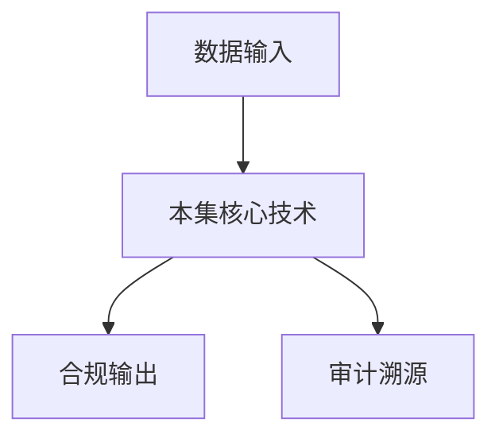

# P34 区块链与数据安全1

← [[BV1ser5BDESU-总览]] | ← [[P33-数据元件-安全可信流通的新模式]] | 下一篇 → [[P35-区块链与数据安全2]]

## 视频信息

| 项目 | 内容 |
|------|------|
| 分集 | 区块链与数据安全1 |
| 模块 | 数据元件·区块链·数联网 |
| 时长 | 62 分 33 秒 |
| 链接 | [B 站 P34](https://www.bilibili.com/video/BV1ser5BDESU?p=34) |
| 官方文档 | [SecretFlow 文档](https://www.secretflow.org.cn/zh-CN/docs) |
| 内容来源 | 知识点增强（数据要素流通技术体系，非逐字转写） |

## 核心要点

1. **本 P 主题**：区块链与数据安全1
2. **模块定位**：数据元件·区块链·数联网
3. **考试/实践侧重**：区块链基础、联盟链、智能合约、数据确权
4. **笔记层级**：教程级（约 2921 字），含速览、图解、场景 Walkthrough、自测题
5. **学习建议**：先通读「3 分钟速览」与「图解」，再读「详细讲解」；动手项见 Checklist

> 以下内容基于数据要素流通与隐私计算技术体系撰写，对应 B 站分 P「区块链与数据安全1」。**非 UP 逐字转写**；不看视频也可建立框架，看视频可对照「与视频对照表」深化。

## 本节在系列中的位置

**模块**：数据元件·区块链·数联网 · 系列第 **P34/47** 集。

**建议前置**：[[数据元件：安全可信流通的新模式]]——建立本集所需背景。

**建议后续**：[[区块链与数据安全2]]——在本集能力之上继续深入。

依赖关系：政策(P01–P06) → 可信空间(P07–P08,P18) → 密态/隐私技术(P09–P24) → SecretFlow 工程(P25–P32) → 基础设施与案例(P33–P47)。

## 3 分钟速览

**区块链与数据安全1** 是数据要素流通体系中的关键一课。读完本节你应能回答：① 核心概念定义；② 在「供得出—流得动—用得好—保安全」链条中的位置；③ 与隐私计算技术栈的衔接。考试/面试侧重：**区块链基础、联盟链、智能合约、数据确权**。

## 零基础导读

本节「区块链与数据安全1」属于 **数据元件·区块链·数联网**。即便未看视频，也应先建立**制度—技术—场景**三层视角：政策类章节回答「为什么允许流」；技术类章节回答「如何安全地算」；案例类章节回答「真实行业怎么落地」。

第一遍阅读请盯住三个问题：本集**解决什么痛点**？**关键参与方**是谁？**交付物或能力边界**是什么？第二遍阅读时，把术语表抄到 Obsidian 双链笔记，与前后分 P 交叉引用。

## 详细讲解

### 1. 区块链基础回顾

**区块链**是分布式账本：数据以区块链式存储，共识机制保证多方对账本一致，密码学（哈希、签名）保证不可篡改。

### 2. 与数据安全的关系

| 能力 | 数据要素应用 |
|------|-------------|
| 不可篡改 | 操作审计、合规存证 |
| 智能合约 | 自动执行数据交易条款 |
| 分布式身份 | DID 跨空间互认 |
| 溯源 | 数据血缘链上记录 |

### 3. 链型选择

- **公有链**：完全开放，数据要素少用（合规与性能）
- **联盟链**：许可制，政务金融主流（FISCO BCOS、Hyperledger Fabric）
- **侧链/通道**：多租户隔离

### 4. 数据上链原则

**链上存证、链下存数**：哈希、元数据、合约状态上链；原始大数据存链下对象存储，通过哈希关联。

### 5. 风险

- 性能：TPS 限制，高频交易需 Layer2
- 隐私：链上透明与业务保密矛盾 → 用 ZK 或链下计算
- 合规：代币与数据产权分离

### 6. 考试/实践要点

- 解释「链上存证链下存数」
- 列举联盟链在数据交易中的三个角色
- 说明智能合约与数字合约的异同

### 7. Fabric 通道

Hyperledger Fabric 通道隔离竞争对手；链码endorsement 策略配置。

### 8. 性能优化

批量上链、异步确认；关键状态用 KV 链码，大数据哈希外链。

### 9. 共识算法

联盟链常用 Raft、PBFT；节点数增加吞吐下降，数据要素场景 7–15 节点常见，按地域与行业设节点。

### 10. 学习与实践检查单

- [ ] 对照本 P 标题回顾 B 站视频章节要点
- [ ] 在 [SecretFlow 文档](https://www.secretflow.org.cn/zh-CN/docs) 找到对应模块
- [ ] 能用一句话向同事解释本 P 核心概念
- [ ] 识别一个本行业可落地的应用场景
- [ ] 记录与前后分 P 的技术依赖关系

### 11. 模块知识串联
本讲属于「数据要素流通技术」体系中的重要一环。建议在学习日志中标注：输入依赖（前序知识）、输出能力（学完能做什么）、与隐语组件映射（SecretFlow/Kuscia/SecretPad/TEE）。完成 47 讲后应能独立设计一个「政策合规+连接器+隐私计算+审计存证」的端到端方案，并评估 MPC、TEE、联邦学习的选型依据。

### 深化理解（区块链与数据安全1）

将本节概念放入「数据二十条」四原则框架：它主要支撑哪一条原则？若去掉该能力，哪类数据流通场景会受阻？用一句话向非技术经理解释本节价值。

## 图解

## 类比与直觉

数据元件像**标准化集装箱**，区块链像**不可篡改的货运单**，数联网像**港口铁路网**——让数据像货物一样可计量、可追踪、可交易。

## 例题与场景 Walkthrough

**场景：两家机构联合建模（不共享明文）**

1. **样本对齐**：若双方仅有交集用户有价值，先用 PSI（P21/P28）对齐 ID。
2. **特征拼接**：纵向联邦（P24）下 A 方持标签、B 方持特征，梯度通过安全聚合更新。
3. **训练执行**：在 SecretFlow SPU（P27）上完成密态前向/反向，或 TEE 内明文训练（P11–P17）。
4. **模型发布**：输出评分服务；模型参数经评估后按需出域，训练数据永不出域。
5. **本集关联**：区块链与数据安全1 提供其中 **区块链基础** 能力。

## 常见误区

1. **「学完本集就会用隐语」**：SecretFlow 生态需多集串联（P19–P32），单集只是拼图一块。
2. **「隐私计算等于不上传数据」**：数据仍以密文、份额或授权方式参与计算，网络与算力开销客观存在。
3. **「TEE 绝对安全」**：TEE 依赖硬件与侧信道防护，需远程证明（P17）与补丁策略。
4. **「区块链解决一切确权」**：链适合存证与交易撮合，大规模计算仍在链下隐私计算引擎。

## 与视频对照表

| 视频段落（约） | 预期演示内容 | 笔记对应章节 |
|-------------|------------|------------|
| 开篇 0%–15% | 本集目标、背景、与前后集关系 | 本节位置、3 分钟速览 |
| 前段 15%–40% | 核心概念定义与架构图 | 零基础导读、详细讲解 |
| 中段 40%–70% | 原理展开、对比、政策/代码示例 | 图解、类比、Walkthrough |
| 后段 70%–90% | 案例、问答、易错点 | 常见误区、Checklist |
| 收尾 90%–100% | 总结、延伸资源 | 延伸阅读、自测题 |

> 本集总时长约 **62分33秒**。无官方外挂字幕时，以分 P 标题「区块链与数据安全1」与上表主题对齐视频画面。

## 动手实践 Checklist

- [ ] 复述本集 3 个定义（不看笔记）
- [ ] 根据 Walkthrough 写 200 字场景短文
- [ ] 对照视频确认 1 个架构图/演示
- [ ] 在总览思维导图中标注本集节点
- [ ] 完成自测 Q1/Q5

## 延伸阅读

- [SecretFlow 文档中心](https://www.secretflow.org.cn/zh-CN/docs)
- TC609 可信数据空间相关标准
- 本系列相邻 2 个分 P 笔记

## 自测题

1. **本集核心考点？**  
   **答**：区块链基础、联盟链、智能合约、数据确权。

2. **本集在四原则中的位置？**  
   **答**：用得好+行业落地。

3. **与 SecretFlow 的关系？**  
   **答**：为 SecretFlow 提供密码学/算法基础。

4. **一项落地检查？**  
   **答**：是否有授权、是否最小必要、是否可审计——三者缺一不可。

5. **30 秒口述本集？**  
   **答**：用「输入→处理→输出」各一句话概括（见 Walkthrough）。

## 关键术语

| 术语 | 说明 |
|------|------|
| 数据要素 | 可参与社会化配置、创造价值的数字化资源 |
| 隐私计算 | 数据可用不可见前提下实现协作计算的技术体系 |
| 联盟链 | 许可制、多方维护 |
| 智能合约 | 链上自动执行 |

## 与前后分 P 的衔接

- ← **数据元件：安全可信流通的新模式**（[[P33-数据元件-安全可信流通的新模式]]）
- → **区块链与数据安全2**（[[P35-区块链与数据安全2]]）

## 逐字转写
> 引擎: whisper | 状态: 已转写 | 格式: 段落化

### [00:05 - 01:03] 大家好,我是浙江大学的张秉胜
大家好,我是浙江大学的张秉胜，今天和大家分享的题目是区块链与数据安全，本次课程主要分五个部分，我会分上下两节来和大家讲，首先是区块链的简介，然后我会讲区块链的不可篡改性，然后是区中心化以及区中心化的优势和挑战，然后是智能合约，然后是数据安全与隐私保护，首先什么是区块链，区块链指的是比特币，以及其他数字货币所背后所用到的核心技术，也就是说区块链能够活起来，主要是因为比特币活起来，带动区块链活起来，然后区块链也是一种数据结构，它是能够让我们去创建数字交易的账本，并且在分布式计算网络中共享，通常区块链指的是链式的结构。

### [01:03 - 01:47] 当然广易的区块链也指任意的
当然广易的区块链也指任意的，DAG的结构，Directed Aesthetic Graph，就是有向无环图的结构，比如说数状的结构，区块链是一种加密工具，它使得在网络中的每一个参与方，都可以以一种安全的方式去操作账本，所谓操作账本一般指的是，Append Only，就是只在账本后叠加，不可修改，当然我们也会讲到有一些例外，然后无需中央机构去干预，这也就是区块链的去中心化的属性，这里要讲到区块链使用密码工具，那么在区块链引入，这个概念引入我们国家之初，有一个词叫Cryptocurrency。

### [01:47 - 02:35] Cryptocurrency最
Cryptocurrency最初的翻译叫做加密货币，为什么呢，因为密码学Cryptography，被翻译成密码学，Crypto是个磁根，它指的是too high的，那么别人就把Cryptocurrency这个词，默认的翻译成加密货币，所以你们可能会看见一些早期的文章，会讲加密货币，但是我认为这个数语可能不太贴切，因为尽管在区块链中使用了大量的，密码学的技术和密码学的工具，但是这些工具不包含加密，比如说他用到了签名，用到了HAC，用到了甚至更多其他的NPC等其他的工具，但是一般来说，底层的区块链是不用加密的，那么在区块链上面去放数据。

### [02:35 - 03:23] 我们为了保证数据的机密性去加密
我们为了保证数据的机密性去加密，那这是数据层，区块链应用层，我们可能会用到加密，在区块链共识层，我们是基本上不会去用加密，所以早期把Cryptocurrency翻译成加密货币，我认为这是不对的，那么在我们这次课程中，我把它翻译成数字货币，也就是digital currency数字货币，好 那么数字货币这个概念是从哪里来的呢，它是由1981年David Cheung提出的，David Cheung正因为提出了数字货币这个概念，他也被称为数字货币之父，在图中长得像疯狂科学家一样的老人，他就是David Cheung，我经常跟他连线。

### [03:23 - 04:23] 连线主要是做eVoting
连线主要是做eVoting，不是做数字货币，因为David Cheung他同时也是，可验证eVoting之父，那么他当时做了一个什么事呢，当时IC刚出来，IC我们知道既能做签名，也能做加密 对吧，他IC做签名更火 流产更广，现在我们的电子护照用的都是IC签名，国际上的签名算法大部分用的是IC，好 那么IC签名，那么他发明了IC的盲签名技术，什么是盲签名，今天就不具体去黑板上去画了，盲签名你可以理解成，比如说小明他考试不及格，他回到家想骗他爸爸去在他的世界上签名，他就说 爸爸 人家的家长都很厉害，他们不用看纸就可以在纸上签名。

### [04:23 - 05:10] 把眼睛蒙起来就能签名
把眼睛蒙起来就能签名，说的他把他爸爸的眼睛蒙起来，他说你也试试吧，然后把试卷拿出来让他爸爸去签字，他爸爸签完字了以后，然后他把这张试卷拿走，换了一张白纸放上，然后把他爸爸的门的眼睛拿掉，然后他爸爸说那我签在哪了呢，他说你这个签名技术太差了，你签在桌子上了，我帮你擦掉了，你看这张纸上都是白的，你都没有签，那么这个就约等于是盲签名，什么意思呢，就是说你看不见你签的内容，但是你知道你签了一次名，签了两次名，你知道你签了几次名，对吧，你知道你签名的次数，但是你看不见你签名的内容，那么 David Chang 他当时就有个思考，他认为什么是货币。

### [05:10 - 06:02] 货币一般我们认为是有国家暴力机
货币一般我们认为是有国家暴力机构背书的，对吧，或者有银行背书的一种纸，可能是什么叫背书呢，那么 David Chang 就认为让银行，在一张白纸上签名，那么这张白纸就相当于是银行背书了，那么只要银行认这张白纸，那么这张白纸就有价值 对吧，那一般纸币上会有一个叫，serial number 就是序列号，这么一个东西，所以 David Chang 他认为我们让银行，去签这个序列号，然后签过的这个序列号，就约等于数字货币，可以流通，比如说我拿一美金给银行，然后银行给了我一张签了名的序列号，序列号不重复，然后我拿这个签了名的序列号，到处去做交易。

### [06:02 - 06:57] 别人都可以验证
别人都可以验证，这个序列号是银行签过名的，他们有银行的公要，然后比如说有一天，有一个人拿着这个签了名的序列号，给银行，银行能够看了一下，是合法的 对吧，Valid 是他的签名是可以被验证的，然后就把这个序列号给他，然后兑换回一美元，大概是这么一个思想，那么为什么需要用到盲签名呢，是因为他想完全仿制货币的匿名性，你们去看美国大片，如果你在躲避FBI的追查的时候，最主要的一个要求，一个基本的素养，就是不能用Credit Card，不能用信用卡，为什么，然后不能用手机 对吧，你手机一开机他就追踪了，他就知道你在哪个sell，然后你的信用卡在哪里一刷。

### [06:57 - 07:49] 他就知道你到了哪个点
他就知道你到了哪个点，他就追过来了 对吧，需要用cash 需要用现金，那么也就是说现金其实是有匿名性的，那么David Cheung，他想磨你现金的匿名性，比如说吧，如果不是用盲签名，银行在序列号上签了名，然后给了我，然后有一天，有一个人拿着这张签了名的序列号，到银行那边去兑换，银行就知道，这个序列号我当时给的是张三，然后因为某种途径到了李四手上，然后李四拿过来兑换，所以银行其实是有追踪的能力，有一定的追踪的能力，对吧，他想杜绝这个能力，所以他的做法就是，我给银行一块钱，我和银行调用一个盲签名的协议，让银行不知道，他签的是哪个序列号。

### [07:49 - 08:43] 那么有人问了这个序列号谁产生
那么有人问了这个序列号谁产生，这个序列号由客户我自己产生，我自己随机产生一个序列号，因为这个序列号的取则范围足够长，我们发生碰撞的概率是非常低的，你可以理解成在现实中，基本上这个序列号是不会重复的，那么就这样，如果我要兑换两美金，那我就再给一美金，再调用一次盲签名协议，然后再拿到一个序列号，每个序列号一美金，然后我拿这个序列号去使用，那么这样的加密货币，或者数字货币系统有什么问题呢，那他主要的面临主要的问题，就是双花问题，当然双花纸 double spending，双花纸是一种隐喻，也代表三花多花各种多花，好什么叫双花呢，就比如说你看银行。

### [08:43 - 09:36] 他给了我一张签了名的序列号
他给了我一张签了名的序列号，注意这已经不是纸币了，纸币如果我 physically，把这个100块钱的纸币给了你，我就没有了，然后你就拿了，对吧，而电子的，这个是数字货币，对吧，它是电子的，所以它天然的可以被拷贝，我可以拷贝成两份，两份都是序列号加签名，序列号加签名，我到两个店里面去购买商品，在Alice看来，这个序列号加签名是合法的，为什么签名是合法的，对吧，然后在Bob看来，这个序列号加签名也是合法的，所以我同一块钱，可以在两个不同的店里面去买商品，然后有朝一日，如果他们到银行那边去兑换真实的，美金的时候，他们会发现，银行会说对不起，我拒收，为什么。

### [09:36 - 10:24] 因为这一块钱
因为这一块钱，我之前已经兑换过了，现在怎么又突然跑出来，好几个同样的序列号的一块钱，然后这就是双花问题，任何数字货币都需要解决这个双花问题，包括比特币，那么我们过会会看比特币是怎么解决的，好，那么什么是比特币，比特币是2008年，一个名字叫Satoshi Nagamoto的人创造的，这个人翻译过来叫中本冲，他在Bitcoin.org上面发了一篇白皮书，这篇白皮书的题目叫Bitcoin，Appear to Peer Electronic Cash System，翻译过来就是比特币，一个点对点的电子支付系统。

### [10:24 - 11:20] 或者叫电子cash电子货币系统
或者叫电子cash电子货币系统，那么这个白皮书大家都可以下载到，同一年，他在这个网上，还发了他的第一版的比特币的元代码，然后早期，整个网络里面，就只有中本冲一个人在做，他一个人在挖矿，当然可能听到现在，你可能不知道什么叫挖矿，接着往下听，你就会知道什么叫挖矿，那么中本冲，他可能手上持有的比特币，至少有一个million个，至少有100万个比特币，当然你到时候，你关心一下比特币的价值，你就知道中本冲大概有多少财富，好，那么中本冲是谁呢，听了这个名字，像是日本人，但其实中本冲是谁，这个是比特币历史上最大一个弥团，到现在都没有确认。

### [11:20 - 12:08] 然后我们还做了很多projec
然后我们还做了很多project，去调查中本冲是谁，比如说当时，他们就在全世界找，一个名字叫Sato Shinagamoto的日本人，然后在美国找到一个数学教授，这个教授他有一个名字，就叫Sato Shinagamoto，所以他们找到他以后，然后记者长腔短炮，就追着他说，你是不是中本冲，你是不是发明了比特币，然后他说不是我，不是我，然后后来发现了，确实不是他，为什么呢，因为他的英语水平比较差，不足以写出那个白皮书，因为那个白皮书是全英文的，对吧，然后后来过了几年，一个名字叫Clark Steven White的人，他主动claim。

### [12:08 - 13:01] 他说我就是中本冲
他说我就是中本冲，注意中本冲他没有露过脸，他早期只是在网上，在那个bitcoin.org那个form里面，就是网上的论坛里面，和一些币圈的大佬进行交流，那么这个中本冲到底是谁呢，没有人知道，但是有很多币圈的大佬，早期跟他有过文字的交流，就是电话也没有，就声音也不知道，文字的交流，那么有一起去开发过这个软件，然后发现了一些bug会去问他，发现了一些问题会去问他，都会来解答，然后有一天以后，中本冲就没有再出现过了，大概是这个样子，这个Clark Steven White他就claim，他说我就是中本冲，那么怎么证明呢，那么他就说，大家都知道。

### [13:01 - 13:54] 这个比特币的第一个block
这个比特币的第一个block，我们叫创世纪block，这个第一个block肯定是，中本冲签名的，肯定是他创的，对吧，所以我们不去动这个，比特币上面的货币对吧，因为一旦动了货币，到时候比特币的价值可能会崩，为什么，因为中本冲手上有一个，Million的比特币，那如果我动了这一些，前期的一些比特币的话，比特币的价值可能会受到影响，但是我一样可以证明我是中本冲，怎么证明呢，他就说，那我就用这个第一个block的那个公要，所对应的私要去做签名，因为第一个block肯定是中本冲创的，所以第一个block，谁拥有第一个block的私要。

### [13:54 - 14:48] 也就是说谁有能力去动
也就是说谁有能力去动，第一个block里面的比特币，谁就是中本冲，对吧，好，那么当时呢，他在伦敦开了一个这个证明会，也不是新闻发布会，就是证明会，很多币圈的大佬都飞到伦敦，那个当时那个有个叫那个Gavin的人，是币圈的大佬也飞过去，好，一起一起去这个证明，好，证明过程呢，是这样的，他说，那么如果你们要我去展示这个签名，对吧，展示这个签名呢，肯定不会在我的电脑上签，因为我的电脑有可能这个程序，被我动过手脚，不管怎么签验证都是对的，对吧，那么也不可能在你的电脑上签，因为你的电脑上签有可能，你的程序动过手脚，来偷走我的私要，那么后来他们经过协商呢，他们跑到楼下。

### [14:48 - 15:38] 跑到对面有个叫pcward的店
跑到对面有个叫pc ward的店，pc ward的在英国是卖这个，卖电脑的店啊，他们拿了一个del的laptop电脑，就是新的啊，那个拿过来那个拆封，拆封以后系统也不用，好，那么他们就去找了一个，Ubuntu的live cd，啊去把那个Ubuntu的系统，把它把它boot上去，好，那么现在我们拿了一个，linux的系统，跑在一个崭新的，这个笔记本电脑上，是吧，然后呢，这个呃，签名软件怎么办呢，他们到这个比特币的官网上，把比特币的官方软件下载下来，然后把比特币的官方的这个签名软件拿出来，好，我们就用这个签名，好，那个准备完了，那么那个crack。

### [15:38 - 16:28] 他就问这个Kevin
他就问这个Kevin，他说那你要我签什么，Kevin他说那你签，Kevin's favorite number is 11，Kevin最喜欢的数字是11，就这句话好，这句话他写完以后呢，这个crack就去签名了，好，在那个新的这个笔记本电脑上啊，那个签完以后呢，然后呢，这个Kevin他去验证，验证确实通过了，好，通过了以后呢，他说好，Kevin他说好，我相信你是中本冲，好，我呢，今晚就飞回美国了，你明天可不可以发一个帖，这个帖呢，把你今天发生的所有的事情，你把它来龙去面，那个来龙去脉在帖上说清楚，把这些这个签名啊什么都发上去啊，那个给别人看一下，然后呢。

### [16:28 - 17:14] 我backbackyouup
我back back you up，就是说我可以支持，你是中本冲的claim，然后就回去了，然后第二天那个crack发的这个帖呢，很有问题啊，那个很有问题呢，具体我就不讲了，反正就是一个假的，任何人都可以做出来的一个proof啊，因为他用到了那个比特币，比如说他需要哈希两次啊，等等一系列的特点，做的这个事，嗯，就是基本上你如果去找，当然现在的帖已经都删了，后来过了一段时间，他把所有的帖都删了，所以现在这个谁是中本冲，仍然是个迷啊，嗯，我以前这个硕士的某一个导师啊，尼古拉斯扩特瓦斯是见过这个crackers，deven white。

### [17:14 - 18:08] 他说30%的可能是他
他说30%的可能是他，他说他比较古怪，他根据，根据这个这个他的了解，他觉得有点像啊，那么我自己呢，其实还带硕士，这个硕士的，他整个project我在英国的时候，他的硕士的dissertation，就是他硕士的论文，就是谁是中本冲，哎有人说哎这个还能做硕士论文，这这这计算技术是谁是中本冲，你怎么去找呢，哎我们是用一些技术手段去找，比如说这个我们知道这个白皮书，是中本冲写的对吧，然后这个，呃这个论坛上的这一些回复，是中本冲本人写的对吧，那么我们把这一些全部拿过来，现在大数据时代，我们训练一个模型，然后这个模型就代表中本冲对吧，然后我们在网上去找。

### [18:08 - 19:03] 所有人写的文字
所有人写的文字，哪个人写的文字和这个，这个中本冲写的最接近，那么他就是中本冲对吧，那么同理这个中本冲呢，应该还那个，还第一份代码开源的代码，也是他写的，我们甚至可以到github上面去，把所有开源的代码都爬下来，然后呢和中本冲的代码做对比，谁的写作风格更接近，谁就是中本冲对吧，这个这个现在在ai时代，应该更容易理解了，我们做这个项目的时候可能，约等于10年前了，所以那个时候呃，需要跟人家解释呢，就是说，那个有个叫style metric的一种技术，就是可以通过你，那个文字书写的特点，来判断你是谁啊，这个很容易，这个比如说有些人呃。

### [19:03 - 19:50] 就夸张一点的例子啊
就夸张一点的例子啊，有些人跟你聊天，比如说有些女生跟你聊天，很喜欢以，ner结尾，ner结尾，就是一些结尾啊，那么比如说有些人很喜欢打标定符号，有些人不喜欢打标定符号，等等一系列的这种特点，你都可以在ai里面训练出模型，对吧，所以每个人的写作方式是不一样的，我们当时去做这个style metric的时候，是做网络犯罪的调查，就比如说，我们可以精准的判断出，跟你聊天的这个人是男的，还是女的，年龄大概多少，这个是可以判断出来，比如说有一个明显是30岁，以上的男的在跟你聊天，但他但他在聊天的过程中，他claim他是10几岁的女的，那就是一个。

### [19:50 - 20:42] 诈骗的一个预警对吧
诈骗的一个预警对吧，因为那个人，我们根据他发过来的文字，判断出不是不是一个，一个女生所所发的文字，对吧，当然你如果用脚本的另说，就比如说整句话都不是你打的，整句话是犯罪集团，给你准备好的，你贴过来考进去了，那这这个就另说，但是如果是你打的字，是有你的这个style，好，那么最后他是谁，是谁卖个关子，我不说，反正这个学生毕业了，而且这个，这个dissertation理论上，应该是公开的，你们甚至可以去找一下，好，那比特币，你看一下大概什么价格，比特币上上下下，最近肯定是超10万美金一个，我刚回国的时候，可能在5万左右，然后有一次大低跌到3万左右。

### [20:42 - 21:39] 然后后来渐渐的又涨上来
然后后来渐渐的又涨上来，那么早期的时候，这个比特币很不值钱，那我认识了一个，我我读书的时候，认识了一个以色列人，他是一个博士生，他在读博士的时候，用他所有的积蓄，用他所有父母的积蓄，买了比特币，在多少钱的时候买的呢，大概是1美金一个的时候买的，那你说，他这么疯狂吗，哎，他的朋友在0.5美金一个的时候买的，他是在1美金时候，他还犹豫了一下，他是在1美金时候，一个的时候买的，那么现在你现在都10万美金一个了，所以对他来说，他书还没念完，就财富自由了，他现在基本上想做研究，就做研究，就是属于那种，这个生活无忧，财富自由的状态，这个就是以色列人的这种敏感，好。

### [21:39 - 22:29] 那么比特币可以用来买什么呢
那么比特币可以用来买什么呢，哎，什么都能买，这个尤其是灰产黑产，那我这里放的，其实就是网上的一些灰产，黑产的一些网页，当然这个网页呢，一般来说，这种网页是放在那个洋葱路由上的，就是那个onion network，就是那个tor，这个你们可能听说过，mosella five folks和tor，其实是有合作的，他有个browser，就是有一个这个浏览器，这个浏览器就自带那个tor，就是你点开以后傻瓜式的，点一下就可以连接做tor，tor本来最初的本质，是想隐藏你的上网的中介，就隐藏你是谁，就是说你连接到这个tor的网络以后，经过一些一些jump。

### [22:29 - 23:22] 一些路由最后出去
一些路由最后出去，那个服务器不知道来自这个消息，来自于哪个节点啊，当然后来tor，他提供了一些服务，他可以把这个服务器的ip地址隐藏起来，他可以只用这个什么什么点onion，洋葱的这种，这种这个Url，那么你要访问你只能通过tor，然后你因为你不知道ip地址，所以你压根就不知道这个服务器在哪，所以很多，比如说丝头之路，类似这种网站就开了，开了以后在上面卖很多东西，比如说卖毒品啊，卖军火啊，卖卖人口啊，这个卖卖卖一些服务啊等等啊，很多这个，因为为什么用比特币呢，因为比特币他有这个一定的匿名性，当然比特币的匿名性他是比较弱的啊。

### [23:22 - 24:14] 他是procedurename
他是procedure name，讲下去如果你不知道比特币，接着往下听你就会知道他的匿名性来自于哪，那么能买很多东西啊，呃，这个我其实我其实还有一个硕士，他的毕业设计，他就是研究这个，black market 的大小，就是研究这个到底有几个black market，然后他每年的每天的吞吐量是多少啊，他和淘宝差不多有这种网页啊，有有好评有这个信誉分等等啊，因为我们当时还发现了一些很奇怪的现象，就比如说有一些商品，他明显高于这个普通的军价，就比如说他买这个可卡因，可卡因每一克，他放到一亿美元的天价，对吧，那你显然是不合理。

### [24:14 - 25:02] 那么为什么他会把一个item
那么为什么他会把一个item，放到这么大的价格呢，其实后来经过我们的研究发现，原来是这么回事，就是这个商品他缺货了没货了，没货了，他就把可卡因调到一个不可思议的价格，这样就告诉你，就是他是一种side channel，他是一种sublime，他是一种这个暗号啊，就告诉你这个我这个商品没货了，就是他就放的特别贵，那有人说那你直接下架不就行了吗，下架不行，下架以后，那这个商品的之前的交易的历史，这些信誉都没了，他变成一个新的post，变成一个新的商品了，对吧，这是一个信誉机制，所以当然这个做的比较简陋，没办法，所以他只能挂着，为什么。

### [25:02 - 25:55] 因为我之前已经卖了
因为我之前已经卖了，比如说一千单了，或者一万单了，都好评，现在你你如果要买的话，肯定是找一些老的，这些卖家去买，对吧，不会找这种新的，没有买过的那些，没有没有交易记录的那些人去买，所以他只能用提高价格的这种方式，来告诉你，我缺货了，这就是当时还有一些研究成果什么的，那么注意，我们现在其实所看见的网络，叫surface web，其实在整个internet的10%，比如说你看的那些网络，当然那个，如果你有这个中国防火墙，你可能还会被强调一些，如果你能翻墙的话，大概是在10%左右，下面90%的我们叫他deep web，比如说叫深网，最下面的一些叫暗网。

### [25:55 - 25:59] 暗网下面有一些什么私投之路
暗网下面有一些什么私投之路，什么各种。

### [26:01 - 26:31] 这种犯罪的东西都在下面
这种犯罪的东西都在下面，对吧，那么有人说真的有这么多吗，有90%吗，其实是，为什么呢，你可以想一下，比如说你的46级考试成绩，你在网上能收到吗，能找到吗，找不到，对吧，那这种其实约等于是暗网，那个就是你需要通过，如果他是联网的，你需要通过一定的方法，才能够access这些数据，这种，公开的信息，大概小于10%。

### [26:34 - 27:26] 那么比特币这么厉害
那么比特币这么厉害，他第一次交易是什么时候，第一次交易是这个2010年的5月22，当时佛罗里达州有一个程序员，这个程序员，他们当时挖矿，挖比特币，当时因为没有人竞争，你可以用cpu去挖的，在挖比特币的时候，这个程序员，他说你们说这个比特币，is going to change the world，就是会改变这个世界，比特币很好用，很厉害，将来会很值钱，他说那我现在饿了，我愿意花1万个比特币，来买两个pisa，两个pisa，他就在比特币的论坛里面，发了个帖，就这个招标帖，选择，我愿意用1万个比特币，买两个pisa，注意，这笔钱在当时是公平的交易。

### [27:26 - 28:05] 这笔钱在当时
这笔钱在当时，因为当时的比特币，是很不值钱的，好，然后有人接了，接了以后，还真的运了两个，Papa Jones的pisa，到那个程序员的家里面，然后他拍照了，有图有真相，然后这个帖就放在那，然后后来不是比特币涨了吗，之前不是给大家看比特币，从几乎不要钱，然后突然涨涨涨涨到现在，超10万美金一个了，对吧，所以每隔一段时间，就会有人到这个帖下面去跟帖，to all now your pizza，was 1 million dollars，就是你现在这两个pisa，这个值100万美元了。

### [28:05 - 28:54] ohnowyourpizzaw
oh now your pizza was 2 million dollars，就现在你的两个pisa，值200万美元了等等，后来就是这个就变成世界上，最贵的pisa，他们还去采访他，对吧，然后为了纪念这一天，每年的5月22日，被叫做bitcoin pizza day，是一个穴头，然后就All的Papa Jones，pisa的这家店，他还专门打了一个证书，敲在墙上说，比特币的第一笔交易发生在这里，直接这个定在墙上，给大家来看，这就是比特币当时第一笔交易，好，那么我们就进入，我们就进入第二部分，第二部分是不可篡改性，那么比特币主要是。

### [28:54 - 29:49] 去中心化不可篡改性和隐私保护
去中心化不可篡改性和隐私保护，那么去中心化，讲的是，它不依赖于单一的存储的机构，和管理抗单点故障，当然这里我还可以讲一个故事，我之前其实在希腊，当过一段时间的博后，那个时候希腊正好，这个金融危机爆发，然后它实行了一个叫capital control，什么叫capital control，就是，就是所有的资产不能运出希腊，然后我当时要去美国，要去英国去当老师，要离开希腊去英国，然后我跑到银行和他们说，我不在英国，我不在希腊待了，我需要把这笔钱拿走，他说不行，你可以每天去atmg，去50欧元一天，每个人每天的limit是50欧元拿现金。

### [29:49 - 30:45] 只能拿50欧元不能多拿
只能拿50欧元不能多拿，而且你也拿不出来，也转不出去钱，钱转不出去，对吧，那么当时最有可能，把这笔钱转出国家的，其实就是比特币，就是你当时用这笔钱去买比特币，买了以后你到了英国，再把比特币换成英镑，这样就结束了，这就是去通信化的好处，没有任何一个银行的政府，可以block你比特币的交易，当然我这个只是单引号的，其实你如果把比特币的网络封掉，你可能还是要用一些手段，才能够连上比特币的交易，比如说他的一些线下的交易所，把他封了，那么在那段时间，其实希腊最硬的通货是什么，你猜不到居然是苹果设备，MacBook iMac iPhone。

### [30:45 - 31:38] iPod这种苹果设备
iPod这种苹果设备，为什么，因为苹果设备算硬通货在欧洲，居然算硬通货，你就买一些苹果的设备，带出希腊，这是可以的，然后到其他地方去卖掉，其实亏损值不会很大，你大概损失5%的钱就可以了，基本上这么玩，那么Book川改新，这个讲的是数据一斤验证，添加到曲发链上，就很难被删除或者修改，这个当然也有负面影响，过会会讲，然后隐私保护，我们会在最后去讲，那么Book川改新来自于哪，区块链区块链，首先是区块，然后是链对吧，区块block，其实指的就是类似这种block，那么他所指的链，其实就是哈希链，那么哈希指针，我们在学数据结构的时候，可能学过。

### [31:38 - 32:38] 就是说他其实是个指针point
就是说他其实是个指针point，他能够指到某一个块，那他同时带一个哈希，就是带前面这一块数据的哈希，也就是说哈希指针，也就是说这个绿色的部分，我把它哈希起来，把它的哈希指放在我区块的最前面，注意他还是在区块里面，但是在区块的最前面，就是我指向区块，然后顺便把哈希指放着，然后这个数据也是，整体哈希放到这，然后指向区块，就一直往下练这个样子，那为什么这样的结构是防篡改呢，因为首先我们需要相信哈希，他具有抗碰撞性，那个比特币他用的是SHA256，当时为什么选SHA256呢，因为比特币刚才讲了，他创始的时候是2008年，注意我们国家的王小云院。

### [32:38 - 33:38] 是在破解MD5
是在破解MD5，破解SHA1，那个时候是2005年，当时破解了以后，美国非常的慌，他紧急去召开SHA3的Call，当然当你要增及一个算法，是需要一定的时间，相当长的时间，他需要广泛的全世界去增及算法，然后让你们相互攻击，攻击了以后进第二轮，有些算法他活下来了，然后需要去继续攻击，甚至会有一些硬件和软件的实现，让你们去做看谁的性能好等等，那需要相当长的时间，而在这个比特币设计和发布的节点，只有SHA256是一个比较看起来，比较合理的一个选择，因为他还没有被破解，对吧，当然其他也有一些哈希，但是SHA256算是当时，大众所能接受的最好的哈希了。

### [33:38 - 34:37] 没有之一
没有之一，没有了，没有其他选择，都被王小云院士的方法，就那个比特最终法破解了，那么这个哈希抗碰撞首先是要有，好，为什么房川改呢，比如说你改了这块数据的这个内容，那你改了这个内容，因为这个绿色的块，会被哈希到这里放在最前面，对吧，所以这个内容也被修改了，为什么，因为这个块你改了抗碰撞，所以你的哈希只改了，对吧，哈希只改了，那你整块绿的这部分动了，这块绿的其实也不一样了，也不一样了，你再做哈希，那这个东西又不一样，所以会一直练下去，一直练到最后，这个练到最后面这个尾也会不一样，所以很容易被检测出来，所以这种哈希练试的结构，它天然的就有房川改性，好。

### [34:38 - 35:46] 那么哈希还用来做什么呢
那么哈希还用来做什么呢，在区块链上面用的最多的是默克尔数，因为我们希望把大量的交易记录，或者交易或者数据，把它能够哈希到某一个区块中，或者某一格中，那么通常是这种竖状的结构，默克尔数它其实是一个二分数的，二差数的结构，就是最下面那一层，其实在下面其实还有，在下面是数据，就是你数据单哈希一次，就变成了HA, HB, HC, HD，数据单哈希一次，然后你这两个哈希再哈希合起来，这两个合起来哈希一次变成这个，这两个合起来哈希一次变成这个，再往上，好，那么为什么要整这样的结构呢，这样的结构它有一个特点，就是你去open的时候，就是你去证明你的数据。

### [35:46 - 36:44] 在链上的时候是比较容易的
在链上的时候是比较容易的，你只需要这个数的深度个区块，就可以，不是区块吧，数个深度个哈希Digest，你就可以证明，比如说这个数据，比如说这个数一共有N个这个数据，那么这个深度在logN二为D，比如说你要证明这个绿色的这个数据，在这个链上，那么你只需要记住，蓝色的一块，两块，三块，四块内容就可以了，怎么证明呢，你就把绿色的这个数据拿出来，然后把这个蓝色的数据给别人，别人可以去验证，比如说在这个节点，我拿绿色的和蓝色的做哈希，能成这个，这个是新出来的，这个是你给我的，我在做哈希就变成这个，然后这个和这个蓝色的，你给我的在做哈希变成这个。

### [36:44 - 37:37] 然后这个和这个蓝色的做哈希变成
然后这个和这个蓝色的做哈希变成root，root在区块链上不可篡改，对吧，刚才讲了不可篡改，所以你要证明一个数据，上链了，用这种默克尔数的结构，是比较容易去证明的，大概用logN的开销，就能够去证明，好，那么现在讲数字签名，其实讲的有点晚了，因为最初给大家讲的那个，那个数字证书的例子就是，就是这个数字签名，对吧，那么这个最初给大家讲，这个这个数字货币的例子，那么数字签名，通常它会有三个算法，一个叫key金，一个叫签名，sign，一个叫verify，key金呢，会给你一对pk和sk，那么sign呢，是允许你去用sk，去sign某个message。

### [37:37 - 38:23] 这个verify呢
这个verify呢，是会允许你用这个，pk去验证某个message，好，那么它的安全性呢，要讲这个不可伪造，那不可伪造呢，一般是extential unforgeability，就是存在不可伪造，message unforgeability，那么在比特币里面呢，之前用的这个，这个数字签名的算法，那是ecdsa，当然很多其他的数字货币都在，用不一样的数字签名算法，比如说用这个synod，比如说用这个aggregation，aggregative签名，比如说用这个bls签名，很多各种各样的签名，它有各种各样的特性，那个这个ecdsa。

### [38:23 - 39:21] 其实是我最不喜欢的一种签名
其实是我最不喜欢的一种签名，因为它大概大概是用的，橢圆曲线，下一页其实有，大概是用的是橢圆曲线，在这些课里面，我就不讲ecdsa的这个算法，它的存在我个人觉得是历史原因，我不太喜欢，它不是structure preserving，然后有很多很优秀的签名，有很多很优秀的性质，完全可以取代它，所以我们学习ecdsa，可能只是为了兼容比特币，好，我们就跳过签名，但是反正你要有一种签名算法，那么比特币上面的匿名性，是怎么产生的呢，在比特币上面PK，就是签名的公要，就是你的名字，或者签名的公要，经过某一些计算，它就是你的名字，比如说你叫PK Alice。

### [39:21 - 40:15] 人家就知道
人家就知道，这个人叫PK Alice，那就是Alice的公要，对吧，或者是hashi，或者是做一些方法，把它做成一个address，对吧，好，那么如果我们在曲块链上面，看见了某一个message，然后这个message，我用Alice的PK去做验证，能够带一个签名，用Alice的PK做验证，然后验证出来的结果是，是，是，那么我们等同于，认为，这个名字叫PK Alice的人，说了这句话，为什么，因为只有PK Alice，这个人，他知道所匹配的，蜜药SK，只有有了SK，才可以对这个message做签名，那么你想在曲块链上面说话，你就发布一个消息。

### [40:15 - 41:10] 然后再发布一个匹配的签名
然后再发布一个匹配的签名，用你的PK去发布，人家就会做验证，好，我用这个人的PK，验证这个消息，所对应的签名，发现验证都通过，那么因为我们知道世界上只有你，知道SK，当然我们不考虑泄漏的情况，不考虑SK泄漏的情况，那么因为只有你知道SK，所以只有你能够代表，这个账号PK Alice说话，大概是这个样子，那么以后如果你要转账，你直接说就行了，你PK Alice说，我要转100块钱给PK Bob，人家就认为是你要转，然后在曲块链上面，就帮你去执行了，就是这个样子，那么所谓的签名，只是让你说话，让你有能力说话，那么为什么他存在匿名性。

### [41:10 - 41:59] 是因为在keygenerati
是因为在key generation，这个过程中，他需要用到随技术，每一次你产生的一对PK，和SK是不一样的，基本上是不会重复的，那么你如果想要有，五个不同的account，你就生成五个不同的PK，和SK，每一个都代表你，没有关系，然后你每一个都可以去使用，每一个看起来都是随机的，对吧，那么这样的话，在比特币上面，你的名字，就是一个看似随机的PK，当然有些人，会用rejection sampling，去搞一个比较有意义的PK，比如说PK的最后几个字，它是能够被Nature Language，读出来的，比如说是个词，比如说是个Hello World。

### [41:59 - 42:52] 这是可以的
这是可以的，但是你需要做大量大量的生成，你就每一次生成，你就看PK，看起来好不好看，是不是你喜欢的，就类似于你这个，车牌，你想去上牌照，这个车牌生成，当然那个不是随机的，但是你可以随机的去，你就近似，随机的去选，选到一个你想要的，好，你把这个留下，其他的我都不要了，他也是这样，就是随机的产生，很多很多个PK，然后把一个他喜欢的留下，所以有些人的PK，你看起来，这个人的PK，可以念的，居然用英文可以念出来，那是因为他故意，做了好多次的密钥生成，然后就选了一个他喜欢的，好，那么这种的匿名性，叫Pasudunim，就是说你，我不知道你是谁，但我知道，这个在区块链上，这个账号。

### [42:52 - 43:50] 今天的交易对吧
今天的交易对吧，当然他有很多的缺点和漏洞，允许你做追踪，比如说你做交易的时候，通常这个change，就是找零，也是这个账号，也是你的吧，所以这两个人，会被link在一起，还有很多其他的方法，他的side channel的信息，能够让人们把，网上多个账号link在一起，然后link成一个人，所以这样的匿名性，其实是在现在看来，是有一点弱小的，这个反洗钱的成本是非常高的，所以是容易被查到，这个反洗钱，这种，这个是可以被查的，有很多技术可以被查，好，那么不可篡改性的挑战，刚才讲了，因为有个哈希链的结构，所以比特币，上面写了数据，他就不可篡改，对吧。

### [43:50 - 44:42] 这样就会存在一个问题
这样就会存在一个问题，而且真实的问题，真实的比特币上面，其实有很多非法的信息，比如说有很多色情的内容，暴力的内容，血腥的内容，那个不合规的内容，反动的内容有很多，比如说你，所有人认为比特币上面，或者某一个区块链上面，去修改，他就往区块链上面，去添加，比如说这种色情的内容，那就变成一个传播的媒介了，所以区块链就相当于废了，没办法用了，对吧，所以我们其实是需要，想一些方法，或者我们需要，设计一些区块链，他允许一些，authority去修改区块链，上面的内容，那么在我们国家，其实区块链，一般也不用工链，一般用的是联盟�，做了很大量的工作，在做区块链上面的内容管理。

### [44:42 - 45:36] 内容入口
内容入口，监管，繁协钱等等，一系列的这样的control，对吧，当然我个人是觉得，这样的control，可能他违背了区块链的本质，因为区块链，它创立的时候，它其实希望的是区中心化，希望的是没有一个authority，就是没有一个中央集权的authority，能够控制区块链的内容，对吧，那么现在我们国家，他把链上面，加了这些内容的管控以后，也就是说，如果我们国家的某一个区块链，想要封杀你的话，它其实是可以，让你发不出消息的，当然在比特币，或者这种国际大环形，这种工链上，其实是没有内容管控的，那么你是可以任意去发的，好，那么一旦你发上去了以后，如何去做修改。

### [45:36 - 46:35] 那么有一种途径叫
那么有一种途径叫，变色龙哈希，变色龙哈希，对于他变色龙哈希，其实是这样的，他其实还有一个，他需要有个PK，有一个公要，然后要有一个线门，就是trap到，对于没有线门的人来说，他就和普通哈希一样，抗碰撞，你找不到碰撞，但是如果你是有线门的，你可以高效的生成一个碰撞，所以有很多应用，比如说，你可以修改消息，而保持哈希不变，这个就厉害了，这个相当于是，你这个链没有变，然后你上链的哈希没有变，然后你的数据变了，这是可以的，当然你甚至也可以把，区块链的链把它改了，但我觉得这个工程比较大，一般来说，变色龙哈希是用在，你把数据哈希完以后，把哈希上�，对吧，那么这个哈希直补。

### [46:35 - 47:28] 可以保持不变
可以保持不变，但是你的数据可以变，因为你用了变色龙哈希，你可以对于你想要的数据，产生一种新的碰撞，然后去做这个事，那么相对比来说，普通的哈希有单向性，变色龙哈希也有单向性，普通的哈希是抗碰撞，变色龙哈希对于，没有门线的人，也是抗碰撞，对于有门线的人不是，那么碰撞的控制，反正普通的哈希，他根本就没这个功能，那么变色龙哈希，对于有门线的人，可以可控的去生成碰撞，大概是这个样子，那么谁拥有门线，这肯定是authority，对吧，那么这是一种，如何去应对区开链上的，不可篡改性的，挑战的这么一种，折中的方法，当然我自己也做了一些，其他的，比如说我16年的，雅密上。

### [47:28 - 48:15] 其实有一篇文章叫
其实有一篇文章叫，Prove of Work or Knowledge，就是工作量证明，和知识证明的一个，conjunction，一个disjunction，一个并，对，一个货，就是我货者，做了一定量的知识，一定量的工作量，或者我拥有知识，他可以让当权者，去绕过工作量证明，去extend，某一个blockchain，当时做的时候，其实我并不理解，这个工作的意义，这样渐渐的，渐渐的，我现在觉得这个工作，越来越有意义，它能够保证一个，区块链至少，prove of work的区块链，能够健康的发展，当然现在，prove of work的区块链，越来越少了。

### [48:15 - 49:11] 其实我还没讲到
其实我还没讲到，prove of work，prove of space，prove of stake，很多，这种各种东西，其实还没讲到，接着会讲，好，那么我们去讲，第三块，去中心化，去中心化的优势和挑战，那么刚才讲了，区块链这个链，对吧，那么你怎么在区块链，上面去放交易，或者放数据呢，那么通常，你是向区块链的，P2P的网络，broadcast，就是你向，全世界所有，监听的节点，去说，我有这么一个交易，或者我有这么一个内容，当然你需要给一笔交易的费，过后会讲，至少现在一定要给费，以前你不给费也许可以，我指的以前是指，大概一几年的时候，2020年以后。

### [49:11 - 50:04] 2021几年的时候也许可以
2021几年的时候也许可以，2020年以后是绝对不可能的，你可能要给一些交易的费，然后你把，这个，这个消息，或者数据，或者transaction，在全网去公开的 broadcast，那么普遍我们认为，你这个消息，不管你在地球上的任何一个角落，大概两秒钟以后，会被地球上所有的节点，所知道，也就是说，我们普遍的认为，一个比较，比较正常的网络连接的话，两秒钟之内，你的消息可以传遍全球，大概是这个样子，所以你可以把这个消息，在P2P网络上去发布，然后所有人都会监听，监听了以后，他们会把这些消息，collect起来，就变成，组成一个block。

### [50:04 - 50:58] 然后最后把这个block
然后最后把这个block，extend到前面那个block，就是在前面那个block上面，接一个，接一个哈希庆，大概是这个样子，那么，怎么样去，extend下一个block呢，这其实就是我们讲到的，所谓的共识之类的，那么比特币他想要，达到这个共识，他大概是这么讲的，他大概就是说，到了某一个节点，我们认为，需要extend block，那么我们就在全网，随机选一个人，好就你了，就随机选一个人，然后让他去propose，就让他去提供下一个block，这所有的内容都是他提供的，当然这些内容，我们可以去验证签名，就是所有的交易，我们可以去验证签名，对吧。

### [50:58 - 51:45] 那么我们也可以验证
那么我们也可以验证，这个区块的，这个validity，就是他的合法性，那么，所有人，如果都接受这个区块，那他就被extend到这个链上，当然我这里讲的比较含糊，我会慢慢慢慢的，把它讲清楚，这个过程到底是什么样子，就是说，在任何一个时间，网上都有很多人在监听，把你的交易，你交易是广播的吗，把你的交易收集起来，把它放成一个区块，当然这个区块是有limit的，有可能放不下，所以在放不下的时候，他们就会放很多的transaction fee，来让人家优先处理你的交易，就比如说，我有一笔交易，我下一个block，一定要出去。

### [51:45 - 52:40] 那transactionfee
那transaction fee就可以放得很高，因为我毕竟是rational的，我作为一个收集者，我肯定把交易费更高的，放在我的打包，放进来，我能赚的钱更多，当然为什么交易费会被我赚，其实之后会讲，好，那么，比特币他这个共识是什么，共识就是在任何一个节点，时间节点，每一轮，我们会随机选一个点，然后，我们让这个点去propose区块，然后区块，如果我们接受他的话，那么区块中，所有的交易，得是有效的，比如说是没有被双花的，没有被花过的，签名是正确的，然后我们才会接受区块，然后整个系统，他会append到最长的链上面，我们把最长的链叫主链。

### [52:40 - 53:35] 当然我这儿指的长是隐喻
当然我这儿指的长是隐喻，实际上这个长，指的是很有最多工作量，当然这个只是比特币，比特币用的是工作量证明，这里讲到一个验证者困境，其实，主要是指，我们其实在真实的世界中，很多人他默认接受，最后一个block，不做验证，因为验证是需要时间的，他就赶着去extend下一个block，那么如何去激励正确的行为，那么首先第一种叫block reward，block reward，就是说，任何人你只要生成一个区块，在比特币里面，你就能拿到50个比特币，这是最初，每隔4年减半一次，每隔4年减半一次，现在这个block reward，约等于没有。

### [53:35 - 54:32] 所以现在主要的收益
所以现在主要的收益，来自于交易费，就是任何人，如果你把block extend成功了，这个block里面，所有的交易的交易费，你都可以拿走，都是你的，再加上这一笔，创建区块的奖励，一开始是50是个大数目，所以一开始，我说一开始，你是不需要交易费的，因为一开始，不太有人在用这个系统，然后并且他的block reward，是50比特币，是非常高的，所以甚至可以免费，帮你去做这件事，那么现在这个block reward，几乎没有，所以主要靠交易费，而且现在这个，吞吐量有限，交易谁能够上练，主要看你的交易费多少，好，那么区块链，这个就是一个区块链的例子。

### [54:32 - 55:28] 当然这里你会看见
当然这里你会看见，有很多分叉，那么这一条黑色的，我们叫它主链，也就是最长链，那么这里，为什么会有这种分叉呢，是因为你想，如果在历史上，某一个时间节点，有两个人同时找到了，某一个区块，把他链接到了，前面那个链上，那么历史上，在这个时间节点的时候，你会看见有两个尾巴，对吧，所以你作为用户，一场链的规则，你可以extend，任何一个尾巴，你可以在任何一个尾巴后面，往后去拓展对吧，然后会有一个人，选了某一个尾巴拓展，那么一旦这个人，选了这个尾巴拓展，那么这一根链，就比这个链长了，这个链三个block，这个链四个block，在这个节点，那么所有的人都会切换过来。

### [55:28 - 56:26] 切换到这个链
切换到这个链，所以这个链就废了，那么这个区块就废了，什么叫废了，就是这个区块，在比特币的视野里面，它就在历史上没有发生过，就是这个区块里面，所有的交易，在历史上是没有发生过的，就是这些交易，可以再去交易一遍，没有关系的，因为在比特币的历史里面，只有这个黑色的链，这里面的事件都没有发生过，那么什么叫双花呢，双花就比如说，你在这个时间节点的时候，你在这一个区块里面，买东西，用这个交易去买东西，这个交易在哪，在这个区块里面，当时是合法的，然后你又在这个区块里面，去交易跟别人买东西，好，那么这两个区块，然后我们知道，后面的这个区块，不是被遗弃了吗，那么这个区块里面。

### [56:26 - 57:14] 相当于
相当于，所有的交易都没有发生，所以如果你去，在这个区块里面，用交易去买东西，那么人家商家给你发货了，相当于你是白嫖这个东西，因为这笔交易亚根就不存在，好，这就是双花，那么如何去防止双花，那就要防止这个比特币的分岔，好，那我们再回来，刚才讲了随机选一个节点，随机选一个人，去propose the next block，下一个block对吧，那么如何防止女巫攻击，什么叫女巫攻击，就是你可以生成，很多很多个账号，刚才讲的任何人都可以运行，这个key generation signature的key generation，把这个生成pk和sk。

### [57:14 - 58:10] 那我可以生成10万个pk和sk
那我可以生成10万个pk和sk，生成100万个pk和sk，因为你说随机选一个节点，所以我生成的越多，是不是选中我的节点的概率就越高，那么选中我的概率越高，我不是就可以propose the next block，所以比特币他就想一个方法，他需要想一种别人，不会被任何人垄断的资源，那他讲的，他想到的资源是算力资源，就是计算资源，因为他觉得你去生成pk和sk，这个开销是太小了，对吧，那么他想找一种资源，只有你需要用大量的钱，去maintain，比如说算力，当然后面也有比如说space，现在更倾向于propose stake，权益。

### [58:10 - 59:07] 那么比如说这边讲的就是算力
那么比如说这边讲的就是算力，那么他就是讲的是，谁拥有最多的算力，谁就最有可能被选中，你被选中的概率，是和算力是等下的，所以才存在挖矿这个词，所以之前不是有很多矿机吗，当然在我们国家现在挖矿是违法的，所以那些矿机，其实现在都已经移出中国了，以前都是在火车里面，一车乡一车乡的矿机，为什么火车呢，因为他需要精准的找哪个地方的，电费便宜，比如说某个地方有个水电站，春天可能雪山融化了，这个水人家本来就放了，本来就是为了泄洪放掉了，那么你去很便宜的跟他谈一个协议，去买他的电，这样可能会便宜一点，那可能某些地方有核电站，可能晚上也用不了。

### [59:07 - 01:00:06] 所以以前是哪里电费便宜去
所以以前是哪里电费便宜去，哪里去挖矿，现在挖不了，现在矿工不太好挖了，以前我们浙大很多服务器，GPU服务器都被人黑客黑进去，然后拿去挖矿，我们当时学生发现，这个服务器怎么运行速度这么慢，然后后来发现其实是被黑客黑了，然后里面用脚本在挖矿，好，那么什么叫挖矿呢，挖矿其实就要讲到，他是用哈希的另一种性质，刚才讲的哈希，我们只讲到了抗碰撞性，对吧，哈希通常的三个性质叫单向性汪味，就是你只能compute hx 等于 y，我给你 y 你是很难找回 x，第二个叫 second pre-image resistant，就是次元向抗次元向攻击。

### [01:00:06 - 01:00:55] 就是我给你x
就是我给你 x，你不能找到 x 皮，跟我的哈希是一模一样的，碰撞指的是，你不能找到两个不一样的 x，哈希成同一个东西，他的要求比次元向低很多，因为这两个都是有自由度的，次元向讲的是我给定一个 x，然后你需要给个 x 皮，然后使得他们的哈希一致，那么这边就是哈希的第四个，第四个要求，因为之前三个是单向性次元向 resistant，和 collision resistant，就是抗碰撞，第四个要求指的是，哈希他被model成，随机预言机random oracle，那么首先我们来看一下，他用哈希怎么去做一个谜题，一个谜一个 puzzle。

### [01:00:55 - 01:01:58] 那么给定一个puzzle的id
那么给定一个 puzzle 的 id，比如说叫 id，和一个目标集合 y，这个其实是目标集合 y，我没写出来，这里少个字，然后尝试去找到一个解，x，使得 h id 加上 x，能够属于这个目标集合，那么这么写，可能比较干，你可能不知道我到底在讲什么，就举个例子，比如说你用下256，那么这么哈希出来，他不是一个，256比特的一个数吗，那么在256比特的数，我比如说要求你前面有10个0，4个0或者，那么你想一个哈希值，不是近乎于随机吗，所以如果我要求你，256比特的数，前面有4个0，你基本上要，期望的话是要做16次，就是才能够达到4个0。

### [01:01:58 - 01:02:27] 也就是相当于是2的4次
也就是相当于是2的4次，对吧，要做16次尝试，才能够达到4个0，基本上这个样子，那么真实的比特利比特，比特会问你要60几个0，好，那么我们要求的是，没有比随机测试，x更好的搜索方法，也就是我们找不到，接近去找到x，我们必须要尝试，尝试，所谓的矿机，它挖矿，就是找x，那么所谓的矿机。

## 来源说明

- ✅ B 站官方元数据（`Tools/BV1ser5BDESU-full.json`）
- ✅ 分 P 首帧封面（`Tools/bili-fetch/fetch-bilibili.js`）
- ✅ **教程级增强**：含图解/Mermaid、场景 Walkthrough、自测题（约 2921 字，2026-06-06）
- ⏳ 逐字转写：B 站 API 无外挂字幕轨；可选 Whisper/BiliNote 后续补充

## 关键截图

![[../../06-资源附件/video-notes-images/BV1ser5BDESU-P34-cover.jpg|B站首帧 P34]]
