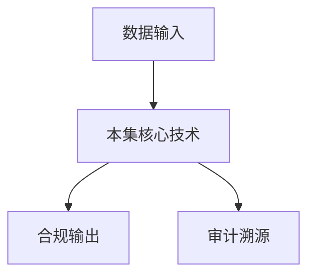

# P35 区块链与数据安全2

← [[BV1ser5BDESU-总览]] | ← [[P34-区块链与数据安全1]] | 下一篇 → [[P36-让数据“可流通、可验证、不可泄露”--零知识证明在区块链中的应用探索]]

## 视频信息

| 项目 | 内容 |
|------|------|
| 分集 | 区块链与数据安全2 |
| 模块 | 数据元件·区块链·数联网 |
| 时长 | 59 分 15 秒 |
| 链接 | [B 站 P35](https://www.bilibili.com/video/BV1ser5BDESU?p=35) |
| 官方文档 | [SecretFlow 文档](https://www.secretflow.org.cn/zh-CN/docs) |
| 内容来源 | 知识点增强（数据要素流通技术体系，非逐字转写） |

## 核心要点

1. **本 P 主题**：区块链与数据安全2
2. **模块定位**：数据元件·区块链·数联网
3. **考试/实践侧重**：链上链下协同、存证、数据交易撮合
4. **笔记层级**：教程级（约 2926 字），含速览、图解、场景 Walkthrough、自测题
5. **学习建议**：先通读「3 分钟速览」与「图解」，再读「详细讲解」；动手项见 Checklist

> 以下内容基于数据要素流通与隐私计算技术体系撰写，对应 B 站分 P「区块链与数据安全2」。**非 UP 逐字转写**；不看视频也可建立框架，看视频可对照「与视频对照表」深化。

## 本节在系列中的位置

**模块**：数据元件·区块链·数联网 · 系列第 **P35/47** 集。

**建议前置**：[[区块链与数据安全1]]——建立本集所需背景。

**建议后续**：[[让数据“可流通、可验证、不可泄露”——零知识证明在区块链中的应用探索]]——在本集能力之上继续深入。

依赖关系：政策(P01–P06) → 可信空间(P07–P08,P18) → 密态/隐私技术(P09–P24) → SecretFlow 工程(P25–P32) → 基础设施与案例(P33–P47)。

## 3 分钟速览

**区块链与数据安全2** 是数据要素流通体系中的关键一课。读完本节你应能回答：① 核心概念定义；② 在「供得出—流得动—用得好—保安全」链条中的位置；③ 与隐私计算技术栈的衔接。考试/面试侧重：**链上链下协同、存证、数据交易撮合**。

## 零基础导读

本节「区块链与数据安全2」属于 **数据元件·区块链·数联网**。即便未看视频，也应先建立**制度—技术—场景**三层视角：政策类章节回答「为什么允许流」；技术类章节回答「如何安全地算」；案例类章节回答「真实行业怎么落地」。

第一遍阅读请盯住三个问题：本集**解决什么痛点**？**关键参与方**是谁？**交付物或能力边界**是什么？第二遍阅读时，把术语表抄到 Obsidian 双链笔记，与前后分 P 交叉引用。

## 详细讲解

### 1. 区块链+数据安全深化

本 P 延续 P34，聚焦**数据交易全链路**的区块链应用：确权、定价、交付、结算、争议仲裁。

### 2. 交易流程上链

1. **挂牌**：数据产品哈希、描述、策略上链登记
2. **询价/竞价**：订单意向上链（可选）
3. **签约**：智能合约锁定条款与支付条件
4. **交付验证**：计算任务完成证明（Attestation/ZK）上链
5. **结算**：按合约自动分账
6. **争议**：仲裁节点调取审计链

### 3. 跨链与互操作

多个数据空间/交易所可能运行不同链，需**跨链桥**或**公证人**同步登记状态，避免「一货多卖」。

### 4. 与可信数据空间协同

连接器负责执行，区块链负责**见证与结算**；数字合约可在链下策略引擎执行，链上记录合约 ID 与状态变更。

### 5. 合规技术

- 无代币架构：仅用联盟链记账，避免金融合规风险
- 个人信息不上链：仅哈希或 ZK 证明
- 国密算法：SM2/SM3/SM4 满足商密要求

### 6. 考试/实践要点

- 画数据交易六步上链流程
- 说明跨链在数据要素中的必要性
- 分析区块链能否替代隐私计算（不能，互补）

### 7. 数字人民币

数据交易结算可对接数币智能合约，实现可控匿名支付。

### 8. 税务

数据要素收入会计处理与税务申报，参考财政部数据资源会计规定。

### 9. 隐私计算链下链上分工

重计算永远链下（MPC/TEE），链上只存哈希与状态机转换；避免「万物上链」性能灾难。

### 10. 学习与实践检查单

- [ ] 对照本 P 标题回顾 B 站视频章节要点
- [ ] 在 [SecretFlow 文档](https://www.secretflow.org.cn/zh-CN/docs) 找到对应模块
- [ ] 能用一句话向同事解释本 P 核心概念
- [ ] 识别一个本行业可落地的应用场景
- [ ] 记录与前后分 P 的技术依赖关系

### 11. 模块知识串联
本讲属于「数据要素流通技术」体系中的重要一环。建议在学习日志中标注：输入依赖（前序知识）、输出能力（学完能做什么）、与隐语组件映射（SecretFlow/Kuscia/SecretPad/TEE）。完成 47 讲后应能独立设计一个「政策合规+连接器+隐私计算+审计存证」的端到端方案，并评估 MPC、TEE、联邦学习的选型依据。

### 深化理解（区块链与数据安全2）

将本节概念放入「数据二十条」四原则框架：它主要支撑哪一条原则？若去掉该能力，哪类数据流通场景会受阻？用一句话向非技术经理解释本节价值。

## 图解

## 类比与直觉

数据元件像**标准化集装箱**，区块链像**不可篡改的货运单**，数联网像**港口铁路网**——让数据像货物一样可计量、可追踪、可交易。

## 例题与场景 Walkthrough

**场景：两家机构联合建模（不共享明文）**

1. **样本对齐**：若双方仅有交集用户有价值，先用 PSI（P21/P28）对齐 ID。
2. **特征拼接**：纵向联邦（P24）下 A 方持标签、B 方持特征，梯度通过安全聚合更新。
3. **训练执行**：在 SecretFlow SPU（P27）上完成密态前向/反向，或 TEE 内明文训练（P11–P17）。
4. **模型发布**：输出评分服务；模型参数经评估后按需出域，训练数据永不出域。
5. **本集关联**：区块链与数据安全2 提供其中 **链上链下协同** 能力。

## 常见误区

1. **「学完本集就会用隐语」**：SecretFlow 生态需多集串联（P19–P32），单集只是拼图一块。
2. **「隐私计算等于不上传数据」**：数据仍以密文、份额或授权方式参与计算，网络与算力开销客观存在。
3. **「TEE 绝对安全」**：TEE 依赖硬件与侧信道防护，需远程证明（P17）与补丁策略。
4. **「区块链解决一切确权」**：链适合存证与交易撮合，大规模计算仍在链下隐私计算引擎。

## 与视频对照表

| 视频段落（约） | 预期演示内容 | 笔记对应章节 |
|-------------|------------|------------|
| 开篇 0%–15% | 本集目标、背景、与前后集关系 | 本节位置、3 分钟速览 |
| 前段 15%–40% | 核心概念定义与架构图 | 零基础导读、详细讲解 |
| 中段 40%–70% | 原理展开、对比、政策/代码示例 | 图解、类比、Walkthrough |
| 后段 70%–90% | 案例、问答、易错点 | 常见误区、Checklist |
| 收尾 90%–100% | 总结、延伸资源 | 延伸阅读、自测题 |

> 本集总时长约 **59分15秒**。无官方外挂字幕时，以分 P 标题「区块链与数据安全2」与上表主题对齐视频画面。

## 动手实践 Checklist

- [ ] 复述本集 3 个定义（不看笔记）
- [ ] 根据 Walkthrough 写 200 字场景短文
- [ ] 对照视频确认 1 个架构图/演示
- [ ] 在总览思维导图中标注本集节点
- [ ] 完成自测 Q1/Q5

## 延伸阅读

- [SecretFlow 文档中心](https://www.secretflow.org.cn/zh-CN/docs)
- TC609 可信数据空间相关标准
- 本系列相邻 2 个分 P 笔记

## 自测题

1. **本集核心考点？**  
   **答**：链上链下协同、存证、数据交易撮合。

2. **本集在四原则中的位置？**  
   **答**：用得好+行业落地。

3. **与 SecretFlow 的关系？**  
   **答**：为 SecretFlow 提供密码学/算法基础。

4. **一项落地检查？**  
   **答**：是否有授权、是否最小必要、是否可审计——三者缺一不可。

5. **30 秒口述本集？**  
   **答**：用「输入→处理→输出」各一句话概括（见 Walkthrough）。

## 关键术语

| 术语 | 说明 |
|------|------|
| 数据要素 | 可参与社会化配置、创造价值的数字化资源 |
| 隐私计算 | 数据可用不可见前提下实现协作计算的技术体系 |
| 联盟链 | 许可制、多方维护 |
| 智能合约 | 链上自动执行 |

## 与前后分 P 的衔接

- ← **区块链与数据安全1**（[[P34-区块链与数据安全1]]）
- → **让数据“可流通、可验证、不可泄露”——零知识证明在区块链中的应用探索**（[[P36-让数据“可流通、可验证、不可泄露”--零知识证明在区块链中的应用探索]]）

## 逐字转写
> 引擎: whisper | 状态: 已转写 | 格式: 段落化

### [00:04 - 01:05] 我们继续往下讲
我们继续往下讲，那么之前讲到这个，我们用这个哈希去做一个搜索谜题，这个谜题呢是id加x哈希属于某一个目标集合，y对吧，这个目标集合举个例子，如果你用下256，那么256位，比如说你前4位是0，对吧，那一般你的哈希值，如果把它看作是随机的话，你大概期望是要尝试16次，才能够生成找到一个x，能够前4位是0的这么一个东西，那么要求是没有比随机的测试，随机的寻找，我们也叫brute force，对吧，暴力搜索更好的方法去搜索，那么所有的矿机都是一样的方法去做的，矿机只是用了并行化，用了硬件，用更快的方式去做，每一秒做几T次的哈希等等。

### [01:05 - 02:03] 当然现在挖矿都是违法的
当然现在挖矿都是违法的，对吧，以前早期的时候，其实在2020年的时候，我们浙大服务器也被黑客黑国拿去挖矿，当时学生去反映说，这个服务器怎么这么慢，然后我们进去一看，哎呀，已经被黑客入侵了，拿来挖矿等等，那么现在挖矿都是到东南亚去挖了，那么在这儿，他就要求哈希，他要被试做随机预言机，就是random oracle，那么注意这个假设是非常强的假设，是有学者去证明，其实你可以构造一个一种协议，这种协议，你在随机预言机的模型下，证明是安全的，但是你用任何一种现实中的哈希，去实力化随机预言机，它都是可以被攻击的，也就是说我们其实是可以制造出，某一些协议。

### [02:03 - 02:58] 它是不可以被实力化的
它是不可以被实力化的，那么但是这个随机预言机，在区块链领域仍然被广泛地使用，原因是，它在现实中，并没有找到任何有效的攻击，而且它确实是高效，随机预言机，大概你可以理解成是这么一个东西，你问他X1，他回你一个随机数，你问他X2，他回你一个随机数，你问他X3，他回你一个随机数，你再回问他X1的时候，他得回你之前告诉你的随机数，不能变，那么高效的实现方法，大概就是打表法，如果是你问他X1，他就在表格里看，X1有没有被问过，如果有，他就把这个随机数告诉你，如果没有，他就生成了X1，再生成个随机数，把它存着，下次你们X2，他就查表，如果有，他就直接给你，没有生成个随机数。

### [02:58 - 03:53] 大概是这么一个理想化的模型
大概是这么一个理想化的模型，那么因为哈希被认为是，随机的，具有随机性的，所以他的输出就约等于randon，所以你没有更好的方法，去搜索他，除了暴力的破解，对吧，当然，我尝试跟数学家去聊这件事，大部分数学家是看不懂，听不懂的，就是如果他，因为哈希是个，Deterministic的函数，是个确定性的函数，对吧，你对X做一个确定性的函数，然后你说他的输出结果，是随机的，有音效比，那正常的数学家，其实很难听懂这样的描述，对吧，但是我们这个就是一种理想化的模型，好，那么曲块链，这个比特币，他是用pro of work，工作量证明，他就是用哈希来做的。

### [03:53 - 04:48] 那么为了找到下一个block
那么为了找到下一个block，你需要找一个nance，这个nance使得对于前一个，曲块的哈希，加上一些transaction，当然是默克尔数之类的，最后，他希值要落于某一个目标区间，那么什么是某一个目标区间吗，比如说是前面有67个0，68个0，69个0等等，那就相当于约等于，你要做2的69次方个哈希，那就非常非常多，当然非常的慢，而且一般通常，不是单人去做挖矿动作，找next block的，一般是有mining pool，就是挖矿池，大家都是合作去做这件事的，早期是可以单人做出来的，当然现在很难了，现在很难很难了，这个。

### [04:52 - 05:46] 这个其实
这个其实，其实现在用prof work的，越来越少了，因为它耗电量非常高，它对能源的消耗非常高，大部分都变成POS了，过会会讲到，好，下面我们讲第四部分，智能合约，那么什么是智能合约呢，智能合约，它其实是由以太坊带来的一种创新，那我们可以把这个，比特币理解成是一代的区块链，那么以太坊为代表的，就是二代区块链，那现在当然还有三代的区块链，当然三代区块链的定义，五花八门还没有定论，但是以太坊是没有争议的是，二代的区块链，以太坊是什么呢，它其实是一个带有，这个表达能力，很强的编程语言的，这么一种区块链，对吧，你可以形象的理解，这个比特币的话。

### [05:46 - 06:15] 你把它看作是一个诺基亚的手机
你把它看作是一个诺基亚的手机，这种手机可能你们都没见过，对吧，我读书的时候，第一，我刚接触手机的时候，就是类似这种手机，诺基亚的手机，平时耐用，这种手机非常厉害，那个很难坏，很火，这个手机基本上你掉地板上，你要先看一下地板有没有坏，不会去关心这个手机有没有坏，砸不坏，都拿来砸核桃，这个手机。

### [06:19 - 07:09] 非常坚挺
非常坚挺，但是诺基亚这个公司，最后不是被iPhone打败了吗，就破产了吗，就那么，比特币就约等于是这种老式的诺基亚，那么iPhone的就，这个以太坊就相当于，是新式的这种iPhone，它的区别是什么呢，这是一个封闭的系统，而比特币确实是有script，但这个script的表达能力是有限的，而这个以太坊你可以自己开发APP，开发应用，开发软件，它是有智能合约，当然智能合约还没有定义，过活会讲，然后你可以自己去编程，去创作，对吧，这都是开放的，所以这两个一笔，你就知道大概比特币和以太坊的，区别在哪，这个，好，那么什么是智能合约，智能合约是一种在安全环境中。

### [07:09 - 08:01] 执行的计算机程序
执行的计算机程序，可以直接控制数字资产，这有很多关键点，我们一个一个来讲，首先什么是计算机程序，在vigpedia上面是这么讲的，计算机程序，computer program，是一组在计算机上执行时，用于完成特定任务的指令集合，计算机的运行依赖于程序，它通常在中央处理器中，执行程序指令，好，那么计算机程序，它其实就是一段代码，一段指令集合，那么智能合约，其实是一段代码，一段指令集合，好，第二，那么首先智能合约，我们可以看一些程序的例子，这个，这是一个典型的智能合约程序的例子，EVENTX HAPPENED IS TRUE，然后。

### [08:03 - 08:56] SANDA1000块钱
SAND A 1000块钱，不然我就SAND B 1000块钱，这什么意思呢，就是如果EVENTX发生了，我就给A 1000块钱，如果EVENTX没有发生，我就给B 1000块钱，那么有人说，这EVENTX是谁给的，这是个好问题，这个是一个，是一个其实现在仍然是一个研究度，很高的一个问题，就是区块链世界，数字世界和真实世界，怎么做连接的问题，如果这个EVENTX指区块链上的EVENTX，那是没有争议的，区块链上发生了什么事，那么这个HAPPENED HAPPENED，是非常容易去实现的，如果这个EVENTX是现实中的EVENTX。

### [08:56 - 09:43] 那就存在一个问题
那就存在一个问题，比如说我和你赌球赛，我说今天这个足球比赛，如果A队赢了，你就给我100 1000块钱，如果B队赢了，我就给你1000块钱，好，这样的赌注能不能在区块链上，能不能在智能合约上去做呢，理论上是可以的，但是谁去告诉这个智能合约A队赢了，还是B队赢了，也就是说如何把物力世界发生的事，MAP到区块链的世界，数字世界，对吧，那么在区块链的领域里面，有很多这样的服务，比如说最经验的服务，就是ORICO服务，NEWSORICO，就是有一些新闻的发布的机构，它就会对自己，对现实世界的一些新闻，去做发布，然后做签名，对吧，当然你可能不会去听。

### [09:43 - 09:54] 一家新闻的发布机构
一家新闻的发布机构，因为它可能会乱说，对吧，你可能需要相当大的trust，但你也可以找多家，对吧，在区块链上，有很多家这种新闻的发布的机构。

### [09:58 - 10:52] 你只要整合
你只要整合，比如说majority vote之类的，也能做出对吧，当然还有很多其他的方法，去使得物理世界，真实发生的事情，能够传到区块链世界，这是非常重要的，这是一个非常经典的一个话题，当然在这里，因为时间关系，我们并不去聊，如何把物理世界的事物，投射映射到区块链世界，好，这个就是一个典型的，程序的一个例子，那么下面我们来讲安全环境，什么是一个安全环境，一个安全环境最主要的特点，它是要保证执行的正确性，也就是执行结果是没有被篡改的，执行结果是正确的，其次它要保证代码和数据的完整性，当然我们还有一些可选的，附加的一些要求，比如说代码和数据的保密性。

### [10:52 - 11:51] 这也就是所谓的隐私保护
这也就是所谓的隐私保护，职能合约，比如说执行的可验证性，比如说内部程序的可用性，等等一系列的，比如说最主要的，比如说隐私保护，职能合约现在很火，因为智能合约，它其实是一段代码，被放到了区块链上面，大家都能够看见，所以没有隐私，所以你为了保护智能合约，运行过程中那些参数，和包括你的算法的隐私性，你需要利用一些技术，比如说隐私保护，智能合约的技术，今天因为时间关系，其实我并不会详细去讲，如何去实现一个隐私保护的，智能合约，因为这个讲时间太长了，大致有很多种方法，比如说有用安全多方计算的，有用TE的，有用零知证明的，有用FHE的，有这些融合的都有。

### [11:51 - 11:58] 就比如说同态加密的
就比如说同态加密的，这种全部融合的都有，所以这个其实是一个，现在还在再延的。

### [12:01 - 12:03] 这个领域还是比较
这个领域还是比较。

### [12:05 - 12:59] 变更比较快的
变更比较快的，这么一个节奏，这么一个时代，就是现在隐私保护智能合约，现在方案还是比较多的，还没有settle，还没有converge，就是现在还在科研前沿，大概这个样子，好，那么基本上，这个安全的环境，我们给一些例子，大概是什么样子，比如说是一个可信的服务器，有某一个服务器，比如说是一个中央机构去执行的，比如说网信办，给你发一个服务器，你的代码在服务器上面运行，你认为它是可信的，因为这是一个中央的一个部门，或者一个机构，对吧，那么这是其中一种方法，这就是一个可信执行环境，你在一个可信的服务器上面跑，对吧，那么第二是去中心化的计算机网络。

### [12:59 - 13:51] 这个其实就是区块链
这个其实就是区块链，比如说以太坊，那么它的做法，其实是让每个人跑一遍你的代码，那么我怎么验证你这个代码，这个计算是正确的，就是我跑一遍这个代码，如果这个计算结果，和你告诉我的计算结果是一样的，那么我就认为，你这个计算结果是正确的，所以智能合约，它其实在跑的时候要收钱的，要收gas gas gas fee，就是约等于是油费，或者叫计算费，为什么，因为你写的这段代码，全世界所有的全节点都需要跑，理论上其实所有的节点都需要跑，因为它怎么去验证你这个计算，结果的正确性，其实就是用一样的条件，去跑一遍这样的代码，这个代码我得出的结论。

### [13:51 - 14:45] 和你得出的结果是一样的
和你得出的结果是一样的，那我就认为你的结果是正确，对吧，好，那么所以开销非常大，所以不建议你在智能合约上，去搞这种非常复杂的运算，比如说算派之后的第2万位，是什么，就不要去搞这种事，这个非常烧钱，因为全世界的人都陪你做这个计算，第三种，比如说是可信值金环境，比如说intel SGX，那么SGX现在停产了以后，TDX，我们也有国产的华为，海光等等，包括一些开源的Risk 5的KissDone，这个都是可信值金环境，可信值金环境它有好处，它的好处就是，那你现在就不用去trust，不用去信任服务器，不用去信任操作系统。

### [14:45 - 15:39] 这个system的admin可
这个system的admin可以是坏的，你只要相信可信值金环境的，生产厂商就可以了，当然它也有一些坏处，就比如说，现在用的比较好的可信值金环境，比如说intel SGX，它的服务器在美国，它的可信根在美国，这个厂在美国，第一，它有可能会做恶，第二，它有可能会技术封杀，它可以说，我不对中国开放这个技术，我以后不对你做认证了，对吧，所以信创在可信值金环境里面，其实是比较火的，然后比如说我们用华为大，用海光等等，但这一些，它在可用性上面，应用性上面，和intel还是有一些区别的，但是intel毕竟是一个海外的厂商，所以在使用的时候，比如说在金融领域，名声领域。

### [15:39 - 16:40] 医疗领域
医疗领域，可能会比较慎重，因为可信根在国外这件事，现在其实在复杂的国际环境中，其实是一个比较头疼的问题，好，那么我们再讲什么，叫直接控制数字资产，比如说我写个合同，这个合同说，如果你对我的给我的讲座，这个评五分，五星，五星好评，给我五星好评的话，那我就承诺给你100元，那么这样的合同，通常是要有律师，然后要有暴力机构去强制执行，就如果我不给你，法院会判强制执行，类似这种对吧，要有律师在场，做证，要公证等等一系列的，那么像我之前在英国的时候，随便做一件事情，都需要律师，所以英国的律师，其实赚钱赚挺多的，那么智能合约就是希望，在没有可信第三方的情况下。

### [16:40 - 17:38] 能够做这件事
能够做这件事，我和你能够达成这样的一个约定，那么智能合约就是，我在像一个安全的环境中，运行的一个计算机程序，纯入了100元，注意这个100元是纯到这个程序上，也就纯到智能合约里，然后我编程的逻辑是，如果我的讲座评分达到了五星，那么这个程序，将会把100元发给你，如果没有，那么这个程序在过了一定时间以后，会把100元退回给我，大概是这个样子，那么这个就是一个标准的智能合约，它自己可以执行，它是一段代码，然后如果五星好评的证据，你有，你可以传给智能合约，这个智能合约，它就会自动执行，把100元给你，也就是说我是没有办法，控制智能合约不执行的。

### [17:38 - 18:34] 不能block它
不能block它，好，那么说到这里，智能合约出来以后，那就会有一个，比较著名的，一个concept，叫道，道，Decentralized Anonymous Organization，分布是自动化，组织或者机构，对吧，这个道，它是在公元2016年的4月30，被发布在以台坊上，最早，它是有一个德国的，理论物理学家发布的，他觉得这个事件，going to change the world，就是说，他认为以后，这就是未来机构的雛形，他就觉得以后，所有的机构，都应该是这个样子，所有的公司，都应该是这个样子的，就是说，你把公司的章程，写成代码，写成智能合约，就放在这儿。

### [18:34 - 19:31] 我作为员工
我作为员工，达到怎么样的KPI，可以得到怎么样的好处，发多少工资，都用这个程序写下来，他就不会有欠工资的问题，就不会有拖欠农民工工资的问题，也不会有老板，画的饼这样的问题，什么叫老板画的饼，就是老板给你一些许诺，这些许诺都是虚的，如果现在你用智能合约，让老板把它给你的许诺，用代码写下来，它是改不了的，放在区块链上面，它是一定会被执行的，那么这也就不是饼，如果你达到了这样的要求，你就能够拿到相应的奖励，对吧，那么这就是一个标准的，一个未来的，一个transparent，一个透明的，一个可信的，这么一个组织的一个架构，对吧，而且这个架构通常是分布式的。

### [19:31 - 20:25] 比如说我之前在IOHK工作
比如说我之前在IOHK工作，IOHK它就没有一个固定的写字楼，没有固定的一个圆区，它的员工是分布在全球的，全世界的，然后每年以前疫情之前，每年有一个gathering，就是每年有个summit，有两个，就是大家员工凑在一起，搞活动这么一个机会，然后比如说之前有到麦亚密区，然后后来有到葡萄牙区，我都有参与过，就是它有这样的gathering，但是每个人都是自己在家办公，但是如果你觉得家里的环境不够好，你可以去写字楼里面去租一间，比如说办公室，然后它会给你租金，但它没有集中化的这么一个圆区，之类的对吧，那现在其实这样的区块链公司，越来越多。

### [20:25 - 21:23] 主要在主要集中在区块链公司
主要在主要集中在区块链公司，我有几个学生毕业以后，他在区块链公司工作，他也是这样的一种形式，也就是说他在家工作，然后这个公司的实体在哪，不知道，这是一个虚构的实体，当然这些公司可能不是用道来运行的，只是说道可以让这个世界更透明，就是更透明化，就是你所有公司的章程，都用代码写下来，不能被修改，然后所有人如果他愿意加入你这个公司，就加入你这个公司，这个能解决很多事情，现在我们国家很多基金会的基金，人家觉得他不透明，不公开，比如说这种慈善的基金，这种捐款什么过来以后，然后他被用在哪，他怎么用的，然后还剩多少钱，就是需要公开，现在不够透明。

### [21:23 - 22:21] 如果你用道这种方式
如果你用道这种方式，那就非常的透明，而且谁来决定这个钱，怎么去使用，都可以在代码里写出来，然后你的权益是什么，然后他每年收了多少钱，然后怎么用这个一目了然，这个就是道，但是因为这个道出现了一个问题，紧接着在2016年的6月17号，那个以太坊上面的道，这个智能合约就被黑客发现了一个漏洞，这个漏洞的名字叫Reentering，当时他就盗取了大概价值，50Million的以太坊的币，大概约得于3.6Million的，当然现在你来算的话，是一笔天文数字，当时然后他们就面临一些抉择，就是说怎么办，怎么处理，那么在现实中，很多区块链的交易所。

### [22:21 - 23:21] 那个数字货币的交易所
那个数字货币的交易所，因为这么大金额的数字货币被盗，破产，破产了很多，对吧，那么他如果，这个以太坊他们如果，经受了这么大的一个，这笔钱的被盗，那是不是相当于是，也约等于要破产，那么他就要面临一个抉择，他想能不能够承受损失，想不想承受损失，对吧，然后就会出现了这个，著名的应分差事件，就是这个以太坊，他们这个委员会里面，就有激烈的纷争，有一部分人认为，那么我只要把区块链，因为区块链不是，不是一个block，一个block往后涨的吗，我把区块链砍到，到攻击发生之前，甚至我可以砍到，smart country的上限之前，然后我们再重新回溯历史，重新塑造未来。

### [23:21 - 24:16] 我把那个节点
我把那个节点，当做是现在最新的节点，然后再继续往后走，然后我就不把这个，到的contract放上去，这样你就没办法攻击了，对吧，这样我就可以继续往下涨，然后之前发生的事，就当没有发生，然后有一部分人认为这不对，这我们以太坊作为公司，我们公司有自己的精神，有公司有自己的立足之本，我们认为code is law，就是代码，就是法律，对吧，这就是他们公司的精神，就是区块链一旦商链，不能被篡改，不能被修改，尤其是不能被区块链公司，自己修改，那不然如果区块链公司，自己可以修改区块链，你说区块链的幸运还有吗，还有人会用区块链吗，对吧，所以这部分人，他们愿意承受损失。

### [24:16 - 24:58] 他觉得codeislaw
他觉得code is law，既然我们code上面有bug，他就是名正言顺，利用我code把这个钱拿走的，对吧，那没办法，我就承受这个损失，当然re-entering，其实我没有去讲，这个smart contract的bug是什么，因为这不是smart contract的专辑，就是智能合约的专辑，其实要讲的话，这个re-entering是个典型的例子，一定绕不过的，一定会讲，那么正因为有这个事件，所以以太坊他就分岔了，他就变成了两个，一部分现在的以太坊，你所知道的以太坊，这个价格是以前的价格，不是现在的价格，现在更贵，你所知道的以太坊。

### [24:58 - 25:58] 是抹掉了道攻击的以太坊
是抹掉了道攻击的以太坊，也就是在这个以太坊的历史上，在他的链上面，看不见道的攻击，他改变了历史，他重新修改了区块链，而这部分以太坊，他没有修改区块链，他愿意承受这个损失，他认为以太坊的精神，就是code is law，你既然写了这个代码，我们就要按这个代码执行，即使这个代码是错的，那么这部分就叫做经典以太坊，现在仍然在运行，那么因为这个事件，所以智能合约，现在智能合约做上线之前，都要做检测，都要做审计，做代码的审计，而且一家还不够，至少三家四家等等，我们这大，比如很有名的老师，比如说周亚晋老师，自己开公司做blocksec，然后他就是做代码审计。

### [25:58 - 26:55] 很多人会在智能合约上线之前
很多人会在智能合约上线之前，会找他去审计，因为不能有漏洞，因为如果有漏洞的话，一旦损失，智能合约损失起来，这都是量级，非常大的经济上的损失，对吧，你是很难承受得起，所以他们都会找大量的有名的机构，去做代码的审计，审计完了以后再上线，这就是智能合约，那么去快练，他是一个分布式系统，他抗单点故障，对吧，那么刚才讲了，他其实所有的全节点，都会存一份，完整的去快练，这个练的整个账本，所以他有数据荣誉，数据荣誉听起来是一个贬义词，其实他也是个保义词，他就相当于你有可用性，availability，你是三不了的，单方面去删自己的去快练，是没有用的。

### [26:55 - 27:21] 世界上总有一个人会记得
世界上总有一个人会记得，这个历史，对吧，那么他是用点对点的通信的网络，没有中心化的输扭，也就是说你如果想要去攻击，一个去快练的网络，其实是比较难的，因为他是brocast channel，他不是某一个主干网络，你把这个网炸了，那就可以了，对吧，然后他是开源的，透明的，他的维护。

### [27:24 - 28:18] 不是单一的维护等等
不是单一的维护等等，这些都是优点，我们先来讲一些缺点，那么一个去中心化的系统，我讲的是一个完美的，去中心化系统，其实在比，我看过很多博主去介绍比特币，他们或者去介绍以太坊，他们介绍经常会用一个词说，这是一个去中心化系统，这个系统一旦启动之后，他就没有办法被stop，就是没有办法被终止，现在已经启动了，所以他没有办法被终止，比如说比特币，没有人可以阻止比特币，就是说你想要关掉比特币，是不可能的，你可以停止代码的更新，但是人们可以仍然使用，现在的版本的代码，对吧，你没有办法把比特币，你想让他shut down，你想让他停下来，停不下来，对吧。

### [28:18 - 29:16] 当然在某种意义上
当然在某种意义上，这些博主的这样的说法是对的，原因就是一个去中心化的系统，你如何去改变，他一旦启动了，他只能按照预定的代码，预定的模式，预定的机制去运行，对吧，没有办法去做改变，我指的是完美的去中心化的系统，当然如果你有一个很，很强权的一个公司，比如说刚才讲的以太坊，他可以修改，这个去发电的历史，那另说对吧，如果是一个完美的，中心化的系统，他一旦使出去，那就没有办法改变，比如说这个是探探尼克，他哪怕前面是冰山，他是没有办法转弯的，因为没有人可以让他转弯，都是去中心化的，大家都按原定的，这个代码去做运行，对吧，这就讲到牛顿的第三定理，讲的是任何物体。

### [29:16 - 30:12] 在不受外力的情况下
在不受外力的情况下，他一定会禁止，或者云速直线运动，那既然他动了，一个去中心化的系统，既然动了，他只能沿这个方向往前动，那如何去修改他的方向，就是即使我们，比如说我们认为，他有一些bug需要修复，那么怎么去操作，对吧，那这个其实是去中心化系统里面，一个比较重要的课题，它是去快电的决策，去快电的治理，governance，去快电的治理，其实我做的比较多，我做了十几年，我现在卡达诺，就是大概前十的货币，以前都在前五，美国的四大储备数字货币之一，卡达诺，ADA，它上面用的去快电决策系统，去快电的治理系统，都是我设计的，然后用来干什么呢，就是说。

### [30:12 - 31:09] 他主要想要解决这么个问题
他主要想要解决这么个问题，就是这个去快电，应该怎么去修改，或者怎么去优化，怎么去更新，怎么去迭代，应该是谁说了算，比如说比特币，举个例子，我比如说是号称，我自己号称比特币专家，我说比特币签名算法不行，我们要换成抗量值的，来，我们换这个，这个抗量值的，我觉得性能比较好，好，那么一旦换了以后，那么所有现在比特币的软件都要换，硬件钱包，硬件都要换，矿机可能因为你可能换了哈希什么的，也要换，对吧，好，那么你把比特币这些经典的，这些元素都换掉了，那么那些人所有的东西，突然用不了了，对吧，那么你现在做的这个决策，谁来买单，谁是stakeholder，谁是权益人。

### [31:09 - 32:07] 或者谁是风险承担者
或者谁是风险承担者，对吧，再举个例子，我比如说做了刚才这一系列的操作以后，比如说比特币，它的价格突然跳水了，这个狂降，然后我自己一分比特币都没有的，我是没有比特币的，然后人家拥有比特币的，很多人都suffer，就是他招售了损失，对吧，那么这个决策是谁做的，是我做的，我做了这个决策，他们招售损失，这合理吗，不合理，对吧，那么一个区块链系统，或者一个区中心化系统，应该让谁来做决策，那么基本的一个想法，应该是让这个风险承担者，就比如说，你有1000个比特币，我只有一个比特币，那显然你对这个区块链系统，对这个比特币系统，应该怎么更新，更有话语权，为什么。

### [32:07 - 33:15] 因为这个比特币一旦崩盘
因为这个比特币一旦崩盘，你受的损失比我多，对吧，那如果我一个比特币都没有，其实其实我根本就没有话语权，对吧，应该是这么回事，但是还有个问题，就是说比特币拥有多的人，他不一定是专家，就他不一定知道怎么更新系统，虽然更新系统，他是有直接利益关系的，如果比特币价格降了，他受损，生了，他受益，但是他没有专家知识，他是不知道怎么去更新这个系统，怎么操作，对吧，这一系列的一系列，其实都是区块链治理的一些，研究的课题，我在这次课程里面，因为时间关系，就不去过多的设计区块链的治理，当然在这里，我觉得很喜欢引用，林肯的这句话，就是区块链的一个治理，你把它看作是一个。

### [33:15 - 33:58] government
government，对吧，他得off the people，buy the people，and for the people，但是现在的问题是，who are the people，就是谁是people，其实你得认清楚，谁是people，比如说这个stakeholder，谁stake拿得多，谁就有更强的话语权，没错，可以，没问题，但是如果他们不是专家，怎么办，你是不是应该也得要有专家系统的支持，对吧，但是那些专家，他确实没有，比如说自己不持毙的，那我怎么样去做这个决策，其实区块链的决策是，有非常多能能做的事。

### [34:01 - 34:57] 今天因为时间关系
今天因为时间关系，我就不细讲了，好，那么最后来讲一下数据安全，与隐私保护，那么区块链回顾一下区块链的结构，第一个结构就是链式的结构，它可以做到不可窜感，然后下面是一个底层的机制，是一个共识的机制，那么我们着重讲的是一个，工作量证明，POW的机制，也就是比特币的机制，那么其实还有POS，全益证明的机制，现在用的很火，全益证明的机制用的很火，像我们国家如果联盟链用的多，PBFT的机制，就是拜占庭，Fortolerant，拜占庭brocast等等，拜占庭的共识，这种机制是用的比较多，这主要是联盟链，联盟链，那么工作量证明主要是供链，好，那么数字签名。

### [34:57 - 36:00] 现在有很多各种各样的研究
现在有很多各种各样的研究，比如说聚合签名，多签，具有各种各样的性质的签名，都有什么Structure Preserving，什么，当然你说要抗量值，也有各种各样的签名，好，那么在区块链上面，怎么做隐私保护技术呢，那么首先第一点，我要强调的是，区块链本身，不提供隐私保护的能力，不要到时候听了这个课说，张老师说的区块链能够做隐私保护，我讲的是区块链能够用于隐私保护的系统，但是隐私保护的能力，来自于其他东西，区块链，讲白了，它就是一张大字报，一个黑板，一个白板放在天上，所有人能把数据放上去，仅此而已，放上去不能改，仅此而已，如果你要放上去数据之前，做了加密。

### [36:00 - 36:54] 加密完以后再放上去
加密完以后再放上去，那么隐私保护的能力来自于，哪里，来自于加密算法，不来自于区块链，所以区块链上面做隐私保护技术，其实产生隐私保护的是那些技术，而不是区块链本身，区块链它只是一个数据的承载者，好，那么比如说做安全多方计算，安全多方计算，在区块�上做区块链，本来就多节点，是非常好的一个平台，当然它有很多区块链特有的特性，比如说区块链的轮次，复杂度会非常的高，然后区块链里面，其实现在的特点，就是它的安全多方计算，可能做的时间耗时会非常长，如果你只用区块链的网络，去做通信的话，你想一下，它每一个block多少时间，这个时间节点和这种节奏感。

### [36:55 - 37:49] 和我们以前的安全多方计算
和我们以前的安全多方计算，以毫秒为单位，以毫秒为单位去做通信，这个完全不一样，对吧，所以这样的安全多方计算，要适应区块链，它得通信的轮次非常少，或者每一轮都得做一点进展，其次其实在区块链上面，现在刚开始做安全多方计算的时候，是这些节点，到下一轮，可能不是这些节点，可能会换一些人，还要做到state的交接，对吧，然后在下一轮，可能又换一些人，就是在区块链上面做安全多方计算，很可能你开始做安全多方计算的时候，和结束的时候，这就不是同一波人了，你需要完美的把这个状态，去转移过去，state去转移过去，让他们能够交接，能够共同的去做一个，安全多方计算的算法。

### [37:49 - 38:53] 这就是有很多类似的
这就是有很多类似的，有很多这方面的工作，现在你们其实感兴趣的话，可以去看一下，它是一个比较独特的一个赛道，就是你很难想象，做安全多方计算，你在开始的时候，那些人坐着坐着坐着，人都变了，都走了，因为你很可能会荡机，很可能会下线，可能要换一些新的血液，新的节点进来做，就是它的安全多方计算，非常很多有意思的课题，对吧，然后还签名，其实用的比较多，原因是它能提供比，存用比如说比特币的这种，匿名化这样的方式，会有更高的隐私保护的能力，因为它能假装是来自于一个集合中的，任何一个人签的签名，对吧，所以你的隐私性，就被扩大到集合，这个集合可以很大，所以你的隐私性。

### [38:53 - 40:00] 可以做到很大
可以做到很大，对吧，还有零知证明，零知证明其实，就这次穆克的讲座来说，浙大还有一位老师，会来讲零知证明，我在这就不多讲，隐私保护球交集等等一系列，其实都是一些隐私计算，在区块链上面去做，那么区块链用的最多的，是数字钱包，就是分布式数字钱包，这个叫NPC，可以，那么在工业界，如果你和一个人去讨论，在区块链上面做NPC，你首先第一点要想的，他说的这个NPC，是不是门线签名，因为在我们国家，现在门线签名，被认为是NPC，被规律于NPC，当然他确实是NPC，他是通过一个协议，去签出一个门线签名的，这个不可否认，但是我刚才前一页讲的那些NPC，可以做更复杂的功能。

### [40:00 - 40:52] 不光是签名
不光是签名，对吧，但是如果你在工业界，去跟人家去聊的时候，你要想一下，他说的NPC，是不是指的是门线签名，或者多签，是不是只是签名，对吧，好，那么其实我自己也做过一些，类似的多方的钱包，和一些企业的合作，他们还做成了产品，还上线了，就是说你比如说，当然也是多台电脑，这里比如说三台电脑，每台电脑里面有可信执行环境，我们还用了ZKP，还用了凌之证明，还用了Threadhold的signature，还用了T1E，也就是说几个比较酷的词，全部用到了，凌之证明，T1E安全多方计算，全用到了，但是你说这是血头，不是 其实每个东西都非常有用，那么有人就问，你说说看。

### [40:52 - 41:44] 这个是安全多方计算
这个是安全多方计算，安全多方计算里面加个T1E干嘛，对吧，有用在现实中非常有用，在现实从，如果你去卖这么一个产品，那么买家最大的顾虑是什么，他就是怕你这个公司，把三个节点全控制了以后，这三个节点的key share一合，不就相当于你拿到了整个key，你拿了整个key，就把他钱投走了，他不会让你去掌管这么样子的，一个数字钱包，对吧，那么怎么样去降低这样的风险，在每个节点上，不要名闻的去跑这个代码，我装一个T1E，我在T1E里面去跑这个代码，我保证即使这个节点是坏的，这个节点的操作系统，admin是坏的，他也看不见T1E里面的数据。

### [41:44 - 42:36] 自然也偷不到T1E里面的key
自然也偷不到T1E里面的key share，所以如果这个节点，我装了T1E，我在T1E里面去跑这个数据，那么会有多一层的assurance，作为买家来说，他会认为即使这三个节点，都被你控制了，你仍然没有办法，攻破T1E，那我们讲说这个T1E是别的平台的，比如说inter-sjx，别的平台的，当然现在T1E是不是完美的，也不是每年都会有一些攻击，side channel攻击，攻击的是它内部的私密型，就是机密型，对吧，它可以偷里面的一些数据，那么我这次课程里面，就不去细讲，如果T1E会有side channel攻击，应该怎么去处理。

### [42:36 - 43:41] 这其实我最近也是有一些科研的
这其实我最近也是有一些科研的，一些方向在做类似的工作，比如说我跟华为有一些合作去讲，如果T1E它是有side channel的，有leakage的，我们应该怎么去modelT1E，怎么去设计协议，能够用到T1E的功能，又可以防止side channel的泄漏等等，这个就是基本上一个标准的NPC的钱包，当然你说三方钱包会不会被倒，还是会被倒，现在其实还是有很多的新闻，最近的新闻，多签的钱包仍然被人盗取，好，曲发链最早期的时候，第一次火的时候主要用在哪，主要用在产品的溯源，真实产品的溯源，当时什么都能溯源，比如说有一些珠宝公司。

### [43:41 - 44:44] 他就讲你手上介质上面的钻石
他就讲你手上介质上面的钻石，我可以一支溯源到南非的某一个矿场，它是哪里开采的，几几年几月几日，在哪个矿场开采的，是怎么运到的，到哪里的物流公司，运到了哪里，在哪个工厂加工，在哪里做销售，最后到你手上的整条链都给你做出来，当时很火的时候，什么都可以做数字证明，当然很扯，什么都可以做数字，用曲发链做溯源，做数字资产等等，但是我要讲的是，曲发链做数字产品的溯源，还是要解决的就是物理世界，和曲发链数字世界的连接的问题，就是说是什么东西上的链，你得知道是什么东西上链了，它不是这个物体本身，对吧，刚才讲的那个钻石，是钻石上链了吗，绝对不会是钻石本身。

### [44:44 - 45:29] 这个钻石本身怎么上链呢
这个钻石本身怎么上链呢，它得数字化，对吧，比如说拍张照片也是数字化，那比如说有一个标签，有个ifid，有个tag，或者有一些什么puff，有一些什么puff指的是，phytically on clonbal function，你得有一些机制，能够让这个食物变成数字，然后这个数字上链，对吧，好，那你最后认真的是什么，认真的是这个数字，对吧，比如说你用曲发链去运一批，茅台，好，你在茅台的这个壳上都防伪，这个做好，可以扫描干什么，但你相当于认真的，是茅台的壳，我把这个茅台的壳小心翼翼的拆开，里面那个瓶子拿出来，换一个瓶子就行了，这个就是认证过的茅台。

### [45:29 - 46:25] 其实真正的茅台可能就换掉了
其实真正的茅台可能就换掉了，对吧，那你说我把茅台的瓶子，也给他做认证，对吧，那人家可以把里面的酒倒出来，你可以酒做认证吗，对吧，酒倒出来，换新的酒进去，换另一种酒进去，这不是也是有问题的吗，也就是说对于用于曲发链，用于这个产品的数源，最主要的问题是物理世界，和数字世界怎么做连接，在这个连接的过程中，往往是猫腻发生的过程中，真正已经上练了，上练的部分其实是很难被篡改的，那么现在我们讲可信数据空间，所以曲发链主要用于支撑数据，那本来就是数字的，那就好多了，那么前一波的时候用实物的话，其实还是很难做这样的连接，现在如果做数据的话，本来就是数字的。

### [46:25 - 47:29] 所以可以通过曲发链去做数据的来
所以可以通过曲发链去做数据的来源，流动路径，变化历史，数据当前的状态，然后保证数据的采集，处理流通交易使用整个过程的真实，不可被篡改，就是你可以数据都去做上练，对吧，当然我这个上练指的是一个简化的说法，其实基本上是用，比如说哈希上练数据是多方备份，存在某些数据库里面，大家都可以去访问，但是数据Handle会上练，对吧，就是整个数据在全生命周期，都可以在链上看见，也可以把这个想象成一个数据工厂，当然数据工厂，它就有一定的加工的功能，下一页我们去讲一些加工的，那么这个是我最新的一些工作，最近的一些工作，就是数据，其实它上练了以后，你可以把它看作是一个。

### [47:29 - 48:13] 数据的工厂
数据的工厂，就是每一个原始数据，它是有来源的，对吧，是谁把它上传上来的，有owner有来源的，在区块链上面，可以做交易，然后在区块链上面，你可以做进一步的计算，隐私保护的计算，比如说你要这个数据，拿来做某一些计算，生成一个新的数据，比如说我要建模，我拿这些数据，来训练一个模型，这个模型产生的是这个数据，对吧，那么这个模型，仍然是在区块链上面，我们会有一些，临织的证明，有一些方法，去对这个数据的来源进行数源，就是比如说，这个数据是哪一年，哪一月，哪一日，在谁的。

### [48:16 - 49:17] 要求下
要求下，用哪些数据去计算出来的，那么这个数据，还在区块链上面，还可以进一步的做交易，也就是说将来，区块链上面，是一个数据生数据，数据衍生数据的这么一个平台，我们把它叫做数据的工厂，就是将来，除了第一级的数据，你知道它的来源，是真实的世界上传的，后面所有的数据，都是由一有的数据加工，再加工出来的，然后整体又可以做交易，又可以做交流，又可以做交换，流通，又可以做数据的增值服务，我们认为在将来是这个样子的，上面我们这边用的，比如说是安全多方计算的方法，包括可信执行环境的方法，都可以对它对数据做加工和处理，当然我们也需要，对数据的使用权，Policy，政策。

### [49:17 - 50:20] 很多其他东西做约束
很多其他东西做约束，这里有很多细节，数据的封装，如何做数据的质量证明，就是数据已经加密了，你在买数据之前，你得知道这个数据好不好，对吧，如何做数据质量的检测，如何做原数据和数据的匹配，你能看见这个原数据，当然你可能买来，和这个原数据完全对不上，我们是用零值证明，去做一整套东西，好，在这里因为时间关系，我就不细讲了，最后可能还要强调一下，这边要用到的安全独妄计算，需要公开可验证，就是说你在区块链上面，去做数据的加工，你得保证这个结果的正确性，你不能加工，完了这个结果是错误的，对吧，所以我们对安全独妄计算，还是需要有一些新的要求，好，那么最后我们来讲一下。

### [50:20 - 51:21] 现在区块链面临的挑战
现在区块链面临的挑战，和局限性，那么首先最大的挑战，肯定是性能和可扩展性，就是TPS，就是我们国内，其实很多区块链，讲的是吞吐量，要多高多高多高，那么其实吞吐量，高到一定程度，它一定在某个环节，和某个部件上，有中心化的趋势，这个吞吐量高，在我看来不一定是好处，不一定是好处，原因是它其实做了很多妥协，它在分布式上面，肯定做了妥协，区中心化上面可能做了妥协，就是真正区中心化的系统，吞吐量其实要上去，还是比较难的，那么它和传统的数据库，相比是有很严重的性能问题，但是现在有很多离线的技术，二层链的技术，把很多的事件放到了线下，然后只有一些很小的数据量，放到了线上。

### [51:21 - 52:12] 来解决这个吞吐量的问题
来解决这个吞吐量的问题，第二存储成本的问题，虽然我刚才讲了，在区块链上面去存数据，对数据进行处理，对加工在流通，在交易等等，这个只是简化的说法，真正的数据，是很难存到区块链上面，区块链上面存数据成本是非常高的，因为区块链刚才讲了，基本上每一个全节点，都需要存下整个链，如果你把整个，比如说你有一个100TB的数据，你把它放到区块链上面，那么全世界的每一个全节点，都需要存你100TB的数据，这个存储的成本是非常高的，所以区块链上一般是只存储数据的，哈希这些数据会被备份到多个数据，库里面，可能可以公开的访问等等，去做他的availability。

### [52:12 - 53:13] 就是防止数据的物散储
就是防止数据的物散储，就是可能会有多个备份，但是不会直接存到区块链上面，一般是在区块链上面，只会存一些handle和哈希等等，那么再下去是监管和法律，不可篡改性和被遗忘权，其实是冲突的，对吧，那么比如说，你如果把数据加密以后，上链存到链上，这个动作是否合法，我明确告诉你是不合法的，为什么，因为数据的加密这个过程，它不是一个不可逆的过程，你还可以把它解密回来还原回来，对吧，所以数据加密以后上链这个过程，它是违反数据安全法，和违反个人信息保护法的，因为数据加密后上链，这个数据是可以被解密的，它不是不可被还原的，所以是不可以做的这个事。

### [53:13 - 54:10] 那很多法律法规需要做到数据的
那很多法律法规需要做到数据的，这个内容的合规，反习前等等，很多各种各样的法律法规，那个如果我们要让这个数字货币，进一步的开放，现在逐渐的在开放过程中对吧，这个区块链进一步的开放，那么就需要法律法规的完善，早期我们国家是一刀切，这个只讲链，不讲币，就是不讲金融属性，原因是早期都是杀猪盘，早期跟你讲数字货币，讲区块链的，都是为了赚你钱，骗你钱的，其实它那个链，都是很容易去创建一个，fog出来，就是自动的fog出来，然后，那个和你说，还涨了多少，都自己可以控制的，交易价格什么的，所以由相当一部分人所谓的在，在炒币，其实都在这种类似于杀猪盘，或者传销。

### [54:10 - 55:12] 这种组织里面在做
这种组织里面在做，所以国家都说，我们做区块链，只做链，不做币，我们要把它金融属性分开，为什么，因为当时这个风气非常的不好，对吧，所有做币的那些人，根本就不是做技术的，只是为了金融上去炒作，对吧，那么现在渐渐的，随了法律的健全，那么可能一些数字货币的交易市场，可能会开放，交易所等等之类的，那么下面一个，是密钥管理，其实数字货币区块链，最主要的安全性来自于密钥管理，通常我们会离线处理，离线，比如说存在某一个优盘里面，不接网，但是仍然经常会收到这样的新闻的报道，就是某一些著名的公司，他的区块链被盗，他的密钥被盗等等，最近不是美国还打击了一个，我们国家的一个。

### [55:12 - 55:26] 我不是我们国家
我不是我们国家，是中国人的一个跨境的一个犯罪团体，对吧，也是把比特币给他没收了，大概有多少，150亿美元。

### [55:29 - 56:38] 就是有各种各样的方法
就是有各种各样的方法，去盗取你的密钥，密钥管理，其实一定是一个永恒的话题，比如说多方的管理，就是数字的钱包，这个硬件的钱包等等，这个就不细讲了，最后，技术的复杂性，区块链是一门交叉学科，它既有密码学，又有计算机，也有硬件，因为你要做硬件什么之类的，对吧，电信通信，也有法律法规的一些东西，做任何一个行业的，其实都会，至少在IT行业都会，区块链或多或少的有一些贡献，那么我本次的课程，主要是从密码学的角度切入的，所以我讲的肯定是有偏的，对吧，如果你想去学智能合约，大概率你要学计算机，或者软件工程角度的那些老师去讲，他会给你讲的非常好，因为智能合约刚才说白了。

### [56:38 - 57:42] 他就是一个代码
他就是一个代码，智能合约就是程序，他会跟你讲智能合约有什么漏洞，怎么去分析这么漏洞，做发信怎么样去找漏洞，怎么样去做合规的审计等等，一系列的东西，当然这些东西，因为在密码学的范围之外，我在这就没有办法，详细的去讲，所以刚才都是点到为止，如果你们对这些感兴趣的话，其实以后可能会有后续，会有陆续的课程去讲智能合约，专门去讲智能合约，他一定是和编程细细相关的，你听的就和听C语言这种课差不多，好，最后未来展望，曲发链起起落落，其实前段时间曲发链是有过一次，热潮，然后冷下去，现在又有一点回温了，大概是这个样子，它肯定可以是和隐私计算技术。

### [57:42 - 58:39] 和AI和物联网技术等等
和AI和物联网技术等等，深度的结合，这些结合现在逐渐的看出了，一些应用的价值，那么标准化是非常重要的，因为现在其实互操作能力，还是比较差的，我自己其实还做跨链，就是我还有很多项目，做曲发链的跨链，这个曲发链和曲发链之间的，数字资产怎么做相互的认证等等，这一系列的标准还有待推进，还有在曲发链上面做隐私计算，隐私保护计算，做数据安全等等，这一些的标准其实还有待推进，那么最主要的法律法规，还是需要完善，因为曲发链，它如果要能够被用起来的话，其实监管和法律法规，其实是最主要的，现在为什么一刀切不让用，是因为法律法规没跟上，因为没办法去区分。

### [58:39 - 59:12] 什么东西是可以的合法的
什么东西是可以的合法的，什么东西是不可以的，不合法的，因为没有条款，所以只能先一刀切把它进了，对吧，那么之后等到法律法规的逐渐完善，我相信曲发链会，这个市场会越来越大，然后我们国家对曲发链的态度，也会越来越开放，好，那么本次的课程就简单先上到这里，谢谢大家，如果大家有什么问题，可以email我，秉胜，atzgu.edu.cn，好，谢谢。

## 来源说明

- ✅ B 站官方元数据（`Tools/BV1ser5BDESU-full.json`）
- ✅ 分 P 首帧封面（`Tools/bili-fetch/fetch-bilibili.js`）
- ✅ **教程级增强**：含图解/Mermaid、场景 Walkthrough、自测题（约 2926 字，2026-06-06）
- ⏳ 逐字转写：B 站 API 无外挂字幕轨；可选 Whisper/BiliNote 后续补充

## 关键截图

![[../../06-资源附件/video-notes-images/BV1ser5BDESU-P35-cover.jpg|B站首帧 P35]]
