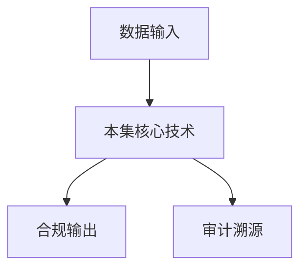

# P36 让数据“可流通、可验证、不可泄露”——零知识证明在区块链中的应用探索

← [[BV1ser5BDESU-总览]] | ← [[P35-区块链与数据安全2]] | 下一篇 → [[P37-数联网与数据空间-私域数据广域流通及复用的基础设施]]

## 视频信息

| 项目 | 内容 |
|------|------|
| 分集 | 让数据“可流通、可验证、不可泄露”——零知识证明在区块链中的应用探索 |
| 模块 | 数据元件·区块链·数联网 |
| 时长 | 36 分 55 秒 |
| 链接 | [B 站 P36](https://www.bilibili.com/video/BV1ser5BDESU?p=36) |
| 官方文档 | [SecretFlow 文档](https://www.secretflow.org.cn/zh-CN/docs) |
| 内容来源 | 知识点增强（数据要素流通技术体系，非逐字转写） |

## 核心要点

1. **本 P 主题**：让数据“可流通、可验证、不可泄露”——零知识证明在区块链中的应用探索
2. **模块定位**：数据元件·区块链·数联网
3. **考试/实践侧重**：ZK 在区块链中的应用、隐私交易、可验证计算
4. **笔记层级**：教程级（约 3010 字），含速览、图解、场景 Walkthrough、自测题
5. **学习建议**：先通读「3 分钟速览」与「图解」，再读「详细讲解」；动手项见 Checklist

> 以下内容基于数据要素流通与隐私计算技术体系撰写，对应 B 站分 P「让数据“可流通、可验证、不可泄露”——零知识证明在区块链中的应用探索」。**非 UP 逐字转写**；不看视频也可建立框架，看视频可对照「与视频对照表」深化。

## 本节在系列中的位置

**模块**：数据元件·区块链·数联网 · 系列第 **P36/47** 集。

**建议前置**：[[区块链与数据安全2]]——建立本集所需背景。

**建议后续**：[[数联网与数据空间：私域数据广域流通及复用的基础设施]]——在本集能力之上继续深入。

依赖关系：政策(P01–P06) → 可信空间(P07–P08,P18) → 密态/隐私技术(P09–P24) → SecretFlow 工程(P25–P32) → 基础设施与案例(P33–P47)。

## 3 分钟速览

**让数据“可流通、可验证、不可泄露”——零知识证明在区块链中的应用探索** 是数据要素流通体系中的关键一课。读完本节你应能回答：① 核心概念定义；② 在「供得出—流得动—用得好—保安全」链条中的位置；③ 与隐私计算技术栈的衔接。考试/面试侧重：**ZK 在区块链中的应用、隐私交易、可验证计算**。

## 零基础导读

本节「让数据“可流通、可验证、不可泄露”——零知识证明在区块链中的应用探索」属于 **数据元件·区块链·数联网**。即便未看视频，也应先建立**制度—技术—场景**三层视角：政策类章节回答「为什么允许流」；技术类章节回答「如何安全地算」；案例类章节回答「真实行业怎么落地」。

第一遍阅读请盯住三个问题：本集**解决什么痛点**？**关键参与方**是谁？**交付物或能力边界**是什么？第二遍阅读时，把术语表抄到 Obsidian 双链笔记，与前后分 P 交叉引用。

## 详细讲解

### 1. 主题：可流通、可验证、不可泄露

区块链公开透明与数据隐私矛盾。**零知识证明**允许链上验证「计算正确、合规执行」而不公开输入数据，实现三目标统一。

### 2. ZK 链上应用模式

| 模式 | 说明 |
|------|------|
| 隐私交易 | 证明余额足够不暴露金额 |
| 可验证计算 | 证明统计结果正确 |
| 身份披露 | 证明属性满足条件 |
| 数据贡献 | 证明持有有效授权 |

### 3. zkRollup 思路

批量交易在链下执行，生成 ZK 证明链上验证，兼顾扩展性与安全性。数据要素场景可类比：批量审计记录压缩验证。

### 4. 与数据元件结合

买方提交 ZK 证明「已付费且策略允许」，链上合约释放计算令牌；卖方 TEE 验证令牌后执行任务，结果哈希上链。

### 5. 技术选型

- **Groth16**：证明小、需可信设置
- **PLONK**：通用设置
- **STARK**：无可信设置、证明较大

### 6. 考试/实践要点

- 用一句话解释 ZK 如何解决链上隐私
- 对比 ZK 存证与 MPC 计算的适用边界
- 列举一个「可验证不可泄露」的业务例子

### 7. 递归证明

嵌套证明压缩多步计算验证；适合长流水线审计。

### 8. 监管科技

RegTech 用 ZK 向监管证明合规而不提交商业机密。

### 9. 身份凭证

零知识可颁发「年龄证明」「信用分区间证明」供数场准入，无需暴露底层征信明细。

### 10. 学习与实践检查单

- [ ] 对照本 P 标题回顾 B 站视频章节要点
- [ ] 在 [SecretFlow 文档](https://www.secretflow.org.cn/zh-CN/docs) 找到对应模块
- [ ] 能用一句话向同事解释本 P 核心概念
- [ ] 识别一个本行业可落地的应用场景
- [ ] 记录与前后分 P 的技术依赖关系

### 11. 模块知识串联
本讲属于「数据要素流通技术」体系中的重要一环。建议在学习日志中标注：输入依赖（前序知识）、输出能力（学完能做什么）、与隐语组件映射（SecretFlow/Kuscia/SecretPad/TEE）。完成 47 讲后应能独立设计一个「政策合规+连接器+隐私计算+审计存证」的端到端方案，并评估 MPC、TEE、联邦学习的选型依据。

### 深化理解（让数据“可流通、可验证、不可泄露”——零知识证明在区块链中的应用探索）

将本节概念放入「数据二十条」四原则框架：它主要支撑哪一条原则？若去掉该能力，哪类数据流通场景会受阻？用一句话向非技术经理解释本节价值。

## 图解

## 类比与直觉

数据元件像**标准化集装箱**，区块链像**不可篡改的货运单**，数联网像**港口铁路网**——让数据像货物一样可计量、可追踪、可交易。

## 例题与场景 Walkthrough

**场景：两家机构联合建模（不共享明文）**

1. **样本对齐**：若双方仅有交集用户有价值，先用 PSI（P21/P28）对齐 ID。
2. **特征拼接**：纵向联邦（P24）下 A 方持标签、B 方持特征，梯度通过安全聚合更新。
3. **训练执行**：在 SecretFlow SPU（P27）上完成密态前向/反向，或 TEE 内明文训练（P11–P17）。
4. **模型发布**：输出评分服务；模型参数经评估后按需出域，训练数据永不出域。
5. **本集关联**：让数据“可流通、可验证、不可泄露”——零知识证明在区块链中的应用探索 提供其中 **ZK 在区块链中的应用** 能力。

## 常见误区

1. **「学完本集就会用隐语」**：SecretFlow 生态需多集串联（P19–P32），单集只是拼图一块。
2. **「隐私计算等于不上传数据」**：数据仍以密文、份额或授权方式参与计算，网络与算力开销客观存在。
3. **「TEE 绝对安全」**：TEE 依赖硬件与侧信道防护，需远程证明（P17）与补丁策略。
4. **「区块链解决一切确权」**：链适合存证与交易撮合，大规模计算仍在链下隐私计算引擎。

## 与视频对照表

| 视频段落（约） | 预期演示内容 | 笔记对应章节 |
|-------------|------------|------------|
| 开篇 0%–15% | 本集目标、背景、与前后集关系 | 本节位置、3 分钟速览 |
| 前段 15%–40% | 核心概念定义与架构图 | 零基础导读、详细讲解 |
| 中段 40%–70% | 原理展开、对比、政策/代码示例 | 图解、类比、Walkthrough |
| 后段 70%–90% | 案例、问答、易错点 | 常见误区、Checklist |
| 收尾 90%–100% | 总结、延伸资源 | 延伸阅读、自测题 |

> 本集总时长约 **36分55秒**。无官方外挂字幕时，以分 P 标题「让数据“可流通、可验证、不可泄露”——零知识证明在区块链中的应用探索」与上表主题对齐视频画面。

## 动手实践 Checklist

- [ ] 复述本集 3 个定义（不看笔记）
- [ ] 根据 Walkthrough 写 200 字场景短文
- [ ] 对照视频确认 1 个架构图/演示
- [ ] 在总览思维导图中标注本集节点
- [ ] 完成自测 Q1/Q5

## 延伸阅读

- [SecretFlow 文档中心](https://www.secretflow.org.cn/zh-CN/docs)
- TC609 可信数据空间相关标准
- 本系列相邻 2 个分 P 笔记

## 自测题

1. **本集核心考点？**  
   **答**：ZK 在区块链中的应用、隐私交易、可验证计算。

2. **本集在四原则中的位置？**  
   **答**：用得好+行业落地。

3. **与 SecretFlow 的关系？**  
   **答**：为 SecretFlow 提供密码学/算法基础。

4. **一项落地检查？**  
   **答**：是否有授权、是否最小必要、是否可审计——三者缺一不可。

5. **30 秒口述本集？**  
   **答**：用「输入→处理→输出」各一句话概括（见 Walkthrough）。

## 关键术语

| 术语 | 说明 |
|------|------|
| 数据要素 | 可参与社会化配置、创造价值的数字化资源 |
| 隐私计算 | 数据可用不可见前提下实现协作计算的技术体系 |
| SNARK | 简洁非交互零知识证明 |
| 电路 | 将计算编译为算术电路 |

## 与前后分 P 的衔接

- ← **区块链与数据安全2**（[[P35-区块链与数据安全2]]）
- → **数联网与数据空间：私域数据广域流通及复用的基础设施**（[[P37-数联网与数据空间-私域数据广域流通及复用的基础设施]]）

## 逐字转写
> 引擎: whisper | 状态: 已转写 | 格式: 段落化

### [00:01 - 01:03] 大家好欢迎来到数据要素可信流通
大家好 欢迎来到数据要素可信流通技术的牧客，我是来自浙江大学的博士后研究员杨云博，我将给大家带来让数据可流通、可验证、不可泄漏，关于零知识证明在区块链中的应用探索，我将从这三个角度来给大家介绍，零知识证明的一些应用场景和它的一些背景知识，首先是出探零知证明，随后是零知证明、负能区块链，最后是零知证明在区块链上的一些应用，那么首先我将会给大家带来什么是零知识证明，那么零知证明的定义如下所示，零知证明系统当中通常有两个参与方，分别叫做验证方和证明方，证明者会持有一些隐私数据W，我们在英语当中可以记作为Witness。

### [01:03 - 02:03] 然后私有数据的有效性可以由一些
然后私有数据的有效性可以由一些函数或者验证来得到，那么如图所示证明者手里面持有一个W，然后它需要向验证方去证明，这个W会扔到这样的一个函数当中F，会得到相应的FW等于1，然后在这里面证明者会向验证者去生成一个证明派，这个派可以让验证方很快地去验证说W和F之间的一个关系，那么零知证明当中需要满足三个重要的一个性质，首先是协议的一个正确性，然后是协议的一个可靠性，那么协议的可靠性就要求了如果说输入是无效的，那么对应的这样的一个派它也是一个无效的验证，也就是说这样的一个prove是不能通过检验的。

### [02:03 - 02:59] 最后一个是一个可选的一个性质叫
最后一个是一个可选的一个性质叫做零知识性，那么零知证明当中这个零知识性指的是，验证者无法从对应的这样的一个prove当中获取任何有关Witness的一个信息，那么零知证明的一个通俗定义，在于它是一个密码学研究的一个重要分支，它是拥有私有数据的证明者，可以在不泄漏任何关于私有数据的一个信息的情况下面，向验证者证明数据的一个有效性，那么零知证明它可以实现的是一个数据可用不可见的一个数据安全管控，它也是数据流通当中的一个安全技术，主要用于可验证计算，那么接下来我就会给大家用一个简单的例子来介绍一下零知证明。

### [02:59 - 03:56] 那么最有名的一个是对应的阿里巴
那么最有名的一个是对应的阿里巴巴动学问题，那么在阿里巴巴动学问题当中经常就是说有一个故事，也就是说阿里巴巴和应该是七个大道的一个故事，也就是说阿里巴巴知道在动学当中，它里面存有保障了这个门的一个钥匙，但是如果说阿里巴巴直接把这个钥匙给到七个大道，然后把门打开，那么这个时候就会有一个问题，就是说阿里巴巴这个人就没有任何的利用价值了，然后这些大道就会把阿里巴巴这个人给干掉，那么在这个情况下面如何保证说阿里巴巴能够成功的通过验证，同时不泄露对应的这样的一个钥匙，也就是打开这算门的一个秘密。

### [03:56 - 04:51] 那么我们在这里就是有这样的一个
那么我们在这里就是有这样的一个故事作为一个背景的铺垫，那么在这里面我们如左图所示，假设Alice是在这里面抽象为七个大道，Bob在这里面B点是Bob，就抽象为阿里巴巴，他知道C和D点之间的一个钥匙，但是Bob不希望将像Alice去透露这样的一个钥匙是长成什么样子的，所以Bob和Alice就需要通过一个0G证明的一个手段，去证明，去向Alice去证明Bob他手里面确实是有这样的一个钥匙，那么怎么样去实现这样的一个过程呢，其实很简单，首先我们可以让Bob，Alice可以让Bob从任意的一个点。

### [04:51 - 05:50] 可以从任意的一个位置进入到对应
可以从任意的一个位置进入到对应的一个位置，比如说Alice让Bob从C点进去，然后如果Bob他里面有对应的一个钥匙，他就可以打开C点和D点之间的这样的一扇门，然后Alice要求他从对应的这个D点跑出来，那么如果说Bob他确实能够从D点跑出来，那么就说明他以很大的概率持有这一把钥匙的，那么每一次Bob可以去从对应的C点和D点出来的一个概率，如果他手里面不持有钥匙，他的一个概率是一分之一，这个就取决于Alice让Bob对应的从哪一个点出来，是从对应的C点出还是D点出，那么如果说这样的一次实验的一分之一的概率是比较大的。

### [05:50 - 06:42] 那么我在这里面的Alice可以
那么我在这里面的Alice可以让Bob去重复这样的一个实验，也就是说Bob可以从任意的一个C点进或者D点进，但是Alice可以让他从任意的一个C点出或者D点出，那么如果说Bob每一次都可以从对应的一个位置出来，那么Bob就可以以很大的概率是具有这样的一个钥匙的，也就是说对应的是前面的一个重要的一个性质，也就是对应的一个协议的一个可靠性，那么在整个协议过程当中，Alice是看不到Bob手里面所持有的钥匙长成什么样子的，所以在这个过程当中Alice看不到，所以Bob的一个0支，就是实现了对应的一个0支是性。

### [06:44 - 07:31] 那么接下来我们将会介绍对应的一
那么接下来我们将会介绍对应的一个ZKP如何负能于区块链，那么在这个章节我们将会重点介绍ZKP的一个构造，还有目前常用的一个证明方式，我们叫做Commit and Approve，那么接下来我们就来看一下对应的目前常用的一个ZKP的一个构造，那么目前ZKP的一个设计方式主要是依赖于三个重要的一个源域，分别是多项式的一个IOP，然后是多项式的一个承诺，简称为Polynomial Commitment Scan 又简称为PCS，最后使用到的是Fitt-Chamille的一个转换，那么证明者在PiOP这样的一个阶段。

### [07:31 - 08:21] 会向验证者发送一个Polyno
会向验证者发送一个Polynomial的一个Oracle，那么多项式的IOP的一个全称叫做Polynomial Interactive Oracle Proof，在这个过程当中证明者会将这样的一个多项式封装成一个黑盒，然后验证方可以像这样的一个黑盒去做一些问询，有限制的问询，那么这个问询一般是一个随机点，比如说我们的验证方在左图当中可以像这样的一个Px的一个黑盒，去询问相应的一个Alpha，然后这样的一个黑盒它就会和验证方做一个交互，然后会将这样的一个Palpha返回给对应的一个验证方，那么在这个过程当中。

### [08:21 - 09:12] Polynomial它始终会诚
Polynomial它始终会诚实地向验证方去告诉它，最终Px在x的一个Alpha点的这样的一个Palpha的一个值，但是在目前实际生活场景当中，这样的一个Oracle它是不存在的，所以我们这个时候就需要将Oracle给干掉，那么如何把Oracle给替换掉呢，那么在这里面就需要引入的是一个多项式承诺方案，那么在多项式承诺方案当中，验证方和证明方是需要去执行这样的一系列的CGMA协议，去实现左边的PiOP的这样的一个性质的，那么在这个证明者当中，我们的证明者首先会去发送这样的一个Px。

### [09:12 - 10:01] 也就是它对应的需要证明的这样一
也就是它对应的需要证明的这样一个多项式的承诺，然后把这个承诺值公开，那么承诺值一旦公开以后，后续所有的运算和验证过程，还有生成证明的过程，它都很难去改变这样的一个承诺值内部所存在的，这样的一个多项式，然后验证者在这里面，接下来在第二步就会去向证明者去发送一个问询，那么这个问询在CGMA协议里面，我们一般叫做随机挑战，英语是Random Challenge，然后这个证明者P，它就会去发送这样的一个多项式的运算，也就是Pα的这样的一个Evaluation的一个评估值，同时还会去生成对应的一个打开的一个证明，叫做Open Proof。

### [10:01 - 10:46] 然后这个OpenProof是可
然后这个Open Proof是可以让这样的验证方去验证，我这样的一个Pα确实适合我的这样的一个承诺值，还有我对应发送过来的这个α是唯一绑定的，但是我们可以看到，这样的一个多项式承诺，它是一个交互式证明系统，所以我们在SNARK当中是希望能够去实现一个，非交互式的一个证明系统，那么我们在这里面就可以将这个α，利用到这样的一个Filtres Mille做一个转换，那么在Filtres Mille当中，这个证明者就会去利用到一个RO，去计算就是将所有的Public Coin，全部输入到一个RO当中，去生成相应的这样的一个α。

### [10:46 - 11:35] 然后再将Pα和Pα发送给这样的
然后再将Pα和Pα发送给这样的一个验证方，我们这个证明者和验证者只需要进行一轮的通信，就可以让验证者去相信证明者，对应了这样的一个断言指针，那么ZKSNARK的一个优势就是在于说，它的一个验证速度比较快，然后证明的一个占用空间比较小，但是相对来说，它大量的时间都是在证明阶段，也就是证明者的一个在线阶段，会去消耗大量的一个算力，那么主要的算力来源是来源于两个部分，那么第一个复杂度的来源，就是在于说它需要对电路做一些抽象，那么电路抽象为多像是，大量需要利用到FFT的算法，那么如果是基于Sumcheck的这样的一些性质。

### [11:35 - 12:22] 也需要对电路本身
也需要对电路本身，它需要利用到大量的一些运算，来形成相应的一个多像式，它的一个耗势是比较长的，第二个部分在基于比如说像IPA，或者像KZG的一个承诺方案当中，那么多像式的一个惩罚，还有橢圆矩线上像KZG IPA上面，需要利用到橢圆矩线，然后像单边的多像式里面，会需要利用到大量的一个多像式的一个惩罚操作，那么这一些操作都需要消耗大量的一个计算资源，那么接下来我将会给大家通过一个简单的例子，来介绍相应的这样的一个Commit and Approve，那么我们首先要证明的是，给大家说明的是什么是对应的Commit。

### [12:22 - 13:07] 那么Commit主要可以分为两
那么Commit主要可以分为两个阶段，一个是Commit一个是Decormit，那么Decormit可以认为是，对应PCS当中的一个Prove的一个阶段，那么证明者需要先将自己需要承诺的这样的一个消息，M放到一个信封当中，因为信封的一个结构是公开的，然后信封内装到什么东西，在证明者打开之前是保密的，那么我们也可以知道，如果这个信封不被拆开，那么证明者很难去改变信封内的这样的一个信件，那么在Decormit也就是Prove阶段，验证者可以要求证明者去打开某一个信封，然后证明者就将这个信封当中的这个消息，给M打开。

### [13:07 - 13:49] 然后并且交给对应的一个验证方
然后并且交给对应的一个验证方，去进行一个验证，那么我们通过一个简单的试验，来给大家介绍一下，Commit and Approve的这样的一个paradigm，也就是目前常用的一个设计范氏，刚刚所介绍到的PiOPPCS和Filtres and Mia转换，其实它的一个主要的一个来源，就是在于它的Commit and Approve，那么我们在这里面假设左边有一个算数电路，那么这个算数电路仅有两个门构成，那么我们在这里面，主要是它的输入是A1,B1和C1，然后还有AR,B2和，然后它最后的这样的一个输出是一个CR。

### [13:49 - 14:28] 那么在协议执行之前
那么在协议执行之前，我们整个证明者，验证者和证明者，他也只能看到对应的电路的一个拓补结构，但是我们的验证者是不知道，A1,B1,AR,B2,还有C1,CR，这里的6个值的一个具体内容是什么，那么在具体内容公开之前，我们首先证明者，Ka可以先对每一个Wire，也就是说它每一个输入引脚和输出引脚，去选择一个对应的Renderness，然后将这个Renderness，唯一的一个Renderness，然后接下来就是这个Wire和Renderness做一个集连，去经过一个Random Oracle。

### [14:28 - 15:15] 会得到对应的每一个Wire的一
会得到对应的每一个Wire的一个Commitment，然后我们在这里面，就将对应的这样的一个Commitment给公开，也就是Ca1,CR,CB1,CB2，CCE和CC2的这样的6个的Commitment只给公开，也就是一个Wire对应一个Renderness，然后每一个Wire和Renderness对应，唯一的一个Commitment，然后接下来我们验证方就可以让证明方，去发送相应的一些随机挑战，然后这样的一个，比如说我们的验证方需要先让对应的证明方，先去打开对应的一个加法门的这样的一个信息，那么在这里面。

### [15:15 - 16:05] 我们的例子是不考虑对应的一个领
我们的例子是不考虑对应的一个领知性的，所以我们在这里面的一个打开方式，就可以直接将信封当中，也就是它Commitment里面的这样的一个内容给直接打开，那么比如说我们在这里面，需要先去证明第一个门电路，也就是证明者在这里面去，需要生成几个证明，首先它需要先将对应的C1,CR,C1,AR,AR,R,CR,CR，这样的4个值给扔出去给打开，然后将对应的每一个Wild的影角的一个输入输出值，还有它对应的这样的一个Randomness给公开，然后公开给验证方，然后验证方在这里面就可以去验证C1和A1,B1。

### [16:05 - 16:50] 是否是满足这样的一个加法关系的
是否是满足这样的一个加法关系的，同样我们可以重新的让验证方去计算，这样的一个Random Oracle的一个值，然后将C1将每一个影角和它对应的Randomness做一个集联，经过一个RO去验证说我这样的一个东西之间的一个关联性，也就是间接的去验证我的Commitment，和我的一个输入输出之间的一个对应关系，然后因为A1和B1在host的运算当中，它将不再使用了，我们就可以将A1和B1从这样的一个空间当中，给内存当中给释放出来，然后来降低对应的一个Prove Generation当中所使用到的，一个内存的一个开销。

### [16:50 - 17:38] 那么同样在证明这样的一个惩罚门
那么同样在证明这样的一个惩罚门里面，我们需要让这个证明方去打开相应的一个CAR，CBR和CCR也就是分别对应的是AR,BR和CR的一个承诺，然后它的那么如何打开呢，那么在这里面我们就可以将AR,BR,CR，和它相对应的一个Renderness RAR,RBR和RCR，这样的6个Wire值和对应的Renderness给打开，然后有验证方去进行一个验证，同样验证方在这里面因为AR比RCR打开了，然后在这里面它也可以去验证对应的一个承法门的一个移植性，也就是去验证对应的这样的一个CR，等于AR成BR,AR等于C1。

### [17:38 - 18:26] 那么在这里面就证明完成了
那么在这里面就证明完成了，然后我们值得注意的是，那么在一般的运算当中，一般的交互式证明协议当中，它的一个证明电路是非常庞大的，那么我们在这里面可以采用到的是，一个Cut and Choose的一个手段，去做一些随机的一些验证，也就是我们的验证方可以去发送固定个，就是比如说AR发个这样的一个门电路，然后要求证明者对这AR发个门电路做一个打开，然后这样它就可以不需要去验证整个门电路，然后可以仅验证相应的一些Transcript，也就是相应的一些门电路的一个输入输出，当中的一个移植性，还有和对应的Commitment的当中的移植性。

### [18:26 - 19:04] 然后来几大的降低对你的Proo
然后来几大的降低对你的Proof Generation的一个开销，那么我们接下来回到，对你的Commit and Approve for Snark的这样的一个内容，那我们就可以看到在整个现在的Snark的一个设计言语当中，那么主要是由PiOp PCS和Filth-Chamilla Transformation，三方面做一个展开，那么在PiOp for Secute里面，它是利用对应的一个约束系统，比如说像R1CS像Plunkish或者像Air，对电路做一个编码，然后得到一系列的Prover polynomial。

### [19:04 - 19:56] 我一般将它叫为证明者多像式
我一般将它叫为证明者多像式，然后有了这些证明者多像式，也就是相当于是对前面的，就是前面例子当中的一个电路的一个编码，然后我们有了这一些编码以后，我们接下来就可以利用到PCS for PiOp，对编码后的多像式，选用合适的一个方式进行承诺，然后拿来生成证明，然后这个过程其实也就对应的是刚刚的两个部分，第一个就是承诺的一个发送，然后第二个就是承诺的一个打开，然后在这个过程当中，它需要由证明者去生成对应的一个证明，然后来证明起运算的一个证确性，然后我们也可以看到刚刚的这样的一个IP的一个协议，一个协议是一个交互式证明协议。

### [19:56 - 20:37] 所以在这个过程当中
所以在这个过程当中，我们要实现对应的SNARC，也就是Succinct Interactive的这样一个性质，我们需要利用到Fittler-Mill的一个转换，然后在这里面利用到，随机与延机替换交互过程当中的这些随机数，然后来实现一个非交互式的证明，那么从刚刚这样的一个内容就可以看出来，我们这样的一个协议，它其实是主要的来源，它的paradigm的一个来源是来源与对应的commit，and prove的一个paradigm，然后来实现对应的一个ZKSNARC，最后我将给大家介绍ZKP在区块链当中的一些应用。

### [20:37 - 21:28] 那么我们现在团队之内主要完成的
那么我们现在团队之内主要完成的三大类的一些工作，主要两大类的工作主要是分布式的一个身份认证DID，和对应的一些0G证明的一个虚拟机的一些工作，那么在分布式身份认证的DID当中，通常其实是对标与对应的一个中心化的一个身份认证，那么在中心化的一个身份认证当中，通常需要有一个trusted的一个server，或者是一个centralized的一个server，需要提供对应那个服务，那么它这个时候要求中端也就是点对点的进行一个服务，点对点的让服务器和云客户端之间有一个对应的一个，一般是区别于对应的一个中心化的一个服务器。

### [21:28 - 22:24] 那么在分布式的一个身份认证当中
那么在分布式的一个身份认证当中，那么主要的一个开销就是在于它的端侧，那么在这里面主要是分为三大类的一个实体，分成发行者 证明者和验证者，那么发行者在这里面需要对证明者去发行这样的一个评证，那么证明者会向发行者去请求这样的一个评证，那么在使用这样的一个评证的时候，验证者也就是服务提供商，需要对证明者发送过来的一个评证做一些验证，那么在这个过程当中我们是需要有一个可信的一个数据管理系统的，也就是说我们的证明者的一些标识服信息，和证明者对应的这样的一个potential的评证信息，都是需要存储在一个区块链。

### [22:24 - 23:23] 可信的三方或者是一个分布式的一
可信的三方或者是一个分布式的一个服务器上，那么这个是分布式身份认证的这样的一个，基于W3C的一个标准，DID的一个标准，那么基于刚刚所介绍的这样的一个图的一个模型呢，我在这里面就将对应的一个角色分配和流程的一个简介放在这里，那么角色分配里面证明者他是一个凭证的一个拥有者，颁发者是凭证的负责对应的生辰，凭证的生辰和对应的一个凭证的一个颁发，验证者一般是验证证明者的一个身份，然后去提供一个服务，那么对应的一个流程主要在于凭证的一个签发，证明者会通过ZKP等手段向颁发者去提出一个凭证请求，那么同样的颁发者也可以通过。

### [23:23 - 24:13] 像一些中心化的一些CA机构
像一些中心化的一些CA机构，可以直接对证明者去提供一个可信的一个凭证，那么如果是基于0支持证明的话，这一个假设就可以加上一些开销，然后替换为证明者向颁发者提供请求，那么证明者在这里面可能会需要去撤销，或者对一些信息更新，那么颁发者就会对应地去进行一些删除或者更新凭证，也就是在第三方的blockchain，或者他自己本地存储的这样的一个list上面，去做一些信息的更新，那么在凭证的使用当中，证明者会和验证者做一些身份的一些交互，还有一些信息的交互，然后由证明者去证明这样的一个凭证的一个合法性。

### [24:14 - 25:02] 那么目前分布式身份认证通常是这
那么目前分布式身份认证通常是这样的一些架构图，那么基于0支持证明的ZKDID，它的一个一些基础基础有共识机制，那么共识机制它主要是可以用了，包括分布式存储 分布式网络，这些都可以分别用来纯处，分别可以用来约束它一个存储的一个准确证确性，数据存储的一个准确性，那么数字签名和0支持证明，是实现过删除的一个验证，签发管理以及更新的一些重要手段，那么ZKVM它可以将一些非常复杂的一些言语，比如说它底层需要去写一些电路，那么可以将这一些非常复杂的电路，直接利用到high-level的一些program。

### [25:02 - 25:48] 比如说像Rust的语言像C++
比如说像Rust的语言 像C++语言，直接转换成对应的一个底层电路，然后直接是ZKP可用，那么在需求方面，主要是分布式的一个身份认证，可追溯性和用户的一个隐私保护，那么在匿名评证当中，这个就需要去实现对你这个匿名性，那么在大部分场景下面的匿名性是一个可选项，因为一般找实现可验证性即可，那么在应用协议方面，通常可以采用到，像DIZK通用的一些分布式的一些领知证明系统，然后匿名评证 专用的一些领知证明协议，来加速领知证明的一个效率，那么合规和应用场景上面，其实主要是对应的隐私保护，链上的一个高效验证。

### [25:48 - 26:44] 分布式的一个身份管理和一个数据
分布式的一个身份管理和一个数据的一个可追溯性，那么应用场景，包括证物金融智能体的A证证之间的一个身份验证，和公民的一个网络电子身份标识，那么主要的两个技术路径，主要是包括领知证明，和可信的一个分布式的一个数字身份，那么领知，所以一般的很多项目，其实在区块链上面，都不有对应的一个分布式的一个身份认证，然后做相应的一些存储，然后在这个领知证明里面，就会，它是一个主要的一个技术路径，那么DID的设计，主要是分为平正发行，平正管理和平称的使用，那么我在这里面，罗列了目前常用的一些技术，那么在平正的发行当中，主要是基于数字签名，领知证明会更多一些。

### [26:44 - 27:34] 然后基于不同的属性
然后基于不同的属性，还有基于不同的需求，我们可以采用不同的，类型的一些数字签名，然后在平称的管理里面，我们通常有三种，第一种就是基于7e的一个可信之心环境，来存储所有的一个平正，和对应的一个DID的一个，就是它的identifier的一个ID信息，那么也可以利用中心化的服务器，来用于斑发 撤销和更新DID，然后可以作为一个对应的一个可信节点，也可以利用到像区块链，这一等分布式的一个系统，然后平称的状态和公要的信息，存储于一个分布式的账本当中，那么它就具有对应的不可篡改和可追溯性，那么在平称的使用当中，我们也是有基于三大类。

### [27:34 - 28:24] 第一大类就是基于对应的数字签名
第一大类就是基于对应的数字签名，那么结构比较简单，第二个是根据选用的一个数字签名，算法设计专用的一个，领知证明的一个协议，来完成对应的一个证明，然后最后就是在23年发表，在itreboyspnp上面的，有一个ZKQ10这个文章，它里面主要是基于通用的一个领知证明，也就是说用户通过ZKP，生成不可伪造的证明，实现属性级别的一个验证，然后可以不暴露具体的一个信息，那么接下来我们来介绍一下，领知证明的一个虚拟机，那么在领知证明的一个虚拟机，我们可以将高级语言，比如说像Rust 像Go，像C++的这样的一些高级语言，可以不用。

### [28:24 - 29:14] 利用到Sercum的一些
利用到Sercum的一些，low-level的一些电路语言，转换为对应的一个电路，然后再实现证明，它对开发者更加地友好，它会利用到编译原理当中的一些知识，然后将high-level的一些program，然后基于不同的ISC转换成，也就是它的一个指令机，转换为相应的一个可执行编码，也可以认为是一个会编语言，然后Executor就会利用到，就会基于ISC和不同的一个计算机架构，比如说像焚弩伊曼架构，像Halfo架构去执行相应的一个，就是调用Executor去执行这个程序，然后再扔到一个去生成一个trace，然后扔到prover里面。

### [29:14 - 30:01] 这个prover就会将对应的t
这个prover就会将对应的trace里面的约束信息，利用到不同的约束系统和IOP的一些，DK Snark协议去生成对应的一个约束，然后多像是，然后调用不同的一个prover算法，去生成对应的一个proof，然后这个proof就可以上练，然后由不同的用户可以在练上，直接快速的去进行一些验证，然后ZKVM的一个语言的一个high-level的一个作用，它可以将任何的一个高级语言，转换为电路语言，并且对应转换为一个简短的证明，然后在应用场景当中，就是说分布式，比如说像DID刚刚介绍的，分布式身份认证当中。

### [30:01 - 30:55] 我们通常会有不同的一个业务逻辑
我们通常会有不同的一个业务逻辑，我们的业务逻辑如果说，比如说大于18岁，比如说我们要去买酒，或者要买烟，我们就需要去向卖烟或者卖酒的地方，去证明我的身份是大于18岁的，然后在这个过程当中，大于18岁的这样的一个电路会比较复杂，然后我们就可以，利用到high-level的这样的一个Rust，或者像C++去将复杂的一些业务，做一些ZK化，然后调用ZKVM，可以将非常复杂的一个业务逻辑，压缩成一个非常简短，然后精看 短小的一个proof，然后验证方也不需要重新地，去执行这样的一个业务逻辑，然后就可以去验证，对应的这样的一个内容，它是正确的。

### [30:55 - 31:39] 那么ZKVM主要就分成三个模块
那么ZKVM主要就分成三个模块，首先是指令级，然后是执行器executed，然后接下来就是证明算法Prover，那么指令级可以分成三大类，分别是标准指令级，比如说像Maps，像Risk5等标准指令级，可以实现VM的一些基本功能，那么还有ZK Friendly，领知证明友好的一些RSA，但是相对于标准RSA来说，VM的一个表达能力偏弱，但是它在生成领知证明的时候，可以提供更快的一个证明速度，还有一种就是类似于Open VM的一种混合RSA，可以在标准的RSA上面，去扩展一些特殊操作，增强RSA的一个表达能力。

### [31:39 - 32:25] 比如说我们可以在Risk5或者
比如说我们可以在Risk5或者Maps上面，去加上像Pairing，像数字签名这样的一些，基本的一些密码学上常用的一些操作，那么在Executor里面，主要是基于不同的计算机架构，来进行设计，那么分为Fono Eman，Fono Eman里面内存和CPU是一体的，然后Halfor架构里面，内存和CPU它的一个运算是分离的，那么在混合架构里面，会去结合Fono Eman架构和Halfor架构，不同的一个优势，然后来设计新的一种架构，然后在Trace和电路里面，那么Executor会根据RSA，和计算机架构的一个运行逻辑。

### [32:25 - 33:06] 去生成对一个Trace
去生成对一个Trace，并且在Trace接下利用电路，利用不同的Circuit，来完成对一个约束，然后来证明ZKVM运行的一个证确性，然后在Prover里面，主要是由三方面的性能来决定，分为Field, PIOP和PCS，那么Field的大小，它直接决定了Prover的一个性能，那么比如说在一些特定的Field，比如说像Gody, Logs或者像Baby Bear，他们可能对64位或者32位的一个计算机，更友好，也就是说特定的一些Field，会对一些RSA的一些操作，它的一个兼容性更加，那么在PCIOP里面，目前常见的。

### [33:06 - 33:50] 可以分为SumTrack和Pl
可以分为SumTrack和Plonky3两种，那么SumTrack它支持分布式，然后在多机场景下，它的一个效率会更高，那么Plonky3，它需要执行大量的一个FFT操作，那么在PCS里面，它的KZG和IPCA，主要是在橢圆曲线上的一个操作，它的一个开销比较大，但是它的一个验证效率很高，那么Fryne它是一个后量子安全的，它的一个证明速度比较快，但是它的一个验证速度比较慢，所以后续在Fryne当中，通常需要利用到Recruising的，然后会去引入Grow16的这样的一个套路，然后去进一步的压缩Fryne的一个证明大小，然后右边。

### [33:50 - 34:35] 就是说本页的这个图
就是说本页的这个图，主要就是ZKVM的一个Trace的生成，然后对于Trace也会去，根据不同的一个运算，去进行一些Trace切分，比如说Arrestmatic的table，它就是对于加法门和乘法门等，Arrestmatic的一些运算做一些约束，像Control里面可能会对于，像Logic里面可能就会对于像，and XOR，然后像FL一些跳转指令，去进行一系列的约束，那么在Memory里面，比如说就有它的，就是比如说我的内存的一个读取，然后我把某一个值写入到内存，当中的某一块，然后这个部分呢，会去做一个table，然后最后会去调用。

### [34:35 - 35:14] DuringOffline的M
During Offline的Memory Checking，去检查Memory读和写的一个移植性，那么主要的实现方法，有Multi-setting，然后有基于Logup的Logup Argument的，还有基于像Promotation的这样的一些方法，那么最后呢，我将给大家介绍一些ZKV的一些其他的应用，那么ZKV的其他应用，比如说有反炸的一个风险评估，和医疗保险的一个电价，那么反炸风险评估当中呢，银行和电信的一个运营商呢，合作共同完成反炸风险评估，那么银行呢，会作为一个数据中心，然后电信的一个运营商呢，作为一个访问者。

### [35:14 - 36:08] 然后银行呢
然后银行呢，可以根据电信营服运营商所提供的一个模型，然后呢再不泄漏，用户数据的一个情况下呢，提供易受诈骗的一个用户名单，然后在医疗保险定价方面呢，医疗医院呢，可以和保险机构合作，共同完成医疗保险的一个定价，那么在这里面呢，医院呢，作为一个数据中心，保险机构呢，作为一个访问者，然后呢，在医院呢，根据保险机构所提供的模型上面呢，可以再不泄漏医疗用户的，医疗的一个健康数据的一个情况下呢，提供对你的一个保险定价，那么同样呢，啊，基于林芝证明的一个，信息安全的一个管控框架呢，它可以在数据安全，保护数据安全的一个前提下呢，可以充分的一个挖掘数据的一个价值。

### [36:08 - 36:54] 那么在应用
那么在应用，它的一个应用范围很广，然后它的数据是最小化的，也就是说林芝证明呢，它适用于金融医疗，然后通信保险等多个领域，和它的行业，然后它的应用范围非常的广，然后呢，它也可以数据最小化，它可以在数据可用不可见的方面呢，在模型推理，模型分析等用途上面呢，可以直接，只把自己需要利用到的数据呢，给披露出来，然后呢，同样呢，这个披露的数据呢，可以利用到林芝证明当中这个，林芝信，然后呢，来形成相应的一个隐私保护，进而保护对应的一个数据安全，然后感谢大家的一个聆听。

## 来源说明

- ✅ B 站官方元数据（`Tools/BV1ser5BDESU-full.json`）
- ✅ 分 P 首帧封面（`Tools/bili-fetch/fetch-bilibili.js`）
- ✅ **教程级增强**：含图解/Mermaid、场景 Walkthrough、自测题（约 3010 字，2026-06-06）
- ⏳ 逐字转写：B 站 API 无外挂字幕轨；可选 Whisper/BiliNote 后续补充

## 关键截图

![[../../06-资源附件/video-notes-images/BV1ser5BDESU-P36-cover.jpg|B站首帧 P36]]
