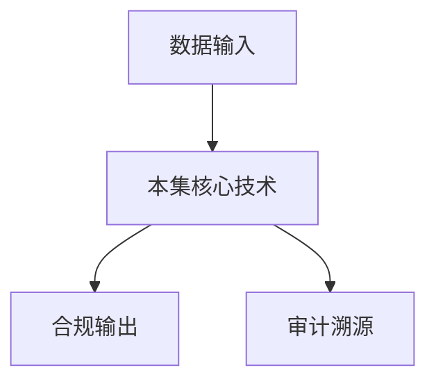

# P38 数场技术及架构

← [[BV1ser5BDESU-总览]] | ← [[P37-数联网与数据空间-私域数据广域流通及复用的基础设施]] | 下一篇 → [[P39-案例-新冠重病预测]]

## 视频信息

| 项目 | 内容 |
|------|------|
| 分集 | 数场技术及架构 |
| 模块 | 数据元件·区块链·数联网 |
| 时长 | 43 分 31 秒 |
| 链接 | [B 站 P38](https://www.bilibili.com/video/BV1ser5BDESU?p=38) |
| 官方文档 | [SecretFlow 文档](https://www.secretflow.org.cn/zh-CN/docs) |
| 内容来源 | 知识点增强（数据要素流通技术体系，非逐字转写） |

## 核心要点

1. **本 P 主题**：数场技术及架构
2. **模块定位**：数据元件·区块链·数联网
3. **考试/实践侧重**：数场技术、数据集市、供需匹配
4. **笔记层级**：教程级（约 2869 字），含速览、图解、场景 Walkthrough、自测题
5. **学习建议**：先通读「3 分钟速览」与「图解」，再读「详细讲解」；动手项见 Checklist

> 以下内容基于数据要素流通与隐私计算技术体系撰写，对应 B 站分 P「数场技术及架构」。**非 UP 逐字转写**；不看视频也可建立框架，看视频可对照「与视频对照表」深化。

## 本节在系列中的位置

**模块**：数据元件·区块链·数联网 · 系列第 **P38/47** 集。

**建议前置**：[[数联网与数据空间：私域数据广域流通及复用的基础设施]]——建立本集所需背景。

**建议后续**：[[案例：新冠重病预测]]——在本集能力之上继续深入。

依赖关系：政策(P01–P06) → 可信空间(P07–P08,P18) → 密态/隐私技术(P09–P24) → SecretFlow 工程(P25–P32) → 基础设施与案例(P33–P47)。

## 3 分钟速览

**数场技术及架构** 是数据要素流通体系中的关键一课。读完本节你应能回答：① 核心概念定义；② 在「供得出—流得动—用得好—保安全」链条中的位置；③ 与隐私计算技术栈的衔接。考试/面试侧重：**数场技术、数据集市、供需匹配**。

## 零基础导读

本节「数场技术及架构」属于 **数据元件·区块链·数联网**。即便未看视频，也应先建立**制度—技术—场景**三层视角：政策类章节回答「为什么允许流」；技术类章节回答「如何安全地算」；案例类章节回答「真实行业怎么落地」。

第一遍阅读请盯住三个问题：本集**解决什么痛点**？**关键参与方**是谁？**交付物或能力边界**是什么？第二遍阅读时，把术语表抄到 Obsidian 双链笔记，与前后分 P 交叉引用。

## 详细讲解

### 1. 数场技术

**数场**是数据要素市场化配置的「交易场」抽象：汇聚供需、撮合匹配、定价发现、合规交割。可以是物理交易所，也可以是线上平台。

### 2. 数场架构

| 模块 | 功能 |
|------|------|
| 挂牌大厅 | 数据产品展示、搜索 |
| 撮合引擎 | 需求与供给匹配 |
| 合规审查 | 准入、来源核验 |
| 交割系统 | 密态交付、API 开通 |
| 清算结算 | 计费、分账、发票 |
| 监管视图 | 报送、监测 |

### 3. 技术架构要点

- 前端：门户 + 开发者控制台
- 中台：目录、合约、订单、计费
- 后端：Kuscia/SecretFlow 计算集群 + 区块链存证
- 连接器：参与方接入

### 4. 与数联网协同

数场是**应用层**（交易市场），数联网是**网络层**（互联设施）。数场可接入数联网获取更多供给，数联网通过数场实现价值变现。

### 5. 运营模式

- 公益型：公共数据授权运营配套
- 商业型：行业数据交易所
- 混合型：场内场外结合

### 6. 考试/实践要点

- 列举数场六大模块
- 说明数场交割系统与隐私计算的关系
- 分析一个行业（如汽车）数场的参与方构成

### 7. 数据经纪人

数场可出现经纪方撮合供需，收取佣金，需牌照与合规审查。

### 8. 国际化

跨境数场须数据出境评估；本地化节点+联邦计算混合。

### 9. 指数挂牌

数场可发布数据价格指数（类似 CPI），反映供需与质量溢价，指导元件定价谈判。

### 10. 学习与实践检查单

- [ ] 对照本 P 标题回顾 B 站视频章节要点
- [ ] 在 [SecretFlow 文档](https://www.secretflow.org.cn/zh-CN/docs) 找到对应模块
- [ ] 能用一句话向同事解释本 P 核心概念
- [ ] 识别一个本行业可落地的应用场景
- [ ] 记录与前后分 P 的技术依赖关系

### 11. 模块知识串联
本讲属于「数据要素流通技术」体系中的重要一环。建议在学习日志中标注：输入依赖（前序知识）、输出能力（学完能做什么）、与隐语组件映射（SecretFlow/Kuscia/SecretPad/TEE）。完成 47 讲后应能独立设计一个「政策合规+连接器+隐私计算+审计存证」的端到端方案，并评估 MPC、TEE、联邦学习的选型依据。

### 深化理解（数场技术及架构）

将本节概念放入「数据二十条」四原则框架：它主要支撑哪一条原则？若去掉该能力，哪类数据流通场景会受阻？用一句话向非技术经理解释本节价值。

## 图解

## 类比与直觉

数据元件像**标准化集装箱**，区块链像**不可篡改的货运单**，数联网像**港口铁路网**——让数据像货物一样可计量、可追踪、可交易。

## 例题与场景 Walkthrough

**场景：两家机构联合建模（不共享明文）**

1. **样本对齐**：若双方仅有交集用户有价值，先用 PSI（P21/P28）对齐 ID。
2. **特征拼接**：纵向联邦（P24）下 A 方持标签、B 方持特征，梯度通过安全聚合更新。
3. **训练执行**：在 SecretFlow SPU（P27）上完成密态前向/反向，或 TEE 内明文训练（P11–P17）。
4. **模型发布**：输出评分服务；模型参数经评估后按需出域，训练数据永不出域。
5. **本集关联**：数场技术及架构 提供其中 **数场技术** 能力。

## 常见误区

1. **「学完本集就会用隐语」**：SecretFlow 生态需多集串联（P19–P32），单集只是拼图一块。
2. **「隐私计算等于不上传数据」**：数据仍以密文、份额或授权方式参与计算，网络与算力开销客观存在。
3. **「TEE 绝对安全」**：TEE 依赖硬件与侧信道防护，需远程证明（P17）与补丁策略。
4. **「区块链解决一切确权」**：链适合存证与交易撮合，大规模计算仍在链下隐私计算引擎。

## 与视频对照表

| 视频段落（约） | 预期演示内容 | 笔记对应章节 |
|-------------|------------|------------|
| 开篇 0%–15% | 本集目标、背景、与前后集关系 | 本节位置、3 分钟速览 |
| 前段 15%–40% | 核心概念定义与架构图 | 零基础导读、详细讲解 |
| 中段 40%–70% | 原理展开、对比、政策/代码示例 | 图解、类比、Walkthrough |
| 后段 70%–90% | 案例、问答、易错点 | 常见误区、Checklist |
| 收尾 90%–100% | 总结、延伸资源 | 延伸阅读、自测题 |

> 本集总时长约 **43分31秒**。无官方外挂字幕时，以分 P 标题「数场技术及架构」与上表主题对齐视频画面。

## 动手实践 Checklist

- [ ] 复述本集 3 个定义（不看笔记）
- [ ] 根据 Walkthrough 写 200 字场景短文
- [ ] 对照视频确认 1 个架构图/演示
- [ ] 在总览思维导图中标注本集节点
- [ ] 完成自测 Q1/Q5

## 延伸阅读

- [SecretFlow 文档中心](https://www.secretflow.org.cn/zh-CN/docs)
- TC609 可信数据空间相关标准
- 本系列相邻 2 个分 P 笔记

## 自测题

1. **本集核心考点？**  
   **答**：数场技术、数据集市、供需匹配。

2. **本集在四原则中的位置？**  
   **答**：用得好+行业落地。

3. **与 SecretFlow 的关系？**  
   **答**：为 SecretFlow 提供密码学/算法基础。

4. **一项落地检查？**  
   **答**：是否有授权、是否最小必要、是否可审计——三者缺一不可。

5. **30 秒口述本集？**  
   **答**：用「输入→处理→输出」各一句话概括（见 Walkthrough）。

## 关键术语

| 术语 | 说明 |
|------|------|
| 数据要素 | 可参与社会化配置、创造价值的数字化资源 |
| 隐私计算 | 数据可用不可见前提下实现协作计算的技术体系 |
| 数联网 | 数据互联基础设施 |
| 数据元件 | 标准化可流通数据单元 |

## 与前后分 P 的衔接

- ← **数联网与数据空间：私域数据广域流通及复用的基础设施**（[[P37-数联网与数据空间-私域数据广域流通及复用的基础设施]]）
- → **案例：新冠重病预测**（[[P39-案例-新冠重病预测]]）

## 逐字转写
> 引擎: whisper | 状态: 已转写 | 格式: 段落化

### [00:01 - 01:05] 大家好,很高兴今天能够给大家分
大家好,很高兴今天能够给大家分享一役社区的塑胶素可信流动技术目客，今天我分享的是竖厂技术集架构，我是来自于河非纵默性国家科学中心数据工业营运的赵春玉，来自课程包括四个部分,分别是发展背景，竖技厂的技术理论,竖技教路场技术体系以及竖厂的技术架构，首先是发展背景，大的背景是整个生产要素的一个演变过程，最早从奴隶社会、红建社会都是以竹技和劳动为核心生产要素的一个农业经济，然后到了工业经济时代,随着第一次工业革命、第二次工业革命和第三次工业革命的发展，然后先后资本和技术成为了关键的生产要素。

### [01:05 - 02:14] 然后到了以互联网为代表的新技术
然后到了以互联网为代表的新技术加快应用,拉开了数据、数据经济时代的序幕，然后数据成为了核心的生产要素，然后在这个过程中,数据的规模呈现直数级增长，它的成本也大幅降低，然后十四届、十九届、四中小会的时候也将数据列为了关键的生产要素，第二个背景是,我们现在进入到了一个数据要素化的一个时代，但是在这个时代中,如何更好地去发挥数据的作用，如何更好地去释放数据要素的价值，其实这个其实需要数据就是来提供支撑，我们在这里面把它划分为1.0时代和2.0时代，1.0时代数据是在小范围的正习的内部去流通，然后进行数据资源的开放和共享。

### [02:14 - 03:15] 它的数据的规及方式是以传统的那
它的数据的规及方式是以传统的那种硬规及硬考备的方式去进行规及数据，然后提供系统内的安全防护，然后它在这个过程中也会有相应的英文软件，就是业务流程加功能级实践的比如我们的ERP，我们的Mess系统的SKAMA等等，然后到了2.0时代,它从以功能为中心，转变为了以数据为中心，数据的英文价值的状态也发生了改变，在这个过程中,数据的流通范围变得更加广泛，它的数据按照贡献去分配相关的收益，然后它是一个分布式连接的过程，它需要保证我们跨域的安全，然后数据它的属性也从资源变成了资产，然后在这个过程中完成了它的要素化，然后在这个2.0时代。

### [03:15 - 03:21] 它的英文也是以数据加值能体
它的英文也是以数据加值能体，这样的一种方式来提供它的英文。

### [03:24 - 03:50] 那么从懂得来看的
那么从懂得来看的，从1.0时代到2.0时代，去支撑数据要素价值的释放，支撑数据要素更好的去利用，它的关键就在于构建一个新型的数据设施，第二部分是数据场的理论，这个理论可以去指导和支撑，基础设施的建设和基础设施的构建。

### [03:53 - 05:06] 第一部分我们先来看一下数据场的
第一部分我们先来看一下数据场的定义，我们知道厂是一个物理学上的概念，厂是对时间和空间的一个函数，我们在中学的物理，物理的时候学过引力厂，学过电磁厂，我们在实体中间有质量的物体形成引力厂，比如说地球和月亮之间，地球和太阳之间都是有引力厂，电磁空间带电磁体形成电磁厂，在电磁厂的作用下带电物体形成有序运动，与各种各样的电磁效应，然后我们把这个厂和空间的概念进一步延伸，我们认为有价值数据，是不是可以形成数据场，然后在数据场作用下，在数据空间内有序的流通，然后与价值释放，回到我们数据场的定义，数据场是对数据空间中的要素，及其项目作用的基础描述。

### [05:06 - 06:15] 与东理学学的一个载体
与东理学学的一个载体，然后数据场可以刻画，数据在时空上的分布去描述，数据在数据空间中运动的基本规律，然后在数据场的作用下，无序的数据有序的流通，有序的数据持续的传到价值，接着来看，在从数据空间上来讲，数据空间是一个理散的高违的空间，然后数据空间中的种类繁多，然后它们不断地进行相互作用，数据场基于数据空间，对极度复杂的几层元素进行一个建模，然后用佩佩韩素，重种化群等统计场论的方法，连接微观与宏观，对数据空间的整体的东理学性质，进行准确描述与测量，数据场用统一的韩素，标准整合数据的产生，变化 聚合 供趋 权限 隐私，交易等多内学属性。

### [06:15 - 07:21] 提供一整套完备的数据空间的描述
提供一整套完备的数据空间的描述与计算理论，比如说我们有人机物，然后人机物产生了各种各样的数据，然后这些数据之间，怎么去变换 怎么去聚合，怎么去使用，然后就可以用数据场的理论，去进行相关的描述，进一步地来看，数据场是有价值的数据，在特定空间内的相互作用，彼此关联所形成的一个信息空间，然后它既承载了数据本身所运行的信息，也构建了一种能够影响其他数据的样型，为状态的作用域，然后数据在场中的存在形式里作用方式，我们把它分为进数据场和感应数据场，进数据场是指静态，稳定存在的基础数据之间，构成信息环境的一个底层之声，进数据场由进取的数据要素产生。

### [07:21 - 08:25] 然后在这个进数据场
然后在这个进数据场，这一块数据要素之间的价值，产生引力 产生作用力，然后形成进数据场力，然后形成进数据场力，然后它是不同场景下，进数据场力的一个总和，然后感应数据场是在外部的条件，或交互行为出发下，动态生成就响应能力的场域，反映数据的生生状态，与外部环境的一个互动关系，然后感应数据场和进数据场，可以在可信流通过程中的动态演化，提供一个基础的连人框架，然后数据场它有三个的核心特征，第一个是价值连接性，数据场它的贯穿数据要素，全生命的周期，从数据的产生，产生开发治理，流通工厢 价值实现，以及安全保障等，说明周期的各环节，然后通过构建完整的价值链条。

### [08:25 - 08:55] 来实现数据要素的
来实现数据要素的，高效流转于价值增值，第二个是动态流通性，数据场具有独特的，时空动态特性，能够促进数据要素在不同时间，空间 维度上的高效流动，保证数据价值的，及时释放有传递，第三点是协同互联性，在数据场中，数据要素不是一个孤立的存在，还是通过各种相互作用，来形成一个具有，高度协同效用的整体。

### [08:59 - 10:09] 我们进一步去推论
我们进一步去推论，数据场相关的理论，以及相关理论的验证，我们也是从电磁场，引力场 然后到数据场，电磁场，是电流生磁 或者磁电生电，然后引力场，是惯性质量，与引力质量等价，然后我们可以推出，数据场的数据具有，非的军营性等特性，我们在这边，进一步进行，假设，在电磁场存在连续的，进市场作为相互作用媒介，引力场，引力是质量造成时工，湾区的抵核，数据场是有价值数据，形成数据场，然后在数据结构，与冬丽学，冬丽学响应这一块，要探讨的，第一个是如何将数据场，主要为，严格的数据结构，第二个是如何描述数据价值流动，因为数据场，目前还是在不断的，研究和推进之中，如果数据场假得成立的话。

### [10:09 - 11:17] 它也应该满足
它也应该满足，数据结构完整性，工理之性与相关的冬丽学规则，在这一块的理论，一是什么呢，一是它可以去，指导和开拓数腰数领域，相关的研究，比如说数据是按需留动的，按需留动的，数据在高为羽翼的，结构场中的激发状态，即流动，与场景羽翼，与结构式能共同驱动，可以将数据，最小化流通面的进行封装，通过高层次抽象方法，标准化为羽翼一致，格式可结合的数据件，构成场中基本激发单元，第二个是价值的自然有限，价值是在，结构实际上，价值是在结构，时间羽翼场中的激发状态，与行为所共同决定的函数，因此价值在数据，与模型，场景羽翼之间的作用，逐步的能够有限，不要数据的，典型的价值施放模式。

### [11:17 - 12:31] 构建面向高羽翼结构的价值抽象
构建面向高羽翼结构的价值抽象，以度量框架，引导供需双方在市场中，实现一个动态的一个进价居行，第二个，基础体系，在前面，基础理念之上，进不去构建，一个数据产的一个基础体系，数据产的基础体系，首先，它是覆盖数据要素的，全生命中期环节，从它数据的产生，搭达了治理，流通 处理 安全 等等，完整的覆盖数据层产生，到最后利用，一个数据行为过程中的，方方面面，然后，我们可以把它盖过为五块，分别是，原子画的封装，全域画的治理，低伤化的流通，巨变设置处理及，产动式的安全，然后 基于数据要素产这样的一个，基础体系，就可以实现刚才数据产提到的，实现无需的数据，持续的来，创造价值，右边是。

### [12:31 - 13:31] 整个数据要素产体系的一个架构
整个数据要素产体系的一个架构，包括，数据建的封装技术，跨域的数据治理技术，巨变式的，处理技术，低伤化的流通技术，穿透式的安全技术，等等，数据建封装技术最快，又包括，关联发现，以及我们标准化的封装，跨域治理这块就包括我们跨域的，一域融合 跨域的查学，全域的隐私保护，然后 低伤化的流通技术，包括我们场景画的定价，我们定制化的供需匹配，我们规范化的交易流程，然后 巨变式的处理技术，包括我们广泊化的数据融合，然后 整治化的心理体链，协同化的鸡蛋框架等等，以穿透式的安全技术，然后 我们穿透的黑盒解释，跨域的公式和监管，我们全联络的渗透检测，等等，首先来看。

### [13:31 - 14:43] 我们数据建的
我们数据建的，封装技术，它是一种基于，一组标准 协议，以机制设计形成的一整套，一寻止，一交换 一操作的，数据建标准化，封装发达，我们首先来分析一下，我们为什么会提出，这样的一个技术，我们在交通物流领域，我们很多，很多商品 很多物品，其实是基于，一个标准化的集装箱，去运输的，有了这样一个标准化的集装箱，我们在物流转运，整个运出过程中，会特别的方便和快捷，比如说我们从海运，到我们的内核的航运，到我们的铁路运输，在整个过程中，我们使用集装箱运输的话，是特别的，方便和快捷的，代表说，水，我们水在，流通运输的时候，也是有一个，标准化的一个容器来成装的，我们有各种各样的一个。

### [14:43 - 15:51] 各种各样的一个瓶装水
各种各样的一个瓶装水，就是因为，是在数据，流通和共享的过程中，数据的组织形态，是不一样的，是有各种各样的，有各种各样的组织形态，数据，然后有不同的，不同的文件，不同的格式 不同的形态等等，然后在这样的一个，不同的组织和不同的形态，它其实真的是不利于，这个流通和使用的，然后，我们在这种背景下就提供，提供一种标准化的，封装方法，我们把所有的数据，或者说我们在，我们在这个流通过程中的数据，我们都把它封装成一个，标准化的一个构建，我们把它称为数据箭，然后数据箭是，可以让数据可计量，可以让数据在，然后它比如说包括，我们统一的，表征模型，然后在这个表征和过程中，我们会给它。

### [15:51 - 17:07] 定义统一的
定义统一的，描述语言，然后定义，统一的语义，然后我们在整个封装过程中，也会使用，高效的一个存储结构，用来优化，数据的存储，然后在整个，封装的过程中，也会采用相关的安置，包括同态加密，查分隐私，全线配置等等，然后通过这样的一个，封装和构造，我们得到了一个数据，标准化的一个流通单元，它也是可以满足，分布式数据流通的一个需求，然后有了这样的一个，标准化的数据流通单元，数据构建，就可以让机器，更快的读懂数据，然后，占用的资源也更爽，可以更快，更高效的去进行，广域的大规模的，数据流通，最终可以实现，我们提升数据的价值，提升语义的统一，提升高效的减缩，等等，我们数据流通的一个需求。

### [17:07 - 18:18] 第2个
第2个，是跨域数据治理技术，它是，构建统一高效的，跨域数据管理系统，实现语义的融合，数据查询的可统一，数据协作的可信任，首先我们来看一个跨域的概念，什么是跨域呢，我们，非常容易理解，在地理空间上的跨域，比如说不同的省份，数据在不同的省份，不同区域之间，这个跨域，跨空间域，还有一种是跨域是什么跨域，在工作中有不同的条线，不同的条线，比如说有不同的行业，自然自然，我们的金融交通，在不同的条线，我们有不同的管车范围，然后不同的管车范围，它对数据的安全的，要求也是不一样的，我们这个时候把它称为跨管车，管车域，然后还有一种跨域，是什么跨域呢，就是说我数据。

### [18:18 - 19:18] 我在有某一个范围内流通
我在有某一个范围内流通，我对这个范围内的主体，我是信任的，我是信任的，但是当数据脱离了这个范围的时候，脱离了这个范围内的时候，脱离了这些，这些主体的时候，然后这个时候，我作为数据提供者，提供方来讲，我对其他超出了我这个范围内的，我是不信任的，我们把它叫做跨信任域，然后大概是这样的一种，跨域的一个解释，然后再在跨域，数据在跨域流通中，它可能就会有各种各样的一个问题，比如说我们怎么进行跨域的融合，跨域的融合，这块呢主要是解决，跨域数据，与意志性的一个问题，然后来构建一个跨域，统一的数据的，与意层面的一个模型，比如说，我们针对同一个东西，在不同的空间域。

### [19:18 - 20:18] 不同的空间域
不同的空间域，它有不同的表达方式，但是在某一些行业，某些领域，它对与盐和与意的经营的要求是，不允许出现一个字的误差，因为如果出现了，那个数据在，数据在跨域传递过程中，如果出现了，误差可能造成非常非常严重的，后果，现在可能造成一些医疗事故，这一块，这就是我们讲的那个跨域数据融合技术，包括我们那个，主要是与意的融合，然后跨域系列查询技术，针对，因为我们刚刚讲了几个跨域，我们跨空间域，我们跨管辖域，然后针对跨域多方的，资源益购，我们提供一种益购资源的感知，然后，和那个跨域的查询性的优化技术，来实现，查得快，因为就比如说我们不同的，不同的那个，数据，益购，它可能就是说。

### [20:18 - 21:18] 造成我们有时候是
造成我们有时候是，没有办法查询的，或者说我们查询的特别特别慢，已经影响了我们工作的一个效率，然后，还有一种是，跨域的数据，数据协作技术，然后针对，跨域数据，数据保护，因为就我们，不同的数据，在我们不同的，管辖范围，在我们不同的主体，它有不同的保护方式，然后这时候，我们提出了一种，基于那个算子的，协同的计算方法，来促进和支撑，跨域数据的协作，第三个是，低伤化的，低伤化的流通技术，然后通过需求指引，价值指导，供需缩和，来构建一个有序，高效，结构化的多元的，一个数据叫做流通生态，第一个是，场景化的使用定价技术，在当前的，当前的数据，流通交易的一种，其实数据价值的，评估数据的定价。

### [21:18 - 22:20] 还面临着一些问题
还面临着一些问题，因为它数据有，有它不同于，传统的生态要素的，数据特征，亦复制，亦复制，可以无限的复制，然后它，还有实效性，还有非实体性，等等这样的一个特征，这样的一些特征，都给数据的定价，造成了一些阻碍，而且就是说，同一个数据，它，当它在，不同的场景去使用的时候，它的价值可能也是不一样的，然后在这一块，我们就体重了，一种，场景化的数据定价方法，然后针对数据价值场景，依赖的定价能，建立，场景化的数据要素定价机制，实现数据定价的可视力，然后第二个，是消货式的，需求挖掘，我们刚才有提到了，数据资源，是呈现指数级增长的，就是随着，我们数据化的推进，我们各种各样的企业机构。

### [22:20 - 23:26] 以及个人
以及个人，都积累了大量的，数据资源，但是有些数据资源，它，还没有找到，它能够去使用它的地方，也就是说，在这一块，需求其实是，挖掘的是不够，不够深入的，需求其实是，还没有去匹配，找到匹配它的，匹配它的一个数据，针对数据，需求表达模糊挖掘难，然后我们这边，建立一个交货式的一个需求，挖掘机制，实现数据，需求可表示，然后通过，虚方的认知，虚方的认知，和共方的认知，来去挖掘他们，在认知层面的一个差异，更好的去，更好的去，去匹配它的一个需求，来满足数据的一个需求，来更多去挖掘数据的一个价值，然后定制化了一个，一个供需匹配，我针对，我们买方数据买方的一个，一个需求，针对我们。

### [23:26 - 24:37] 我们卖方关于数据的
我们卖方关于数据的，一个描述，然后来通过，我们挣的话的一个匹配，来实现，我们数据的供应，能够高效的去满足数据，买方的一个需求，然后来建立这样的一个，供需匹配机制，实现一个高效的数据，供防和虚方的一个，高效的匹配，穿透式的安全技术，第四部分，字面向速要素流通的，数据信息指使，三大流通链路，实现数据安全的可追溯，计算安全的可验证，模型安全的可解释，它可以穿透数据流通链路中，各方，各环节的一个，安全保障理论和技术，实现，市中，市前，厂内和厂外，多方的一个安全分析和防御，第一个是一个多摩泰的，一个数据指纹和，以自检测技术，因为我们现在，使用的一些，个人数据，企业数据。

### [24:37 - 25:39] 它可能设立到一些
它可能设立到一些，个人椅子信息，和商业秘密，有一些东西，可能是不符合，个人心理保护法，和网络安全法的一些，交情人，这个是我们需要把，里面的一些关键信息，给它检测出来，然后这时候，它匹配了我们，所有进入我们这个体系内的，我们都会给数据，添加一个指，然后能够实现，全链路的一个，全链路的一个追踪，然后第二个是，多场景的，高效的以自检测理论和技术，然后我们这一块，构建了三层，分别是我们的，支撑层 算子层和应用层，支撑层包括我们的，比较定路 随机置换，不经意便利，共享 置换 升层等等，然后算子层，包括我们的，聚合函做条件与据等等，来遵守我们，真实查军的与据，我们基于规则的。

### [25:39 - 26:45] 组合设略等等
组合设略等等，来满足我们，在高满足，我们在隐私，条件下的一个，高效的计算，然后还有我们是，多方参与的，一个以自检测，多方参与学习的，一个以自检测技术，来满足我们，一些场景下，对以自的一个要求，俱变式的处理技术，然后它是，融合多种数研究理论，以技术推动，数腰速在，复杂的数据，进价交易环境中，数据价值的估计与衡量，包括我们广泊化的数据，融合，层次化的，层级化的新一体链，以及鞋动化的，计算框架，通过，广泊化的数据，融合这一块，通过数据要素的，广泊化的数据融合，可以我们，研究，适应多样市场，环境的一个，估值技术，然后层级化的，新一体链，通过，对买家行为，和经济机制进行，博弈节目语院证。

### [26:45 - 27:40] 然后来提出一个
然后来提出一个，基于，层级化新一体链的，一个，进价机制，鞋动化的计算框架，然后通过，构建数据要素交易，模拟环境，利用博弈论，智能体技术，然后来提出，进价与军合的，实现，数据进价与，数据进价的一个均衡，然后，第四部分，是我们，收场的一个技术价格，首先来看一下，它的基本概念，根据，数据进价指引，收场是，一拖开放性网络，算理和影子保护，7块链，等各类关联功能设施，面向数据要素，提供线上线下，资源登记，供需区培，交易流通开发利用，存用资源等功能，支撑多长年，应用的一种综合性，数据流通利用技术设施。

### [27:43 - 28:42] 在数据技术
在数据技术，进价指引里面，它提到的，六种技术路线，分别是，评书流通间，数链网，数场，隐私计算，7块链，数据远念等等，然后数场，也是六个核心的，技术路线之一，然后它的目标，是实现数据的，高效流通，价值的释放，一个繁荣的生态，能力这一块，是可以实现，可见，可打，可用，可控，可追溯，它的特点是，有融合性，开放性，和拓展性，然后，现在随着，技术路线的收敛，出厂，其实也在不断的，和肯定数据空间，数链网等等，多种技术路线，进一步的去融合，然后更好地去支撑，整个数据技术设施，整个数据技术设施，建设，以及数据要求，场景的应用，和价值的释放。

### [28:45 - 29:57] 我们前面提到了
我们前面提到了，数据场和数据要求场，然后现在我们开始讲，数场，然后他们之间的一个关系，其实是，基础理论，基础体系，基础设施的一个关系，然后数据场是一个，基础理论，它提供一个，机制，以及在相关，动力学特性上的，一个描述，然后它可以来支撑，数据要求场，技术体系的一个构建，然后它包含了，刚才我介绍的，五大技术模块，然后，技术理论和技术体系，可以来支撑数场，基础设施的一个建设，它是这样的一个关系，然后我们再来看一下，它的一个，概念架构，前面我们在，数据场的时候，我们提到就是说，现在整个，整个，整个社会，它有，各种各样的，主体，各种各样的主体，然后，随着数字化的不断推进，各种各样的主体。

### [29:57 - 31:01] 不断地去产生数据
不断地去产生数据，人在产生数据，机器在产生数据，相关的物体在产生数据，然后，这样的一些，这样的一些，产生数据的一个，一个源头，把它叫做截点，截点不断地在产生，产生各种各样的数据，然后数据，截点它是可以通过我们，网络的链接，通过我们的专线，我们的虚拟网络，虚拟网络，把这些相关的截点，连接在，连接在一起，然后，我们占了一些截点，连接在一起之后，我们就是，从数据的产生，到我们最后数据的应用，有这样的一个过程，从我们的设断之里，存庄登记，我们的数据封装，数据交换，应用消费等等，有这样的一个完整链条，最后在服务于，我们各种各样的场景，服务于我们的卫生健康场景。

### [31:01 - 31:28] 服务于我们的工业场景
服务于我们的工业场景，服务于我们的金融场景，交通场景等等，然后我们再回过来看，那么就是数据，从它的截点，到连接，再到数据的再生产，再到数据的一个价值释放，也就是说数据，它产生于人机物，最后也作用于人机物，这是一个整体上的一个，概念上的一个架构设计。

### [31:32 - 32:37] 整体架构上来讲
整体架构上来讲，输场，它有点，点，线，面和场，然后点就是我们的，接入连接器，我们接入连接器，连接我们的截点，然后截点就是，我们刚才讲的人机物，人机物它产生数据，接入连接器，它又分为标准版，我们把它分为标准版，基础版，标准版 拓展版和增强版，接入连接器可以连接，政府 企业 个人等等，就是在点这一层面，然后数据使用方和数据提供方，这一块它在连接器的功能上，可能上有一些区别，它在整体上是一致的，然后点与点之间，就是数据提供方和数据使用方之间，可以通过我们的，告诉我们的数据网络连接，我们的数据分发网络进行连接，也就是我们的线，也就是我们的线，然后在面上。

### [32:37 - 33:36] 是我们的平台体系
是我们的平台体系，我们的平台体系，包括我们的数场的管理平台，我们数场的数据流通利用平台，我们数场的技术之中平台，然后面与点之间，也是通过我们的线，去连接的，通过我们的高度数据网，通过我们的数据分发网络，去连接数场的平台体系，也就是我们的面，然后在最上层的，场的一层面，就是实现了我们数据的价值，利用我们的场景的建设，可以服务于我们的，城市治理，服务于我们的应急管理，公共健康，卫生健康，社会文理，普会金融等等，然后这呢，是构成了我们一个，数场的一个，总体的一个架构，包括我们的面，场，以及我们点与点之间的关系，点与线之间的关系，面与点之间的关系。

### [33:36 - 34:39] 然后面与场之间的一个关系
然后面与场之间的一个关系，然后点与点之间的，它可以通过我们的，线去连接，通过我们的网络连接，然后点与面之间的，也就是通过我们的，高度数据网，与数据分发网络去连接，然后这些呢，点线面呢，对我都支撑于我们，长径的利用，长径的建设，以及数据价值的思考，数场呢，然后它的数据，就是总的一个角色，和定位是什么呢，就是，我们刚才提到了，由于现在数据组练用，它有六种集中路线，然后数场也是其中，其中之一，也是一个比较合心的，集中路线，而且现在也在不断的和，其他集中路线进行融合，我们再看，我们看中间，这是一个数据，就是整体的一个，功能试图，它包括了算力，设施，流通利用，安全保障以及。

### [34:39 - 35:35] 智能设施接流层
智能设施接流层，这样的一整合体系，我们看我们，数据流通利用设施，从这一块，从我们最底下的，最底下的接入连接器，这一块，接入连接器，数场呢，它也有数场接入连接器，因为接入连接器，它有不同的版本，从我们的基础版，基础版标准版，我们的拓展功能，当数场的接入连接器，它具有接入连接器，去最基本的要求，最基本的要求，然后它在最基本的要求之上，拓展了数场的一些，拓展了数场的一些技术功能，我们在这一块，我们就把它，叫做数场的接入连接器，同理呢，还有那个数连网的接入连接器，有那个隐私鸡蛋的接入连接器等等，然后在接入连接器，上层呢，是我们的业务节点，业务节点，包括我们的区域。

### [35:35 - 36:19] 数据流通利用平台
数据流通利用平台，我们的公共服务平台，企业数据流通利用平台，行业数据流通利用平台，等等，这一半呢，其实就是我们数场的，流通利用平台，然后在上层呢，是节点，包括我们的权益功能节点，区域功能节点，以行业功能节点，我们的区域功能节点，以及行业功能节点呢，其实就是我们数场的，一个基础支撑平台，然后权益功能节点呢，其实就是我们的数场的，一个管理平台，管理平台，这样是一个数场，在整个基础设计中的，一个功能和定位，也可以和我们前面，讲到的那个，加购联系起来。

### [36:22 - 37:24] 然后从
然后从，功能层面上，来讲，然后，从节点，到连接，到流通，到释放，节点呢是，是包括我们的，数据的持有方，我们数据的第三方，我们数据的需求方，我们的服务方等等，然后节点呢是通过，我刚才提到的，数场的接入连接器，进行连接的，它也就是我们的点，然后连接呢，连接呢，包括我们的高速数据网，高速数据网，我们的数据的分发，数据的分发网络，连接，连接我们节点与节点之间，连接我们节点与，与面之间与平台之间，然后再上层呢是我们的，流通，流通我们的，我们的数据，从原始数据，进行标准化的封装，变成了一个数据键，然后在这里面，我们进行一个，跨意管理聚合使用，加工利用行程，数据产品，然后在这一块呢。

### [37:24 - 38:26] 也有我们那个数据
也有我们那个数据，统一的交换模型，我们数据的统一标识，来支持，来支持，然后数据，在这个过程中，也有我们相关的服务的支持，我们贡献缩和的支持，我们济费济粮的支持，我们产品交付的支持，等等，然后这一块就是，我们面上的一个流通，最后在厂上面，就是我们数据价值的，价值的释放，我们，我们可以，呈成治理，迹象服务，应急管理，医疗健康，文化理由，金融服务等等，然后在这个过程中，还有各种各样的安全，包括身份的存证的，感知的密码等等，以及相关的管控，包括国家层面的监管，以及行业的监管等等，然后在系统层面，我们把它分成，四个层，分为是我们的介入层，工能层 业务层，管理层。

### [38:26 - 39:22] 其实也是和前面的架构
其实也是和前面的架构，对应起来的，介入层，这是我们的塑厂的，结合了一起，我们把它分成了，分成了三个版本，包括我们的基础能力，标准能力和拓展能力，基础能力，包括我们的身份认证，标准能力，包括在我们的身份认证之上，又包括我们的法文控制，我们的数据介入，我们的支持记录，数据交付 运营商大商办等等，然后拓展能力，在标准能力的记录之上，就加了登记 探查 杀箱，开发 目录管理 以资计单节点，分类分析 使用控制，高度数据网等等，然后我们在部署和使用的时候，根据我们的数据主体，它数据规模的大小，它的身份，它的身份，它使用场景的一些要求，我们来可以去部署和匹配，不同版本。

### [39:22 - 40:14] 不同能力的一个数场的
不同能力的一个数场的，接入连接器，然后在功能层面，就是我们数场的技术支撑平台，可以来实现我们，统一的身份管理，统一的数据目录，统一的标识管理，统一的数据登记，连接器管理 运营监测等等，而有了我们加了一个数场，基础支撑平台，对上我们可以与，国家的权益功能节点，进行对接，然后呢，横向呢，我们可以与其他的，其他一个技术设施，包括隔音数据公司，锁链网进行横向的一个连通，进行横向的数据的互联互动，和互操作，然后在业务层面，是我们的数据流通利用平台，它包括我们的数据交易系统，数据开发系统，数据运营系统，区块链公共服务，以资金散，托管 训练场，数据交付，囤中审计。

### [40:14 - 41:17] 隔音溯源等等
隔音溯源等等，然后这个呢，可以给我们的数据供需方，我们的数据服务方，来提供相关的服务，来使得整个数据，整个数据，应用了一个支撑，然后管理层呢，就是我们的收藏管理平台，可以与我们的收藏技术之争，平台进行对接，也可以去，管理我们其他的一些，其他的一些收藏的技术之争，然后上层呢，就是我们更具体的，一些长进的，长进的一些应用，然后伴随着我们，整个，整个生命周期和系统设计，还有我们的一个，安全的保障的一个体系，这就是我们收藏，在系统层面的一个价格和设计，然后我以医疗健康，数据融合卡拉利用为例，讲一下这个怎么去，怎么去进行，收藏的，长进应用呢，比如说在。

### [41:17 - 42:14] 首先我们在那个数据层面
首先我们在那个数据层面，我们通过我们，通过我们不同，通过我们的收藏接入领先器，去接入，接入我们的数据，提供房，接入我们的数据使用房，以及接入我们的数据的，服务房和监管房等等，然后这是第一步，然后呢，这些，这些收藏的接入领先器，通过我们的数据专网，通过我们的，通过我们的区议数据网络，进行连接，然后这个数据得到了，得到了我们的，进行了相关的授权，然后确定了相关的安全策略，然后进行了，标准化的购建封装，封装成了一个，封装成了一个标准化的一个，数据购建，也就是一个，医疗健康领域的一个数据件，然后进行那个连接器的，一个可信，可信组网，然后在在管理层，数据管理层完成的。

### [42:14 - 43:12] 然后呢
然后呢，就是在，在数据，网络层到管理层完成的，然后在进一步的进行就是，予以者换，然后提供一个，安全的一个，环境，安全的一个环境，来保证整个数据使用，过程中的一个安全，包括我们，进行协同的计算，集中式的可信计算等等，然后，最后我们按照，我们使用的，安全策略，我们使用的策略，我们约定的策略，进行数据产品的，检查，如果整个，使用过程已经完成的话，我们再进行相关的，数据销毁，然后呢，基于我们这样一套体系，我们可以再打造，打造我们的疾病诊疗模型，疾病诊疗模型，我们的，智能问诊模型，然后在整个，数据使用的过程中，涉及到我们的数据的，提供法，提供法我们相关的，医疗机构等等。

### [43:12 - 43:27] 我们数据的服务法
我们数据的服务法，以及我们数据的使用法，来这样，通过这样的一整套流程，来完成一个医疗数据的，融合开发的利用过程，以上就是我的分享，谢谢大家。

## 来源说明

- ✅ B 站官方元数据（`Tools/BV1ser5BDESU-full.json`）
- ✅ 分 P 首帧封面（`Tools/bili-fetch/fetch-bilibili.js`）
- ✅ **教程级增强**：含图解/Mermaid、场景 Walkthrough、自测题（约 2869 字，2026-06-06）
- ⏳ 逐字转写：B 站 API 无外挂字幕轨；可选 Whisper/BiliNote 后续补充

## 关键截图

![[../../06-资源附件/video-notes-images/BV1ser5BDESU-P38-cover.jpg|B站首帧 P38]]
