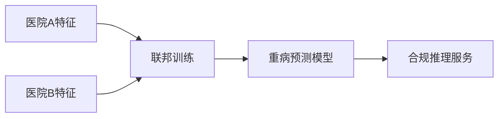

# P39 案例：新冠重病预测

← [[BV1ser5BDESU-总览]] | ← [[P38-数场技术及架构]] | 下一篇 → [[P40-综合案例与实战-金融风控联合建模]]

## 视频信息

| 项目 | 内容 |
|------|------|
| 分集 | 案例：新冠重病预测 |
| 模块 | 行业实践案例 |
| 时长 | 24 分 47 秒 |
| 链接 | [B 站 P39](https://www.bilibili.com/video/BV1ser5BDESU?p=39) |
| 官方文档 | [SecretFlow 文档](https://www.secretflow.org.cn/zh-CN/docs) |
| 内容来源 | 知识点增强（数据要素流通技术体系，非逐字转写） |

## 核心要点

1. **本 P 主题**：案例：新冠重病预测
2. **模块定位**：行业实践案例
3. **考试/实践侧重**：医疗联邦学习案例、特征工程、模型评估
4. **笔记层级**：教程级（约 2973 字），含速览、图解、场景 Walkthrough、自测题
5. **学习建议**：先通读「3 分钟速览」与「图解」，再读「详细讲解」；动手项见 Checklist

> 以下内容基于数据要素流通与隐私计算技术体系撰写，对应 B 站分 P「案例：新冠重病预测」。**非 UP 逐字转写**；不看视频也可建立框架，看视频可对照「与视频对照表」深化。

## 本节在系列中的位置

**模块**：行业实践案例 · 系列第 **P39/47** 集。

**建议前置**：[[数场技术及架构]]——建立本集所需背景。

**建议后续**：[[综合案例与实战：金融风控联合建模]]——在本集能力之上继续深入。

依赖关系：政策(P01–P06) → 可信空间(P07–P08,P18) → 密态/隐私技术(P09–P24) → SecretFlow 工程(P25–P32) → 基础设施与案例(P33–P47)。

## 3 分钟速览

**案例：新冠重病预测** 是数据要素流通体系中的关键一课。读完本节你应能回答：① 核心概念定义；② 在「供得出—流得动—用得好—保安全」链条中的位置；③ 与隐私计算技术栈的衔接。考试/面试侧重：**医疗联邦学习案例、特征工程、模型评估**。

## 零基础导读

本节「案例：新冠重病预测」属于 **行业实践案例**。即便未看视频，也应先建立**制度—技术—场景**三层视角：政策类章节回答「为什么允许流」；技术类章节回答「如何安全地算」；案例类章节回答「真实行业怎么落地」。

第一遍阅读请盯住三个问题：本集**解决什么痛点**？**关键参与方**是谁？**交付物或能力边界**是什么？第二遍阅读时，把术语表抄到 Obsidian 双链笔记，与前后分 P 交叉引用。

## 详细讲解

### 1. 案例背景

新冠疫情期，多家医院持有患者临床数据，单院样本不足以训练可靠的**重病预测模型**。需在**不汇聚原始病历**前提下联合建模，满足医疗合规与伦理要求。

### 2. 业务目标

- 输入：检验指标、影像特征、病史等
- 输出：新冠患者重症/死亡风险评分
- 指标：AUC、召回率（偏重减少漏诊）

### 3. 技术架构

| 步骤 | 技术 |
|------|------|
| 样本对齐 | 患者 ID 哈希 PSI |
| 特征对齐 | 纵向联邦（各院不同特征列） |
| 模型训练 | 纵向联邦 XGBoost/逻辑回归 |
| 安全聚合 | SPU 或安全梯度聚合 |
| 部署 | 各院本地推理 |

### 4. 合规要点

- 伦理委员会审批、知情同意
- 个人信息去标识化
- 模型输出不反推个体（差分隐私可选）
- 审计日志留存

### 5. 价值与启示

验证了**医疗联邦**在公卫应急中的可行性；后续可扩展到多癌种联合科研。关键是标准化特征字典与跨院 ID 映射。

### 6. 考试/实践要点

- 说明为何医疗场景选纵向联邦
- 列出案例技术栈与 SecretFlow 组件映射
- 分析 PSI 失败时样本对齐的备选方案

### 7. 模型公平性

检查重症预测模型对弱势群体的假阴性率，避免伦理偏差。

### 8. 复现

记录联邦随机种子、协议版本，满足科研可复现要求。

### 9. 数据最小化

联邦训练仅传输模型更新，不传原始检验值；特征选择阶段剔除高稀疏高敏感字段降低攻击面。

### 10. 学习与实践检查单

- [ ] 对照本 P 标题回顾 B 站视频章节要点
- [ ] 在 [SecretFlow 文档](https://www.secretflow.org.cn/zh-CN/docs) 找到对应模块
- [ ] 能用一句话向同事解释本 P 核心概念
- [ ] 识别一个本行业可落地的应用场景
- [ ] 记录与前后分 P 的技术依赖关系

### 11. 模块知识串联
本讲属于「数据要素流通技术」体系中的重要一环。建议在学习日志中标注：输入依赖（前序知识）、输出能力（学完能做什么）、与隐语组件映射（SecretFlow/Kuscia/SecretPad/TEE）。完成 47 讲后应能独立设计一个「政策合规+连接器+隐私计算+审计存证」的端到端方案，并评估 MPC、TEE、联邦学习的选型依据。

### 案例精读建议

阅读行业案例时采用 **STAR**：Situation（监管与痛点）、Task（业务目标）、Action（技术选型与过程）、Result（指标与合规结论）。将本集案例与您单位场景对比，列出 3 条可借鉴与 3 条不可照搬的理由。

## 图解

## 类比与直觉

行业案例像**菜谱**：同样的隐私计算「厨具」，医疗、金融、车险各做一道菜，重点看食材（数据）与火候（合规）如何配合。

## 例题与场景 Walkthrough

**行业复盘：案例：新冠重病预测**

**场景：两家机构联合建模（不共享明文）**

1. **样本对齐**：若双方仅有交集用户有价值，先用 PSI（P21/P28）对齐 ID。
2. **特征拼接**：纵向联邦（P24）下 A 方持标签、B 方持特征，梯度通过安全聚合更新。
3. **训练执行**：在 SecretFlow SPU（P27）上完成密态前向/反向，或 TEE 内明文训练（P11–P17）。
4. **模型发布**：输出评分服务；模型参数经评估后按需出域，训练数据永不出域。
5. **本集关联**：案例：新冠重病预测 提供其中 **医疗联邦学习案例** 能力。

额外关注：行业监管口径（金融银保监会、医疗卫健委）、数据最小必要、个人信息影响评估、模型可解释性与备案要求。

## 常见误区

1. **「学完本集就会用隐语」**：SecretFlow 生态需多集串联（P19–P32），单集只是拼图一块。
2. **「隐私计算等于不上传数据」**：数据仍以密文、份额或授权方式参与计算，网络与算力开销客观存在。
3. **「TEE 绝对安全」**：TEE 依赖硬件与侧信道防护，需远程证明（P17）与补丁策略。
4. **「区块链解决一切确权」**：链适合存证与交易撮合，大规模计算仍在链下隐私计算引擎。

## 与视频对照表

| 视频段落（约） | 预期演示内容 | 笔记对应章节 |
|-------------|------------|------------|
| 开篇 0%–15% | 本集目标、背景、与前后集关系 | 本节位置、3 分钟速览 |
| 前段 15%–40% | 核心概念定义与架构图 | 零基础导读、详细讲解 |
| 中段 40%–70% | 原理展开、对比、政策/代码示例 | 图解、类比、Walkthrough |
| 后段 70%–90% | 案例、问答、易错点 | 常见误区、Checklist |
| 收尾 90%–100% | 总结、延伸资源 | 延伸阅读、自测题 |

> 本集总时长约 **24分47秒**。无官方外挂字幕时，以分 P 标题「案例：新冠重病预测」与上表主题对齐视频画面。

## 动手实践 Checklist

- [ ] 复述本集 3 个定义（不看笔记）
- [ ] 根据 Walkthrough 写 200 字场景短文
- [ ] 对照视频确认 1 个架构图/演示
- [ ] 在总览思维导图中标注本集节点
- [ ] 完成自测 Q1/Q5

## 延伸阅读

- [SecretFlow 文档中心](https://www.secretflow.org.cn/zh-CN/docs)
- TC609 可信数据空间相关标准
- 本系列相邻 2 个分 P 笔记

## 自测题

1. **本集核心考点？**  
   **答**：医疗联邦学习案例、特征工程、模型评估。

2. **本集在四原则中的位置？**  
   **答**：用得好+行业落地。

3. **与 SecretFlow 的关系？**  
   **答**：为 SecretFlow 提供密码学/算法基础。

4. **一项落地检查？**  
   **答**：是否有授权、是否最小必要、是否可审计——三者缺一不可。

5. **30 秒口述本集？**  
   **答**：用「输入→处理→输出」各一句话概括（见 Walkthrough）。

## 关键术语

| 术语 | 说明 |
|------|------|
| 数据要素 | 可参与社会化配置、创造价值的数字化资源 |
| 隐私计算 | 数据可用不可见前提下实现协作计算的技术体系 |
| 联合建模 | 多方数据协作训练 |
| 对齐 | 样本或特征 ID 匹配 |

## 与前后分 P 的衔接

- ← **数场技术及架构**（[[P38-数场技术及架构]]）
- → **综合案例与实战：金融风控联合建模**（[[P40-综合案例与实战-金融风控联合建模]]）

## 逐字转写
> 引擎: whisper | 状态: 已转写 | 格式: 段落化

### [00:00 - 00:50] 大家好,我是清華大學研究生劉百
大家好,我是清華大學研究生劉百慶，很榮幸能夠為大家帶來本次基於Secret Note，再慶平台的影子計算案例模範，也是講解視頻，案例名字為新冠中民預測，本視頻分為四個部分，首先會為大家簡要介紹一下Secret Note，隨後會對新冠中民預測案例多詳細講解，分為案例介紹和案例演示兩部分，最後是總結，第一節Secret Note簡介，Secret Note是一個專為英語學藝者，和以此計算開發者設計的高級工具套件，其目的主要是為了幫助學習者和開發者，能夠快速地進行英語實驗，主要是以RootBoog的形式呈現。

### [00:50 - 01:38] 其由內閣式也是與RootBoo
其由內閣式也是與RootBoog所相容的，這樣子可以使學習者和開發者，更快地上手這個實驗，Secret Note就有一下其功能特性，多節點代碼執行，英語的使用場景，或者說以此計算的時候，場景一般都是設計多節點，意思就是說在不同的節點上面，可需要執行相同或者不同的代碼，Secret Note能夠同意地管理這些節點，並且在同一個頁面上面，完成多方代碼的編寫，可以選擇在哪些節點上面進行執行，文件管理與交互式體驗，Secret Note提供文件管理功能，可以方便在不同節點上面上傳，或者下載文件，並且提供了與RootBoog類似的交互式體驗。

### [01:38 - 02:18] 可以方便開發者進行以實計算算法
可以方便開發者進行以實計算算法的研發，運行狀態跟蹤，Secret Note能夠跟蹤代碼的運行狀態，並且能夠實施監控節點的資源使用情況，比如CPU或者類似的，然後可以幫助開發者更好的監控和調適，Secret Note其實有兩種，一種是與Secret Floor一起使用，叫做Secret Floor to SF，一種是與Secco一起使用，叫做Secret Floor to SQL，Secret Floor to SF，如左側左邊所示，是在YouTube過程中編寫Password Lime，然後調用Secret Floor的庫。

### [02:18 - 02:58] 來實現相應的隱私計算任務
來實現相應的隱私計算任務，Secret Floor to SQL，如右側左邊所示，是在LootBook中編寫Late SoCal語句，進行Secco相關的實驗，需要注意的是Secret Note，不是為生產環境設計的，因此不建議在生產環境中直接使用，目前以與實訊平臺，提供了Secret Floor to SF的雲端版本，可以直接在線使用，不過目前沒有提供對Secret Floor to SQL的支持，需要自行在本地部署，具體如何部署可以查看Secret Floor的 GitHub倉庫。

### [02:58 - 04:24] 接下來我們基於雲端Secret
接下來我們基於雲端Secret Floor，來掩飾Secret Floor的基本使用，打開Secret Floor在線使用環境，在左側有兩個下辣框選項，LootBooks和文件，點擊這個上傳按鈕，可以上傳本地的LootBook文件，點擊這個加號，可以新建一個空白的LootBook文件，點擊新建會自動打開，我們將它重名為Test，同時我們可以在這裡將其導出到本地或者刪除，在介面的右上角可以顯示節點列表，點擊，添加節點，出入節點名稱Alice，或者其它名字都可以，添加過程大約需要30秒，愛情等待即可，好 節點添加成功。

### [04:24 - 05:46] 點擊節點我們可以查看節點的相關
點擊節點我們可以查看節點的相關信息，比如名稱 狀態 IP 資源和版本等，線上環境節點的使用是會計時的，在左上角我們可以看到節點的使用時長和可用時長，所以當節點使用完之後，我們需要點擊刪除或者停止來結束計時，我們再新建一個節點Bob，兩個節點的使用時長是會累加的，所以不用使兩個節點都需要停止或者刪除，在線環境中最多只能添加兩個節點，節點添加成功之後，我們可以發現在左側的文件下多了兩個節點的名字，我們可以點擊上傳本地的文件到相應的節點中，需要注意的是上傳的文件，只至是以CSV或者TXT為後追名的文件。

### [05:46 - 06:51] 並且上傳文件的大小最大為32兆
並且上傳文件的大小最大為32兆，在左下角節點監控，我們可以實時的查看各個節點的資源使用情況，主體部分和 Jupyter LootBook是一樣的，也有Markdown, Heisen 的單元格，然後點擊右上角，我們可以看到這裡有快捷鍵，Match Mini，然後點擊這個我們可以查看常用代碼段，比如獲取本方節點，單級訪真、多級訪真等，我們將獲取本方節點名的代碼添加到 LootBook 中，先將空白的單元格刪除，添加輸出，可以發現與 Jupyter LootBook所不同的是，在單元格的右上角，我們可以選擇需要執行該代碼的節點列表。

### [06:51 - 07:58] 我們這裡選擇AliceBoom
我們這裡選擇 AliceBoom，都要執行，點擊執行，然後我們就可以在下面看到，所有所選節點的輸出，使用完畢之後，我們需要將節點刪除或者停止，我們這裡後續不需要用到這個節點，所以我們將其刪除，雲端 Secret Loot 使用也是到此結束，第二節 案例介紹，本視頻要介紹的案例是新冠中壁預測，是從英語時訊平臺案例模板中選取的，是一個橫向聯盟學習的案例，案例的 LootBook 可以在這個點擊中查看，我們先來介紹一下案例的背景，2019年末 新冠肺炎疫情爆發，最後新冠全球病持續了有三年，對人類社會造成的聲音影響。

### [07:58 - 08:58] 相信觀看本視頻的各位都是過來人
相信觀看本視頻的各位都是過來人，我們也可以發現，其實大多數反染新冠病毒的人的中壤表清，無需特殊治療者的倉庫，但是老獵人以及患有心血管疾病，糖尿病，慢性呼吸道疾病和癌症等潛在疾病的人，更容易患上重病 危機生命，基於遺傷背景 醫療機構ADS，與醫療機構B BOLD，希望通過聯合數據分析建立一個醫療診斷模型，可以根據新冠患者的當前症狀狀況和病史，來提高預測患者是否處於高風險的準確性，以便於有效的分配醫療資源，來挽救更多的生命，介紹完案例的背景，我們接下來介紹案例的數據級，COVID-19的原始數據級來自於卡古網站，有100多萬條數據。

### [08:58 - 09:40] 數據級包含了21種特徵
數據級包含了21種特徵，有生存狀態，若死亡則住民死亡日期，否則住民999999999，還有接受治療的醫療單位級別，提供醫療服務的國家衛生體系肌肉類型，性別護理類型，COVID-19檢測結果，以及是否連接呼吸機，肺炮社發炎等其他部爾特徵，該案理採用橫向聯邦學習技術，需要在确保数据不出御的前提下进行跨机构的联合建模，提高医疗诊断的预测效果，推动医疗数据的安全利用与共享。

### [09:42 - 10:13] 原始数据机是一个大数据机
原始数据机是一个大数据机，为了进行实验我们需要对原始数据机进行处理，从而构造适合本实验的数据机，首先我们需要明确，将生存状态作为标签特征，但是生存状态的取职范围过于庞大，考虑将其取职进行数据化，由于我们只关心病人是否存活，不可以将其二字化，将死亡日期自断用Y来表示。

### [10:15 - 11:02] 同时取职转化为零和一
同时取职转化为零和一，一表示病人死亡，由于数据机过于庞大有57兆，大语文件上传到节点的上线，因此我们需要将，原始数据机中选取一小部分数据来进行实验，原始数据机中的，classification final 字段，表示，home v 19 检测结果，数值从1到3表示患者被整合出不同程度的新冠，我们利用此策则拿来抽取，数据机样的，在之后的数据中删掉的盖特征，原始数据机中有100多万条样本，我们最后只选取了其中一万多条，并水平切分成了两个参与方的，数据。

### [11:05 - 11:59] 水平分割一般用于构造很像联邦学
水平分割一般用于构造很像联邦学习的数据，垂直分割一般用于构造更像联邦学习的数据，如该是一部所示，我们将原数据机扣毕自data.csv，水平分割成了，agency alice.csv，和agency boh.csv，agency alice.csv，用于模拟医疗机构，a alice的数据，agency boh.csv，用于模拟来自医疗机构b boh，数据，这两个机构的数据机，拥有完全相同的特征之段，在底下这个自愿表格中，我们可以看出相比原数据机的变化，原来的，data，data.x，变成了，classification.filo，自愿被删除。

### [11:59 - 13:02] 第三结
第三结，案例掩饰，接下来，给大家进行个，案例实验的掩饰，从实验的配置，到夹载，并化分数据机，到介义和训练水平模型，从而实现，安理斯和Bow Esp，加医疗机构，数据的联合分析，以及安全接磨，我们先打开 poverty law，我们先将不用的loadbook删除，我们从本地上从磁安尼的loadbook，我对官网提供的安尼loadbook进行了些微的修改，但是基本于官网上的一致，我们打开3D的loadbook，我们先清空所有的速出，然后我们添加节点，本安尼只要用到一个节点，我们将time will be COVID，节点添加需要一天时间。

### [13:02 - 14:57] 好,节点添加成功
好,节点添加成功，然后接下来我们将要用到的双方的数据集，上传到节点中，agency alix，agency boat，好,节点上,数据上传成功，然后我们开始实验，然后实验简介，在前面我们已经介绍过了，就不细说了，然后在简介的最后，我们需要先查看一下，呃,当前passing版本和secret flow的版本，因为本实验所用到的某些类，在其他版本中是不一定能够支持的，好,可以看到secret flow的版本是1.1厘，这是能够支持本词,本词先了，呃,实验配置，然后因为在线环境最多只能添加两个节点，但是本实验是需要三个节点。

### [14:57 - 15:54] 所以我们只能在一个节点中
所以我们只能在一个节点中，用访证模式来模拟三个节点，我们需要模拟一下医疗机构A alix，医疗机构B boat,还有server节点，一共三个节点，呃,server节点是用来，安全地整合医疗机构A和医疗机构B的数据，然后我们执行partys，就是呃,这三个要访证的节点的名字，然后地址就写local表示等地访证，spu配置，呃,医疗机构A,医疗机构B,还有server节点，需要重新的端口启动参与数,参与计算，需要执行下方的unused tsp port，方法来获取未使用的端口，然后需要注意的是,每次调用这个方法都会返回不同论址。

### [15:54 - 17:03] 然后我们调用三次
然后我们调用三次，然后分别分配给Ages,bob和server，然后这里有个round time ip，表示是运行时的ip，我们查看节点的ip，复制过来，好,粘贴，然后因为呃,所有代码都是在同一个节点中运行的，所以我们将它复制为127.0.0.1也是可以的，让我们执行，然后我们输出呃,分配的这些端口，下面这两个,这两行代码的话是，可以获取当权机群的资源配置，然后我可以看到它输出中有，bob,server,还有Alice，那就表示这三个节点，它确实在当权机群中，创建并配置secret flaw的spu实地，我们要为所有节点都要配置。

### [17:03 - 18:07] d127.0,a127.0,b
d127.0,a127.0,b127.0还有127.0，然后在load 下面的，每一个，字点就表示一个节点，然后字点中的party就是节点名，地址就是，节点的ip和端口，然后ip就是，round type，就是在下面配置的，然后这些端口就是，分别为三个节点，所分配的各自的端口，round tank and fig，round tank and fig是一些，相关的运行室配置参数，比如说使用的多方安全计算协议，和使用的有限预等，我们，之前之后可以得到一个spu实地，然后之前震撼大满，我们可以获得医疗机构a,医疗机构b。

### [18:07 - 19:13] 和server的pyu对象
和server的pyu对象，然后之前之后，spobserver就分明表示，对应节点的pyu对象，加载命化分数级，加载数据级，我们需要加载的是水平数据，然后多出来的server节点，是需要作为数据的聚合节点，来保证数据的安全，我们先加载聚合器和比较器的类，然后我们再实地画一个spu的比较器对象，我们再实地画一个聚合器，然后聚合器这样出示的话，就表示server节点，来聚合Alice和Bob的数据，之后就是读取水平数据级，我们首先要配置一个，每方数据级所分组的路径，然后因为上传的文件临时在，当权录定下。

### [19:13 - 20:27] 所以我们可以直接将对应的数据文
所以我们可以直接将对应的数据文件名作为持，执行水平的readcsv，然后我传入文件路径，然后聚合器和比较器，我们可以得到，又得到一个水平的take-off rate hdf，我们分别运行，hdf.chip和hdf.clones，我们可以得到，得到数据的大小，大小是，然后本时间控加载，一万零四百五十二条样本，然后每个样本有二十个特征，所以数据的大小是真的大小，我们可以获得，这个数据的列名，拥有二十个列名，数据化分，模型的训练是需要，将数据化分为训练级和测试级的，我们设定的训练级和测试级的，样本比例是8比2，测试型代码就可以将计画分。

### [20:27 - 21:41] 水平差级固字的建模
水平差级固字的建模，本时间的水平建模方法选择是，差级固字的算法，而差级固字的，是一种高效的T度提升数算法，中国加反模型和正则化方式过离合，后支持变形与缺失值处理，广泛用于数结构化数据的分类回归任务，首先是设置差级固字的超参数，超参数的设置可以在，这个链接中进行详细的查感，我们设置MaxDip对三，每个数最大是三成，再大就容易过离合，一天是缺席率，也设为0.1，objective就是指定任务类，类型为二分类的逻辑回归，在注射后面也提供了很多其他的客源值，然后metric是log lose，对数损失，训练时用的评估指标，level key是y。

### [21:41 - 22:45] 我们在购到数据级的时候也有提到
我们在购到数据级的时候也有提到，作为样本的标签，然后实际化sf charge boost，sf charge boost是secret flow，对charge boost的封装实现，要注意到是，只有在secret flow，小于等于1.10的时候，是可以使用的，大于1.10的话，它不只是sf charge boost，我们自行一下，sf charge boost的处置化，设置server是server，client就是annis和bub，这两个数据级点，好,根据训练级，你可归在测试集中进行验证，然后我们运行正和大码，就可以训练这个。

### [22:45 - 24:13] chargeboost的模型
charge boost的模型，好,我们设置的，boost的伦出式试论，好,训练完成，我们先将，训练的模型保存下来，然后我们在，分别运行对Test级的测试，和对训练级的测试，我们可以查看它最后的评估指标，就是对数损失，它的指相应的都是比较接近的，然后而且都是比较小的，好，安妮也是实验到此结束，第四节，总结，本安妮描述了医疗机构annis，与医疗机构bub合作的实际场景，通过联合数据分析，构建一个用于浴车covid-19，患者重病风险的医疗整段模型，模型根据患者的症状，病史和健康状况，判断其是否处于高风险状态，从而优化医疗资源分配。

### [24:13 - 24:44] 安妮采用隐私保护技术很像联盟学
安妮采用隐私保护技术很像联盟学习，确保数据在不出御的情况下，进行跨机构联合建模，提高浴车准结性，并促进医疗数据的安全共享，在最后提供了，本视频所涉及的，网站 仓库 文档等资源的链接，注意仓库和文档查看白本需要对应，好的 那么本视频到此结束，谢谢大家的观看。

## 来源说明

- ✅ B 站官方元数据（`Tools/BV1ser5BDESU-full.json`）
- ✅ 分 P 首帧封面（`Tools/bili-fetch/fetch-bilibili.js`）
- ✅ **教程级增强**：含图解/Mermaid、场景 Walkthrough、自测题（约 2973 字，2026-06-06）
- ⏳ 逐字转写：B 站 API 无外挂字幕轨；可选 Whisper/BiliNote 后续补充

## 关键截图

![[../../06-资源附件/video-notes-images/BV1ser5BDESU-P39-cover.jpg|B站首帧 P39]]
