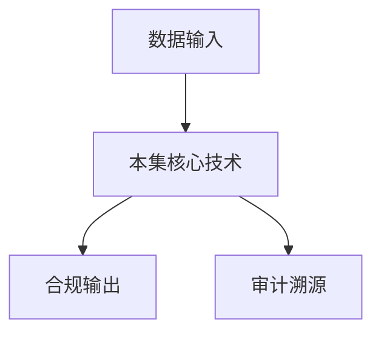

# P40 综合案例与实战：金融风控联合建模

← [[BV1ser5BDESU-总览]] | ← [[P39-案例-新冠重病预测]] | 下一篇 → [[P41-综合案例与实践-跨企业数据查询]]

## 视频信息

| 项目 | 内容 |
|------|------|
| 分集 | 综合案例与实战：金融风控联合建模 |
| 模块 | 行业实践案例 |
| 时长 | 20 分 38 秒 |
| 链接 | [B 站 P40](https://www.bilibili.com/video/BV1ser5BDESU?p=40) |
| 官方文档 | [SecretFlow 文档](https://www.secretflow.org.cn/zh-CN/docs) |
| 内容来源 | 知识点增强（数据要素流通技术体系，非逐字转写） |

## 核心要点

1. **本 P 主题**：综合案例与实战：金融风控联合建模
2. **模块定位**：行业实践案例
3. **考试/实践侧重**：金融风控联合建模、样本对齐、评分卡
4. **笔记层级**：教程级（约 3014 字），含速览、图解、场景 Walkthrough、自测题
5. **学习建议**：先通读「3 分钟速览」与「图解」，再读「详细讲解」；动手项见 Checklist

> 以下内容基于数据要素流通与隐私计算技术体系撰写，对应 B 站分 P「综合案例与实战：金融风控联合建模」。**非 UP 逐字转写**；不看视频也可建立框架，看视频可对照「与视频对照表」深化。

## 本节在系列中的位置

**模块**：行业实践案例 · 系列第 **P40/47** 集。

**建议前置**：[[案例：新冠重病预测]]——建立本集所需背景。

**建议后续**：[[综合案例与实践：跨企业数据查询]]——在本集能力之上继续深入。

依赖关系：政策(P01–P06) → 可信空间(P07–P08,P18) → 密态/隐私技术(P09–P24) → SecretFlow 工程(P25–P32) → 基础设施与案例(P33–P47)。

## 3 分钟速览

**综合案例与实战：金融风控联合建模** 是数据要素流通体系中的关键一课。读完本节你应能回答：① 核心概念定义；② 在「供得出—流得动—用得好—保安全」链条中的位置；③ 与隐私计算技术栈的衔接。考试/面试侧重：**金融风控联合建模、样本对齐、评分卡**。

## 零基础导读

本节「综合案例与实战：金融风控联合建模」属于 **行业实践案例**。即便未看视频，也应先建立**制度—技术—场景**三层视角：政策类章节回答「为什么允许流」；技术类章节回答「如何安全地算」；案例类章节回答「真实行业怎么落地」。

第一遍阅读请盯住三个问题：本集**解决什么痛点**？**关键参与方**是谁？**交付物或能力边界**是什么？第二遍阅读时，把术语表抄到 Obsidian 双链笔记，与前后分 P 交叉引用。

## 详细讲解

### 1. 案例背景

金融机构需联合电商、运营商等多方数据提升**风控模型**区分度，但监管禁止明文客户数据出域。本案例演示金融风控**联合建模**端到端实战。

### 2. 场景定义

- 参与方：银行 A（标签：违约）、电商 B（消费行为）、运营商 C（通信特征）
- 目标：训练信用评分模型，降低坏账率
- 约束：各方特征不互见，仅银行持有标签

### 3. 实施流程

1. **业务对齐**：定义违约标签窗口、特征时间窗
2. **PSI**：三方用户 ID 求交
3. **纵向联邦**：B、C 特征加密传输至协议层，A 侧聚合训练
4. **模型评估**：验证集 AUC、KS、PSI 稳定性
5. **上线**：联邦推理或导出加密模型分

### 4. 架构组件

SecretPad 编排 → Kuscia 跨域调度 → SecretFlow 纵向联邦组件 → 结果回写银行

### 5. 风险与治理

- 特征泄露：安全协议 + 最小特征集
- 样本偏差：交集样本是否代表总体
- 模型可解释：监管要求 SHAP 等需额外协议

### 6. 考试/实践要点

- 画三方纵向联邦数据流
- 说明标签方为何通常是银行
- 列举上线前三项模型风控检查

### 7. 监控

上线后 PSI 监控模型漂移、特征 PSI、违约率回溯；触发重训联邦任务。

### 8. 监管报送

向央行报送模型方法与数据来源摘要，不提交原始联合特征。

### 9. 冷启动

新接入银行无历史交集样本时，先用公开数据预训练，再用联邦微调，缓解冷启动偏差。

### 10. 学习与实践检查单

- [ ] 对照本 P 标题回顾 B 站视频章节要点
- [ ] 在 [SecretFlow 文档](https://www.secretflow.org.cn/zh-CN/docs) 找到对应模块
- [ ] 能用一句话向同事解释本 P 核心概念
- [ ] 识别一个本行业可落地的应用场景
- [ ] 记录与前后分 P 的技术依赖关系

### 11. 模块知识串联
本讲属于「数据要素流通技术」体系中的重要一环。建议在学习日志中标注：输入依赖（前序知识）、输出能力（学完能做什么）、与隐语组件映射（SecretFlow/Kuscia/SecretPad/TEE）。完成 47 讲后应能独立设计一个「政策合规+连接器+隐私计算+审计存证」的端到端方案，并评估 MPC、TEE、联邦学习的选型依据。

### 案例精读建议

阅读行业案例时采用 **STAR**：Situation（监管与痛点）、Task（业务目标）、Action（技术选型与过程）、Result（指标与合规结论）。将本集案例与您单位场景对比，列出 3 条可借鉴与 3 条不可照搬的理由。

## 图解

## 类比与直觉

行业案例像**菜谱**：同样的隐私计算「厨具」，医疗、金融、车险各做一道菜，重点看食材（数据）与火候（合规）如何配合。

## 例题与场景 Walkthrough

**行业复盘：综合案例与实战：金融风控联合建模**

**场景：两家机构联合建模（不共享明文）**

1. **样本对齐**：若双方仅有交集用户有价值，先用 PSI（P21/P28）对齐 ID。
2. **特征拼接**：纵向联邦（P24）下 A 方持标签、B 方持特征，梯度通过安全聚合更新。
3. **训练执行**：在 SecretFlow SPU（P27）上完成密态前向/反向，或 TEE 内明文训练（P11–P17）。
4. **模型发布**：输出评分服务；模型参数经评估后按需出域，训练数据永不出域。
5. **本集关联**：综合案例与实战：金融风控联合建模 提供其中 **金融风控联合建模** 能力。

额外关注：行业监管口径（金融银保监会、医疗卫健委）、数据最小必要、个人信息影响评估、模型可解释性与备案要求。

## 常见误区

1. **「学完本集就会用隐语」**：SecretFlow 生态需多集串联（P19–P32），单集只是拼图一块。
2. **「隐私计算等于不上传数据」**：数据仍以密文、份额或授权方式参与计算，网络与算力开销客观存在。
3. **「TEE 绝对安全」**：TEE 依赖硬件与侧信道防护，需远程证明（P17）与补丁策略。
4. **「区块链解决一切确权」**：链适合存证与交易撮合，大规模计算仍在链下隐私计算引擎。

## 与视频对照表

| 视频段落（约） | 预期演示内容 | 笔记对应章节 |
|-------------|------------|------------|
| 开篇 0%–15% | 本集目标、背景、与前后集关系 | 本节位置、3 分钟速览 |
| 前段 15%–40% | 核心概念定义与架构图 | 零基础导读、详细讲解 |
| 中段 40%–70% | 原理展开、对比、政策/代码示例 | 图解、类比、Walkthrough |
| 后段 70%–90% | 案例、问答、易错点 | 常见误区、Checklist |
| 收尾 90%–100% | 总结、延伸资源 | 延伸阅读、自测题 |

> 本集总时长约 **20分38秒**。无官方外挂字幕时，以分 P 标题「综合案例与实战：金融风控联合建模」与上表主题对齐视频画面。

## 动手实践 Checklist

- [ ] 复述本集 3 个定义（不看笔记）
- [ ] 根据 Walkthrough 写 200 字场景短文
- [ ] 对照视频确认 1 个架构图/演示
- [ ] 在总览思维导图中标注本集节点
- [ ] 完成自测 Q1/Q5

## 延伸阅读

- [SecretFlow 文档中心](https://www.secretflow.org.cn/zh-CN/docs)
- TC609 可信数据空间相关标准
- 本系列相邻 2 个分 P 笔记

## 自测题

1. **本集核心考点？**  
   **答**：金融风控联合建模、样本对齐、评分卡。

2. **本集在四原则中的位置？**  
   **答**：用得好+行业落地。

3. **与 SecretFlow 的关系？**  
   **答**：为 SecretFlow 提供密码学/算法基础。

4. **一项落地检查？**  
   **答**：是否有授权、是否最小必要、是否可审计——三者缺一不可。

5. **30 秒口述本集？**  
   **答**：用「输入→处理→输出」各一句话概括（见 Walkthrough）。

## 关键术语

| 术语 | 说明 |
|------|------|
| 数据要素 | 可参与社会化配置、创造价值的数字化资源 |
| 隐私计算 | 数据可用不可见前提下实现协作计算的技术体系 |
| 联合建模 | 多方数据协作训练 |
| 对齐 | 样本或特征 ID 匹配 |

## 与前后分 P 的衔接

- ← **案例：新冠重病预测**（[[P39-案例-新冠重病预测]]）
- → **综合案例与实践：跨企业数据查询**（[[P41-综合案例与实践-跨企业数据查询]]）

## 逐字转写
> 引擎: whisper | 状态: 已转写 | 格式: 段落化

### [00:00 - 00:56] 大家好,很榮幸能夠為大家帶來本
大家好,很榮幸能夠為大家帶來本次綜合案例與實戰金融封控聯合建模的實驗掩飾視頻，本視頻主要以金融封控聯合建模為例,介紹如何使用Secret Note在線平台完成實驗，本視頻主要分為以下四個部分,首先介紹案例背景，本實驗案例的背景是,隨著農村經濟的蓬勃發展,金融服務的補給在推動其全面發展中扮演著至關重要的角色，小額信貸服務為農村商業和個人帶來了新的機遇,但農村用戶信用記錄薄弱，傳統封控手段在風險識別和預測方面存在明顯短半，風險控制和信用評估難度增大,制約了金融服務的廣泛應用和創新發展。

### [00:57 - 01:07] 本案例的目標是,如何在確保隱私
本案例的目標是,如何在確保隱私保護的條件下對信貸風險進行準確預測,進而促進農村普惠金融發展。

### [01:10 - 02:14] 接下來介紹第二部分,數據級概數
接下來介紹第二部分,數據級概數與資段分析，銀行提供的數據級文件Back.csv中包含ID信貸特徵和弱風險特徵，例如貸款金額貸款期限信用等級借款人職業和借款人一年的收入以及是否發生違約情況等，以共22個字段,數據中包含數值型特徵和類別型特徵，例如貸款金額為數值類型而信用等級為類別類型，為了方便後續建模的邏輯回歸模型能夠正常訓練，而邏輯回歸本質上只能接受數值型輸入,因此我們需要對數據進行處理，例如類別類型需要通過1號的編碼成為數值類型，過大或分佈極端的數值類型需要進行標準化，也就是規劃到相近範圍,保證模型的收斂效率。

### [02:15 - 02:32] 在表格中,我們標註了本實驗中需
在表格中,我們標註了本實驗中需要進行標準化和1號編碼的數據，總體來說,本數據及包含有限數量的結構化數據，信貸相關的信號牆,但是風險相關的信號角落。

### [02:36 - 03:19] 支付平台提供的數據級為Beha
支付平台提供的數據級為Behavior.csv文件，具有消費相關的特徵和豐富的用戶交互關係數據，與Back.csv可以通過ID字段進行關聯，這個字段代表貸款記錄的唯一標識符，另外,從N0到N14是15個匿名特徵，包含消費品次,支付習慣,社交互動等，這些數據由於分佈不一,需要與Back.csv的數據一起進行標準化，這個數據集中包含海量非解構化行為數據，風險表徵能力強,但是缺乏直接信貸的信息。

### [03:21 - 03:25] 接下來進入第三部分,數據處理與
接下來進入第三部分,數據處理與建模思路。

### [03:28 - 04:25] 本次實驗是通過音譽的多方安全計
本次實驗是通過音譽的多方安全計算技術，構建一個有效預測金融風險的模型，實現銀行和第三方支付平台之間的安全聯合建模，我們首先需要進行實驗配置，然後加載數據級,並以ID為建值對齊數據級，轉換為縱向聯邦學習格式，在特徵工程中,首先按照上述描述過程，先將分類字段編碼為數值,然後將過大的數據標準化，最後劃分數據級為特徵和目標標籤用於後續的訓練過程，整體的建模思路為,使用銅泰加密和邏輯回歸模型，進行安全聯合建模，在加密數據上訓練邏輯回歸模型,並進一步進行測試，接下來進入Secret Note中進行具體的實操。

### [04:26 - 05:27] 這裡我們看到的就是銀與實訊平台
這裡我們看到的就是銀與實訊平台的界面，首先我們將原本提供的Notebook，先刪除掉重新上傳一版，銀與Secret Flow實訊平台為我們提供了該案例的代碼，我們可以通過點擊首頁的案例，其中第一項就是金融風險預測,也就是本案例，在案例詳情頁面中,我們可以看到，提供了Notebook和數據級的下載面積以及Notebook的預覽，在此處,我們可以通過點擊兩項下載，按鈕,把對應的Notebook和數據級下載到本地再上傳到平台，也可以選擇在本頁面中直接複製代碼到對應的頁面，我們這裡選擇下載到本地再上傳。

### [05:29 - 06:07] 這裡上傳成功,點擊之後可以進入
這裡上傳成功,點擊之後可以進入這個頁面，然後我們重啟這個Notebook，並且把所有的輸出全部清空，這裡我們點擊節點列表的加號按鈕進行節點的添加，在本試驗中是包括agency和back兩個節點，添加每一個節點的過程大概是30秒，這裡agency已經添加完畢,接下來添加back。

### [06:10 - 07:15] 我們可以看到在左方已經出現了a
我們可以看到在左方已經出現了agency的文件管理系統和節點監控的一些信息，這裡全部創建完成，接下來我們向這兩個參與方節點中分別添加文件，agency具有的文件是behavior.csv，這裡已經上傳成功,然後在這裡我們可以，越南表格也可以重新把它下載下來。

### [07:18 - 07:22] 然後這裡back也上傳相應的b
然後這裡back也上傳相應的back.csv文件。

### [07:28 - 07:35] 好,這裡已經上傳成功,然後接下
好,這裡已經上傳成功,然後接下來我們進行實驗，首先需要加載相應的pattern cool分別是secret flow和spo。

### [07:38 - 07:43] 這裡雙方都需要執行,我們可以通
這裡雙方都需要執行,我們可以通過點擊運行也可以通過快捷鍵。

### [07:49 - 08:12] 好,執行完成
好,執行完成，接下來進行實驗配置，由於雙方需要從特定的節點執行不同的任務，因此我們需要先執行下輸的unused tcpport這個函數，查找未被佔用的端口號，並且需要記錄這裡的端口號，用於後續配置refad。

### [08:15 - 08:23] 這裡同樣選擇雙方節點執行
這裡同樣選擇雙方節點執行，好,我們這裡可以得到兩個未被佔用的端口號。

### [08:26 - 08:47] 然後在這裡配置refad的時候
然後在這裡配置refad的時候，我們需要將對應的ip和端口號，全部修改為我們配置好的實際的ip和端口號，比如說這裡agency它的ip是172.16.0.251，我們將它複製。

### [08:50 - 10:11] 然後拷貝到這裡
然後拷貝到這裡，對應的端口號也拷貝過了，這裡端口號也需要修改掉，然後back的ip是172.16.0.2，這裡不需要修改，我們再確認一下，沒問題，然後back的端口號需要進行修改，類似的，因為這裡我們通過self party指定了配置這個refad的實體，這裡是back，然後下方是agency，因此需要分別修改他們的ip和端口號，好,修改完成，另外需要注意的是secret note，每個參與方他們默認的瑞集群的地址都是127.0.0.1，這兩個部分的代碼是需要各自的節點單獨執行，但是這兩個代碼塊是需要同時執行的。

### [10:11 - 11:22] 因此我們這裡需要選擇執行節點
因此我們這裡需要選擇執行節點，是對應self party這個字段，這裡選擇是back，這裡選擇是agency，我們通過執行這個init韓數，構建雙方的一個跨機構通訊，這對我們通過快捷鍵執行，我們可以看到雙方已經執行完畢，在輸出中，可以發現雙方會互相進行ping操作，我們可以看到由於有一點點時間差，back是在第二次嘗試ping的時候拼通了agency，agency是在首次，pingback的時候就成功了，接下來進行spo配置，用於進行安全多方計算，因為銀行和第三方支付平臺需要從新的端口，啟動參與計算，所以我們這裡還是需要再執行一次。

### [11:22 - 11:45] iOS的TCBpart這個韓數
iOS的TCB part這個韓數，獲取目前沒有使用的端口號，當然是雙方都需要執行，執行完畢，接下來我們將下方的，在配置這個spo的時候，把裡面的ip和端口號，全部修改為實際的ip和端口號。

### [11:50 - 11:59] 這裡back
這裡back，端口號是39171，agency ip需要修改。

### [12:03 - 13:09] 端口號是34631
端口號是34631，然後run time config，是相關的一些配置參數，比如說使用的多方計算協議，和使用的有限域等，我們執行之後，可以得到一個spo的實例，好 執行完畢，接下來加載特定的數據集，這裡我們已經將雙方的數據，已經分別上傳到服務器，但是由於這裡是在線平臺，我們需要獲取當前的工作環境，加載特定的文件，執行getcwd寒數，獲取兩個文件的路徑，並且讀取它們，這裡我們分別執行這三個代碼塊，我們這裡輸出，可以看到它在服務器中的路徑，是在secret note底下的，一個工作環境當中，這裡可以將兩個文件，分別加在進來。

### [13:11 - 14:20] 我們剛剛了解的這兩個文件
我們剛剛了解的這兩個文件，接下來以公用的id作為建置，讀取這兩個文件，通過spo指定計算使用的spo，得到一個新的垂直數據框架，也是一個dataframe，這個dataframe是後續用於，多方安全計算的，這裡分別執行，好 執行完畢，接下來我們可以通過執行，shape和columns，這兩個寒數分別查看，得到的垂直數據框架的一些信息，shape會輸出，這個數據框架的行數和列數，columns會輸出列名，這裡我們可以看到，這些信息就是包含在，這兩個csv當中的信息，但是去除了id，因為在上方執行的時候，丟棄了id這一列。

### [14:21 - 15:20] 接下來我們對數據進行特徵工程
接下來我們對數據進行特徵工程，你在數據加密的時候，進行訓練，實現銀行和第三方支付平臺的，安全聯合建模，首先進行，這裡是將非數值類型的數據，轉換為數值類型，比如說類別這樣的信息，便於模型進行處理，我們這裡可以看到，包括term purpose這些信息，這裡也需要選擇雙方節點進行執行，在這個代碼塊當中，是將這些編碼後的數據，重新寫入到了這個數據框架中，並且把原有的這些信息，全部丟棄掉。

### [15:23 - 17:15] 我們執行這些代碼
我們執行這些代碼，好 執行完畢，接下來，我們進行數值的標準化，也就是消除這些代款，金額數據之間的差異，並且可以加快，模型訓練的收點速度，我們這裡也是分別選擇，雙方節點進行執行，我們執行這部分的代碼，好 執行完畢，這裡我們可以查看，經過編碼和標準化之後的列明，我們可以看到，執行完後的引口點之後，這些列數是進行了增加，也就是這些信息，他們根據數據類別進行了一個分割，然後接下來，我們將數據級分割為特種和標籤，用於後續的訓練，這裡標籤是EaseDefault這個字段，它代表的含義是，這條代款記錄是否違約，剛好符合我們，進行金融風險預測的需求。

### [17:15 - 19:06] 這裡也是選擇雙方節點進行執行
這裡也是選擇雙方節點進行執行，好 我們這裡進行了數據的分割，接下來我們進行，同態加密和加密邏輯回歸，模型訓練，我們首先進行配置，初始化參與運算的銀行，和第三方平台實體，然後使用提供的數據進行訓練，這裡也是選擇雙方節點，好 我們分別執行，好，那麼接下來，我們使用提供的數據進行訓練，一共需要進行四個迭代週期，那麼這個訓練過程，大概需要15分鐘能夠完成，好 我們可以看到，這裡已經執行完成的訓練，一共進行了四個輪次，接下來我們使用，model.predict這個函數，進行模型的預測，並且可以通過review，這個函數得到解密的值。

### [19:06 - 20:33] 那麼這個plane是實際的值
那麼這個plane是實際的值，然後predict是預測的值，然後通過計算，rcac分數可以得到模型的效果，這個數值越大的話，證明模型的效果越好，我們這裡先選擇執行節點，然後分別執行，我們可以看到，這裡模型的效果，多出來的結果，大概是0.62，說明模型的效果是可以的，最後一個部分，進行本實驗的總結，在本實驗中，銀行和第三方支付平台，通過營運的多方安全計算技術，在確保數據隱私的情況下，利用雙方數據，構建一個有效的金融風險模型，可以有效提高金融服務，在農村經濟中的應用和創新發展，同時也驗證了，銀與技術在敏感數據，協作中的使用價值，本次分享到此結束。

### [20:33 - 20:35] 希望大家批評指證
希望大家批評指證。

## 来源说明

- ✅ B 站官方元数据（`Tools/BV1ser5BDESU-full.json`）
- ✅ 分 P 首帧封面（`Tools/bili-fetch/fetch-bilibili.js`）
- ✅ **教程级增强**：含图解/Mermaid、场景 Walkthrough、自测题（约 3014 字，2026-06-06）
- ⏳ 逐字转写：B 站 API 无外挂字幕轨；可选 Whisper/BiliNote 后续补充

## 关键截图

![[../../06-资源附件/video-notes-images/BV1ser5BDESU-P40-cover.jpg|B站首帧 P40]]
