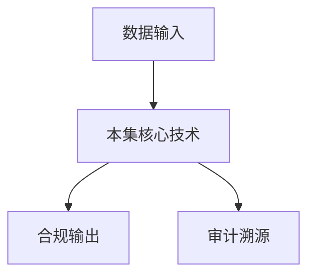

# P41 综合案例与实践：跨企业数据查询

← [[BV1ser5BDESU-总览]] | ← [[P40-综合案例与实战-金融风控联合建模]] | 下一篇 → [[P42-利用隐语在运营商间跨域结算精密对账场景的应用实践]]

## 视频信息

| 项目 | 内容 |
|------|------|
| 分集 | 综合案例与实践：跨企业数据查询 |
| 模块 | 行业实践案例 |
| 时长 | 16 分 58 秒 |
| 链接 | [B 站 P41](https://www.bilibili.com/video/BV1ser5BDESU?p=41) |
| 官方文档 | [SecretFlow 文档](https://www.secretflow.org.cn/zh-CN/docs) |
| 内容来源 | 知识点增强（数据要素流通技术体系，非逐字转写） |

## 核心要点

1. **本 P 主题**：综合案例与实践：跨企业数据查询
2. **模块定位**：行业实践案例
3. **考试/实践侧重**：跨企业 SCQL 查询、权限最小化
4. **笔记层级**：教程级（约 3067 字），含速览、图解、场景 Walkthrough、自测题
5. **学习建议**：先通读「3 分钟速览」与「图解」，再读「详细讲解」；动手项见 Checklist

> 以下内容基于数据要素流通与隐私计算技术体系撰写，对应 B 站分 P「综合案例与实践：跨企业数据查询」。**非 UP 逐字转写**；不看视频也可建立框架，看视频可对照「与视频对照表」深化。

## 本节在系列中的位置

**模块**：行业实践案例 · 系列第 **P41/47** 集。

**建议前置**：[[综合案例与实战：金融风控联合建模]]——建立本集所需背景。

**建议后续**：[[利用隐语在运营商间跨域结算精密对账场景的应用实践]]——在本集能力之上继续深入。

依赖关系：政策(P01–P06) → 可信空间(P07–P08,P18) → 密态/隐私技术(P09–P24) → SecretFlow 工程(P25–P32) → 基础设施与案例(P33–P47)。

## 3 分钟速览

**综合案例与实践：跨企业数据查询** 是数据要素流通体系中的关键一课。读完本节你应能回答：① 核心概念定义；② 在「供得出—流得动—用得好—保安全」链条中的位置；③ 与隐私计算技术栈的衔接。考试/面试侧重：**跨企业 SCQL 查询、权限最小化**。

## 零基础导读

本节「综合案例与实践：跨企业数据查询」属于 **行业实践案例**。即便未看视频，也应先建立**制度—技术—场景**三层视角：政策类章节回答「为什么允许流」；技术类章节回答「如何安全地算」；案例类章节回答「真实行业怎么落地」。

第一遍阅读请盯住三个问题：本集**解决什么痛点**？**关键参与方**是谁？**交付物或能力边界**是什么？第二遍阅读时，把术语表抄到 Obsidian 双链笔记，与前后分 P 交叉引用。

## 详细讲解

### 1. 案例背景

企业集团间常需**联合查询**客户、供应商、库存等数据，传统方式需数据拷贝或集中数仓，合规与时效性差。本案例用 **SCQL** 实现跨企业安全查询。

### 2. 场景示例

- A 企业：客户主数据
- B 企业：订单交易数据
- 需求：查询「A 客户且在 B 有高额订单」的共同客户统计，不暴露各自非交集客户

### 3. 技术方案

```sql
-- 概念 SCQL
SELECT A.region, COUNT(*)
FROM A.customer AS A
JOIN B.orders AS B ON A.id = B.customer_id
WHERE B.amount > 10000
GROUP BY A.region
HAVING COUNT(*) >= 50
```

引擎将 JOIN 编译为 PSI + 安全聚合，HAVING 防止小样本重识别。

### 4. 权限配置

- A 暴露列：id、region（不暴露姓名）
- B 暴露列：customer_id、amount
- 结果仅 A 接收

### 5. 运维

定期查询任务通过 KusciaAPI 提交；查询日志上链存证；异常查询熔断。

### 6. 考试/实践要点

- 说明 SCQL 相比数据拷贝的优势
- 解释 HAVING COUNT>=50 的隐私意义
- 设计两方权限矩阵表

### 7. 缓存策略

高频相同 SCQL 查询结果缓存（带 TTL），降低协议开销。

### 8. 多企业扩展

N 方 JOIN 通信复杂度上升，考虑星型 hub 或分批两两 JOIN。

### 9. 合约模板

数场提供标准 SCQL 查询合约模板，降低法务成本；异常查询（全表扫描）自动拦截。

### 10. 学习与实践检查单

- [ ] 对照本 P 标题回顾 B 站视频章节要点
- [ ] 在 [SecretFlow 文档](https://www.secretflow.org.cn/zh-CN/docs) 找到对应模块
- [ ] 能用一句话向同事解释本 P 核心概念
- [ ] 识别一个本行业可落地的应用场景
- [ ] 记录与前后分 P 的技术依赖关系

### 11. 模块知识串联
本讲属于「数据要素流通技术」体系中的重要一环。建议在学习日志中标注：输入依赖（前序知识）、输出能力（学完能做什么）、与隐语组件映射（SecretFlow/Kuscia/SecretPad/TEE）。完成 47 讲后应能独立设计一个「政策合规+连接器+隐私计算+审计存证」的端到端方案，并评估 MPC、TEE、联邦学习的选型依据。

### 案例精读建议

阅读行业案例时采用 **STAR**：Situation（监管与痛点）、Task（业务目标）、Action（技术选型与过程）、Result（指标与合规结论）。将本集案例与您单位场景对比，列出 3 条可借鉴与 3 条不可照搬的理由。

## 图解



## 类比与直觉

行业案例像**菜谱**：同样的隐私计算「厨具」，医疗、金融、车险各做一道菜，重点看食材（数据）与火候（合规）如何配合。

## 例题与场景 Walkthrough

**行业复盘：综合案例与实践：跨企业数据查询**

**场景：两家机构联合建模（不共享明文）**

1. **样本对齐**：若双方仅有交集用户有价值，先用 PSI（P21/P28）对齐 ID。
2. **特征拼接**：纵向联邦（P24）下 A 方持标签、B 方持特征，梯度通过安全聚合更新。
3. **训练执行**：在 SecretFlow SPU（P27）上完成密态前向/反向，或 TEE 内明文训练（P11–P17）。
4. **模型发布**：输出评分服务；模型参数经评估后按需出域，训练数据永不出域。
5. **本集关联**：综合案例与实践：跨企业数据查询 提供其中 **跨企业 SCQL 查询** 能力。

额外关注：行业监管口径（金融银保监会、医疗卫健委）、数据最小必要、个人信息影响评估、模型可解释性与备案要求。

## 常见误区

1. **「学完本集就会用隐语」**：SecretFlow 生态需多集串联（P19–P32），单集只是拼图一块。
2. **「隐私计算等于不上传数据」**：数据仍以密文、份额或授权方式参与计算，网络与算力开销客观存在。
3. **「TEE 绝对安全」**：TEE 依赖硬件与侧信道防护，需远程证明（P17）与补丁策略。
4. **「区块链解决一切确权」**：链适合存证与交易撮合，大规模计算仍在链下隐私计算引擎。

## 与视频对照表

| 视频段落（约） | 预期演示内容 | 笔记对应章节 |
|-------------|------------|------------|
| 开篇 0%–15% | 本集目标、背景、与前后集关系 | 本节位置、3 分钟速览 |
| 前段 15%–40% | 核心概念定义与架构图 | 零基础导读、详细讲解 |
| 中段 40%–70% | 原理展开、对比、政策/代码示例 | 图解、类比、Walkthrough |
| 后段 70%–90% | 案例、问答、易错点 | 常见误区、Checklist |
| 收尾 90%–100% | 总结、延伸资源 | 延伸阅读、自测题 |

> 本集总时长约 **16分58秒**。无官方外挂字幕时，以分 P 标题「综合案例与实践：跨企业数据查询」与上表主题对齐视频画面。

## 动手实践 Checklist

- [ ] 复述本集 3 个定义（不看笔记）
- [ ] 根据 Walkthrough 写 200 字场景短文
- [ ] 对照视频确认 1 个架构图/演示
- [ ] 在总览思维导图中标注本集节点
- [ ] 完成自测 Q1/Q5

## 延伸阅读

- [SecretFlow 文档中心](https://www.secretflow.org.cn/zh-CN/docs)
- TC609 可信数据空间相关标准
- 本系列相邻 2 个分 P 笔记

## 自测题

1. **本集核心考点？**  
   **答**：跨企业 SCQL 查询、权限最小化。

2. **本集在四原则中的位置？**  
   **答**：用得好+行业落地。

3. **与 SecretFlow 的关系？**  
   **答**：为 SecretFlow 提供密码学/算法基础。

4. **一项落地检查？**  
   **答**：是否有授权、是否最小必要、是否可审计——三者缺一不可。

5. **30 秒口述本集？**  
   **答**：用「输入→处理→输出」各一句话概括（见 Walkthrough）。

## 关键术语

| 术语 | 说明 |
|------|------|
| 数据要素 | 可参与社会化配置、创造价值的数字化资源 |
| 隐私计算 | 数据可用不可见前提下实现协作计算的技术体系 |
| 联合建模 | 多方数据协作训练 |
| 对齐 | 样本或特征 ID 匹配 |

## 与前后分 P 的衔接

- ← **综合案例与实战：金融风控联合建模**（[[P40-综合案例与实战-金融风控联合建模]]）
- → **利用隐语在运营商间跨域结算精密对账场景的应用实践**（[[P42-利用隐语在运营商间跨域结算精密对账场景的应用实践]]）

## 逐字转写
> 引擎: whisper | 状态: 已转写 | 格式: 段落化

### [00:01 - 00:29] 大家好,我是来自浙江大学的冯羽
大家好,我是来自浙江大学的冯羽扬，今天我要分享的内容是，银与数据要塑现场目刻的综合案例与实践，跨企业数据查询，我的分享会按照如下三个部分进行，首先是本次实践的案例背景，然后是相关数据级的准备，最后是实验流程，在实验流程的部分，我将在银与的Secret Note实讯平台上，完成对整个实验的实际流程。

### [00:31 - 01:24] 好,首先我们先来看一下案例背景
好,首先我们先来看一下案例背景，假设有两家企业A和B，A是一家新型高科技企业，正在研发一种久突破性的生物可降解材料，这个产品尚未公开或者申请专利，为了避免重复的投入，A就想向企业B查询，这种材料是否已经被企业B所持有的历史书记录记录，但是出于保密的需求，A又不希望B，直到具体查询的哪一种材料，如果说B得知了A要查询的信息，那可能会导致A的研究方向或者深夜战略，就泄露给B了，或者B会对A的相关专利进行恶意抢注，甚至说B可能会将A的查询信息，倒卖给第三方等等风险，针对以上的场景，就可以使用你思计算中的逆宗查询，也就是PIR技术。

### [01:24 - 01:51] 在不泄露A所查询的信息的前提下
在不泄露A所查询的信息的前提下，完成查询，好，在这里我再简单的介绍一下，PIR技术，PIR全称是Private Information Retrieval，它是用一种用于保护用户查询隐私的技术，通过使用PIR用户能够从一个数据库中查询某一项数据，同时又不让数据库的持有方，知道用户查询的是哪一项。

### [01:53 - 02:44] PIR有如下的分类方法
PIR有如下的分类方法，第一种是按服务器的数量分类，可以分为单服务器PIR和多服务器PIR，第二种是按照查询类型分类，可以分为index PIR和keyword PIR，什么是index PIR呢，就是说我们可以把数据库的存储的数据，看作是一个数组，用户查询，它查询的是这个数组的下标爱，获得的是这个数组的下标爱对应的内容，VI，同时数据库的持有方，它没有办法获得关于爱的信息，keyword PIR可以看作是数据库中存储的若干个建值队，每一队就是keyword和VI，用户查询的是这个建值队中的键，也就是keyword。

### [02:44 - 03:40] 获得的是这个建值队中的植
获得的是这个建值队中的植，也就是VI，同时数据库的持有方，也无法获得关于keyword的人和信息，那本次实践，我们使用的就是单符系的keyword PIR，好，接下来我们来看一下数据级的准备，企业b的数据级包括两部分，一个是db.csv，用于模拟数据库，包含了k和value两列，然后一共有若干行取值，每行取值就代表一个建值队，然后另一个文件是serversecretkey.bin，这个是企业b在pr中使用的密钥，然后企业的数据级包含一个文件，prquery.csv，这个文件用于记录代查询的件，然后它只包含了一列k，而且也只有一行取值。

### [03:40 - 04:35] 在这里就是fr
在这里就是fr，在这个例子中a进行查询之后，它就能够获得fr在b的数据库中对应的value值，也就是这里的rm，好的，下面是实验的整体流程，分为四大步，然后第一步是获取可用的端口，并配置瑞极群，第二步是再次获取可用端口，并且配置spu，那这两步属于是实验的前期准备工作，与pr的关系并不是很大，然后第三步是pr的setup阶段，这一步由server单独执行，server就是企业b，这一步server会用密钥，将自己的名文数据库加密，得到加密后的密文数据库，然后最后一步是pr的online阶段，这一步由双方共同执行，然后在这一步client。

### [04:35 - 05:31] 就是企业a会发起查询
就是企业a会发起查询，并且在不泄漏查询信息的前提下得到结果，那下面我将在英语的server的实讯平台上，完成整个实验的实际操作流程，好的，现在我们已经打开了英语secretnose实讯平台，为了节省时间，我已经启动了节点client和server，可以在右上角查看节点的相关的详细信息，同时我已经将实验所需的文件，分别上传到了对应节点中，可以在左侧查看，这个是server对应的数据库文件，好，我们可以在这里以表格的形式预览，然后这个是client对应的查询文件，好，现在我们正式开始进行实验，实验背景刚刚已经介绍过，这里就不再坠述。

### [05:31 - 06:23] 然后这里client节点就对应
然后这里client节点就对应了，实验背景中发起查询的企业a，server节点对应企业b，首先我们来尝试执行第一个代码块，导入用英语进行影子计算所需要的两个包，分别是secret flow和spu，其他的包我们就在需要的时候再导入，好，可以看到这个代码块的右上角，标记了client和server可以进行修改，这个是什么意思呢，就代表这个代码块，它是由client和server共同分别执行的，点击右侧的运行按钮，client和server就会共同地去运行这个代码块，好可以看到这个代码块也是运行成功了，好，下面我们来进行实验的第一步。

### [06:23 - 07:24] 获取可用端口
获取可用端口，并进行锐集群的page，首先我们需要获取可用的端口，双方节点需要从侧定的端口执行不同的任务，因此我们需要执行下属按use的tcp part，函数来查找微卑站的端口，好，每次运行这个函数的时候，查找的到端口可能都是不同的，好，下面这一端代码就是对，按use的tcp part的实现，我们直接运行这一端代码，好，可以看到client和server分别输出了一个端口号，下面我们会使用这两个端口号对节点进行初始化，好，下面我们进行节点锐集群的初始化，初始化通过调用函数sf.init来进行，sf.init谈数主要接收这两个参数。

### [07:24 - 08:14] 一个是address代表了锐集
一个是address代表了锐集群的地址，另一个是cluster config，也就是相关的配置信息，然后在cluster config中，我们主要是需要输入两个参数，一个是parties，一个是self party，parties就表示所有参与方的端口信息，这里有两个参与方client和server，所以只有这两项，然后self party就表示自身是哪一个参与方，在执行代码之前，我们需要将parties的参数替换为实际的IP和端口，其中IP地址可以在右上角的节点信息中查看，我们点击这里，然后这里可以复制节点的IP信息。

### [08:14 - 09:34] 然后在这里进行替换
然后在这里进行替换，然后相应的端口号也使用我们刚刚输出的端口号，同样的对server也进行相应的替换，然后这个是client代码块，由于client和server，他们的self party参数其实是不同的，所以他们需要在两个代码块中执行，这里我们需要把这里的信息，复制到下一个代码块中，好，行 现在我们已经完成了替换，现在需要同时执行这两个代码块，为了同时执行这两个代码块，我们可以这样把光标放在此处，然后点击执行上方所有self，这样我们就可以执行前面的所有代码块，好，虽然前面的其他代码块也会再执行一次，不过对实验是没有影响的。

### [09:34 - 10:33] 我们也可以看到这两个代码块也是
我们也可以看到这两个代码块也是正常的执行完毕了，第二步是对spu进行page，由于pi而主要是基于spu进行实验，所以我们首先需要对spu进行page，在page spu的时候，参议方需要从新的端口启动参与计算，也就是说我们需要再执行一次I use的tcp part，来获取一对未使用的端口号，好的，下面我们需要执行sf.spu函数创建spu实例，spu函数接收的page参数为cluster.def，我们在spu.conf里面对相关的参数进行page，spu.conf主要包含两个参数，一个是nose。

### [10:33 - 11:38] 还有一个是random.con
还有一个是random.config，nose里面包含了节点的名称以及地址等信息，而random.config用于设置安全计算的参数，其中Pertical参数表示使用的多方安全计算协议，这里使用的协议是3m2k，File的参数表示计算使用的有限预，这里是128bit，SigmoidMode表示SigmoidMode含述的进次方式，这里采用的是SigmoidRail这一进次方式，然后我们仍然是要在nose参数下面对节点的IP和端口进行替换，这里我已经替换了节点的IP，下面我们替换一下节点的端口，然后执行代码。

### [11:38 - 12:38] 可以看到代码顺利地执行
可以看到代码顺利地执行，第三步是pr的setup阶段，这一步服务提供方server需要对明文数据库进行加密，通过调用spu的prsetup含述，server对明文数据库db.sasv进行加密，最后将结果输出到文件sdb中，这一步需要获取当前的文件位置，在secretnose在线平台中，实验人员可以通过执行os.getcwd含述，获取当前的工作空间路径，这里把它存到curantdir这个辨量中，prsetup有如下参数，其中server表示被查询方的节点的名称，这里被查询方的节点的名称就是server。

### [12:38 - 13:36] inputpass表示明文数据
inputpass表示明文数据库的路径，这里直接填入对应的路径即可，kcolumns表示数据库中，键值对中的键对应的sas文件的哪一列，这里对应的是k这一列，labelcolumns表示的是数据库中，键值对中的值对应的是sas文件中的哪几列，这里对应的是value这一列，oprfkpass是蜜药的路径，这里添入对应的路径即可，namproquery表示的是client查询时查询的条目数量，由于client每次只查询一条，这里添入一即可，labelmaxlem表示键值对中值的最大程度，这里我们可以直接把它设为史留一点荣誉。

### [13:36 - 14:37] setuppass表示的是输出
setuppass表示的是输出的加密数据库的路径，我们这里让加密的数据库输出到工作目录下的sdb文件中，然后最后是bucket size，这个表示对数据库进行分统的统大小，由于我们使用的数据库规模较小，所以这里设为十即可，好然后我们运行这转代码，好可以看到代码成功的执行，并且刷新这里的目录，可以看到server的工作区域多了一个sdb文件，它就是加密之后的数据库，好的最后一步是双方执行pr的online阶段，在online阶段需要在不泄漏查询方client查询信息的情况下得到查询结果，在第三步中。

### [14:37 - 15:32] server已经将加密后的数据
server已经将加密后的数据库保存至工作目录下的文件sdb中，此外还需要将server的密要，也就是serversecretk.bin移动到server所在容器的tmp目录下，我们执行如下的代码将密要复制到tmp目录下，好的然后我们编写pr任务本实验以k为主键，查询prquery.csv并将查询结果输出到prsauce.csv文件中，查询方式是调用spu.pi而query，这个函数包含6个函数，首先是server和client表示被查询方和查询方的节点名称，这里被查询方的节点名称就是server。

### [15:32 - 16:19] 查询方的节点名称就是clien
查询方的节点名称就是client，然后是server set of paths，这个参数代表被查询方的加密数据库的路径，也就是stb的路径，第四个参数是client k columns，这个参数代表查询方所查询的文件，也就是prquery.csv中，查询值所在的那一列的列名也就是k，第五个参数是client input paths，这个参数代表查询方所查询的文件prquery.csv的存储路径，第六个参数是client output paths，这个参数代表查询方查询文件的输出路径，查询结果的输出路径。

### [16:19 - 16:50] 然后我们执行这个代码块
然后我们执行这个代码块，然后刷新一下左侧的文件列表，可以看到这里多出来了一个pr result.csv，这个就是所查询的结果，然后打开这个文件，可以看到fr对应的结果是rm，它的结果也是正确的，好的那么这就是我们的跨企业数据查询的时间案例。

## 来源说明

- ✅ B 站官方元数据（`Tools/BV1ser5BDESU-full.json`）
- ✅ 分 P 首帧封面（`Tools/bili-fetch/fetch-bilibili.js`）
- ✅ **教程级增强**：含图解/Mermaid、场景 Walkthrough、自测题（约 3067 字，2026-06-06）
- ⏳ 逐字转写：B 站 API 无外挂字幕轨；可选 Whisper/BiliNote 后续补充

## 关键截图

![[../../06-资源附件/video-notes-images/BV1ser5BDESU-P41-cover.jpg|B站首帧 P41]]
