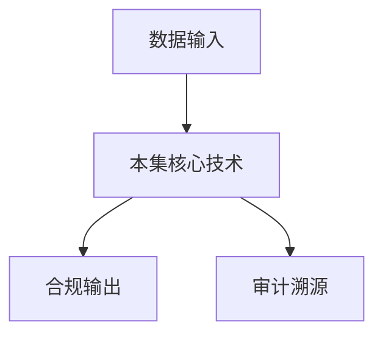

# P42 利用隐语在运营商间跨域结算精密对账场景的应用实践

← [[BV1ser5BDESU-总览]] | ← [[P41-综合案例与实践-跨企业数据查询]] | 下一篇 → [[P43-隐私计算-隐语护航-医疗健康数据安全协作的架构与实践]]

## 视频信息

| 项目 | 内容 |
|------|------|
| 分集 | 利用隐语在运营商间跨域结算精密对账场景的应用实践 |
| 模块 | 行业实践案例 |
| 时长 | 21 分 47 秒 |
| 链接 | [B 站 P42](https://www.bilibili.com/video/BV1ser5BDESU?p=42) |
| 官方文档 | [SecretFlow 文档](https://www.secretflow.org.cn/zh-CN/docs) |
| 内容来源 | 知识点增强（数据要素流通技术体系，非逐字转写） |

## 核心要点

1. **本 P 主题**：利用隐语在运营商间跨域结算精密对账场景的应用实践
2. **模块定位**：行业实践案例
3. **考试/实践侧重**：运营商 PSI 对账、跨域结算、精度校验
4. **笔记层级**：教程级（约 2984 字），含速览、图解、场景 Walkthrough、自测题
5. **学习建议**：先通读「3 分钟速览」与「图解」，再读「详细讲解」；动手项见 Checklist

> 以下内容基于数据要素流通与隐私计算技术体系撰写，对应 B 站分 P「利用隐语在运营商间跨域结算精密对账场景的应用实践」。**非 UP 逐字转写**；不看视频也可建立框架，看视频可对照「与视频对照表」深化。

## 本节在系列中的位置

**模块**：行业实践案例 · 系列第 **P42/47** 集。

**建议前置**：[[综合案例与实践：跨企业数据查询]]——建立本集所需背景。

**建议后续**：[[隐私计算-隐语护航：医疗健康数据安全协作的架构与实践]]——在本集能力之上继续深入。

依赖关系：政策(P01–P06) → 可信空间(P07–P08,P18) → 密态/隐私技术(P09–P24) → SecretFlow 工程(P25–P32) → 基础设施与案例(P33–P47)。

## 3 分钟速览

**利用隐语在运营商间跨域结算精密对账场景的应用实践** 是数据要素流通体系中的关键一课。读完本节你应能回答：① 核心概念定义；② 在「供得出—流得动—用得好—保安全」链条中的位置；③ 与隐私计算技术栈的衔接。考试/面试侧重：**运营商 PSI 对账、跨域结算、精度校验**。

## 零基础导读

本节「利用隐语在运营商间跨域结算精密对账场景的应用实践」属于 **行业实践案例**。即便未看视频，也应先建立**制度—技术—场景**三层视角：政策类章节回答「为什么允许流」；技术类章节回答「如何安全地算」；案例类章节回答「真实行业怎么落地」。

第一遍阅读请盯住三个问题：本集**解决什么痛点**？**关键参与方**是谁？**交付物或能力边界**是什么？第二遍阅读时，把术语表抄到 Obsidian 双链笔记，与前后分 P 交叉引用。

## 详细讲解

### 1. 案例背景

运营商之间**跨域结算**需精密对账：比对双方用户通话/流量记录求交集并核对金额，但不能泄露对方全量用户列表。隐语 **PSI + 安全计算** 支撑精密对账。

### 2. 业务流程

1. 双方导出对账周期内账单主键（用户 ID + 账期）
2. PSI 求交集账户
3. 对交集中记录安全比对金额差异
4. 输出差异报告与汇总统计
5. 审计日志双方存证

### 3. 技术要点

- 主键规范化（MSISDN 格式统一）
- 大规模 PSI 选 KKRT 协议
- 金额比较可用 SPU 安全比较算子
- 跨域部署：各省 Kuscia Domain

### 4. 价值

减少人工对账误差与周期；避免全量数据交换的合规风险；可扩展到漫游结算、互联互通结算。

### 5. 扩展

结合区块链记录对账结果哈希，争议时可追溯。

### 6. 考试/实践要点

- 说明 PSI 在对账中的精确角色
- 估算千万级用户 PSI 的性能考虑
- 列举对账失败的三种异常处理

### 7. SLA

对账任务完成时限写入合约；延迟自动告警与人工介入。

### 8. 对账频率

日/月结选择影响 PSI 数据量；增量 PSI 仅对新账单求交。

### 9. 漫游扩展

国际漫游对账涉及跨境，须额外数据出境评估；可用本地化 PSI 仅回国差集统计。

### 10. 学习与实践检查单

- [ ] 对照本 P 标题回顾 B 站视频章节要点
- [ ] 在 [SecretFlow 文档](https://www.secretflow.org.cn/zh-CN/docs) 找到对应模块
- [ ] 能用一句话向同事解释本 P 核心概念
- [ ] 识别一个本行业可落地的应用场景
- [ ] 记录与前后分 P 的技术依赖关系

### 11. 模块知识串联
本讲属于「数据要素流通技术」体系中的重要一环。建议在学习日志中标注：输入依赖（前序知识）、输出能力（学完能做什么）、与隐语组件映射（SecretFlow/Kuscia/SecretPad/TEE）。完成 47 讲后应能独立设计一个「政策合规+连接器+隐私计算+审计存证」的端到端方案，并评估 MPC、TEE、联邦学习的选型依据。

### 案例精读建议

阅读行业案例时采用 **STAR**：Situation（监管与痛点）、Task（业务目标）、Action（技术选型与过程）、Result（指标与合规结论）。将本集案例与您单位场景对比，列出 3 条可借鉴与 3 条不可照搬的理由。

## 图解

## 类比与直觉

行业案例像**菜谱**：同样的隐私计算「厨具」，医疗、金融、车险各做一道菜，重点看食材（数据）与火候（合规）如何配合。

## 例题与场景 Walkthrough

**行业复盘：利用隐语在运营商间跨域结算精密对账场景的应用实践**

**场景：两家机构联合建模（不共享明文）**

1. **样本对齐**：若双方仅有交集用户有价值，先用 PSI（P21/P28）对齐 ID。
2. **特征拼接**：纵向联邦（P24）下 A 方持标签、B 方持特征，梯度通过安全聚合更新。
3. **训练执行**：在 SecretFlow SPU（P27）上完成密态前向/反向，或 TEE 内明文训练（P11–P17）。
4. **模型发布**：输出评分服务；模型参数经评估后按需出域，训练数据永不出域。
5. **本集关联**：利用隐语在运营商间跨域结算精密对账场景的应用实践 提供其中 **运营商 PSI 对账** 能力。

额外关注：行业监管口径（金融银保监会、医疗卫健委）、数据最小必要、个人信息影响评估、模型可解释性与备案要求。

## 常见误区

1. **「学完本集就会用隐语」**：SecretFlow 生态需多集串联（P19–P32），单集只是拼图一块。
2. **「隐私计算等于不上传数据」**：数据仍以密文、份额或授权方式参与计算，网络与算力开销客观存在。
3. **「TEE 绝对安全」**：TEE 依赖硬件与侧信道防护，需远程证明（P17）与补丁策略。
4. **「区块链解决一切确权」**：链适合存证与交易撮合，大规模计算仍在链下隐私计算引擎。

## 与视频对照表

| 视频段落（约） | 预期演示内容 | 笔记对应章节 |
|-------------|------------|------------|
| 开篇 0%–15% | 本集目标、背景、与前后集关系 | 本节位置、3 分钟速览 |
| 前段 15%–40% | 核心概念定义与架构图 | 零基础导读、详细讲解 |
| 中段 40%–70% | 原理展开、对比、政策/代码示例 | 图解、类比、Walkthrough |
| 后段 70%–90% | 案例、问答、易错点 | 常见误区、Checklist |
| 收尾 90%–100% | 总结、延伸资源 | 延伸阅读、自测题 |

> 本集总时长约 **21分47秒**。无官方外挂字幕时，以分 P 标题「利用隐语在运营商间跨域结算精密对账场景的应用实践」与上表主题对齐视频画面。

## 动手实践 Checklist

- [ ] 复述本集 3 个定义（不看笔记）
- [ ] 根据 Walkthrough 写 200 字场景短文
- [ ] 对照视频确认 1 个架构图/演示
- [ ] 在总览思维导图中标注本集节点
- [ ] 完成自测 Q1/Q5

## 延伸阅读

- [SecretFlow 文档中心](https://www.secretflow.org.cn/zh-CN/docs)
- TC609 可信数据空间相关标准
- 本系列相邻 2 个分 P 笔记

## 自测题

1. **本集核心考点？**  
   **答**：运营商 PSI 对账、跨域结算、精度校验。

2. **本集在四原则中的位置？**  
   **答**：用得好+行业落地。

3. **与 SecretFlow 的关系？**  
   **答**：为 SecretFlow 提供密码学/算法基础。

4. **一项落地检查？**  
   **答**：是否有授权、是否最小必要、是否可审计——三者缺一不可。

5. **30 秒口述本集？**  
   **答**：用「输入→处理→输出」各一句话概括（见 Walkthrough）。

## 关键术语

| 术语 | 说明 |
|------|------|
| 数据要素 | 可参与社会化配置、创造价值的数字化资源 |
| 隐私计算 | 数据可用不可见前提下实现协作计算的技术体系 |
| 模块 | 行业实践案例 |

## 与前后分 P 的衔接

- ← **综合案例与实践：跨企业数据查询**（[[P41-综合案例与实践-跨企业数据查询]]）
- → **隐私计算-隐语护航：医疗健康数据安全协作的架构与实践**（[[P43-隐私计算-隐语护航-医疗健康数据安全协作的架构与实践]]）

## 逐字转写
> 引擎: whisper | 状态: 已转写 | 格式: 段落化

### [00:05 - 00:56] 大家好,我是谷玉,来自中国联通
大家好,我是谷玉,来自中国联通软件研究院计费结算中心。目前主要从事数据跨移安全流通系统的价格设计,以软件开发动作。同时也深度参与了隐私计算在运营商跨域结算场景中的技术研究与应用的落地。今天非常荣幸地能留在这里,想大家分享中国联通在跨运营商往间结算对象中,，如何结合蓄宽链与隐私计算技术。特别是基于银鱼的可用光架,实现了数据可用不可见的经济对账的一个实践。首先,本次分享的话将围绕着背景痛点、解决方案、技术选行、实施成效以及未来的一些展望几个部分来进行展开。

### [00:56 - 01:49] 希望能够为隐私计算在通信乃至更
希望能够为隐私计算在通信乃至更多行业的一个应用落地,提供一些有价值的参考。首先,我们来看一下运营商往间结算的一个背景。在通信行业中,当不同的运营商的用户之间发生了一个通信行为的时候,，比如说一个中国联通的用户拨打了一个移动用户的电话,就会产生往间结算需求。这种结算由公信部统一制定规则涉及到语音、短信、彩信、三类业务、，每一页的一划单量高达数百亿条,双方运营商需要从各自的一个网设备中采集划单。经过批下处理后,生成对账表和结算报表,最终完成了一个资金的结算。

### [01:50 - 02:45] 而目前的话,我们中国联通由我们
而目前的话,我们中国联通由我们软件议院的中和结算系统来支撑这一流程。尽管咱们结算流程,自动化程度还是比较高的。但是在哪个对账环节,一旦结算金额出现差异,人需要依赖省分公司人工的介入。具体的流程是,省公司通过邮件、邮盘等线下方式,召唤原始相当数据,在手动比对,查找差异。而这种方式的话,存在这四大核心痛点,属性第一,效率地下。动辄数周的一个人工的对账,严重的拖慢了整体的一个结算周期,，对账环节通常占整个流程的60%以上的时间。第二的话,就是一个准确都不足的问题。

### [02:45 - 03:40] 目前虽然能够抽样的对比,但无法
目前虽然能够抽样的对比,但无法做到全量的一个集合,容易遗漏、差异。第三的话,就是一个安全风险高的问题。原始数据的话,通过非加密的一个渠道,传输存在的敏感信息泄漏和合规风险。第四,对比的逻辑不一致,放风对移制的定义可能存在差异,，导致反复进行的一个问题推违的一个现象。而这些问题的话,吐使我们思考,能否在不泄漏原始数据的天体下,，实现高效、安全、精准的一个自动对账。我们解决的思路是,将去块链、隐私计算以大数据处理深度融合,，构建一个新型的一个可信数据系统的一个体系。

### [03:40 - 04:37] 去块链作为信任地座,确保计算过
去块链作为信任地座,确保计算过程全程可审计,，结果不可篡改,为跨意协作提供透明可信的环境。而隐私计算技术保障各参与方数据在不出于的一个前提下,完成联合计算。实现数据可用不可见,有效解决数据安全与共享的一个矛盾。而高性能轮的大数据处理平台,则支撑数百亿的化单的一个高效处理,，支持了一个调度于分析,确保系统在大规模应用场景下的一个稳定与效率。三者有机的结合,我们提出了新信任、新协同,新结算的一个理念。目标是构建一个安全、高效、自动化的跨域对账体系。

### [04:37 - 05:40] 整个流程主要分为三个阶段,数据
整个流程主要分为三个阶段,数据的一个标准化处理,数据加密和隐私对比。首先的话在数据标准化处理的阶段,各方将各自的原始、相当单数据按照统一的规则进行预设,，确保数据格式一致,便于后续计算、平台调用。例如咱们原始的电容号码加密会被保留关键的数据,，但隐藏部分之段以保护用户的隐私接着进行数据的加密环节。各参与方在各自使用特定的规则对预设后的数据,，生成不可逆的加密相当,然后实现通过隐私计算技术来进行相关的一个对比。而整个过程的话确保了咱们原始的数据不会被直接泄露,，同时加密结果具有唯一限可用于后续的比对。

### [05:40 - 06:43] 最后的话最后的核心是我们的一个
最后的话最后的核心是我们的一个隐私比对的环节,，在隐私计算平台上系统会对双方提取的加密相当进行一致性判断。如果说出现不一致的情况的话,，就会标志为差异划单需要进一步的一个核对,，而整个过程无需共享原始的数据,真正实现了数据可用不可见。而这个方面为什么我们选择英语作为我们隐私计算的一个解决方案?，我接下来要从方案调度和算法三维度深入铲述其技术优势与实际应用价值。首先在方案的选择方面,我们之所以选择英语平台,，是因为它们以安全意用开放破局为核心设计的理念,，充分契合了我们在数据安全,。

### [06:43 - 07:46] 数据安全与高效协作方面的双重需
数据安全与高效协作方面的双重需求。英语平台内置了多的先进的密採计算虚拟设备。同时的话,主要原因有四点,，首先能力全面,英语内置了NPC第一,，庞德加密等多种密码学协议,，支持银河的组合适配我们复杂的对账适逻辑。第二,医用性强,提供统一的APR接口,，支持ATTP、JRPC等像我们的一个调用,，便于于现在的系统进行机场。第三的话就是价格开放,，支持P2P对等等度和运营商间对等协论的业务模式。第四,社区合约,作为看源项目,，社区支持的力度大,有利于长期的，共建与标准化的约束出。见识这些特性,。

### [07:46 - 08:50] 使英语成为我们跨域对账场景的理
使英语成为我们跨域对账场景的理想选择。第四,在调度相关的方面的话,，我们采用能力枯下作为对统一的一个隐私计算底座,，枯下具备强大的任务调度能力,，支持多隐私计算任务的并发执行,，并实现了端口复用的机制,，继续一个公网端口,，进口完成所有的通信任务,，极大的减化了网络配置于运营为复杂度。更重要的是,，它提供了统一的ETVP、JRPC的一个接口,，便于我们快速的集成隐私计算能力,，到我们现在的业务系统中。此外,枯下支持P2P模式的枯建网络,，我们中国铃通和移动的双方对等组网的一个需求,，确保在去中心化的架构下,。

### [08:50 - 09:53] 依然能够勾销稳定的安全通信。
依然能够勾销稳定的安全通信。最后,在算法选择方面,，我们选择了ECDH PSI算法,，而相比较其他的影子求交算法的算法,，而ECDH PSI具有显著的优势。计算效率高,通信的开销比较低,，安全性强,，它利用椭原曲线加密技术在不泄露原始数据的前提下,，实现双方相当数据的精准匹配。尤其是用于在运营上间的划单比对之类大规模数据强调,，能够在保障数据隐私的同时,，显著降低计算与传输成本,，真正实现了数据的安全,高效的隐私保护计算。综上所述通过隐私计算引以平台的综合能力,，并结合固定下的调度优势,。

### [09:53 - 10:55] 以及ECDHPSI的一个高效率
以及ECDH PSI的一个高效率性能的一个特性。我们构建了一套完整、可靠、可扩展的隐私计算解决方案。接下来说我们的一个整体的方案,，首先从系统间的架构来看,，整个方案主要有两个核心部分构成,，组织A与组织B,，它的本地文件,以及终极化的隐私计算平台,，以及我们基于区块链打造的隐私结算链体系。每个组织之间,，设有我们的一个计算系统,，负责原始标准化相当的一个生成。这些文件在进入隐私计算平台前,，需要进行经过标准化处理,，确保格式一致、自断一致,，便于后面的一个计算和比对。随后,数据在本地进行文件加密,。

### [10:55 - 11:56] 并通过可信传输通道上传至隐私计
并通过可信传输通道上传至隐私计算平台。这一过场全程不暴露原始数据,，保障了我们数据的安全性。在隐私计算平台上,，双方完成隐私求交等相关任务。申请我们的比对结算结果,，进行完成我们的报告上传,，报告上传到我们的底层，基于区块链打造的结算业平台。同而实现了一个不可算改,，可追溯的一个数据存证。在相当的自动化比对及和流程方面,，我们设计了一套必还式的自动化流程。整个流程始于发起对账,，系统首先导入双方的相当数据,，然后进入对账规则解析阶段。这里我们引入了对账池的概念。这个对账池的话,系统会根据规则。

### [11:56 - 12:55] 规则始终在一个规则列表,
规则始终在一个规则列表,，说实话对对账规则清单并其中对账任务。对账过程中采用了规则1的n串形之形的方式,，逐潮链证各条规则是否匹配。每完成一条规则的比对,，系统就会判断是否已经完成。若未完成的话,，则会进行下一条规则比对。若全部完成的话,，就会输出我们的一个差异报告。而差异报告的话,，就会上传到我们第7块链导致的结算链平台,，而整个流程就从手翁的对账完成了，我们的一个自动集合的一个转变,，极大推动了对账的准确性和效率。此外,底层结算链作为数据安全的最后一条方案,，不仅记录了每一条的一个对账结果,。

### [12:55 - 13:56] 还可以通过区块链的分布式账本特
还可以通过区块链的分布式账本特性,，确保了一个数据不可算改,可审计,可遵守。进一步增强系统的可信性和安全性。整个方案通过隐私计算加区块链的深度人和,，实现了数据可用不可见,，解决了传统人工对账,效率低,，危险高的一个痛对,，架构了安全高效可信的跨企业数据协通信发式。而这边的话是我们产数楼,，我们组织之间基于隐私计算,，跨与结算对账的一个业务流通的一个流程。首先,本方案基于底层链作为我们的信任底座,，通过发起方与审核方之间的一个协统,，实现了一个安全可信的一个数据处理。整个流程的话,主要分为三个阶段。

### [13:56 - 14:56] 首先,第一个阶段是准备阶段。
首先,第一个阶段是准备阶段。双方在各自的系统内,，创建并选合对象规则,，提取并标准化划单布局,，并将关键的步骤同步至区块链。在我们的一个计算阶段的话,，我们在计算阶段,，双方在独立的隐私计算平台上,，对本地数据进行加密的一个处理,，通过隐私求交统技术,，轮旋按照我们的一个规则,，进行我们完成我们的一个按规则的一条条的一个比对。比对完毕之后,，我们会对相当进行统计,，生成我们比如我们的一个权益据化单,，金额差异化单,还有我们的一个单方化单,，指的是双方都没有匹配上的化单,，同时我们生成相关的报告,，通过报告的话,。

### [14:56 - 15:55] 把报告上传到我们的一个区域站里
把报告上传到我们的一个区域站里面,，而我们上传的报告的话,，防止单方上改,，我们上传的全都是一个加密的数据,，结果当双方都上传了我们的加密数据之后,，我们会处理数据之后,，双方上传我们的密要到链上,，由智能合约来执行了一个双方解密,，双方解密进行比对,，确保咱们报告双方都是一致的,，没有经过上改,，然后实现解密,，双方业务人员的话,，根据这个报告,，就可以看到我们那个明文的一个报告,，来实现下载,，然后完成后面的一些调整等其他工作,，而整个环境过程的话,，形成了一个闭环,，确保了一个数据安全,，然后接下来给大家分享一下,。

### [15:55 - 16:52] 我们现在的一些进展,
我们现在的一些进展,，本丧案的话,，已经在广东,，江苏等整分公司完成的连条,，测试,，并正式的一个上线,，最显著的一个成效的话,，是我们一个对账效率的,，一个费月式的一个提升,，在过去相当的比对,，需要数周的时间,，而现在的话,，通过隐私计算,，可再,，可以在几小时完成权量的一个集合,，更重要的是,，我们现在可以,，实现了一个按日的一个权量的比对,，确定,，摆脱了一个出样估算的一个不准确讯,，大幅的提升了结算的及时性,，与及时性,，同时的话,，本方案的技术创新,，与落地价值,，也获得了一个行业的一个广方认可,，我们有幸,，获得了2025年,。

### [16:52 - 17:52] 以与开源社区的优秀生态伙伴的一
以与开源社区的优秀生态伙伴的一个称号,，包括在2025年,，精灵光碑中国互联网重新大赛中,，获得了成果转化,，专题赛的优秀项目奖,，同时我们也在中国可信区块链工房大赞中,，被评为了作业优秀案例奖,，等相关的一些奖项,，而这些奖项不仅是度我们团队的肯定,，也体现了一次计算,，在无论是在通信行业,，还是金融,，或者其他行业,，都存在了巨大的一个潜力,，同时我们在标准化的,，这是产权方面,，也取得了丰硕的一个成果,，比如说本项目的话,，获得了2024年中国联统集团,，科学进步三能量,，总说我们协同了,，工薪部和TPI,，先头制定了,。

### [17:52 - 18:54] 我们区块链的跨网结算,
我们区块链的跨网结算,，技术要求,，等两项的一个行业标准,，并提交了四项专利,，授权的两项,，覆盖跨云的一个Buds协同治理,，业务融合应用等方面,，而这些成果的话,，为后面的一个规模化的,，规模化的推广,，辨定了一个坚实的一个基础,，这是我们一些项目的一个经验,，通过人民邮件报C1114,，等全国媒体的一个相关的报道,，并被国资委,，工薪部等作为典型的一个案例推广,，同时形成了一个良好的行业示范的一个效应,，而下一步的话,，我未来的话,，四个方面,持续深化隐私计算相关的应用,，首先,其一是深化,，深度参与银与开源社区的一个弓箭,。

### [18:54 - 19:59] 结合自身的一个实践,
结合自身的一个实践,，推动通行行业隐私计算,，标准的一个制定,，并贡献我们相关的一些算法,，或者一些成果,，给开源社区,，以提升平台在运营商场景的一个试用性,，第二的话就是,，深化隐私计算,，技术利用,，整合多方安全计算,，联盟学习等技术,，打破内部部门的一个数据孤岛,，支持化部门联合分析,，用互化相融合与坚准营销。第三的话,，就是推动跨银商数据协统,，在原有的结算对账基础上,，探索联合封控,，换机架,信用评估等场景的一个联合建模,，构建行业级的一个数据共享,，与封控平台。而第四的话,，就是扩展我们跨行业的一个数据流通,，重点参与金融,。

### [19:59 - 21:08] 政府,医疗等行业的一个合作,
政府,医疗等行业的一个合作,，通过逻辑规及物理隔离等方式,，来构建跨行业的一个联合建模平台,，但满足监管的要求的同时,，释放数据价值。而展望我们长期的话,，是以构建以数据空间为核心的全面路,，数据价值体系,，通过隐私计算与区块院的一个深度融合,，打造一个安全、可信、，高效和规的生产及数据协统平台。在这个平台上,，数据可以在跨企业、跨部门、，跨行业中安全流动,，支撑联合封控,，反炸、反洗钱、，昏迷保险、，城市治理等广泛的场景,，最终实现数据流通,，到沉淀的价值庇划,，为数据中国的一个建设提高,，提供建设的一个支撑。

### [21:08 - 21:40] 以上就是我今天的一个全部分享,
以上就是我今天的一个全部分享,，我们坚信数据的价值在于流通,，而流通前提是,，安全与信任,，感谢英语开源社区，为我们提供了强大的一个技术比作,，也感谢各位同行的关注和支持,，替在未来能够跟更多的伙伴一起,，共同堆落,，比此计算在更多场景的约落地,，共建可信数据的一个生态。好,谢谢大家。

## 来源说明

- ✅ B 站官方元数据（`Tools/BV1ser5BDESU-full.json`）
- ✅ 分 P 首帧封面（`Tools/bili-fetch/fetch-bilibili.js`）
- ✅ **教程级增强**：含图解/Mermaid、场景 Walkthrough、自测题（约 2984 字，2026-06-06）
- ⏳ 逐字转写：B 站 API 无外挂字幕轨；可选 Whisper/BiliNote 后续补充

## 关键截图

![[../../06-资源附件/video-notes-images/BV1ser5BDESU-P42-cover.jpg|B站首帧 P42]]
