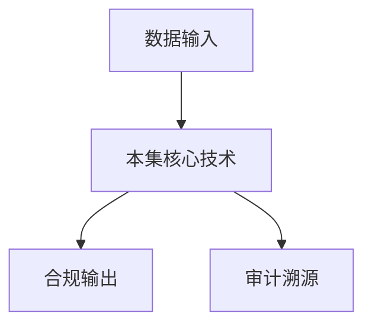

# P43 隐私计算-隐语护航：医疗健康数据安全协作的架构与实践

← [[BV1ser5BDESU-总览]] | ← [[P42-利用隐语在运营商间跨域结算精密对账场景的应用实践]] | 下一篇 → [[P44-隐语在新能源车险联合定价中的实践]]

## 视频信息

| 项目 | 内容 |
|------|------|
| 分集 | 隐私计算-隐语护航：医疗健康数据安全协作的架构与实践 |
| 模块 | 行业实践案例 |
| 时长 | 34 分 44 秒 |
| 链接 | [B 站 P43](https://www.bilibili.com/video/BV1ser5BDESU?p=43) |
| 官方文档 | [SecretFlow 文档](https://www.secretflow.org.cn/zh-CN/docs) |
| 内容来源 | 知识点增强（数据要素流通技术体系，非逐字转写） |

## 核心要点

1. **本 P 主题**：隐私计算-隐语护航：医疗健康数据安全协作的架构与实践
2. **模块定位**：行业实践案例
3. **考试/实践侧重**：医疗数据协作架构、合规要求、隐语部署
4. **笔记层级**：教程级（约 3037 字），含速览、图解、场景 Walkthrough、自测题
5. **学习建议**：先通读「3 分钟速览」与「图解」，再读「详细讲解」；动手项见 Checklist

> 以下内容基于数据要素流通与隐私计算技术体系撰写，对应 B 站分 P「隐私计算-隐语护航：医疗健康数据安全协作的架构与实践」。**非 UP 逐字转写**；不看视频也可建立框架，看视频可对照「与视频对照表」深化。

## 本节在系列中的位置

**模块**：行业实践案例 · 系列第 **P43/47** 集。

**建议前置**：[[利用隐语在运营商间跨域结算精密对账场景的应用实践]]——建立本集所需背景。

**建议后续**：[[隐语在新能源车险联合定价中的实践]]——在本集能力之上继续深入。

依赖关系：政策(P01–P06) → 可信空间(P07–P08,P18) → 密态/隐私技术(P09–P24) → SecretFlow 工程(P25–P32) → 基础设施与案例(P33–P47)。

## 3 分钟速览

**隐私计算-隐语护航：医疗健康数据安全协作的架构与实践** 是数据要素流通体系中的关键一课。读完本节你应能回答：① 核心概念定义；② 在「供得出—流得动—用得好—保安全」链条中的位置；③ 与隐私计算技术栈的衔接。考试/面试侧重：**医疗数据协作架构、合规要求、隐语部署**。

## 零基础导读

本节「隐私计算-隐语护航：医疗健康数据安全协作的架构与实践」属于 **行业实践案例**。即便未看视频，也应先建立**制度—技术—场景**三层视角：政策类章节回答「为什么允许流」；技术类章节回答「如何安全地算」；案例类章节回答「真实行业怎么落地」。

第一遍阅读请盯住三个问题：本集**解决什么痛点**？**关键参与方**是谁？**交付物或能力边界**是什么？第二遍阅读时，把术语表抄到 Obsidian 双链笔记，与前后分 P 交叉引用。

## 详细讲解

### 1. 案例背景

医疗健康数据涉及高度敏感个人信息，多机构协作科研、公卫、保险精算需**安全协作架构**。本案例介绍隐语在医疗健康领域的部署实践。

### 2. 参考架构

| 层 | 组件 |
|------|------|
| 接入 | 医院连接器、合规网关 |
| 治理 | 伦理审批、分类分级、合约 |
| 计算 | SecretFlow 联邦 + TEE 推理 |
| 存储 | 密态存储、密钥 KMS |
| 审计 | 全链路日志 + 区块链存证 |

### 3. 典型协作模式

- **多院联合科研**：纵向联邦 + 伦理批件
- **医险协同**：PSI 对齐患者，保险方不看病历原文
- **药企真实世界研究**：统计汇总 + 差分隐私

### 4. 合规框架

《个人信息保护法》《医疗卫生机构数据管理办法》；最小必要；单独同意敏感医疗信息；跨境限制。

### 5. 落地 checklist

网络隔离、专网 Kuscia、国密算法、等保三级、应急预案、人员培训。

### 6. 考试/实践要点

- 画医疗协作五层架构
- 说明联邦与 TEE 在医疗中的分工
- 列举三项医疗数据合规红线

### 7. 患者授权

动态同意管理：患者可撤回授权，系统停止其数据参与联邦。

### 8. 多中心 IRB

多院伦理互认减少重复审批周期。

### 9. 医疗器械

若模型作为 SaMD（软件医疗器械），需 NMPA 审批；联邦训练过程文档纳入注册资料。

### 10. 学习与实践检查单

- [ ] 对照本 P 标题回顾 B 站视频章节要点
- [ ] 在 [SecretFlow 文档](https://www.secretflow.org.cn/zh-CN/docs) 找到对应模块
- [ ] 能用一句话向同事解释本 P 核心概念
- [ ] 识别一个本行业可落地的应用场景
- [ ] 记录与前后分 P 的技术依赖关系

### 11. 模块知识串联
本讲属于「数据要素流通技术」体系中的重要一环。建议在学习日志中标注：输入依赖（前序知识）、输出能力（学完能做什么）、与隐语组件映射（SecretFlow/Kuscia/SecretPad/TEE）。完成 47 讲后应能独立设计一个「政策合规+连接器+隐私计算+审计存证」的端到端方案，并评估 MPC、TEE、联邦学习的选型依据。

### 案例精读建议

阅读行业案例时采用 **STAR**：Situation（监管与痛点）、Task（业务目标）、Action（技术选型与过程）、Result（指标与合规结论）。将本集案例与您单位场景对比，列出 3 条可借鉴与 3 条不可照搬的理由。

## 图解

## 类比与直觉

行业案例像**菜谱**：同样的隐私计算「厨具」，医疗、金融、车险各做一道菜，重点看食材（数据）与火候（合规）如何配合。

## 例题与场景 Walkthrough

**行业复盘：隐私计算-隐语护航：医疗健康数据安全协作的架构与实践**

**场景：两家机构联合建模（不共享明文）**

1. **样本对齐**：若双方仅有交集用户有价值，先用 PSI（P21/P28）对齐 ID。
2. **特征拼接**：纵向联邦（P24）下 A 方持标签、B 方持特征，梯度通过安全聚合更新。
3. **训练执行**：在 SecretFlow SPU（P27）上完成密态前向/反向，或 TEE 内明文训练（P11–P17）。
4. **模型发布**：输出评分服务；模型参数经评估后按需出域，训练数据永不出域。
5. **本集关联**：隐私计算-隐语护航：医疗健康数据安全协作的架构与实践 提供其中 **医疗数据协作架构** 能力。

额外关注：行业监管口径（金融银保监会、医疗卫健委）、数据最小必要、个人信息影响评估、模型可解释性与备案要求。

## 常见误区

1. **「学完本集就会用隐语」**：SecretFlow 生态需多集串联（P19–P32），单集只是拼图一块。
2. **「隐私计算等于不上传数据」**：数据仍以密文、份额或授权方式参与计算，网络与算力开销客观存在。
3. **「TEE 绝对安全」**：TEE 依赖硬件与侧信道防护，需远程证明（P17）与补丁策略。
4. **「区块链解决一切确权」**：链适合存证与交易撮合，大规模计算仍在链下隐私计算引擎。

## 与视频对照表

| 视频段落（约） | 预期演示内容 | 笔记对应章节 |
|-------------|------------|------------|
| 开篇 0%–15% | 本集目标、背景、与前后集关系 | 本节位置、3 分钟速览 |
| 前段 15%–40% | 核心概念定义与架构图 | 零基础导读、详细讲解 |
| 中段 40%–70% | 原理展开、对比、政策/代码示例 | 图解、类比、Walkthrough |
| 后段 70%–90% | 案例、问答、易错点 | 常见误区、Checklist |
| 收尾 90%–100% | 总结、延伸资源 | 延伸阅读、自测题 |

> 本集总时长约 **34分44秒**。无官方外挂字幕时，以分 P 标题「隐私计算-隐语护航：医疗健康数据安全协作的架构与实践」与上表主题对齐视频画面。

## 动手实践 Checklist

- [ ] 复述本集 3 个定义（不看笔记）
- [ ] 根据 Walkthrough 写 200 字场景短文
- [ ] 对照视频确认 1 个架构图/演示
- [ ] 在总览思维导图中标注本集节点
- [ ] 完成自测 Q1/Q5

## 延伸阅读

- [SecretFlow 文档中心](https://www.secretflow.org.cn/zh-CN/docs)
- TC609 可信数据空间相关标准
- 本系列相邻 2 个分 P 笔记

## 自测题

1. **本集核心考点？**  
   **答**：医疗数据协作架构、合规要求、隐语部署。

2. **本集在四原则中的位置？**  
   **答**：用得好+行业落地。

3. **与 SecretFlow 的关系？**  
   **答**：为 SecretFlow 提供密码学/算法基础。

4. **一项落地检查？**  
   **答**：是否有授权、是否最小必要、是否可审计——三者缺一不可。

5. **30 秒口述本集？**  
   **答**：用「输入→处理→输出」各一句话概括（见 Walkthrough）。

## 关键术语

| 术语 | 说明 |
|------|------|
| 数据要素 | 可参与社会化配置、创造价值的数字化资源 |
| 隐私计算 | 数据可用不可见前提下实现协作计算的技术体系 |
| 模块 | 行业实践案例 |

## 与前后分 P 的衔接

- ← **利用隐语在运营商间跨域结算精密对账场景的应用实践**（[[P42-利用隐语在运营商间跨域结算精密对账场景的应用实践]]）
- → **隐语在新能源车险联合定价中的实践**（[[P44-隐语在新能源车险联合定价中的实践]]）

## 来源说明

- ✅ B 站官方元数据（`Tools/BV1ser5BDESU-full.json`）
- ✅ 分 P 首帧封面（`Tools/bili-fetch/fetch-bilibili.js`）
- ✅ **教程级增强**：含图解/Mermaid、场景 Walkthrough、自测题（约 3037 字，2026-06-06）
- ⏳ 逐字转写：B 站 API 无外挂字幕轨；可选 Whisper/BiliNote 后续补充

## 关键截图

![[../../06-资源附件/video-notes-images/BV1ser5BDESU-P43-cover.jpg|B站首帧 P43]]
