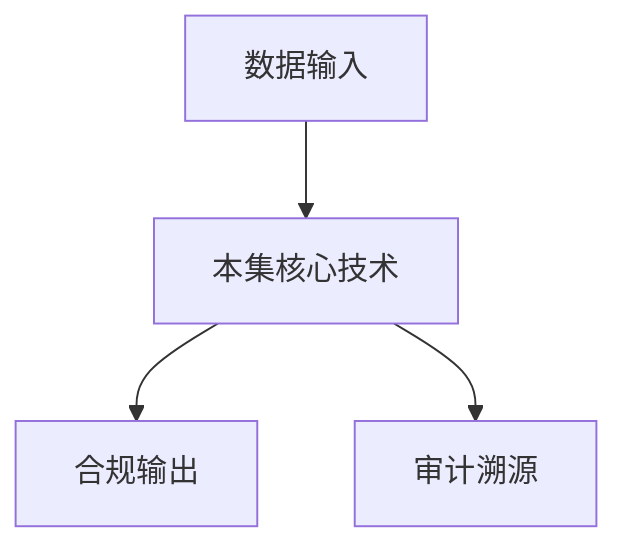

# P44 隐语在新能源车险联合定价中的实践

← [[BV1ser5BDESU-总览]] | ← [[P43-隐私计算-隐语护航-医疗健康数据安全协作的架构与实践]] | 下一篇 → [[P45-可信数据空间-行业级可信数据空间实践-隐语在汽车流通领域的深度赋能]]

## 视频信息

| 项目 | 内容 |
|------|------|
| 分集 | 隐语在新能源车险联合定价中的实践 |
| 模块 | 行业实践案例 |
| 时长 | 25 分 12 秒 |
| 链接 | [B 站 P44](https://www.bilibili.com/video/BV1ser5BDESU?p=44) |
| 官方文档 | [SecretFlow 文档](https://www.secretflow.org.cn/zh-CN/docs) |
| 内容来源 | 知识点增强（数据要素流通技术体系，非逐字转写） |

## 核心要点

1. **本 P 主题**：隐语在新能源车险联合定价中的实践
2. **模块定位**：行业实践案例
3. **考试/实践侧重**：车险联合定价、多维数据融合、定价模型
4. **笔记层级**：教程级（约 2950 字），含速览、图解、场景 Walkthrough、自测题
5. **学习建议**：先通读「3 分钟速览」与「图解」，再读「详细讲解」；动手项见 Checklist

> 以下内容基于数据要素流通与隐私计算技术体系撰写，对应 B 站分 P「隐语在新能源车险联合定价中的实践」。**非 UP 逐字转写**；不看视频也可建立框架，看视频可对照「与视频对照表」深化。

## 本节在系列中的位置

**模块**：行业实践案例 · 系列第 **P44/47** 集。

**建议前置**：[[隐私计算-隐语护航：医疗健康数据安全协作的架构与实践]]——建立本集所需背景。

**建议后续**：[[可信数据空间-行业级可信数据空间实践：隐语在汽车流通领域的深度赋能]]——在本集能力之上继续深入。

依赖关系：政策(P01–P06) → 可信空间(P07–P08,P18) → 密态/隐私技术(P09–P24) → SecretFlow 工程(P25–P32) → 基础设施与案例(P33–P47)。

## 3 分钟速览

**隐语在新能源车险联合定价中的实践** 是数据要素流通体系中的关键一课。读完本节你应能回答：① 核心概念定义；② 在「供得出—流得动—用得好—保安全」链条中的位置；③ 与隐私计算技术栈的衔接。考试/面试侧重：**车险联合定价、多维数据融合、定价模型**。

## 零基础导读

本节「隐语在新能源车险联合定价中的实践」属于 **行业实践案例**。即便未看视频，也应先建立**制度—技术—场景**三层视角：政策类章节回答「为什么允许流」；技术类章节回答「如何安全地算」；案例类章节回答「真实行业怎么落地」。

第一遍阅读请盯住三个问题：本集**解决什么痛点**？**关键参与方**是谁？**交付物或能力边界**是什么？第二遍阅读时，把术语表抄到 Obsidian 双链笔记，与前后分 P 交叉引用。

## 详细讲解

### 1. 案例背景

**新能源车险**定价需融合车辆运行数据、驾驶行为、维修记录等多源数据，单保险公司数据维度不足。隐语支撑**联合定价模型**训练与推理。

### 2. 数据维度

- 保险公司：理赔历史、保单信息
- 车企/TSP：电池健康、里程、充电习惯
- 交管/维修：事故、维修记录（若授权）

### 3. 建模流程

1. PSI 对齐车辆 VIN/车主 ID
2. 纵向联邦训练赔付概率模型
3. 特征重要性分析指导产品定价
4. 在线联邦推理或定期批量评分

### 4. 业务价值

更精准风险分层 → 动态保费；促进新能源车险产品创新；数据方获得数据要素收益分成。

### 5. 技术栈

SecretPad + 纵向联邦组件 + Kuscia 跨企业域 + 可选 TEE 保护模型 IP

### 6. 考试/实践要点

- 说明车险场景为何适合纵向联邦
- 列举三类关键特征及其持有方
- 讨论定价模型的监管报备要求

### 7. 动态定价

UBI 车联网险结合实时驾驶评分；TEE 内推理保护行为数据。

### 8. 再保险

联邦模型输出聚合风险供再保险公司，不暴露单保单明细。

### 9. 新能源特色

电池衰减曲线与理赔相关；车企数据与保险联合可识别「高风险电池批次」而不暴露单车轨迹。

### 10. 学习与实践检查单

- [ ] 对照本 P 标题回顾 B 站视频章节要点
- [ ] 在 [SecretFlow 文档](https://www.secretflow.org.cn/zh-CN/docs) 找到对应模块
- [ ] 能用一句话向同事解释本 P 核心概念
- [ ] 识别一个本行业可落地的应用场景
- [ ] 记录与前后分 P 的技术依赖关系

### 11. 模块知识串联
本讲属于「数据要素流通技术」体系中的重要一环。建议在学习日志中标注：输入依赖（前序知识）、输出能力（学完能做什么）、与隐语组件映射（SecretFlow/Kuscia/SecretPad/TEE）。完成 47 讲后应能独立设计一个「政策合规+连接器+隐私计算+审计存证」的端到端方案，并评估 MPC、TEE、联邦学习的选型依据。

### 案例精读建议

阅读行业案例时采用 **STAR**：Situation（监管与痛点）、Task（业务目标）、Action（技术选型与过程）、Result（指标与合规结论）。将本集案例与您单位场景对比，列出 3 条可借鉴与 3 条不可照搬的理由。

## 图解

## 类比与直觉

行业案例像**菜谱**：同样的隐私计算「厨具」，医疗、金融、车险各做一道菜，重点看食材（数据）与火候（合规）如何配合。

## 例题与场景 Walkthrough

**行业复盘：隐语在新能源车险联合定价中的实践**

**场景：两家机构联合建模（不共享明文）**

1. **样本对齐**：若双方仅有交集用户有价值，先用 PSI（P21/P28）对齐 ID。
2. **特征拼接**：纵向联邦（P24）下 A 方持标签、B 方持特征，梯度通过安全聚合更新。
3. **训练执行**：在 SecretFlow SPU（P27）上完成密态前向/反向，或 TEE 内明文训练（P11–P17）。
4. **模型发布**：输出评分服务；模型参数经评估后按需出域，训练数据永不出域。
5. **本集关联**：隐语在新能源车险联合定价中的实践 提供其中 **车险联合定价** 能力。

额外关注：行业监管口径（金融银保监会、医疗卫健委）、数据最小必要、个人信息影响评估、模型可解释性与备案要求。

## 常见误区

1. **「学完本集就会用隐语」**：SecretFlow 生态需多集串联（P19–P32），单集只是拼图一块。
2. **「隐私计算等于不上传数据」**：数据仍以密文、份额或授权方式参与计算，网络与算力开销客观存在。
3. **「TEE 绝对安全」**：TEE 依赖硬件与侧信道防护，需远程证明（P17）与补丁策略。
4. **「区块链解决一切确权」**：链适合存证与交易撮合，大规模计算仍在链下隐私计算引擎。

## 与视频对照表

| 视频段落（约） | 预期演示内容 | 笔记对应章节 |
|-------------|------------|------------|
| 开篇 0%–15% | 本集目标、背景、与前后集关系 | 本节位置、3 分钟速览 |
| 前段 15%–40% | 核心概念定义与架构图 | 零基础导读、详细讲解 |
| 中段 40%–70% | 原理展开、对比、政策/代码示例 | 图解、类比、Walkthrough |
| 后段 70%–90% | 案例、问答、易错点 | 常见误区、Checklist |
| 收尾 90%–100% | 总结、延伸资源 | 延伸阅读、自测题 |

> 本集总时长约 **25分12秒**。无官方外挂字幕时，以分 P 标题「隐语在新能源车险联合定价中的实践」与上表主题对齐视频画面。

## 动手实践 Checklist

- [ ] 复述本集 3 个定义（不看笔记）
- [ ] 根据 Walkthrough 写 200 字场景短文
- [ ] 对照视频确认 1 个架构图/演示
- [ ] 在总览思维导图中标注本集节点
- [ ] 完成自测 Q1/Q5

## 延伸阅读

- [SecretFlow 文档中心](https://www.secretflow.org.cn/zh-CN/docs)
- TC609 可信数据空间相关标准
- 本系列相邻 2 个分 P 笔记

## 自测题

1. **本集核心考点？**  
   **答**：车险联合定价、多维数据融合、定价模型。

2. **本集在四原则中的位置？**  
   **答**：用得好+行业落地。

3. **与 SecretFlow 的关系？**  
   **答**：为 SecretFlow 提供密码学/算法基础。

4. **一项落地检查？**  
   **答**：是否有授权、是否最小必要、是否可审计——三者缺一不可。

5. **30 秒口述本集？**  
   **答**：用「输入→处理→输出」各一句话概括（见 Walkthrough）。

## 关键术语

| 术语 | 说明 |
|------|------|
| 数据要素 | 可参与社会化配置、创造价值的数字化资源 |
| 隐私计算 | 数据可用不可见前提下实现协作计算的技术体系 |
| 模块 | 行业实践案例 |

## 与前后分 P 的衔接

- ← **隐私计算-隐语护航：医疗健康数据安全协作的架构与实践**（[[P43-隐私计算-隐语护航-医疗健康数据安全协作的架构与实践]]）
- → **可信数据空间-行业级可信数据空间实践：隐语在汽车流通领域的深度赋能**（[[P45-可信数据空间-行业级可信数据空间实践-隐语在汽车流通领域的深度赋能]]）

## 逐字转写
> 引擎: whisper | 状态: 已转写 | 格式: 段落化

### [00:06 - 01:13] 大家好,感谢英语开源社区的邀请
大家好,感谢英语开源社区的邀请,我是玛依宝,，车嫌联合定价项目组的技术开发,陈超。今天给大家分享一下,英语在新联员车嫌联合定价中的实践。主要呢,有以下四款内容。首先是那个当下新联员车嫌所面临的困境。第二部分是玛依宝车嫌,如何使用英语打破上述困境。第三部分是我们构建的这个车嫌绿洲平台,，然后给大家讲解一下联合定价的这样的一个案例实践。第四部分就是联合定价在新联员车嫌当中的应用,，以及未来的展望。首先我们来看一下新联员车嫌当前面临的一个怎样的困境。一方面新联员车的销量以及渗透率保持着高速的增长,。

### [01:13 - 02:10] 2024年的整体渗透率已经达到
2024年的整体渗透率已经达到了40%以上。另一方面新联员车的赔付率却居高不下,，整体都高于燃油车10%以上。整个行业在新联员车的业务上其实都是亏损的。新联员车高赔付的原因,总结下来主要有以下三点。第一,新联车车主普遍年轻化,，新联车用户中年轻的新手车主较多,，而偏好激进驾驶的人群也集中在年轻的群体当中。有大事统计,年轻人的出现概率普遍高于中老年人。第二部分,新联车的加速性能更强,，新联车引擎的百公里加速能轻松的赶上燃油车的超跑,，也因此,极加速和极减速的频率显著的也高于燃油车,。

### [02:10 - 03:17] 它的事故发生率相较于燃油车来说
它的事故发生率相较于燃油车来说就更高。第三点,新联车的维修成本更高,，新联车它的车型通常采用异体化的压柱,，同时搭载着电池和大量的电子传感器等元器件。往往它只能换,不能修。新联车的整个的零针比整体要比燃油车要更高,，也因此它的维修成本也更高。更进一步的,新联车的高培夫的局面，也带来了车主和保私之间的矛盾的漩涡。一方面,站在保险公司的角度,，因为事故率高,修车成本高,形成了这个城堡的亏损,，只能提高这个头宝的门槛,提高报价。这比如前几年这个特斯拉刹车疫情期间,，就有部分保险公司他们拒保特斯拉。

### [03:17 - 04:13] 另一方面,站在用户的角度,
另一方面,站在用户的角度,，会感受到新联车,头宝男,头宝贵。而按照新联车这样的增长的销售增长趋势,，预计在2028年左右,新联车的保有量将超过燃油车,，而新联车,它的高培夫的困境,，也就成为了我们必须要面对并且要解决的问题。而解决问题的关键,在于让保私能够空好培夫,，怎么控培富呢?，我们从培富率的计算公事来分析。呃,我们可以看到,，培富率它是等于培富成本,，除以保费收入的,，在不额外对和培维修环节做控制的情况下,，核保核定价,，是影响培富率的最重要的因素。呃,行业通常基于用户的风险,，给出对应的这个车嫌定价。

### [04:13 - 05:13] 风险低,保私会适当的让利。
风险低,保私会适当的让利。风险高,保私就会适当的提高他们的保费。而问题的核心在于,，保险公司往往很难精准的去识别这个用户的风险,，低估风险会导致吸收太多的高风险车主,，也会导致这个定价偏低,，最终带来这个较高的培富率。而高估风险,，又可能会让低风险用户被核保拦截,，导致定价偏贵,，让保私的这个市场竞争力不足。精准的,只有精准的这个预测风险,，实现这个公平的保费定价,，才是解决新的原车,，车嫌行业困境的这个重要的手段。接下来,我们讲讲,，蚂蚁宝车嫌是如何使用英语,，打破上述困境的。呃,在此之前呢,，容我先介绍一下,。

### [05:13 - 06:08] 什么是蚂蚁宝平台。
什么是蚂蚁宝平台。可能,很多人还不太了解,，蚂蚁宝是蚂蚁旗下的一家保险代理平台,，其中,联合了上百家保私,，提供了从资询销售,，再到理赔的一战士的保险服务。而蚂蚁宝车嫌,，聚集了十多家主流的车嫌公司,，帮助大家在一个平台上,，去做到各家保私报价的比价,，真正降低,呃,那个,，用户选择车嫌产品的成本,，并且能够给到用户好价格。那么,什么是好价格?，我们怎么给到用户好价格?，从前面,我们也知道,，只有精准定价,，才能解决信念车这个高赔付的困境。为此,我们也需要了解一下,，车嫌金算是如何给一个用户,，车嫌用户进行定价的。

### [06:08 - 07:11] 传统的这个车嫌金算过程,
传统的这个车嫌金算过程,，大致可以分为如下的这四个步骤。一,数据预处理过程,，用大量的数据进行筛选,，还有清洗,选择出合适的数据样本。二,特征加工,，通过因子分析和处理,，寻找并加工出对车嫌出现概率,，赔付金额影响最大的特征。三,模型训练,，车嫌的赔付一般都符合推理的分布。同时,车嫌业务上为了保证一定的可解释性,，普遍采用GM广义线性回归模型。最后,产出一张静态的金算费率表。到最后一步,上线预测,，GM费率表用于产出纯纤保费,，也就是预测赔付金额,，基于定价策略产出对应的折扣,，最终给出车嫌的报价。从数据的处理,。

### [07:11 - 08:12] 加工再到费率表的产出,
加工再到费率表的产出,，也就是车嫌金算的整个过程。金算的视角集中在如何更精准的，练化识别用胡风险。这里我们会注意到,，车嫌建模的两个关键词,，数据和金算。传统的车嫌建模在上述两点上,，其实都面临着不小的挑战。传统的车嫌金算建模在数据上存在着孤岛问题,，而在建模上存在着效率问题。涉嫌于数据的能力,，传统车嫌金算对风险的刻画,，主要通过从车的静态数据,，比如品牌型号,车零,车价等,，几乎没有车主相关的数据,，而根据统计策算,不同类型的特征，对风险的刻画能力的它的影响是非常大的。刻画能力从低到高来看有这样的一个顺序,。

### [08:12 - 09:13] 首先,车辆信息,
首先,车辆信息,，也就是刚才说的那个从车的静态数据,，它对风险的刻画能力偏弱,，这个其实也很好理解,，同样是那个宝马三系的车主,，有的车主是一年三次出现,，有的车主他三年一次出现都没有,，重点情况是非常普遍的,，车辆信息对风险的刻画是非常有限的,，其次是用户的画像,，车辆的出现概率,，主要还是看开车人的影响,，容不容易出事故,，谁在开,比开什么车,，起到的影响更大。第三是过往出现的情况,，受驾驶,习惯等因素的影响,，过往的出现能一定程度上的，趋于是未来的出现。第四类数据也就是用车行为数据,，比如用车的频率,用车的偏好,。

### [09:13 - 10:12] 及加速,及减速,超速等情况,
及加速,及减速,超速等情况,，也是最能刻画用户风险的特征数据,，对于后三类数据,，除了过往出现数据,，用户的画像和用户行为类的数据,，保私往往是很难接触到的,，而拥有这些数据的主体,，往往受限于数据安全,用户隐私,，很难共享给保私直接使用,，于是就造成了这个数据孤导的问题。另外,在传统的精算过程中,，精算建模的过程大量济于，专家经验的手工活,，每一个风险因子都需要投入大量的时间，进行分析、处理,，使用的工具也都是简单的，XL、SARS等数据统计类的软件,，建模过程整体要以月为周期,，此外,车险也是区域经营的显种,，一地一侧,。

### [10:12 - 11:12] 再加上一险一侧的情况是很普遍的
再加上一险一侧的情况是很普遍的诉求,，每个保私有将近40个分支机构,，再加上车险多个显种都需要单独的精算,，意味着平均每个季度需要进行，上百次的精算模型的迭代,，而如何高效地保证规模化与精细化，是我们必须要解决的问题。于是,麻衣宝车险推出了联合定价项目，解决上述的这些难题。麻衣联合头部多家保险公司，在过去一年内实践并广泛应用的联合定价技术。一方面,我们基于隐私计算技术,，让数据可用不可见,，解决了数据孤导的问题。另一方面,，我们基于体内批避级的金融和车生态数据，构建了行业最广的人车价实行为关系图。

### [11:12 - 12:13] 基于大规模图学习和图计算技术,
基于大规模图学习和图计算技术,，识别出真实的人车关系和高威的价实行为序列。从而能够推测车辆实际价实的价实风险。例如,同一个家庭车辆,风险相对去同,，而经常进行夜间高速武价实,，其停击杀的这些车主,，他们的风险就相对较高。仅检验,，蚂蚁的风险特征,，能够为宝斯识别并量化风险的能力,，带来近60%的效果的提升。此外,，我们使用AltML的思路,，从精算到定价策略,，进行了全链路的自动化升级。风险可实现自动化的迭代。建模周期,，从一个月,，直接减少到三天,，实现了精细化的动态定价的覆盖。相应的,，我们将联合定价系统架构,。

### [12:13 - 13:22] 也分成了三层。
也分成了三层。在最底层,，我们引入了隐私计算,，开源项目,，引语,，实现了真正的数据的跨域共享,，让数据在各个主体之间可用而不可见。在中间层,，在精算的能力上,，通过组建库模板化的方式,，让传统的手工精算过程,，系统化,自动化,，并让精算经验低成本的，跨机构,跨显种的附用。并在个别的精算组建上,，创新提效,，为车显精算,，带来了极大的效率和效果的提升。在最上层,，也就是联合定价运营层,，我们提供了运营的监控和策略的产出能力,，实现了高效的响应和运筹的平衡。针对数据孤岛的问题,，我们引入了英语,，实现了端道端的联合建模和预测。

### [13:22 - 14:23] 传统的精算建模模式中,
传统的精算建模模式中,，一般采用残差的方案,，也就是保险公司原风险模型不便,，单独训练残差模型,，这里的残差是指风险预测的误差,，残差模型通过风险特征,，来预测保私原模型的误差,，因为风险特征与误差等身并无相关,，这种方式很难带来很好的效果。而基于隐私计算技术,，可以实现蚂蚁数据与保私数据,，它的一个端道端的建模,，能够充分的发挥多方数据特征融合的价值。而针对精算效率问题,，我们通过组建化的方式,，快速沉淀了20多类精算组建,，比如单因子调优,，集差评估等组建,，并构造标准化流程模板,，通过配置化实现精算经验的快速复用,。

### [14:23 - 15:28] 然后针对因子调优问题,
然后针对因子调优问题,，我们通过分组自动化搜索合并的分享策略,，保证因子入模式的单调性,，还结合模型融合的思想,，将多个因子风险组合投票,，提高因子对高低风险用户识别的准确率。上述流程的自动化,，解决了精算式的双手,，极大的提高了精算废率表的产出效率。然后我们再来看一下,，联合定价是如何对风险进行管控的,，联合定价的风险分为两个方面,，一是精算模型正确性的验证。定价过程往往会横跨多个主体,，而每个主体之间,，会有大量的定价因子参与定价,，并有海量的测试用力。常规的测试手段,，是根本无法覆盖上述所有的情况的。第二个就是,。

### [15:28 - 16:29] 业务效果验证的制后型,
业务效果验证的制后型,，一般在建模阶段只会进行模型,，AUC,MAE等性能的评估,，发布阶段进行正确性的验证,，在最后到AB实验阶段,，才会通过线上指标判断它的业务效果。那么整个过程的沉默成本和试措成本,，让业务无法快速地响应与跌淡。为此,，我们玛尔堡车线,，就是构建了一套风险防控体系。在试前,，定义集差作为直北星,，通过模型打分的邪律,，刻画模型性能和业务影响之间的关系,，让业务影响能在精算报告中提前预知。在试中,，我们建设了仿真的体系,，在模型上线前,，通过流量的回放,，保证测试用力的覆盖,，并通过仿真报告,。

### [16:29 - 17:36] 观察新老模型的风险分布,
观察新老模型的风险分布,，保费的分布,，还有折扣的分布,，通过对比分析,，能够及时发现模型可能的问题。通过对报案里培得实施的监控,，进行满气培护率的预测,，及时发现定价策略的偏移,，并通过纠偏策略予以及时的纠正。通过上述的风险防控体系,，我们能将实际培护率，控制在一个合理的水平线上。在看第三部分的内容,，我们将联合定价的技术,，进行的产品化的封装,，构建了一个车线的绿洲平台。那么,，什么是绿洲平台?，我们又做了怎样的产品化的工作呢?，我们先来看一下联合定价最核心的流程。不同于传统的报价,，马尔宝仅仅向保私询价的做法,。

### [17:36 - 18:39] 联合定价会在马尔宝仅与保私
联合定价会在马尔宝仅与保私，双方部署隐私计算节点,，节点部署完之后,，双方的数据会在训练节点做隐私求交。在隐私计算平台去做模型的建模,，产出的车线费力表，会在预测节点上做部署,，最终运行阶段由业务系统来发起调用。通过隐私计算的密泰模型联合运算,，最终给用户呈现它的车线报价。在联合报价中影响车线报价的风险因子,，包含有马尔的从人特征分,，隐私计算让双方的数据可用而不可见,，而马尔的从人特征分能更好的区分用户的风险,，这便是联合定价它最核心的流程,，但仅仅只做到这样还是远远不够的。马尔宝车线基于AutoML技术构建了行业,。

### [18:39 - 19:44] 首个车线定价自动化平台,
首个车线定价自动化平台,，让定价的全流程全部实现了线上化,，包括数据的采集,，建模,评估,反馈,监测,以及废率表的调整,，且整个的流程形成了动态的避还。原本需要计算师大量线下进行的工作,，均实现了机器的替代,，例如特征的筛选与分组,，模型的评估,废率表的调优等等。通过定价自动化平台,，保私能够更快速地制定和调整废率,，从而能够更高下的去适应和面对行业风险的波动,，从而提升保私风险经营的能力。再简单地展示一下绿洲平台,，平台能够实现全自动化的建模,，其次也支持人工手动的建模,，像这里展示的DEG图,。

### [19:44 - 20:47] 就可以由计算师手动选择需要的用
就可以由计算师手动选择需要的用到的组件,，比如说数据的求交,分析,加工,，模型的训练,还有评估等等。在英语通用化组件的基础上,，车线也搭建了一些定制化的组件,，比如说车线计算专用的GM训练组件,，以及一些可用于计算报告的模型评估组件。此外,在模型训练完以后,，模型的上线部署与效果的评测也实现了自动化,，从而真正实现了,，从模型的训练,，再到服务的部署,，再到运萎的监控,，最后到反馈调优的全自动化的，车线计算模型的迭代流程。然后在这里给大家录了一个演示的视频,，请大家也可以看一下。传统的车线定价的过程复杂,。

### [20:47 - 21:34] 包括特征拆选,人工调餐,
包括特征拆选,人工调餐,，特征分析,集杀计算等,，步骤繁多,EIXL,SARS等传统建模工具,，平均一丝定价建模研发的周期在一个月左右,，效率很低,，蚂蚁自研自动化定价建模平台,，通过制定标准建模流程,，实现了数据处理,，特征分析,模型训练,，评估和优化等全流程的自动化,，定价建模时间从原有的一个月将低到三天,，在特征工程中,，应用风险巨类等Otto ML技术自动完成特征筛选,，分统,交叉,将精算专家经验和Otto ML融入到系统之中,，兼顾了高级差和可解释性,，并应用到太平洋产险等保私中,。

### [21:34 - 22:14] 提升级差效果11%进入到精算建
提升级差效果11%进入到精算建模阶段,，系统根据模型评估结果,，自动调整特征结构,进行模型调优,，然后生成可实化的特征分析报告与模型评估报告,，简化重方在联合建模过程中的沟通协作,，提升了模型的审核与上线效率,模型最终确认后,，平台通过部署、验证、发布、切流等一战士服务,，提升保私部署效率,将低线上风险,，基于自动化建模平台,，蚂蚁实现了八家保私,，进一百个定价模型的快速介入和优化迭代,，游效保障了模型迭代的速度和效果。

### [22:23 - 22:36] 看完了我们绿洲平台的一个演示视
看完了我们绿洲平台的一个演示视频,，传统的车鞋定价的过程复材。最后再简单的分享一下我们现在的应用的成果。

### [22:38 - 23:38] 在新的原车的联合定价当中,
在新的原车的联合定价当中,，大宗小型的保私目前都有介入,，用户平均降价了三百块钱,，真正实现了新原车车鞋价格的普惠。举一个保私的真实的案例,，某保私在上线的联合定价之后,，其端道端转化率提升了80%,，UV效果提升了70%以上,，相当于这家保私的业务结果,，通过接入的联合定价,，达到了一年甚至两年的这个提效。绿洲联合定价应用了之后,，大约有38%的低风险车主,，平均降价了10%,，15%的车主从无法报价,，到了获得了一个合理的报价。接入新的原车联合定价的这些保私中,，大部分保私开始扭亏为营,，其综合成本率也均开始低于1%。

### [23:40 - 24:40] 最后一个部分就是未来展望,
最后一个部分就是未来展望,，过去联合定价完成了，从0到1这个过程,，并且实现了规模化的覆盖,，其创新式的风险定价方式，为行业带来了巨大的价值,，但整个新的原车产业庞大,，数据主体众多,，未来主机场修理场,保险中介,，保险公司等形成的产业互联,，是一个较大的趋势。隐私计算也为这个趋势带来了可能,，这部分我们要继续围绕数据与AI,，持续打磨风险量化的能力,，为新的原车行业带来金融普会。此外,新的原车险的经营，与远远也不只定价这一个环节,，从营销、核保、定价、理赔各个环节，都对综合成本率有着至关重要的作用,。

### [24:40 - 25:04] 未来隐私计算技术将不仅服务于
未来隐私计算技术将不仅服务于，车线封控定价业务,，也将拓展到其他需要多方保私合作的项目,，其构建的保险机构数据网络,，也将为整个车线行业提供更加广泛的发展空间。以上是我全部的这个报告内容,，谢谢大家聆听,感谢。

## 来源说明

- ✅ B 站官方元数据（`Tools/BV1ser5BDESU-full.json`）
- ✅ 分 P 首帧封面（`Tools/bili-fetch/fetch-bilibili.js`）
- ✅ **教程级增强**：含图解/Mermaid、场景 Walkthrough、自测题（约 2950 字，2026-06-06）
- ⏳ 逐字转写：B 站 API 无外挂字幕轨；可选 Whisper/BiliNote 后续补充

## 关键截图

![[../../06-资源附件/video-notes-images/BV1ser5BDESU-P44-cover.jpg|B站首帧 P44]]
