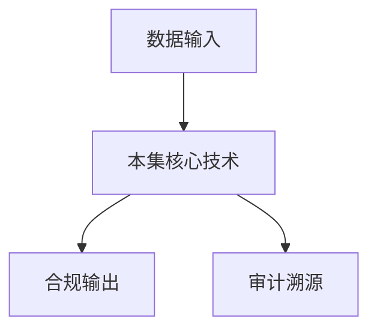

# P45 可信数据空间-行业级可信数据空间实践：隐语在汽车流通领域的深度赋能

← [[BV1ser5BDESU-总览]] | ← [[P44-隐语在新能源车险联合定价中的实践]] | 下一篇 → [[P46-密态计算技术在车险行业的应用及前景]]

## 视频信息

| 项目 | 内容 |
|------|------|
| 分集 | 可信数据空间-行业级可信数据空间实践：隐语在汽车流通领域的深度赋能 |
| 模块 | 行业实践案例 |
| 时长 | 23 分 27 秒 |
| 链接 | [B 站 P45](https://www.bilibili.com/video/BV1ser5BDESU?p=45) |
| 官方文档 | [SecretFlow 文档](https://www.secretflow.org.cn/zh-CN/docs) |
| 内容来源 | 知识点增强（数据要素流通技术体系，非逐字转写） |

## 核心要点

1. **本 P 主题**：可信数据空间-行业级可信数据空间实践：隐语在汽车流通领域的深度赋能
2. **模块定位**：行业实践案例
3. **考试/实践侧重**：汽车行业可信数据空间、流通赋能
4. **笔记层级**：教程级（约 3042 字），含速览、图解、场景 Walkthrough、自测题
5. **学习建议**：先通读「3 分钟速览」与「图解」，再读「详细讲解」；动手项见 Checklist

> 以下内容基于数据要素流通与隐私计算技术体系撰写，对应 B 站分 P「可信数据空间-行业级可信数据空间实践：隐语在汽车流通领域的深度赋能」。**非 UP 逐字转写**；不看视频也可建立框架，看视频可对照「与视频对照表」深化。

## 本节在系列中的位置

**模块**：行业实践案例 · 系列第 **P45/47** 集。

**建议前置**：[[隐语在新能源车险联合定价中的实践]]——建立本集所需背景。

**建议后续**：[[密态计算技术在车险行业的应用及前景]]——在本集能力之上继续深入。

依赖关系：政策(P01–P06) → 可信空间(P07–P08,P18) → 密态/隐私技术(P09–P24) → SecretFlow 工程(P25–P32) → 基础设施与案例(P33–P47)。

## 3 分钟速览

**可信数据空间-行业级可信数据空间实践：隐语在汽车流通领域的深度赋能** 是数据要素流通体系中的关键一课。读完本节你应能回答：① 核心概念定义；② 在「供得出—流得动—用得好—保安全」链条中的位置；③ 与隐私计算技术栈的衔接。考试/面试侧重：**汽车行业可信数据空间、流通赋能**。

## 零基础导读

本节「可信数据空间-行业级可信数据空间实践：隐语在汽车流通领域的深度赋能」属于 **行业实践案例**。即便未看视频，也应先建立**制度—技术—场景**三层视角：政策类章节回答「为什么允许流」；技术类章节回答「如何安全地算」；案例类章节回答「真实行业怎么落地」。

第一遍阅读请盯住三个问题：本集**解决什么痛点**？**关键参与方**是谁？**交付物或能力边界**是什么？第二遍阅读时，把术语表抄到 Obsidian 双链笔记，与前后分 P 交叉引用。

## 详细讲解

### 1. 案例背景

**汽车行业**供应链长、数据分散（主机厂、经销商、零部件、保险、二手车）。行业级**可信数据空间**整合流通，隐语提供隐私计算底座。

### 2. 空间参与方

主机厂、经销商集团、保险公司、金融机构、监管部门（只读审计）

### 3. 赋能场景

| 场景 | 能力 |
|------|------|
| 二手车估值 | 维修+理赔联邦查询 |
| 供应链协同 | 库存 SCQL 统计 |
| 联合营销 | PSI 客户交集 |
| 质量追溯 | 区块链血缘 + 密态分析 |

### 4. 隐语角色

- 连接器对接 Kuscia/SecretFlow
- SecretPad 降低业务方使用门槛
- 密态计算保护竞争敏感数据（销量、成本）

### 5. 行业价值

打破数据孤岛而不牺牲商业机密；建立行业数据要素定价参考；符合汽车数据出境与安全管理办法。

### 6. 考试/实践要点

- 列举汽车流通领域三个数据协作场景
- 说明行业级空间与单企业空间的差异
- 画主机厂为中心的连接器拓扑

### 7. 碳足迹

汽车全生命周期数据（生产、使用、报废）纳入空间，支撑 ESG 披露。

### 8. 反垄断

空间运营方中立，禁止排他协议；开放 API 防锁定。

### 9. V2X 数据

车路协同数据接入空间后，可与保险、地图商联合；实时性要求高，边缘连接器+TEE 推理。

### 10. 学习与实践检查单

- [ ] 对照本 P 标题回顾 B 站视频章节要点
- [ ] 在 [SecretFlow 文档](https://www.secretflow.org.cn/zh-CN/docs) 找到对应模块
- [ ] 能用一句话向同事解释本 P 核心概念
- [ ] 识别一个本行业可落地的应用场景
- [ ] 记录与前后分 P 的技术依赖关系

### 11. 模块知识串联
本讲属于「数据要素流通技术」体系中的重要一环。建议在学习日志中标注：输入依赖（前序知识）、输出能力（学完能做什么）、与隐语组件映射（SecretFlow/Kuscia/SecretPad/TEE）。完成 47 讲后应能独立设计一个「政策合规+连接器+隐私计算+审计存证」的端到端方案，并评估 MPC、TEE、联邦学习的选型依据。

### 案例精读建议

阅读行业案例时采用 **STAR**：Situation（监管与痛点）、Task（业务目标）、Action（技术选型与过程）、Result（指标与合规结论）。将本集案例与您单位场景对比，列出 3 条可借鉴与 3 条不可照搬的理由。

## 图解

## 类比与直觉

行业案例像**菜谱**：同样的隐私计算「厨具」，医疗、金融、车险各做一道菜，重点看食材（数据）与火候（合规）如何配合。

## 例题与场景 Walkthrough

**行业复盘：可信数据空间-行业级可信数据空间实践：隐语在汽车流通领域的深度赋能**

**场景：两家机构联合建模（不共享明文）**

1. **样本对齐**：若双方仅有交集用户有价值，先用 PSI（P21/P28）对齐 ID。
2. **特征拼接**：纵向联邦（P24）下 A 方持标签、B 方持特征，梯度通过安全聚合更新。
3. **训练执行**：在 SecretFlow SPU（P27）上完成密态前向/反向，或 TEE 内明文训练（P11–P17）。
4. **模型发布**：输出评分服务；模型参数经评估后按需出域，训练数据永不出域。
5. **本集关联**：可信数据空间-行业级可信数据空间实践：隐语在汽车流通领域的深度赋能 提供其中 **汽车行业可信数据空间** 能力。

额外关注：行业监管口径（金融银保监会、医疗卫健委）、数据最小必要、个人信息影响评估、模型可解释性与备案要求。

## 常见误区

1. **「学完本集就会用隐语」**：SecretFlow 生态需多集串联（P19–P32），单集只是拼图一块。
2. **「隐私计算等于不上传数据」**：数据仍以密文、份额或授权方式参与计算，网络与算力开销客观存在。
3. **「TEE 绝对安全」**：TEE 依赖硬件与侧信道防护，需远程证明（P17）与补丁策略。
4. **「区块链解决一切确权」**：链适合存证与交易撮合，大规模计算仍在链下隐私计算引擎。

## 与视频对照表

| 视频段落（约） | 预期演示内容 | 笔记对应章节 |
|-------------|------------|------------|
| 开篇 0%–15% | 本集目标、背景、与前后集关系 | 本节位置、3 分钟速览 |
| 前段 15%–40% | 核心概念定义与架构图 | 零基础导读、详细讲解 |
| 中段 40%–70% | 原理展开、对比、政策/代码示例 | 图解、类比、Walkthrough |
| 后段 70%–90% | 案例、问答、易错点 | 常见误区、Checklist |
| 收尾 90%–100% | 总结、延伸资源 | 延伸阅读、自测题 |

> 本集总时长约 **23分27秒**。无官方外挂字幕时，以分 P 标题「可信数据空间-行业级可信数据空间实践：隐语在汽车流通领域的深度赋能」与上表主题对齐视频画面。

## 动手实践 Checklist

- [ ] 复述本集 3 个定义（不看笔记）
- [ ] 根据 Walkthrough 写 200 字场景短文
- [ ] 对照视频确认 1 个架构图/演示
- [ ] 在总览思维导图中标注本集节点
- [ ] 完成自测 Q1/Q5

## 延伸阅读

- [SecretFlow 文档中心](https://www.secretflow.org.cn/zh-CN/docs)
- TC609 可信数据空间相关标准
- 本系列相邻 2 个分 P 笔记

## 自测题

1. **本集核心考点？**  
   **答**：汽车行业可信数据空间、流通赋能。

2. **本集在四原则中的位置？**  
   **答**：用得好+行业落地。

3. **与 SecretFlow 的关系？**  
   **答**：为 SecretFlow 提供密码学/算法基础。

4. **一项落地检查？**  
   **答**：是否有授权、是否最小必要、是否可审计——三者缺一不可。

5. **30 秒口述本集？**  
   **答**：用「输入→处理→输出」各一句话概括（见 Walkthrough）。

## 关键术语

| 术语 | 说明 |
|------|------|
| 数据要素 | 可参与社会化配置、创造价值的数字化资源 |
| 隐私计算 | 数据可用不可见前提下实现协作计算的技术体系 |
| 使用控制 | 约定用途、次数、期限 |
| 连接器 | 参与方接入节点 |

## 与前后分 P 的衔接

- ← **隐语在新能源车险联合定价中的实践**（[[P44-隐语在新能源车险联合定价中的实践]]）
- → **密态计算技术在车险行业的应用及前景**（[[P46-密态计算技术在车险行业的应用及前景]]）

## 逐字转写
> 引擎: whisper | 状态: 已转写 | 格式: 段落化

### [00:01 - 01:01] 尊敬了各位行業同仁,大家好,我
尊敬了各位行業同仁,大家好,我是中期素園的感興兵,在開始今天的分享之前,我想請大家思考一個問題,在一個臨產值近五萬億元關係國際民生的產業裡頭,如果核心的生產要素數據無法自由而安全的流動,，那麼這個行業的數字化和智能化轉型,將面臨怎樣的中華版?，那麼今天我將向各位系統性的分享,我們對於這個問題的深刻思考,這不僅僅是一個技術方案的介紹,，更是一次關於如何重進產業信任,示範數據價值的系統性思考和時間的總結。我希望今天的分享,能為各位在各自的數字化轉型道路上提供一些有意的參考和啟發。

### [01:02 - 02:03] 為了讓我們的思路更加清晰,我的
為了讓我們的思路更加清晰,我的分享將遵循著發現問題、分析問題、解決問題、總結掌握的邏輯主線,分為以下四個部分。一是動詞、喊音的痛點與機遇,我們將用數據說話看清繁榮市場表現下各種深層次的問題。二是揭密可行數據空間的系統建設,詳細拆解我們如何將理念變為可落地和運營的系統。三是聚焦三大核心產品的實現,看營與技術是如何助理產品落地,事實總結和展望未來。首先,讓我們看一下以下幾種數據,一是蜘蛛地位的確認,，2024年汽車流動行業農產值首次超越反地產,成為國民經濟第一蜘蛛產業,。

### [02:03 - 03:01] 這意味著汽車行業已經從過去的製
這意味著汽車行業已經從過去的製造業民族轉變為驅動整個內需消費和現代服務業的核心引擎,，它的健康度直接關係到宏灣經濟的穩定性。二是巨大的體量規模,4.8萬億的總產值,占設定比重為11%,，這背後是無數就業崗位和龐大的產業鏈上下游,5億多的駕駛員數量,，意味著超過三分之一的國人都是潛在的汽車消費者,市場基礎極其深厚。三是動態的增長潛力,汽車銷量從2014年的1845熱萬輛,，到2013年的3000萬輛的預測,以及二手車交易量從2014年的920萬輛增長到2013年的4000萬輛的預測,。

### [03:01 - 04:00] 2020年的出口數量為641萬
2020年的出口數量為641萬輛,說明了中國汽車產業在全球舞台上扮演了越來越重要的角色。然而,這是這樣一個規模巨大的增長快速的行業,其數據化程度,卻於其經濟地位,民眾不適配。要理解數據的困境,必須先理解業務的複雜性。請大家看一下這張圖。一輛車從主機廠生產出來,經歷新車交易,進入使用階段進行維修保養,，帶到二手車的買來,最終走向報廢回收。在這個漫長的過程當中,設計主機廠、吉祥山集團、銀行、保險公司、二手車車山、零部件公園山、維修廠、，來自中端消費者等數十個參與角色。

### [04:01 - 05:04] 理想狀態下,關於這輛車的數據軟
理想狀態下,關於這輛車的數據軟身體,應該伴隨其一生,在各個業務節點無風的流轉,，用於優化服務、一生效率。但現實是,這些數據被無數到數據圍牆切割的枝離破碎,，每個參與者都只擁有數據碎片,無法拼湊出完整的試圖。這就是接下來我們要談的行業重點。這些數據圍牆帶來的問題,我們可以從資源、場景、生態三個維度來進行分析,，一是數據高度碎片化帶來的資源之痛,，數據分散在上百個主機廠、上萬家SES電、幾十萬家獨立的氣修電,，以及保險公司和各級地方政府監管部門手中,不理善是絕對分散的,，各家的數據標準合適,口徑千差萬別,。

### [05:04 - 05:58] 一個測量型號在不同的系統裡頭可
一個測量型號在不同的系統裡頭可能有不同的編碼。數據質量稱之不起,大量依賴人工陸陸,，等在錯誤、缺失和更新時效的問題,，數據在系統間、企業間呈現物理狀態、階段形成的數據孤島。另外的話,數據的所有權、使用權、收益權,，沒有在法律和商業上進行清晰的界定,誰都不敢動、誰都不敢陪。由此導致了核心的業務慘劫的信息形狀不對稱,，在二手車交易產品當中,這裡是種宅區,，泡水車、伺服車難以撕裂,車輛歷史不透明,，不止沒有數據模型,全憑老師傅的驚口欲引,，引眾阻礙了販新消費。

### [05:58 - 06:57] 在汽車金融產品上,銀行想貸款當
在汽車金融產品上,銀行想貸款當無法低成本的認證申請人的收入,，凝固車輛真實價值,保險公司想推出基於駕駛行為的UBI保險,，但拿不到真實的駕駛數據,分控成本高,販新比較困難。在銀銷與決策上,武器廠不知道真實的市場需求,，導致排散計劃失靈,金銷商找不到精準的潛在客戶銀銷費用,，引眾浪費,從而導致整個汽車流通行業的效率低下和串心受阻,，整個行業的運營在很大程度上仍然依賴傳統的經驗和冷海戰術,，數據化工具無處發力,由於缺乏可信的數據流通環境,，化企業的協同串心非常困難。

### [06:57 - 07:55] 未根到底,數據的核心問題可以總
未根到底,數據的核心問題可以總結為3點,有不動,用不好,分不清。面對這些問題,我們意識到,我們必須用系統性思維,，構建一個完整的,並向未來的數據交通輸牛和價值交換網絡。這就是汽車流通行業的本身數據空間,我們的核心理念是四句話,，一是產品輕盈,杜絕技術空轉,一切從業務產品出發,以解決問題,，創造價值為唯一的衡量標準。二是多級節點,採用分不適的架構,不追求把所有數據集中在一處,，而是通過標準化的接口連接國家,區域,企業級等空間節點,，尊重現有的數據格局直線樓線鏈接,。

### [07:55 - 08:55] 三是互聯互通,打破網絡孤島,確
三是互聯互通,打破網絡孤島,確保空間和空間之間,能夠對話和握手。四是共建共享,設計共營機制,這是空間能否持續發展的關鍵,，我們必須確保每一個參與者,無論是數據的提供方,使用方,還是技術方,，都能在生態中找到自己的位置,並獲得合理回報,對中形成數據的價值環流。在系統的建設上,空間分為四個核心城市和一個跨城的體系,，一是在核心的支撐城,我們構建了算力期,，確保高性能,密台計算的這個能力,通過部署專用的安全和監控設備,，為整個空間提供基礎的安全防護。暫時可信管控程,我們實現了五統一的那個支撐服務,。

### [08:55 - 10:01] 一是統一身份,為每個機構,每個
一是統一身份,為每個機構,每個數據產品,，每次訪問建立唯一的和驗證的數據身份,二是統一末路,，這是數據三層的貨價,亂使用者能夠快速地發現電位需要的數據資源。暫時統一憑證,利用虛快鏈技術,對數據的授權,訪問使用等所有關心行為,，進行不可篡改的記錄,執行全流程的數源。四是統一管控,致電變執行統一的訪問控制策略,安全策略和計費策略。五是統一揭露,利用標準化的連接器,降低各個系統揭露空間的技術門檻。三是數據流通程,這裡是營運框架,深度負能的環節。我們在此集成了三種核心的流通範圍。

### [10:01 - 11:11] 一是密探計算,支持林班學習安全
一是密探計算,支持林班學習安全多方的計算,實現數據不出獄,價值可流動。二是密探存儲,數據在存儲時處於加密的狀態,確保技術設施不被攻破,人使數據也不會洩漏。三是可信審計,綜合區塊鏈憑證,對密探計算的過程結果進行審計,確保計算的合規性和真實性,，四是應用串新程,基於下層的能力,我們浮化出注入汽車價量數據串新場景,，新的人汽車面致的交易價格評估等直接為右負能的串新應用,，五是跨層的標準規範與運營體系。這個體系貫穿所有的層次,確保了技術,數據,流程,管理的標準化和運營化。

### [11:12 - 12:24] 技術系統是股價,運營則是亂股價
技術系統是股價,運營則是亂股價展出血肉的輪迴,，我們的目標是成為汽車流通行業的水電煤一樣的運輸管道,亂數據的使用更加的並結可靠。為此,我們確立了三大運營燃者流的洞,通過技術標準、營業器和治理規則,，首先解決數據在物理上和法律上的流通可行性。用得好,通過數據產品化、產品化負能和應用的工具,，大幅降低數據使用的技術和業務門檻,亂數據好用、易用。分得清,主要是通過智能合約、清晰的收益分配模式和爭議解決制度,，確保數據產生的價值都能夠被公平、透明的計量和分配解決誰來做、為何做、如何分的動力問題。

### [12:24 - 13:02] 在生態時間上,我們以中區溯源為
在生態時間上,我們以中區溯源為核心,編織了汽車流通數據一張碗,，這張碗縱向打通從主機產、經銷商、二手車車商到銀行保險公司的產業鏈,，橫向對接北京區域節點,並揭露到全國的數據市場,，整合各地方、各領域的公共數據和社會數據,最終形成體系化的數據生態。

### [13:05 - 14:14] 下面我們見錄第三部分,看空間如
下面我們見錄第三部分,看空間如何在實際業務當中開發結果。首先我們來看一下新車的流通場景。在新車的場景上,主機產普遍面臨的是產銷協同的問題。主機產排產主要依賴歷史數據和宏觀預測,與真實動態的市場需求存在時差。經銷商掌握的消費者拼耗、價格敏感度等數據無法有效的反饋至生產端,導致生產的車不好賣,，不好賣的車沒生產,主機產迫切需要融合經銷商的終端成交價、固醇深度、消費者的配置拼耗、試駕行為等數據,，與自身的產銷計劃、領部間的供應鏈數據相結合,構建了動態的大量預測模型。

### [14:15 - 15:32] 針對這些問題,通過銀域的負能,
針對這些問題,通過銀域的負能,可以實現上下有聯合的智能。首先,我們並不是要求主機產和經銷商交出他們的原始數據,而是利用銀域的銀班學習技術,，讓各方在數據加密的狀態下,在本地進行模型訓練,只交換加密後的T度、權重等參數模型,，最終是在空間內聚合成一個更強大的全局模型,，任何一番的原始數據都無法被其他地方、其他方面所看到。最終是實現從經濟驅動到數據智能,占了一個變化,實現已銷電產、精準已銷,，減少庫存的資金的佔用,加快資金的兜轉。第二個場景是愛手車流通,消費者最擔心是買到問題車,。

### [15:32 - 16:49] 而車商最大的難點是如何證明自己
而車商最大的難點是如何證明自己的車是好車,，整個市場陷入銀門市場的困境,導致列幣驅逐兩幣。各方都需要一份可信化機構的測量答案,，包括出行記錄、維修保養記錄、主機產召回記錄、，第三番檢測機構的檢測數據。我們利用營養的支撐打造了車輛的可信數據身份認證,，我們通過空間向保險公司維修企業、主機產發起數據申請,，在營養的密探房間當中,對於這些分散的數據進行交叉、認證、邏輯計算、生成、歷史報告、，成量理程報告、公立電子監看度報告等。我們計算這輛車是否事故車的結論,，並不是以把原始的出行記錄直接給到了買家,。

### [16:49 - 17:57] 這種方式完美地保護了車主的個人
這種方式完美地保護了車主的個人隱私和保險公司的三一秘密。通過數據和技術負能重建了二手車市場的新能基石,，對於消費者來說,他獲得了購車的定型碗,整個決策更加充分。對於車商來說,有了權威的備俗工具,好車就能賣出一個好價錢。我們的目標是亂購買二手車,像乃新車一樣販新,提供一個信息透明,，由成標準,充滿信任的消費體驗。從我們的實現當中可以看到,揭露到我們數據服務的車商,，整個車輛成交週期平均縮短了40%,客戶的滿意度大幅。第三個場景是支撐汽車消費的金融分工場景,，金融機構在審批個人特代或經銷商庫存紅之時,。

### [17:57 - 19:08] 命令借款人收入核實難,房款能力
命令借款人收入核實難,房款能力評估難,，比亞車輛固執難的三難問題,反統的分控方式成本高,銷率低,覆蓋維度窄。金融機構需要中和稅務,社保數據,重點用水數據,車輛數據,，企業進行數據進行中和的信用評估。通過營運的能力,實現數據不搬家,分控更精準,，獲得用戶明確授權和盈格合規的勤力項。金融機構在空間內發起一個分控計算任務,，通過營運技術空間、協同稅務、電網等多個數據員,，在各方數據都不出獄的情況下完成聯合計算,，直接輸出一個戴潛分顯評估分數,或者是車輛金融控制報告,，供銀行檢測參考,這徹底改變了以往,。

### [19:08 - 20:05] 要麽無法獲取數據,要麽需要原始
要麽無法獲取數據,要麽需要原始數據的高風險的模式。通過該場景的建設,提升了金融效率與普惠性。對於金融機構來說,分控模型更加精準,降低了壞障風險,，整批流程從樹天縮短,多轉到數個小時,，提升了效率,得以服務更多過去因信息不足,，而無法覆蓋的客群,促進了金融普惠。對於消費者和金銷商來講,，獲得了更加快速、更加並節的金融服務體驗。通過以上系統性的實驗,，我們為行業帶來了四個方面的價值,，一是推動行業協同與數值化發展,，從孤軍奮戰到生態供應,，以及數據空間系統性的拆除了數據壁壘,。

### [20:05 - 21:05] 換組機產、金銷商、金融機構、愛
換組機產、金銷商、金融機構、愛手車車商等用戶,，能夠統一協同,，極大提升了整個產業鏈上下游的運營效率,，這是行業從信息化、耐下數據化和智能化的關鍵基礎設施。二是提升消費者的信論與滿意度,，從疑慮重重到放心消費,，通過構成可信的數據環境,，我們將過去被隱藏的不對稱的信息轉化為消費者,，能夠理解和信任的數據報告,，這極大提升了消費體驗,，特別是在二手車領域,，數據透明是激活存量、附近增量的關鍵鑰匙,，三是保護數據安全與隱私,，從簡單共享到價值流動,，我們推動的是一種範式的變革,，不再是貿責風險的原審數據共享,。

### [21:05 - 22:16] 而是基於隱私計算技術的數據價值
而是基於隱私計算技術的數據價值交換,，這位實現數據要素的可用不可見,，可控可計量提供了堅實的技術保障,，從根本上解決了數據安全與利用的矛盾,，這是助力監管機構加強行業監管,，從被動響應到主動治理,，這些數據空間為政府和監管機構,，提供了一個實實真實的行業數據駕駛餐,，讓監管機構更早發現市場問題,，更精準的識別風險,，更有效地打擊不良行為,，從而實現被動式的監管,，到主動式的治理轉變,，維護了公平、健康的行業秩序。各位同仁,，回顧我們今天的分享,，盈餘負能的可信數據空間,，不僅僅是一個技術的升級,，更是一場關於生產關係、

### [22:16 - 23:27] 性能機制和產業協同模式的深刻並
性能機制和產業協同模式的深刻並隔,，我們正在做的是為汽車流通行業大師場，疏通他的數據血管,，做減他的數據神經,，這條路肯定是不會一防分順,，他需要技術上的持續創新,，規則上的不斷突破,，也需要生態、伙伴們的信任。我們中紀數源,，願於全行業的同仁一道,，共同編織這張覆蓋全國,，乃至全球的汽車流通數據一張碗,，盡電不移地推動數據,，同孤島走向環流,，我們相信在不遠的將來,，一個因為數據而更加智能,，可信高效的中國汽車流通新生態,，將全面進程。我的分享到此結束,，再次感謝各位的聆聽,，也期待今後有時間,，與大家做進一步的交流。謝謝觀看!。

## 来源说明

- ✅ B 站官方元数据（`Tools/BV1ser5BDESU-full.json`）
- ✅ 分 P 首帧封面（`Tools/bili-fetch/fetch-bilibili.js`）
- ✅ **教程级增强**：含图解/Mermaid、场景 Walkthrough、自测题（约 3042 字，2026-06-06）
- ⏳ 逐字转写：B 站 API 无外挂字幕轨；可选 Whisper/BiliNote 后续补充

## 关键截图

![[../../06-资源附件/video-notes-images/BV1ser5BDESU-P45-cover.jpg|B站首帧 P45]]
