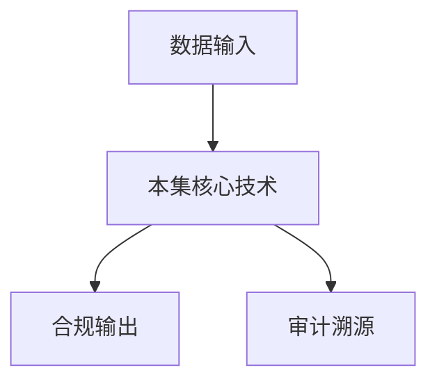

# P46 密态计算技术在车险行业的应用及前景

← [[BV1ser5BDESU-总览]] | ← [[P45-可信数据空间-行业级可信数据空间实践-隐语在汽车流通领域的深度赋能]] | 下一篇 → [[P47-多方联合建模助力普惠信贷]]

## 视频信息

| 项目 | 内容 |
|------|------|
| 分集 | 密态计算技术在车险行业的应用及前景 |
| 模块 | 行业实践案例 |
| 时长 | 23 分 40 秒 |
| 链接 | [B 站 P46](https://www.bilibili.com/video/BV1ser5BDESU?p=46) |
| 官方文档 | [SecretFlow 文档](https://www.secretflow.org.cn/zh-CN/docs) |
| 内容来源 | 知识点增强（数据要素流通技术体系，非逐字转写） |

## 核心要点

1. **本 P 主题**：密态计算技术在车险行业的应用及前景
2. **模块定位**：行业实践案例
3. **考试/实践侧重**：车险密态计算、TEE 推理、行业前景
4. **笔记层级**：教程级（约 3027 字），含速览、图解、场景 Walkthrough、自测题
5. **学习建议**：先通读「3 分钟速览」与「图解」，再读「详细讲解」；动手项见 Checklist

> 以下内容基于数据要素流通与隐私计算技术体系撰写，对应 B 站分 P「密态计算技术在车险行业的应用及前景」。**非 UP 逐字转写**；不看视频也可建立框架，看视频可对照「与视频对照表」深化。

## 本节在系列中的位置

**模块**：行业实践案例 · 系列第 **P46/47** 集。

**建议前置**：[[可信数据空间-行业级可信数据空间实践：隐语在汽车流通领域的深度赋能]]——建立本集所需背景。

**建议后续**：[[多方联合建模助力普惠信贷]]——在本集能力之上继续深入。

依赖关系：政策(P01–P06) → 可信空间(P07–P08,P18) → 密态/隐私技术(P09–P24) → SecretFlow 工程(P25–P32) → 基础设施与案例(P33–P47)。

## 3 分钟速览

**密态计算技术在车险行业的应用及前景** 是数据要素流通体系中的关键一课。读完本节你应能回答：① 核心概念定义；② 在「供得出—流得动—用得好—保安全」链条中的位置；③ 与隐私计算技术栈的衔接。考试/面试侧重：**车险密态计算、TEE 推理、行业前景**。

## 零基础导读

本节「密态计算技术在车险行业的应用及前景」属于 **行业实践案例**。即便未看视频，也应先建立**制度—技术—场景**三层视角：政策类章节回答「为什么允许流」；技术类章节回答「如何安全地算」；案例类章节回答「真实行业怎么落地」。

第一遍阅读请盯住三个问题：本集**解决什么痛点**？**关键参与方**是谁？**交付物或能力边界**是什么？第二遍阅读时，把术语表抄到 Obsidian 双链笔记，与前后分 P 交叉引用。

## 详细讲解

### 1. 案例主题

**密态计算**（TEE/GPU-TEE）在车险行业的应用：保护模型与用户数据，支持在线实时报价与反欺诈，并展望行业前景。

### 2. 应用场景

| 场景 | 密态方案 |
|------|----------|
| 在线报价 | 用户数据在 TEE 内推理，不出端 |
| 模型保护 | 保险公司模型权重仅在 Enclave 解密 |
| 联合反欺诈 | 多方黑名单 MPC 比对 |
| 理赔 OCR | 证件图像 TEE 内识别 |

### 3. 与联邦关系

联邦用于**离线训练**密态计算用于**在线推理**与**高敏实时协作**，组合构成完整链路。

### 4. 前景

- 监管推动数据要素定价，车险是高价值场景
- 车联网数据爆发，实时密态分析需求增长
- GPU-TEE 降低大模型车险客服成本
- 行业标准（连接器、合约）成熟降低接入成本

### 5. 挑战

车主同意管理、跨公司责任界定、TEE 侧信道、legacy 核心系统改造。

### 6. 考试/实践要点

- 对比车险离线联邦与在线 TEE 推理
- 说明 GPU-TEE 对实时报价的意义
- 展望 2026–2028 车险数据要素三个趋势

### 7. 理赔自动化

密态 OCR + 规则引擎缩短理赔周期；欺诈检测 MPC 比对行业黑名单。

### 8. 客户体验

报价 API 毫秒级响应要求 TEE 预热与模型常驻 Enclave。

### 9. 监管沙盒

车险创新产品在监管沙盒内试用密态报价，期满评估消费者保护与竞争影响再推广。

### 10. 学习与实践检查单

- [ ] 对照本 P 标题回顾 B 站视频章节要点
- [ ] 在 [SecretFlow 文档](https://www.secretflow.org.cn/zh-CN/docs) 找到对应模块
- [ ] 能用一句话向同事解释本 P 核心概念
- [ ] 识别一个本行业可落地的应用场景
- [ ] 记录与前后分 P 的技术依赖关系

### 11. 模块知识串联
本讲属于「数据要素流通技术」体系中的重要一环。建议在学习日志中标注：输入依赖（前序知识）、输出能力（学完能做什么）、与隐语组件映射（SecretFlow/Kuscia/SecretPad/TEE）。完成 47 讲后应能独立设计一个「政策合规+连接器+隐私计算+审计存证」的端到端方案，并评估 MPC、TEE、联邦学习的选型依据。

### 案例精读建议

阅读行业案例时采用 **STAR**：Situation（监管与痛点）、Task（业务目标）、Action（技术选型与过程）、Result（指标与合规结论）。将本集案例与您单位场景对比，列出 3 条可借鉴与 3 条不可照搬的理由。

## 图解

## 类比与直觉

行业案例像**菜谱**：同样的隐私计算「厨具」，医疗、金融、车险各做一道菜，重点看食材（数据）与火候（合规）如何配合。

## 例题与场景 Walkthrough

**行业复盘：密态计算技术在车险行业的应用及前景**

**场景：两家机构联合建模（不共享明文）**

1. **样本对齐**：若双方仅有交集用户有价值，先用 PSI（P21/P28）对齐 ID。
2. **特征拼接**：纵向联邦（P24）下 A 方持标签、B 方持特征，梯度通过安全聚合更新。
3. **训练执行**：在 SecretFlow SPU（P27）上完成密态前向/反向，或 TEE 内明文训练（P11–P17）。
4. **模型发布**：输出评分服务；模型参数经评估后按需出域，训练数据永不出域。
5. **本集关联**：密态计算技术在车险行业的应用及前景 提供其中 **车险密态计算** 能力。

额外关注：行业监管口径（金融银保监会、医疗卫健委）、数据最小必要、个人信息影响评估、模型可解释性与备案要求。

## 常见误区

1. **「学完本集就会用隐语」**：SecretFlow 生态需多集串联（P19–P32），单集只是拼图一块。
2. **「隐私计算等于不上传数据」**：数据仍以密文、份额或授权方式参与计算，网络与算力开销客观存在。
3. **「TEE 绝对安全」**：TEE 依赖硬件与侧信道防护，需远程证明（P17）与补丁策略。
4. **「区块链解决一切确权」**：链适合存证与交易撮合，大规模计算仍在链下隐私计算引擎。

## 与视频对照表

| 视频段落（约） | 预期演示内容 | 笔记对应章节 |
|-------------|------------|------------|
| 开篇 0%–15% | 本集目标、背景、与前后集关系 | 本节位置、3 分钟速览 |
| 前段 15%–40% | 核心概念定义与架构图 | 零基础导读、详细讲解 |
| 中段 40%–70% | 原理展开、对比、政策/代码示例 | 图解、类比、Walkthrough |
| 后段 70%–90% | 案例、问答、易错点 | 常见误区、Checklist |
| 收尾 90%–100% | 总结、延伸资源 | 延伸阅读、自测题 |

> 本集总时长约 **23分40秒**。无官方外挂字幕时，以分 P 标题「密态计算技术在车险行业的应用及前景」与上表主题对齐视频画面。

## 动手实践 Checklist

- [ ] 复述本集 3 个定义（不看笔记）
- [ ] 根据 Walkthrough 写 200 字场景短文
- [ ] 对照视频确认 1 个架构图/演示
- [ ] 在总览思维导图中标注本集节点
- [ ] 完成自测 Q1/Q5

## 延伸阅读

- [SecretFlow 文档中心](https://www.secretflow.org.cn/zh-CN/docs)
- TC609 可信数据空间相关标准
- 本系列相邻 2 个分 P 笔记

## 自测题

1. **本集核心考点？**  
   **答**：车险密态计算、TEE 推理、行业前景。

2. **本集在四原则中的位置？**  
   **答**：用得好+行业落地。

3. **与 SecretFlow 的关系？**  
   **答**：为 SecretFlow 提供密码学/算法基础。

4. **一项落地检查？**  
   **答**：是否有授权、是否最小必要、是否可审计——三者缺一不可。

5. **30 秒口述本集？**  
   **答**：用「输入→处理→输出」各一句话概括（见 Walkthrough）。

## 关键术语

| 术语 | 说明 |
|------|------|
| 数据要素 | 可参与社会化配置、创造价值的数字化资源 |
| 隐私计算 | 数据可用不可见前提下实现协作计算的技术体系 |
| 密态计算 | 密文状态下完成计算 |
| 密态胶囊 | 数据+策略+密钥封装单元 |

## 与前后分 P 的衔接

- ← **可信数据空间-行业级可信数据空间实践：隐语在汽车流通领域的深度赋能**（[[P45-可信数据空间-行业级可信数据空间实践-隐语在汽车流通领域的深度赋能]]）
- → **多方联合建模助力普惠信贷**（[[P47-多方联合建模助力普惠信贷]]）

## 逐字转写
> 引擎: whisper | 状态: 已转写 | 格式: 段落化

### [00:00 - 00:58] 各位同仁各位朋友大家好
各位同仁 各位朋友 大家好，非常高興和大家在線上進行主題分享，這個主題是我們團隊受螞蟻祕宣邀請，共同研發的，在此對螞蟻祕宣的邀請表示感謝，近年來祕宣在行業中的應用，越來越廣泛和重要，螞蟻祕宣也為大家提供了，一系列主題課程，我們此次的主題主要撤充的，不是祕宣的基礎理論，是祕宣在行業實踐中的應用，我們重點選擇了車線領域，來與大家共同探討，祕宣在車線行業中的應用及其前景，我們此次的內容主要包括兩個方面，一是檢要介紹我們在車線的發展，二是探討祕宣技術，在車線領域的應用及其前景，為什麼先介紹一下我們的車線發展呢，這也是螞蟻祕宣邀請我們。

### [00:58 - 02:01] 共同分享該主題的原因
共同分享該主題的原因，我們團隊的車線業務，至於國內造成新實力共同成長的，可以說是今天新能源，車線生態的開創者，接下來我簡單介紹一下，我們車線發展的情況，從2018年開始，我們打造的新車線商業模式發展至今，我們和我們的生態夥伴一起，累積實現了百萬台新能源車，幾百億車線寶貝的銷售額，年銷售額最高是超七十億元，我們的工作效果也得到了，同行和客戶行業標更的積極評價，有幾個重要的里程碑，給大家做一下簡單的介紹，2018年我們聯合數家保險中介，共同組成了中介共同體，與某知名主機廠，首創了主機廠品牌車線，推出了以車線為核心的綜合服務包，此後我們持續創新。

### [02:01 - 03:12] 先後與多家主義上合作
先後與多家主義上合作，在行業率先研發了免錄單，智能報價 出單平台，在行業率相開創了，車線非車線，非保險產品的核單支付，實施清分及使名人證功能，在行業率先構建了，車線線上雲可服務平台，這些現在都已成為行業的標竿，2024年3月，我們又率先在某頭部新能源主機廠，上線了部分環節的，拒保雲服務機器人，今年全流程的拒保雲服務機器人，也開始進行了試點，通過多年的沉澱，我們搭建了這個油主機廠，保險公司 服務公司，消經公司 支付公司，科技公司 客服公司，保險中介共同體，共同組成的車線運營體系和生態，滿足了主機廠 經銷商，員工車 社會車 商用車。

### [03:12 - 04:23] 不同場景的車線需求
不同場景的車線需求，總之我們只在通過，科技加運營，構建以品牌保險為核心的，車生態綜合服務，並拖互聯網視為持續驅動，車主用戶的體驗升級，接下來，我們將聚焦此次的重點內容，與大家共同探討，密旋在車線行業中的應用，及其前景，通過剛才我們車線發展的介紹，大家可以看到，我們在構建車線生態服務機器中，觀念了眾多的參與局主體，加之信息化 智能化 平台化的要求，使得數據交互成為關鍵的支撐，因此數據安全 個人信息保護，數據商業價值與商業機密問題，均需審慎對待，我們也可以看到，國家層面出台了，數據安全法 個人信息保護法，網絡數據安全管理條例，以及在行業層面，也出台了。

### [04:23 - 05:38] 銀行保險機構數據安全管理辦法等
銀行保險機構數據安全管理辦法等等，一方面對數據安全和信息保護，提出了更高的要求，另一方面建立了技術合規導向，明確要求金融行業應採用，影視增強技術保護數據的安全，密旋技術，比方說大家數字的聯邦學習，安全多方計算 同胎加密，實行環境等，在保護數據影視的前提下，實現協同計算，既能避免敏感信息洩露，又能融合各方數據優勢，產生多維高價值數據，密旋技術勢在必行在行業，密旋技術勢必在行業中，得到廣泛應用，我個人認為，在保險行業中健康險，車險包括設車的非車險，將是未來應用密旋，作為廣泛和深刻的兩大險種，為什麼這麼說，我們先來看看，車險生態的數據維度。

### [05:38 - 06:54] 一方面行業各大保設
一方面行業各大保設，基本都實現了，基於用戶及車輛，風險平級的自主折扣細數的調整，我們可以目前是，為有限的自主定價，另一方面新能源新技術，包括自價的興起，驅動產品創新，理賠及運營服務手段的提升，而這些都是依托，與數據支撐的技術創新，數據員設計車企，保險公司，以及眾多的第三方服務公司，可以說是主體廣泛，維度眾多，我認為可以將這些數據，封為六大類，第一個就是車輛及用戶數據，包括就是，這裡用戶主要是指，車輛的我認為可以封為六大類，第一大類是車輛及用戶數據，那麼用戶主要指，車輛的實際價值者，第二類我們可以定義為，車輛數據，包括車輛的基本信息，經營屬性車況的。

### [06:54 - 08:09] 第三類是行駛數據
第三類是行駛數據，包括駕駛行為，行駛場景及其環境，里程 回賬尾巴記錄的，第四類是投保數據，第五類是理賠維修數據，第六類是車後生活數據，包括保養 洗車 代步代價，加油 充電 導航等等，那麼這些數據，共同構成了車輛，全生命週期的畫像，用好這些數據，商業價值巨大，社會以深遠，而如何用好，而如何安全有效，並高效地運用，那我覺得，密選技術，將是一把關鍵的鑰匙，如前所需，密選技術，可以根據項目的需求，實現數據可用不可見，為多方數據協作，提供安全體作，其核心價值在於，協作各方通過，數據不動 模型動，數據加密可計算的特徵，既滿足一方對數據的需求，又保護另一方。

### [08:09 - 09:26] 用戶隱私與商業機密
用戶隱私與商業機密，同時可以說是，符合個人信息保護法，數據安全法中，數據最小化，與安全協作的要求，最終實現數據流通不洩露，業務協作不降效，回到我們車線生態，我們可以看到左側，各類數據通過密選技術，進行數據處理，實現多元數據的融合，進而支撐模型的搭建，女實際應用，來滿足右側，各項功能和應用，接下來我們也選取，三個場景，共同探討密選，在車線行業中的應用，首先要選取一個，大家作為熟悉，且曾經非常熱門的話題，就是車線的風險，評分與定價，依主機場，也就是車企和保險公司，為例，那麼保險公司，通過投保，它一般會掌握，用戶的靜態因子，比方說用戶信息也好，車輛信息也好，那麼除機場。

### [09:26 - 10:42] 也就是車企
也就是車企，它往往會擁有動態因子，比方說駕駛行為數據，這裡面包括，即駕駛 即煞車頻率等等，同時也有行駛場景數據，比方說夜間駕駛比例等等，那麼保險公司，其實它是希望結合靜態因子，和動態因子，進行更精準的風險評期，從而來，測定事故，概率進行預測，但動態因子，涉及主機場的用戶隱私，無法直接提供，那麼在密選方面，我們可以，就是選擇兩種密選方案，進行參考，比方說第一種，我們統態加密，主機場加密動態因子數據，保險公司直接使用加密數據，計算風險評級，再結合自身的競選模型，從而生存保費，這是一種方式，那麼也可以用聯邦學習，雙方在本地，用各自的數據，比方說保險公司，它用歷史保費。

### [10:42 - 11:58] 和理賠關聯數據
和理賠關聯數據，主機場這邊是駕駛行為數據，來訓練駕駛行為，和風險印色模型，僅共享模型參數，保險公司最終，基於聯合模型，從而進行定價，那麼對於保險公司來說，它可以獲得精準定價的依據，來細化定價模型，從而實現，基於人和里程的UBI車線，那麼對於車主來說，主機場無需暴露，用戶隱私信息，從而實現，用戶就車主享受，個性化的保費及其服務，那麼對於車企，主機場來說，它也可以提供，類UBI的服務，比方說，提供安全駕駛積分，同時它也可以結合數據優化，結合數據來優化，車輛操作反饋，比方說，為頻繁及煞車的用戶，提供煞車輔助提醒，或者是針對特殊場景，來優化安全配置，比方說。

### [11:58 - 13:07] 為山區道路用戶
為山區道路用戶，來推送，躲破緩降的功能，這是我們密宣，在車線風險評分，與車線定價裏面的應用，這個是大家相對來說比較熟悉的，也是目前，有很多的保險公司，和科技公司都在，為車線的風險評分，與車線定價方面，提供這方面的服務，是大家相對來說，很熟悉的，已經得到了廣泛的應用，那麼第二個，我想跟大家一起來探討的就是，密宣在飛車線，產品窗息裏面的應用，那這裏的飛車線，主要是跟車相關的，一個是設車的，跟車高度相關的，比方說我們鹽包，自駕電池等等類的，第二個是，車相關的，場景化的一些飛車線，比方說是自駕，天氣線，醫療線，包括，開車可能去參加各種運動，包括的運動線，那麼密宣。

### [13:07 - 14:17] 也是在這些產品裏面
也是在這些產品裏面，可以得到廣泛的應用，接下來可能舉兩個例子，一個是，前段時間，大家都比較，市場比較熱的自駕保險，第二個是，我們在實際場景中，曾經碰到的一個，現實需求，就是電池的飛線上損失，這樣一個場景，那麼首先回到我們的，駕保險裏面來，我覺得，密宣在駕乘保險裏面的應用，更多的，都不是說在，就是，保費定價方面的應用，能夠，能夠推動自駕保險，能夠，在前段時間，得以面向市場，能夠做成這樣一個，產品的上市，那麼更重要的是，依賴於，密宣在保險責任，和判定方面的價值，那麼對，就是主機場來說，它掌握了，實施全幹期的原始數據，包括，自動駕駛系統操作日治的，那麼主機場可以把這些數據。

### [14:17 - 15:31] 加密後進上傳
加密後進上傳，保險公司使用加密數據，根據保險責任，和聽判定規則來進行計算，判定它是否屬於，自駕導致的保險責任，那麼這個功能的實現，就為自駕保險的順理推出，起到了積極的作用，所以說，自駕保險，能夠在前段時間，得以在市場上廣泛的應用，其實也是，就是數據技術方面，接下來我們，就密宣在，飛車線產品創新方面的應用，跟大家做一些分享，那麼這裡說的飛車線，主要是跟車，相關的飛車線，第一個是設車類的飛車線，比如說鹽保也好，電池也好 自駕也好，第二個是，我們車的使用場景中的，各種飛車線，包括自駕的預先線，天氣線，比如說開車去進行，各項運動的時候，可能衍生出來的，一些運動保險。

### [15:31 - 16:34] 那麼這裡要選取兩個
那麼這裡要選取兩個，產品跟大家，進行一些分享，一個是前期，也是非常熱門的一個選總，就是自駕保險，那麼自駕保險的推出，我覺得，密宣在它的應用裡面，最重要的都不是在定價方面，通過保險公司，和主機上的數據，在定價方面的應用，更多的是在責任判定方面，那麼主機上來說，它掌握了，知識的全看器的原始數據，包括自動駕駛系統的，操作日子，然後主機場，可以將這些加密數據進行上傳，保險公司使用加密數據，根據保險規則，和責任判定規則，進行計算，來判定是否屬於保險責任，這也為自駕保險，能夠順利的推出，提到了機器的作用，第二個想跟大家分享的產品，是我們在實際過程中，曾經碰到的一個需求。

### [16:34 - 17:49] 就是電池的飛線上損失
就是電池的飛線上損失，補償保險，那麼大家都知道，新的原車電池，很多都在車輛的底部，經常會發生，寡乘和碰撞的事故，當時可能沒有造成，直接的損失，或者是損失比較小，沒有造成電池的，性能的急劇下降，導致意外事故的發生，接下來跟大家，第二個想跟大家分享的，是我們在實際過程中，以前碰到的一個需求，就是電池的飛線上損失，這樣一個場景，大家都知道新的原車電池，往往都在車輛的底部，事實上會發生，寡乘和碰撞的事故，當時可能沒有造成，明顯的電池的受損，和性能的衰減，但是過段時間之後，出現了電池性能的衰減，出現了需要賠償的事故，那麼再去找，保險公司的車線進行理賠的時候，就會發生。

### [17:49 - 18:50] 一個找不到事故的現場
一個找不到事故的現場，第二個責任的判定，也是不很好界定，那麼騎士主機場，它是掌握了電池，實施全感器的原始數據，包括電池性能的數據的，那麼履產可以將這些數據，加密後進商權，保險公司同樣使用加密數據，根據自己的保險責任，和判定規則進行計算，來判定是否屬於保險責任，那麼剛才分享的這兩個方面，都是密宣在，反正就是，都是數據通過密宣，在責任判定方面的應用，其實之前我們也瞭解到，數據的維度很多，然後主機場掌握的數據，也非常豐富，如果能夠將更多的數據應用起來，我們覺得那麼，在製程飛車線產品創新方面，我們可以將這些數據，通過加密集權之後，能夠不僅僅是幫助。

### [18:50 - 19:57] 剛說的責任的判定
剛說的責任的判定，也可以幫助來定價，封控 理賠，等多方面的應用，讓我們的飛車線，能夠開發更多的飛車線，進行創新，提供更多的技術保障和支持，那麼第三個想跟大家介紹的就是，密宣在，正能理賠和減省方面的應用，大家可以看到，在數據方面，其實主機場是掌握了，車輛的故障日誌的，包括比方說，全感器記錄的碰撞時間，過漲發生時序，那麼對保險公司來說，它也掌握了事故的報案信息，因為出現之後，會有報案人員進行報案，那麼這兩方的數據，對於就是數據來說，這兩方的數據來說，其實都是敏感數據，主機場的數據，不僅涉及到技術機密，涉及到用戶隱私，那麼保險公司的數據。

### [19:57 - 21:18] 更多的是涉及到用戶的隱私
更多的是涉及到用戶的隱私，那麼如何把這兩方的數據，結合起來，能夠幫助保險公司，進行責任的判定，那麼我們這裡，也可以表說舉個例子，表說採用，安全多放計權的方式，那麼雙方構建，責任判定協議，主機場按協議，上傳加密的故障發生時間，全感器一場之等等的信息，保險公司上傳，事故報案時間，損失情況，還有它的責任，判定規則等信息，那麼通過，安全多放計算協議，聯合計算故障，與事故的關聯性評分，比方說時間差，是否在於之內，全感器一場，是否匹配碰撞，緊輸出是否，還是不屬於保險責任的，最終結果，那麼這樣從而提升，你陪和省的效率，它不需人工來進行合驗，同時保護雙方的數據機密。

### [21:18 - 22:38] 同理我們也可以用在
同理我們也可以用在，保險反欺詐方面，識別虛假報案與騙保，也可以通過，密宣技術融合，同理，我們也可以用在，保險欺詐方面，來識別虛假報案與騙配，通過密宣技術，融合主機場與保險公司的數據，經模型集權來進行分析和判斷，這些都可以為我們保險公司，在理陪和檢測方面進行，起到很好的作用，那麼總結上述應用分析，採用密宣技術對接，車企與保師能夠在，保護隱私前提下，將駕駛行為，車輛狀況，場景環境等數據，與風險定價，理陪風控等需求深度結合，最終實現，對於保險公司來說，車險定價更精準，理陪更高效，對於車企來說，它可以用戶服務更個性化，車輛安全設計，更貼合實際需求，對於用戶來說。

### [22:38 - 23:34] 就是車主來說
就是車主來說，獲得公平的保費和更安全的，對於車主來說，對於用戶來說，可以獲得更公平的保費，和安全的駕駛體驗，這些數據協同，將是未來，車險市場化，智能化的核心方向，這些數據協同，將是未來，車險市場化，智能化的核心方向，以上分享是基於，我們自身的實踐，和對行業的人知，希望能為大家帶來啟發，分享中如有不足之處，也請各位包含諒解，再次感謝大家，同時中心感謝，螞蟻彌勸，提供此時分享機會，謝謝大家。

## 来源说明

- ✅ B 站官方元数据（`Tools/BV1ser5BDESU-full.json`）
- ✅ 分 P 首帧封面（`Tools/bili-fetch/fetch-bilibili.js`）
- ✅ **教程级增强**：含图解/Mermaid、场景 Walkthrough、自测题（约 3027 字，2026-06-06）
- ⏳ 逐字转写：B 站 API 无外挂字幕轨；可选 Whisper/BiliNote 后续补充

## 关键截图

![[../../06-资源附件/video-notes-images/BV1ser5BDESU-P46-cover.jpg|B站首帧 P46]]
