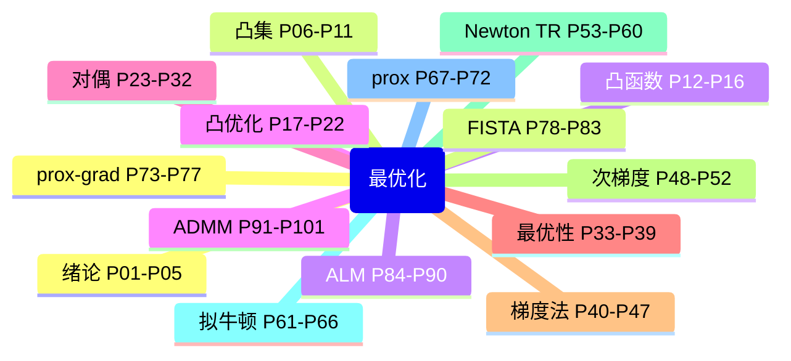
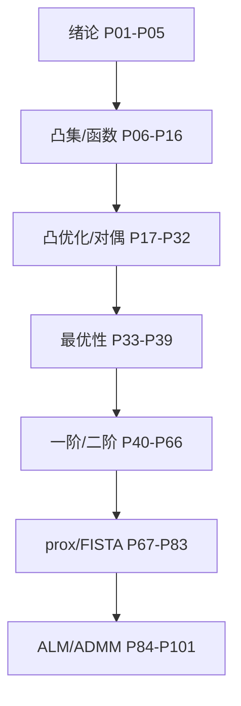

# 【Proof-Trivial】【2023年】最优化：建模、算法与理论 【北京大学 文再文】

> 北京大学 **2023 秋最优化**（讲师 **文再文**），B 站 **Proof-Trivial** 转载，共 **101** 个分 P（约 29h 7m 54s）。
>
> 各分 P 笔记已升级为 **教程级**（约 2500–3500 字/篇，含 Mermaid、Walkthrough、自测题，2026-06-06）。参考教材：文再文《最优化：建模、算法与理论》。

## 视频简介（B 站原文）

本系列课程是2023年秋季文再文老师的最优化课程，参考教材为文老师本人所著的【最优化：建模、算法与理论】

本系列课程来源于华文慕课平台的公开视频，版权归【北京大学】所有，UP主本人不会有任何收益，希望大家在弹幕或评论区多多交流

## 视频数据

| 字段 | 内容 |
|------|------|
| BV 号 | BV1Kc411i7kJ |
| UP 主 | Proof-Trivial |
| 总时长 | 29h 7m 54s（104874 秒） |
| 分 P 数 | 101 |
| 播放量 | 66,687（抓取时） |
| 收藏 | 5,451 |
| 标签 | 人工智能、信赖域法、机器学习、深度学习、线性规划、最优化、强化学习、凸优化、牛顿法、非凸优化 |
| 字幕状态 | 无外挂字幕轨（视频为内嵌配音字幕，API 返回空列表） |
| 合计字数 | ~304320（均篇 ~3013） |

## 思维导图

## 分 P 索引

| 分 P | B 站分集标题 | 时长 | 字数 | 笔记 |
|------|-------------|------|------|------|
| P01 | 课程简介 | 29m18s | ~2970 | [[P01-课程简介]] |
| P02 | 最优化问题概括 | 21m35s | ~3050 | [[P02-最优化问题概括]] |
| P03 | 最优化问题实例 | 26m28s | ~3005 | [[P03-最优化问题实例]] |
| P04 | 最优化基本概念 | 16m10s | ~3041 | [[P04-最优化基本概念]] |
| P05 | 大语言模型辅助工具和数学形式化证明介绍 | 6m12s | ~3086 | [[P05-大语言模型辅助工具和数学形式化证明介绍]] |
| P06 | 范数 | 14m59s | ~3005 | [[P06-范数]] |
| P07 | 凸集的定义 | 6m24s | ~2945 | [[P07-凸集的定义]] |
| P08 | 重要的凸集举例 | 12m31s | ~2979 | [[P08-重要的凸集举例]] |
| P09 | 保凸的运算 | 21m10s | ~2981 | [[P09-保凸的运算]] |
| P10 | 广义不等式与对偶锥 (1) | 15m56s | ~3019 | [[P10-广义不等式与对偶锥]] |
| P11 | 广义不等式与对偶锥 (2) | 17m40s | ~3044 | [[P11-广义不等式与对偶锥]] |
| P12 | 基础知识（梯度、Hessian矩阵等） | 10m39s | ~3084 | [[P12-基础知识梯度、Hessian矩阵等]] |
| P13 | 凸函数的定义与性质（1） | 22m48s | ~3014 | [[P13-凸函数的定义与性质1]] |
| P14 | 凸函数的定义与性质（2） | 31m49s | ~2950 | [[P14-凸函数的定义与性质2]] |
| P15 | 保凸运算 | 31m36s | ~2910 | [[P15-保凸运算]] |
| P16 | 凸函数的推广 | 10m03s | ~2883 | [[P16-凸函数的推广]] |
| P17 | 凸优化问题简介 | 36m26s | ~2922 | [[P17-凸优化问题简介]] |
| P18 | 线性规划 | 28m30s | ~2889 | [[P18-线性规划]] |
| P19 | 二次锥规划 | 31m56s | ~2919 | [[P19-二次锥规划]] |
| P20 | 半定规划（1） | 41m29s | ~2958 | [[P20-半定规划1]] |
| P21 | 半定规划 (2) | 18m48s | ~2956 | [[P21-半定规划]] |
| P22 | 典型优化算法软件与优化模型语言 | 9m55s | ~3034 | [[P22-典型优化算法软件与优化模型语言]] |
| P23 | 线性规划的对偶理论 | 18m05s | ~2939 | [[P23-线性规划的对偶理论]] |
| P24 | 半定规划的对偶理论 | 9m52s | ~2939 | [[P24-半定规划的对偶理论]] |
| P25 | 二次锥规划的对偶理论 | 10m02s | ~2917 | [[P25-二次锥规划的对偶理论]] |
| P26 | 拉格朗日函数 | 27m24s | ~2953 | [[P26-拉格朗日函数]] |
| P27 | 线性规划的对偶 | 19m34s | ~2913 | [[P27-线性规划的对偶]] |
| P28 | 线性规划对偶的实例 | 27m07s | ~2929 | [[P28-线性规划对偶的实例]] |
| P29 | 半定规划的对偶 | 19m45s | ~2916 | [[P29-半定规划的对偶]] |
| P30 | 半定规划对偶的实例 | 23m41s | ~2950 | [[P30-半定规划对偶的实例]] |
| P31 | 凸优化问题的Slater条件 | 21m29s | ~3008 | [[P31-凸优化问题的Slater条件]] |
| P32 | 带约束凸优化问题的KKT条件 | 26m21s | ~3053 | [[P32-带约束凸优化问题的KKT条件]] |
| P33 | 最优化问题解的存在性 | 21m08s | ~3020 | [[P33-最优化问题解的存在性]] |
| P34 | 无约束可微问题的最优性理论 | 4m37s | ~3014 | [[P34-无约束可微问题的最优性理论]] |
| P35 | 切锥与几何最优性条件 | 17m18s | ~2984 | [[P35-切锥与几何最优性条件]] |
| P36 | 线性化可行锥 | 12m56s | ~2967 | [[P36-线性化可行锥]] |
| P37 | Farkas引理与KKT条件 | 15m40s | ~2995 | [[P37-Farkas引理与KKT条件]] |
| P38 | 约束品性 | 8m41s | ~2960 | [[P38-约束品性]] |
| P39 | 一般约束问题的最优性条件 | 12m26s | ~2964 | [[P39-一般约束问题的最优性条件]] |
| P40 | 线搜索与梯度类算法综述 | 22m07s | ~3161 | [[P40-线搜索与梯度类算法综述]] |
| P41 | 线搜索准则 (1) | 20m55s | ~3140 | [[P41-线搜索准则]] |
| P42 | 线搜索准则 (2) | 22m06s | ~3122 | [[P42-线搜索准则]] |
| P43 | 线搜索一般收敛性分析 | 8m26s | ~3144 | [[P43-线搜索一般收敛性分析]] |
| P44 | 梯度下降法 (1) | 32m12s | ~3173 | [[P44-梯度下降法]] |
| P45 | 梯度下降法 (2) | 22m11s | ~3134 | [[P45-梯度下降法]] |
| P46 | 梯度下降法 (3) | 22m00s | ~3143 | [[P46-梯度下降法]] |
| P47 | Barzilar-Borwein方法 | 14m04s | ~3229 | [[P47-Barzilar-Borwein方法]] |
| P48 | 次梯度的定义 | 24m09s | ~3044 | [[P48-次梯度的定义]] |
| P49 | 次梯度的性质 | 26m10s | ~3002 | [[P49-次梯度的性质]] |
| P50 | 次梯度的计算规则 | 27m12s | ~3048 | [[P50-次梯度的计算规则]] |
| P51 | 对偶和最优性条件 | 14m41s | ~3045 | [[P51-对偶和最优性条件]] |
| P52 | 次梯度算法 | 30m45s | ~3042 | [[P52-次梯度算法]] |
| P53 | 经典牛顿法 | 18m30s | ~3076 | [[P53-经典牛顿法]] |
| P54 | 非精确牛顿法 | 11m03s | ~3069 | [[P54-非精确牛顿法]] |
| P55 | 信赖域算法框架 | 16m36s | ~3092 | [[P55-信赖域算法框架]] |
| P56 | 信赖域子问题 (1) | 13m43s | ~3078 | [[P56-信赖域子问题]] |
| P57 | 信赖域子问题 (2) | 19m21s | ~3075 | [[P57-信赖域子问题]] |
| P58 | 截断共轭梯度法 | 14m30s | ~3047 | [[P58-截断共轭梯度法]] |
| P59 | 柯西点 | 7m19s | ~3021 | [[P59-柯西点]] |
| P60 | 全局收敛性 | 8m56s | ~3016 | [[P60-全局收敛性]] |
| P61 | 割线方程与秩一更新公式 | 18m12s | ~3090 | [[P61-割线方程与秩一更新公式]] |
| P62 | BFGS与DFP公式 | 21m16s | ~3136 | [[P62-BFGS与DFP公式]] |
| P63 | 拟牛顿类算法的收敛性和收敛速度 | 5m59s | ~3110 | [[P63-拟牛顿类算法的收敛性和收敛速度]] |
| P64 | 有限内存BFGS方法 (1) | 17m28s | ~3148 | [[P64-有限内存BFGS方法]] |
| P65 | 有限内存BFG1方法 (2) | 14m20s | ~3097 | [[P65-有限内存BFG1方法]] |
| P66 | 非线性最小二乘问题 | 8m56s | ~3083 | [[P66-非线性最小二乘问题]] |
| P67 | 闭函数与共轭函数 | 15m46s | ~2985 | [[P67-闭函数与共轭函数]] |
| P68 | 邻近算子 (1) | 14m36s | ~3025 | [[P68-邻近算子]] |
| P69 | 邻近算子 (2) | 15m28s | ~2968 | [[P69-邻近算子]] |
| P70 | 投影算子 (1) | 12m18s | ~2944 | [[P70-投影算子]] |
| P71 | 投影算子 (2) | 11m58s | ~2932 | [[P71-投影算子]] |
| P72 | 性质与推广 | 9m59s | ~2943 | [[P72-性质与推广]] |
| P73 | 近似点梯度法 | 10m56s | ~3042 | [[P73-近似点梯度法]] |
| P74 | 近似点梯度法的应用 | 4m53s | ~3006 | [[P74-近似点梯度法的应用]] |
| P75 | 近似点梯度法的收敛性分析 | 15m24s | ~3054 | [[P75-近似点梯度法的收敛性分析]] |
| P76 | 非凸函数的近似点梯度法和镜像下降算法 | 14m07s | ~3117 | [[P76-非凸函数的近似点梯度法和镜像下降算法]] |
| P77 | 惯性近似点梯度算法和条件梯度法 | 14m22s | ~3108 | [[P77-惯性近似点梯度算法和条件梯度法]] |
| P78 | Nesterov加速算法简介 | 9m23s | ~3219 | [[P78-Nesterov加速算法简介]] |
| P79 | FISTA算法 | 14m31s | ~3223 | [[P79-FISTA算法]] |
| P80 | FISTA算法收敛性分析 (1) | 11m05s | ~3215 | [[P80-FISTA算法收敛性分析]] |
| P81 | FISTA算法收敛性分析 (2) | 14m23s | ~3209 | [[P81-FISTA算法收敛性分析]] |
| P82 | 第二类Nesterov算法 | 20m46s | ~3178 | [[P82-第二类Nesterov算法]] |
| P83 | 应用举例 | 5m55s | ~3127 | [[P83-应用举例]] |
| P84 | 二次罚函数法 (1) | 16m54s | ~2848 | [[P84-二次罚函数法]] |
| P85 | 二次罚函数法 (2) | 9m32s | ~2830 | [[P85-二次罚函数法]] |
| P86 | 等式约束问题的增广拉格朗日函数法 | 18m54s | ~2949 | [[P86-等式约束问题的增广拉格朗日函数法]] |
| P87 | 增广拉格朗日函数法的收敛性分析 | 13m34s | ~2908 | [[P87-增广拉格朗日函数法的收敛性分析]] |
| P88 | 一般约束问题的增广拉格朗日函数法 | 25m04s | ~2916 | [[P88-一般约束问题的增广拉格朗日函数法]] |
| P89 | 凸优化问题的增广拉格朗日函数法 | 8m05s | ~2899 | [[P89-凸优化问题的增广拉格朗日函数法]] |
| P90 | 应用：基追踪问题 | 20m32s | ~2858 | [[P90-应用-基追踪问题]] |
| P91 | ADMM算法介绍 (1) | 20m39s | ~2931 | [[P91-ADMM算法介绍]] |
| P92 | ADMM最优性条件 | 13m34s | ~2912 | [[P92-ADMM最优性条件]] |
| P93 | ADMM常见变形技巧 | 20m56s | ~2926 | [[P93-ADMM常见变形技巧]] |
| P94 | 应用- LASSO和半定规划问题 | 11m18s | ~2963 | [[P94-应用-LASSO和半定规划问题]] |
| P95 | 应用- 稀疏逆协方差矩阵估计 | 12m25s | ~2974 | [[P95-应用-稀疏逆协方差矩阵估计]] |
| P96 | 应用- 矩阵分离问题 | 12m51s | ~2903 | [[P96-应用-矩阵分离问题]] |
| P97 | 应用- 图像去噪问题 | 18m13s | ~2885 | [[P97-应用-图像去噪问题]] |
| P98 | 分布式ADMM | 20m24s | ~2875 | [[P98-分布式ADMM]] |
| P99 | 应用- 非凸约束问题 | 11m13s | ~2881 | [[P99-应用-非凸约束问题]] |
| P100 | DRS算法 (1) | 18m09s | ~2928 | [[P100-DRS算法]] |
| P101 | DRS算法 (2) | 18m12s | ~3009 | [[P101-DRS算法]] |

## 学习路径

### 按章节分组

1. **绪论（P01–P05）** — 建模、基本概念、LLM 辅助
2. **凸集（P06–P11）** — 范数、凸集、对偶锥
3. **凸函数（P12–P16）** — 梯度/Hessian、凸性判定
4. **凸优化问题（P17–P22）** — LP、SOCP、SDP
5. **对偶理论（P23–P25）** — 弱/强对偶
6. **拉格朗日（P26–P32）** — KKT、Slater
7. **最优性（P33–P39）** — Farkas、约束品性
8. **线搜索与梯度法（P40–P47）** — GD、BB
9. **次梯度法（P48–P52）** — 非光滑优化
10. **牛顿与信赖域（P53–P60）** — 二阶方法
11. **拟牛顿法（P61–P66）** — BFGS、L-BFGS
12. **邻近与投影（P67–P72）** — prox 算子
13. **近似点梯度（P73–P77）** — ISTA、Frank-Wolfe
14. **Nesterov/FISTA（P78–P83）** — 加速方法
15. **增广拉格朗日（P84–P90）** — ALM、基追踪
16. **ADMM/DRS（P91–P101）** — 分裂算法与应用

> 建议：有线性代数与多元微积分基础从 P01 顺序学习；已熟悉 Boyd 凸优化可从 P26 KKT 切入；配合教材习题与 CVXPY 实践。

## 关联资源

- 原始 API 数据：`Tools/BV1Kc411i7kJ-full.json`
- 笔记生成：`Tools/bili-fetch/generate-opt-notes.js`
- 教程级增强：`Tools/bili-fetch/enhance-opt-notes.js`
- 知识点库：`Tools/bili-fetch/content/opt-knowledge.js`（分章 opt-ch*.js）
- 封面目录：[[../../06-资源附件/video-notes-images/]]
- 思维导图：[[思维导图]]

## 工具与数据文件

| 工具 | 路径 | 用途 |
|------|------|------|
| Node 抓取脚本 | `Tools/bili-fetch/fetch-bilibili.js` | 元数据 + 首帧封面 |
| 结构化摘要 | `Tools/BV1Kc411i7kJ-full.json` | 分 P 数据 |
| 内容生成 | `Tools/bili-fetch/build-opt-content.js` | 知识点 + tutorial-detail |
| 教程深化 | `Tools/bili-fetch/content/opt-tutorial-detail.js` | 分页 Walkthrough/自测 |
