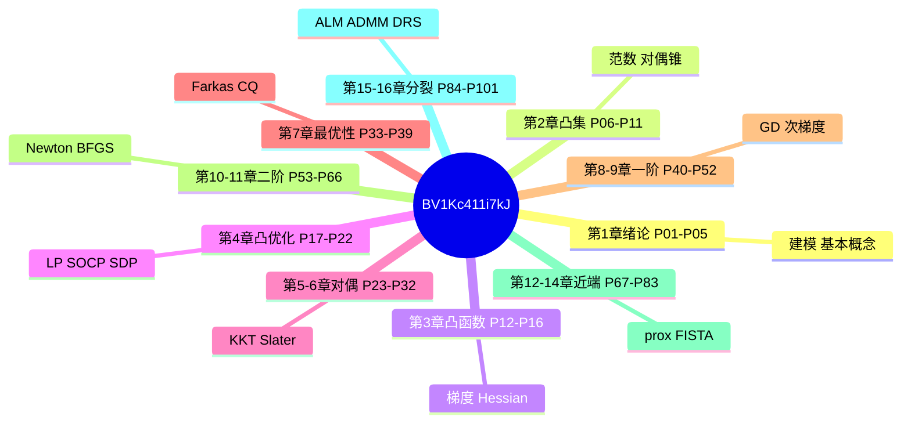

# 最优化建模算法与理论 · 思维导图

← [[BV1Kc411i7kJ-总览]]



## 分 P 详图

```mermaid
mindmap
  root((【Proof-Trivial】【20))
    P01 课程简介 ~2970字
      [[P01-课程简介]]
    P02 最优化问题概括 ~3050字
      [[P02-最优化问题概括]]
    P03 最优化问题实例 ~3005字
      [[P03-最优化问题实例]]
    P04 最优化基本概念 ~3041字
      [[P04-最优化基本概念]]
    P05 大语言模型辅助工具和数学形式 ~3086字
      [[P05-大语言模型辅助工具和数学形式化证明介绍]]
    P06 范数 ~3005字
      [[P06-范数]]
    P07 凸集的定义 ~2945字
      [[P07-凸集的定义]]
    P08 重要的凸集举例 ~2979字
      [[P08-重要的凸集举例]]
    P09 保凸的运算 ~2981字
      [[P09-保凸的运算]]
    P10 广义不等式与对偶锥 (1) ~3019字
      [[P10-广义不等式与对偶锥]]
    P11 广义不等式与对偶锥 (2) ~3044字
      [[P11-广义不等式与对偶锥]]
    P12 基础知识（梯度、Hessia ~3084字
      [[P12-基础知识梯度、Hessian矩阵等]]
    P13 凸函数的定义与性质（1） ~3014字
      [[P13-凸函数的定义与性质1]]
    P14 凸函数的定义与性质（2） ~2950字
      [[P14-凸函数的定义与性质2]]
    P15 保凸运算 ~2910字
      [[P15-保凸运算]]
    P16 凸函数的推广 ~2883字
      [[P16-凸函数的推广]]
    P17 凸优化问题简介 ~2922字
      [[P17-凸优化问题简介]]
    P18 线性规划 ~2889字
      [[P18-线性规划]]
    P19 二次锥规划 ~2919字
      [[P19-二次锥规划]]
    P20 半定规划（1） ~2958字
      [[P20-半定规划1]]
    P21 半定规划 (2) ~2956字
      [[P21-半定规划]]
    P22 典型优化算法软件与优化模型语 ~3034字
      [[P22-典型优化算法软件与优化模型语言]]
    P23 线性规划的对偶理论 ~2939字
      [[P23-线性规划的对偶理论]]
    P24 半定规划的对偶理论 ~2939字
      [[P24-半定规划的对偶理论]]
    P25 二次锥规划的对偶理论 ~2917字
      [[P25-二次锥规划的对偶理论]]
    P26 拉格朗日函数 ~2953字
      [[P26-拉格朗日函数]]
    P27 线性规划的对偶 ~2913字
      [[P27-线性规划的对偶]]
    P28 线性规划对偶的实例 ~2929字
      [[P28-线性规划对偶的实例]]
    P29 半定规划的对偶 ~2916字
      [[P29-半定规划的对偶]]
    P30 半定规划对偶的实例 ~2950字
      [[P30-半定规划对偶的实例]]
    P31 凸优化问题的Slater条件 ~3008字
      [[P31-凸优化问题的Slater条件]]
    P32 带约束凸优化问题的KKT条件 ~3053字
      [[P32-带约束凸优化问题的KKT条件]]
    P33 最优化问题解的存在性 ~3020字
      [[P33-最优化问题解的存在性]]
    P34 无约束可微问题的最优性理论 ~3014字
      [[P34-无约束可微问题的最优性理论]]
    P35 切锥与几何最优性条件 ~2984字
      [[P35-切锥与几何最优性条件]]
    P36 线性化可行锥 ~2967字
      [[P36-线性化可行锥]]
    P37 Farkas引理与KKT条件 ~2995字
      [[P37-Farkas引理与KKT条件]]
    P38 约束品性 ~2960字
      [[P38-约束品性]]
    P39 一般约束问题的最优性条件 ~2964字
      [[P39-一般约束问题的最优性条件]]
    P40 线搜索与梯度类算法综述 ~3161字
      [[P40-线搜索与梯度类算法综述]]
    P41 线搜索准则 (1) ~3140字
      [[P41-线搜索准则]]
    P42 线搜索准则 (2) ~3122字
      [[P42-线搜索准则]]
    P43 线搜索一般收敛性分析 ~3144字
      [[P43-线搜索一般收敛性分析]]
    P44 梯度下降法 (1) ~3173字
      [[P44-梯度下降法]]
    P45 梯度下降法 (2) ~3134字
      [[P45-梯度下降法]]
    P46 梯度下降法 (3) ~3143字
      [[P46-梯度下降法]]
    P47 Barzilar-Borwe ~3229字
      [[P47-Barzilar-Borwein方法]]
    P48 次梯度的定义 ~3044字
      [[P48-次梯度的定义]]
    P49 次梯度的性质 ~3002字
      [[P49-次梯度的性质]]
    P50 次梯度的计算规则 ~3048字
      [[P50-次梯度的计算规则]]
    P51 对偶和最优性条件 ~3045字
      [[P51-对偶和最优性条件]]
    P52 次梯度算法 ~3042字
      [[P52-次梯度算法]]
    P53 经典牛顿法 ~3076字
      [[P53-经典牛顿法]]
    P54 非精确牛顿法 ~3069字
      [[P54-非精确牛顿法]]
    P55 信赖域算法框架 ~3092字
      [[P55-信赖域算法框架]]
    P56 信赖域子问题 (1) ~3078字
      [[P56-信赖域子问题]]
    P57 信赖域子问题 (2) ~3075字
      [[P57-信赖域子问题]]
    P58 截断共轭梯度法 ~3047字
      [[P58-截断共轭梯度法]]
    P59 柯西点 ~3021字
      [[P59-柯西点]]
    P60 全局收敛性 ~3016字
      [[P60-全局收敛性]]
    P61 割线方程与秩一更新公式 ~3090字
      [[P61-割线方程与秩一更新公式]]
    P62 BFGS与DFP公式 ~3136字
      [[P62-BFGS与DFP公式]]
    P63 拟牛顿类算法的收敛性和收敛速 ~3110字
      [[P63-拟牛顿类算法的收敛性和收敛速度]]
    P64 有限内存BFGS方法 (1) ~3148字
      [[P64-有限内存BFGS方法]]
    P65 有限内存BFG1方法 (2) ~3097字
      [[P65-有限内存BFG1方法]]
    P66 非线性最小二乘问题 ~3083字
      [[P66-非线性最小二乘问题]]
    P67 闭函数与共轭函数 ~2985字
      [[P67-闭函数与共轭函数]]
    P68 邻近算子 (1) ~3025字
      [[P68-邻近算子]]
    P69 邻近算子 (2) ~2968字
      [[P69-邻近算子]]
    P70 投影算子 (1) ~2944字
      [[P70-投影算子]]
    P71 投影算子 (2) ~2932字
      [[P71-投影算子]]
    P72 性质与推广 ~2943字
      [[P72-性质与推广]]
    P73 近似点梯度法 ~3042字
      [[P73-近似点梯度法]]
    P74 近似点梯度法的应用 ~3006字
      [[P74-近似点梯度法的应用]]
    P75 近似点梯度法的收敛性分析 ~3054字
      [[P75-近似点梯度法的收敛性分析]]
    P76 非凸函数的近似点梯度法和镜像 ~3117字
      [[P76-非凸函数的近似点梯度法和镜像下降算法]]
    P77 惯性近似点梯度算法和条件梯度 ~3108字
      [[P77-惯性近似点梯度算法和条件梯度法]]
    P78 Nesterov加速算法简介 ~3219字
      [[P78-Nesterov加速算法简介]]
    P79 FISTA算法 ~3223字
      [[P79-FISTA算法]]
    P80 FISTA算法收敛性分析 ( ~3215字
      [[P80-FISTA算法收敛性分析]]
    P81 FISTA算法收敛性分析 ( ~3209字
      [[P81-FISTA算法收敛性分析]]
    P82 第二类Nesterov算法 ~3178字
      [[P82-第二类Nesterov算法]]
    P83 应用举例 ~3127字
      [[P83-应用举例]]
    P84 二次罚函数法 (1) ~2848字
      [[P84-二次罚函数法]]
    P85 二次罚函数法 (2) ~2830字
      [[P85-二次罚函数法]]
    P86 等式约束问题的增广拉格朗日函 ~2949字
      [[P86-等式约束问题的增广拉格朗日函数法]]
    P87 增广拉格朗日函数法的收敛性分 ~2908字
      [[P87-增广拉格朗日函数法的收敛性分析]]
    P88 一般约束问题的增广拉格朗日函 ~2916字
      [[P88-一般约束问题的增广拉格朗日函数法]]
    P89 凸优化问题的增广拉格朗日函数 ~2899字
      [[P89-凸优化问题的增广拉格朗日函数法]]
    P90 应用：基追踪问题 ~2858字
      [[P90-应用-基追踪问题]]
    P91 ADMM算法介绍 (1) ~2931字
      [[P91-ADMM算法介绍]]
    P92 ADMM最优性条件 ~2912字
      [[P92-ADMM最优性条件]]
    P93 ADMM常见变形技巧 ~2926字
      [[P93-ADMM常见变形技巧]]
    P94 应用- LASSO和半定规划 ~2963字
      [[P94-应用-LASSO和半定规划问题]]
    P95 应用- 稀疏逆协方差矩阵估计 ~2974字
      [[P95-应用-稀疏逆协方差矩阵估计]]
    P96 应用- 矩阵分离问题 ~2903字
      [[P96-应用-矩阵分离问题]]
    P97 应用- 图像去噪问题 ~2885字
      [[P97-应用-图像去噪问题]]
    P98 分布式ADMM ~2875字
      [[P98-分布式ADMM]]
    P99 应用- 非凸约束问题 ~2881字
      [[P99-应用-非凸约束问题]]
    P100 DRS算法 (1) ~2928字
      [[P100-DRS算法]]
    P101 DRS算法 (2) ~3009字
      [[P101-DRS算法]]
```

> 各 P 已按**教程级**增强（2026-06-06，合计约 304320 字，均篇 3013 字）。封面见 `06-资源附件/video-notes-images/`。
