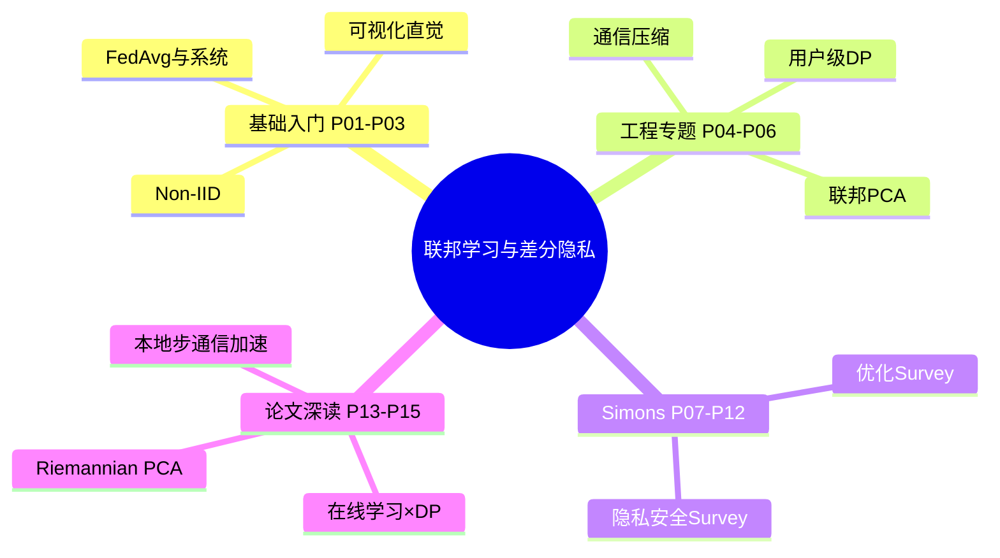
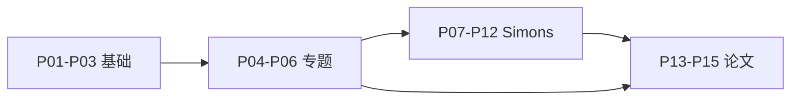

# 【Proof-Trivial】【联邦学习-协作学习】【差分隐私 】系列课程与讲座 (持续更新...)

> Proof-Trivial 持续更新的联邦学习（Federated Learning）、协作学习（Collaborative Learning）、差分隐私（Differential Privacy）课程与讲座合集，共 **15** 个分 P（约 11h 4m 32s）。
>
> 各分 P 笔记已升级为 **教程级**（约 2500–3500 字/篇，含 Mermaid、Walkthrough、自测题，2026-06-06）。B 站 API 无外挂字幕，逐字稿可后续用 Whisper/BiliNote 补充。

## 视频简介（B 站原文）

持续更新联邦学习 (Federated Learning)、协作学习 (Collaborative Learning)、差分隐私 (Differential Privacy)相关课程与前沿讲座

## 视频数据

| 字段 | 内容 |
|------|------|
| BV 号 | BV1q4421A72h |
| UP 主 | Proof-Trivial |
| 总时长 | 11h 4m 32s（39872 秒） |
| 分 P 数 | 15 |
| 播放量 | 2,860（抓取时） |
| 收藏 | 176 |
| 标签 | 人工智能、Federated Learning、联邦学习、隐私计算、分布式机器学习、机器学习、深度学习、强化学习、隐私保护、差分隐私 |
| 字幕状态 | 无外挂字幕轨（视频为内嵌配音字幕，API 返回空列表） |

## 思维导图

## 分 P 索引

| 分 P | B 站分集标题 | 时长 | 字数 | 笔记 |
|------|-------------|------|------|------|
| P01 | Federated Learning简介 | 33分34秒 | ~3705 | [[P01-FederatedLearning简介]] |
| P02 | A visual Introduction to Federated or Collaborative Learning | 9分10秒 | ~2713 | [[P02-AvisualIntroductiontoFederatedorCollaborative]] |
| P03 | Introduction to Federated Learning | 45分47秒 | ~3225 | [[P03-IntroductiontoFederatedLearning]] |
| P04 | 联邦学习中的高效通信优化方法 | 70分23秒 | ~3012 | [[P04-联邦学习中的高效通信优化方法]] |
| P05 | 可扩展且保护隐私的联邦主成分分析 | 13分59秒 | ~2649 | [[P05-可扩展且保护隐私的联邦主成分分析]] |
| P06 | 带有“正式用户级”差分隐私保证的联邦学习 | 30分53秒 | ~2963 | [[P06-带有“正式用户级”差分隐私保证的联邦学习]] |
| P07 | 【Simons Institute】联邦学习&协作学习 (1) | 54分33秒 | ~2549 | [[P07-SimonsInstitute联邦学习&协作学习]] |
| P08 | 【Simons Institute】联邦学习&协作学习 (2) | 48分21秒 | ~2541 | [[P08-SimonsInstitute联邦学习&协作学习]] |
| P09 | 【Simons Institute】联邦学习&协作学习 (3) Survey on Privacy-Security in FL | 22分01秒 | ~2543 | [[P09-SimonsInstitute联邦学习&协作学习3SurveyonPrivacy-Secu]] |
| P10 | 【Simons Institute】联邦学习&协作学习 (4) | 61分11秒 | ~2590 | [[P10-SimonsInstitute联邦学习&协作学习]] |
| P11 | 【Simons Institute】联邦学习&协作学习 (5) Survey on Optimization in FL | 54分38秒 | ~2752 | [[P11-SimonsInstitute联邦学习&协作学习5SurveyonOptimization]] |
| P12 | 【Simons Institute】联邦学习&协作学习 (6) | 62分11秒 | ~2503 | [[P12-SimonsInstitute联邦学习&协作学习]] |
| P13 | 【Umich】在线学习与查分隐私之间的联系 | 79分03秒 | ~2706 | [[P13-Umich在线学习与查分隐私之间的联系]] |
| P14 | 【ICML_22】【Peter Richtarik】联邦学习中本地梯度步骤可证明导致通信加速 | 64分35秒 | ~2777 | [[P14-ICML_22PeterRichtarik联邦学习中本地梯度步骤可证明导致通信加速]] |
| P15 | 【NeurIPS_21】An Online Riemannian PCA for Stochastic CCA | 14分13秒 | ~2724 | [[P15-NeurIPS_21AnOnlineRiemannianPCAforStochasticC]] |

## 学习路径

1. **P01–P03** — 联邦学习动机、FedAvg、Non-IID、客户端采样
2. **P04–P06** — 通信优化、联邦 PCA、用户级差分隐私
3. **P07–P12** — Simons 工作坊：隐私安全与优化综述
4. **P13–P15** — 在线学习×DP、ICML 本地步加速、NeurIPS 黎曼 CCA

## 关联资源

- API 数据：`Tools/BV1q4421A72h-full.json`
- 生成脚本：`Tools/bili-fetch/generate-fl-dp-notes.js`
- 增强脚本：`Tools/bili-fetch/enhance-fl-dp-notes.js`
- 封面：[[../../06-资源附件/video-notes-images/]]
- 思维导图：[[思维导图]]
- 交叉引用：[[BV1ser5BDESU-总览]] 数据要素课 P23–P24

## 待补充

- [ ] 教程级知识点增强（15 篇）
- [ ] Whisper 逐字转写
- [ ] 论文公式板书截图
