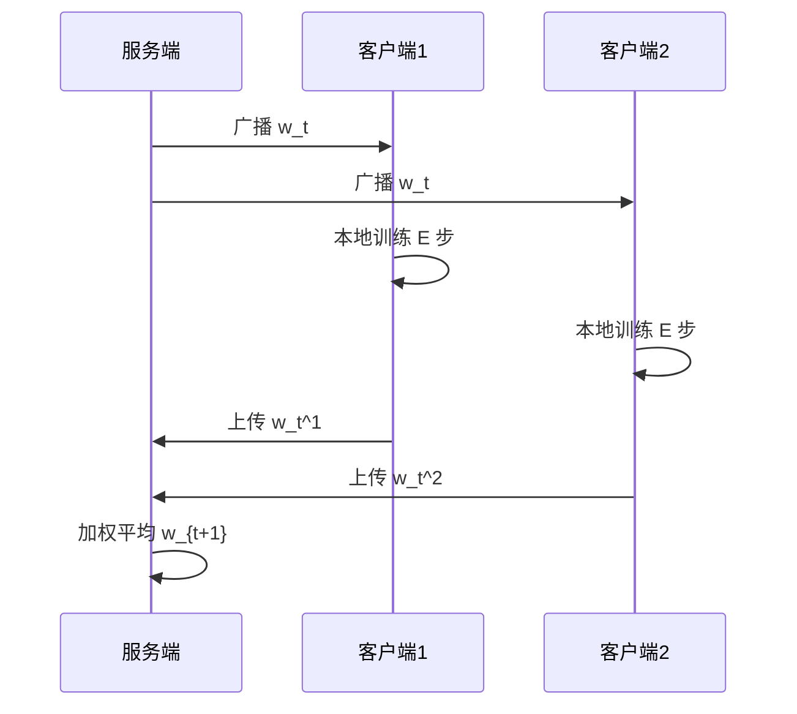

# P01 Federated Learning简介

← [[BV1q4421A72h-总览]] | 下一篇 → [[P02-AvisualIntroductiontoFederatedorCollaborative]]

## 视频信息

| 项目 | 内容 |
|------|------|
| 分集 | Federated Learning简介 |
| 模块 | 联邦学习基础 |
| 时长 | 33 分 34 秒 |
| 链接 | [B 站 P1](https://www.bilibili.com/video/BV1q4421A72h?p=1) |
| 内容来源 | 教程级知识点增强（非 UP 逐字转写） |

## 核心要点

1. **本 P 主题**：Federated Learning简介
2. **模块定位**：联邦学习基础
3. **研读侧重**：FedAvg 流程、Cross-device/silo、Non-IID 入门、威胁模型
4. **笔记层级**：教程级（约 3705 字），含速览、Mermaid、Walkthrough、自测题
5. **学习建议**：先读「3 分钟速览」与「图解」，再深入「详细讲解」

> 以下内容基于联邦学习、差分隐私与协作学习理论体系撰写，对应 B 站分 P「Federated Learning简介」。**非 UP 逐字转写**；不看视频可建立框架，看视频对照「与视频对照表」。

## 本节在系列中的位置

**模块**：联邦学习基础 · 系列第 **P01/15** 集。

**系列起点**：建议先浏览 [[BV1q4421A72h-总览]] 把握 15 集路线图（入门→专题→Simons→论文）。

**建议后续**：[[P02-AvisualIntroductiontoFederatedorCollaborativeLearning]]——用可视化巩固直觉，再读 [[P03-IntroductiontoFederatedLearning]] 深入 FedAvg。

## 3 分钟速览

**Federated Learning 简介**建立 FL 动机与系统图景。读完应能：① 解释「数据不动模型动」；② 区分 cross-device / cross-silo；③ 描述 FedAvg 一轮流程。面试/研读侧重：**FedAvg、Non-IID、客户端采样、威胁模型入门**。

## 零基础导读

本节是 Proof-Trivial 联邦学习系列的**中文入门锚点**。即便未看视频，也应先弄清：为什么集中式训练在隐私场景行不通？联邦学习的三方角色（客户端、服务端、协议）各做什么？

第一遍盯住「问题—架构—算法」；第二遍对照 [[P03-IntroductiontoFederatedLearning]] 补全 FedAvg 数学细节。

## 详细讲解

### 1. 为什么需要联邦学习

传统机器学习假设数据可集中到云端训练。现实中，手机日志、医院病历、银行交易等**高度敏感且分散**在各机构设备上，法律与商业约束禁止明文汇聚。联邦学习（Federated Learning, FL）提出：**把模型带到数据旁**，而非把数据搬到模型旁。

核心承诺：
- **数据不出域**：原始样本保留在客户端或机构本地
- **协作增益**：多方联合训练比单方数据训练效果更好
- **可扩展**：支持成千上万移动端或数十家机构参与

### 2. 联邦学习系统三要素

| 要素 | 角色 | 典型实现 |
|------|------|----------|
| 客户端 Client | 本地数据、本地训练、上传更新 | 手机 App、医院节点 |
| 服务端 Server / Aggregator | 下发全局模型、聚合更新 | 云协调器 |
| 通信协议 | 轮次调度、压缩、安全 | gRPC、MQTT、安全聚合 |

一轮典型流程（以 FedAvg 为例）：
1. 服务端广播当前全局模型 $w_t$
2. 采样客户端集合 $S_t$，各自本地训练 $E$ 个 epoch 得 $w_t^k$
3. 服务端加权平均：$w_{t+1} = \sum_{k \in S_t} \frac{n_k}{n} w_t^k$
4. 重复直至收敛

### 3. Cross-Device vs Cross-Silo

| 维度 | Cross-Device（跨设备） | Cross-Silo（跨机构） |
|------|------------------------|----------------------|
| 参与方 | 海量手机/IoT | 少数企业/医院/银行 |
| 数据量/方 | 小、异构极强 | 相对大、异构中等 |
| 在线性 | 间歇在线、掉线频繁 | 相对稳定 |
| 典型挑战 | 通信带宽、掉线、Non-IID | 合规、对齐、安全聚合 |
| 代表算法 | FedAvg、FedProx | 纵向/横向联邦、安全聚合 |

### 4. 与「协作学习」的关系

**协作学习**（Collaborative Learning）是更宽泛术语：多方协作提升模型，不一定严格遵守联邦范式。联邦学习强调**去中心化数据驻留**与**周期性聚合**；协作学习可包含 MPC 联合训练、分割学习、知识蒸馏等。本系列 P02 用可视化区分二者边界。

### 5. 主要威胁模型（入门）

| 攻击 | 说明 | 缓解思路 |
|------|------|----------|
| 梯度反演 | 从梯度恢复样本 | 安全聚合、DP、压缩 |
| 成员推断 | 判断某样本是否参与训练 | DP、输出扰动 |
| 模型窃取 | 通过查询复制模型 | 访问控制、水印 |
| 恶意客户端 | 投毒更新 | 鲁棒聚合、异常检测 |

### 6. 工程落地检查清单

- 明确是 cross-device 还是 cross-silo，决定通信与采样策略
- 定义参与方数据权属与退出机制
- 评估 Non-IID 程度（标签分布、特征分布）
- 选择聚合算法（FedAvg / FedProx / SCAFFOLD 等）
- 规划隐私层：安全聚合、差分隐私、TEE（见 P06、P09）

### 7. 本集学习要点

- 口述联邦学习「数据不动、模型动」
- 画出 FedAvg 一轮时序图
- 区分联邦学习与集中式训练、单纯 MPC 联合计算的差异

### FedAvg 伪代码速查

```
for t = 0..T-1:
  S_t = sample_clients(K, C)
  for k in S_t parallel:
    w_t^k = ClientUpdate(w_t, D_k, E, eta)
  w_{t+1} = sum_k (n_k/sum n_j) * w_t^k
```

### 与数据要素课程衔接

若已学 [[P24-联邦学习FL]]（数据要素技术），本系列从**算法与理论**侧加深；数据要素课偏**产业合规与 SecretFlow 工程**。

## 图解



## 类比与直觉

联邦学习像**多国联合研制疫苗**：各国（客户端）不共享本国患者原始病历（数据），只按统一配方（全局模型）在本地试验，把脱敏试验结果（梯度/权重）汇总到世卫组织（服务端）调整配方。

## 例题与场景 Walkthrough

**场景：10 家银行联合反欺诈（cross-silo）**

1. **权属**：各行交易数据不出行，法务签联邦协议。
2. **初始化**：总行托管初始逻辑回归模型 $w_0$。
3. **采样**：每轮随机选 5 行参与（$C=0.5$）。
4. **本地训练**：各行用本地欺诈样本跑 3 epoch SGD。
5. **聚合**：按样本数加权平均得 $w_{t+1}$。
6. **评估**：在各方 hold-out 集测 AUC，未达标则调 $E$ 或加 FedProx。
7. **隐私层**：后续 P06 叠用户级 DP，P09 查攻击面。

## 常见误区

1. **「联邦等于数据绝对安全」**：梯度仍可泄露，需 SecAgg/DP。
2. **「FedAvg 万能」**：强 Non-IID 常需 FedProx/个性化。
3. **「客户端等于用户」**：一机构多用户时需厘清用户级 DP 边界。
4. **「只做 FL 不做合规」**：授权、审计、退出机制缺一不可。

## 与视频对照表

| 视频段落（约） | 预期演示内容 | 笔记对应章节 |
|-------------|------------|------------|
| 开篇 0%–15% | 本集目标、背景、与前后集关系 | 本节位置、3 分钟速览 |
| 前段 15%–40% | 核心概念定义与架构图 | 零基础导读、详细讲解 |
| 中段 40%–70% | 原理展开、对比、政策/代码示例 | 图解、类比、Walkthrough |
| 后段 70%–90% | 案例、问答、易错点 | 常见误区、Checklist |
| 收尾 90%–100% | 总结、延伸资源 | 延伸阅读、自测题 |

> 本集总时长约 **33分34秒**。无官方外挂字幕时，以分 P 标题「Federated Learning简介」与上表主题对齐视频画面。

## 动手实践 Checklist

- [ ] 手绘 FedAvg 时序图（广播→本地训练→聚合）
- [ ] 用 200 字解释 cross-silo 场景
- [ ] 查阅 Flower / FedML 文档中的 FedAvg 示例
- [ ] 完成自测 Q1–Q3 并口述
- [ ] 在总览标注本集节点

## 延伸阅读

- McMahan et al., *Communication-Efficient Learning of Deep Networks from Decentralized Data* (AISTATS 2017)
- Kairouz et al., *Advances and Open Problems in Federated Learning* (2021)
- [[P03-IntroductiontoFederatedLearning]] · [[P09-【SimonsInstitute】联邦学习&协作学习3SurveyonPrivacy-SecurityinFL]]

## 自测题

1. **FedAvg 聚合公式？**  
   **答**：$w_{t+1}=\sum_k (n_k/\sum n_j) w_t^k$，加权平均本地模型。

2. **cross-device 与 cross-silo 各举一例？**  
   **答**：手机键盘预测 vs 银行间联合建模。

3. **Non-IID 为何伤害收敛？**  
   **答**：本地最优方向不一致，平均后偏离全局最优。

4. **一轮通信传什么？**  
   **答**：下行全局模型，上行本地更新（非原始数据）。

5. **下一步读哪集？**  
   **答**：P02 可视化或 P03 FedAvg 详解。

## 关键术语

| 术语 | 说明 |
|------|------|
| 联邦学习 FL | 数据不出本地，协作训练全局模型 |
| 差分隐私 DP | 单条记录变化对输出分布影响有界 |
| FedAvg | 本地训练+加权平均聚合 |
| Non-IID | 各方数据分布不一致 |

## 与前后分 P 的衔接

- ← 系列起点，见 [[BV1q4421A72h-总览]]
- → **A visual Introduction to Federated or Collaborative Learning**（[[P02-AvisualIntroductiontoFederatedorCollaborative]]）

## 逐字转写

> 状态：待转写。运行 `Tools/transcribe/transcribe.ps1 -Bvid BV1q4421A72h -Part 1` 补充。

## 来源说明

- ✅ B 站官方元数据（`Tools/BV1q4421A72h-full.json`）
- ✅ 分 P 首帧封面（`Tools/bili-fetch/fetch-bilibili.js`）
- ✅ **教程级增强**：含 Mermaid、Walkthrough、自测题（约 3705 字，2026-06-06）
- ⏳ 逐字转写：B 站 API 无外挂字幕轨；可选 Whisper/BiliNote 后续补充

## 关键截图

![[../../06-资源附件/video-notes-images/BV1q4421A72h-P01-cover.jpg|B站首帧 P01]]
