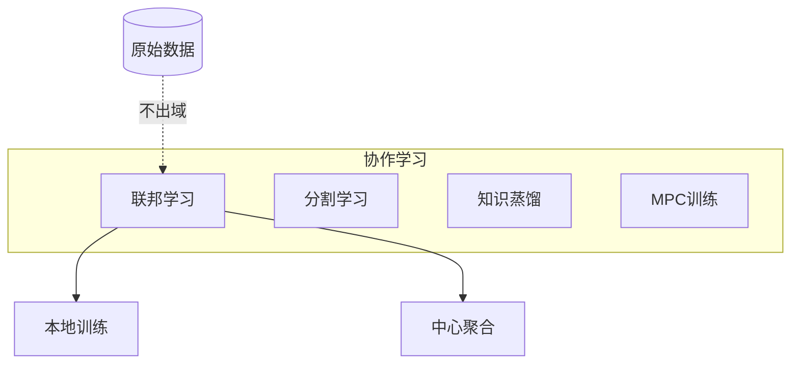

# P02 A visual Introduction to Federated or Collaborative Learning

← [[BV1q4421A72h-总览]] | ← [[P01-FederatedLearning简介]] | 下一篇 → [[P03-IntroductiontoFederatedLearning]]

## 视频信息

| 项目 | 内容 |
|------|------|
| 分集 | A visual Introduction to Federated or Collaborative Learning |
| 模块 | 联邦学习基础 |
| 时长 | 9 分 10 秒 |
| 链接 | [B 站 P2](https://www.bilibili.com/video/BV1q4421A72h?p=2) |
| 内容来源 | 教程级知识点增强（非 UP 逐字转写） |

## 核心要点

1. **本 P 主题**：A visual Introduction to Federated or Collaborative Learning
2. **模块定位**：联邦学习基础
3. **研读侧重**：协作学习 vs 联邦学习、数据驻留直觉、通信内容对比
4. **笔记层级**：教程级（约 2713 字），含速览、Mermaid、Walkthrough、自测题
5. **学习建议**：先读「3 分钟速览」与「图解」，再深入「详细讲解」

> 以下内容基于联邦学习、差分隐私与协作学习理论体系撰写，对应 B 站分 P「A visual Introduction to Federated or Collaborative Learning」。**非 UP 逐字转写**；不看视频可建立框架，看视频对照「与视频对照表」。

## 本节在系列中的位置

**模块**：联邦学习基础 · **P02/15**。

**建议前置**：[[P01-FederatedLearning简介]]。

**建议后续**：[[P03-IntroductiontoFederatedLearning]] 或跳至 [[P04-联邦学习中的高效通信优化方法]]（若已熟悉可视化）。

## 3 分钟速览

本集用**动画/示意图**建立协作学习与联邦学习的空间直觉。重点：**协作学习 ⊃ 联邦学习**、上传的是模型更新、Non-IID 的几何直觉。

## 零基础导读

适合**零基础或视觉学习者**。先建立「岛屿-图纸」心智模型，再进入 P03 公式。可 1.5× 速浏览动画，暂停在「数据不离开设备」画面截图到 Obsidian。

## 详细讲解

### 1. 可视化学习的目标

本集通过动画与示意图建立**空间直觉**：多方数据孤岛如何经「模型参数/梯度」桥梁连接，而不开桥运送原始数据。适合零基础在进 P03 深度课之前建立心智模型。

### 2. 协作学习 vs 联邦学习（概念图）

```
协作学习（广）
├── 联邦学习：本地训练 + 中心聚合
├── 分割学习：模型切分，中间激活值交换
├── 知识蒸馏：教师-学生跨域传递软标签
└── 安全多方训练：MPC 下联合前向/反向
```

**联邦学习**可视为协作学习中**最工程化、最普及**的一支：有清晰 Server-Client 轮次、有 FedAvg 等标准算法族。

### 3. 数据驻留的可视化叙事

想象三座岛屿（医院 A、银行 B、电商 C），各自有宝藏（数据）但禁止离岛：
- **错误做法**：把宝藏运到大陆仓库（集中式）→ 违规
- **联邦做法**：大陆发图纸（全局模型），各岛按本地宝藏打磨零件（本地训练），只送回零件规格（权重更新），大陆组装新图纸

### 4. 通信内容对比

| 方案 | 上传内容 | 带宽 | 隐私 |
|------|----------|------|------|
| 原始数据 | 样本明文 | 极大 | 差 |
| 梯度/权重 | 模型更新 | 中（可压缩） | 中（可被攻击） |
| 安全聚合份额 | 加密梯度 | 中+开销 | 较好 |
| DP 加噪梯度 | 裁剪+噪声 | 中 | 形式化保证 |

### 5. Non-IID 直觉

若医院 A 全是儿科影像、医院 B 全是骨科影像，各岛「打磨风格」不同（本地最优方向不一致），直接平均图纸会导致**全局模型四不像**。可视化通常用**不同颜色/形状的本地损失曲面**表达，引出后续 FedProx、个性化联邦等算法动机。

### 6. 与后续分 P 的映射

| 可视化主题 | 深化分 P |
|------------|----------|
| 轮次与聚合 | P01、P03、P14 |
| 隐私威胁 | P06、P09 |
| 通信压缩 | P04 |
| 降维/PCA | P05、P15 |
| 形式化保证 | P13 |

### 7. 视频画面与概念映射表

| 常见画面元素 | 对应概念 | 笔记章节 |
|--------------|----------|----------|
| 数据锁在设备内 | 数据驻留 | 零基础导读 |
| 箭头指向中心小包 | 模型更新上传 | 详细讲解 §4 |
| 不同颜色损失曲面 | Non-IID | 详细讲解 §5 |
| 多轮循环动画 | 通信轮次 $t$ | P03 预习 |
| 盾牌/锁图标 | 隐私（非形式化） | P06/P09 深化 |

### 8. 本集学习要点

- 能用「岛屿-图纸」类比向非技术人员解释 FL
- 说清协作学习与联邦学习的包含关系
- 识别视频中「上传的是模型更新而非数据」的关键画面
- 填写上表，截图 1 张入 Obsidian 并双链到 P03

### 看视频时建议暂停的 3 个画面

1. **数据流向图**：标注「禁止通道」与「允许通道」。
2. **Non-IID 示意**：抄录各方标签分布差异。
3. **轮次循环**：标 t、t+1 与广播/聚合时刻。

## 图解



## 类比与直觉

协作学习像**接力赛团队**（多种协作方式）；联邦学习是其中**规则明确的一种接力**：每人只跑自己赛道，把棒（模型更新）交给组委会，不共享私人训练日志。

## 例题与场景 Walkthrough

**Walkthrough：向产品经理解释 FL（5 分钟）**

1. 展示 P02 中「数据留本地」动画截图。
2. 对比集中式：箭头从各方指向中心大仓库（打 ❌）。
3. 对比联邦：箭头从中心指向各方，回程只带「小包裹」（更新向量）。
4. 强调带宽：包裹可压缩（P04）。
5. 强调风险：包裹仍可能泄密（P06/P09）。

## 常见误区

1. **「看完动画就会实现」**：还需 P03 系统细节与框架实践。
2. **「协作学习=联邦学习」**：联邦是子集，别在论文/招标书中混用。
3. **「可视化无信息量」**：应把动画节点对应到 FedAvg 步骤命名。

## 与视频对照表

| 视频段落（约） | 预期演示内容 | 笔记对应章节 |
|-------------|------------|------------|
| 开篇 0%–15% | 本集目标、背景、与前后集关系 | 本节位置、3 分钟速览 |
| 前段 15%–40% | 核心概念定义与架构图 | 零基础导读、详细讲解 |
| 中段 40%–70% | 原理展开、对比、政策/代码示例 | 图解、类比、Walkthrough |
| 后段 70%–90% | 案例、问答、易错点 | 常见误区、Checklist |
| 收尾 90%–100% | 总结、延伸资源 | 延伸阅读、自测题 |

> 本集总时长约 **9分10秒**。无官方外挂字幕时，以分 P 标题「A visual Introduction to Federated or Collaborative Learning」与上表主题对齐视频画面。

## 动手实践 Checklist

- [ ] 截图 2 张关键画面入 Obsidian
- [ ] 用岛屿类比向他人解释一遍
- [ ] 列出协作学习 3 种非联邦范式
- [ ] 对照 P01 术语表统一命名
- [ ] 完成自测

## 延伸阅读

- Google PAIR 联邦学习可视化材料
- [[P01-FederatedLearning简介]] · [[P03-IntroductiontoFederatedLearning]]

## 自测题

1. **协作学习与联邦学习关系？**  **答**：联邦是协作学习的子集，强调本地数据+周期性聚合。
2. **视频中数据应留在哪？**  **答**：客户端/机构本地。
3. **上传的是什么？**  **答**：模型参数或梯度更新，非原始样本。
4. **Non-IID 动画通常表达什么？**  **答**：各方损失曲面形状不同，直接平均效果差。
5. **下一集？**  **答**：P03 系统与 FedAvg 数学。

## 关键术语

| 术语 | 说明 |
|------|------|
| 联邦学习 FL | 数据不出本地，协作训练全局模型 |
| 差分隐私 DP | 单条记录变化对输出分布影响有界 |
| 协作学习 | 多方协作改进模型的广义框架 |

## 与前后分 P 的衔接

- ← **Federated Learning简介**（[[P01-FederatedLearning简介]]）
- → **Introduction to Federated Learning**（[[P03-IntroductiontoFederatedLearning]]）

## 逐字转写

> 状态：待转写。运行 `Tools/transcribe/transcribe.ps1 -Bvid BV1q4421A72h -Part 2` 补充。

## 来源说明

- ✅ B 站官方元数据（`Tools/BV1q4421A72h-full.json`）
- ✅ 分 P 首帧封面（`Tools/bili-fetch/fetch-bilibili.js`）
- ✅ **教程级增强**：含 Mermaid、Walkthrough、自测题（约 2713 字，2026-06-06）
- ⏳ 逐字转写：B 站 API 无外挂字幕轨；可选 Whisper/BiliNote 后续补充

## 关键截图

![[../../06-资源附件/video-notes-images/BV1q4421A72h-P02-cover.jpg|B站首帧 P02]]
