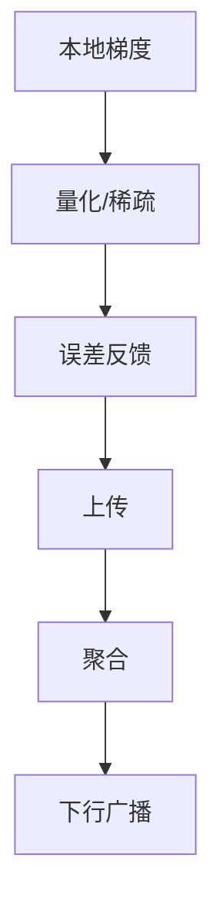

# P04 联邦学习中的高效通信优化方法

← [[BV1q4421A72h-总览]] | ← [[P03-IntroductiontoFederatedLearning]] | 下一篇 → [[P05-可扩展且保护隐私的联邦主成分分析]]

## 视频信息

| 项目 | 内容 |
|------|------|
| 分集 | 联邦学习中的高效通信优化方法 |
| 模块 | 通信与联邦降维 |
| 时长 | 70 分 23 秒 |
| 链接 | [B 站 P4](https://www.bilibili.com/video/BV1q4421A72h?p=4) |
| 内容来源 | 教程级知识点增强（非 UP 逐字转写） |

## 核心要点

1. **本 P 主题**：联邦学习中的高效通信优化方法
2. **模块定位**：通信与联邦降维
3. **研读侧重**：量化/稀疏/误差反馈、FedProx、通信量估算
4. **笔记层级**：教程级（约 3012 字），含速览、Mermaid、Walkthrough、自测题
5. **学习建议**：先读「3 分钟速览」与「图解」，再深入「详细讲解」

> 以下内容基于联邦学习、差分隐私与协作学习理论体系撰写，对应 B 站分 P「联邦学习中的高效通信优化方法」。**非 UP 逐字转写**；不看视频可建立框架，看视频对照「与视频对照表」。

## 本节在系列中的位置

**模块**：通信优化 · **P04/15**（长课 ~70min）。

**前置**：[[P03-IntroductiontoFederatedLearning]]。

**后续**：[[P14-【ICML_22】【PeterRichtarik】联邦学习中本地梯度步骤可证明导致通信加速]]（理论加速）· [[P11-【SimonsInstitute】联邦学习&协作学习5SurveyonOptimizationinFL]]。

## 3 分钟速览

高效通信优化：量化、稀疏、FedProx/SCAFFOLD 减轮次、误差反馈、系统层 delta 更新。考点：**Top-k vs 量化、通信量估算、漂移与压缩权衡**。

## 零基础导读

本集偏**系统工程与算法变体**。先理解「每轮比特数 × 轮次 = 总通信成本」再选技术。与 P14 理论「本地步减轮次」互补：本集侧重「每轮更瘦」。

## 详细讲解

### 1. 通信瓶颈从何而来

联邦学习每轮需广播全局模型（下行）并上传本地更新（上行）。对深度网络，权重向量可达**数十 MB**；百万客户端场景下，上行总和是系统瓶颈。本集聚焦**在精度损失可控前提下减少比特数**。

通信成本粗算：
$$\text{每轮通信量} \approx |S_t| \cdot |w| \cdot \text{bits/参数} + |w| \text{（下行）}$$

优化方向：**压缩表示**、**稀疏更新**、**减少轮次**、**异步/局部步**。

### 2. 梯度/模型量化（Quantization）

| 方法 | 做法 | 压缩比 | 注意 |
|------|------|--------|------|
| 32→8 bit | 线性量化权重/梯度 | ~4× | 需误差反馈 |
| QSGD | 随机量化+无偏估计 | 可调 | 理论保证 |
| 1-bit SGD | 符号+尺度 | 极高 | 收敛分析复杂 |

**误差反馈**（Error Feedback）：本地累积量化误差，下轮补传，避免偏差累积。

### 3. 稀疏化（Sparsification）

只上传 Top-k 绝对值最大的梯度坐标：
- **Random-k**：随机选 k 个，无偏
- **Top-k**：压缩率高，需动量校正
- **Deep Gradient Compression**：动量 + 局部阈值

适用：梯度天然稀疏或冗余大的层（全连接后期）。

### 4. 联邦专用算法变体

**FedProx**：本地目标加近端项 $\frac{\mu}{2}\|w - w_t\|^2$，减少漂移，间接降低达到同等精度所需轮次。

**SCAFFOLD**：维护客户端/服务端控制变量，修正梯度方向，加速收敛→减少通信轮次。

**FedPAQ**：周期平均 + 量化，理论通信复杂度界。

### 5. 通信 vs 计算权衡

| 策略 | 减少轮次？ | 减少每轮比特？ |
|------|------------|----------------|
| 增大本地 epoch $E$ | 是 | 否（每轮仍传全模型） |
| Top-k/量化 | 否 | 是 |
| 知识蒸馏压缩模型 | 两者兼有 | 小模型本身更小 |

P14 证明：适当本地步数可在**保持收敛**同时**减少通信轮次**——与本集工程技巧互补。

### 6. 系统层优化

- **Delta 更新**：只传 $w_t^k - w_t$ 而非全 $w_t^k$
- **重叠通信与计算**：流水线本地训练与上传
- **分层聚合**：边缘聚合后再上云（Hierarchical FL）
- **广播压缩**：服务端下发也用量化模型

### 7. 选型 Walkthrough

**场景**：10 家医院横向联邦，ResNet-50，带宽 100Mbps，目标 90% 精度。

1. 基线 FedAvg：测每轮时延与总轮次 $T_0$
2. 试 Top-k=1% + 动量：测精度-轮次曲线
3. 试 8-bit 量化 + 误差反馈：对比峰值带宽
4. 若 Non-IID 强：加 FedProx，看能否减少 $T_0$
5. 记录「达到目标精度总通信字节数」作为 KPI

### 8. 常见误区

- **只压上行不压下行**：大模型下行同样贵
- **量化不加误差反馈**：长期偏差，精度崩溃
- **稀疏化不设 k 自适应**：训练早期与后期最优 k 不同

### 9. 本集学习要点

- 比较量化与稀疏化适用阶段
- 解释 FedProx 近端项如何减少通信轮次
- 写出通信量估算公式并代入一个 CNN 参数量

### 压缩技术选型表

| 带宽极紧 | 精度优先 | 推荐组合 |
|----------|----------|----------|
| Top-k 1% | FP16 全梯度 | 先判瓶颈在轮次还是比特 |
| 1-bit + EF | 无压缩 | 用验证集 A/B |
| 大 $E$ 少轮次 | 小 $E$ 强压缩 | 见 P14 最优 $\tau$ |

## 图解

## 类比与直觉

通信优化像**快递打包**：量化是换更小包装盒，Top-k 只寄最重要的几件，FedProx 是减少寄件次数——三者可叠加，但塞太满（过度压缩）会摔坏（精度掉）。

## 例题与场景 Walkthrough

**ResNet-50 联邦通信估算**

参数量 ~25M × 4B = 100MB/轮/客户端（FP32）。10 客户端全参与 → 上行 ~1GB/轮。8-bit 量化 → ~250MB；Top-1% → ~2.5MB（需动量校正）。记录达到目标精度总 GB。

## 常见误区

1. **只压缩不上误差反馈**：长期偏差累积。
2. **忽视下行**：服务端广播同样大。
3. **压缩与 DP 噪声独立**：大噪声+强压缩可能训练失败，需联合调参。

## 与视频对照表

| 视频段落（约） | 预期演示内容 | 笔记对应章节 |
|-------------|------------|------------|
| 开篇 0%–15% | 本集目标、背景、与前后集关系 | 本节位置、3 分钟速览 |
| 前段 15%–40% | 核心概念定义与架构图 | 零基础导读、详细讲解 |
| 中段 40%–70% | 原理展开、对比、政策/代码示例 | 图解、类比、Walkthrough |
| 后段 70%–90% | 案例、问答、易错点 | 常见误区、Checklist |
| 收尾 90%–100% | 总结、延伸资源 | 延伸阅读、自测题 |

> 本集总时长约 **70分23秒**。无官方外挂字幕时，以分 P 标题「联邦学习中的高效通信优化方法」与上表主题对齐视频画面。

## 动手实践 Checklist

- [ ] 手算一个小 CNN 一轮通信 MB
- [ ] 对比 QSGD 与 Top-k 论文摘要
- [ ] 查 FedML 压缩插件列表
- [ ] 设计纸面 A/B 实验表
- [ ] 复述 FedProx 动机

## 延伸阅读

- Alistarh et al., QSGD
- Lin et al., Deep Gradient Compression
- [[P14-【ICML_22】【PeterRichtarik】联邦学习中本地梯度步骤可证明导致通信加速]]

## 自测题

1. **误差反馈作用？**  **答**：累积量化误差下轮补传，保持无偏。
2. **FedProx 近端项？**  **答**：$\frac{\mu}{2}\|w-w_t\|^2$ 拴住本地更新。
3. **Top-k 风险？**  **答**：偏差需动量/误差反馈校正。
4. **通信量公式？**  **答**：$|S_t|\cdot|w|\cdot$bits + 下行 $|w|$。
5. **与 P14 关系？**  **答**：P04 瘦每轮，P14 减轮次。

## 关键术语

| 术语 | 说明 |
|------|------|
| 联邦学习 FL | 数据不出本地，协作训练全局模型 |
| 差分隐私 DP | 单条记录变化对输出分布影响有界 |
| Top-k 稀疏 | 只传最大 k 个梯度坐标 |
| 误差反馈 | 补偿量化偏差 |

## 与前后分 P 的衔接

- ← **Introduction to Federated Learning**（[[P03-IntroductiontoFederatedLearning]]）
- → **可扩展且保护隐私的联邦主成分分析**（[[P05-可扩展且保护隐私的联邦主成分分析]]）

## 逐字转写

> 状态：待转写。运行 `Tools/transcribe/transcribe.ps1 -Bvid BV1q4421A72h -Part 4` 补充。

## 来源说明

- ✅ B 站官方元数据（`Tools/BV1q4421A72h-full.json`）
- ✅ 分 P 首帧封面（`Tools/bili-fetch/fetch-bilibili.js`）
- ✅ **教程级增强**：含 Mermaid、Walkthrough、自测题（约 3012 字，2026-06-06）
- ⏳ 逐字转写：B 站 API 无外挂字幕轨；可选 Whisper/BiliNote 后续补充

## 关键截图

![[../../06-资源附件/video-notes-images/BV1q4421A72h-P04-cover.jpg|B站首帧 P04]]
