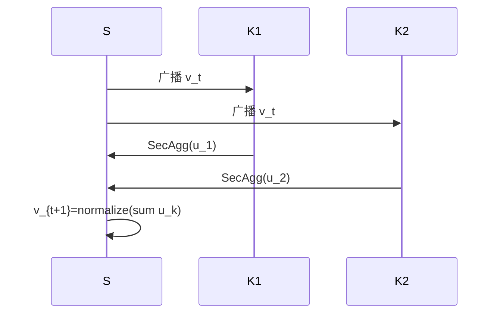

# P05 可扩展且保护隐私的联邦主成分分析

← [[BV1q4421A72h-总览]] | ← [[P04-联邦学习中的高效通信优化方法]] | 下一篇 → [[P06-带有“正式用户级”差分隐私保证的联邦学习]]

## 视频信息

| 项目 | 内容 |
|------|------|
| 分集 | 可扩展且保护隐私的联邦主成分分析 |
| 模块 | 通信与联邦降维 |
| 时长 | 13 分 59 秒 |
| 链接 | [B 站 P5](https://www.bilibili.com/video/BV1q4421A72h?p=5) |
| 内容来源 | 教程级知识点增强（非 UP 逐字转写） |

## 核心要点

1. **本 P 主题**：可扩展且保护隐私的联邦主成分分析
2. **模块定位**：通信与联邦降维
3. **研读侧重**：联邦幂迭代 PCA、SecAgg、降维预处理
4. **笔记层级**：教程级（约 2649 字），含速览、Mermaid、Walkthrough、自测题
5. **学习建议**：先读「3 分钟速览」与「图解」，再深入「详细讲解」

> 以下内容基于联邦学习、差分隐私与协作学习理论体系撰写，对应 B 站分 P「可扩展且保护隐私的联邦主成分分析」。**非 UP 逐字转写**；不看视频可建立框架，看视频对照「与视频对照表」。

## 本节在系列中的位置

**模块**：联邦降维 · **P05/15**。

**前置**：[[P03-IntroductiontoFederatedLearning]]（SecAgg 概念）。

**后续**：[[P15-【NeurIPS_21】AnOnlineRiemannianPCAforStochasticCCA]]（流形进阶）。

## 3 分钟速览

可扩展隐私联邦 PCA：幂迭代、安全聚合、DP 可选。考点：**为何不能拼接协方差、联邦幂迭代一轮、与预处理降维关系**。

## 零基础导读

PCA 是联邦预处理的常见需求。本集连接**线性代数**与**隐私计算**。若线性代数生疏，先复习特征值与幂迭代，再读安全聚合如何保护 $u_k$。

## 详细讲解

### 1. 联邦 PCA 要解决什么问题

主成分分析（PCA）求数据协方差矩阵 top 特征向量，用于降维与特征提取。多方各持数据块，**不能拼接协方差矩阵**（会暴露对方特征统计）。本集讲**可扩展且保护隐私**的联邦 PCA：各方协作求近似主成分，原始样本不离开本地。

### 2. 中心化 PCA 回顾

样本矩阵 $X \in \mathbb{R}^{n \times d}$，协方差 $C = \frac{1}{n} X^\top X$（设已中心化）。PCA 求 $C$ 的前 $m$ 个特征向量。当 $d$ 极大（基因组、嵌入维度）时，显式形成 $C$ 不可行，需**幂迭代**或**随机 SVD**。

### 3. 联邦幂迭代框架

每轮 $t$：
1. 服务端持有单位向量 $v_t \in \mathbb{R}^d$
2. 广播 $v_t$ 到各客户端 $k$
3. 本地计算 $u_k = X_k^\top (X_k v_t)$ 或局部贡献 $X_k^\top X_k v_t$
4. **安全聚合** $u = \sum_k u_k$（不暴露单方 $u_k$）
5. 归一化 $v_{t+1} = u / \|u\|$

重复直至收敛。全程各方只见聚合后的向量，不见他方局部统计。

### 4. 隐私保护层次

| 层次 | 机制 | 保证 |
|------|------|------|
| 架构级 | 数据不出域 | 无原始样本交换 |
| 密码学 | 安全聚合 SecAgg | 服务器不见个体更新 |
| 差分隐私 | 对 $u_k$ 加噪 | $(\varepsilon,\delta)$-DP |
| 安全 MPC | 密态矩阵乘 | 半诚实/恶意模型 |

「保护隐私」在论文中常指**组合**上述机制，而非仅联邦架构。

### 5. 可扩展性技术

- **子空间迭代**：一次求多个主成分，deflation 正交化
- **随机投影**：先降维再 PCA，降低每轮 $d$
- **分层联邦**：机构内先 PCA，再跨机构聚合统计量
- **稀疏/结构化协方差假设**：利用领域先验

### 6. 与联邦学习的联系

PCA 常作为**预处理**：降维后联邦训练逻辑回归/神经网络，减少每轮通信参数规模。P15 的 Riemannian PCA 处理**流形约束**下的主成分，是本集线性 PCA 的进阶。

### 7. 应用场景

| 场景 | 为何联邦 PCA |
|------|--------------|
| 多中心基因表达 | 维度极高、合规禁止合并 |
| 联邦 NLP 嵌入 | 各方词频差异大，需共享低维子空间 |
| 金融风控特征压缩 | 各方特征多，需统一降维基 |

### 8. 本集学习要点

- 描述联邦幂迭代一轮的数据流
- 说明为何需要安全聚合（梯度/统计量可逆推）
- 对比中心化 PCA 与联邦 PCA 的误差来源

### 误差来源

| 来源 | 影响 |
|------|------|
| 有限轮次 | 主成分角度偏差 |
| DP 噪声 | 特征向量扰动 |
| 样本异质 | 全局 PCA 非各方最优 |

## 图解

## 类比与直觉

联邦 PCA 像**多方合力猜主风向**：各方只报告本地风吹统计的合成贡献，不交出原始风速表；风玫瑰图（主成分）由中心归一化合成。

## 例题与场景 Walkthrough

**基因表达联邦降维（纸面）**

1. 三医院各 $n_k \times 20000$ 表达矩阵，禁止合并。
2. 初始化随机 $v_0 \in \mathbb{R}^{20000}$。
3. 每轮：各方算 $u_k=X_k^\top X_k v_t$，SecAgg 得 $u$，更新 $v_{t+1}$。
4. 收敛得 top-10 主成分，降维后做联邦逻辑回归。

## 常见误区

1. **「联邦 PCA 完全等价中心化 PCA」**：通信与噪声带来近似误差。
2. **「不做 SecAgg 也行」**：$u_k$ 可泄露单方统计。
3. **「PCA 与 FL 无关」**：降维直接减少 P04 通信参数规模。

## 与视频对照表

| 视频段落（约） | 预期演示内容 | 笔记对应章节 |
|-------------|------------|------------|
| 开篇 0%–15% | 本集目标、背景、与前后集关系 | 本节位置、3 分钟速览 |
| 前段 15%–40% | 核心概念定义与架构图 | 零基础导读、详细讲解 |
| 中段 40%–70% | 原理展开、对比、政策/代码示例 | 图解、类比、Walkthrough |
| 后段 70%–90% | 案例、问答、易错点 | 常见误区、Checklist |
| 收尾 90%–100% | 总结、延伸资源 | 延伸阅读、自测题 |

> 本集总时长约 **13分59秒**。无官方外挂字幕时，以分 P 标题「可扩展且保护隐私的联邦主成分分析」与上表主题对齐视频画面。

## 动手实践 Checklist

- [ ] 手推一轮幂迭代公式
- [ ] 说明 SecAgg 在 PCA 中的必要性
- [ ] 查一篇联邦 PCA 论文摘要
- [ ] 画数据流图
- [ ] 完成自测

## 延伸阅读

- Grama et al., 分布式 PCA 经典工作
- [[P15-【NeurIPS_21】AnOnlineRiemannianPCAforStochasticCCA]]
- [[P09-【SimonsInstitute】联邦学习&协作学习3SurveyonPrivacy-SecurityinFL]]

## 自测题

1. **幂迭代每轮通信什么？**  **答**：向量 $v_t$ 下行，聚合统计量上行。
2. **SecAgg 保护什么？**  **答**：个体 $u_k$ 不被服务端看见。
3. **deflation 作用？**  **答**：求多个主成分时去掉已解释方向。
4. **与 P15 区别？**  **答**：P05 线性欧氏 PCA，P15 黎曼流形 CCA。
5. **应用？**  **答**：高维特征联邦降维预处理。

## 关键术语

| 术语 | 说明 |
|------|------|
| 联邦学习 FL | 数据不出本地，协作训练全局模型 |
| 差分隐私 DP | 单条记录变化对输出分布影响有界 |
| 幂迭代 | 求主特征向量的迭代法 |
| SecAgg | 安全聚合只见总和 |

## 与前后分 P 的衔接

- ← **联邦学习中的高效通信优化方法**（[[P04-联邦学习中的高效通信优化方法]]）
- → **带有“正式用户级”差分隐私保证的联邦学习**（[[P06-带有“正式用户级”差分隐私保证的联邦学习]]）

## 逐字转写

> 状态：待转写。运行 `Tools/transcribe/transcribe.ps1 -Bvid BV1q4421A72h -Part 5` 补充。

## 来源说明

- ✅ B 站官方元数据（`Tools/BV1q4421A72h-full.json`）
- ✅ 分 P 首帧封面（`Tools/bili-fetch/fetch-bilibili.js`）
- ✅ **教程级增强**：含 Mermaid、Walkthrough、自测题（约 2649 字，2026-06-06）
- ⏳ 逐字转写：B 站 API 无外挂字幕轨；可选 Whisper/BiliNote 后续补充

## 关键截图

![[../../06-资源附件/video-notes-images/BV1q4421A72h-P05-cover.jpg|B站首帧 P05]]
