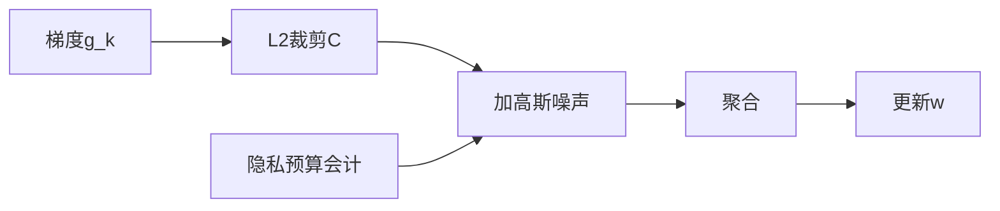

# P06 带有“正式用户级”差分隐私保证的联邦学习

← [[BV1q4421A72h-总览]] | ← [[P05-可扩展且保护隐私的联邦主成分分析]] | 下一篇 → [[P07-SimonsInstitute联邦学习&协作学习]]

## 视频信息

| 项目 | 内容 |
|------|------|
| 分集 | 带有“正式用户级”差分隐私保证的联邦学习 |
| 模块 | 差分隐私联邦 |
| 时长 | 30 分 53 秒 |
| 链接 | [B 站 P6](https://www.bilibili.com/video/BV1q4421A72h?p=6) |
| 内容来源 | 教程级知识点增强（非 UP 逐字转写） |

## 核心要点

1. **本 P 主题**：带有“正式用户级”差分隐私保证的联邦学习
2. **模块定位**：差分隐私联邦
3. **研读侧重**：用户级 $(\varepsilon,\delta)$-DP、DP-SGD、隐私会计、子采样放大
4. **笔记层级**：教程级（约 2963 字），含速览、Mermaid、Walkthrough、自测题
5. **学习建议**：先读「3 分钟速览」与「图解」，再深入「详细讲解」

> 以下内容基于联邦学习、差分隐私与协作学习理论体系撰写，对应 B 站分 P「带有“正式用户级”差分隐私保证的联邦学习」。**非 UP 逐字转写**；不看视频可建立框架，看视频对照「与视频对照表」。

## 本节在系列中的位置

**模块**：差分隐私联邦 · **P06/15**。

**前置**：[[P03-IntroductiontoFederatedLearning]]；建议了解 [[P23-差分隐私基础理论与核心概念]]（数据要素课）。

**后续**：[[P09-【SimonsInstitute】联邦学习&协作学习3SurveyonPrivacy-SecurityinFL]] · [[P13-【Umich】在线学习与查分隐私之间的联系]]。

## 3 分钟速览

正式**用户级** $(\varepsilon,\delta)$-DP 联邦学习：DP-SGD 裁剪加噪、子采样放大、隐私会计。考点：**用户级 vs 样本级、裁剪阈值 $C$、预算组合**。

## 零基础导读

本集是隐私方向的**核心课**。先掌握相邻关系（用户级），再理解为何联邦采样能放大隐私。数学需熟悉高斯机制；证明细节可配合 P13 在线组合理论。

## 详细讲解

### 1. 「正式用户级」差分隐私的含义

差分隐私按**相邻关系**定义：改一条记录，输出分布几乎不变。

| 级别 | 相邻定义 | 典型场景 |
|------|----------|----------|
| 样本级 DP | 增删一条训练样本 | 大型公共数据集 |
| 用户级 DP | 增删某用户**全部**数据 | 手机用户、账户持有人 |
| 事件级 DP | 增删用户一条事件 | 点击流 |

联邦学习中，一个客户端常对应**一个用户或一个机构**。监管与产品承诺往往要求**用户级 DP**：攻击者无法判断某用户是否参与本轮训练。

### 2. $(\varepsilon, \delta)$-DP 回顾

机制 $\mathcal{M}$ 满足：对相邻数据集 $D, D'$，
$$P[\mathcal{M}(D) \in S] \le e^\varepsilon P[\mathcal{M}(D') \in S] + \delta$$

$\varepsilon$ 隐私预算（越小越强），$\delta$ 允许的小概率失败（通常 $\le 1/n^2$）。

### 3. DP-FedAvg / DP-SGD 流程

每轮每客户端 $k$：
1. 本地计算梯度 $g_k$
2. **梯度裁剪**：$\bar{g}_k = g_k / \max(1, \|g_k\|_2 / C)$
3. **加噪**：$\tilde{g}_k = \bar{g}_k + \mathcal{N}(0, \sigma^2 C^2 I)$
4. 上传 $\tilde{g}_k$，服务端平均

隐私分析需计入：**采样客户端**（子采样放大）、**多轮组合**（高级组合定理）、**用户级相邻**（用户全记录）。

### 4. 隐私放大（Privacy Amplification）

| 技术 | 直觉 |
|------|------|
| 子采样 | 每轮只选部分用户→对手不确定谁参与 |
| 洗牌模型 Shuffling | 打乱批量噪声，强化保证 |
| 安全聚合 | 与 DP 正交，防服务器见个体噪声前梯度 |

用户级 DP 下，客户端采样率 $q$ 进入隐私会计，$q$ 越小同等噪声下 $\varepsilon$ 越小。

### 5. 隐私-效用权衡

- 强隐私（$\varepsilon < 1$）→ 噪声大 → 需更多数据/轮次
- 裁剪阈值 $C$ 过小 → 梯度信息损失；过大 → 需更大噪声达同等 DP
- 大模型参数多 → 高斯噪声维数高 → 经典 DP-SGD 挑战（见 P13 维数约减）

### 6. 「正式保证」指什么

- 有**可证明**的 $(\varepsilon,\delta)$ 界，而非启发式加噪
- 明确**相邻关系**（用户级）
- 使用**隐私会计**（RDP、Moments Accountant、PLD）追踪多轮预算
- 可选第三方审计与开源实现（Opacus、TensorFlow Privacy）

### 7. 工程检查清单

- [ ] 定义用户与客户端映射（1:1 还是 1:N）
- [ ] 设定目标 $\varepsilon,\delta$ 与总轮次 $T$
- [ ] 选会计工具跑模拟曲线（噪声-精度）
- [ ] 与法务确认可发布隐私声明文案
- [ ] 评估与非 DP 基线的 AUC/准确率差距

### 8. 本集学习要点

- 区分样本级与用户级 DP
- 写出 DP-SGD 裁剪+加噪两步
- 解释子采样如何放大隐私

### 产品隐私声明检查项

- [ ] 明确用户级 $(\varepsilon,\delta)$
- [ ] 披露总轮次与采样率
- [ ] 预算耗尽后停止训练或切换非 DP 模式策略
- [ ] 第三方审计引用（如有）

## 图解

## 类比与直觉

用户级 DP 像**投票匿名**：不仅隐藏你投了谁，还要让任何人无法判断「你是否来过投票站」——删掉你全部票证，统计结果几乎不变。

## 例题与场景 Walkthrough

**设定 $\varepsilon=3$、$\delta=10^{-5}$、$T=500$ 轮**

1. 选 Opacus/TF Privacy 会计器。
2. 设 $q=0.01$ 客户端采样、噪声 $\sigma$、裁剪 $C$。
3. 模拟训练曲线 vs 无 DP 基线。
4. 若精度掉 >3%，试增大数据或降 $T$ 或 JL 降维。
5. 输出隐私报告给法务。

## 常见误区

1. **每轮 $\varepsilon=1$ 则总预算 1**：错误，需组合会计。
2. **DP 可替代 SecAgg**：DP 防输出泄露，不防好奇服务器见个体梯度。
3. **加噪越大越好**：效用崩溃。

## 与视频对照表

| 视频段落（约） | 预期演示内容 | 笔记对应章节 |
|-------------|------------|------------|
| 开篇 0%–15% | 本集目标、背景、与前后集关系 | 本节位置、3 分钟速览 |
| 前段 15%–40% | 核心概念定义与架构图 | 零基础导读、详细讲解 |
| 中段 40%–70% | 原理展开、对比、政策/代码示例 | 图解、类比、Walkthrough |
| 后段 70%–90% | 案例、问答、易错点 | 常见误区、Checklist |
| 收尾 90%–100% | 总结、延伸资源 | 延伸阅读、自测题 |

> 本集总时长约 **30分53秒**。无官方外挂字幕时，以分 P 标题「带有“正式用户级”差分隐私保证的联邦学习」与上表主题对齐视频画面。

## 动手实践 Checklist

- [ ] 跑 Opacus 教程最小 DP-SGD
- [ ] 手算一维高斯机制噪声尺度
- [ ] 写用户级 vs 样本级对比表
- [ ] 阅读 Google FL DP 白皮书摘要
- [ ] 完成自测

## 延伸阅读

- Abadi et al., Deep Learning with DP (2016)
- McMahan et al., Learning with User-level DP (2018)
- [[P13-【Umich】在线学习与查分隐私之间的联系]]
- [[P23-差分隐私基础理论与核心概念]]

## 自测题

1. **用户级相邻？**  **答**：差一个用户全部记录。
2. **裁剪目的？**  **答**：限敏感度以便加适当高斯噪声。
3. **子采样放大？**  **答**：对手不确定谁参与，等效更强 DP。
4. **Moments Accountant？**  **答**：追踪 RDP 组合算总 $\varepsilon$。
5. **与 P13 联系？**  **答**：联邦多轮是在线组合问题。

## 关键术语

| 术语 | 说明 |
|------|------|
| 联邦学习 FL | 数据不出本地，协作训练全局模型 |
| 差分隐私 DP | 单条记录变化对输出分布影响有界 |
| 用户级 DP | 增删一用户全部数据相邻 |
| 梯度裁剪 | 限制敏感度 |

## 与前后分 P 的衔接

- ← **可扩展且保护隐私的联邦主成分分析**（[[P05-可扩展且保护隐私的联邦主成分分析]]）
- → **【Simons Institute】联邦学习&协作学习 (1)**（[[P07-SimonsInstitute联邦学习&协作学习]]）

## 逐字转写

> 状态：待转写。运行 `Tools/transcribe/transcribe.ps1 -Bvid BV1q4421A72h -Part 6` 补充。

## 来源说明

- ✅ B 站官方元数据（`Tools/BV1q4421A72h-full.json`）
- ✅ 分 P 首帧封面（`Tools/bili-fetch/fetch-bilibili.js`）
- ✅ **教程级增强**：含 Mermaid、Walkthrough、自测题（约 2963 字，2026-06-06）
- ⏳ 逐字转写：B 站 API 无外挂字幕轨；可选 Whisper/BiliNote 后续补充

## 关键截图

![[../../06-资源附件/video-notes-images/BV1q4421A72h-P06-cover.jpg|B站首帧 P06]]
