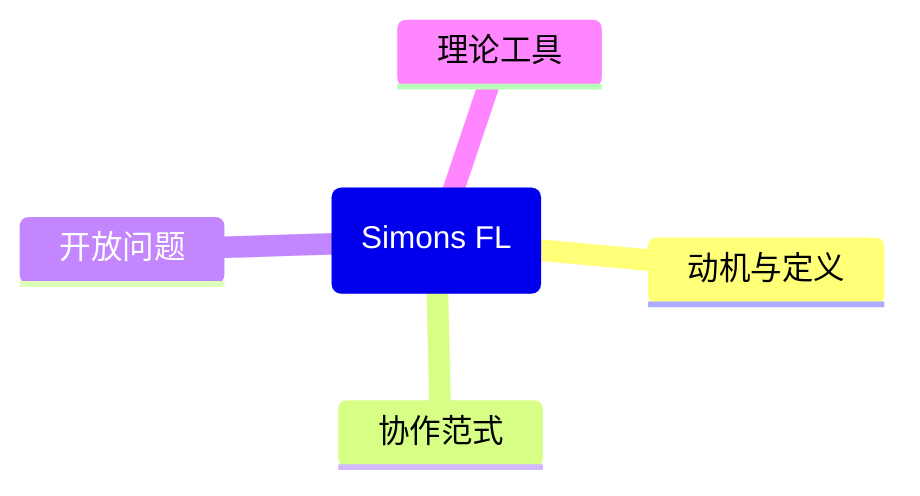

# P07 【Simons Institute】联邦学习&协作学习 (1)

← [[BV1q4421A72h-总览]] | ← [[P06-带有“正式用户级”差分隐私保证的联邦学习]] | 下一篇 → [[P08-SimonsInstitute联邦学习&协作学习]]

## 视频信息

| 项目 | 内容 |
|------|------|
| 分集 | 【Simons Institute】联邦学习&协作学习 (1) |
| 模块 | Simons Institute 工作坊 |
| 时长 | 54 分 33 秒 |
| 链接 | [B 站 P7](https://www.bilibili.com/video/BV1q4421A72h?p=7) |
| 内容来源 | 教程级知识点增强（非 UP 逐字转写） |

## 核心要点

1. **本 P 主题**：【Simons Institute】联邦学习&协作学习 (1)
2. **模块定位**：Simons Institute 工作坊
3. **研读侧重**：Simons 问题版图、协作范式、开放问题
4. **笔记层级**：教程级（约 2549 字），含速览、Mermaid、Walkthrough、自测题
5. **学习建议**：先读「3 分钟速览」与「图解」，再深入「详细讲解」

> 以下内容基于联邦学习、差分隐私与协作学习理论体系撰写，对应 B 站分 P「【Simons Institute】联邦学习&协作学习 (1)」。**非 UP 逐字转写**；不看视频可建立框架，看视频对照「与视频对照表」。

## 本节在系列中的位置

**模块**：Simons Institute · **P07/15**（工作坊 1/6）。

**前置**：[[P01-FederatedLearning简介]]–[[P03-IntroductiontoFederatedLearning]]。

**后续**：[[P08-【SimonsInstitute】联邦学习&协作学习2]] → … → [[P12-【SimonsInstitute】联邦学习&协作学习6]]。

## 3 分钟速览

Simons 工作坊开幕：FL/协作学习问题版图、分布式优化视角、开放问题。偏**学术地图**，配合笔记建立研究索引。

## 零基础导读

Simons 讲座信息密度高、证明快。建议**第一遍建地图**（记下主题与引用），第二遍针对感兴趣定理回看。与 P01–P03 入门对照填术语。

## 详细讲解

### 1. Simons Institute 系列定位

加州大学伯克利 **Simons Institute** 长期举办理论计算机与机器学习交叉研讨。本系列 P07–P12 收录「联邦学习 & 协作学习」工作坊讲座，偏**学术前沿与问题版图**，与 P01–P06 入门/专题形成互补。

### 2. 第一讲典型主题（P07）

工作坊开幕讲通常覆盖：
- **问题动机**：数据孤岛、监管、算力分布
- **形式化定义**：分布式优化视角下的 FL
- **开放问题**：收敛率、Non-IID、公平性、可验证性
- **与经典分布式 ML 对比**：BSP vs 异步、容错

### 3. 协作学习的多种形式

| 范式 | 数据移动 | 计算位置 | 代表工作 |
|------|----------|----------|----------|
| 横向联邦 | 不动 | 各方本地 | FedAvg |
| 纵向联邦 | 不动（特征分割） | 各方本地+安全协议 | FATE、SecureBoost |
| 分割学习 | 激活值交换 | 分段 | U-shaped SL |
| MPC 训练 | 秘密分享 | 交互式 | 安全神经网络 |

### 4. 理论工具箱

- **分布式凸优化**：ADMM、局部 SGD 分析
- **统计学习**：泛化界、域适应
- **博弈与激励**：诚实报告、贡献度量
- **隐私**：DP、MPC、密码学复杂度

### 5. 学习建议（P07）

1. 记录演讲者列出的 **3 个开放问题**
2. 对照 P01–P03 填补术语空白
3. 标记与后续 P09（隐私安全综述）、P11（优化综述）的引用关系
4. 不必一次听懂证明，先建立**研究地图**

### 6. 推荐跟进阅读清单

| 优先级 | 文献/资源 | 为何读 |
|--------|-----------|--------|
| 高 | Kairouz et al., *Open Problems in FL* | 与开幕讲开放问题呼应 |
| 高 | McMahan, FedAvg 原论文 | 落实 P03 算法细节 |
| 中 | Simons 官网工作坊录像页 | 查讲义 slide |
| 中 | Flower / FedML 文档 | 工程实现对照 |

### 7. 本集学习要点

- 概括 Simons 工作坊在系列中的角色
- 列举协作学习四种范式之一并举例
- 说明 FL 作为分布式优化问题的目标函数形式
- 建立个人「开放问题」笔记页，供 P12 复盘勾选

### Simons 六讲建议节奏

每周 1–2 讲：P07–P08 通识 → P09 安全 → P10 专题 → P11 优化 → P12 展望。每讲留 30min 暂停做笔记表。

### 分布式优化视角公式

全局目标 $\min_w f(w)=\sum_k p_k f_k(w)$ 中，客户端 $k$ 只见 $f_k$。联邦 = 在**不能计算全局梯度**条件下，用局部梯度采样估计 $\nabla f(w)$。与数据中心 SGD 差别：梯度估计有方差（采样+Non-IID）且需**通信**同步 $w$。

## 图解

## 类比与直觉

Simons 系列像**学术 GPS 全景图**：先标出山脉（开放问题）与公路（算法族），再决定爬哪座山（深读论文）。

## 例题与场景 Walkthrough

**观看 P07 笔记模板**

| 时间戳 | 主题 | 关键词 | 跟进论文 |
|--------|------|--------|----------|
| 0–15m | 动机 | 数据孤岛 | Kairouz survey |
| … | … | … | … |

## 常见误区

1. **一次听懂全部证明**：工作坊允许分批消化。
2. **Simons 偏理论无工程价值**：版图指导算法选型与合规叙事。
3. **跳过 P07 直接 P09**：失去上下文串联。

## 与视频对照表

| 视频段落（约） | 预期演示内容 | 笔记对应章节 |
|-------------|------------|------------|
| 开篇 0%–15% | 本集目标、背景、与前后集关系 | 本节位置、3 分钟速览 |
| 前段 15%–40% | 核心概念定义与架构图 | 零基础导读、详细讲解 |
| 中段 40%–70% | 原理展开、对比、政策/代码示例 | 图解、类比、Walkthrough |
| 后段 70%–90% | 案例、问答、易错点 | 常见误区、Checklist |
| 收尾 90%–100% | 总结、延伸资源 | 延伸阅读、自测题 |

> 本集总时长约 **54分33秒**。无官方外挂字幕时，以分 P 标题「【Simons Institute】联邦学习&协作学习 (1)」与上表主题对齐视频画面。

## 动手实践 Checklist

- [ ] 列出讲座 3 个开放问题
- [ ] 对照 P01 补全不熟悉的术语
- [ ] 标引到 P09/P11 综述
- [ ] 选 1 篇引用论文加入阅读清单
- [ ] 更新思维导图 Simons 分支

## 延伸阅读

- Simons Institute 官网工作坊页面
- Kairouz et al., FL Open Problems
- [[P09-【SimonsInstitute】联邦学习&协作学习3SurveyonPrivacy-SecurityinFL]]

## 自测题

1. **Simons 系列角色？**  **答**：学术前沿与问题地图。
2. **协作学习几种范式？**  **答**：横向/纵向联邦、分割学习、MPC 等。
3. **FL 优化目标一般形式？**  **答**：$\min \sum p_k f_k(w)$。
4. **开放问题例？**  **答**：Non-IID 收敛、公平性、可验证聚合等。
5. **下一集？**  **答**：P08 深入子方向。

## 关键术语

| 术语 | 说明 |
|------|------|
| 联邦学习 FL | 数据不出本地，协作训练全局模型 |
| 差分隐私 DP | 单条记录变化对输出分布影响有界 |
| 模块关键词 | Simons Institute 工作坊 |

## 与前后分 P 的衔接

- ← **带有“正式用户级”差分隐私保证的联邦学习**（[[P06-带有“正式用户级”差分隐私保证的联邦学习]]）
- → **【Simons Institute】联邦学习&协作学习 (2)**（[[P08-SimonsInstitute联邦学习&协作学习]]）

## 逐字转写

> 状态：待转写。运行 `Tools/transcribe/transcribe.ps1 -Bvid BV1q4421A72h -Part 7` 补充。

## 来源说明

- ✅ B 站官方元数据（`Tools/BV1q4421A72h-full.json`）
- ✅ 分 P 首帧封面（`Tools/bili-fetch/fetch-bilibili.js`）
- ✅ **教程级增强**：含 Mermaid、Walkthrough、自测题（约 2549 字，2026-06-06）
- ⏳ 逐字转写：B 站 API 无外挂字幕轨；可选 Whisper/BiliNote 后续补充

## 关键截图

![[../../06-资源附件/video-notes-images/BV1q4421A72h-P07-cover.jpg|B站首帧 P07]]
