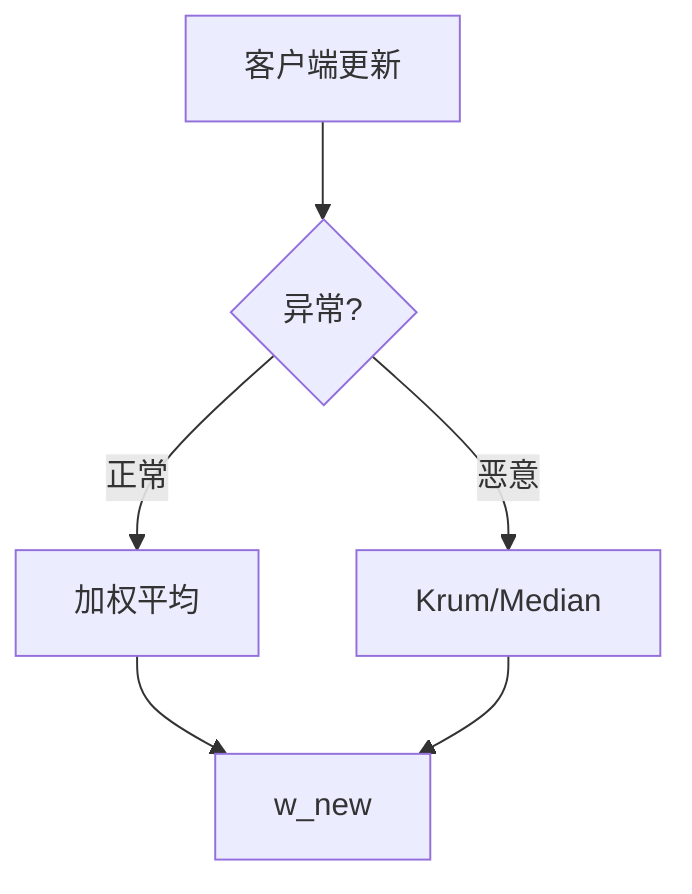

# P08 【Simons Institute】联邦学习&协作学习 (2)

← [[BV1q4421A72h-总览]] | ← [[P07-SimonsInstitute联邦学习&协作学习]] | 下一篇 → [[P09-SimonsInstitute联邦学习&协作学习3SurveyonPrivacy-Secu]]

## 视频信息

| 项目 | 内容 |
|------|------|
| 分集 | 【Simons Institute】联邦学习&协作学习 (2) |
| 模块 | Simons Institute 工作坊 |
| 时长 | 48 分 21 秒 |
| 链接 | [B 站 P8](https://www.bilibili.com/video/BV1q4421A72h?p=8) |
| 内容来源 | 教程级知识点增强（非 UP 逐字转写） |

## 核心要点

1. **本 P 主题**：【Simons Institute】联邦学习&协作学习 (2)
2. **模块定位**：Simons Institute 工作坊
3. **研读侧重**：鲁棒聚合 Krum、个性化 FedPer、公平性
4. **笔记层级**：教程级（约 2541 字），含速览、Mermaid、Walkthrough、自测题
5. **学习建议**：先读「3 分钟速览」与「图解」，再深入「详细讲解」

> 以下内容基于联邦学习、差分隐私与协作学习理论体系撰写，对应 B 站分 P「【Simons Institute】联邦学习&协作学习 (2)」。**非 UP 逐字转写**；不看视频可建立框架，看视频对照「与视频对照表」。

## 本节在系列中的位置

**模块**：Simons Institute · **P08/15**（2/6）。

**前置**：[[P07-【SimonsInstitute】联邦学习&协作学习1]]。

**后续**：[[P09-【SimonsInstitute】联邦学习&协作学习3SurveyonPrivacy-SecurityinFL]]。

## 3 分钟速览

第二讲常见主题：鲁棒聚合、个性化联邦、异步、公平性。考点：**拜占庭容忍、FedPer、参与偏差**。

## 零基础导读

P08 往往深入**单一技术线**（因讲者而异）。用「威胁模型→算法→假设」三列表格做笔记，课后与 P09 攻击分类、P11 收敛假设交叉验证。

## 详细讲解

### 1. 第二讲常见深度方向（P08）

延续 P07 版图，第二讲往往深入**某一技术线**：可能是鲁棒联邦、个性化、异步协议或跨模态协作。核心收获是理解**问题如何被形式化**而非记忆单一结论。

### 2. 鲁棒联邦学习（若涉及）

**拜占庭客户端**可上传任意恶意更新。鲁棒聚合规则：

| 算法 | 思想 | 容忍比例 |
|------|------|----------|
| Krum / Multi-Krum | 选与邻居最近的更新 | $< \frac{n-2}{2}$ 恶意 |
| Trimmed Mean | 去掉极端坐标再平均 | 依维度 |
| Median | 坐标中位数 | 启发式鲁棒 |
| FLTrust | 服务端小可信根数据集引导 | 需锚点数据 |

### 3. 个性化联邦

全局单一模型在强 Non-IID 下性能差。**个性化**策略：
- **Fine-tune**：全局模型 + 本地微调
- **FedPer / FedRep**：共享底座 + 私有头
- **Clustered FL**：按分布聚类后组内聚合
- **Meta-learning**：MAML 式快速本地适应

### 4. 公平性与参与偏差

Cross-device 中，只有高端机用户常在线→模型偏向该人群。讲座可能讨论：
- **公平约束优化**：最小化组间损失差
- **参与率再平衡**：过采样弱势客户端
- **激励相容**：贡献证明与报酬

### 5. 异步与半同步

| 模式 | 优点 | 缺点 |
|------|------|------|
| 同步 BSP | 分析简单 | straggler |
| 半同步 | 容忍慢节点 | 陈旧梯度 |
| 完全异步 | 吞吐高 | 收敛条件严 |

### 6. 与 P11 优化综述的衔接

P08 若讲具体算法实例，P11 提供**收敛率与通信复杂度**的系统总结。阅读时把 P08 的案例标到 P11 的分类表中。

### 7. 个性化联邦快速选型

| 异质类型 | 推荐方法 | 通信开销 |
|----------|----------|----------|
| 标签偏斜 | FedPer / 聚类 FL | 中（多头或聚类） |
| 特征偏斜 | 域适应 + 全局底座 | 中 |
| 数量偏斜 | 按 $n_k$ 加权 + 公平采样 | 低 |
| 概念漂移 | 在线 FL + 遗忘 | 高 |

### 8. 本集学习要点

- 解释为何 Non-IID 需要个性化或鲁棒聚合
- 对比 Krum 与 FedAvg 的适用威胁模型
- 记录演讲中一个「开放问题」并用自己的话复述
- 将鲁棒聚合与 P09 投毒防御表合并为一页 Obsidian 对照

### 公平性检查问题

- 弱势客户端 AUC 是否系统性低于强势？
- 参与率与设备型号是否相关？
- 是否需重加权或公平约束优化？

### Krum 算法步骤（复习）

1. 计算每对客户端更新距离。
2. 对每个客户端，求与其最近的 $n-f-2$ 个邻居的距离和。
3. 选距离和最小的客户端更新作为本轮聚合结果。

其中 $f$ 为容忍恶意数。适合拜占庭比例已知且较小的 cross-silo 场景。

## 图解

## 类比与直觉

鲁棒联邦像**去掉异常评委的合唱评分**：个别恶意或走音的歌手（客户端）不应拉垮整团平均分。

## 例题与场景 Walkthrough

**鲁棒聚合选型**

| 恶意比例 | 可选算法 | 备注 |
|----------|----------|------|
| <10% | Trimmed mean | 简单 |
| 已知上界 | Krum | 需 n 足够大 |
| 有锚点数据 | FLTrust | 小根数据集 |

## 常见误区

1. **鲁棒聚合可防 DP 泄露**：否，防投毒不防推断。
2. **个性化违背联邦精神**：全局底座+本地头仍属联邦。
3. **异步一定更快**：可能损收敛。

## 与视频对照表

| 视频段落（约） | 预期演示内容 | 笔记对应章节 |
|-------------|------------|------------|
| 开篇 0%–15% | 本集目标、背景、与前后集关系 | 本节位置、3 分钟速览 |
| 前段 15%–40% | 核心概念定义与架构图 | 零基础导读、详细讲解 |
| 中段 40%–70% | 原理展开、对比、政策/代码示例 | 图解、类比、Walkthrough |
| 后段 70%–90% | 案例、问答、易错点 | 常见误区、Checklist |
| 收尾 90%–100% | 总结、延伸资源 | 延伸阅读、自测题 |

> 本集总时长约 **48分21秒**。无官方外挂字幕时，以分 P 标题「【Simons Institute】联邦学习&协作学习 (2)」与上表主题对齐视频画面。

## 动手实践 Checklist

- [ ] 填鲁棒算法对比表
- [ ] 解释个性化解决何种 Non-IID
- [ ] 记录讲者核心假设
- [ ] 与 P09 投毒防御对照
- [ ] 自测 Q1–Q3

## 延伸阅读

- Blanchard et al., Krum
- Collins et al., FedPer
- [[P11-【SimonsInstitute】联邦学习&协作学习5SurveyonOptimizationinFL]]

## 自测题

1. **Krum 思想？**  **答**：选与最近邻更新距离最小的客户端更新。
2. **FedPer 结构？**  **答**：共享底座+私有分类头。
3. **参与偏差？**  **答**：在线设备分布不代表总体。
4. **半同步？**  **答**：容忍部分 straggler 未同步。
5. **与 P11？**  **答**：P11 给收敛界，P08 给实例算法。

## 关键术语

| 术语 | 说明 |
|------|------|
| 联邦学习 FL | 数据不出本地，协作训练全局模型 |
| 差分隐私 DP | 单条记录变化对输出分布影响有界 |
| 模块关键词 | Simons Institute 工作坊 |

## 与前后分 P 的衔接

- ← **【Simons Institute】联邦学习&协作学习 (1)**（[[P07-SimonsInstitute联邦学习&协作学习]]）
- → **【Simons Institute】联邦学习&协作学习 (3) Survey on Privacy-Security in FL**（[[P09-SimonsInstitute联邦学习&协作学习3SurveyonPrivacy-Secu]]）

## 逐字转写

> 状态：待转写。运行 `Tools/transcribe/transcribe.ps1 -Bvid BV1q4421A72h -Part 8` 补充。

## 来源说明

- ✅ B 站官方元数据（`Tools/BV1q4421A72h-full.json`）
- ✅ 分 P 首帧封面（`Tools/bili-fetch/fetch-bilibili.js`）
- ✅ **教程级增强**：含 Mermaid、Walkthrough、自测题（约 2541 字，2026-06-06）
- ⏳ 逐字转写：B 站 API 无外挂字幕轨；可选 Whisper/BiliNote 后续补充

## 关键截图

![[../../06-资源附件/video-notes-images/BV1q4421A72h-P08-cover.jpg|B站首帧 P08]]
