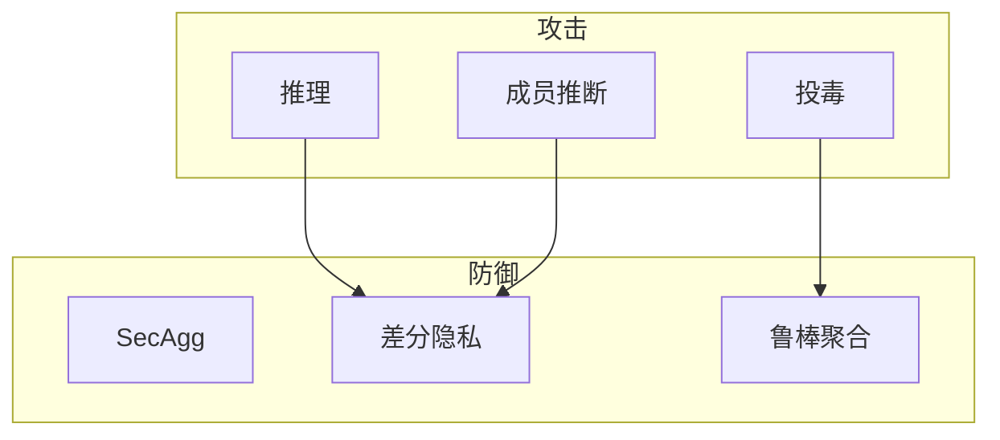

# P09 【Simons Institute】联邦学习&协作学习 (3) Survey on Privacy-Security in FL

← [[BV1q4421A72h-总览]] | ← [[P08-SimonsInstitute联邦学习&协作学习]] | 下一篇 → [[P10-SimonsInstitute联邦学习&协作学习]]

## 视频信息

| 项目 | 内容 |
|------|------|
| 分集 | 【Simons Institute】联邦学习&协作学习 (3) Survey on Privacy-Security in FL |
| 模块 | Simons Institute 工作坊 |
| 时长 | 22 分 01 秒 |
| 链接 | [B 站 P9](https://www.bilibili.com/video/BV1q4421A72h?p=9) |
| 内容来源 | 教程级知识点增强（非 UP 逐字转写） |

## 核心要点

1. **本 P 主题**：【Simons Institute】联邦学习&协作学习 (3) Survey on Privacy-Security in FL
2. **模块定位**：Simons Institute 工作坊
3. **研读侧重**：攻击分类、SecAgg+DP 组合、投毒与推断
4. **笔记层级**：教程级（约 2543 字），含速览、Mermaid、Walkthrough、自测题
5. **学习建议**：先读「3 分钟速览」与「图解」，再深入「详细讲解」

> 以下内容基于联邦学习、差分隐私与协作学习理论体系撰写，对应 B 站分 P「【Simons Institute】联邦学习&协作学习 (3) Survey on Privacy-Security in FL」。**非 UP 逐字转写**；不看视频可建立框架，看视频对照「与视频对照表」。

## 本节在系列中的位置

**模块**：Simons Institute · **P09/15**（隐私安全综述，3/6）。

**前置**：[[P06-带有正式用户级差分隐私保证的联邦学习]] 更佳。

**后续**：[[P10-【SimonsInstitute】联邦学习&协作学习4]] · 全系列安全设计回溯。

## 3 分钟速览

**Survey on Privacy-Security in FL**：攻击分类（反演/投毒/成员推断）、SecAgg、DP、鲁棒聚合、组合防御。系列安全**核心地图**。

## 零基础导读

建议将本集笔记做成**长期查阅的威胁-防御矩阵**。每学一个新算法，回来标注它防哪种攻击、不防哪种。

## 详细讲解

### 1. Survey on Privacy-Security in FL（本集核心）

本集是 Simons 工作坊上的**隐私与安全综述**，系统梳理联邦学习攻击面与防御谱系。适合在 P06 用户级 DP 之后，建立**全局威胁地图**。

### 2. 攻击分类

| 阶段 | 攻击类型 | 例子 |
|------|----------|------|
| 训练 | 推理攻击 | 梯度反演、属性推断 |
| 训练 | 投毒攻击 | 标签翻转、后门触发器 |
| 训练 | 模型逆向 | 从更新恢复架构 |
| 推理 | 成员推断 | 判断样本是否在训练集 |
| 推理 | 模型抽取 | 模仿 API 输出 |
| 系统 | 侧信道 | 时序、功耗泄露 |

### 3. 防御分层

```
应用层：输出扰动、访问控制、审计
算法层：DP、鲁棒聚合、异常检测
密码学层：SecAgg、HE、MPC
系统层：TEE、远程证明、安全通道
```

**没有银弹**：DP 不防投毒，鲁棒聚合不防成员推断，需**组合防御**。

### 4. 安全聚合 SecAgg

目标：服务端只得到 $\sum_k g_k$，不见个体 $g_k$。

- **掩码方案**：客户端成对共享随机掩码，聚合时抵消
- **阈值秘密分享**：掉线容忍
- **复杂度**：$O(K^2)$ 成对掩码或基于 DH 的优化

与 DP 关系：SecAgg 防**诚实但好奇**服务器；DP 防**输出泄露**。常同时使用。

### 5. 投毒与后门

**数据投毒**：恶意客户端污染本地数据→模型带后门。**模型投毒**：直接上传恶意向量。

防御：
- 范数裁剪 + 鲁棒聚合（Median、Trimmed mean）
- **联邦异常检测**：更新与历史分布偏离
- **可证明防御**：拜占庭容错界

### 6. 隐私定义谱系

| 概念 | 强度 | 备注 |
|------|------|------|
| 数据不出域 | 流程承诺 | 非形式化 |
| SecAgg | 计算过程 | 密码学假设 |
| DP | 输出分布 | 可组合预算 |
| MPC | 全程密态 | 开销大 |

### 7. 研究前沿（综述常提及）

- 可验证联邦学习（ZK 证明聚合正确）
- 联邦学习 + 区块链激励
- 大模型联邦微调隐私
- 跨设备轻量 SecAgg

### 8. 防御组合案例

**案例：移动端键盘联邦**
- 威胁：好奇服务器、梯度反演、成员推断
- 层 1：TLS + 证书固定（传输）
- 层 2：SecAgg（个体更新不可见）
- 层 3：用户级 DP（输出分布保证）
- 层 4：更新范数异常检测（轻量投毒）
- 残余：模型 API 抽取→需速率限制与水印

### 9. 本集学习要点

- 画出攻击-防御二维表并填 3 个格子
- 解释 SecAgg 与 DP 的互补关系
- 区分成员推断与梯度反演的目标差异
- 为一个业务场景写四层防御清单

### 产品安全评审必问

- 攻击者模型是谁？
- 哪些防御有形式化证明？
- 隐私预算与合规文案是否一致？
- 恶意客户端比例假设？

## 图解



## 类比与直觉

FL 安全像**城堡防御**：护城河（加密通道）、城墙（SecAgg）、哨兵（异常检测）、烟雾弹（DP）——单层被破不代表全线失守，但需多层协同。

## 例题与场景 Walkthrough

**威胁建模工作坊**

1. 选场景：手机键盘联邦学习。
2. 列攻击者：好奇服务器、恶意客户端、API 查询者。
3. 从 P09 表选防御层叠：SecAgg + DP + 鲁棒聚合。
4. 标未覆盖风险：侧信道、模型抽取。
5. 写残余风险说明给产品。

## 常见误区

1. **SecAgg=完全隐私**：仍可能成员推断，需 DP。
2. **DP 防投毒**：否。
3. **「数据不出域」=安全**：梯度仍可泄露。

## 与视频对照表

| 视频段落（约） | 预期演示内容 | 笔记对应章节 |
|-------------|------------|------------|
| 开篇 0%–15% | 本集目标、背景、与前后集关系 | 本节位置、3 分钟速览 |
| 前段 15%–40% | 核心概念定义与架构图 | 零基础导读、详细讲解 |
| 中段 40%–70% | 原理展开、对比、政策/代码示例 | 图解、类比、Walkthrough |
| 后段 70%–90% | 案例、问答、易错点 | 常见误区、Checklist |
| 收尾 90%–100% | 总结、延伸资源 | 延伸阅读、自测题 |

> 本集总时长约 **22分01秒**。无官方外挂字幕时，以分 P 标题「【Simons Institute】联邦学习&协作学习 (3) Survey on Privacy-Security in FL」与上表主题对齐视频画面。

## 动手实践 Checklist

- [ ] 画攻击-防御二维表
- [ ] 读 Bonawitz SecAgg 论文摘要
- [ ] 对照 [[P06]] 用户级 DP
- [ ] 列 3 个残余风险
- [ ] 完成自测

## 延伸阅读

- Bonawitz et al., Practical Secure Aggregation
- Nasr et al., Comprehensive Privacy Analysis of FL
- [[P06-带有正式用户级差分隐私保证的联邦学习]]

## 自测题

1. **梯度反演目标？**  **答**：从梯度恢复训练样本。
2. **SecAgg 输出？**  **答**：仅聚合和，不见个体。
3. **后门投毒？**  **答**：植入触发器致误分类。
4. **成员推断？**  **答**：判断样本是否在训练集。
5. **组合防御例？**  **答**：SecAgg + 用户级 DP + Trimmed mean。

## 关键术语

| 术语 | 说明 |
|------|------|
| 联邦学习 FL | 数据不出本地，协作训练全局模型 |
| 差分隐私 DP | 单条记录变化对输出分布影响有界 |
| 梯度反演 | 从更新恢复样本 |
| 成员推断 | 判断是否参与训练 |

## 与前后分 P 的衔接

- ← **【Simons Institute】联邦学习&协作学习 (2)**（[[P08-SimonsInstitute联邦学习&协作学习]]）
- → **【Simons Institute】联邦学习&协作学习 (4)**（[[P10-SimonsInstitute联邦学习&协作学习]]）

## 逐字转写

> 状态：待转写。运行 `Tools/transcribe/transcribe.ps1 -Bvid BV1q4421A72h -Part 9` 补充。

## 来源说明

- ✅ B 站官方元数据（`Tools/BV1q4421A72h-full.json`）
- ✅ 分 P 首帧封面（`Tools/bili-fetch/fetch-bilibili.js`）
- ✅ **教程级增强**：含 Mermaid、Walkthrough、自测题（约 2543 字，2026-06-06）
- ⏳ 逐字转写：B 站 API 无外挂字幕轨；可选 Whisper/BiliNote 后续补充

## 关键截图

![[../../06-资源附件/video-notes-images/BV1q4421A72h-P09-cover.jpg|B站首帧 P09]]
