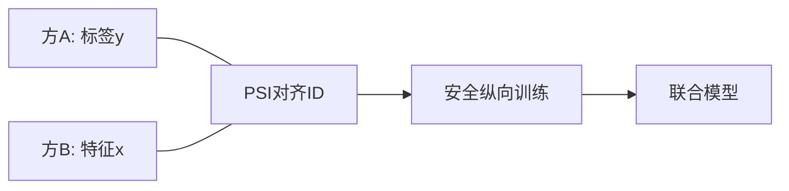

# P10 【Simons Institute】联邦学习&协作学习 (4)

← [[BV1q4421A72h-总览]] | ← [[P09-SimonsInstitute联邦学习&协作学习3SurveyonPrivacy-Secu]] | 下一篇 → [[P11-SimonsInstitute联邦学习&协作学习5SurveyonOptimization]]

## 视频信息

| 项目 | 内容 |
|------|------|
| 分集 | 【Simons Institute】联邦学习&协作学习 (4) |
| 模块 | Simons Institute 工作坊 |
| 时长 | 61 分 11 秒 |
| 链接 | [B 站 P10](https://www.bilibili.com/video/BV1q4421A72h?p=10) |
| 内容来源 | 教程级知识点增强（非 UP 逐字转写） |

## 核心要点

1. **本 P 主题**：【Simons Institute】联邦学习&协作学习 (4)
2. **模块定位**：Simons Institute 工作坊
3. **研读侧重**：纵向联邦、异质目标函数、合规遗忘
4. **笔记层级**：教程级（约 2590 字），含速览、Mermaid、Walkthrough、自测题
5. **学习建议**：先读「3 分钟速览」与「图解」，再深入「详细讲解」

> 以下内容基于联邦学习、差分隐私与协作学习理论体系撰写，对应 B 站分 P「【Simons Institute】联邦学习&协作学习 (4)」。**非 UP 逐字转写**；不看视频可建立框架，看视频对照「与视频对照表」。

## 本节在系列中的位置

**模块**：Simons Institute · **P10/15**（4/6）。

**前置**：[[P09-【SimonsInstitute】联邦学习&协作学习3SurveyonPrivacy-SecurityinFL]]。

**后续**：[[P11-【SimonsInstitute】联邦学习&协作学习5SurveyonOptimizationinFL]]。

## 3 分钟速览

工作坊中段深度讲：可能涵盖纵向联邦、异质性形式化、合规伦理、通信-隐私联合设计。用**讲者笔记模板**跟进。

## 零基础导读

P10 主题因讲者而异。本文提供**纵向联邦 + 异质性 + 合规**框架；观看时把讲者定理填入模板表，并与 P03/P11 公式对齐。

## 详细讲解

### 1. 第四讲在系列中的角色（P10）

Simons 工作坊中段讲座通常聚焦**具体子领域深度**：可能涵盖垂直联邦、统计异质性理论、或法律伦理维度。本笔记提供通用框架，便于你对照视频中的具体讲者主题做标注。

### 2. 纵向联邦（若讲座涉及）

各方特征空间不同、样本 ID 对齐：
- 银行有标签 $y$，电商有特征 $x$
- **实体对齐**：PSI 求交集 ID
- **训练**：梯度在标签方与特征方之间安全传递（同态、秘密分享、或明文协议+合规）

与横向联邦对比：

| | 横向 | 纵向 |
|--|------|------|
| 样本空间 | 重叠 | 重叠 |
| 特征空间 | 重叠 | 互补 |
| 典型算法 | FedAvg | SecureBoost、SplitNN |

### 3. 统计异质性的形式化

设客户端 $k$ 数据分布 $\mathcal{D}_k$，全局目标：
$$\min_w \sum_k p_k F_k(w), \quad F_k(w) = \mathbb{E}_{\mathcal{D}_k}[\ell(w; z)]$$

当 $\mathcal{D}_k$ 差异大时，**单一 $w$** 可能不存在好的帕累托点。引出：
- 个性化模型 $w_k$
- 域适应损失
- 知识蒸馏对齐全局表示

### 4. 通信与隐私的联合设计

讲座可能讨论**不能先优化通信再贴隐私**，而需联合：
- 量化 + SecAgg 的掩码兼容性
- DP 噪声对鲁棒聚合的影响（噪声被误认为攻击）
- 压缩是否放大隐私泄露（反演更容易？）

### 5. 合规与伦理

- GDPR「数据最小化」与模型更新是否算个人数据
- 用户撤回权：如何从已训练模型中「遗忘」用户（联邦遗忘学习）
- 算法歧视审计在联邦场景的困难

### 6. 学习笔记模板

观看 P10 时建议记录：

| 字段 | 你的笔记 |
|------|----------|
| 讲者机构 | |
| 核心定理/结论 | |
| 假设条件（IID? 凸?） | |
| 与 P09 攻击类型的关联 | |
| 一项可跟进论文 | |

### 7. 用户遗忘与合规

**联邦遗忘**（Machine Unlearning）需求：用户行使删除权时，需削弱其对全局模型的影响。
- **重训**：成本高但干净
- **梯度上升抹除**：近似遗忘
- **隔离 shard 训练**：仅重训含该用户 shard

与纵向联邦交叉：特征方、标签方可能对同一用户持有不同片段，需**联合删除协议**。

### 8. 本集学习要点

- 对比横向与纵向联邦的数据布局
- 写出全局联邦目标函数的一般形式
- 说明为何异质性需要个性化或域适应
- 列举一项 GDPR 类合规问题在 FL 中的技术回应

### 讲者笔记模板（观看时填写）

| 字段 | 内容 |
|------|------|
| 讲者/机构 | |
| 核心结论 | |
| 假设 | |
| 引用 P09 攻击 | |
| 论文链接 | |

### 纵向联邦训练一步（概念）

1. 特征方计算中间嵌入 $h=\sigma(Wx)$。
2. 安全协议将 $h$ 传给标签方（同态/秘密分享/TEE）。
3. 标签方算损失对 $h$ 的梯度并回传。
4. 各方更新各自参数；**原始 $x$ 与 $y$ 不交叉暴露**。

## 图解

## 类比与直觉

纵向联邦像**两家拼图厂各持不同切片**：只有拼合处（PSI 对齐 ID）相同，拼出完整图（模型）但各自仍不知对方整图内容。

## 例题与场景 Walkthrough

**纵向风控联合建模**

1. 银行有标签 y，电商有特征 x。
2. PSI 对齐 user_id。
3. 安全协议交换梯度或密态中间值。
4. 标签方更新头，特征方更新底座。
5. 审计日志与用途绑定。

## 常见误区

1. **纵向=横向换名**：数据布局完全不同。
2. **PSI 后可直接明文合并**：仅 ID 交集，特征仍分割。
3. **忽视遗忘权**：用户撤回需联邦遗忘机制。

## 与视频对照表

| 视频段落（约） | 预期演示内容 | 笔记对应章节 |
|-------------|------------|------------|
| 开篇 0%–15% | 本集目标、背景、与前后集关系 | 本节位置、3 分钟速览 |
| 前段 15%–40% | 核心概念定义与架构图 | 零基础导读、详细讲解 |
| 中段 40%–70% | 原理展开、对比、政策/代码示例 | 图解、类比、Walkthrough |
| 后段 70%–90% | 案例、问答、易错点 | 常见误区、Checklist |
| 收尾 90%–100% | 总结、延伸资源 | 延伸阅读、自测题 |

> 本集总时长约 **61分11秒**。无官方外挂字幕时，以分 P 标题「【Simons Institute】联邦学习&协作学习 (4)」与上表主题对齐视频画面。

## 动手实践 Checklist

- [ ] 填讲者笔记模板表
- [ ] 画横向 vs 纵向数据示意图
- [ ] 列一项合规问题
- [ ] 与 [[P24-联邦学习FL]] 产业课对照
- [ ] 自测

## 延伸阅读

- Yang et al., Federated Machine Learning (2019)
- 纵向联邦 SecureBoost 相关文献
- [[P11-【SimonsInstitute】联邦学习&协作学习5SurveyonOptimizationinFL]]

## 自测题

1. **纵向联邦布局？**  **答**：样本 ID 重叠、特征空间互补。
2. **PSI 作用？**  **答**：隐私求交对齐样本。
3. **全局目标一般式？**  **答**：$\min \sum p_k F_k(w)$。
4. **DP+压缩交互？**  **答**：需联合调参，防精度崩溃。
5. **下一集？**  **答**：P11 优化综述。

## 关键术语

| 术语 | 说明 |
|------|------|
| 联邦学习 FL | 数据不出本地，协作训练全局模型 |
| 差分隐私 DP | 单条记录变化对输出分布影响有界 |
| 模块关键词 | Simons Institute 工作坊 |

## 与前后分 P 的衔接

- ← **【Simons Institute】联邦学习&协作学习 (3) Survey on Privacy-Security in FL**（[[P09-SimonsInstitute联邦学习&协作学习3SurveyonPrivacy-Secu]]）
- → **【Simons Institute】联邦学习&协作学习 (5) Survey on Optimization in FL**（[[P11-SimonsInstitute联邦学习&协作学习5SurveyonOptimization]]）

## 逐字转写

> 状态：待转写。运行 `Tools/transcribe/transcribe.ps1 -Bvid BV1q4421A72h -Part 10` 补充。

## 来源说明

- ✅ B 站官方元数据（`Tools/BV1q4421A72h-full.json`）
- ✅ 分 P 首帧封面（`Tools/bili-fetch/fetch-bilibili.js`）
- ✅ **教程级增强**：含 Mermaid、Walkthrough、自测题（约 2590 字，2026-06-06）
- ⏳ 逐字转写：B 站 API 无外挂字幕轨；可选 Whisper/BiliNote 后续补充

## 关键截图

![[../../06-资源附件/video-notes-images/BV1q4421A72h-P10-cover.jpg|B站首帧 P10]]
