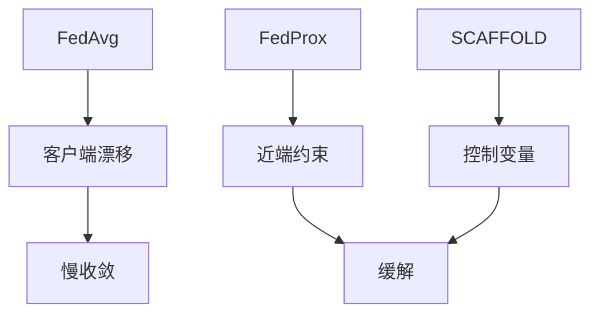

# P11 【Simons Institute】联邦学习&协作学习 (5) Survey on Optimization in FL

← [[BV1q4421A72h-总览]] | ← [[P10-SimonsInstitute联邦学习&协作学习]] | 下一篇 → [[P12-SimonsInstitute联邦学习&协作学习]]

## 视频信息

| 项目 | 内容 |
|------|------|
| 分集 | 【Simons Institute】联邦学习&协作学习 (5) Survey on Optimization in FL |
| 模块 | Simons Institute 工作坊 |
| 时长 | 54 分 38 秒 |
| 链接 | [B 站 P11](https://www.bilibili.com/video/BV1q4421A72h?p=11) |
| 内容来源 | 教程级知识点增强（非 UP 逐字转写） |

## 核心要点

1. **本 P 主题**：【Simons Institute】联邦学习&协作学习 (5) Survey on Optimization in FL
2. **模块定位**：Simons Institute 工作坊
3. **研读侧重**：FedProx/SCAFFOLD、收敛界、通信复杂度
4. **笔记层级**：教程级（约 2752 字），含速览、Mermaid、Walkthrough、自测题
5. **学习建议**：先读「3 分钟速览」与「图解」，再深入「详细讲解」

> 以下内容基于联邦学习、差分隐私与协作学习理论体系撰写，对应 B 站分 P「【Simons Institute】联邦学习&协作学习 (5) Survey on Optimization in FL」。**非 UP 逐字转写**；不看视频可建立框架，看视频对照「与视频对照表」。

## 本节在系列中的位置

**模块**：Simons Institute · **P11/15**（优化综述，5/6）。

**前置**：[[P03-IntroductiontoFederatedLearning]]、[[P04-联邦学习中的高效通信优化方法]]。

**后续**：[[P14-【ICML_22】【PeterRichtarik】联邦学习中本地梯度步骤可证明导致通信加速]] · [[P12-【SimonsInstitute】联邦学习&协作学习6]]。

## 3 分钟速览

**Survey on Optimization in FL**：FedProx、SCAFFOLD、FedDyn、收敛界、通信复杂度、本地步 $E$ 角色。理论中枢。

## 零基础导读

本集连接**实践调参**与**理论界**。不必手推证明，但要能读懂收敛界中 $\zeta$（异质性）、$E$（本地步）、$|S_t|$（采样）如何影响轮次。

## 详细讲解

### 1. Survey on Optimization in FL（本集核心）

本集综述联邦学习**优化算法与收敛理论**，回答：在 Non-IID、部分参与、本地多步条件下，什么算法以多快的速度、多少通信轮次达到多高的精度？

### 2. 问题形式化

$$\min_{w \in \mathbb{R}^d} f(w) := \sum_{k=1}^K p_k f_k(w)$$

客户端 $k$ 只能访问 $f_k$。每轮仅子集 $S_t$ 参与，各做 $E$ 步本地 SGD。目标：找 $\varepsilon$-驻点或 $\varepsilon$-最优，**通信轮次 $T$ 尽量小**。

### 3. 算法族谱

| 算法 | 关键机制 | 针对问题 |
|------|----------|----------|
| FedAvg | 加权平均 | 基线 |
| FedProx | 近端 $\|w-w_t\|^2$ | 客户端漂移 |
| SCAFFOLD | 控制变量 $c_k, c$ | 梯度异质性 |
| FedDyn | 动态正则对齐 | 收敛精度 |
| MIME / FedOpt | 服务端 Adam 等 | 自适应全局更新 |
| Local SGD | 本地步 + 稀疏通信 | 通信加速（见 P14） |

### 4. 收敛影响因素

- **数据异质性** $\zeta$：$\|\nabla f_k(w) - \nabla f(w)\|$
- **部分参与**：$|S_t|/K$ 越小方差越大
- **本地步数 $E$**：过大加剧漂移
- **光滑性/凸性**：凸问题有更强界
- **条件数** $\kappa$：影响所需轮次

典型非凸界形如：
$$\mathbb{E}\|\nabla f(w_T)\|^2 \le O\left(\frac{1}{\sqrt{KT}} + \frac{E\zeta^2}{T}\right)$$
（示意，非精确常数）

### 5. 通信复杂度视角

定义达到 $\varepsilon$ 精度所需**总通信比特或轮次**。综述比较：
- 全参与 vs 采样
- 1-bit / Top-k 是否保持收敛率阶
- 是否达到**中心化 SGD 下界**

### 6. 实践调参指南

| 现象 | 可能原因 | 尝试 |
|------|----------|------|
| 损失震荡 | 异质性+大 $E$ | FedProx、减 $E$ |
| 收敛极慢 | 学习率/采样率 | FedOpt、增参与 |
| 精度天花板 | 单一全局模型 | 个性化、聚类 |
| 通信爆炸 | 每轮全传 | 压缩+P14 本地步 |

### 7. 与 P04、P14 的关系

- **P04**：工程压缩技巧
- **P11**：理论收敛与轮次界
- **P14**：本地梯度步**可证明**减少通信——优化综述的自然延伸

### 8. 本集学习要点

- 默写联邦优化目标函数
- 列举 FedProx 与 SCAFFOLD 各解决什么偏差
- 解释本地步数 $E$ 在收敛界中的角色

### 调参对照 P11

| 界提示 $E$ 过大 | 界提示 $\zeta$ 大 | 行动 |
|-----------------|-------------------|------|
| 减 $E$ | FedProx/SCAFFOLD | 查验证损失 |
| 增参与 | 个性化 | 避免盲目加轮次 |

## 图解

## 类比与直觉

优化综述像**交通规划图**：告诉你哪条路（算法）在多堵（Non-IID）、少红绿灯（通信轮次）时最快，而不是只教你怎么踩油门。

## 例题与场景 Walkthrough

**读收敛界 checklist**

1. 标凸/非凸假设。
2. 找异质性项 $\zeta$ 系数。
3. 看 $E$ 是否线性进入漂移项。
4. 对比 FedAvg vs FedProx 界差异。
5. 映射到 P14 通信加速定理。

## 常见误区

1. **界紧=实践最优**：常数大，需实验验证。
2. **忽略部分参与**：界中 $|S_t|$ 关键。
3. **SCAFFOLD 无额外成本**：控制变量需存储通信。

## 与视频对照表

| 视频段落（约） | 预期演示内容 | 笔记对应章节 |
|-------------|------------|------------|
| 开篇 0%–15% | 本集目标、背景、与前后集关系 | 本节位置、3 分钟速览 |
| 前段 15%–40% | 核心概念定义与架构图 | 零基础导读、详细讲解 |
| 中段 40%–70% | 原理展开、对比、政策/代码示例 | 图解、类比、Walkthrough |
| 后段 70%–90% | 案例、问答、易错点 | 常见误区、Checklist |
| 收尾 90%–100% | 总结、延伸资源 | 延伸阅读、自测题 |

> 本集总时长约 **54分38秒**。无官方外挂字幕时，以分 P 标题「【Simons Institute】联邦学习&协作学习 (5) Survey on Optimization in FL」与上表主题对齐视频画面。

## 动手实践 Checklist

- [ ] 列表对比 FedAvg/FedProx/SCAFFOLD
- [ ] 抄录一个示意收敛界并解释各项
- [ ] 对照 P14 本地步定理
- [ ] 用 FedML 跑 Non-IID 划分实验
- [ ] 自测

## 延伸阅读

- Wang et al., FedProx
- Karimireddy et al., SCAFFOLD
- [[P14-【ICML_22】【PeterRichtarik】联邦学习中本地梯度步骤可证明导致通信加速]]

## 自测题

1. **FedProx 解决？**  **答**：客户端漂移。
2. **SCAFFOLD 机制？**  **答**：控制变量校正梯度偏差。
3. **$\zeta$ 含义？**  **答**：本地与全局梯度差异上界。
4. **通信复杂度关注？**  **答**：达 $\varepsilon$ 精度的轮次/比特。
5. **与 P04？**  **答**：P11 理论，P04 工程压缩。

## 关键术语

| 术语 | 说明 |
|------|------|
| 联邦学习 FL | 数据不出本地，协作训练全局模型 |
| 差分隐私 DP | 单条记录变化对输出分布影响有界 |
| FedProx | 近端项抑制漂移 |
| SCAFFOLD | 控制变量校正 |

## 与前后分 P 的衔接

- ← **【Simons Institute】联邦学习&协作学习 (4)**（[[P10-SimonsInstitute联邦学习&协作学习]]）
- → **【Simons Institute】联邦学习&协作学习 (6)**（[[P12-SimonsInstitute联邦学习&协作学习]]）

## 逐字转写

> 状态：待转写。运行 `Tools/transcribe/transcribe.ps1 -Bvid BV1q4421A72h -Part 11` 补充。

## 来源说明

- ✅ B 站官方元数据（`Tools/BV1q4421A72h-full.json`）
- ✅ 分 P 首帧封面（`Tools/bili-fetch/fetch-bilibili.js`）
- ✅ **教程级增强**：含 Mermaid、Walkthrough、自测题（约 2752 字，2026-06-06）
- ⏳ 逐字转写：B 站 API 无外挂字幕轨；可选 Whisper/BiliNote 后续补充

## 关键截图

![[../../06-资源附件/video-notes-images/BV1q4421A72h-P11-cover.jpg|B站首帧 P11]]
