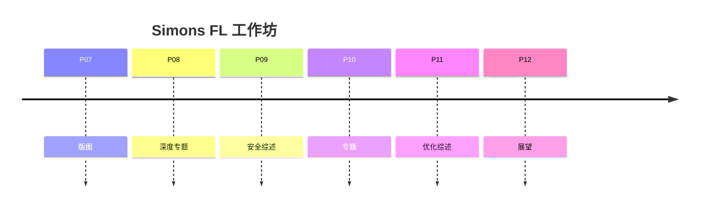

# P12 【Simons Institute】联邦学习&协作学习 (6)

← [[BV1q4421A72h-总览]] | ← [[P11-SimonsInstitute联邦学习&协作学习5SurveyonOptimization]] | 下一篇 → [[P13-Umich在线学习与查分隐私之间的联系]]

## 视频信息

| 项目 | 内容 |
|------|------|
| 分集 | 【Simons Institute】联邦学习&协作学习 (6) |
| 模块 | Simons Institute 工作坊 |
| 时长 | 62 分 11 秒 |
| 链接 | [B 站 P12](https://www.bilibili.com/video/BV1q4421A72h?p=12) |
| 内容来源 | 教程级知识点增强（非 UP 逐字转写） |

## 核心要点

1. **本 P 主题**：【Simons Institute】联邦学习&协作学习 (6)
2. **模块定位**：Simons Institute 工作坊
3. **研读侧重**：去中心化 FL、大模型联邦、benchmark
4. **笔记层级**：教程级（约 2503 字），含速览、Mermaid、Walkthrough、自测题
5. **学习建议**：先读「3 分钟速览」与「图解」，再深入「详细讲解」

> 以下内容基于联邦学习、差分隐私与协作学习理论体系撰写，对应 B 站分 P「【Simons Institute】联邦学习&协作学习 (6)」。**非 UP 逐字转写**；不看视频可建立框架，看视频对照「与视频对照表」。

## 本节在系列中的位置

**模块**：Simons Institute · **P12/15**（6/6 收束）。

**前置**：P07–P11 至少浏览。

**后续**：[[P13-【Umich】在线学习与查分隐私之间的联系]]（理论）或 [[P14]]（通信加速论文）。

## 3 分钟速览

工作坊展望：去中心化 FL、大模型联邦、benchmark、产学研鸿沟。用于**系列复盘**与选题。

## 零基础导读

P12 适合**总结 Simons 线程**：用两张表（威胁-防御、算法-假设）自查空白，再选 P13/P14/P15 深入。

## 详细讲解

### 1. 第六讲：工作坊收束（P12）

Simons 系列最后一讲常为**圆桌、展望或综合案例**，把 P07–P11 的线程收束为可执行研究议程。

### 2. 联邦学习研究议程（常见总结）

| 方向 | 问题 |
|------|------|
| 可扩展优化 | 百万客户端、异步、去中心化拓扑 |
| 可信执行 | 可验证聚合、ZK、审计 |
| 大模型时代 | 联邦微调、参数高效方法（LoRA）通信 |
| 跨模态 | 图文、时序多源联邦 |
| 法规对齐 | 用户级 DP 产品化、遗忘权 |

### 3. 去中心化联邦（若涉及）

无需单点服务器：
- **Gossip 聚合**：客户端两两交换更新
- **区块链记账**：模型版本不可篡改
- **D-PSGD**：去中心化随机梯度

权衡：收敛分析更难，系统运维更复杂，但消除单点信任。

### 4. 联邦 + 大语言模型

参数规模 $10^9+$ 使经典 FedAvg 通信不切实际。前沿方向：
- **联邦 LoRA**：只聚合低秩适配器
- **分割微调**：部分层本地、部分共享
- **蒸馏联邦**：大模型教师在小数据客户端蒸馏

### 5. 评估基准

综述常呼吁统一 benchmark：
- **LEAF**、**FedML**、**Flower** 框架
- 数据集：FEMNIST、Shakespeare、CIFAR Non-IID 划分
- 指标：精度、通信字节、轮次、公平性、隐私预算

### 6. 从研到产鸿沟

| 研究假设 | 产业现实 |
|----------|----------|
| IID 或弱异质 | 强异质+标签缺失 |
| 固定参与 | 动态掉线 |
| 无限算力 | 手机电量限制 |
| 单一任务 | 多任务合规审计 |

### 7. 系列复盘路径

建议 P12 学完后：
1. 重读 [[思维导图]] Simons 分支
2. 用 P09 填「威胁-防御」表
3. 用 P11 填「算法-假设」表
4. 选 P13 或 P14 进入**形式化理论**深线

### 8. Simons 系列自测复盘（10 题提纲）

1. 横向与纵向联邦数据布局差异？
2. 用户级 DP 相邻关系？
3. FedProx 近端项作用？
4. SecAgg 输出可见性？
5. 本地步 $E$ 过大典型症状？
6. Top-k 为何需误差反馈？
7. 成员推断 vs 梯度反演？
8. 通信加速（P14）与量化（P04）如何互补？
9. 在线 DP 组合为何影响联邦会计？
10. 黎曼 PCA 相对欧氏 PCA 多什么约束？

### 9. 本集学习要点

- 总结 Simons 六讲三条主线（协作形式、隐私安全、优化）
- 说明去中心化联邦与经典 Server-Client 的差异
- 列举一个大模型联邦通信挑战
- 完成上表 10 题自测并标注薄弱点回相应分 P

### 产学研鸿沟对照

| 论文常假设 | 产业现实 |
|------------|----------|
| 固定 K | 动态参与 |
| 凸或弱非凸 | 深度非凸 |
| 同步 | straggler/掉线 |

### 大模型联邦 LoRA 通信粗算

LLaMA-7B 全参 ~14GB（FP16）。联邦全参每轮不可行。LoRA 秩 $r=8$ 时可训练参数常 $<1\%$，约 50–100MB 级/轮，配合量化可进一步降至 MB 级——这是 P12 展望的工程落点。

## 图解

## 类比与直觉

P12 像**学术年会闭幕**：回顾主论坛议题，发布明年研究议程——帮你决定深入哪条支线。

## 例题与场景 Walkthrough

**Simons 六讲复盘（30min）**

1. 思维导图重画 P07–P12 节点。
2. P09 表：标已懂/待补攻击防御。
3. P11 表：标已懂算法。
4. 选 1 篇跟进论文精读。
5. 规划 P13–P15 阅读顺序。

## 常见误区

1. **工作坊结束=学完 FL**：工程与合规仍需实践。
2. **大模型联邦=小模型 FedAvg 直接放大**：需 LoRA 等参效通信。
3. **benchmark 分数=产业可用**：忽略掉线与合规。

## 与视频对照表

| 视频段落（约） | 预期演示内容 | 笔记对应章节 |
|-------------|------------|------------|
| 开篇 0%–15% | 本集目标、背景、与前后集关系 | 本节位置、3 分钟速览 |
| 前段 15%–40% | 核心概念定义与架构图 | 零基础导读、详细讲解 |
| 中段 40%–70% | 原理展开、对比、政策/代码示例 | 图解、类比、Walkthrough |
| 后段 70%–90% | 案例、问答、易错点 | 常见误区、Checklist |
| 收尾 90%–100% | 总结、延伸资源 | 延伸阅读、自测题 |

> 本集总时长约 **62分11秒**。无官方外挂字幕时，以分 P 标题「【Simons Institute】联邦学习&协作学习 (6)」与上表主题对齐视频画面。

## 动手实践 Checklist

- [ ] 完成 Simons 思维导图复盘
- [ ] 填两张总结表
- [ ] 选 1 篇论文加入 Zotero
- [ ] 更新 [[思维导图]]
- [ ] 规划 P13–P15

## 延伸阅读

- LEAF benchmark paper
- FedML / Flower 文档
- [[P13-【Umich】在线学习与查分隐私之间的联系]]

## 自测题

1. **Simons 三条主线？**  **答**：协作形式、隐私安全、优化理论。
2. **去中心化 FL？**  **答**：无单点服务器，gossip 等。
3. **联邦 LLM 难点？**  **答**：参数量致通信不可行。
4. **LEAF/FedML 作用？**  **答**：标准数据集与框架 benchmark。
5. **下一步？**  **答**：P13 在线DP 或 P14 本地步理论。

## 关键术语

| 术语 | 说明 |
|------|------|
| 联邦学习 FL | 数据不出本地，协作训练全局模型 |
| 差分隐私 DP | 单条记录变化对输出分布影响有界 |
| 模块关键词 | Simons Institute 工作坊 |

## 与前后分 P 的衔接

- ← **【Simons Institute】联邦学习&协作学习 (5) Survey on Optimization in FL**（[[P11-SimonsInstitute联邦学习&协作学习5SurveyonOptimization]]）
- → **【Umich】在线学习与查分隐私之间的联系**（[[P13-Umich在线学习与查分隐私之间的联系]]）

## 逐字转写

> 状态：待转写。运行 `Tools/transcribe/transcribe.ps1 -Bvid BV1q4421A72h -Part 12` 补充。

## 来源说明

- ✅ B 站官方元数据（`Tools/BV1q4421A72h-full.json`）
- ✅ 分 P 首帧封面（`Tools/bili-fetch/fetch-bilibili.js`）
- ✅ **教程级增强**：含 Mermaid、Walkthrough、自测题（约 2503 字，2026-06-06）
- ⏳ 逐字转写：B 站 API 无外挂字幕轨；可选 Whisper/BiliNote 后续补充

## 关键截图

![[../../06-资源附件/video-notes-images/BV1q4421A72h-P12-cover.jpg|B站首帧 P12]]
